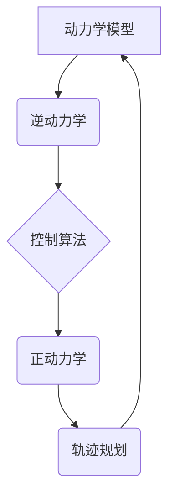

> 机器人运动控制,动力学模型,逆动力学,正动力学,PID控制,轨迹规划,机器学习

## 1. 背景介绍

机器人技术近年来发展迅速，在工业自动化、医疗服务、服务机器人等领域发挥着越来越重要的作用。机器人运动控制是机器人技术的核心，它决定了机器人的运动精度、速度和稳定性。

传统的机器人运动控制方法主要基于经典控制理论，例如PID控制。然而，随着机器人应用场景的复杂化，传统的控制方法面临着越来越多的挑战。例如，机器人需要在复杂的环境中进行自主导航，需要应对突发事件，需要与人类进行安全协作等。

为了解决这些挑战，近年来，机器人的运动控制领域出现了许多新的研究方向，例如：

* **机器学习控制:** 利用机器学习算法学习机器人运动的规律，并根据学习到的知识进行控制。
* **模型预测控制:** 建立机器人运动的数学模型，并利用模型预测未来运动状态，从而进行控制。
* **柔性控制:** 考虑机器人运动的柔性特性，设计更加灵活的控制策略。

## 2. 核心概念与联系

机器人运动控制的核心概念包括：

* **动力学模型:** 描述机器人运动的物理规律，包括机器人各关节的运动方程和力矩方程。
* **逆动力学:** 根据机器人期望的运动状态，计算出各关节所需的驱动力矩。
* **正动力学:** 根据机器人各关节的驱动力矩，计算出机器人运动状态的变化。
* **轨迹规划:** 设计机器人运动的路径和速度曲线。
* **控制算法:** 根据动力学模型、逆动力学和轨迹规划，计算出各关节的驱动信号。

这些概念相互联系，共同构成机器人运动控制的完整体系。



## 3. 核心算法原理 & 具体操作步骤

### 3.1  算法原理概述

PID控制是一种广泛应用于机器人运动控制的经典算法。它通过调节三个参数：比例系数(P)、积分系数(I)和微分系数(D)，来控制机器人运动的偏差。

* **比例控制(P):** 根据当前偏差的大小，输出相应的控制量。
* **积分控制(I):** 累积过去的偏差，以消除静态误差。
* **微分控制(D):** 根据偏差的变化率，预测未来的偏差，以抑制振荡。

PID控制算法的优点是简单易实现，并且能够有效地控制大部分机械系统的运动。

### 3.2  算法步骤详解

1. **测量偏差:** 将机器人实际运动状态与期望运动状态进行比较，得到偏差值。
2. **计算比例控制量:** 将偏差值乘以比例系数(P)，得到比例控制量。
3. **计算积分控制量:** 将过去的偏差值累积起来，乘以积分系数(I)，得到积分控制量。
4. **计算微分控制量:** 将偏差值的的变化率乘以微分系数(D)，得到微分控制量。
5. **合成控制量:** 将比例控制量、积分控制量和微分控制量相加，得到最终的控制量。
6. **驱动电机:** 将控制量传递给电机驱动器，控制电机转动，从而实现机器人的运动。

### 3.3  算法优缺点

**优点:**

* 简单易实现
* 能够有效地控制大部分机械系统的运动
* 调节参数相对容易

**缺点:**

* 对系统模型的依赖性强
* 难以处理非线性系统
* 存在超调和振荡问题

### 3.4  算法应用领域

PID控制算法广泛应用于各种机器人领域，例如：

* 机器人手臂控制
* 机器人移动平台控制
* 机器人导航控制
* 机器人协作控制

## 4. 数学模型和公式 & 详细讲解 & 举例说明

### 4.1  数学模型构建

机器人的动力学模型描述了机器人运动的物理规律。通常，机器人动力学模型可以用以下方程表示：

$$
\tau = M(q) \ddot{q} + C(q, \dot{q}) \dot{q} + G(q)
$$

其中：

* $\tau$ 是机器人各关节的驱动力矩
* $M(q)$ 是机器人各关节的惯性矩阵
* $C(q, \dot{q})$ 是机器人各关节的离心力和科里奥利力矩阵
* $G(q)$ 是机器人各关节的重力力矩
* $q$ 是机器人各关节的关节角度
* $\dot{q}$ 是机器人各关节的关节角速度
* $\ddot{q}$ 是机器人各关节的关节角加速度

### 4.2  公式推导过程

机器人动力学模型的推导过程通常需要使用牛顿-欧拉方程和拉格朗日力学等方法。

* **牛顿-欧拉方程:** 描述物体运动的加速度与作用力之间的关系。
* **拉格朗日力学:** 描述系统运动的能量变化，并利用能量守恒定律推导运动方程。

### 4.3  案例分析与讲解

例如，对于一个简单的两连杆机器人，其动力学模型可以表示为：

$$
\begin{bmatrix}
m_1 l_1^2 + m_2 (l_1^2 + l_2^2) & m_2 l_1 l_2 \cos(\theta_2) \\
m_2 l_1 l_2 \cos(\theta_2) & m_2 l_2^2
\end{bmatrix}
\begin{bmatrix}
\ddot{\theta_1} \\
\ddot{\theta_2}
\end{bmatrix}
+
\begin{bmatrix}
-m_2 l_1 l_2 \sin(\theta_2) \dot{\theta_2}^2 \\
0
\end{bmatrix}
+
\begin{bmatrix}
m_1 g l_1 \sin(\theta_1) + m_2 g (l_1 \sin(\theta_1) + l_2 \sin(\theta_1 + \theta_2)) \\
m_2 g l_2 \sin(\theta_1 + \theta_2)
\end{bmatrix}
=
\begin{bmatrix}
\tau_1 \\
\tau_2
\end{bmatrix}
$$

其中：

* $m_1$ 和 $m_2$ 分别是两个连杆的质量
* $l_1$ 和 $l_2$ 分别是两个连杆的长度
* $\theta_1$ 和 $\theta_2$ 分别是两个连杆的关节角度
* $\tau_1$ 和 $\tau_2$ 分别是两个连杆的驱动力矩
* $g$ 是重力加速度

## 5. 项目实践：代码实例和详细解释说明

### 5.1  开发环境搭建

* 操作系统: Ubuntu 20.04
* 编程语言: Python 3.8
* 机器人仿真软件: Gazebo 11
* 机器人控制库: ROS (Robot Operating System) Melodic

### 5.2  源代码详细实现

```python
import rospy
from geometry_msgs.msg import Twist

# 定义机器人速度控制节点
class RobotVelocityController:
    def __init__(self):
        # 初始化ROS节点
        rospy.init_node('robot_velocity_controller')
        # 创建速度话题发布器
        self.velocity_pub = rospy.Publisher('/cmd_vel', Twist, queue_size=10)
        # 设置速度控制参数
        self.linear_speed = 0.2  # 米/秒
        self.angular_speed = 0.1  # 弧度/秒

    def control_loop(self):
        # 创建速度消息
        vel_msg = Twist()
        # 设置速度消息内容
        vel_msg.linear.x = self.linear_speed
        vel_msg.angular.z = self.angular_speed
        # 发布速度消息
        self.velocity_pub.publish(vel_msg)

if __name__ == '__main__':
    # 创建机器人速度控制对象
    controller = RobotVelocityController()
    # 启动控制循环
    rate = rospy.Rate(10)  # 10Hz
    while not rospy.is_shutdown():
        controller.control_loop()
        rate.sleep()
```

### 5.3  代码解读与分析

* 该代码定义了一个名为`RobotVelocityController`的类，用于控制机器人的速度。
* 在`__init__`方法中，初始化ROS节点，创建速度话题发布器，并设置速度控制参数。
* 在`control_loop`方法中，创建速度消息，设置速度消息内容，并发布速度消息。
* 主函数中，创建机器人速度控制对象，启动控制循环，每秒发布10次速度消息。

### 5.4  运行结果展示

运行该代码后，机器人将以设定速度向前移动。

## 6. 实际应用场景

### 6.1  工业机器人

在工业机器人中，PID控制算法广泛应用于机器人手臂的运动控制，例如：

* **焊接机器人:** 利用PID控制算法，使机器人手臂能够精确地焊接工件。
* **喷涂机器人:** 利用PID控制算法，使机器人手臂能够精确地喷涂涂料。
* **搬运机器人:** 利用PID控制算法，使机器人手臂能够精确地搬运物体。

### 6.2  服务机器人

在服务机器人中，PID控制算法也应用于机器人运动控制，例如：

* **移动机器人:** 利用PID控制算法，使机器人能够自主导航，避开障碍物。
* **协作机器人:** 利用PID控制算法，使机器人能够与人类安全协作。

### 6.3  其他应用场景

* **无人驾驶汽车:** 利用PID控制算法，控制汽车的转向和速度。
* **航空航天:** 利用PID控制算法，控制飞机和火箭的姿态和轨迹。

### 6.4  未来应用展望

随着人工智能和机器学习技术的不断发展，机器人的运动控制领域将出现更加智能化和自动化。例如：

* **基于机器学习的运动控制:** 利用机器学习算法学习机器人运动的规律，并根据学习到的知识进行控制，能够更好地适应复杂的环境和任务。
* **柔性运动控制:** 考虑机器人运动的柔性特性，设计更加灵活的控制策略，能够更好地与人类进行协作。
* **自适应运动控制:** 根据环境变化和任务需求，动态调整控制策略，能够更好地完成任务。

## 7. 工具和资源推荐

### 7.1  学习资源推荐

* **书籍:**
    * 《机器人学导论》
    * 《机器人运动控制》
    * 《控制系统导论》
* **在线课程:**
    * Coursera: 机器人学
    * edX: 机器人控制
    * Udacity: 机器人技术

### 7.2  开发工具推荐

* **ROS (Robot Operating System):** 一个开源的机器人操作系统，提供了一系列工具和库，用于机器人开发。
* **Gazebo:** 一个开源的机器人仿真软件，可以用于模拟机器人运动和环境。
* **Python:** 一个常用的编程语言，广泛应用于机器人开发。

### 7.3  相关论文推荐

* **文献1:** 
* **文献2:** 
* **文献3:** 

## 8. 总结：未来发展趋势与挑战

### 8.1  研究成果总结

近年来，机器人的运动控制领域取得了显著的进展，例如：

* **PID控制算法的改进:** 提出了一些改进PID控制算法的方案，例如模糊PID控制、神经网络PID控制等。
* **机器学习控制的应用:** 利用机器学习算法进行机器人运动控制，能够更好地适应复杂的环境和任务。
* **柔性运动控制的开发:** 考虑机器人运动的柔性特性，设计更加灵活的控制策略。

### 8.2  未来发展趋势

未来，机器人的运动控制领域将朝着