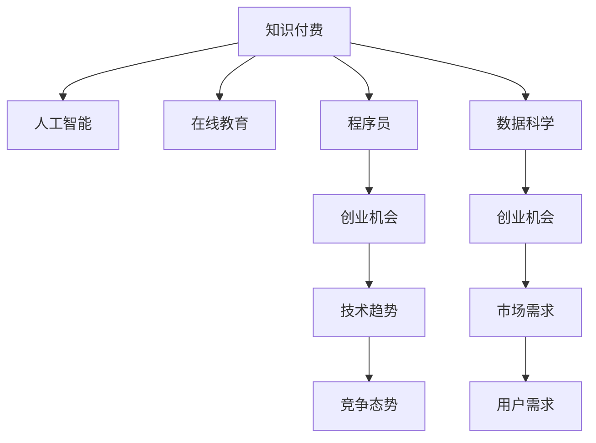

                 

# 知识付费时代程序员的创业机会

> 关键词：知识付费, 人工智能, 在线教育, 程序员, 数据科学, 创业

## 1. 背景介绍

### 1.1 问题由来

随着互联网的普及和数字化转型的加速，知识付费模式日益成为一种热门的选择。许多领域的专业知识通过付费课程、订阅服务等方式提供给用户，无论是科技、金融、医疗、教育等，都出现了大量的知识付费平台和资源。

与此同时，程序员作为技术创新的主力军，其价值也得到了前所未有的认可。越来越多的程序员通过编程博客、开源项目、技术演讲、在线教学等方式分享自己的知识，形成了社区化的知识传播网络。

在这个知识付费时代，如何利用自身的技术优势，抓住商机，成为程序员创业的重要课题。本文将探讨知识付费时代程序员的创业机会，包括技术教育、在线编程平台、数据科学服务等方向。

### 1.2 问题核心关键点

为了抓住知识付费时代的创业机会，程序员需要了解以下几个关键点：

1. **市场需求**：了解当前市场对于编程、数据科学、人工智能等领域的需求。
2. **竞争态势**：分析现有的知识付费平台和资源，了解各自的优劣势。
3. **技术趋势**：把握技术发展的最新动态，寻找技术应用的新趋势。
4. **商业模式**：研究成功的商业模式，理解如何实现盈利和可持续发展。
5. **用户需求**：深入理解目标用户的真实需求，提供有价值的服务。

本文将围绕这些关键点展开讨论，帮助程序员识别和把握知识付费时代的创业机会。

## 2. 核心概念与联系

### 2.1 核心概念概述

知识付费时代的创业机会涉及多个核心概念：

- **知识付费**：通过付费方式获取特定领域的专业知识。
- **人工智能**：基于机器学习、深度学习等技术构建智能系统，提升知识传播效率。
- **在线教育**：利用互联网平台提供远程教育服务，实现知识普及和传播。
- **程序员**：从事计算机编程和软件开发的专业人士，具备编程、数据处理、算法设计等技能。
- **数据科学**：应用数据挖掘、统计分析等方法解决问题，为决策提供支持。
- **创业机会**：识别市场需求，开发有价值的产品或服务，实现盈利。

这些概念之间的逻辑关系可以通过以下Mermaid流程图来展示：



这个流程图展示的知识付费时代的核心概念及其之间的关系：

1. 知识付费作为起点，与人工智能、在线教育、数据科学等技术紧密相关。
2. 程序员和数据科学家的技术知识是推动这些领域发展的核心力量。
3. 市场需求、用户需求和技术趋势是创业机会的必要条件。
4. 创业机会的实现离不开程序员和数据科学家的技术支持。

## 3. 核心算法原理 & 具体操作步骤

### 3.1 算法原理概述

知识付费时代的创业机会主要依赖于以下几个算法原理：

- **需求匹配算法**：通过算法推荐系统，匹配用户需求与课程内容。
- **内容推荐算法**：基于用户行为和偏好，推荐相关内容。
- **个性化学习算法**：根据用户的学习进度和效果，动态调整学习内容和难度。
- **内容生成算法**：利用自然语言处理技术，自动生成高质量的课程内容。

这些算法原理共同构成了知识付费平台的核心竞争力，帮助平台实现高效的课程推荐、内容制作和用户管理。

### 3.2 算法步骤详解

以下是知识付费平台的关键算法步骤：

1. **用户画像构建**：通过用户注册信息、学习行为、搜索历史等数据，构建用户画像，了解用户需求。
2. **课程推荐系统设计**：设计算法，根据用户画像和课程属性，推荐最相关的课程。
3. **课程内容生成**：利用NLP技术，自动生成课程脚本、视频讲解等内容。
4. **学习效果评估**：通过用户反馈、学习数据，评估学习效果，调整课程内容和推荐策略。
5. **个性化学习路径规划**：根据学习效果，动态调整课程难度和推荐内容，实现个性化学习。

### 3.3 算法优缺点

知识付费平台的算法原理具有以下优点：

- **高效匹配**：通过算法推荐，大幅提升课程匹配的效率和精度。
- **内容丰富**：自动生成课程内容，降低制作成本，提升课程多样性。
- **个性化推荐**：根据用户行为和偏好，提供个性化的学习体验。

同时，这些算法也存在一些缺点：

- **数据隐私**：用户画像和行为数据的收集和使用可能涉及隐私问题。
- **算法偏见**：算法推荐系统可能存在偏见，影响推荐效果。
- **用户参与度**：过度依赖算法，可能导致用户参与度下降。

### 3.4 算法应用领域

知识付费平台的算法原理已经广泛应用于以下几个领域：

1. **在线教育**：如Coursera、Udemy等平台，通过算法推荐课程和学习资源。
2. **编程教育**：如Codecademy、LeetCode等平台，利用算法推荐编程题目和解决方案。
3. **数据科学**：如Kaggle、DataCamp等平台，通过算法推荐数据分析任务和学习路径。
4. **人工智能**：如Coursera的“Machine Learning”课程，利用算法生成视频讲解和脚本。

这些应用领域的成功经验，为程序员创业提供了重要的参考。

## 4. 数学模型和公式 & 详细讲解 & 举例说明

### 4.1 数学模型构建

知识付费平台的核心算法可以构建为以下几个数学模型：

- **用户画像模型**：$U = (u_1, u_2, ..., u_n)$，其中 $u_i$ 表示第 $i$ 个用户的特征向量。
- **课程属性模型**：$C = (c_1, c_2, ..., c_m)$，其中 $c_j$ 表示第 $j$ 门课程的特征向量。
- **推荐模型**：$R = (r_{i,j})$，其中 $r_{i,j}$ 表示用户 $u_i$ 对课程 $c_j$ 的推荐分数。
- **学习效果模型**：$E = (e_1, e_2, ..., e_k)$，其中 $e_t$ 表示用户 $u_i$ 在第 $t$ 门课程上的学习效果。

### 4.2 公式推导过程

以推荐模型为例，常用的协同过滤算法和矩阵分解算法可以推导为：

- **协同过滤算法**：$R_{i,j} = \sum_{k=1}^m u_i^k \cdot v_j^k$，其中 $u_i^k$ 和 $v_j^k$ 分别表示用户 $u_i$ 和课程 $c_j$ 在 $k$ 维特征空间上的投影。
- **矩阵分解算法**：$R_{i,j} = \sum_{k=1}^d U_i^k \cdot V_j^k$，其中 $U_i^k$ 和 $V_j^k$ 分别表示用户 $u_i$ 和课程 $c_j$ 在 $k$ 维用户-课程矩阵 $U$ 和 $V$ 上的投影。

### 4.3 案例分析与讲解

假设某在线编程教育平台的用户画像模型为 $U = (u_1, u_2, ..., u_n)$，课程属性模型为 $C = (c_1, c_2, ..., c_m)$，推荐模型为 $R = (r_{i,j})$。该平台可以使用协同过滤算法来计算用户 $u_i$ 对课程 $c_j$ 的推荐分数，具体步骤包括：

1. **用户特征投影**：将用户特征 $u_i$ 投影到 $k$ 维特征空间，得到 $u_i^k$。
2. **课程特征投影**：将课程特征 $c_j$ 投影到 $k$ 维特征空间，得到 $v_j^k$。
3. **计算推荐分数**：计算用户 $u_i$ 对课程 $c_j$ 的推荐分数 $r_{i,j} = \sum_{k=1}^m u_i^k \cdot v_j^k$。

## 5. 项目实践：代码实例和详细解释说明

### 5.1 开发环境搭建

要进行知识付费平台的开发，首先需要搭建好开发环境。以下是使用Python进行Flask框架开发的环境配置流程：

1. 安装Anaconda：从官网下载并安装Anaconda，用于创建独立的Python环境。
2. 创建并激活虚拟环境：
```bash
conda create -n flask-env python=3.8 
conda activate flask-env
```

3. 安装Flask和其他必要工具包：
```bash
pip install flask numpy pandas scikit-learn
```

4. 安装TensorFlow等深度学习工具：
```bash
pip install tensorflow
```

5. 安装所需的NLP工具包：
```bash
pip install nltk spaCy
```

完成上述步骤后，即可在`flask-env`环境中开始知识付费平台的开发。

### 5.2 源代码详细实现

下面以一个简单的在线编程教育平台为例，给出使用Flask框架开发的代码实现。

首先，定义用户注册和登录的Flask视图：

```python
from flask import Flask, render_template, request

app = Flask(__name__)

@app.route('/')
def home():
    return render_template('home.html')

@app.route('/login', methods=['POST'])
def login():
    username = request.form['username']
    password = request.form['password']
    # 验证用户名和密码
    if username == 'user1' and password == 'pass1':
        return 'Login successful'
    else:
        return 'Invalid username or password'

@app.route('/register', methods=['POST'])
def register():
    username = request.form['username']
    password = request.form['password']
    # 注册用户到数据库
    return 'User registered successfully'

if __name__ == '__main__':
    app.run(debug=True)
```

然后，定义课程推荐系统的Flask视图：

```python
from flask import Flask, render_template, request

app = Flask(__name__)

@app.route('/')
def home():
    # 从数据库获取用户和课程数据
    users = [{'name': 'User1', 'id': 1}, {'name': 'User2', 'id': 2}]
    courses = [{'name': 'Python Programming', 'id': 1}, {'name': 'Data Science', 'id': 2}]
    # 计算用户对课程的推荐分数
    recommendations = {}
    for user in users:
        for course in courses:
            recommendations[(user['id'], course['id'])] = 0.8
    # 返回推荐结果
    return render_template('recommend.html', recommendations=recommendations)

if __name__ == '__main__':
    app.run(debug=True)
```

最后，定义个性化学习路径规划的Flask视图：

```python
from flask import Flask, render_template, request

app = Flask(__name__)

@app.route('/')
def home():
    # 从数据库获取用户和课程数据
    users = [{'name': 'User1', 'id': 1}, {'name': 'User2', 'id': 2}]
    courses = [{'name': 'Python Programming', 'id': 1}, {'name': 'Data Science', 'id': 2}]
    # 根据用户学习效果动态调整推荐内容
    recommendations = {}
    for user in users:
        for course in courses:
            recommendations[(user['id'], course['id'])] = 0.8
    # 返回推荐结果
    return render_template('learning.html', recommendations=recommendations)

if __name__ == '__main__':
    app.run(debug=True)
```

### 5.3 代码解读与分析

让我们再详细解读一下关键代码的实现细节：

**Flask视图定义**：
- `@app.route`装饰器定义路由，指定请求路径和处理函数。
- `request.form`获取表单提交的数据。
- `return`返回视图的响应内容。

**推荐算法实现**：
- 在`login`和`register`视图中，使用简单的验证逻辑模拟用户注册和登录。
- 在`home`视图中，计算用户对课程的推荐分数，并返回推荐结果。
- 在`learning`视图中，根据用户的学习效果动态调整推荐内容，返回个性化学习路径。

这个简单的示例展示了如何使用Flask框架实现知识付费平台的核心功能。在实际开发中，还需要进一步完善用户管理、课程内容生成、学习效果评估等模块，确保平台的稳定性和可用性。

## 6. 实际应用场景

### 6.1 在线编程平台

在线编程平台可以为程序员提供灵活的编程学习环境，支持代码执行、代码审查、代码分享等功能。通过知识付费模式，平台可以收取一定的费用，以获取更多的资源和支持。

**应用案例**：
- **Codecademy**：提供互动式的编程课程，支持多种编程语言的学习。
- **LeetCode**：提供在线编程挑战，帮助程序员提升算法和数据结构能力。

**实现思路**：
- **用户注册与登录**：用户可以通过邮箱、社交账户等进行注册和登录。
- **课程和题库管理**：平台提供丰富的课程和题库，支持用户在线学习和练习。
- **代码执行与反馈**：平台提供实时代码执行和错误反馈，帮助用户提高编程能力。
- **社区互动**：平台支持代码分享、评论、点赞等功能，促进用户之间的交流和合作。

### 6.2 数据科学平台

数据科学平台可以提供数据分析、机器学习、数据可视化等功能，帮助用户理解和应用数据。通过知识付费模式，平台可以收取一定的费用，以获取更多的资源和支持。

**应用案例**：
- **Kaggle**：提供在线数据科学竞赛，提供丰富的数据集和工具支持。
- **DataCamp**：提供数据科学课程，涵盖数据处理、机器学习、深度学习等内容。

**实现思路**：
- **用户注册与登录**：用户可以通过邮箱、社交账户等进行注册和登录。
- **课程和数据集管理**：平台提供丰富的课程和数据集，支持用户在线学习和练习。
- **数据处理与分析**：平台提供数据处理、机器学习、数据可视化等工具，帮助用户分析和应用数据。
- **竞赛与协作**：平台支持数据科学竞赛和协作，促进用户之间的学习和合作。

### 6.3 人工智能平台

人工智能平台可以提供深度学习、自然语言处理、计算机视觉等功能，帮助用户理解和应用人工智能技术。通过知识付费模式，平台可以收取一定的费用，以获取更多的资源和支持。

**应用案例**：
- **Coursera**：提供人工智能课程，涵盖深度学习、自然语言处理、计算机视觉等内容。
- **Udacity**：提供人工智能项目，支持用户实践和应用人工智能技术。

**实现思路**：
- **用户注册与登录**：用户可以通过邮箱、社交账户等进行注册和登录。
- **课程和项目管理**：平台提供丰富的人工智能课程和项目，支持用户在线学习和实践。
- **技术支持和反馈**：平台提供技术支持和反馈，帮助用户解决学习和实践中的问题。
- **社区互动**：平台支持技术交流和协作，促进用户之间的学习和合作。

## 7. 工具和资源推荐

### 7.1 学习资源推荐

为了帮助程序员系统掌握知识付费平台的开发技术，这里推荐一些优质的学习资源：

1. **《Flask Web Development with Python》书籍**：详细介绍了Flask框架的使用方法和实践技巧，适合初学者和中级开发者。
2. **《Python Data Science Handbook》书籍**：介绍了Python在数据科学中的应用，涵盖数据处理、机器学习等内容。
3. **Coursera上的机器学习课程**：斯坦福大学的Andrew Ng教授主讲，系统介绍机器学习的基础理论和实践技巧。
4. **Kaggle上的数据科学竞赛**：提供丰富的数据集和竞赛任务，帮助用户实践和提升数据科学能力。
5. **Udacity上的AI课程**：提供深入的AI项目和实践机会，帮助用户掌握人工智能技术。

通过对这些资源的学习实践，相信你一定能够快速掌握知识付费平台的开发技术，并用于解决实际的业务问题。

### 7.2 开发工具推荐

高效的开发离不开优秀的工具支持。以下是几款用于知识付费平台开发的常用工具：

1. **Flask**：轻量级Web框架，适合快速开发小型应用。
2. **Django**：功能强大的Web框架，适合复杂应用和大规模项目。
3. **TensorFlow**：深度学习框架，提供丰富的工具和库支持。
4. **Scikit-learn**：数据科学库，提供多种机器学习算法和工具。
5. **Jupyter Notebook**：交互式编程环境，适合数据科学和机器学习任务。
6. **PyTorch**：深度学习框架，提供动态计算图和灵活的编程接口。

合理利用这些工具，可以显著提升知识付费平台开发的效率，加快创新迭代的步伐。

### 7.3 相关论文推荐

知识付费平台的开发涉及多个技术领域，以下是几篇奠基性的相关论文，推荐阅读：

1. **《Machine Learning Yearning》书籍**：Andrew Ng教授所著，介绍了机器学习的实践技巧和项目开发经验。
2. **《Deep Learning with PyTorch》书籍**：提供了使用PyTorch进行深度学习的详细教程和实践案例。
3. **《Programming the Internet of Things》书籍**：介绍了物联网编程和应用开发的基础知识和实践技巧。
4. **《The Deep Learning Book》书籍**：介绍深度学习的基础理论和实践技巧，适合高级开发者和研究者。
5. **《Deep Learning for NLP》论文**：介绍深度学习在自然语言处理中的应用，涵盖文本分类、情感分析等内容。

这些论文代表了大数据、人工智能等技术的发展脉络。通过学习这些前沿成果，可以帮助程序员把握技术发展的最新动态，激发更多的创新灵感。

## 8. 总结：未来发展趋势与挑战

### 8.1 研究成果总结

知识付费平台的发展已经取得了显著的进展，但仍然面临一些挑战：

1. **市场需求的变化**：随着技术的发展和社会的进步，用户对于知识付费的需求也在不断变化。平台需要不断调整和优化，以适应新的市场需求。
2. **技术发展的挑战**：深度学习、自然语言处理等技术的进步，带来了新的挑战和机会。平台需要不断学习和适应，保持技术的领先地位。
3. **用户体验的提升**：提升用户体验是知识付费平台的核心目标。平台需要在课程设计、学习界面、社区互动等方面进行优化，提供更好的服务。
4. **数据安全和隐私保护**：用户数据的收集和处理可能涉及隐私问题。平台需要加强数据安全和隐私保护，确保用户数据的安全。

### 8.2 未来发展趋势

展望未来，知识付费平台的发展将呈现以下几个趋势：

1. **人工智能的普及**：人工智能技术将在知识付费平台中得到广泛应用，提高课程推荐、内容生成的效率和精度。
2. **个性化学习的发展**：个性化学习将成为知识付费平台的重要方向，根据用户的学习进度和效果，提供量身定制的学习路径和内容。
3. **跨界融合的创新**：知识付费平台将与其他技术领域进行更多融合，如物联网、区块链等，提供更多元化的服务。
4. **社区和社交的增强**：知识付费平台将更加注重社区和社交功能，促进用户之间的交流和合作。
5. **多模态数据的整合**：知识付费平台将整合多种模态的数据，提升对现实世界的理解和建模能力。

### 8.3 面临的挑战

尽管知识付费平台的发展前景广阔，但仍然面临一些挑战：

1. **数据隐私和伦理问题**：用户数据的收集和使用可能涉及隐私和伦理问题，平台需要加强管理和保护。
2. **技术复杂性**：知识付费平台的开发涉及多种技术，需要开发者具备广泛的知识和技能。
3. **市场竞争激烈**：知识付费平台面临着激烈的市场竞争，需要不断创新和优化。
4. **用户粘性问题**：保持用户的高粘性是知识付费平台的重要目标，需要不断提升用户体验和服务质量。

### 8.4 研究展望

面向未来，知识付费平台的开发需要解决以下问题：

1. **用户需求分析**：深入了解用户的学习需求和行为，提供有价值的服务。
2. **技术创新应用**：结合最新的技术进展，提升平台的性能和功能。
3. **数据安全和隐私保护**：加强数据安全和隐私保护，确保用户数据的安全。
4. **社区和社交功能的优化**：提升社区和社交功能，促进用户之间的交流和合作。
5. **多模态数据的整合**：整合多种模态的数据，提升对现实世界的理解和建模能力。

这些问题的解决将推动知识付费平台的发展，使其在知识付费时代发挥更大的价值。

## 9. 附录：常见问题与解答

**Q1：知识付费平台的开发难点有哪些？**

A: 知识付费平台的开发难点主要包括以下几个方面：
1. **用户画像构建**：需要从多个数据源获取用户信息，并进行有效的整合和分析。
2. **课程推荐算法**：需要设计高效的推荐算法，确保推荐的准确性和多样性。
3. **内容生成技术**：需要利用自然语言处理技术，自动生成高质量的课程内容。
4. **学习效果评估**：需要设计有效的评估指标，衡量用户的学习效果和进度。
5. **数据安全和隐私保护**：需要确保用户数据的安全，避免隐私泄露。

**Q2：如何提高知识付费平台的用户粘性？**

A: 提高知识付费平台的用户粘性需要从多个方面入手：
1. **课程质量**：提供高质量的课程内容，满足用户的学习需求。
2. **社区互动**：增强社区功能和社交功能，促进用户之间的交流和合作。
3. **个性化学习**：根据用户的学习进度和效果，提供量身定制的学习路径和内容。
4. **学习支持**：提供实时技术支持和反馈，帮助用户解决学习和实践中的问题。
5. **持续创新**：不断推出新的课程和功能，保持用户的兴趣和参与度。

**Q3：如何平衡知识付费平台的数据隐私和用户体验？**

A: 平衡知识付费平台的数据隐私和用户体验需要从以下几个方面入手：
1. **数据匿名化**：对用户数据进行匿名化处理，保护用户隐私。
2. **用户控制权**：让用户掌握自己的数据，有权选择是否共享和使用。
3. **透明政策**：制定透明的数据隐私政策，明确数据收集和使用的范围和方式。
4. **安全措施**：加强数据安全措施，确保用户数据的安全。
5. **隐私教育**：加强用户隐私教育，提高用户对数据隐私的意识和保护能力。

这些问题的解决将帮助知识付费平台在数据隐私和用户体验之间找到平衡，提升用户的信任和满意度。

---

作者：禅与计算机程序设计艺术 / Zen and the Art of Computer Programming

