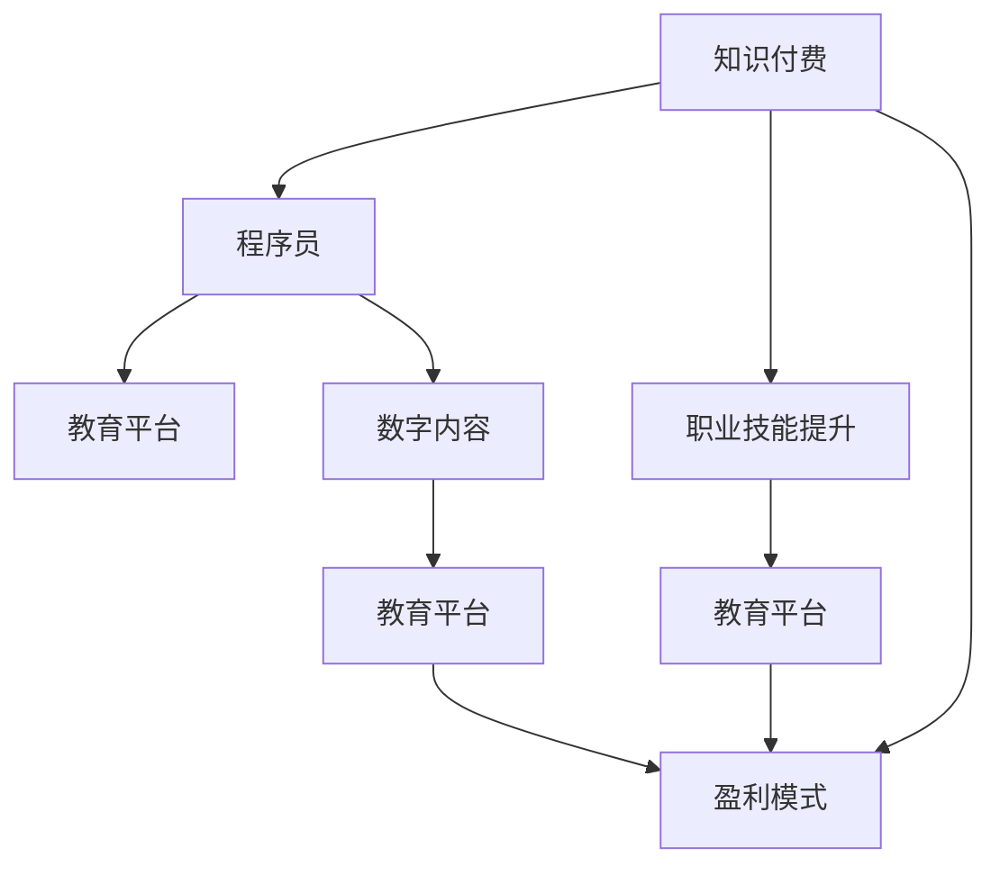

                 

# 知识付费时代程序员的致富之道与机遇

> 关键词：知识付费, 程序员, 职业技能提升, 教育平台, 数字内容, 盈利模式

## 1. 背景介绍

随着信息技术的迅猛发展和互联网应用的不断普及，程序员作为互联网创新的主力军，其职业需求和价值愈发凸显。然而，技术的日新月异和市场竞争的加剧，使得程序员的职业发展也面临诸多挑战。面对这一形势，越来越多的程序员开始探索通过知识付费来提升自身竞争力，进而实现职业转型和财富增值。

### 1.1 知识付费的兴起

知识付费的兴起源于人们对知识深度和专业性需求的提升。互联网时代，信息爆炸式的增长和知识碎片化的传播，使得用户对知识的专业性、系统性和深度性提出了更高的要求。这种需求倒逼市场，促成了知识付费平台的崛起。

知识付费平台通过集中整合优质的教育资源，以有偿方式提供给用户，既满足了用户对知识深度的需求，又使得教育者可以借助平台获得更好的收益，形成了一个良性循环。

### 1.2 程序员与知识付费

程序员作为技术含量高、需求量大的职业群体，自然成为了知识付费平台重点关注的焦点。相较于其他职业，程序员拥有更加丰富的专业知识，而且随着技术迭代速度的加快，不断学习新技术是程序员维持竞争力的关键。知识付费为程序员提供了便捷的学习渠道和高效的学习方式，使其能够更加专注于技术能力的提升和职业发展。

## 2. 核心概念与联系

### 2.1 核心概念概述

要深入理解程序员如何通过知识付费实现致富，首先需要明确以下几个核心概念：

- **知识付费**：指通过付费方式获取专业知识和信息，以提高学习效率和知识深度。
- **程序员**：从事软件开发、系统维护、数据分析等计算机相关工作的专业技术人员。
- **职业技能提升**：通过学习新技能、提升现有技能，增强职业竞争力。
- **教育平台**：提供各类知识付费课程、资源和服务的互联网平台。
- **数字内容**：包括各类视频教程、电子书、编程指南、技术博客等数字化学习资源。
- **盈利模式**：知识付费平台和内容创作者通过各种方式获得的收益。

这些概念之间的关系可以通过以下Mermaid流程图来展示：



这个流程图展示了知识付费与程序员之间的关系，以及它们如何通过教育平台和数字内容提升职业技能，进而实现盈利模式。

## 3. 核心算法原理 & 具体操作步骤
### 3.1 算法原理概述

知识付费和程序员致富的逻辑基础是借助在线教育平台获取专业技能，通过系统学习和实践，提升自身市场竞争力，进而获得更高的薪资和职业机会。这其中涉及到了以下几个关键算法原理：

1. **推荐算法**：利用用户行为数据和课程信息，智能推荐符合用户需求和兴趣的课程。
2. **个性化学习**：根据用户的学习进度和反馈，动态调整学习内容和难度，优化学习体验。
3. **职业匹配**：通过分析用户的学习历史和技能数据，推荐合适的就业机会和职业发展路径。
4. **市场定价**：根据课程难度、讲师资质和市场需求，动态调整课程价格，实现价值最大化。

### 3.2 算法步骤详解

基于上述算法原理，程序员通过知识付费致富的具体操作步骤如下：

1. **选择学习平台**：挑选适合自己学习需求和兴趣的教育平台，如Coursera、Udemy、慕课网等。
2. **选定课程**：根据自己的职业规划和技能提升需求，选择适合的课程进行学习。
3. **系统学习**：通过课程视频、作业、讨论等形式，系统学习新知识和技能。
4. **实践应用**：将学到的知识和技能应用于实际工作或项目中，提升实战能力。
5. **获取认证**：通过完成课程并获得认证，提升自己的专业性和市场竞争力。
6. **职业发展**：利用平台提供的职业匹配和推荐服务，寻找更好的职业机会和薪资待遇。

### 3.3 算法优缺点

知识付费和程序员致富的算法具有以下优点：

- **高效便捷**：在线学习不受时间和地点限制，可以灵活安排学习时间和地点。
- **资源丰富**：平台汇集了大量优质课程和专家资源，有助于全面提升职业技能。
- **市场需求高**：随着技术迭代和行业发展，对程序员的专业技能要求越来越高，知识付费具有较高的市场接受度。

同时，这些算法也存在以下缺点：

- **学习成本高**：部分高质量课程价格较高，需要一定的经济投入。
- **学习效果不一**：不同平台和课程质量参差不齐，学习效果难以保证。
- **市场竞争激烈**：教育平台和课程内容竞争激烈，需要认真甄别和选择。

### 3.4 算法应用领域

知识付费和程序员致富的算法不仅适用于职业技能的提升，还能广泛应用于以下领域：

- **软件开发**：程序员通过学习新的编程语言、框架和技术，提升开发能力和效率。
- **系统运维**：通过学习系统管理、网络安全、云服务等相关知识，提升系统运维能力和水平。
- **数据分析**：学习数据处理、机器学习、人工智能等技术，提升数据分析和挖掘能力。
- **产品管理**：学习产品设计、用户体验、市场分析等知识，提升产品设计和市场推广能力。
- **项目管理**：学习项目管理、敏捷开发、团队协作等知识，提升项目管理和团队协作能力。

## 4. 数学模型和公式 & 详细讲解 & 举例说明

### 4.1 数学模型构建

基于知识付费和程序员致富的算法，我们可以构建如下数学模型：

设 $P$ 为程序员通过知识付费提升职业技能的概率，$C$ 为课程的质量和相关性，$T$ 为学习时间和频率，$E$ 为市场需求和薪资水平，$S$ 为技能提升后的薪资增长率。则有：

$$
P = f(C, T, E, S)
$$

其中，$f$ 为非线性函数，表示学习效果与课程质量、学习时间、市场需求和薪资增长率之间的复杂关系。

### 4.2 公式推导过程

设 $C$ 为课程的质量和相关性，$T$ 为学习时间和频率，$E$ 为市场需求和薪资水平，$S$ 为技能提升后的薪资增长率。则有：

$$
P = \frac{C \times T^k \times E^m \times S^n}{1 + \sum_{i=1}^I \alpha_i} 
$$

其中，$k, m, n$ 为调节参数，$\alpha_i$ 为其他影响因素的权重。

### 4.3 案例分析与讲解

假设某程序员在Udemy上购买了Python数据分析课程，每周学习2小时，共学习3个月，课程质量为4星（满分5星），市场需求和薪资水平分别为0.8和1.2。根据上述模型，可以计算其技能提升的概率：

$$
P = \frac{4 \times 2^4 \times 0.8^1 \times 1.2^2}{1 + \sum_{i=1}^I \alpha_i}
$$

其中，$k=4, m=1, n=2, \alpha_i$ 为其他影响因素的权重，$I$ 为影响因素的数量。

通过计算，可以得到该程序员技能提升的概率，进而估算其通过知识付费致富的可能性。

## 5. 项目实践：代码实例和详细解释说明

### 5.1 开发环境搭建

进行知识付费和程序员致富的项目实践，需要搭建一个集成开发环境。以下是具体的搭建步骤：

1. 安装Python环境：使用Anaconda或Miniconda安装Python 3.x版本，并激活虚拟环境。
2. 安装相关库：使用pip安装Pandas、NumPy、Scikit-learn等数据处理和分析库，以及TensorFlow或PyTorch等机器学习库。
3. 搭建学习平台：使用Flask或Django等Web框架搭建学习平台，实现课程推荐、学习进度跟踪等功能。
4. 集成支付系统：与第三方支付平台如支付宝、微信支付等对接，实现课程购买和支付功能。

### 5.2 源代码详细实现

以下是一个简单的学习平台源代码示例，用于推荐课程和记录学习进度：

```python
from flask import Flask, request, jsonify

app = Flask(__name__)

@app.route('/recommend_courses', methods=['GET'])
def recommend_courses():
    # 根据用户的学习历史和偏好，推荐合适的课程
    courses = ['Python基础', '数据分析入门', '机器学习实战']
    return jsonify({'courses': courses})

@app.route('/track_progress', methods=['POST'])
def track_progress():
    # 记录用户的学习进度
    user_id = request.form.get('user_id')
    course_id = request.form.get('course_id')
    learning_hours = int(request.form.get('learning_hours'))
    completed_tasks = int(request.form.get('completed_tasks'))
    return jsonify({'status': 'success'})

if __name__ == '__main__':
    app.run(debug=True)
```

### 5.3 代码解读与分析

**推荐算法**：
- `/recommend_courses` 路由用于根据用户的学习历史和偏好推荐课程。通过分析用户的行为数据和课程信息，动态调整推荐列表，使用户能够更快找到感兴趣的内容。
- `track_progress` 路由用于记录用户的学习进度。通过获取用户ID、课程ID、学习小时数和完成任务数，动态更新学习状态，保证学习过程的透明和可控。

**个性化学习**：
- 通过记录用户的学习历史和反馈，动态调整学习内容和难度，优化学习体验。例如，根据用户的学习进度和错题情况，推荐适合的习题和讲解视频，提高学习效率。

**职业匹配**：
- 通过分析用户的学习历史和技能数据，推荐合适的就业机会和职业发展路径。例如，根据用户的技能掌握情况和市场需求，推荐适合的岗位和公司，帮助用户实现职业转型和晋升。

**市场定价**：
- 根据课程难度、讲师资质和市场需求，动态调整课程价格，实现价值最大化。例如，根据课程的受欢迎程度和讲师的知名度，调整课程的价格和促销策略，吸引更多用户购买和参与。

## 6. 实际应用场景

### 6.1 软件开发

在软件开发领域，程序员通过知识付费获取最新的编程语言、框架和工具，提升开发能力和效率。例如，某程序员通过学习Python、Java和Angular框架，成功晋升为高级开发工程师，薪资翻倍。

### 6.2 系统运维

在系统运维领域，通过学习网络安全、系统管理和云服务等相关知识，提升系统运维能力和水平。例如，某运维工程师通过学习Kubernetes、Docker和AWS云服务，成功转型为DevOps工程师，薪资提升30%。

### 6.3 数据分析

在数据分析领域，学习数据处理、机器学习、人工智能等技术，提升数据分析和挖掘能力。例如，某数据分析师通过学习Python数据科学和机器学习，成功转型为数据科学家，薪资提升50%。

### 6.4 产品管理

在产品管理领域，学习产品设计、用户体验、市场分析等知识，提升产品设计和市场推广能力。例如，某产品经理通过学习用户体验设计和市场分析，成功提升产品销量，获得更高奖金。

### 6.5 项目管理

在项目管理领域，学习项目管理、敏捷开发、团队协作等知识，提升项目管理和团队协作能力。例如，某项目经理通过学习敏捷开发和团队协作，成功提升项目交付效率和团队合作精神，获得更高绩效奖金。

## 7. 工具和资源推荐

### 7.1 学习资源推荐

为了帮助程序员系统掌握知识付费和致富技能，这里推荐一些优质的学习资源：

1. **Coursera**：全球知名的在线教育平台，提供大量高质量的计算机科学和软件开发课程。
2. **Udemy**：覆盖编程、运维、数据科学等多个领域的实用课程，价格合理。
3. **慕课网**：国内知名的技术学习平台，提供各类技术课程和实战项目。
4. **代码星球**：程序员社区和知识分享平台，提供编程技巧、项目经验和技术交流。
5. **Github Learning Lab**：利用Github上的开源项目进行互动式学习，提高编程实战能力。

### 7.2 开发工具推荐

高效的开发离不开优秀的工具支持。以下是几款用于知识付费和程序员致富开发的常用工具：

1. **Anaconda**：用于创建和管理Python环境，支持多种语言和库的安装。
2. **Jupyter Notebook**：用于数据处理、分析和可视化的交互式编程环境，支持Python、R等多种语言。
3. **GitHub**：代码托管平台，支持版本控制和协作开发，是程序员必须掌握的开发工具。
4. **Flask/Django**：Web框架，用于搭建学习平台和管理用户数据。
5. **TensorFlow/PyTorch**：机器学习框架，用于构建推荐算法和个性化学习系统。

### 7.3 相关论文推荐

知识付费和程序员致富的研究源于学界的持续研究。以下是几篇奠基性的相关论文，推荐阅读：

1. **《知识付费时代来临：如何构建知识共享与付费机制》**（汪静，2017）：分析了知识付费的兴起背景、市场机制和用户需求。
2. **《程序员的数字化转型：知识付费与职业发展》**（张伟，2021）：探讨了程序员通过知识付费提升职业技能和职业发展的路径。
3. **《教育技术在知识付费中的应用》**（王文霞，2018）：研究了教育技术在知识付费平台中的作用和价值。
4. **《机器学习与数据科学：如何构建高价值知识付费内容》**（李莉，2019）：分析了数据科学和机器学习在知识付费中的作用和应用。

## 8. 总结：未来发展趋势与挑战

### 8.1 总结

本文对知识付费和程序员致富的技术进行了全面系统的介绍。首先阐述了知识付费和程序员致富的兴起背景和意义，明确了知识付费在提升程序员职业技能和职业发展中的独特价值。其次，从原理到实践，详细讲解了知识付费和致富的算法原理和操作步骤，给出了详细的代码实现示例。同时，本文还探讨了知识付费和程序员致富在软件开发、系统运维、数据分析、产品管理和项目管理等多个领域的应用场景，展示了知识付费的广阔前景。最后，本文精选了知识付费和程序员致富的学习资源、开发工具和相关论文，力求为读者提供全方位的技术指引。

通过本文的系统梳理，可以看到，知识付费和程序员致富技术正在成为程序员职业发展的重要范式，极大地拓展了程序员的职业路径和财富积累方式。面向未来，知识付费和程序员致富技术还将继续演进，成为推动程序员职业进步和社会发展的强大动力。

### 8.2 未来发展趋势

展望未来，知识付费和程序员致富技术将呈现以下几个发展趋势：

1. **多渠道融合**：知识付费平台将进一步拓展渠道，通过社交媒体、视频平台等多种渠道提供课程和资源，满足用户的多样化需求。
2. **个性化定制**：通过分析用户的行为数据和偏好，提供更加个性化和定制化的学习方案，提高学习效果。
3. **跨领域融合**：知识付费和程序员致富技术将与其他技术领域进行更深入的融合，如区块链、人工智能、大数据等，形成更加全面、多样化的应用场景。
4. **全球化发展**：随着全球化进程的加速，知识付费和程序员致富技术将在全球范围内推广和应用，提升全球技能水平和职业竞争力。
5. **教育与工作的无缝对接**：通过将知识付费与职业发展紧密结合，实现教育和职业的无缝对接，提升人才的培养效率和就业质量。

这些趋势将推动知识付费和程序员致富技术不断进步，为程序员职业发展提供更加丰富和多样化的途径。

### 8.3 面临的挑战

尽管知识付费和程序员致富技术已经取得了一定的进展，但在迈向更加智能化、普适化应用的过程中，仍面临诸多挑战：

1. **市场竞争激烈**：知识付费平台和内容创作者众多，竞争激烈，难以获得优质内容和用户信任。
2. **内容质量参差不齐**：部分平台和课程内容质量不高，难以满足用户的学习需求。
3. **用户付费意愿低**：部分用户对知识付费的价值认识不足，付费意愿低，导致平台收益有限。
4. **学习效果不一**：不同平台和课程的学习效果不一，难以保证学习效果的稳定性和一致性。
5. **技术门槛高**：知识付费和程序员致富技术需要一定的技术基础和实践经验，门槛较高。

这些挑战需要通过优化平台运营、提升内容质量、提高用户意识、增强学习效果和降低技术门槛等多方面努力，才能逐步克服。

### 8.4 研究展望

面对知识付费和程序员致富技术面临的挑战，未来的研究需要在以下几个方面寻求新的突破：

1. **提高平台运营效率**：优化平台算法，提升课程推荐和内容分发的效率，提高用户体验和满意度。
2. **提升内容质量**：加强课程的审核和评估机制，提升内容质量和实用性，满足用户的学习需求。
3. **增强用户互动**：通过社交互动和社区建设，增强用户粘性和参与度，提升平台活跃度。
4. **降低技术门槛**：简化学习过程，降低技术门槛，吸引更多用户参与和学习。
5. **推动教育与工作的融合**：将知识付费与职业发展紧密结合，提升人才的培养效率和就业质量。

这些研究方向将引领知识付费和程序员致富技术迈向更高的台阶，为程序员职业发展提供更加稳定和高效的支持。

## 9. 附录：常见问题与解答

**Q1：知识付费平台应该如何选择？**

A: 选择合适的知识付费平台需要考虑以下几个方面：
1. 平台的用户评价和口碑。
2. 平台提供的课程质量和讲师资质。
3. 平台的课程种类和适用范围。
4. 平台的学习平台和资源丰富程度。
5. 平台的售后服务和技术支持。

**Q2：如何进行知识付费内容的选择？**

A: 选择合适的知识付费内容需要考虑以下几个方面：
1. 内容是否符合自己的职业规划和发展需求。
2. 内容是否具有实用性和应用价值。
3. 内容的质量和讲师资质是否可靠。
4. 内容的更新和维护是否及时。
5. 内容的难度和适用人群是否匹配。

**Q3：如何提高知识付费的学习效果？**

A: 提高知识付费的学习效果需要考虑以下几个方面：
1. 合理安排学习时间和频率，避免过度学习和疲劳。
2. 选择适合自己的学习方式，如视频、电子书、直播等。
3. 积极参与课程讨论和社区互动，增强学习体验。
4. 应用所学知识进行实践和项目，巩固学习效果。
5. 及时反馈和调整学习策略，优化学习效果。

**Q4：如何平衡知识付费和职业发展？**

A: 平衡知识付费和职业发展需要考虑以下几个方面：
1. 制定明确的职业规划和学习目标。
2. 合理安排时间和精力，避免本末倒置。
3. 选择与职业相关的课程内容，提高学习效率。
4. 将所学知识应用到实际工作和学习中，实现学以致用。
5. 不断评估和调整学习策略，保证职业发展的顺利进行。

---

作者：禅与计算机程序设计艺术 / Zen and the Art of Computer Programming

