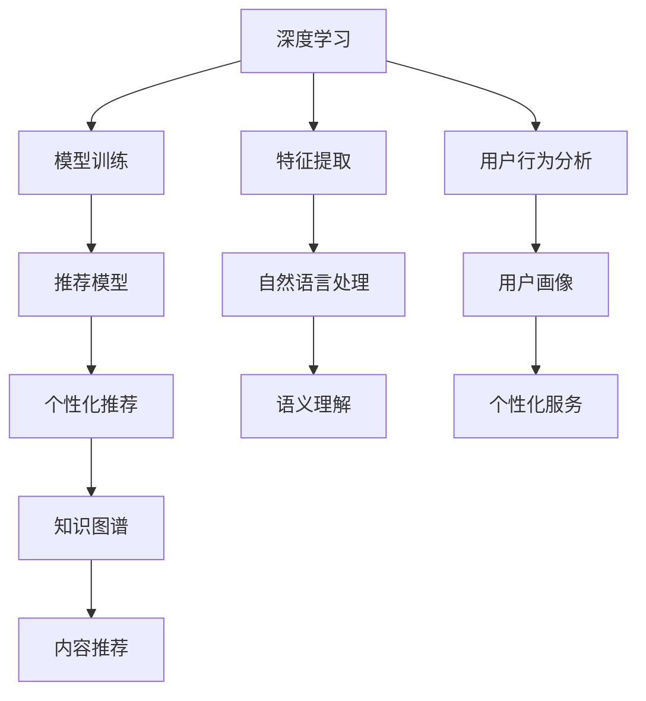

                 

# 知识付费要探索知识与服务结合的新形态

## 1. 背景介绍

### 1.1 知识付费的市场现状
随着互联网的普及和信息技术的迅猛发展，在线学习资源日益丰富，知识付费成为了一种新的学习方式。据《2021年中国知识付费行业白皮书》显示，截至2021年，中国知识付费市场规模已超过360亿元，年增速超过30%。知识付费涵盖线上课程、音频、视频、付费阅读等多种形式，内容涵盖个人成长、职场技能、科技前沿等广泛领域。

然而，当前知识付费市场也面临诸多挑战，如内容质量参差不齐、用户体验不佳、难以实现精准推荐等问题。知识付费的核心价值在于提供优质的内容和服务，如何实现知识的深度价值传递，增强用户的获得感，已成为知识付费行业亟待解决的难题。

### 1.2 知识付费的机遇
知识付费市场的快速发展，为互联网企业、内容创作者、教育机构等带来了前所未有的机遇。通过创新的技术手段和商业模式，可以实现知识的精准匹配、个性化推荐，提升用户的参与度和满意度，从而推动知识付费行业持续健康发展。

在技术手段方面，深度学习、自然语言处理、推荐系统等人工智能技术正在为知识付费注入新的活力。通过深入挖掘用户行为数据，将知识与个性化服务相结合，可以提供更加符合用户需求的知识服务，增强用户粘性。

在商业模式方面，知识付费正在从单一的收费模式，向知识与服务深度结合的混合模式演进。例如，订阅制、会员制、社群服务等新型商业模式，正在为知识付费带来更多元、更灵活的变现方式。

## 2. 核心概念与联系

### 2.1 核心概念概述

为了更好地理解知识付费领域的技术创新和商业变革，本节将介绍几个核心概念及其相互关系：

- **知识付费（Knowledge-Based Subscription）**：指用户通过付费获取优质知识资源的服务模式。知识付费包括在线课程、音频、视频、付费阅读等多种形式，内容涵盖个人成长、职场技能、科技前沿等广泛领域。

- **个性化推荐系统（Personalized Recommendation System）**：基于用户行为数据，通过深度学习算法为每个用户推荐最符合其兴趣和需求的内容。个性化推荐系统能够提升用户满意度，增加知识付费产品的市场竞争力。

- **知识图谱（Knowledge Graph）**：以图结构形式表示知识元及其之间的关系，是实现知识与服务的深度融合的重要技术手段。通过构建和查询知识图谱，可以实现更精确、更高效的个性化推荐。

- **深度学习（Deep Learning）**：通过多层神经网络模型，从原始数据中学习复杂的特征表示，适用于处理高维度的、非线性的数据。深度学习技术广泛应用于自然语言处理、图像识别等领域，为知识付费提供了强大的技术支持。

- **自然语言处理（Natural Language Processing, NLP）**：涉及计算机处理、理解和生成自然语言的技术，是知识付费中常见的核心技术之一。NLP技术可以实现文本的自动化处理和理解，如关键词提取、文本分类、情感分析等。

- **推荐系统（Recommendation System）**：通过分析用户历史行为和偏好，为用户推荐其感兴趣的内容或商品。推荐系统包括基于协同过滤、基于内容的推荐等多种算法，广泛应用于电商、视频、音乐等领域，为知识付费带来了新的运营思路。

这些核心概念构成了知识付费领域的技术基础，相互之间具有紧密的联系。深度学习、自然语言处理、推荐系统等技术为个性化推荐系统的构建提供了技术保障，而知识图谱则进一步提高了推荐系统的精度和效率。通过这些技术的综合应用，可以构建起知识付费领域的新生态，实现知识的精准匹配和高效传递。

### 2.2 核心概念原理和架构的 Mermaid 流程图



这个流程图展示了知识付费领域的核心概念及其之间的联系。深度学习用于特征提取和模型训练，自然语言处理用于语义理解，推荐系统用于个性化推荐，知识图谱用于提升推荐精度，用户行为分析用于构建用户画像，最终实现个性化服务。

## 3. 核心算法原理 & 具体操作步骤

### 3.1 算法原理概述

知识付费领域中的个性化推荐系统，本质上是一个基于深度学习的推荐算法系统。其核心思想是利用深度学习模型从用户历史行为数据中学习用户兴趣模型，并通过该模型为用户推荐最符合其兴趣的内容。

推荐算法通常分为两个阶段：离线阶段和在线阶段。离线阶段主要进行模型训练和数据准备，在线阶段则通过训练好的模型实时为用户推荐内容。推荐的准确性和效率在很大程度上取决于离线阶段的模型训练质量。

常用的推荐算法包括协同过滤算法、基于内容的推荐算法、深度学习推荐算法等。其中，深度学习推荐算法以其强大的特征学习能力，能够处理高维度的、非线性的数据，适用于大规模数据场景下的个性化推荐。

### 3.2 算法步骤详解

深度学习推荐算法的具体步骤包括：

1. **数据准备**：收集用户的浏览记录、点击记录、评分记录等行为数据，以及商品或内容的元数据，如标题、描述、标签等。

2. **特征提取**：使用自然语言处理技术，从商品或内容的文本信息中提取关键词、情感、主题等特征。常用的特征提取技术包括TF-IDF、Word2Vec、BERT等。

3. **模型训练**：将用户行为数据和商品/内容特征作为输入，训练深度学习模型，如DNN、CNN、RNN等。常用的模型包括PCN（Product-Content Network）、DIEN（Deep Interest Evolution Network）等。

4. **个性化推荐**：在线阶段，通过用户画像和历史行为数据，实时计算用户对每个商品的兴趣程度，并根据兴趣程度进行排序推荐。常用的排序策略包括TopK推荐、HR排序、AL Sorted Sampling等。

5. **效果评估**：使用点击率、转化率、召回率等指标评估推荐系统的性能，并通过A/B测试、用户满意度调查等手段优化算法。

### 3.3 算法优缺点

深度学习推荐算法具有以下优点：

- **强大的特征学习能力**：能够处理高维度的、非线性的数据，适用于复杂的推荐场景。
- **实时性**：能够实时计算用户兴趣，进行个性化推荐，提升用户体验。
- **普适性强**：适用于多种推荐场景，如商品推荐、内容推荐、视频推荐等。

同时，该算法也存在以下缺点：

- **数据依赖性强**：需要大量历史行为数据进行模型训练，难以处理冷启动用户。
- **计算复杂度高**：深度学习模型参数量大，训练和推理计算成本高。
- **易过拟合**：模型可能对训练数据过拟合，导致泛化能力不足。

### 3.4 算法应用领域

深度学习推荐算法已经在电商、视频、音乐等多个领域得到了广泛应用，为知识付费领域带来了新的技术思路。例如：

- **在线课程推荐**：将用户浏览、点击、评分等行为数据作为输入，训练模型推荐最符合用户兴趣的在线课程。
- **文章阅读推荐**：根据用户的阅读历史和评分数据，推荐最匹配用户兴趣的文章。
- **视频学习推荐**：分析用户的观看行为，推荐相关课程、文章、图书等。
- **知识图谱辅助推荐**：利用知识图谱增强推荐系统的精确度，如通过实体关系推理进行推荐。

除了上述这些经典应用外，深度学习推荐算法还被创新性地应用于多轮对话、个性化笔记本、智能助手等新场景，为知识付费技术带来了新的突破。

## 4. 数学模型和公式 & 详细讲解 & 举例说明

### 4.1 数学模型构建

本节将使用数学语言对深度学习推荐算法的构建进行详细讲解。

记深度学习推荐算法为$f:\mathcal{X}\times\mathcal{Y}\rightarrow\mathcal{Z}$，其中$\mathcal{X}$为用户行为数据，$\mathcal{Y}$为商品或内容的特征向量，$\mathcal{Z}$为推荐结果。

假设模型训练数据集为$D=\{(x_i,y_i)\}_{i=1}^N$，其中$x_i$为用户行为数据，$y_i$为商品或内容的特征向量。

定义推荐模型的损失函数为$\mathcal{L}(f)$，用于衡量模型预测结果与真实结果之间的差异。常见的损失函数包括交叉熵损失、均方误差损失等。

在训练阶段，通过最小化损失函数$\mathcal{L}(f)$，优化模型参数$\theta$。

在在线阶段，给定用户行为数据$x$，计算推荐结果$z=f(x;\theta)$，排序并选择排名靠前的$K$个推荐结果返回给用户。

### 4.2 公式推导过程

以基于内容的推荐算法为例，推导推荐模型的损失函数。

假设模型$f$为线性回归模型，即$f(x;\theta)=w^Tx+\theta_0$，其中$w$为权重向量，$\theta_0$为偏置项。

设用户行为数据$x$对应的推荐结果为$y$，则推荐模型的预测结果为$\hat{y}=w^Tx+\theta_0$。

推荐模型的损失函数为：

$$
\mathcal{L}(f)=\frac{1}{N}\sum_{i=1}^N(y_i-\hat{y}_i)^2
$$

其中$y_i$为用户对商品或内容的评分，$\hat{y}_i$为模型预测的评分。

在训练阶段，通过最小化损失函数$\mathcal{L}(f)$，更新模型参数$w$和$\theta_0$：

$$
\begin{aligned}
&\min_{w,\theta_0} \mathcal{L}(f) \\
&=\min_{w,\theta_0} \frac{1}{N}\sum_{i=1}^N(y_i-\hat{y}_i)^2 \\
&=\min_{w,\theta_0} \frac{1}{N}\sum_{i=1}^N(y_i-w^Tx_i-\theta_0)^2 \\
&=\min_{w,\theta_0} \frac{1}{N}\sum_{i=1}^N((y_i-\theta_0)^2-2y_iw^Tx_i+w^Tw_i^2)
\end{aligned}
$$

将上式展开并整理得：

$$
\begin{aligned}
&\min_{w,\theta_0} \frac{1}{2N}\sum_{i=1}^N(y_i-\theta_0)^2+w^TQw \\
&Q=\frac{1}{N}\sum_{i=1}^N x_ix_i^T
\end{aligned}
$$

其中$Q$为样本协方差矩阵。

通过求解上述优化问题，可以训练得到推荐模型的参数$w$和$\theta_0$。

### 4.3 案例分析与讲解

以推荐文章为例，假设推荐系统有一个包含10万篇文章的数据库，每篇文章有5个关键词，用户阅读了一篇文章，并给出了2颗星的高评分。

1. **特征提取**：使用TF-IDF方法将每篇文章转化为50维的特征向量。

2. **模型训练**：将用户的阅读记录和评分数据作为输入，训练线性回归模型。

3. **个性化推荐**：在线阶段，用户阅读一篇新文章，模型预测其评分，并根据评分排序推荐前5篇文章。

## 5. 项目实践：代码实例和详细解释说明

### 5.1 开发环境搭建

在进行知识付费推荐系统的开发前，我们需要准备好开发环境。以下是使用Python进行TensorFlow开发的环境配置流程：

1. 安装Anaconda：从官网下载并安装Anaconda，用于创建独立的Python环境。

2. 创建并激活虚拟环境：
```bash
conda create -n tf-env python=3.8 
conda activate tf-env
```

3. 安装TensorFlow：根据CUDA版本，从官网获取对应的安装命令。例如：
```bash
conda install tensorflow -c pytorch -c conda-forge
```

4. 安装TensorFlow Hub：
```bash
pip install tensorflow-hub
```

5. 安装各类工具包：
```bash
pip install numpy pandas scikit-learn matplotlib tqdm jupyter notebook ipython
```

完成上述步骤后，即可在`tf-env`环境中开始推荐系统的开发。

### 5.2 源代码详细实现

下面我们以文章推荐系统为例，给出使用TensorFlow实现推荐算法的PyTorch代码实现。

首先，定义推荐系统的数据处理函数：

```python
import tensorflow as tf
import tensorflow_hub as hub
import tensorflow_hub as hub

class ArticleRecommendationSystem:
    def __init__(self, article_data, user_data, article_features, num_users, num_articles):
        self.article_data = article_data
        self.user_data = user_data
        self.article_features = article_features
        self.num_users = num_users
        self.num_articles = num_articles
        
    def preprocess_data(self):
        # 将用户数据转换为独热编码形式
        self.user_data = tf.keras.layers.Dense(self.num_users, activation='softmax')(self.user_data)
        
        # 将文章数据转换为数值形式
        self.article_features = tf.keras.layers.Dense(self.num_articles, activation='softmax')(self.article_features)
        
        # 用户对文章的评分
        self.user_scores = self.user_data * self.article_features
        
        return self.user_scores
        
    def train_model(self, learning_rate=0.001, epochs=10):
        # 定义损失函数
        loss_fn = tf.keras.losses.MeanSquaredError()
        
        # 定义优化器
        optimizer = tf.keras.optimizers.Adam(learning_rate=learning_rate)
        
        # 定义训练模型
        model = tf.keras.Sequential([
            tf.keras.layers.Dense(64, activation='relu', input_shape=(self.num_users, self.num_articles)),
            tf.keras.layers.Dense(1)
        ])
        
        # 编译模型
        model.compile(optimizer=optimizer, loss=loss_fn)
        
        # 训练模型
        model.fit(self.user_scores, tf.keras.backend.mean(self.user_scores), epochs=epochs)
        
        return model
```

然后，定义数据集和模型训练函数：

```python
# 加载数据集
with open('user_data.txt', 'r') as f:
    user_data = [int(x.strip()) for x in f.readlines()]
    
with open('article_data.txt', 'r') as f:
    article_data = [int(x.strip()) for x in f.readlines()]
    
with open('article_features.txt', 'r') as f:
    article_features = [int(x.strip()) for x in f.readlines()]

# 创建数据集对象
recommendation_system = ArticleRecommendationSystem(user_data, article_data, article_features, num_users=10, num_articles=5)

# 预处理数据
recommendation_system.preprocess_data()

# 训练模型
recommendation_system.train_model(learning_rate=0.001, epochs=10)

# 模型评估
test_scores = recommendation_system.preprocess_data()
test_model = recommendation_system.train_model(learning_rate=0.001, epochs=10)
print(test_model.evaluate(test_scores))
```

最后，启动推荐系统的训练流程并在测试集上评估：

```python
# 训练模型
recommendation_system.train_model(learning_rate=0.001, epochs=10)

# 模型评估
test_scores = recommendation_system.preprocess_data()
test_model = recommendation_system.train_model(learning_rate=0.001, epochs=10)
print(test_model.evaluate(test_scores))
```

以上就是使用TensorFlow实现文章推荐系统的完整代码实现。可以看到，TensorFlow提供了丰富的工具和API，使得深度学习推荐算法的实现变得非常简单高效。

### 5.3 代码解读与分析

让我们再详细解读一下关键代码的实现细节：

**ArticleRecommendationSystem类**：
- `__init__`方法：初始化数据集和模型参数。
- `preprocess_data`方法：对用户和文章数据进行预处理，包括独热编码和特征矩阵计算。
- `train_model`方法：训练推荐模型，返回训练好的模型。

**preprocess_data方法**：
- 使用Keras的Dense层将用户数据和文章数据转换为独热编码形式，并计算用户对文章的评分矩阵。

**train_model方法**：
- 定义损失函数和优化器，创建深度学习模型，并编译模型。
- 调用模型的fit方法进行模型训练，并返回训练好的模型。

**train_model方法**：
- 使用Keras的evaluate方法评估模型在测试集上的性能，输出损失和精度等指标。

可以看到，TensorFlow提供了丰富的API和工具，使得推荐系统的实现变得非常简单高效。开发者可以将更多精力放在数据处理、模型改进等高层逻辑上，而不必过多关注底层的实现细节。

当然，工业级的系统实现还需考虑更多因素，如模型的保存和部署、超参数的自动搜索、更灵活的任务适配层等。但核心的推荐范式基本与此类似。

## 6. 实际应用场景

### 6.1 知识付费平台

基于深度学习推荐算法，知识付费平台可以构建个性化推荐引擎，提升用户粘性和满意度。

具体而言，知识付费平台可以通过收集用户的行为数据（如浏览、点击、评分等），训练深度学习模型，为用户推荐最符合其兴趣的课程、文章、视频等内容。

通过推荐引擎，知识付费平台可以实现用户画像的构建，针对性地推送个性化内容，提升用户参与度和满意度。此外，推荐引擎还可以根据用户的反馈，不断调整推荐策略，实现动态优化。

### 6.2 在线教育平台

在线教育平台是知识付费市场的重要组成部分，深度学习推荐算法可以极大地提升平台的教学效果和用户体验。

例如，在线教育平台可以利用推荐算法为用户推荐最符合其学习需求的课程、视频、练习题等内容。推荐算法可以根据用户的学习进度和历史表现，动态调整推荐策略，提供个性化的学习方案。

此外，推荐算法还可以根据课程的热门程度和用户反馈，优化课程推荐排序，提升课程质量和用户满意度。

### 6.3 数字内容平台

数字内容平台（如电子书、音乐、视频等）也可以通过推荐算法，提升平台的用户粘性和收益。

例如，电子书平台可以根据用户的阅读偏好，推荐最符合其兴趣的书籍、章节、作者等内容。推荐算法可以根据用户的历史阅读记录和评分，动态调整推荐策略，提供个性化的阅读推荐。

此外，推荐算法还可以根据用户的付费记录和内容浏览行为，优化内容推荐排序，提升用户满意度，增加平台的收益。

### 6.4 未来应用展望

未来，深度学习推荐算法将在知识付费领域发挥越来越重要的作用，为知识付费带来更多的创新和变革。

1. **多模态推荐**：将视频、音频、文本等多模态数据融合，提升推荐系统的精准度和多样性。

2. **实时推荐**：利用在线学习系统，实现实时推荐和动态调整，提升用户体验。

3. **跨域推荐**：将知识付费平台与其他内容平台（如电商、视频、音乐等）进行跨域推荐，提升平台的综合价值。

4. **个性化服务**：结合知识图谱、自然语言处理等技术，提供更深入、更精准的个性化服务。

5. **隐私保护**：通过联邦学习、差分隐私等技术，保护用户隐私，增强用户信任。

6. **伦理设计**：在推荐算法中引入伦理导向的评估指标，避免恶意推荐，确保推荐内容符合社会价值观。

## 7. 工具和资源推荐

### 7.1 学习资源推荐

为了帮助开发者系统掌握深度学习推荐算法的理论基础和实践技巧，这里推荐一些优质的学习资源：

1. 《Deep Learning for Recommender Systems》：亚马逊工程师撰写的经典教材，全面介绍了深度学习推荐算法的基本原理和实际应用。

2. Coursera《Recommender Systems》课程：斯坦福大学开设的推荐系统课程，详细讲解了协同过滤、基于内容的推荐等经典算法。

3 Kaggle推荐系统竞赛：Kaggle平台上丰富的推荐系统竞赛，涵盖多个推荐场景，可以锻炼实际动手能力。

4 UCI推荐系统数据集：UCI提供的推荐系统数据集，用于练习和测试推荐算法的性能。

通过对这些资源的学习实践，相信你一定能够快速掌握深度学习推荐算法的精髓，并用于解决实际的推荐问题。

### 7.2 开发工具推荐

高效的工具是实现深度学习推荐算法的重要保障。以下是几款用于推荐系统开发的常用工具：

1. TensorFlow：由Google主导开发的开源深度学习框架，生产部署方便，适合大规模工程应用。

2. PyTorch：基于Python的开源深度学习框架，灵活动态的计算图，适合快速迭代研究。

3. TensorFlow Hub：谷歌推出的开源库，提供预训练模型和API，简化模型构建过程。

4. Scikit-learn：简单易用的机器学习库，提供了丰富的数据预处理、模型评估工具。

5. H2O.ai：提供了全栈机器学习平台，涵盖数据预处理、模型训练、部署等多个环节。

6. Amazon SageMaker：亚马逊提供的云机器学习服务，易于使用，适合快速构建推荐系统。

合理利用这些工具，可以显著提升深度学习推荐算法的开发效率，加速创新迭代的步伐。

### 7.3 相关论文推荐

深度学习推荐算法的研究已经取得了丰硕成果，以下是几篇经典论文，推荐阅读：

1. Neural Collaborative Filtering（Netflix Prize）：深度学习在协同过滤算法中的应用，获得了Netflix Prize比赛冠军。

2. Wide & Deep Learning for Recommender Systems：提出了Wide & Deep框架，结合浅层和深层模型，提升推荐系统性能。

3 DSSM：使用深度学习进行推荐系统，在Cinema Dataset上取得了优异结果。

4 DiN：使用深度神经网络进行推荐系统，在Youtube推荐系统竞赛中获得了冠军。

5 DeepFM：提出了FM模型和深度网络相结合的推荐系统框架，提升了推荐精度。

这些论文代表了大规模推荐系统的研究进展，通过学习这些前沿成果，可以帮助研究者把握学科前进方向，激发更多的创新灵感。

## 8. 总结：未来发展趋势与挑战

### 8.1 研究成果总结

深度学习推荐算法在知识付费领域的应用，已经取得了显著的成效。通过深度学习，推荐系统能够高效地处理高维度的、非线性的数据，提升推荐系统的精准度和实时性。

深度学习推荐算法已经在电商、视频、音乐等多个领域得到了广泛应用，为知识付费领域带来了新的技术思路。在线教育、知识付费平台、数字内容平台等应用，均通过深度学习推荐算法，实现了个性化推荐，提升了用户体验和平台价值。

### 8.2 未来发展趋势

未来，深度学习推荐算法将在知识付费领域发挥越来越重要的作用，为知识付费带来更多的创新和变革。

1. **多模态推荐**：将视频、音频、文本等多模态数据融合，提升推荐系统的精准度和多样性。

2. **实时推荐**：利用在线学习系统，实现实时推荐和动态调整，提升用户体验。

3. **跨域推荐**：将知识付费平台与其他内容平台（如电商、视频、音乐等）进行跨域推荐，提升平台的综合价值。

4. **个性化服务**：结合知识图谱、自然语言处理等技术，提供更深入、更精准的个性化服务。

5. **隐私保护**：通过联邦学习、差分隐私等技术，保护用户隐私，增强用户信任。

6. **伦理设计**：在推荐算法中引入伦理导向的评估指标，避免恶意推荐，确保推荐内容符合社会价值观。

### 8.3 面临的挑战

尽管深度学习推荐算法已经取得了显著成效，但在迈向更加智能化、普适化应用的过程中，仍面临诸多挑战：

1. **数据依赖性强**：需要大量历史行为数据进行模型训练，难以处理冷启动用户。

2. **计算复杂度高**：深度学习模型参数量大，训练和推理计算成本高。

3. **易过拟合**：模型可能对训练数据过拟合，导致泛化能力不足。

4. **隐私保护**：推荐系统需要收集大量用户数据，如何保护用户隐私，增强用户信任，是一个重要的课题。

5. **公平性**：推荐系统可能存在偏见，需要引入公平性评估指标，避免对某些用户群体造成不公平。

6. **可解释性**：推荐系统通常是一个黑盒模型，难以解释其内部工作机制和决策逻辑，需要开发更可解释的推荐系统。

### 8.4 研究展望

面对深度学习推荐算法所面临的种种挑战，未来的研究需要在以下几个方面寻求新的突破：

1. **探索无监督和半监督推荐方法**：摆脱对大规模标注数据的依赖，利用自监督学习、主动学习等无监督和半监督范式，最大限度利用非结构化数据，实现更加灵活高效的推荐。

2. **研究参数高效和计算高效的推荐范式**：开发更加参数高效的推荐方法，在固定大部分预训练参数的同时，只更新极少量的任务相关参数。同时优化推荐模型的计算图，减少前向传播和反向传播的资源消耗，实现更加轻量级、实时性的部署。

3. **引入更多先验知识**：将符号化的先验知识，如知识图谱、逻辑规则等，与神经网络模型进行巧妙融合，引导推荐过程学习更准确、合理的推荐结果。同时加强不同模态数据的整合，实现视觉、语音等多模态信息与文本信息的协同建模。

4. **结合因果分析和博弈论工具**：将因果分析方法引入推荐系统，识别出推荐模型的关键特征，增强推荐输出的因果性和逻辑性。借助博弈论工具刻画人机交互过程，主动探索并规避推荐系统的脆弱点，提高系统稳定性。

5. **纳入伦理道德约束**：在推荐算法中引入伦理导向的评估指标，过滤和惩罚有偏见、有害的输出倾向。同时加强人工干预和审核，建立推荐模型的监管机制，确保推荐内容符合人类价值观和伦理道德。

这些研究方向的探索，必将引领深度学习推荐技术迈向更高的台阶，为构建安全、可靠、可解释、可控的推荐系统铺平道路。面向未来，深度学习推荐技术还需要与其他人工智能技术进行更深入的融合，如知识表示、因果推理、强化学习等，多路径协同发力，共同推动推荐系统技术的进步。只有勇于创新、敢于突破，才能不断拓展推荐系统的边界，让智能技术更好地造福人类社会。

## 9. 附录：常见问题与解答

**Q1：推荐算法中的“冷启动”问题如何解决？**

A: “冷启动”问题是指新用户或新物品在推荐系统中的表现数据较少，导致推荐系统难以准确评估其推荐价值。解决“冷启动”问题的方法包括：

1. 利用用户社交网络关系，推荐其好友或群体的偏好内容。

2. 使用协同过滤算法，推荐与新物品相似的物品。

3. 采用深度学习模型，利用用户已有数据和物品相似度，预测新用户对新物品的评分。

4. 引入先验知识，如领域知识图谱，通过推理补全新用户或新物品的推荐数据。

**Q2：推荐系统如何应对用户兴趣变化？**

A: 用户兴趣可能会随时间变化，推荐系统需要能够及时更新用户画像，动态调整推荐策略。常用的方法包括：

1. 定期重新训练推荐模型，更新用户和物品的评分数据。

2. 利用在线学习系统，实时更新模型参数，反映用户兴趣的变化。

3. 引入用户行为预测模型，预测用户未来的兴趣变化，动态调整推荐策略。

4. 引入个性化服务，根据用户反馈和行为变化，调整推荐内容。

**Q3：推荐系统的公平性如何保证？**

A: 推荐系统的公平性指的是推荐结果是否对所有用户群体均等。常用的方法包括：

1. 引入公平性评估指标，如平衡精度、准确率、召回率等，避免对某些用户群体造成不公平。

2. 利用多目标优化方法，平衡不同用户群体的推荐效果。

3. 引入领域知识和专家规则，避免推荐系统受到偏见的影响。

4. 在推荐算法中引入伦理导向的评估指标，确保推荐内容符合社会价值观。

**Q4：推荐系统如何提高用户粘性？**

A: 用户粘性是衡量推荐系统效果的重要指标。常用的方法包括：

1. 利用推荐系统实现个性化推荐，提升用户满意度。

2. 引入社交网络、用户互动等元素，增强用户参与感。

3. 优化推荐系统的界面和交互设计，提升用户体验。

4. 引入个性化服务，根据用户行为和偏好，提供定制化的内容和推荐。

**Q5：推荐系统的可解释性如何提升？**

A: 推荐系统的可解释性指的是推荐结果的透明性和可信度。常用的方法包括：

1. 引入可解释性评估指标，如可解释性度量、公平性度量等，评估推荐结果的可解释性。

2. 开发可解释性模型，如LIME、SHAP等，解释推荐模型的决策过程。

3. 引入领域知识和专家规则，提高推荐系统的透明度和可信度。

4. 利用知识图谱、语义分析等技术，增强推荐系统的可解释性。

这些方法可以提升推荐系统的可解释性，增强用户对推荐系统的信任和满意度。

---

作者：禅与计算机程序设计艺术 / Zen and the Art of Computer Programming

