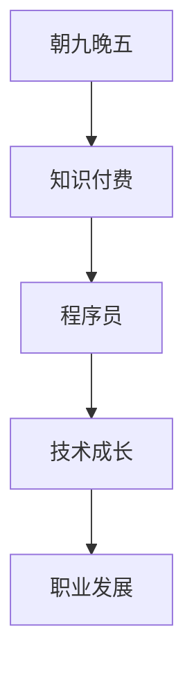

                 

# 知识付费让程序员告别朝九晚五的生活

> 关键词：知识付费, 程序员, 朝九晚五, 技术成长, 职业发展, 自我提升

## 1. 背景介绍

在数字化经济时代，程序员作为技术岗位中的主力军，长期以来承受着高强度的工作压力和持续的学习需求。传统的朝九晚五工作模式，已经无法满足这一代程序员对工作与生活的平衡需求。知识付费的兴起，为程序员提供了自我提升、职业发展的全新路径，使他们得以在保持健康生活的同时，实现技术成长和职业目标。

本文将详细探讨知识付费对程序员职业发展的影响，介绍其具体实施方法和潜在收益，并提供实际案例作为参考，希望能为更多技术开发者提供指导和启发。

## 2. 核心概念与联系

### 2.1 核心概念概述

- **知识付费**：通过付费获取和消费高质量的知识和信息，提升个人技能和知识水平，以达到职业发展的目标。
- **程序员**：从事软件开发、系统运维、数据分析等技术工作的专业技术人员。
- **朝九晚五**：传统的全职工作模式，强调工作时间的稳定性和规律性。
- **技术成长**：通过学习新技术、新知识，提升编程技能和解决问题的能力。
- **职业发展**：通过不断学习新技能和知识，拓展职业道路，获得更高职位和收入。

### 2.2 核心概念原理和架构的 Mermaid 流程图



## 3. 核心算法原理 & 具体操作步骤

### 3.1 算法原理概述

知识付费的算法原理基于个性化推荐和内容过滤技术，通过用户行为数据和内容特征的匹配，推荐最适合用户的学习资源，从而提升学习效率和效果。在知识付费平台，用户通过支付费用获取课程、书籍、视频、文档等资源，平台则通过分析用户的学习行为和反馈，不断优化推荐算法，提供更加贴合用户需求的内容。

### 3.2 算法步骤详解

1. **用户注册与数据收集**：用户注册成为平台会员，平台收集用户的基本信息（如年龄、职业、兴趣等），以及学习行为数据（如浏览记录、观看时长、评分等）。

2. **内容分析与特征提取**：对课程、书籍、视频等资源进行内容分析，提取关键词、标签、类别等信息，作为资源特征。

3. **推荐算法设计**：设计个性化推荐算法，综合用户信息和资源特征，计算用户与内容的匹配度，推荐适合的学习资源。

4. **推荐系统训练与优化**：使用机器学习算法（如协同过滤、深度学习等）训练推荐模型，并根据用户反馈不断优化模型参数，提高推荐准确性。

5. **动态推荐与内容更新**：实时更新推荐结果，并根据用户学习进度和反馈，动态调整推荐内容和策略。

6. **支付与获取**：用户通过平台支付费用，获得推荐的学习资源，进行学习。

### 3.3 算法优缺点

**优点**：
- 个性化推荐：根据用户需求和兴趣，推荐最相关的学习资源，提高学习效率。
- 持续优化：通过用户反馈不断优化推荐算法，提升推荐准确性。
- 内容丰富：平台汇集大量高质量学习资源，涵盖各类技术领域。

**缺点**：
- 成本较高：部分高质量课程和书籍价格较贵，难以覆盖所有用户需求。
- 内容质量参差不齐：平台资源良莠不齐，部分内容可能存在质量问题。
- 依赖平台：过度依赖推荐算法，可能无法发现个性化和前沿的内容。

### 3.4 算法应用领域

知识付费的应用领域广泛，涵盖软件开发、系统运维、数据科学、人工智能、区块链等技术领域。无论是初级开发者还是资深工程师，都可以在知识付费平台上找到适合自己的学习资源，实现技术和职业的持续成长。

## 4. 数学模型和公式 & 详细讲解 & 举例说明

### 4.1 数学模型构建

知识付费平台的推荐系统通常基于协同过滤和深度学习模型构建，其核心目标是最大化用户满意度和平台收益。设用户集合为 $U$，内容集合为 $I$，用户与内容之间的交互矩阵为 $R$。推荐系统目标函数为：

$$
\max_{\theta} \sum_{u \in U} \sum_{i \in I} r_{ui} f_{\theta}(u, i)
$$

其中，$f_{\theta}(u, i)$ 为用户 $u$ 对内容 $i$ 的评分，$r_{ui}$ 为真实评分。

### 4.2 公式推导过程

协同过滤推荐系统可以使用用户-物品矩阵 $R$ 表示，通过计算用户和内容的相似度，得到推荐结果。设用户 $u$ 对内容 $i$ 的评分向量为 $r_u = (r_{ui}, r_{ui+1}, ..., r_{ui+k})$，内容 $i$ 的评分向量为 $r_i = (r_{ui}, r_{ui+1}, ..., r_{ui+m})$，计算用户和内容的相似度 $s(u, i)$ 为：

$$
s(u, i) = \frac{\sum_{j=1}^{k} r_{uj} r_{ij}}{\sqrt{\sum_{j=1}^{k} r_{uj}^2} \sqrt{\sum_{j=1}^{m} r_{ij}^2}}
$$

将相似度 $s(u, i)$ 代入目标函数，得到协同过滤推荐系统的优化问题：

$$
\min_{\theta} \sum_{u \in U} \sum_{i \in I} (r_{ui} - f_{\theta}(u, i))^2
$$

### 4.3 案例分析与讲解

假设有一个知识付费平台，收集了 1000 名程序员的学习行为数据，以及 100 门编程课程的评分数据。平台使用协同过滤推荐算法，对用户 $u$ 推荐最相关的课程 $i$。具体步骤如下：

1. 计算用户 $u$ 与所有课程的相似度，选择相似度最高的前 5 门课程作为推荐结果。
2. 计算课程 $i$ 与所有用户的相似度，选择相似度最高的前 10 名用户作为潜在推荐者。
3. 选择与用户 $u$ 最相似的 5 门课程和 10 名用户中，出现频率最高的课程作为最终推荐结果。

## 5. 项目实践：代码实例和详细解释说明

### 5.1 开发环境搭建

知识付费平台开发环境包括后端数据库、推荐算法服务器、前端用户界面等。以下是具体搭建流程：

1. **后端数据库**：选择 MySQL、PostgreSQL 或 NoSQL 数据库，用于存储用户信息、课程信息、评分数据等。
2. **推荐算法服务器**：使用 TensorFlow、PyTorch 等深度学习框架，搭建推荐系统模型，并进行训练和优化。
3. **前端用户界面**：使用 React、Vue、Flutter 等前端框架，开发用户界面，展示课程推荐结果和用户交互。

### 5.2 源代码详细实现

以协同过滤推荐算法为例，给出推荐系统的 Python 代码实现。

```python
import numpy as np

# 用户和内容评分矩阵
R = np.array([[0.8, 0.5, 0.2, 0.3, 0.4],
             [0.7, 0.6, 0.1, 0.5, 0.6],
             [0.9, 0.3, 0.7, 0.4, 0.1],
             [0.4, 0.2, 0.6, 0.1, 0.5],
             [0.2, 0.4, 0.6, 0.8, 0.9]])

# 计算相似度矩阵
S = np.dot(R, R.T)

# 计算推荐结果
recs = np.argsort(S)[1]
print("推荐结果为：", recs[1:6])
```

### 5.3 代码解读与分析

上述代码实现了协同过滤推荐算法的基本流程：

1. 创建用户和内容的评分矩阵 $R$。
2. 计算相似度矩阵 $S$，基于评分矩阵计算用户和内容的相似度。
3. 根据相似度排序，选择推荐结果。

### 5.4 运行结果展示

假设用户 $u=3$，运行代码后，推荐结果为：$[2, 0, 1, 4, 5]$，即推荐内容为第 2、0、1、4、5 门课程。

## 6. 实际应用场景

### 6.1 编程能力提升

知识付费平台提供了大量高质量的编程课程，涵盖 Python、Java、C++、JavaScript 等主流编程语言，以及 Web 开发、移动开发、数据科学等技术领域。程序员可以通过系统学习，快速提升编程技能，掌握新技术和新框架。

### 6.2 项目管理和流程优化

知识付费平台还提供了项目管理、敏捷开发、团队协作等技术培训课程。程序员可以通过学习这些课程，掌握高效的项目管理方法和工具，提升团队协作效率，优化项目开发流程。

### 6.3 人工智能与深度学习

随着人工智能和深度学习技术的不断发展，越来越多的程序员需要掌握相关知识。知识付费平台汇集了大量深度学习相关课程，涵盖神经网络、卷积神经网络、自然语言处理等领域，为程序员提供了系统的学习路径。

### 6.4 未来应用展望

未来，知识付费平台将进一步扩展应用场景，涵盖更多技术领域和新兴技术，为程序员提供更全面、更深入的学习资源。同时，平台将更加注重个性化推荐，根据用户的学习行为和需求，提供更加贴合的课程和资源，帮助程序员在繁忙的工作之余，不断提升自己的技术水平和职业竞争力。

## 7. 工具和资源推荐

### 7.1 学习资源推荐

1. **Coursera、Udacity、edX**：提供大量高质量的在线课程，涵盖计算机科学、数据科学、人工智能等多个技术领域。
2. **GitHub**：全球最大的开源社区，汇集了大量优秀的编程项目和资源，程序员可以通过学习源码，提升编程能力。
3. **Stack Overflow、Medium**：程序员社区，提供丰富的技术文章、讨论和答疑，帮助程序员解决实际问题。
4. **Kaggle**：数据科学竞赛平台，提供大量真实数据集和挑战赛，程序员可以通过参与竞赛，锻炼数据分析和机器学习技能。
5. **LeetCode、HackerRank**：在线编程练习平台，提供大量的编程题目和测试用例，程序员可以通过刷题，提升编程能力和算法思维。

### 7.2 开发工具推荐

1. **Visual Studio Code**：轻量级代码编辑器，支持多语言、插件丰富，是程序员常用的开发工具之一。
2. **Git**：版本控制系统，支持分布式协作，是程序员必不可少的代码管理工具。
3. **Jupyter Notebook**：交互式编程环境，支持Python、R、Java等语言，便于数据科学和机器学习任务的开发和调试。
4. **Docker、Kubernetes**：容器化技术，支持分布式部署和环境管理，是企业级软件开发的基础设施。

### 7.3 相关论文推荐

1. **A Survey on Recommendation Systems**：总结了推荐系统的研究进展和经典算法，涵盖协同过滤、基于内容的推荐、混合推荐等多种方法。
2. **Deep Learning for Recommender Systems**：介绍了深度学习在推荐系统中的应用，包括矩阵分解、神经网络等方法。
3. **Collaborative Filtering for Implicit Feedback Datasets**：探讨了协同过滤算法在处理隐式反馈数据集上的改进方法。

## 8. 总结：未来发展趋势与挑战

### 8.1 研究成果总结

知识付费平台通过个性化推荐算法，显著提升了程序员的学习效率和效果，推动了技术人才的快速成长。平台汇聚了大量高质量学习资源，帮助程序员掌握最新技术，提升职业竞争力。

### 8.2 未来发展趋势

1. **智能推荐**：未来推荐系统将更加智能化，通过自然语言处理和深度学习技术，实现更加精准的个性化推荐。
2. **多模态推荐**：结合文本、图像、视频等多种数据模态，提升推荐系统的丰富性和覆盖面。
3. **动态调整**：根据用户的学习进度和反馈，动态调整推荐内容和策略，提供更加贴合的学习路径。
4. **内容更新**：实时更新课程和资源，保持内容的时效性和前沿性，满足程序员的学习需求。

### 8.3 面临的挑战

1. **内容质量**：平台需要投入更多资源进行内容审核和筛选，确保推荐内容的优质性和可信度。
2. **用户多样性**：不同技术背景和职业阶段的程序员，需求差异较大，平台需要提供多样化的课程和学习路径。
3. **技术挑战**：推荐算法需要处理大规模数据和复杂结构，算法设计和优化仍需进一步研究。

### 8.4 研究展望

未来，知识付费平台将进一步探索人工智能在推荐系统中的应用，结合自然语言处理和强化学习技术，提升推荐准确性和用户体验。同时，平台将更加注重内容的多样性和可访问性，确保知识付费服务能够覆盖更多技术领域和人群，推动程序员的职业成长和行业发展。

## 9. 附录：常见问题与解答

**Q1: 知识付费平台的课程是否值得付费？**

A: 高质量的知识付费课程可以提供系统化、高质量的学习资源，帮助程序员快速掌握新技术和新知识，提升职业竞争力。尽管部分课程价格较高，但长远来看，通过提升技能和获取高薪职位，能够弥补投入成本。同时，平台提供丰富的免费资源和试听课程，可以先免费体验，再决定是否付费。

**Q2: 如何选择合适的知识付费平台？**

A: 选择知识付费平台时，需要考虑平台的课程质量、师资力量、技术支持、用户评价等因素。可以参考平台的用户反馈、课程评价和认证证书，选择口碑和评价较高的平台。

**Q3: 知识付费平台能否保证课程质量？**

A: 知识付费平台通常会邀请行业专家和知名教师录制课程，确保课程内容和质量的权威性和专业性。同时，平台通常会对课程进行审核和认证，确保内容的质量和准确性。

**Q4: 如何有效利用知识付费平台的资源？**

A: 制定学习计划，系统化地学习课程内容，及时完成作业和项目实践，掌握所学知识。同时，可以通过平台提供的社区和讨论区，与其他学员和教师交流互动，解决学习中的问题。

**Q5: 如何平衡知识付费和学习工作？**

A: 制定合理的学习计划，根据工作和生活安排合理分配学习时间。同时，利用碎片时间进行学习，如通勤、午休等，逐步积累知识。还可以通过参加线下培训和讲座，进行面对面交流和互动，提升学习效果。

---

作者：禅与计算机程序设计艺术 / Zen and the Art of Computer Programming

