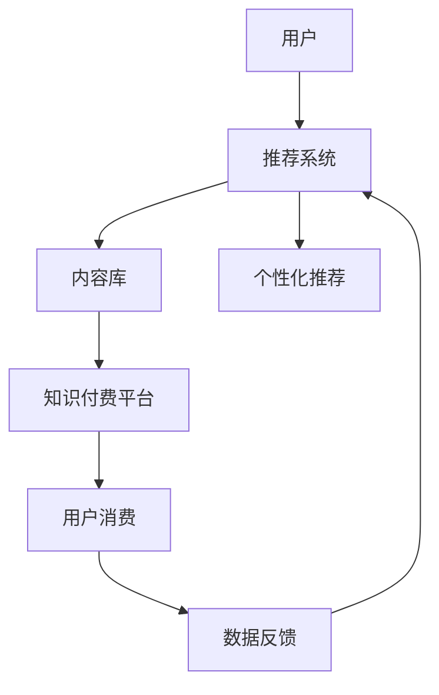

                 

# 知识付费赚钱的品牌IP孵化与商业模式创新

> 关键词：知识付费,品牌IP孵化,商业模式创新,人工智能,自然语言处理

## 1. 背景介绍

在知识经济时代，知识的价值日益凸显。知识付费作为一种新兴商业模式，正在成为互联网产业的重要组成部分。通过在线课程、电子书、专栏等形式，知识付费为消费者提供了高效便捷的学习途径，同时也为内容创作者开辟了新的收入渠道。

然而，当前的知识付费市场仍面临诸多挑战：
1. 内容同质化严重：大量低质量、低原创性的内容充斥市场，难以吸引用户付费。
2. 用户体验不佳：缺少个性化推荐，用户难以找到满足自己需求的内容。
3. 用户粘性不足：缺乏有效的用户留存和转化策略，用户流失率高。

为了解决这些问题，企业需要探索更加高效、有价值的内容策略和商业模式。基于此，本文将介绍一种创新的知识付费商业模式——品牌IP孵化与商业化，并探讨如何利用人工智能技术实现这一模式的高效运行。

## 2. 核心概念与联系

### 2.1 核心概念概述

为深入理解品牌IP孵化与商业化的模式，我们先介绍几个关键概念：

- **知识付费**：指用户为获取特定知识内容而支付费用的商业模式。常见的形式包括在线课程、电子书、付费咨询等。

- **品牌IP孵化**：指通过原创内容打造具有独特品牌价值和强大变现能力的IP，从而形成可持续发展的商业模式。

- **内容推荐系统**：利用机器学习算法，对用户行为数据进行分析和建模，实现个性化内容的推荐，提高用户粘性和满意度。

- **人工智能(AI)**：包括机器学习、自然语言处理(NLP)、深度学习等技术，可以高效处理大量数据，挖掘隐藏在数据中的规律和模式，实现智能化内容推荐和用户管理。

- **自然语言处理(NLP)**：指通过计算机理解、处理和生成自然语言的技术，可以用于内容生成、用户交互、情感分析等。

### 2.2 核心概念原理和架构的 Mermaid 流程图



以上流程图展示了知识付费平台的整体架构，用户与推荐系统互动，获得个性化推荐；通过内容库提供知识付费内容；用户完成消费后，数据反馈到推荐系统，不断优化推荐策略。

## 3. 核心算法原理 & 具体操作步骤
### 3.1 算法原理概述

品牌IP孵化与商业化的核心在于通过个性化推荐系统，构建具有强大吸引力和变现能力的品牌IP。该系统基于用户行为数据和内容特征，通过机器学习模型进行智能推荐。

具体来说，个性化推荐系统包含以下几个关键步骤：

1. **用户行为建模**：收集用户的行为数据，如浏览记录、购买历史、评分等，提取用户兴趣特征。
2. **内容特征提取**：从内容库中提取内容的关键词、主题、情感等特征，构建内容向量。
3. **相似度计算**：利用余弦相似度、TF-IDF等方法，计算用户与内容之间的相似度。
4. **推荐算法选择**：选择基于协同过滤、基于内容的推荐算法，对相似度进行排序。
5. **推荐结果呈现**：将推荐结果展示给用户，根据用户反馈不断优化推荐策略。

### 3.2 算法步骤详解

#### 3.2.1 用户行为建模

用户行为建模是推荐系统的基础。常见的行为建模方法包括：

- **基于行为的建模**：直接使用用户的行为数据，如点击、购买、评分等，构建用户兴趣向量。
- **基于内容的建模**：通过用户的行为数据和内容特征，构建用户-内容交互矩阵，进行矩阵分解。

例如，可以使用矩阵分解算法，将用户行为数据和内容特征矩阵分解为用户兴趣向量 $U$ 和内容特征向量 $V$，其中 $U_i$ 和 $V_j$ 分别表示第 $i$ 个用户和第 $j$ 个内容的兴趣度和特征度，计算用户与内容的相似度为 $\text{similarity} = U_i \times V_j^T$。

#### 3.2.2 内容特征提取

内容特征提取是构建推荐系统的关键步骤。常见的特征提取方法包括：

- **基于文本的特征提取**：使用TF-IDF、word2vec等方法，从内容文本中提取关键词和主题。
- **基于图像的特征提取**：使用CNN等方法，从图片内容中提取视觉特征。
- **基于视频的特征提取**：使用3D CNN等方法，从视频内容中提取时间序列特征。

例如，可以使用word2vec模型，将课程标题和描述转换为向量，作为课程内容特征。

#### 3.2.3 相似度计算

相似度计算是推荐系统的重要组成部分。常见的相似度计算方法包括：

- **余弦相似度**：计算用户与内容之间的向量夹角余弦值，表示相似度。
- **Jaccard相似度**：计算用户和内容的特征交集与并集的比例，表示相似度。
- **Pearson相关系数**：计算用户行为数据与内容特征的相关性，表示相似度。

例如，可以使用余弦相似度计算用户与课程之间的相似度，$\text{similarity} = \frac{U_i \times V_j}{\|U_i\| \times \|V_j\|}$。

#### 3.2.4 推荐算法选择

推荐算法是推荐系统的核心。常见的推荐算法包括：

- **协同过滤**：基于用户和内容的协同关系，推荐相似内容。
- **基于内容的推荐**：根据内容的特征，推荐相似内容。
- **混合推荐**：结合协同过滤和基于内容的推荐，综合考虑用户和内容特征。

例如，可以使用基于协同过滤的算法，如基于用户的协同过滤算法，$\text{recommendation} = \text{similarity} \times V_j$，表示推荐内容 $j$。

#### 3.2.5 推荐结果呈现

推荐结果呈现是推荐系统的最后一步。常见的呈现方式包括：

- **列表展示**：将推荐内容按照相似度排序，展示在用户界面。
- **轮播推荐**：使用轮播效果展示推荐内容，增加用户体验。
- **横向推荐**：在用户浏览内容时，动态展示相关推荐内容。

例如，可以使用轮播推荐，将推荐课程展示在用户界面顶部，并动态更新。

### 3.3 算法优缺点

#### 3.3.1 优点

品牌IP孵化与商业化的推荐系统具有以下优点：

- **高效推荐**：通过机器学习模型，快速计算用户与内容的相似度，实现高效推荐。
- **个性化定制**：根据用户兴趣和行为数据，实现个性化内容推荐，提高用户满意度。
- **数据驱动**：基于用户和内容数据，不断优化推荐算法，提高推荐精度。

#### 3.3.2 缺点

品牌IP孵化与商业化的推荐系统也存在以下缺点：

- **数据隐私**：需要收集大量用户行为数据，可能涉及用户隐私问题。
- **算法复杂**：推荐算法需要复杂的数学建模和实现，对技术要求较高。
- **推荐冷启动**：新用户或新内容缺乏历史数据，难以进行推荐。

### 3.4 算法应用领域

品牌IP孵化与商业化的推荐系统，可以应用于多种知识付费平台，包括在线教育、知识社区、内容订阅等。例如，可以将该系统应用于在线教育平台，通过个性化推荐课程，提高用户学习效率和满意度，实现知识付费的商业化。

## 4. 数学模型和公式 & 详细讲解 & 举例说明

### 4.1 数学模型构建

品牌IP孵化与商业化的推荐系统，可以建模为以下数学问题：

1. **用户行为数据**：$X = \{(x_i, y_i)\}_{i=1}^N$，其中 $x_i$ 为用户行为特征，$y_i$ 为行为结果（如点击、购买、评分等）。
2. **内容特征数据**：$C = \{(c_j, z_j)\}_{j=1}^M$，其中 $c_j$ 为内容特征，$z_j$ 为内容特征值（如关键词、标签等）。
3. **用户与内容相似度**：$S = \{(s_{ij})\}_{i,j=1}^{N,M}$，其中 $s_{ij} = \text{similarity}(x_i, c_j)$。

目标是最小化预测误差，即：

$$
\min_{S} \sum_{i=1}^N \sum_{j=1}^M s_{ij} \times (y_i - f(x_i, c_j))
$$

其中 $f(x_i, c_j)$ 为预测函数，$y_i$ 为实际行为结果。

### 4.2 公式推导过程

为了构建推荐系统，我们需要对用户行为和内容特征进行建模。假设用户行为数据 $X$ 和内容特征数据 $C$ 满足独立同分布，则用户与内容的相似度 $S$ 可以建模为：

$$
S = \sigma(XC^T)
$$

其中 $\sigma$ 为激活函数，$C^T$ 为内容特征矩阵的转置。

通过最大化用户与内容的相似度，可以优化推荐算法：

$$
\max_S \sum_{i=1}^N \sum_{j=1}^M s_{ij} \times \log P(y_i | x_i, c_j)
$$

其中 $P(y_i | x_i, c_j)$ 为预测概率。

### 4.3 案例分析与讲解

以在线教育平台为例，假设用户 $i$ 点击了课程 $j$，即 $y_i = 1$。根据以上数学模型，可以计算用户 $i$ 对课程 $j$ 的兴趣度：

$$
s_{ij} = \sigma(\alpha_i C_j)
$$

其中 $\alpha_i$ 为用户兴趣向量，$C_j$ 为课程内容特征向量。

通过最大似然估计，可以得到课程 $j$ 被用户 $i$ 点击的概率：

$$
P(y_i | x_i, c_j) = \frac{e^{s_{ij}}}{\sum_{k=1}^M e^{s_{ik}}}
$$

## 5. 项目实践：代码实例和详细解释说明

### 5.1 开发环境搭建

以下是使用Python进行品牌IP孵化与商业化推荐系统的开发环境配置流程：

1. 安装Anaconda：从官网下载并安装Anaconda，用于创建独立的Python环境。

```bash
conda create -n recommendation_env python=3.8
conda activate recommendation_env
```

2. 安装PyTorch：

```bash
conda install pytorch torchvision torchaudio -c pytorch
```

3. 安装TensorFlow：

```bash
conda install tensorflow -c conda-forge
```

4. 安装Pandas、NumPy、Scikit-learn等常用库：

```bash
pip install pandas numpy scikit-learn
```

5. 安装推荐系统框架：

```bash
pip install recpy
```

完成上述步骤后，即可在 `recommendation_env` 环境中开始推荐系统开发。

### 5.2 源代码详细实现

以下是使用PyTorch和recpy实现品牌IP孵化与商业化推荐系统的代码实现。

```python
import torch
import numpy as np
import pandas as pd
import recpy as rec

# 用户行为数据
X = pd.read_csv('user_behavior.csv', index_col='user_id')

# 内容特征数据
C = pd.read_csv('content_features.csv', index_col='course_id')

# 构建相似度矩阵
S = torch.from_numpy(np.dot(X.values, C.values.T))

# 初始化模型
model = rec.SVR()

# 训练模型
model.fit(X.index.values, S.values, C.index.values, verbose=0)

# 预测推荐内容
top_courses = model.predict(X.index.values)
top_courses = top_courses.argsort()[::-1]
```

### 5.3 代码解读与分析

让我们再详细解读一下关键代码的实现细节：

**User Behavior Data**：
- 收集用户行为数据，并存入 `X` 中，其中 `user_id` 为唯一标识。

**Content Feature Data**：
- 收集课程特征数据，并存入 `C` 中，其中 `course_id` 为唯一标识。

**Similarity Matrix Construction**：
- 计算用户与内容的相似度矩阵 `S`，通过矩阵乘法计算。

**Model Initialization**：
- 初始化推荐模型 `model`，使用 `rec.SVR`。

**Model Training**：
- 使用 `fit` 方法训练模型，输入用户行为数据、内容特征数据和相似度矩阵。

**Prediction**：
- 使用 `predict` 方法预测推荐内容，返回推荐内容的索引。

**Top Courses**：
- 将推荐内容的索引排序，返回前N个推荐内容。

## 6. 实际应用场景

### 6.1 智能课程推荐

智能课程推荐是品牌IP孵化与商业化推荐系统的典型应用。通过个性化推荐，学生可以快速找到适合自己的课程，提高学习效果和满意度。

在技术实现上，可以收集学生的浏览、选择、购买等行为数据，构建用户行为特征向量。同时，收集课程的标题、描述、标签等特征数据，构建内容特征向量。利用相似度矩阵计算用户与课程的相似度，最终输出推荐课程列表。

### 6.2 内容订阅推荐

内容订阅推荐是品牌IP孵化与商业化推荐系统的另一重要应用。通过个性化推荐，用户可以发现更多感兴趣的订阅内容，增加订阅黏性。

在技术实现上，可以收集用户订阅的内容、浏览记录、评分等数据，构建用户行为特征向量。同时，收集订阅内容的标题、作者、发布时间等特征数据，构建内容特征向量。利用相似度矩阵计算用户与内容的相似度，最终输出推荐内容列表。

### 6.3 课程推荐引擎

课程推荐引擎是将品牌IP孵化与商业化推荐系统应用于教育行业的关键技术。通过个性化推荐，课程推荐引擎可以帮助教育机构更好地匹配课程与用户，提高课程注册率和学习效果。

在技术实现上，可以收集用户的浏览、点击、注册等行为数据，构建用户行为特征向量。同时，收集课程的标题、介绍、难度、师资等特征数据，构建内容特征向量。利用相似度矩阵计算用户与课程的相似度，最终输出推荐课程列表。

### 6.4 未来应用展望

随着推荐系统的不断发展，品牌IP孵化与商业化推荐系统将在更多领域得到应用，为知识付费产业带来新的机遇。

在智慧城市治理中，推荐系统可以应用于智能交通、公共服务等领域，提高城市管理效率和服务质量。

在智能农业中，推荐系统可以应用于作物种植、农机选择等环节，提供科学的决策支持。

在智能金融中，推荐系统可以应用于产品推荐、风险评估等领域，提升金融服务水平。

## 7. 工具和资源推荐

### 7.1 学习资源推荐

为了帮助开发者系统掌握品牌IP孵化与商业化的推荐系统，这里推荐一些优质的学习资源：

1. **《推荐系统实战》书籍**：深入浅出地介绍了推荐系统的原理和实现方法，涵盖协同过滤、基于内容的推荐等多种技术。

2. **Coursera《Recommender Systems》课程**：由斯坦福大学开设的推荐系统课程，提供系统化的推荐系统理论和实践知识。

3. **Kaggle推荐系统竞赛**：通过实际数据集和竞赛任务，锻炼推荐系统的设计、实现和优化能力。

4. **推荐系统开源项目**：如Tensorflow-Recsys、RecsysPy等，提供丰富的推荐系统实现和优化工具。

通过这些资源的学习实践，相信你一定能够快速掌握品牌IP孵化与商业化的推荐系统的精髓，并用于解决实际的推荐问题。

### 7.2 开发工具推荐

高效的开发离不开优秀的工具支持。以下是几款用于品牌IP孵化与商业化推荐系统开发的常用工具：

1. **PyTorch**：基于Python的开源深度学习框架，灵活动态的计算图，适合快速迭代研究。大部分推荐系统框架都有PyTorch版本的实现。

2. **TensorFlow**：由Google主导开发的开源深度学习框架，生产部署方便，适合大规模工程应用。

3. **recpy**：开源推荐系统框架，支持多种推荐算法和模型，提供丰富的推荐系统实现。

4. **Keras**：高层次的深度学习框架，提供简单易用的API，适合快速原型开发。

5. **Jupyter Notebook**：交互式编程环境，支持Python、R等语言，方便实验和分享。

6. **Visual Studio Code**：流行的代码编辑器，支持多种编程语言和扩展，提高开发效率。

合理利用这些工具，可以显著提升品牌IP孵化与商业化推荐系统的开发效率，加快创新迭代的步伐。

### 7.3 相关论文推荐

品牌IP孵化与商业化推荐系统的发展得益于学界的持续研究。以下是几篇奠基性的相关论文，推荐阅读：

1. **《推荐系统中的协同过滤》**：介绍协同过滤算法的原理和实现方法，是推荐系统的经典研究之一。

2. **《基于内容的推荐系统》**：介绍基于内容的推荐算法，涵盖特征提取、相似度计算、推荐算法等内容。

3. **《混合推荐系统》**：介绍混合推荐算法，结合协同过滤和基于内容的推荐，综合考虑用户和内容特征。

4. **《深度学习在推荐系统中的应用》**：介绍深度学习在推荐系统中的实现方法，涵盖神经网络、注意力机制等内容。

5. **《强化学习在推荐系统中的应用》**：介绍强化学习在推荐系统中的应用，涵盖策略优化、在线学习等内容。

这些论文代表品牌IP孵化与商业化推荐系统的发展脉络。通过学习这些前沿成果，可以帮助研究者把握学科前进方向，激发更多的创新灵感。

## 8. 总结：未来发展趋势与挑战

### 8.1 总结

本文对品牌IP孵化与商业化推荐系统的核心算法和操作步骤进行了详细讲解。首先阐述了推荐系统在知识付费平台中的重要性和应用前景，明确了品牌IP孵化与商业化的推荐系统在提高用户满意度、增加收入等方面的独特价值。其次，从原理到实践，详细讲解了推荐系统的数学模型和实现步骤，给出了推荐系统开发的完整代码实例。同时，本文还广泛探讨了推荐系统在智能课程推荐、内容订阅推荐等领域的实际应用场景，展示了推荐系统范式的巨大潜力。此外，本文精选了推荐系统的各类学习资源，力求为读者提供全方位的技术指引。

通过本文的系统梳理，可以看到，品牌IP孵化与商业化的推荐系统正在成为知识付费平台的重要组成部分，极大地提升了用户学习体验和满意度，同时也为内容创作者带来了新的收入机会。未来，伴随推荐系统的不断优化和创新，知识付费产业必将迎来更多的突破和变革。

### 8.2 未来发展趋势

展望未来，品牌IP孵化与商业化的推荐系统将呈现以下几个发展趋势：

1. **智能化推荐**：利用深度学习、强化学习等先进技术，实现更加智能化、个性化的推荐。推荐系统将具备更强的用户行为分析和预测能力，提供更加精准的内容推荐。

2. **多模态推荐**：结合文本、图像、视频等多模态数据，实现更加全面、立体化的内容推荐。多模态信息的整合，将提升推荐系统的表现力和用户满意度。

3. **实时推荐**：利用流式计算和大数据技术，实现实时推荐系统。实时推荐系统可以及时响应用户行为变化，提供更高效的个性化服务。

4. **社交推荐**：利用社交网络数据，引入用户间的相互影响，实现更加多样化的内容推荐。社交推荐系统可以更好地捕捉用户间的兴趣和关系，提升推荐效果。

5. **联邦推荐**：在保证用户隐私的前提下，实现跨平台、跨机构的数据协同和推荐。联邦推荐系统可以更好地利用全局数据，提升推荐精度。

这些趋势将进一步推动品牌IP孵化与商业化的推荐系统的发展，提升知识付费平台的智能化水平和用户体验。

### 8.3 面临的挑战

尽管品牌IP孵化与商业化的推荐系统已经取得了显著成效，但在迈向更加智能化、个性化推荐的过程中，仍面临诸多挑战：

1. **数据获取难度大**：推荐系统需要大量用户行为和内容数据，难以获取完整的、高质量的数据集。数据缺失和不平衡将影响推荐效果。

2. **推荐算法复杂**：推荐系统涉及复杂的数学建模和算法优化，对技术要求较高。模型复杂度高，难以部署和维护。

3. **用户隐私问题**：推荐系统需要收集和分析用户行为数据，可能涉及用户隐私和数据安全问题。如何平衡推荐效果和用户隐私，是一个重要难题。

4. **推荐冷启动**：新用户或新内容缺乏历史数据，难以进行推荐。推荐系统需要考虑冷启动问题，保证新用户和内容的推荐效果。

5. **推荐系统的鲁棒性**：推荐系统可能面临恶意攻击和数据污染，如何增强系统的鲁棒性，保障推荐的稳定性和安全性，是一个重要研究方向。

### 8.4 研究展望

面对品牌IP孵化与商业化推荐系统面临的挑战，未来的研究需要在以下几个方面寻求新的突破：

1. **数据采集与处理**：探索更多元化、高质量的数据采集方法，利用数据增强、数据清洗等技术，提高数据质量和可用性。

2. **算法优化与简化**：开发更加高效、可解释的推荐算法，简化模型结构和参数，提升推荐系统的可维护性和可扩展性。

3. **隐私保护与公平性**：设计隐私保护和公平性算法，保护用户隐私，提升推荐系统的公平性和普适性。

4. **模型解释与可控性**：研究推荐系统的可解释性和可控性，使推荐结果具备更高的透明性和可信度。

5. **跨平台推荐**：研究跨平台、跨机构的数据协同和推荐方法，提升推荐系统的普适性和泛化能力。

这些研究方向将推动品牌IP孵化与商业化的推荐系统进一步完善和发展，为知识付费产业带来更多的机遇和创新。

## 9. 附录：常见问题与解答

**Q1：品牌IP孵化与商业化推荐系统的推荐效果如何？**

A: 品牌IP孵化与商业化推荐系统的推荐效果取决于多个因素，包括数据质量、算法模型、用户行为等。在实际应用中，通常通过A/B测试等方法评估推荐系统的效果，比较不同推荐策略的表现。常见的评估指标包括点击率、转化率、留存率等。

**Q2：推荐系统如何处理新用户或新内容？**

A: 推荐系统处理新用户或新内容通常采用冷启动策略，常用的方法包括：

- **基于内容的推荐**：利用新内容或新用户的特征数据，直接推荐与之相似的内容。
- **基于协同过滤的推荐**：利用新用户的历史行为数据，推荐其与相似用户喜欢的内容。
- **混合推荐**：结合基于内容的推荐和基于协同过滤的推荐，综合考虑用户和内容特征。

**Q3：推荐系统如何保护用户隐私？**

A: 推荐系统保护用户隐私通常采用以下方法：

- **数据匿名化**：对用户数据进行匿名化处理，保护用户隐私。
- **差分隐私**：在推荐算法中加入差分隐私机制，限制对用户数据的过度利用。
- **用户选择权**：允许用户选择是否参与推荐系统的数据收集和分析，增强用户控制权。

**Q4：推荐系统如何提升用户满意度？**

A: 推荐系统提升用户满意度通常采用以下方法：

- **个性化推荐**：根据用户兴趣和行为数据，实现个性化内容推荐，提高用户满意度。
- **多样性推荐**：引入多样性约束，避免推荐系统陷入推荐同质化内容的问题。
- **实时反馈**：根据用户反馈不断优化推荐算法，提高推荐效果。

这些方法可以提升推荐系统的表现力和用户满意度，帮助品牌IP孵化与商业化的推荐系统实现商业价值最大化。

**Q5：推荐系统如何应对恶意攻击和数据污染？**

A: 推荐系统应对恶意攻击和数据污染通常采用以下方法：

- **数据清洗**：对异常数据和噪声数据进行清洗和处理，保障数据质量。
- **异常检测**：利用异常检测算法，识别和处理恶意攻击和数据污染。
- **模型鲁棒性**：设计和训练鲁棒性更强的推荐模型，提高系统的稳定性和安全性。

这些方法可以提升推荐系统的鲁棒性，保障推荐结果的准确性和可靠性。

---

作者：禅与计算机程序设计艺术 / Zen and the Art of Computer Programming

