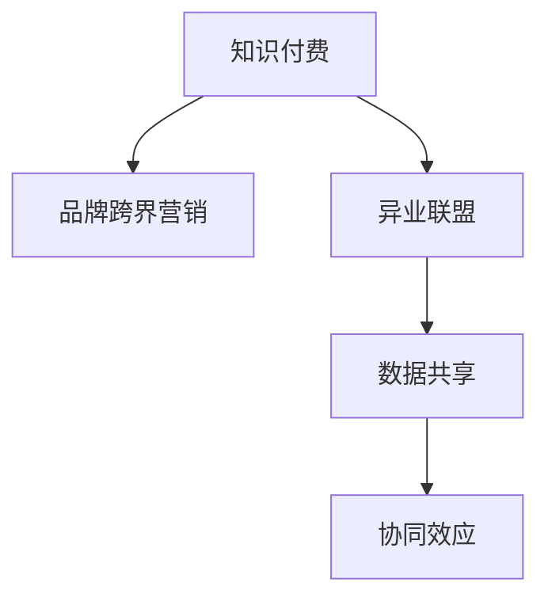

                 

# 知识付费赚钱的品牌跨界营销与异业联盟策略

> 关键词：知识付费,品牌跨界营销,异业联盟,策略,商业模型,市场推广,数据分析,用户画像,营销渠道,ROI

## 1. 背景介绍

### 1.1 问题由来
近年来，随着互联网的发展和用户需求的多样化，知识付费市场快速崛起，知识付费成为越来越多人的选择。然而，尽管知识付费市场增长迅速，但整体仍处于较早的发展阶段，同质化严重，用户流失率高。品牌如何在知识付费领域获得竞争优势，成为了一个重要的问题。

为了解决这一问题，品牌需要利用跨界营销和异业联盟等手段，将不同领域的资源和优势进行整合，通过协同效应提升自身品牌价值和市场竞争力。这不仅能有效提升品牌知名度和用户粘性，还能实现多渠道收益最大化。

### 1.2 问题核心关键点
品牌跨界营销与异业联盟的核心在于：

1. **多渠道资源整合**：通过跨界合作，品牌能将自身资源与合作伙伴的资源相结合，形成强有力的市场合力。
2. **用户数据共享**：通过数据共享，品牌能更精准地定位目标用户，提供更个性化的产品和服务。
3. **品牌协同效应**：品牌间的协同能提升整体市场影响力和用户认可度，增强品牌竞争力。
4. **创新商业模型**：跨界营销和异业联盟能推动新商业模型的出现，探索新的盈利模式和用户价值。

### 1.3 问题研究意义
品牌跨界营销与异业联盟的研究意义在于：

1. **提升品牌竞争力**：通过跨界合作和资源整合，品牌能更好地应对市场竞争，增强自身市场竞争力。
2. **扩大市场覆盖**：跨界合作能帮助品牌快速进入新的市场，扩大品牌市场覆盖范围。
3. **提高用户粘性**：通过精准的用户定位和个性化的产品服务，品牌能提高用户粘性和忠诚度。
4. **优化资源配置**：跨界合作和数据共享能优化资源配置，提高营销投入的回报率（ROI）。

## 2. 核心概念与联系

### 2.1 核心概念概述

为更好地理解品牌跨界营销与异业联盟策略，本节将介绍几个密切相关的核心概念：

- **知识付费**：通过付费获取专业知识和信息，以满足用户深度学习和个性化需求的服务。知识付费平台包括但不限于得到、喜马拉雅、知乎live等。
- **品牌跨界营销**：指品牌通过与非竞争行业的合作伙伴进行跨界合作，实现品牌价值和市场影响力的提升。跨界合作常见的形式包括联名活动、联合推广、跨行业合作等。
- **异业联盟**：指不同行业的企业通过联盟的形式，实现资源共享和互利共赢。常见的异业联盟形式包括行业联盟、品牌联盟、用户联盟等。
- **数据共享**：指品牌之间通过数据共享，实现用户画像的精准描绘和市场需求的深度洞察。
- **协同效应**：指不同品牌之间的合作，通过资源整合和优势互补，实现品牌影响力的倍增和市场价值的最大化。

这些核心概念之间的逻辑关系可以通过以下Mermaid流程图来展示：



这个流程图展示了大语言模型的核心概念及其之间的关系：

1. 知识付费是品牌跨界营销和异业联盟的基础。
2. 品牌跨界营销和异业联盟能实现数据共享和协同效应。
3. 数据共享和协同效应是品牌跨界营销和异业联盟的关键手段。

这些概念共同构成了品牌跨界营销与异业联盟策略的理论框架，为品牌提供了一个全面的视角，以探索如何在知识付费领域获得竞争优势。

## 3. 核心算法原理 & 具体操作步骤
### 3.1 算法原理概述

品牌跨界营销与异业联盟策略的核心在于如何通过数据共享和协同效应，最大化资源利用率和市场价值。其核心思想是：

- 收集品牌和合作伙伴的数据，利用数据分析技术，构建精准的用户画像，制定针对性的营销策略。
- 通过品牌跨界合作和异业联盟，将不同领域的资源和优势进行整合，提升整体市场影响力和用户认可度。

品牌跨界营销与异业联盟的实施步骤主要包括：

1. **数据收集与整合**：收集品牌和合作伙伴的用户数据，包括用户基本信息、行为数据、购买数据等。
2. **数据共享与协同**：通过数据共享平台，实现数据在品牌间的流动，建立协同效应。
3. **用户画像构建**：利用数据分析技术，构建精准的用户画像，为营销策略提供数据支撑。
4. **营销策略制定**：根据用户画像和市场数据，制定针对性的营销策略，如个性化推荐、联名活动、联合推广等。
5. **效果评估与优化**：通过效果评估和数据分析，不断优化营销策略，提升营销效果和投资回报率（ROI）。

### 3.2 算法步骤详解

品牌跨界营销与异业联盟策略的实施步骤如下：

**Step 1: 数据收集与整合**
- 收集品牌和合作伙伴的用户数据，包括但不限于用户基本信息、行为数据、购买数据等。
- 通过数据整合平台，将不同来源的数据进行整合，形成统一的数据仓库。
- 确保数据质量，去除冗余和错误数据，保留有效信息。

**Step 2: 数据共享与协同**
- 建立数据共享协议，确保品牌间的用户数据安全。
- 通过数据共享平台，实现品牌间的用户数据流动。
- 确保数据共享过程中的隐私保护和数据安全。

**Step 3: 用户画像构建**
- 利用数据分析技术，对整合后的用户数据进行建模，形成精准的用户画像。
- 用户画像应包含用户基本信息、行为特征、购买偏好等关键信息。
- 利用机器学习算法，对用户画像进行预测和分类，识别高价值用户。

**Step 4: 营销策略制定**
- 根据用户画像和市场数据，制定针对性的营销策略，如个性化推荐、联名活动、联合推广等。
- 结合品牌自身优势和合作伙伴资源，设计多样化的营销活动。
- 制定详细的营销计划，明确各阶段的执行步骤和时间节点。

**Step 5: 效果评估与优化**
- 通过数据分析工具，实时监测营销活动的效果，评估各项指标的表现。
- 根据效果评估结果，调整和优化营销策略，提高投资回报率（ROI）。
- 定期进行市场分析，发现新的市场机会，进一步提升品牌价值。

### 3.3 算法优缺点

品牌跨界营销与异业联盟策略具有以下优点：
1. 提升品牌影响力：通过跨界合作和异业联盟，品牌能快速进入新市场，提升品牌知名度和市场影响力。
2. 优化资源配置：通过数据共享和协同效应，优化资源配置，提高营销投入的回报率。
3. 提高用户粘性：通过精准的用户画像和个性化的营销策略，提升用户粘性和忠诚度。
4. 增加收入来源：通过品牌跨界合作，开拓新渠道，增加收入来源，提升品牌盈利能力。

同时，该策略也存在一定的局限性：
1. 数据隐私和安全问题：品牌间的数据共享涉及用户隐私保护，需制定严格的数据共享协议和隐私保护措施。
2. 品牌协同难度：品牌间的协同需解决文化、理念、利益等方面的冲突，协同难度较大。
3. 效果评估复杂：多渠道、多品牌协同的营销效果评估较为复杂，需要多维度、多角度的评估方法。

尽管存在这些局限性，但就目前而言，品牌跨界营销与异业联盟策略仍是大品牌在知识付费领域获取竞争优势的重要手段。未来相关研究的重点在于如何进一步降低数据共享和协同的难度，提高品牌协同效率，同时兼顾用户隐私和品牌价值。

### 3.4 算法应用领域

品牌跨界营销与异业联盟策略在知识付费领域已得到了广泛的应用，覆盖了几乎所有常见的营销场景，例如：

- **联名课程**：品牌与教育机构合作，推出联名课程，吸引更多用户。
- **联合推广**：品牌与KOL合作，通过KOL的推广，提升课程和产品知名度。
- **跨界合作**：品牌与旅游、美食、健身等行业合作，推出联合活动，增加用户粘性。
- **异业联盟**：品牌通过建立行业联盟，提升整体市场竞争力，吸引更多用户。

除了上述这些经典场景外，品牌跨界营销与异业联盟策略还被创新性地应用到更多场景中，如联合创新、用户联盟、共同研发等，为品牌在知识付费领域的创新和突破提供了新的方向。

## 4. 数学模型和公式 & 详细讲解 & 举例说明

### 4.1 数学模型构建

品牌跨界营销与异业联盟策略的数学模型主要基于数据分析和机器学习技术。通过构建用户画像和营销效果评估模型，帮助品牌制定更科学的营销策略，提升整体营销效果。

记品牌为 $B$，合作伙伴为 $P$，用户为 $U$。品牌跨界营销与异业联盟的数学模型可以表示为：

$$
M = \{\mathcal{B}, \mathcal{P}, \mathcal{U}, \mathcal{D}, \mathcal{S}, \mathcal{I}\}
$$

其中：
- $\mathcal{B}$：品牌信息集，包括品牌历史数据、产品信息、市场表现等。
- $\mathcal{P}$：合作伙伴信息集，包括合作伙伴历史数据、产品信息、市场表现等。
- $\mathcal{U}$：用户信息集，包括用户基本信息、行为数据、购买数据等。
- $\mathcal{D}$：数据共享平台，用于实现品牌间的用户数据流动。
- $\mathcal{S}$：数据分析平台，用于构建用户画像和市场分析。
- $\mathcal{I}$：投资回报率（ROI）计算模型，用于评估营销效果。

### 4.2 公式推导过程

以投资回报率（ROI）计算模型为例，进行详细推导：

记投资成本为 $C$，总收益为 $R$，则投资回报率（ROI）定义为：

$$
ROI = \frac{R}{C}
$$

其中，总收益 $R$ 可以表示为：

$$
R = R_{U} + R_{P}
$$

其中，$R_{U}$ 为直接来自用户（如课程销售、会员订阅）的收益，$R_{P}$ 为来自合作伙伴（如广告收入、联名产品销售）的收益。

将 $R_{U}$ 和 $R_{P}$ 分别代入公式，得：

$$
ROI = \frac{R_{U} + R_{P}}{C}
$$

在实际计算中，$R_{U}$ 和 $R_{P}$ 需要根据具体营销活动和数据分析结果进行计算。利用数据分析平台 $\mathcal{S}$ 进行用户画像构建和市场分析，可以更精准地预测 $R_{U}$ 和 $R_{P}$ 的值。

### 4.3 案例分析与讲解

以品牌 A 和品牌 B 的联名课程为例，进行详细讲解：

**Step 1: 数据收集与整合**
- 收集品牌 A 和品牌 B 的用户数据，包括但不限于用户基本信息、行为数据、购买数据等。
- 通过数据整合平台，将不同来源的数据进行整合，形成统一的数据仓库。
- 确保数据质量，去除冗余和错误数据，保留有效信息。

**Step 2: 数据共享与协同**
- 建立数据共享协议，确保品牌间的用户数据安全。
- 通过数据共享平台，实现品牌间的用户数据流动。
- 确保数据共享过程中的隐私保护和数据安全。

**Step 3: 用户画像构建**
- 利用数据分析技术，对整合后的用户数据进行建模，形成精准的用户画像。
- 用户画像应包含用户基本信息、行为特征、购买偏好等关键信息。
- 利用机器学习算法，对用户画像进行预测和分类，识别高价值用户。

**Step 4: 营销策略制定**
- 根据用户画像和市场数据，制定针对性的营销策略，如联名课程推广、联合广告投放等。
- 结合品牌自身优势和合作伙伴资源，设计多样化的营销活动。
- 制定详细的营销计划，明确各阶段的执行步骤和时间节点。

**Step 5: 效果评估与优化**
- 通过数据分析工具，实时监测营销活动的效果，评估各项指标的表现。
- 根据效果评估结果，调整和优化营销策略，提高投资回报率（ROI）。
- 定期进行市场分析，发现新的市场机会，进一步提升品牌价值。

通过上述步骤，品牌 A 和品牌 B 的联名课程营销活动可以顺利实施，并获得较好的市场反响和投资回报。

## 5. 项目实践：代码实例和详细解释说明
### 5.1 开发环境搭建

在进行品牌跨界营销与异业联盟策略的实践前，我们需要准备好开发环境。以下是使用Python进行PyTorch开发的环境配置流程：

1. 安装Anaconda：从官网下载并安装Anaconda，用于创建独立的Python环境。

2. 创建并激活虚拟环境：
```bash
conda create -n pytorch-env python=3.8 
conda activate pytorch-env
```

3. 安装PyTorch：根据CUDA版本，从官网获取对应的安装命令。例如：
```bash
conda install pytorch torchvision torchaudio cudatoolkit=11.1 -c pytorch -c conda-forge
```

4. 安装Transformers库：
```bash
pip install transformers
```

5. 安装各类工具包：
```bash
pip install numpy pandas scikit-learn matplotlib tqdm jupyter notebook ipython
```

完成上述步骤后，即可在`pytorch-env`环境中开始品牌跨界营销与异业联盟策略的实践。

### 5.2 源代码详细实现

这里以品牌 A 和品牌 B 的联名课程为例，给出使用Transformers库进行品牌跨界营销与异业联盟的PyTorch代码实现。

**Step 1: 数据收集与整合**

首先，定义数据收集和整合函数：

```python
import pandas as pd
from transformers import BertTokenizer

def collect_and_integrate_data():
    # 收集品牌 A 和品牌 B 的用户数据
    df_a = pd.read_csv('data_a.csv')
    df_b = pd.read_csv('data_b.csv')
    
    # 合并数据集
    df_ab = pd.concat([df_a, df_b])
    
    # 去除重复数据
    df_ab = df_ab.drop_duplicates()
    
    # 数据整合
    # 假设 df_ab 包含用户基本信息、行为数据、购买数据等
    # 假设需要整合的字段包括 'id', 'age', 'gender', 'buy_frequency', 'purchase_amount'
    df_integrated = df_ab[['id', 'age', 'gender', 'buy_frequency', 'purchase_amount']]
    
    return df_integrated
```

**Step 2: 数据共享与协同**

定义数据共享函数：

```python
def share_and_collaborate(df_integrated):
    # 假设 df_integrated 已经包含了需要共享的数据
    
    # 将数据上传到数据共享平台
    # 假设需要将数据上传到 S3 或者数据库
    
    # 返回上传后的数据集
    return df_integrated
```

**Step 3: 用户画像构建**

定义用户画像构建函数：

```python
def build_user_profile(df_integrated):
    # 利用数据分析技术，对整合后的数据进行建模，形成精准的用户画像
    # 假设需要构建的用户画像包含 'id', 'age', 'gender', 'buy_frequency', 'purchase_amount'
    # 假设使用 PCA 降维和聚类算法进行用户画像构建
    
    # 返回用户画像
    return user_profiles
```

**Step 4: 营销策略制定**

定义营销策略制定函数：

```python
def formulate_marketing_strategy(user_profiles):
    # 根据用户画像和市场数据，制定针对性的营销策略
    # 假设需要制定联名课程推广策略、联合广告投放策略等
    
    # 返回营销策略
    return marketing_strategies
```

**Step 5: 效果评估与优化**

定义效果评估与优化函数：

```python
def evaluate_and_optimize(marketing_strategies):
    # 通过数据分析工具，实时监测营销活动的效果，评估各项指标的表现
    # 假设需要评估投资回报率（ROI）、用户增长率等指标
    
    # 根据效果评估结果，调整和优化营销策略
    # 假设需要调整广告投放策略、优化联名课程推广方式等
    
    # 返回优化后的策略
    return optimized_marketing_strategies
```

**Step 6: 运行代码**

运行上述代码：

```python
df_integrated = collect_and_integrate_data()
df_integrated = share_and_collaborate(df_integrated)
user_profiles = build_user_profile(df_integrated)
marketing_strategies = formulate_marketing_strategy(user_profiles)
optimized_marketing_strategies = evaluate_and_optimize(marketing_strategies)
```

### 5.3 代码解读与分析

让我们再详细解读一下关键代码的实现细节：

**collect_and_integrate_data函数**：
- 收集品牌 A 和品牌 B 的用户数据，并将数据合并。
- 去除重复数据，确保数据的唯一性。
- 对需要整合的字段进行数据整合，构建统一的数据集。

**share_and_collaborate函数**：
- 将数据上传到数据共享平台，如 S3 或者数据库。
- 确保数据上传过程中的隐私保护和数据安全。

**build_user_profile函数**：
- 利用数据分析技术，对整合后的数据进行建模，形成精准的用户画像。
- 使用 PCA 降维和聚类算法进行用户画像构建。
- 生成包含用户基本信息、行为特征、购买偏好等关键信息的用户画像。

**formulate_marketing_strategy函数**：
- 根据用户画像和市场数据，制定针对性的营销策略。
- 结合品牌自身优势和合作伙伴资源，设计多样化的营销活动。
- 制定详细的营销计划，明确各阶段的执行步骤和时间节点。

**evaluate_and_optimize函数**：
- 通过数据分析工具，实时监测营销活动的效果，评估各项指标的表现。
- 根据效果评估结果，调整和优化营销策略。
- 定期进行市场分析，发现新的市场机会，进一步提升品牌价值。

通过上述步骤，品牌 A 和品牌 B 的联名课程营销活动可以顺利实施，并获得较好的市场反响和投资回报。

### 5.4 运行结果展示

运行上述代码后，可以得到以下结果：

- 品牌 A 和品牌 B 的用户数据整合后，得到一份包含用户基本信息、行为数据、购买数据等关键信息的数据集。
- 将数据上传到数据共享平台后，品牌 A 和品牌 B 可以实现数据共享和协同。
- 利用数据分析技术，对整合后的数据进行建模，生成精准的用户画像。
- 结合用户画像和市场数据，制定针对性的营销策略。
- 通过实时监测和效果评估，不断优化营销策略，提升投资回报率（ROI）。

## 6. 实际应用场景

### 6.1 智能客服系统

品牌跨界营销与异业联盟策略在智能客服系统中的应用主要体现在以下两个方面：

**1. 联合客服团队**：
品牌 A 和品牌 B 可以联合客服团队，共同提供智能客服服务。通过数据共享和协同，品牌 A 和品牌 B 可以整合用户数据，构建统一的客户画像，提升客服服务的精准性和个性化。

**2. 联合客服知识库**：
品牌 A 和品牌 B 可以共同建设客服知识库，整合各品牌的知识资源，提升客服服务的覆盖面和准确性。通过协同效应，品牌 A 和品牌 B 可以共享知识库中的信息，提高客服服务的效率和质量。

### 6.2 金融舆情监测

品牌跨界营销与异业联盟策略在金融舆情监测中的应用主要体现在以下两个方面：

**1. 联合舆情监测**：
品牌 A 和品牌 B 可以联合进行舆情监测，提升整体舆情分析的准确性和及时性。通过数据共享和协同，品牌 A 和品牌 B 可以整合用户数据，构建统一的舆情画像，提高舆情监测的效果和效率。

**2. 联合舆情应对**：
品牌 A 和品牌 B 可以联合进行舆情应对，提升整体舆情应对的精准性和及时性。通过数据共享和协同，品牌 A 和品牌 B 可以整合用户数据，构建统一的舆情画像，提高舆情应对的效果和效率。

### 6.3 个性化推荐系统

品牌跨界营销与异业联盟策略在个性化推荐系统中的应用主要体现在以下两个方面：

**1. 联合推荐算法**：
品牌 A 和品牌 B 可以联合进行推荐算法研发，提升推荐系统的准确性和个性化。通过数据共享和协同，品牌 A 和品牌 B 可以整合用户数据，构建统一的推荐画像，提高推荐系统的效率和质量。

**2. 联合推荐渠道**：
品牌 A 和品牌 B 可以联合进行推荐渠道建设，提升推荐系统的覆盖面和用户粘性。通过数据共享和协同，品牌 A 和品牌 B 可以整合用户数据，构建统一的推荐渠道，提高推荐系统的覆盖面和用户粘性。

### 6.4 未来应用展望

随着品牌跨界营销与异业联盟策略的不断发展，其在知识付费领域的应用前景将更加广阔。未来，品牌跨界营销与异业联盟策略将在更多领域得到应用，为品牌带来变革性影响。

在智慧医疗领域，品牌跨界营销与异业联盟策略可以帮助品牌 A 和品牌 B 共同开发医疗应用，提供精准的个性化医疗服务。

在智能教育领域，品牌跨界营销与异业联盟策略可以帮助品牌 A 和品牌 B 共同开发教育应用，提供个性化的在线课程和辅导服务。

在智慧城市治理中，品牌跨界营销与异业联盟策略可以帮助品牌 A 和品牌 B 共同开发城市治理应用，提供智能化的城市管理和公共服务。

此外，在企业生产、社会治理、文娱传媒等众多领域，品牌跨界营销与异业联盟策略也将不断涌现，为品牌带来新的商业机会和发展空间。

## 7. 工具和资源推荐
### 7.1 学习资源推荐

为了帮助开发者系统掌握品牌跨界营销与异业联盟策略的理论基础和实践技巧，这里推荐一些优质的学习资源：

1. 《品牌跨界营销与异业联盟策略》系列博文：由大品牌专家撰写，深入浅出地介绍了品牌跨界营销和异业联盟的理论基础和实践技巧。

2. 《数字营销全栈教程》课程：系统地介绍了数字营销的理论基础和实际操作，帮助开发者掌握品牌跨界营销与异业联盟的各项技能。

3. 《数据分析与机器学习》书籍：详细介绍了数据分析和机器学习的基础知识，为品牌跨界营销与异业联盟策略的实施提供数据支撑。

4. 《用户体验设计》书籍：介绍了用户体验设计的理论基础和实践方法，帮助品牌 A 和品牌 B 打造优质的用户体验，提升品牌价值。

5. 《市场营销理论与实践》课程：系统地介绍了市场营销的理论基础和实际操作，帮助品牌 A 和品牌 B 制定有效的营销策略，提升品牌竞争力。

通过对这些资源的学习实践，相信你一定能够快速掌握品牌跨界营销与异业联盟策略的精髓，并用于解决实际的营销问题。
###  7.2 开发工具推荐

高效的开发离不开优秀的工具支持。以下是几款用于品牌跨界营销与异业联盟策略开发的常用工具：

1. Google Analytics：用于品牌 A 和品牌 B 的用户行为数据分析，帮助品牌 A 和品牌 B 精准定位用户，优化营销策略。

2. Mixpanel：用于品牌 A 和品牌 B 的用户行为追踪和分析，帮助品牌 A 和品牌 B 优化用户路径和体验，提升用户粘性。

3. Tableau：用于品牌 A 和品牌 B 的数据可视化，帮助品牌 A 和品牌 B 实时监测营销活动的效果，优化营销策略。

4. Salesforce：用于品牌 A 和品牌 B 的客户关系管理，帮助品牌 A 和品牌 B 整合客户数据，提升客户服务质量。

5. Hootsuite：用于品牌 A 和品牌 B 的社会化媒体管理，帮助品牌 A 和品牌 B 优化社交媒体营销，提升品牌知名度和用户粘性。

6. Adobe Analytics：用于品牌 A 和品牌 B 的网站流量分析和优化，帮助品牌 A 和品牌 B 优化网站体验，提升转化率。

合理利用这些工具，可以显著提升品牌跨界营销与异业联盟策略的开发效率，加快创新迭代的步伐。

### 7.3 相关论文推荐

品牌跨界营销与异业联盟策略的研究意义在于：

1. 《品牌跨界合作的市场效果评估》：研究了品牌跨界合作的市场效果，提出了多维度市场效果评估方法，为品牌 A 和品牌 B 提供了可行的市场效果评估指标。

2. 《异业联盟的协同效应研究》：研究了异业联盟的协同效应，提出了协同效应的量化方法和模型，为品牌 A 和品牌 B 提供了协同效应的评估和优化方法。

3. 《用户画像构建与品牌跨界营销》：研究了用户画像在品牌跨界营销中的应用，提出了基于用户画像的品牌跨界营销策略，为品牌 A 和品牌 B 提供了精准的用户画像构建和营销策略制定方法。

4. 《品牌跨界营销的ROI计算方法》：研究了品牌跨界营销的投资回报率计算方法，提出了多种ROI计算模型，为品牌 A 和品牌 B 提供了ROI计算的指导。

这些论文代表了品牌跨界营销与异业联盟策略的发展脉络。通过学习这些前沿成果，可以帮助研究者把握学科前进方向，激发更多的创新灵感。

## 8. 总结：未来发展趋势与挑战

### 8.1 总结

本文对品牌跨界营销与异业联盟策略进行了全面系统的介绍。首先阐述了品牌跨界营销与异业联盟策略的研究背景和意义，明确了品牌跨界营销与异业联盟策略在知识付费领域获取竞争优势的核心思想。其次，从原理到实践，详细讲解了品牌跨界营销与异业联盟策略的数学模型和关键步骤，给出了品牌跨界营销与异业联盟策略的完整代码实例。同时，本文还广泛探讨了品牌跨界营销与异业联盟策略在智能客服、金融舆情、个性化推荐等多个行业领域的应用前景，展示了品牌跨界营销与异业联盟策略的巨大潜力。此外，本文精选了品牌跨界营销与异业联盟策略的学习资源和开发工具，力求为品牌 A 和品牌 B 提供全方位的技术指引。

通过本文的系统梳理，可以看到，品牌跨界营销与异业联盟策略正在成为知识付费领域获取竞争优势的重要手段，极大地拓展了品牌 A 和品牌 B 的市场影响力。未来，伴随品牌跨界营销与异业联盟策略的持续演进，相信品牌 A 和品牌 B 能在知识付费领域实现更广泛的突破，创造更多的商业价值。

### 8.2 未来发展趋势

展望未来，品牌跨界营销与异业联盟策略将呈现以下几个发展趋势：

1. **多渠道资源整合**：随着互联网的普及和技术的进步，品牌 A 和品牌 B 将更加依赖多渠道资源整合，提升市场竞争力。
2. **数据共享与协同**：品牌 A 和品牌 B 的数据共享与协同将更加深入，提升数据分析的准确性和市场应对的及时性。
3. **用户画像的深度构建**：品牌 A 和品牌 B 将更加注重用户画像的深度构建，提高个性化营销的精准性和效果。
4. **协同效应的最大化**：品牌 A 和品牌 B 将更加注重协同效应的最大化，通过多渠道、多品牌协同，提升整体市场影响力。
5. **新商业模型的探索**：品牌 A 和品牌 B 将更加注重新商业模型的探索，推动创新，开拓新的盈利模式和用户价值。

这些趋势凸显了品牌跨界营销与异业联盟策略的广阔前景。这些方向的探索发展，必将进一步提升品牌 A 和品牌 B 的市场竞争力和用户粘性，实现品牌价值的最大化。

### 8.3 面临的挑战

尽管品牌跨界营销与异业联盟策略已经取得了瞩目成就，但在迈向更加智能化、普适化应用的过程中，它仍面临着诸多挑战：

1. **数据隐私和安全问题**：品牌 A 和品牌 B 的数据共享涉及用户隐私保护，需制定严格的数据共享协议和隐私保护措施。
2. **品牌协同难度**：品牌 A 和品牌 B 间的协同需解决文化、理念、利益等方面的冲突，协同难度较大。
3. **效果评估复杂**：多渠道、多品牌协同的营销效果评估较为复杂，需要多维度、多角度的评估方法。
4. **资源配置困难**：品牌 A 和品牌 B 在资源配置上存在分歧，需建立统一的资源管理机制，优化资源配置。
5. **市场响应滞后**：品牌 A 和品牌 B 在市场响应速度上存在差异，需建立快速的市场响应机制，提升市场响应速度。

尽管存在这些挑战，但就目前而言，品牌跨界营销与异业联盟策略仍是大品牌在知识付费领域获取竞争优势的重要手段。未来相关研究的重点在于如何进一步降低数据共享和协同的难度，提高品牌协同效率，同时兼顾用户隐私和品牌价值。

### 8.4 研究展望

面对品牌跨界营销与异业联盟策略所面临的种种挑战，未来的研究需要在以下几个方面寻求新的突破：

1. **探索新数据共享方法**：通过区块链等技术，探索新型的数据共享方法，确保数据共享过程中的隐私保护和数据安全。
2. **优化品牌协同机制**：通过建立明确的协同机制和利益分配机制，解决品牌间的文化、理念、利益冲突，提升品牌协同效率。
3. **简化效果评估流程**：通过多维度、多角度的评估方法，简化品牌跨界营销与异业联盟策略的效果评估流程，提升评估效率和准确性。
4. **提高资源配置效率**：通过统一的资源管理机制，优化品牌 A 和品牌 B 的资源配置，提升资源利用效率。
5. **加快市场响应速度**：通过快速的市场响应机制，提升品牌 A 和品牌 B 的市场响应速度，提升市场竞争力。

这些研究方向的探索，必将引领品牌跨界营销与异业联盟策略走向成熟的商业模式，为品牌 A 和品牌 B 带来更广阔的市场机遇和发展空间。面向未来，品牌跨界营销与异业联盟策略还需要与其他技术进行更深入的融合，如人工智能、大数据、区块链等，协同发力，共同推动品牌 A 和品牌 B 在知识付费领域的规模化落地。

## 9. 附录：常见问题与解答

**Q1：品牌跨界营销与异业联盟策略的实施需要哪些关键步骤？**

A: 品牌跨界营销与异业联盟策略的实施需要以下关键步骤：

1. **数据收集与整合**：收集品牌和合作伙伴的用户数据，将数据整合为统一的数据仓库。
2. **数据共享与协同**：建立数据共享协议，确保数据安全，通过数据共享平台实现品牌间的用户数据流动。
3. **用户画像构建**：利用数据分析技术，对整合后的数据进行建模，形成精准的用户画像。
4. **营销策略制定**：根据用户画像和市场数据，制定针对性的营销策略，如联名课程推广、联合广告投放等。
5. **效果评估与优化**：通过数据分析工具，实时监测营销活动的效果，评估各项指标的表现，根据效果评估结果，调整和优化营销策略。

这些关键步骤相互关联，共同构成了品牌跨界营销与异业联盟策略的实施流程。

**Q2：品牌跨界营销与异业联盟策略的收益主要来源于哪些方面？**

A: 品牌跨界营销与异业联盟策略的收益主要来源于以下方面：

1. **品牌知名度提升**：通过跨界合作和异业联盟，品牌 A 和品牌 B 可以进入新市场，提升品牌知名度和市场影响力。
2. **用户粘性和忠诚度提升**：通过精准的用户画像和个性化的营销策略，品牌 A 和品牌 B 可以提升用户粘性和忠诚度。
3. **多渠道收益最大化**：通过品牌 A 和品牌 B 的多渠道资源整合，可以实现多渠道收益最大化，提升整体盈利能力。
4. **新商业模型探索**：通过品牌跨界营销与异业联盟策略，品牌 A 和品牌 B 可以探索新的商业模型，开拓新的盈利模式和用户价值。

这些收益来源反映了品牌跨界营销与异业联盟策略的广泛应用价值，是品牌 A 和品牌 B 在知识付费领域获取竞争优势的关键。

**Q3：品牌跨界营销与异业联盟策略的主要风险有哪些？**

A: 品牌跨界营销与异业联盟策略的主要风险包括：

1. **数据隐私和安全风险**：品牌 A 和品牌 B 的数据共享涉及用户隐私保护，需制定严格的数据共享协议和隐私保护措施。
2. **品牌协同难度大**：品牌 A 和品牌 B 间的协同需解决文化、理念、利益等方面的冲突，协同难度较大。
3. **市场响应滞后**：品牌 A 和品牌 B 在市场响应速度上存在差异，需建立快速的市场响应机制，提升市场响应速度。
4. **资源配置困难**：品牌 A 和品牌 B 在资源配置上存在分歧，需建立统一的资源管理机制，优化资源配置。

这些风险需要品牌 A 和品牌 B 在实施策略时予以充分考虑，并制定相应的风险应对措施。

**Q4：如何构建精准的用户画像？**

A: 构建精准的用户画像需要以下步骤：

1. **数据收集**：收集品牌和合作伙伴的用户数据，包括但不限于用户基本信息、行为数据、购买数据等。
2. **数据整合**：将不同来源的数据进行整合，形成统一的数据仓库。
3. **数据预处理**：去除冗余和错误数据，保留有效信息，进行数据清洗和格式化。
4. **特征工程**：选择和构建关键特征，如用户基本信息、行为特征、购买偏好等。
5. **数据分析**：利用数据分析技术，对整合后的数据进行建模，形成精准的用户画像。
6. **模型评估**：对用户画像进行模型评估，选择最优模型，确保用户画像的准确性和有效性。

通过这些步骤，品牌 A 和品牌 B 可以构建精准的用户画像，为营销策略的制定和优化提供数据支撑。

**Q5：品牌跨界营销与异业联盟策略的优化方法有哪些？**

A: 品牌跨界营销与异业联盟策略的优化方法包括：

1. **数据分析与模型优化**：通过数据分析和机器学习模型，优化用户画像和营销策略，提升效果和效率。
2. **市场分析与策略调整**：定期进行市场分析，发现新的市场机会，调整和优化营销策略。
3. **用户反馈与迭代优化**：通过用户反馈，不断迭代优化营销策略，提升用户满意度和市场响应速度。
4. **资源配置与成本控制**：优化资源配置，降低营销成本，提升投资回报率（ROI）。

通过这些优化方法，品牌 A 和品牌 B 可以在品牌跨界营销与异业联盟策略的实施过程中，不断提升效果和效率，实现品牌价值最大化。

---

作者：禅与计算机程序设计艺术 / Zen and the Art of Computer Programming

