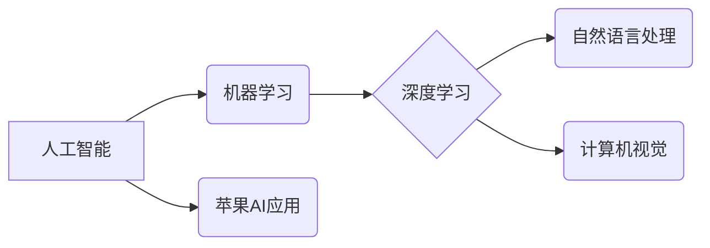
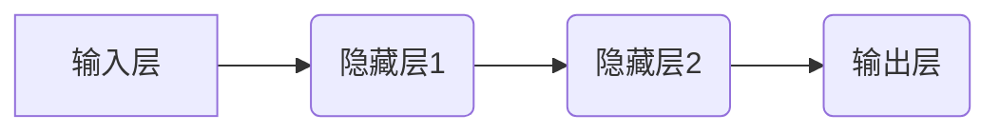

> 苹果, AI应用, 投资价值, 人工智能, 深度学习, 自然语言处理, 计算机视觉, 

## 1. 背景介绍

近年来，人工智能（AI）技术飞速发展，已渗透到生活的方方面面。从智能手机的语音助手到自动驾驶汽车，AI正在改变着我们的世界。作为科技巨头，苹果也积极布局AI领域，并于近期发布了一系列AI应用。这些应用涵盖了自然语言处理、计算机视觉等多个领域，展现了苹果在AI领域的强大实力。

李开复，作为一位享誉全球的人工智能专家，对苹果发布AI应用的投资价值进行了深入的分析。他认为，苹果拥有强大的硬件、软件和生态系统，以及庞大的用户群体，这些优势为其在AI领域的发展提供了坚实的基础。

## 2. 核心概念与联系

### 2.1  人工智能 (AI)

人工智能是指模拟人类智能行为的计算机系统。它涵盖了多个子领域，例如机器学习、深度学习、自然语言处理、计算机视觉等。

### 2.2  机器学习 (ML)

机器学习是人工智能的一个重要分支，它通过算法训练模型，使模型能够从数据中学习并做出预测或决策。

### 2.3  深度学习 (DL)

深度学习是机器学习的一种更高级形式，它使用多层神经网络来模拟人类大脑的学习过程。深度学习在图像识别、语音识别、自然语言处理等领域取得了突破性的进展。

### 2.4  自然语言处理 (NLP)

自然语言处理是指让计算机能够理解和处理人类语言的技术。它包括文本分析、机器翻译、语音识别等应用。

### 2.5  计算机视觉 (CV)

计算机视觉是指让计算机能够“看”和理解图像的技术。它包括图像识别、物体检测、图像分割等应用。

**核心概念与联系流程图**



## 3. 核心算法原理 & 具体操作步骤

### 3.1  算法原理概述

苹果发布的AI应用主要基于深度学习算法。深度学习算法通过多层神经网络来学习数据特征，并进行预测或决策。

### 3.2  算法步骤详解

1. **数据收集和预处理:** 收集大量相关数据，并进行清洗、格式化等预处理工作。
2. **模型构建:** 根据任务需求选择合适的深度学习模型架构，例如卷积神经网络（CNN）或循环神经网络（RNN）。
3. **模型训练:** 使用训练数据训练模型，调整模型参数，使模型能够准确地进行预测或决策。
4. **模型评估:** 使用测试数据评估模型的性能，例如准确率、召回率等指标。
5. **模型部署:** 将训练好的模型部署到实际应用场景中，例如手机应用程序、服务器端等。

### 3.3  算法优缺点

**优点:**

* 能够学习复杂的数据特征，取得更高的准确率。
* 能够处理海量数据，具有强大的泛化能力。

**缺点:**

* 需要大量的训练数据，训练成本较高。
* 模型训练时间较长，需要强大的计算资源。
* 模型解释性较差，难以理解模型的决策过程。

### 3.4  算法应用领域

深度学习算法广泛应用于各个领域，例如：

* **图像识别:** 人脸识别、物体检测、图像分类等。
* **语音识别:** 语音转文本、语音助手等。
* **自然语言处理:** 机器翻译、文本摘要、情感分析等。
* **推荐系统:** 商品推荐、内容推荐等。

## 4. 数学模型和公式 & 详细讲解 & 举例说明

### 4.1  数学模型构建

深度学习模型通常由多个神经网络层组成，每一层都包含多个神经元。每个神经元接收来自上一层的输入信号，并通过激活函数进行处理，输出到下一层。

**神经网络层结构:**



### 4.2  公式推导过程

深度学习模型的训练过程是通过优化模型参数来最小化损失函数的过程。损失函数衡量模型预测结果与真实结果之间的差异。常用的损失函数包括均方误差（MSE）和交叉熵损失（Cross-Entropy Loss）。

**均方误差 (MSE):**

$$MSE = \frac{1}{n} \sum_{i=1}^{n} (y_i - \hat{y}_i)^2$$

其中：

* $y_i$ 是真实值
* $\hat{y}_i$ 是模型预测值
* $n$ 是样本数量

**交叉熵损失 (Cross-Entropy Loss):**

$$Cross-Entropy Loss = -\sum_{i=1}^{n} y_i \log(\hat{y}_i)$$

其中：

* $y_i$ 是真实值
* $\hat{y}_i$ 是模型预测值

### 4.3  案例分析与讲解

例如，在图像分类任务中，可以使用卷积神经网络（CNN）模型进行训练。CNN模型能够学习图像特征，并将其映射到不同的类别。训练过程中，使用交叉熵损失函数来衡量模型预测结果与真实类别之间的差异。通过优化模型参数，使损失函数最小化，从而提高模型的分类准确率。

## 5. 项目实践：代码实例和详细解释说明

### 5.1  开发环境搭建

使用Python语言开发深度学习模型，需要安装相关的库和工具，例如TensorFlow、PyTorch、NumPy等。

### 5.2  源代码详细实现

以下是一个简单的深度学习模型的代码示例，使用TensorFlow框架实现图像分类任务：

```python
import tensorflow as tf

# 定义模型架构
model = tf.keras.models.Sequential([
    tf.keras.layers.Conv2D(32, (3, 3), activation='relu', input_shape=(28, 28, 1)),
    tf.keras.layers.MaxPooling2D((2, 2)),
    tf.keras.layers.Conv2D(64, (3, 3), activation='relu'),
    tf.keras.layers.MaxPooling2D((2, 2)),
    tf.keras.layers.Flatten(),
    tf.keras.layers.Dense(10, activation='softmax')
])

# 编译模型
model.compile(optimizer='adam',
              loss='sparse_categorical_crossentropy',
              metrics=['accuracy'])

# 训练模型
model.fit(x_train, y_train, epochs=5)

# 评估模型
loss, accuracy = model.evaluate(x_test, y_test)
print('Test loss:', loss)
print('Test accuracy:', accuracy)
```

### 5.3  代码解读与分析

* **模型架构:** 代码定义了一个简单的卷积神经网络模型，包含两层卷积层、两层最大池化层、一层全连接层和一层输出层。
* **激活函数:** 使用ReLU激活函数，能够提高模型的学习能力。
* **损失函数:** 使用交叉熵损失函数，适合分类任务。
* **优化器:** 使用Adam优化器，能够快速收敛。
* **训练过程:** 使用训练数据训练模型，并设置训练轮数（epochs）。
* **评估过程:** 使用测试数据评估模型的性能，并打印测试损失和准确率。

### 5.4  运行结果展示

训练完成后，可以将模型保存下来，并在需要时进行部署。

## 6. 实际应用场景

### 6.1  智能助手

苹果的Siri智能助手利用自然语言处理技术，能够理解用户的语音指令，并执行相应的操作。

### 6.2  图像识别

苹果的iPhone手机内置了强大的图像识别功能，能够识别物体、场景、人脸等。

### 6.3  推荐系统

苹果的App Store和音乐平台使用推荐系统，根据用户的喜好推荐相关的应用程序和音乐。

### 6.4  未来应用展望

随着人工智能技术的不断发展，苹果在AI领域的应用场景将会更加广泛，例如：

* **个性化医疗:** 利用AI技术分析患者的医疗数据，提供个性化的诊断和治疗方案。
* **自动驾驶:** 利用AI技术实现自动驾驶汽车，提高交通安全和效率。
* **增强现实:** 利用AI技术增强现实体验，例如在虚拟世界中进行互动。

## 7. 工具和资源推荐

### 7.1  学习资源推荐

* **在线课程:** Coursera、edX、Udacity等平台提供丰富的AI课程。
* **书籍:** 《深度学习》、《机器学习实战》等书籍是学习AI的基础教材。
* **博客:** TensorFlow博客、PyTorch博客等博客提供最新的AI技术资讯和案例分享。

### 7.2  开发工具推荐

* **TensorFlow:** Google开发的开源深度学习框架。
* **PyTorch:** Facebook开发的开源深度学习框架。
* **Keras:** TensorFlow的高级API，简化了深度学习模型的开发。

### 7.3  相关论文推荐

* **《ImageNet Classification with Deep Convolutional Neural Networks》:** AlexNet模型的论文，标志着深度学习在图像识别领域的突破。
* **《Attention Is All You Need》:** Transformer模型的论文，在自然语言处理领域取得了突破性的进展。

## 8. 总结：未来发展趋势与挑战

### 8.1  研究成果总结

近年来，人工智能技术取得了显著的进展，深度学习算法在各个领域取得了突破性的应用。苹果在AI领域也取得了重要成果，发布了一系列AI应用，展现了其强大的技术实力。

### 8.2  未来发展趋势

未来，人工智能技术将继续发展，并应用到更多领域。例如：

* **更强大的计算能力:** 随着硬件技术的进步，人工智能模型将更加强大，能够处理更复杂的数据。
* **更广泛的数据应用:** 人工智能模型需要大量的训练数据，未来数据获取和处理技术将更加成熟。
* **更强的解释性:** 人工智能模型的决策过程难以理解，未来将研究更具解释性的模型。

### 8.3  面临的挑战

人工智能技术也面临着一些挑战，例如：

* **数据隐私和安全:** 人工智能模型需要大量数据进行训练，如何保护数据隐私和安全是一个重要问题。
* **算法偏见:** 人工智能模型可能存在算法偏见，导致不公平的结果。
* **伦理问题:** 人工智能技术的应用可能会带来一些伦理问题，例如自动驾驶汽车的责任归属。

### 8.4  研究展望

未来，人工智能研究将继续深入，探索更强大的算法、更广泛的应用场景，并解决人工智能技术带来的挑战。


## 9. 附录：常见问题与解答

### 9.1  Q1: 深度学习算法的训练需要多长时间？

**A1:** 深度学习算法的训练时间取决于模型复杂度、数据量和计算资源等因素。一般来说，训练时间可能从几小时到几天甚至几周不等。

### 9.2  Q2: 如何评估深度学习模型的性能？

**A2:** 深度学习模型的性能可以通过多种指标进行评估，例如准确率、召回率、F1-score等。选择合适的评估指标取决于具体的任务需求。

### 9.3  Q3: 如何解决深度学习模型的过拟合问题？

**A3:** 过拟合是指模型在训练数据上表现良好，但在测试数据上表现较差。解决过拟合问题的方法包括：

* 增加训练数据量
* 使用正则化技术
* 使用Dropout技术
* 使用早停策略

### 9.4  Q4: 深度学习算法的应用领域有哪些？

**A4:** 深度学习算法广泛应用于各个领域，例如：

* **图像识别:** 人脸识别、物体检测、图像分类等。
* **语音识别:** 语音转文本、语音助手等。
* **自然语言处理:** 机器翻译、文本摘要、