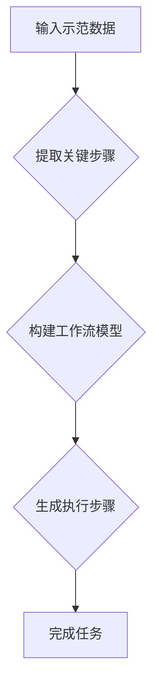

> 工作流学习，模仿学习，强化学习，深度学习，迁移学习，模型训练，算法优化

## 1. 背景介绍

在人工智能领域，模仿式学习（Imitation Learning，IL）作为一种重要的学习范式，近年来备受关注。它旨在通过学习人类专家或其他代理的示范行为，从而构建能够执行特定任务的智能体。与监督学习不同，模仿式学习不需要大量的标注数据，而是通过观察和模仿专家行为来学习。

随着人工智能技术的不断发展，模仿式学习在各个领域都展现出巨大的应用潜力，例如机器人控制、自动驾驶、游戏 AI 等。然而，模仿式学习也面临着一些挑战，例如如何有效地从示范数据中提取有用的知识，如何避免过拟合，如何推广到新的环境和任务等。

## 2. 核心概念与联系

模仿式学习的核心概念是**模仿**。它试图通过学习人类专家或其他代理的示范行为，来构建能够执行类似行为的智能体。

**工作流学习**是指通过学习一系列步骤或任务，来完成更复杂的目标。它可以将复杂的任务分解成一系列更小的子任务，并通过学习每个子任务的解决方案，最终完成整个目标任务。

模仿式工作流学习将模仿式学习和工作流学习相结合，旨在通过学习人类专家或其他代理的工作流程，来构建能够执行复杂任务的智能体。

**Mermaid 流程图：**



## 3. 核心算法原理 & 具体操作步骤

### 3.1  算法原理概述

模仿式工作流学习的核心算法通常基于**强化学习**（Reinforcement Learning，RL）和**深度学习**（Deep Learning，DL）的原理。

* **强化学习:** 强化学习是一种基于奖励机制的学习方法，智能体通过与环境交互，获得奖励或惩罚，并根据这些反馈调整自己的行为策略，以最大化累积奖励。
* **深度学习:** 深度学习是一种利用多层神经网络进行学习的机器学习方法，能够从复杂的数据中提取出高层次的特征和模式。

模仿式工作流学习算法通常将工作流程分解成一系列步骤，每个步骤都作为一个独立的强化学习任务。智能体通过学习每个步骤的奖励函数，并使用深度学习模型来学习每个步骤的策略，最终构建出一个完整的执行工作流程的策略。

### 3.2  算法步骤详解

1. **数据收集:** 收集人类专家或其他代理执行工作流程的示范数据。
2. **数据预处理:** 对示范数据进行预处理，例如去除噪声、规范化数据等。
3. **工作流程分解:** 将工作流程分解成一系列步骤，每个步骤都作为一个独立的强化学习任务。
4. **奖励函数设计:** 为每个步骤设计一个奖励函数，该函数能够衡量智能体执行该步骤的质量。
5. **深度学习模型训练:** 使用深度学习模型来学习每个步骤的策略，并根据奖励函数进行训练。
6. **工作流程整合:** 将每个步骤的策略整合在一起，构建出一个完整的执行工作流程的策略。
7. **策略评估:** 使用测试数据评估智能体的执行性能。

### 3.3  算法优缺点

**优点:**

* 不需要大量的标注数据。
* 可以学习复杂的工作流程。
* 可以推广到新的环境和任务。

**缺点:**

* 需要设计合理的奖励函数。
* 容易出现过拟合问题。
* 训练过程可能比较复杂。

### 3.4  算法应用领域

* **机器人控制:** 训练机器人执行复杂的任务，例如搬运物体、组装产品等。
* **自动驾驶:** 训练自动驾驶汽车在复杂道路环境中行驶。
* **游戏 AI:** 训练游戏 AI 能够执行复杂的策略和决策。
* **医疗诊断:** 训练 AI 能够辅助医生进行诊断。

## 4. 数学模型和公式 & 详细讲解 & 举例说明

### 4.1  数学模型构建

模仿式工作流学习的数学模型通常基于强化学习的原理，可以表示为一个马尔可夫决策过程（Markov Decision Process，MDP）。

* **状态空间 (S):** 工作流程中所有可能的执行状态。
* **动作空间 (A):** 在每个状态下可以执行的所有动作。
* **状态转移概率 (P):** 从一个状态执行一个动作后转移到另一个状态的概率。
* **奖励函数 (R):** 在每个状态执行一个动作后获得的奖励。
* **策略 (π):** 在每个状态下选择动作的策略。

### 4.2  公式推导过程

模仿式工作流学习的目标是找到一个策略 π，使得智能体在执行工作流程时能够获得最大的累积奖励。

可以使用**Bellman方程**来更新策略：

$$
V^{\pi}(s) = \max_{a \in A} \left[ R(s, a) + \gamma \sum_{s' \in S} P(s' | s, a) V^{\pi}(s') \right]
$$

其中：

* $V^{\pi}(s)$ 是状态 $s$ 下策略 $\pi$ 的价值函数。
* $R(s, a)$ 是在状态 $s$ 执行动作 $a$ 后获得的奖励。
* $\gamma$ 是折扣因子，控制未来奖励的权重。

### 4.3  案例分析与讲解

假设我们有一个工作流程，包括三个步骤：

1. **获取数据:** 从数据库中获取数据。
2. **预处理数据:** 对数据进行清洗和转换。
3. **训练模型:** 使用训练数据训练机器学习模型。

我们可以将每个步骤作为一个独立的强化学习任务，并设计相应的奖励函数。例如，在“获取数据”步骤中，奖励函数可以根据获取的数据量来评估。在“预处理数据”步骤中，奖励函数可以根据数据质量来评估。在“训练模型”步骤中，奖励函数可以根据模型的准确率来评估。

通过训练每个步骤的策略，我们可以最终构建出一个完整的执行工作流程的策略。

## 5. 项目实践：代码实例和详细解释说明

### 5.1  开发环境搭建

* Python 3.7+
* TensorFlow 2.0+
* PyTorch 1.0+
* OpenAI Gym

### 5.2  源代码详细实现

```python
# 导入必要的库
import tensorflow as tf
from tensorflow.keras.models import Sequential
from tensorflow.keras.layers import Dense

# 定义工作流程的步骤
def step1(data):
    # 获取数据
    # ...
    return processed_data

def step2(processed_data):
    # 预处理数据
    # ...
    return preprocessed_data

def step3(preprocessed_data):
    # 训练模型
    # ...
    return model

# 定义奖励函数
def reward_function(model_accuracy):
    # 根据模型准确率计算奖励
    # ...
    return reward

# 定义深度学习模型
model = Sequential()
model.add(Dense(64, activation='relu', input_shape=(input_size,)))
model.add(Dense(32, activation='relu'))
model.add(Dense(1, activation='sigmoid'))

# 训练模型
model.compile(optimizer='adam', loss='binary_crossentropy', metrics=['accuracy'])
model.fit(training_data, training_labels, epochs=10)

# 执行工作流程
data = get_input_data()
processed_data = step1(data)
preprocessed_data = step2(processed_data)
model = step3(preprocessed_data)
```

### 5.3  代码解读与分析

* 代码首先定义了工作流程的三个步骤，以及相应的奖励函数。
* 然后定义了一个深度学习模型，用于训练模型。
* 最后，代码演示了如何使用训练好的模型执行工作流程。

### 5.4  运行结果展示

运行结果将展示模型的准确率，以及执行工作流程的时间。

## 6. 实际应用场景

模仿式工作流学习在各个领域都具有广泛的应用场景，例如：

* **机器人控制:** 训练机器人执行复杂的任务，例如搬运物体、组装产品等。
* **自动驾驶:** 训练自动驾驶汽车在复杂道路环境中行驶。
* **游戏 AI:** 训练游戏 AI 能够执行复杂的策略和决策。
* **医疗诊断:** 训练 AI 能够辅助医生进行诊断。

### 6.4  未来应用展望

随着人工智能技术的不断发展，模仿式工作流学习的应用场景将会更加广泛。例如，可以用于训练智能体执行更复杂的任务，例如科学研究、艺术创作等。

## 7. 工具和资源推荐

### 7.1  学习资源推荐

* **书籍:**
    * Reinforcement Learning: An Introduction by Richard S. Sutton and Andrew G. Barto
    * Deep Learning by Ian Goodfellow, Yoshua Bengio, and Aaron Courville
* **课程:**
    * Stanford CS234: Reinforcement Learning
    * DeepLearning.AI TensorFlow Specialization

### 7.2  开发工具推荐

* **TensorFlow:** 开源深度学习框架
* **PyTorch:** 开源深度学习框架
* **OpenAI Gym:** 强化学习环境

### 7.3  相关论文推荐

* Imitation Learning with Deep Reinforcement Learning by OpenAI
* Learning to Imitate with Deep Learning by DeepMind
* End-to-End Imitation Learning by Google AI

## 8. 总结：未来发展趋势与挑战

### 8.1  研究成果总结

模仿式工作流学习取得了显著的进展，能够学习复杂的工作流程，并应用于各个领域。

### 8.2  未来发展趋势

* **更有效的奖励函数设计:** 设计更有效的奖励函数，能够更好地指导智能体的学习。
* **迁移学习:** 探索迁移学习方法，使智能体能够从已学习的知识中迁移到新的任务和环境。
* **多模态学习:** 研究多模态模仿式工作流学习，能够学习从多个模态（例如文本、图像、音频）中获取的知识。

### 8.3  面临的挑战

* **数据效率:** 模仿式学习需要大量的示范数据，如何提高数据效率是一个重要的挑战。
* **鲁棒性:** 模仿式学习的智能体可能对噪声和变化敏感，如何提高其鲁棒性是一个重要的挑战。
* **可解释性:** 模仿式学习的模型通常是黑盒模型，如何提高其可解释性是一个重要的挑战。

### 8.4  研究展望

未来，模仿式工作流学习的研究将继续深入，探索更有效的学习方法，并应用于更多领域。


## 9. 附录：常见问题与解答

**Q1: 模仿式学习和监督学习有什么区别？**

**A1:** 模仿式学习不需要大量的标注数据，而是通过学习人类专家或其他代理的示范行为来学习。而监督学习需要大量的标注数据，才能训练出准确的模型。

**Q2: 模仿式工作流学习的奖励函数如何设计？**

**A2:** 奖励函数的设计需要根据具体的任务和环境来确定。一般来说，奖励函数应该能够衡量智能体执行任务的质量。

**Q3: 模仿式学习的智能体如何推广到新的环境和任务？**

**A3:** 迁移学习可以帮助模仿式学习的智能体推广到新的环境和任务。迁移学习的方法包括：

* **参数迁移:** 将已训练好的模型参数迁移到新的任务中。
* **知识迁移:** 将已学习的知识迁移到新的任务中。

**Q4: 模仿式学习有哪些应用场景？**

**A4:** 模仿式学习的应用场景非常广泛，例如：

* **机器人控制:** 训练机器人执行复杂的任务，例如搬运物体、组装产品等。
* **自动驾驶:** 训练自动驾驶汽车在复杂道路环境中行驶。
* **游戏 AI:** 训练游戏 AI 能够执行复杂的策略和决策。
* **医疗诊断:** 训练 AI 能够辅助医生进行诊断。


作者：禅与计算机程序设计艺术 / Zen and the Art of Computer Programming