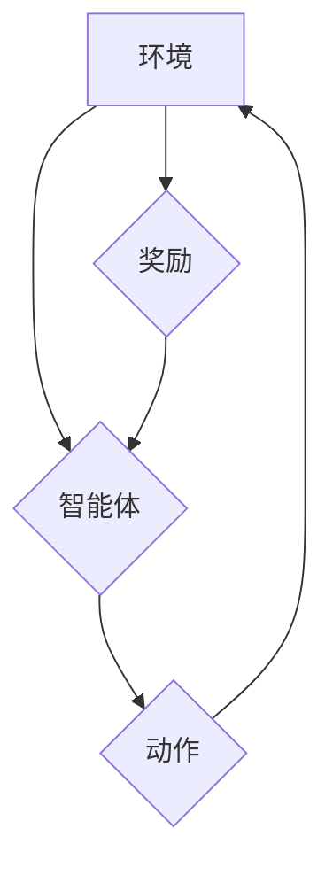

> 深度学习，强化学习，神经网络，机器学习，人工智能，算法，应用场景

## 1. 背景介绍

人工智能（AI）作为科技发展的重要方向，近年来取得了令人瞩目的进展。其中，深度学习和强化学习作为AI领域的两大重要分支，在计算机视觉、自然语言处理、游戏智能等领域展现出强大的应用潜力。

深度学习起源于人工神经网络的复兴，它利用多层神经网络结构来模拟人类大脑的学习过程，能够从海量数据中自动提取特征，实现对复杂模式的识别和预测。强化学习则关注智能体在环境中通过试错学习，最终达到目标的机制。它通过奖励机制引导智能体做出最优决策，在许多控制和决策问题中表现出优异的性能。

深度学习和强化学习的结合，使得AI技术迈向了新的高度。例如，AlphaGo通过深度强化学习战胜了世界围棋冠军，DeepMind的MuZero则在多个棋类游戏中取得了超越人类水平的成绩。这些突破性进展表明，深度学习与强化学习的组合将推动AI技术在更广泛领域的发展。

## 2. 核心概念与联系

**2.1 深度学习**

深度学习的核心是多层神经网络，它由多个神经元层组成，每个神经元接收来自上一层的输入，并通过激活函数进行处理，最终输出到下一层。通过多层网络的叠加，深度学习模型能够学习到数据中的抽象特征，实现对复杂模式的识别和预测。

**2.2 强化学习**

强化学习的核心是智能体与环境的交互过程。智能体在环境中采取行动，环境会根据智能体的行动给予奖励或惩罚。智能体的目标是通过不断试错，学习到最优的策略，以最大化累积的奖励。

**2.3 深度学习与强化学习的结合**

深度学习与强化学习的结合，使得智能体能够利用深度学习模型学习到更丰富的环境特征，并通过强化学习算法优化策略，实现更智能的决策。



**2.4 核心概念联系**

深度学习提供强大的特征提取能力，强化学习则提供有效的策略优化机制。两者结合，使得智能体能够从环境中学习，并做出最优决策。

## 3. 核心算法原理 & 具体操作步骤

### 3.1 算法原理概述

深度强化学习算法的核心是利用深度神经网络来构建智能体的策略网络和价值网络。策略网络输出智能体在给定状态下采取的行动概率分布，价值网络则估计智能体在给定状态下采取特定行动的长期奖励。

通过训练策略网络和价值网络，智能体能够学习到最优的策略，以最大化累积的奖励。

### 3.2 算法步骤详解

1. **环境建模:** 建立模拟真实世界的环境模型，定义智能体的状态空间、动作空间和奖励函数。

2. **神经网络构建:** 构建深度神经网络，包括策略网络和价值网络。

3. **初始化参数:** 初始化策略网络和价值网络的参数。

4. **训练过程:**

   - 智能体从环境中获取初始状态。
   - 智能体根据策略网络输出的概率分布选择行动。
   - 环境根据智能体的行动返回新的状态和奖励。
   - 智能体利用奖励和新的状态更新价值网络的参数。
   - 智能体利用价值网络的反馈更新策略网络的参数。
   - 重复上述步骤，直到策略网络收敛。

5. **策略评估:** 在训练完成之后，评估策略网络在环境中的性能。

### 3.3 算法优缺点

**优点:**

- 能够学习到复杂环境中的最优策略。
- 不需要人工设计特征，能够自动从数据中提取特征。
- 在许多控制和决策问题中表现出优异的性能。

**缺点:**

- 训练过程复杂，需要大量的计算资源和训练数据。
- 容易陷入局部最优解。
- 缺乏可解释性，难以理解智能体的决策过程。

### 3.4 算法应用领域

深度强化学习算法在许多领域都有广泛的应用，例如:

- **游戏智能:** AlphaGo、AlphaStar等游戏AI。
- **机器人控制:** 机器人导航、抓取、运动控制等。
- **自动驾驶:** 自动驾驶汽车的路径规划、决策控制等。
- **医疗诊断:** 辅助医生进行疾病诊断和治疗方案制定。
- **金融投资:** 股票交易、风险管理等。

## 4. 数学模型和公式 & 详细讲解 & 举例说明

### 4.1 数学模型构建

深度强化学习算法的核心是马尔可夫决策过程（MDP）。MDP模型由以下几个要素组成:

- **状态空间 (S):** 智能体可能处于的所有状态的集合。
- **动作空间 (A):** 智能体在每个状态下可以采取的所有动作的集合。
- **转移概率 (P):** 从一个状态采取一个动作后转移到另一个状态的概率。
- **奖励函数 (R):** 智能体在每个状态采取一个动作后获得的奖励。
- **策略 (π):** 智能体在每个状态下采取动作的概率分布。

### 4.2 公式推导过程

深度强化学习算法的目标是找到最优策略 π*，使得智能体在环境中累积的奖励最大化。

最优策略的定义是：

$$
\pi^* = \arg\max_{\pi} \mathbb{E}_{\pi} \sum_{t=0}^{\infty} \gamma^t r_t
$$

其中：

- $\mathbb{E}_{\pi}$ 表示根据策略 π 采样的期望。
- $r_t$ 是智能体在时间步 t 获得的奖励。
- $\gamma$ 是折扣因子，控制未来奖励的权重。

### 4.3 案例分析与讲解

例如，在玩游戏时，智能体的状态空间可以是游戏画面，动作空间可以是游戏中的操作，奖励函数可以是获得分数或完成任务的奖励。深度强化学习算法可以训练智能体学习最优的游戏策略，以获得尽可能高的分数或完成任务。

## 5. 项目实践：代码实例和详细解释说明

### 5.1 开发环境搭建

深度强化学习的开发环境通常需要以下软件：

- Python 编程语言
- TensorFlow 或 PyTorch 深度学习框架
- NumPy 数值计算库
- Matplotlib 数据可视化库

### 5.2 源代码详细实现

以下是一个简单的深度强化学习代码示例，使用 TensorFlow 框架实现一个简单的 Q-learning 算法：

```python
import tensorflow as tf

# 定义 Q-网络
class QNetwork(tf.keras.Model):
    def __init__(self, state_size, action_size):
        super(QNetwork, self).__init__()
        self.dense1 = tf.keras.layers.Dense(64, activation='relu')
        self.dense2 = tf.keras.layers.Dense(action_size)

    def call(self, state):
        x = self.dense1(state)
        return self.dense2(x)

# 定义 Q-learning 算法
def q_learning(env, q_network, learning_rate, discount_factor, episodes):
    for episode in range(episodes):
        state = env.reset()
        done = False
        while not done:
            # 选择动作
            action = tf.argmax(q_network(state), axis=1).numpy()[0]
            # 执行动作
            next_state, reward, done, _ = env.step(action)
            # 更新 Q-值
            target = reward + discount_factor * tf.reduce_max(q_network(next_state), axis=1)
            with tf.GradientTape() as tape:
                q_value = q_network(state)
                loss = tf.keras.losses.mean_squared_error(target, q_value[0, action])
            gradients = tape.gradient(loss, q_network.trainable_variables)
            optimizer.apply_gradients(zip(gradients, q_network.trainable_variables))
            state = next_state

# ...

```

### 5.3 代码解读与分析

这段代码实现了 Q-learning 算法，其中包括 Q-网络的定义、训练过程和环境交互。

- Q-网络是一个简单的多层感知机，用于估计在给定状态下采取不同动作的 Q-值。
- 训练过程使用梯度下降算法更新 Q-网络的参数，目标是最大化 Q-值的估计值。
- 环境交互部分模拟智能体与环境的交互过程，包括获取状态、选择动作、执行动作和获得奖励。

### 5.4 运行结果展示

运行这段代码后，可以观察到 Q-网络的性能随着训练的进行而逐渐提高。最终，智能体能够学习到最优的策略，在环境中获得更高的奖励。

## 6. 实际应用场景

### 6.1 游戏智能

深度强化学习在游戏智能领域取得了突破性进展。AlphaGo 通过深度强化学习战胜了世界围棋冠军，AlphaStar 在星际争霸 II 中取得了超越人类水平的成绩。这些成就表明，深度强化学习能够训练出强大的游戏 AI，并应用于各种游戏场景。

### 6.2 机器人控制

深度强化学习在机器人控制领域也有广泛的应用。例如，机器人导航、抓取、运动控制等任务都可以利用深度强化学习算法进行训练。

### 6.3 自动驾驶

自动驾驶汽车的路径规划、决策控制等任务也能够利用深度强化学习算法进行训练。深度强化学习能够帮助自动驾驶汽车学习到复杂的交通规则和驾驶策略，提高安全性。

### 6.4 其他应用场景

除了上述应用场景，深度强化学习还应用于医疗诊断、金融投资、推荐系统等领域。

### 6.5 未来应用展望

随着深度强化学习算法的不断发展，其应用场景将更加广泛。未来，深度强化学习可能应用于以下领域:

- **个性化教育:** 根据学生的学习情况，定制个性化的学习方案。
- **智能客服:** 提供更智能、更人性化的客服服务。
- **科学研究:** 加速科学研究的进程，解决复杂科学问题。

## 7. 工具和资源推荐

### 7.1 学习资源推荐

- **书籍:**
    - Deep Reinforcement Learning Hands-On by Maxim Lapan
    - Reinforcement Learning: An Introduction by Richard S. Sutton and Andrew G. Barto
- **在线课程:**
    - Deep Reinforcement Learning Specialization by DeepLearning.AI
    - Reinforcement Learning by David Silver (University of DeepMind)

### 7.2 开发工具推荐

- **TensorFlow:** https://www.tensorflow.org/
- **PyTorch:** https://pytorch.org/
- **OpenAI Gym:** https://gym.openai.com/

### 7.3 相关论文推荐

- **Deep Reinforcement Learning with Double Q-learning** by Hasselt et al. (2015)
- **Asynchronous Methods for Deep Reinforcement Learning** by Mnih et al. (2016)
- **Proximal Policy Optimization Algorithms** by Schulman et al. (2017)

## 8. 总结：未来发展趋势与挑战

### 8.1 研究成果总结

深度强化学习在过去几年取得了显著进展，在游戏智能、机器人控制、自动驾驶等领域取得了突破性成果。这些成果表明，深度强化学习是一种强大的机器学习方法，能够解决许多复杂问题。

### 8.2 未来发展趋势

未来，深度强化学习的研究将朝着以下几个方向发展:

- **更强大的算法:** 开发更强大的深度强化学习算法，能够解决更复杂的问题，并提高学习效率。
- **更广泛的应用:** 将深度强化学习应用于更多领域，例如医疗、金融、教育等。
- **更安全的系统:** 开发更安全的深度强化学习系统，避免算法出现偏差或错误行为。

### 8.3 面临的挑战

深度强化学习仍然面临一些挑战:

- **训练效率:** 深度强化学习算法的训练过程通常非常耗时，需要大量的计算资源和训练数据。
- **可解释性:** 深度强化