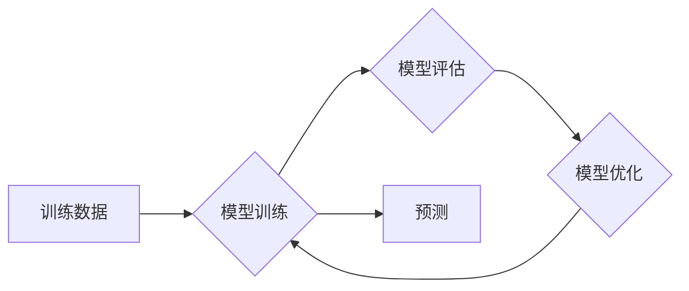

> 监督学习、机器学习、分类、回归、算法原理、代码实例、Python

## 1. 背景介绍

在当今数据爆炸的时代，机器学习作为人工智能的核心技术，扮演着越来越重要的角色。其中，监督学习作为机器学习最基础且应用广泛的范式，在图像识别、自然语言处理、预测分析等领域取得了显著成就。

监督学习的核心思想是通过已标记的数据集，训练模型学习数据的规律，从而能够对新的未标记数据进行预测或分类。就像人类学习一样，监督学习模型需要大量的标注数据作为“老师”，指导其学习和理解数据之间的关系。

## 2. 核心概念与联系

**2.1 监督学习的要素**

* **训练数据:** 包含输入特征和对应的输出标签的数据集。
* **模型:** 用于学习数据规律的数学模型，例如线性回归、逻辑回归、决策树等。
* **损失函数:** 用于衡量模型预测结果与真实标签之间的误差。
* **优化算法:** 用于调整模型参数，最小化损失函数的算法，例如梯度下降、随机梯度下降等。

**2.2 监督学习的类型**

* **分类:** 将数据划分为不同的类别，例如图像识别（猫、狗、鸟）、文本分类（情感分析、主题分类）。
* **回归:** 预测连续的数值输出，例如房价预测、股票价格预测。

**2.3 监督学习流程**



## 3. 核心算法原理 & 具体操作步骤

### 3.1  算法原理概述

本节将介绍两种常见的监督学习算法：线性回归和逻辑回归。

**3.1.1 线性回归**

线性回归是一种用于预测连续数值输出的监督学习算法。其核心思想是找到一条直线或超平面，能够最佳地拟合训练数据。

**3.1.2 逻辑回归**

逻辑回归是一种用于分类问题的监督学习算法。其核心思想是将输入特征映射到一个概率值，该概率值代表数据属于某个类别的可能性。

### 3.2  算法步骤详解

**3.2.1 线性回归步骤**

1. **数据预处理:** 对训练数据进行清洗、转换和特征工程。
2. **模型构建:** 使用线性回归模型，将输入特征与输出标签建立线性关系。
3. **参数估计:** 使用最小二乘法或正则化技术，估计模型参数。
4. **模型评估:** 使用测试数据评估模型的预测性能，例如均方误差（MSE）、R-squared。
5. **模型优化:** 根据评估结果，调整模型参数或选择其他模型，提高预测性能。

**3.2.2 逻辑回归步骤**

1. **数据预处理:** 对训练数据进行清洗、转换和特征工程。
2. **模型构建:** 使用逻辑回归模型，将输入特征映射到一个概率值。
3. **参数估计:** 使用最大似然估计或梯度下降法，估计模型参数。
4. **模型评估:** 使用测试数据评估模型的预测性能，例如准确率、召回率、F1-score。
5. **模型优化:** 根据评估结果，调整模型参数或选择其他模型，提高预测性能。

### 3.3  算法优缺点

**3.3.1 线性回归**

* **优点:** 算法简单易懂，计算效率高，易于解释。
* **缺点:** 只能处理线性关系，对异常值敏感。

**3.3.2 逻辑回归**

* **优点:** 适用于分类问题，输出结果可解释为概率值。
* **缺点:** 只能处理线性可分的数据，对非线性关系的处理能力有限。

### 3.4  算法应用领域

* **线性回归:** 房价预测、股票价格预测、销售额预测等。
* **逻辑回归:** 欺诈检测、客户流失预测、疾病诊断等。

## 4. 数学模型和公式 & 详细讲解 & 举例说明

### 4.1  数学模型构建

**4.1.1 线性回归模型**

线性回归模型试图找到一条直线，将输入特征与输出标签建立线性关系。其数学模型可以表示为：

$$y = w_0 + w_1x_1 + w_2x_2 + ... + w_nx_n + \epsilon$$

其中：

* $y$ 是输出标签
* $x_1, x_2, ..., x_n$ 是输入特征
* $w_0, w_1, w_2, ..., w_n$ 是模型参数
* $\epsilon$ 是误差项

**4.1.2 逻辑回归模型**

逻辑回归模型使用 sigmoid 函数将输入特征映射到一个概率值，该概率值代表数据属于某个类别的可能性。其数学模型可以表示为：

$$p(y=1|x) = \frac{1}{1 + e^{-(w_0 + w_1x_1 + w_2x_2 + ... + w_nx_n)}}$$

其中：

* $p(y=1|x)$ 是数据属于类别 1 的概率
* $x_1, x_2, ..., x_n$ 是输入特征
* $w_0, w_1, w_2, ..., w_n$ 是模型参数

### 4.2  公式推导过程

**4.2.1 线性回归参数估计**

线性回归模型的参数估计可以使用最小二乘法。最小二乘法的目标是找到一组参数，使得模型预测值与真实标签之间的误差平方和最小。

**4.2.2 逻辑回归参数估计**

逻辑回归模型的参数估计可以使用最大似然估计。最大似然估计的目标是找到一组参数，使得模型能够最大化似然函数，即模型预测结果与真实标签相符的概率。

### 4.3  案例分析与讲解

**4.3.1 线性回归案例**

假设我们想要预测房屋价格，输入特征包括房屋面积、房间数量、地理位置等。我们可以使用线性回归模型，将这些特征与房屋价格建立线性关系。

**4.3.2 逻辑回归案例**

假设我们想要判断客户是否会流失，输入特征包括客户年龄、购买频率、消费金额等。我们可以使用逻辑回归模型，将这些特征映射到一个概率值，该概率值代表客户流失的可能性。

## 5. 项目实践：代码实例和详细解释说明

### 5.1  开发环境搭建

本项目使用 Python 语言进行开发，需要安装以下库：

* NumPy: 用于数值计算
* Pandas: 用于数据处理
* Scikit-learn: 用于机器学习算法

可以使用 pip 命令安装这些库：

```bash
pip install numpy pandas scikit-learn
```

### 5.2  源代码详细实现

**5.2.1 线性回归代码示例**

```python
import numpy as np
from sklearn.linear_model import LinearRegression
from sklearn.model_selection import train_test_split
from sklearn.metrics import mean_squared_error

# 准备数据
X = np.array([[100, 2], [150, 3], [200, 4], [250, 5]])  # 特征
y = np.array([150, 200, 250, 300])  # 标签

# 将数据划分为训练集和测试集
X_train, X_test, y_train, y_test = train_test_split(X, y, test_size=0.2, random_state=42)

# 创建线性回归模型
model = LinearRegression()

# 训练模型
model.fit(X_train, y_train)

# 预测测试集结果
y_pred = model.predict(X_test)

# 计算均方误差
mse = mean_squared_error(y_test, y_pred)
print(f"均方误差: {mse}")

# 打印模型参数
print(f"模型参数: {model.coef_}")
print(f"截距: {model.intercept_}")
```

**5.2.2 逻辑回归代码示例**

```python
import numpy as np
from sklearn.linear_model import LogisticRegression
from sklearn.model_selection import train_test_split
from sklearn.metrics import accuracy_score

# 准备数据
X = np.array([[1, 0], [0, 1], [1, 1], [0, 0]])  # 特征
y = np.array([1, 0, 1, 0])  # 标签

# 将数据划分为训练集和测试集
X_train, X_test, y_train, y_test = train_test_split(X, y, test_size=0.2, random_state=42)

# 创建逻辑回归模型
model = LogisticRegression()

# 训练模型
model.fit(X_train, y_train)

# 预测测试集结果
y_pred = model.predict(X_test)

# 计算准确率
accuracy = accuracy_score(y_test, y_pred)
print(f"准确率: {accuracy}")

# 打印模型参数
print(f"模型参数: {model.coef_}")
print(f"截距: {model.intercept_}")
```

### 5.3  代码解读与分析

以上代码示例分别演示了线性回归和逻辑回归的实现过程。

* **数据准备:** 首先需要准备训练数据和测试数据。
* **数据划分:** 将数据划分为训练集和测试集，用于训练模型和评估模型性能。
* **模型创建:** 创建相应的机器学习模型，例如线性回归模型或逻辑回归模型。
* **模型训练:** 使用训练数据训练模型，学习数据规律。
* **模型预测:** 使用训练好的模型预测测试集结果。
* **模型评估:** 使用测试集结果评估模型性能，例如计算均方误差或准确率。

### 5.4  运行结果展示

运行以上代码示例，会输出模型的训练结果和评估指标。

## 6. 实际应用场景

### 6.1 线性回归应用场景

* **房价预测:** 根据房屋面积、房间数量、地理位置等特征，预测房屋价格。
* **股票价格预测:** 根据股票历史数据、市场指数等特征，预测股票价格走势。
* **销售额预测:** 根据市场趋势、促销活动等特征，预测未来销售额。

### 6.2 逻辑回归应用场景

* **欺诈检测:** 根据交易记录、用户行为等特征，判断交易是否为欺诈行为。
* **客户流失预测:** 根据客户年龄、购买频率、消费金额等特征，预测客户是否会流失。
* **疾病诊断:** 根据患者症状、检查结果等特征，判断患者是否患有某种疾病。

### 6.4  未来应用展望

随着人工智能技术的不断发展，监督学习在各个领域的应用将会更加广泛。例如，在医疗领域，监督学习可以用于辅助诊断、个性化治疗；在金融领域，监督学习可以用于风险评估、信用评分；在自动驾驶领域，监督学习可以用于目标识别、路径规划。

## 7. 工具和资源推荐

### 7.1  学习资源推荐

* **书籍:**
    * 《机器学习》 - 周志华
    * 《Python机器学习》 - 塞缪尔·阿布拉姆斯
* **在线课程:**
    * Coursera: 机器学习
    * edX: 机器学习
    * fast.ai: 深度学习

### 7.2  开发工具推荐

* **Python:** 作为机器学习的常用编程语言，Python拥有丰富的机器学习库和工具。
* **Jupyter Notebook:** 用于交互式编程和数据可视化。
* **TensorFlow:** 开源深度学习框架。
* **PyTorch:** 开源深度学习框架。

### 7.3  相关论文推荐

* **《Support Vector Machines》** - Vapnik, V. N. (19