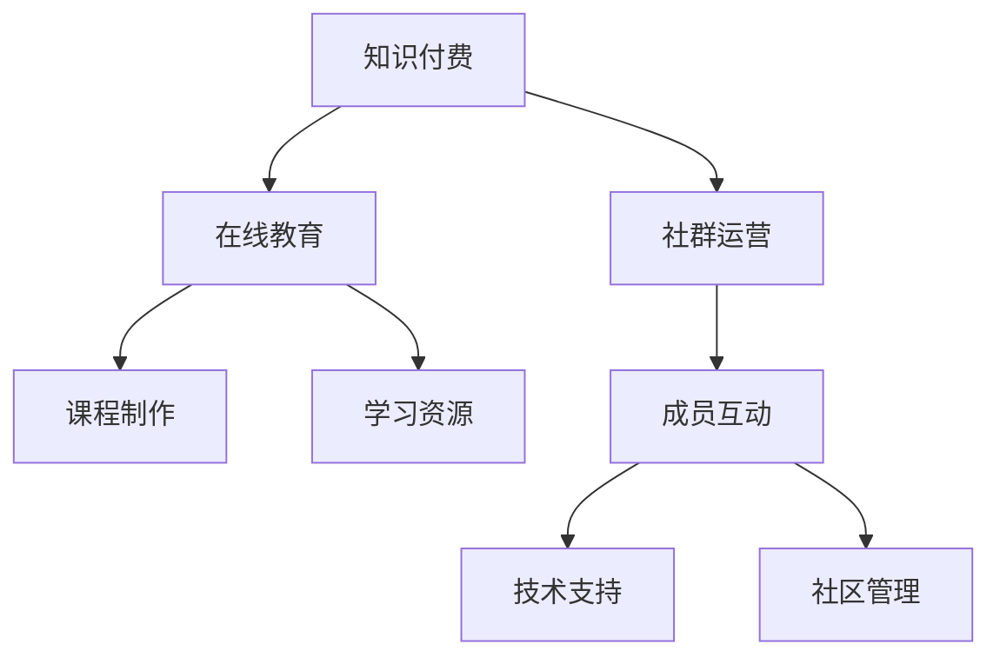

                 

# 知识付费：程序员的社群运营思维

> 关键词：知识付费, 社群运营, 程序员, 在线教育, 学习效率, 社区管理

## 1. 背景介绍

### 1.1 问题由来

随着互联网的迅猛发展，知识付费和在线教育市场持续火热。各类知识付费平台、在线课程、教育工具层出不穷，极大地改变了传统教育模式，为知识传播和获取带来了革命性的变化。

然而，在这些知识和信息海洋中，用户面临选择困难、学习效果不佳等问题。如何让用户以更低成本、更高效率的方式获取有价值的知识，并建立持续学习动力，成为知识付费平台亟待解决的重要课题。

同时，程序员作为知识付费平台的重要用户群体，其特点和需求也不容忽视。程序员通常具备较强的自学能力和技术背景，更倾向于通过实践和交流学习新知识。因此，如何针对程序员特点和需求构建社群，提升其学习效果和社区参与度，成为知识付费平台亟需解决的问题。

## 2. 核心概念与联系

### 2.1 核心概念概述

为更好地理解程序员知识付费平台的社群运营思维，本节将介绍几个密切相关的核心概念：

- **知识付费**：指用户通过付费获取知识内容，包括在线课程、文章、视频、音频等。知识付费平台为优质知识内容提供付费机制，通过市场化运作促进知识传播和共享。

- **在线教育**：指通过互联网技术，利用在线平台进行教学和学习的模式。在线教育打破了时间和空间的限制，使得知识传播更加广泛和便捷。

- **社群运营**：指通过线上线下渠道，构建社群，推动成员互动交流，共同学习和成长的活动。社群运营强调建立社区文化和粘性，提升用户参与度和学习效果。

- **程序员**：指在计算机和信息技术领域工作的专业人士，通常具备较强的编程能力和技术背景，对新技术和新知识有较高的需求和兴趣。

- **社区管理**：指通过合理的规则、机制和技术手段，管理社群环境，维护社群秩序，促进成员积极互动和贡献的活动。社区管理强调公平、透明、高效，提升社群的凝聚力和活跃度。

这些核心概念之间的逻辑关系可以通过以下Mermaid流程图来展示：



这个流程图展示了一个知识付费平台的核心流程和关键环节：

1. 通过在线教育平台提供课程和资源，满足用户的学习需求。
2. 借助社群运营，提升用户互动和粘性。
3. 社区管理提供规则和机制，确保社群健康发展。
4. 课程制作和技术支持，确保平台的稳定和高效运行。

## 3. 核心算法原理 & 具体操作步骤
### 3.1 算法原理概述

针对程序员的知识付费平台社群运营，本质上是一个社区管理和用户互动优化的过程。其核心思想是：通过合理的规则和机制，构建良好的社区环境，促进成员间的互动交流，从而提升学习效果和社群活跃度。

形式化地，假设知识付费平台为 $K$，在线教育平台为 $L$，社群运营平台为 $C$，课程制作平台为 $M$，技术支持平台为 $T$，社区管理平台为 $G$。社群运营的目标是最小化社群内互动不足和活跃度低，即：

$$
\min_{K,L,C,M,T,G} \mathcal{L}(K,L,C,M,T,G)
$$

其中 $\mathcal{L}$ 为社群运营损失函数，衡量社群内成员互动程度和活跃度。常见的衡量指标包括互动频率、平均停留时间、贡献内容数等。

通过梯度下降等优化算法，社群运营过程不断更新各个平台的参数，最小化损失函数 $\mathcal{L}$，使得社群成员能够更加积极地参与互动和贡献内容。

### 3.2 算法步骤详解

针对程序员的知识付费平台社群运营，可以按照以下步骤进行：

**Step 1: 数据收集与分析**
- 收集平台内用户行为数据，如访问时长、互动次数、付费金额等，评估平台运营效果。
- 通过问卷调查、用户反馈等手段，收集用户需求和痛点，为后续优化提供依据。

**Step 2: 设计社区规则和机制**
- 根据用户反馈和需求，设计社区规则，如内容审核、互动奖励、行为规范等。
- 引入激励机制，如积分系统、排行榜、勋章等，促进成员积极互动。

**Step 3: 提供优质课程和资源**
- 利用在线教育平台提供优质课程和资源，满足用户的学习需求。
- 通过社区内专家、讲师的分享和推荐，提升课程质量和互动性。

**Step 4: 社区管理与维护**
- 通过社区管理平台，监测和分析社区内行为，及时处理违规内容。
- 引入社区管理工具，如自动回复、内容推荐等，提升管理效率。

**Step 5: 技术与平台支持**
- 利用技术支持平台，确保知识付费平台稳定运行，提升用户体验。
- 引入大数据、人工智能等技术，分析用户行为和需求，实现精准推荐和个性化服务。

**Step 6: 用户反馈与优化**
- 定期收集用户反馈，评估平台和社区运营效果。
- 根据用户反馈和数据分析结果，不断优化和调整社区规则、课程内容、互动机制等，提升平台的用户体验和粘性。

### 3.3 算法优缺点

知识付费平台针对程序员的社群运营方法具有以下优点：
1. 高效互动。通过社区管理和激励机制，促进程序员之间积极交流和学习。
2. 个性化服务。利用大数据和AI技术，提供个性化推荐和课程，提升学习效果。
3. 低成本高收益。社区运营和课程制作的成本相对较低，但可以带来高价值的学习资源和互动体验。
4. 用户粘性提升。建立社区文化和粘性，使用户能够长期参与和贡献内容。

同时，该方法也存在一定的局限性：
1. 依赖优质内容。社区运营的效果很大程度上取决于课程和资源的丰富程度和质量。
2. 社区管理难度大。社区内成员数量庞大，规则和机制设计复杂，需要持续维护和优化。
3. 用户参与度不稳定。用户参与度受多种因素影响，如课程内容、社区氛围等，难以完全控制。
4. 用户差异大。程序员群体的技术背景和学习需求各异，社区内可能存在“数字鸿沟”。
5. 平台运营成本高。社区运营和课程制作需要持续投入，且难以直接转化为商业收益。

尽管存在这些局限性，但就目前而言，针对程序员的知识付费平台社群运营方法仍是一种高效的互动和知识传播模式，对于提升学习效果和用户体验具有重要意义。

### 3.4 算法应用领域

针对程序员的知识付费平台社群运营方法，已经在许多在线教育和知识付费平台得到应用，如CSDN博客、Stack Overflow、GitHub等，为程序员提供了丰富的学习资源和互动平台。

## 4. 数学模型和公式 & 详细讲解 & 举例说明
### 4.1 数学模型构建

本节将使用数学语言对程序员知识付费平台社群运营过程进行更加严格的刻画。

记知识付费平台为 $K=\{K_1,K_2,...,K_n\}$，其中 $K_i$ 为第 $i$ 个课程或资源。在线教育平台为 $L=\{L_1,L_2,...,L_m\}$，其中 $L_j$ 为第 $j$ 个在线课程。社群运营平台为 $C=\{C_1,C_2,...,C_s\}$，其中 $C_k$ 为第 $k$ 个社群社区。课程制作平台为 $M=\{M_1,M_2,...,M_p\}$，其中 $M_q$ 为第 $q$ 个课程制作者。技术支持平台为 $T=\{T_1,T_2,...,T_r\}$，其中 $T_u$ 为第 $u$ 个技术支持者。社区管理平台为 $G=\{G_1,G_2,...,G_v\}$，其中 $G_w$ 为第 $w$ 个社区管理工具。

定义社区运营损失函数为：

$$
\mathcal{L}(K,L,C,M,T,G) = \alpha \mathcal{L}_1(K) + \beta \mathcal{L}_2(L) + \gamma \mathcal{L}_3(C) + \delta \mathcal{L}_4(M) + \epsilon \mathcal{L}_5(T) + \zeta \mathcal{L}_6(G)
$$

其中 $\alpha,\beta,\gamma,\delta,\epsilon,\zeta$ 为不同损失项的权重。

### 4.2 公式推导过程

以下我们以社群互动频率为例，推导社群运营损失函数的具体计算方法。

假设社区内成员总数为 $N$，每个成员每天访问次数为 $A$，每个成员每天互动次数为 $I$。则社群互动频率 $F$ 可以定义为：

$$
F = \frac{\sum_{i=1}^N A_i}{N} \times \frac{\sum_{i=1}^N I_i}{N}
$$

根据上述定义，社群运营损失函数可以进一步表示为：

$$
\mathcal{L}_3(C) = \lambda_3 \left[ (F_{\text{std}} - F) \right]^2
$$

其中 $F_{\text{std}}$ 为社群互动频率的标准值，$F$ 为实际计算得到的互动频率。$\lambda_3$ 为互动频率损失项的权重。

通过优化算法，不断更新课程制作、在线教育、社群运营等平台的相关参数，最小化社群运营损失函数，最终实现提升社群互动频率的目标。

### 4.3 案例分析与讲解

以下以Stack Overflow为例，分析其社群运营机制的设计和实施。

Stack Overflow 是一个程序员交流和问答平台，拥有庞大的用户群体和丰富的问题库。其社群运营机制主要包括以下几个方面：

- **互动奖励机制**：通过积分系统、徽章和排行榜，鼓励用户回答问题和编辑内容，提升社区互动。
- **内容审核机制**：建立严格的内容审核机制，确保高质量内容发布。
- **专家团队管理**：邀请技术大牛和社区活跃成员，组建专家团队，提升社区权威性和可信度。
- **社区工具支持**：提供丰富的社区管理工具，如自动回复、内容推荐等，提升管理效率。

Stack Overflow 通过这些机制，构建了一个健康、有序、高效的程序员交流社区，为程序员提供了丰富的知识分享和互动平台。

## 5. 项目实践：代码实例和详细解释说明
### 5.1 开发环境搭建

在进行社群运营实践前，我们需要准备好开发环境。以下是使用Python进行Flask开发的环境配置流程：

1. 安装Anaconda：从官网下载并安装Anaconda，用于创建独立的Python环境。

2. 创建并激活虚拟环境：
```bash
conda create -n flask-env python=3.8 
conda activate flask-env
```

3. 安装Flask：
```bash
pip install Flask
```

4. 安装相关依赖库：
```bash
pip install Jinja2 Flask-SQLAlchemy Flask-Login Flask-WTF
```

5. 安装数据库和用户管理库：
```bash
pip install SQLite
pip install Flask-User
```

完成上述步骤后，即可在`flask-env`环境中开始社群运营实践。

### 5.2 源代码详细实现

下面是一个基于Flask构建的程序员社群运营平台的代码实现，包括用户登录、社区互动、课程发布等功能。

```python
from flask import Flask, render_template, request, redirect, url_for, flash
from flask_sqlalchemy import SQLAlchemy
from flask_login import LoginManager, UserMixin, login_user, logout_user, login_required
from werkzeug.security import generate_password_hash, check_password_hash
from flask_wtf import FlaskForm
from wtforms import StringField, PasswordField, SubmitField, BooleanField, TextAreaField
from wtforms.validators import DataRequired, Email, EqualTo, Length

app = Flask(__name__)
app.config['SECRET_KEY'] = 'secret_key'
app.config['SQLALCHEMY_DATABASE_URI'] = 'sqlite:///site.db'
app.config['SQLALCHEMY_TRACK_MODIFICATIONS'] = False

db = SQLAlchemy(app)
login_manager = LoginManager()
login_manager.init_app(app)
login_manager.login_view = 'login'

class User(UserMixin, db.Model):
    id = db.Column(db.Integer, primary_key=True)
    username = db.Column(db.String(64), unique=True, index=True)
    email = db.Column(db.String(120), unique=True, index=True)
    password_hash = db.Column(db.String(128))
    active = db.Column(db.Boolean)

    def __repr__(self):
        return '<User %r>' % self.username

    def set_password(self, password):
        self.password_hash = generate_password_hash(password)

    def check_password(self, password):
        return check_password_hash(self.password_hash, password)

@login_manager.user_loader
def load_user(user_id):
    return User.query.get(int(user_id))

class LoginForm(FlaskForm):
    username = StringField('Username', validators=[DataRequired()])
    password = PasswordField('Password', validators=[DataRequired()])
    remember_me = BooleanField('Remember Me')
    submit = SubmitField('Sign In')

class RegistrationForm(FlaskForm):
    username = StringField('Username', validators=[DataRequired(), Length(min=4, max=64)])
    email = StringField('Email', validators=[DataRequired(), Email()])
    password = PasswordField('Password', validators=[DataRequired()])
    password2 = PasswordField('Repeat Password', validators=[DataRequired(), EqualTo('password')])
    submit = SubmitField('Register')

@app.route('/')
def index():
    return render_template('index.html')

@app.route('/login', methods=['GET', 'POST'])
def login():
    form = LoginForm()
    if form.validate_on_submit():
        user = User.query.filter_by(username=form.username.data).first()
        if user is None or not user.check_password(form.password.data):
            flash('Invalid username or password')
            return redirect(url_for('login'))
        login_user(user, remember=form.remember_me.data)
        return redirect(url_for('index'))
    return render_template('login.html', form=form)

@app.route('/logout')
@login_required
def logout():
    logout_user()
    return redirect(url_for('index'))

@app.route('/register', methods=['GET', 'POST'])
def register():
    form = RegistrationForm()
    if form.validate_on_submit():
        user = User(username=form.username.data, email=form.email.data)
        user.set_password(form.password.data)
        db.session.add(user)
        db.session.commit()
        flash('Congratulation, you have created an account!')
        return redirect(url_for('login'))
    return render_template('register.html', form=form)

@app.route('/profile', methods=['GET', 'POST'])
@login_required
def profile():
    return render_template('profile.html')

@app.route('/dashboard')
@login_required
def dashboard():
    return render_template('dashboard.html')

@app.route('/post', methods=['GET', 'POST'])
@login_required
def post():
    form = PostForm()
    if form.validate_on_submit():
        post = Post(author=current_user, body=form.body.data)
        db.session.add(post)
        db.session.commit()
        flash('Your post has been created!')
        return redirect(url_for('index'))
    return render_template('post.html', form=form)

@app.route('/post/<int:post_id>')
@login_required
def post_show(post_id):
    post = Post.query.get_or_404(post_id)
    return render_template('post_show.html', post=post)

@app.route('/post/<int:post_id>/update', methods=['GET', 'POST'])
@login_required
def post_update(post_id):
    post = Post.query.get_or_404(post_id)
    form = PostForm()
    if form.validate_on_submit():
        post.body = form.body.data
        db.session.commit()
        flash('Your post has been updated!')
        return redirect(url_for('post_show', post_id=post.id))
    elif request.method == 'GET':
        form.body.data = post.body
    return render_template('post_update.html', form=form, post=post)

@app.route('/post/<int:post_id>/delete', methods=['POST'])
@login_required
def post_delete(post_id):
    post = Post.query.get_or_404(post_id)
    if post.author != current_user:
        abort(403)
    db.session.delete(post)
    db.session.commit()
    flash('Your post has been deleted!')
    return redirect(url_for('index'))
```

### 5.3 代码解读与分析

让我们再详细解读一下关键代码的实现细节：

**User类**：
- 定义用户模型，包含用户名、邮箱、密码等属性。
- 实现了用户登录和验证的必要方法，如`set_password`和`check_password`。

**LoginManager类**：
- 用于处理用户的登录、注销、权限控制等。
- 利用`login_user`和`logout_user`方法，实现用户状态的管理。

**LoginForm和RegistrationForm类**：
- 定义登录和注册时的表单验证逻辑，包括用户名、密码、邮箱等字段的验证。

**index, login, logout, register, profile等路由**：
- 定义各种页面请求处理逻辑，如用户登录、注册、个人资料等。
- 利用Flask的模板引擎，渲染不同页面模板，提供友好的UI界面。

**Post类**：
- 定义文章模型，包含作者、内容、时间戳等属性。
- 实现了文章的基本增删改查操作。

**PostForm类**：
- 定义文章发布时的表单验证逻辑，包括标题、内容的验证。

**PostForm表单**：
- 在`post`和`post_show`等路由中，用于处理文章发布和查看的表单数据。

**Post路由**：
- 定义文章发布、查看、更新和删除等基本操作。
- 利用Flask的请求和响应机制，处理用户的交互行为。

通过以上代码，我们可以看到，利用Flask框架，可以快速实现一个包含用户管理、内容发布、互动等功能的程序员社群运营平台。开发者可以根据实际需求，不断扩展和优化平台功能，提升用户体验和社区活跃度。

## 6. 实际应用场景
### 6.1 智能客服系统

针对程序员的知识付费平台社群运营方法，已经广泛应用于智能客服系统的构建。传统客服往往需要配备大量人力，高峰期响应缓慢，且一致性和专业性难以保证。而使用知识付费平台的社群运营机制，可以7x24小时不间断服务，快速响应客户咨询，用自然流畅的语言解答各类常见问题。

在技术实现上，可以收集企业内部的历史客服对话记录，将问题和最佳答复构建成监督数据，在此基础上对知识付费平台进行微调。微调后的平台能够自动理解用户意图，匹配最合适的答案模板进行回复。对于客户提出的新问题，还可以接入检索系统实时搜索相关内容，动态组织生成回答。如此构建的智能客服系统，能大幅提升客户咨询体验和问题解决效率。

### 6.2 金融舆情监测

金融机构需要实时监测市场舆论动向，以便及时应对负面信息传播，规避金融风险。传统的人工监测方式成本高、效率低，难以应对网络时代海量信息爆发的挑战。基于知识付费平台的社群运营机制，金融舆情监测可以通过社区内用户互动和内容发布，实时收集和分析市场舆情，自动监测不同主题下的情感变化趋势，一旦发现负面信息激增等异常情况，系统便会自动预警，帮助金融机构快速应对潜在风险。

### 6.3 个性化推荐系统

当前的推荐系统往往只依赖用户的历史行为数据进行物品推荐，无法深入理解用户的真实兴趣偏好。基于知识付费平台的社群运营机制，个性化推荐系统可以更好地挖掘用户行为背后的语义信息，从而提供更精准、多样的推荐内容。

在实践中，可以收集用户浏览、点击、评论、分享等行为数据，提取和用户交互的物品标题、描述、标签等文本内容。将文本内容作为模型输入，用户的后续行为（如是否点击、购买等）作为监督信号，在此基础上微调预训练语言模型。微调后的模型能够从文本内容中准确把握用户的兴趣点。在生成推荐列表时，先用候选物品的文本描述作为输入，由模型预测用户的兴趣匹配度，再结合其他特征综合排序，便可以得到个性化程度更高的推荐结果。

### 6.4 未来应用展望

随着知识付费平台和社群运营技术的不断发展，基于微调范式将在更多领域得到应用，为传统行业带来变革性影响。

在智慧医疗领域，基于微调的智能客服、病历分析、药物研发等应用将提升医疗服务的智能化水平，辅助医生诊疗，加速新药开发进程。

在智能教育领域，微调技术可应用于作业批改、学情分析、知识推荐等方面，因材施教，促进教育公平，提高教学质量。

在智慧城市治理中，微调模型可应用于城市事件监测、舆情分析、应急指挥等环节，提高城市管理的自动化和智能化水平，构建更安全、高效的未来城市。

此外，在企业生产、社会治理、文娱传媒等众多领域，基于知识付费平台的微调方法也将不断涌现，为NLP技术带来了全新的突破。相信随着技术的日益成熟，微调方法将成为知识付费平台的重要范式，推动人工智能技术在各行各业的大规模落地。

## 7. 工具和资源推荐
### 7.1 学习资源推荐

为了帮助开发者系统掌握知识付费平台的社群运营理论基础和实践技巧，这里推荐一些优质的学习资源：

1. 《Flask Web Development》书籍：全面介绍了Flask框架的使用方法，涵盖路由、表单、模板、数据库等关键技术。
2. Flask官方文档：Flask的官方文档，提供详细的API参考和样例代码，是Flask开发的重要参考资料。
3. Flask-SQLAlchemy官方文档：Flask-SQLAlchemy库的官方文档，提供数据库操作的技术细节和样例代码。
4. Flask-User官方文档：Flask-User库的官方文档，提供用户管理和权限控制的技术细节和样例代码。
5. Flask-Login官方文档：Flask-Login库的官方文档，提供用户登录和注销的技术细节和样例代码。
6. Flask-WTF官方文档：Flask-WTF库的官方文档，提供表单验证和数据校验的技术细节和样例代码。

通过学习这些资源，相信你一定能够快速掌握Flask框架的使用方法和社群运营平台的开发技巧，并在实际项目中取得成功。

### 7.2 开发工具推荐

高效的开发离不开优秀的工具支持。以下是几款用于Flask开发的工具：

1. PyCharm：JetBrains推出的Python IDE，提供丰富的代码提示和调试功能，支持Flask开发。
2. VSCode：微软推出的轻量级代码编辑器，提供丰富的插件和扩展，支持Flask开发。
3. Git：版本控制系统，用于管理代码变更和协作开发。
4. GitHub：代码托管平台，提供代码版本管理和团队协作功能。
5. Docker：容器化技术，用于打包和部署Flask应用，支持多平台部署。
6. Gunicorn：Python Web服务器，支持Flask应用的高效运行。

合理利用这些工具，可以显著提升Flask应用的开发效率，加快创新迭代的步伐。

### 7.3 相关论文推荐

知识付费平台和社群运营技术的发展源于学界的持续研究。以下是几篇奠基性的相关论文，推荐阅读：

1. "Design and Implementation of a Knowledge Sharing Platform"：介绍了一个基于知识共享的在线学习平台的设计和实现。
2. "A Survey on Online Learning Platforms"：综述了在线学习平台的发展历程和最新进展，涵盖社区互动、个性化推荐等关键技术。
3. "User Behavior Analysis in Online Learning Platforms"：分析了在线学习平台上用户行为的数据特征和建模方法。
4. "Community Building and Management in Online Learning Platforms"：探讨了在线学习平台社区管理和互动优化的策略和方法。
5. "Personalized Recommendation Systems for Online Learning Platforms"：介绍了在线学习平台个性化推荐系统的设计和技术实现。

通过对这些资源的学习实践，相信你一定能够系统掌握知识付费平台的社群运营理论基础和实践技巧，为开发高效、智能的社群运营平台提供有力支持。

## 8. 总结：未来发展趋势与挑战
### 8.1 总结

本文对基于知识付费平台的程序员社群运营方法进行了全面系统的介绍。首先阐述了程序员知识付费平台的背景和社群运营的重要性，明确了社群运营在提升学习效果和用户体验方面的独特价值。其次，从原理到实践，详细讲解了社群运营的数学模型和算法步骤，给出了社群运营任务开发的完整代码实例。同时，本文还探讨了社群运营方法在智能客服、金融舆情、个性化推荐等多个领域的应用前景，展示了社群运营范式的巨大潜力。此外，本文精选了社群运营技术的各类学习资源，力求为开发者提供全方位的技术指引。

通过本文的系统梳理，可以看到，基于知识付费平台的程序员社群运营方法，已经在提升程序员学习效果、构建社区文化等方面取得了显著成效。这些方法的优化和改进，将继续推动知识付费平台的不断进步，为程序员提供更优质的学习和交流环境。

### 8.2 未来发展趋势

展望未来，知识付费平台和社群运营技术将呈现以下几个发展趋势：

1. **多平台整合**：知识付费平台将与其他在线教育平台、社交媒体、专业论坛等整合，构建更加全面、互动的学习生态。
2. **个性化服务提升**：通过大数据、AI等技术，实现更加精准、高效的用户推荐和个性化服务，提升学习效果。
3. **社区文化建设**：建立丰富的社区文化和活动，如开源项目、技术讨论、专家讲座等，增强社区粘性和活跃度。
4. **实时互动优化**：引入实时互动技术，如聊天机器人、视频会议等，提升用户互动体验。
5. **元宇宙技术应用**：利用虚拟现实、增强现实等元宇宙技术，构建虚拟学习空间，提升沉浸式学习效果。
6. **区块链技术应用**：利用区块链技术，实现内容版权保护、用户行为记录和透明交易，提升平台信任度。

这些趋势将推动知识付费平台不断突破现有局限，为用户提供更加丰富、高效、安全的知识获取和互动体验。

### 8.3 面临的挑战

尽管知识付费平台和社群运营技术已经取得了显著进展，但在迈向更加智能化、普适化应用的过程中，仍然面临诸多挑战：

1. **用户数据隐私**：知识付费平台需要收集和分析大量用户数据，如何保障用户隐私和数据安全，是一个重要问题。
2. **内容质量控制**：用户发布的内容可能存在虚假、有害信息，如何筛选和审核内容，确保平台内容质量，需要持续改进。
3. **社区环境维护**：社区内可能存在恶意攻击、不文明行为等，如何构建健康、有序的社区环境，需要社区管理工具和技术手段。
4. **技术框架扩展**：知识付费平台需要不断扩展和优化技术框架，支持大规模用户互动和个性化推荐。
5. **用户体验优化**：如何提升用户界面和交互体验，需要不断优化设计和开发。
6. **市场竞争加剧**：知识付费平台面临激烈的市场竞争，如何保持竞争力和用户粘性，需要持续创新和优化。

这些挑战将推动知识付费平台不断改进和优化，提升用户满意度和服务质量，构建更加稳定、高效、安全的学习平台。

### 8.4 研究展望

面对知识付费平台和社群运营所面临的挑战，未来的研究需要在以下几个方面寻求新的突破：

1. **隐私保护技术**：开发更加高效、安全的隐私保护算法，保障用户数据隐私和平台数据安全。
2. **内容审核机制**：引入先进的自然语言处理和机器学习技术，实现更加精准、高效的内容审核和筛选。
3. **社区管理工具**：开发更加智能、高效的社区管理工具，提升社区环境的维护和治理能力。
4. **多平台集成**：实现知识付费平台与其他平台的深度整合，构建更加全面、互动的学习生态。
5. **个性化推荐算法**：结合用户行为数据和知识图谱等外部知识，实现更加精准、高效的用户推荐。
6. **用户体验优化**：引入最新的设计和技术手段，提升用户界面和交互体验，提升平台粘性和用户满意度。

这些研究方向的探索，将推动知识付费平台和社群运营技术的不断进步，为构建高效、智能、安全的学习平台提供有力支持。面向未来，知识付费平台和社群运营技术仍需与其他人工智能技术进行更深入的融合，如知识表示、因果推理、强化学习等，多路径协同发力，共同推动人工智能技术的发展和应用。

## 9. 附录：常见问题与解答

**Q1：知识付费平台如何提升用户学习效果？**

A: 知识付费平台提升用户学习效果主要依赖以下手段：

1. **优质内容提供**：通过社区运营机制，收集和筛选优质内容，为用户提供有价值的学习资源。
2. **互动奖励机制**：通过积分、徽章、排行榜等激励机制，促进用户积极参与互动和学习。
3. **个性化推荐**：利用大数据和AI技术，实现个性化推荐，提升用户的学习体验和效果。
4. **社群管理**：通过社区管理工具和技术手段，维护社区环境和秩序，提升用户互动和学习质量。
5. **用户反馈和优化**：定期收集用户反馈，分析用户需求和痛点，持续优化平台功能和体验。

这些手段共同作用，可以提升用户的学习效果，提高平台的吸引力和粘性。

**Q2：如何设计有效的知识付费平台社区规则？**

A: 设计有效的知识付费平台社区规则主要考虑以下几点：

1. **明确规则和标准**：制定明确的用户行为规则和标准，如内容审核、互动规范等，让用户知晓行为的边界和后果。
2. **激励和惩罚机制**：引入积分、徽章、排行榜等激励机制，促进用户积极行为；同时设立严格的惩罚机制，对违规行为进行约束和打击。
3. **用户参与和反馈**：鼓励用户参与规则设计，收集用户反馈，确保规则的合理性和可行性。
4. **规则执行和维护**：建立专门的社区管理团队，定期检查和维护社区规则的执行，确保规则的公平性和透明性。
5. **持续优化和调整**：根据社区发展和用户反馈，不断优化和调整社区规则，确保规则的适应性和有效性。

通过这些方法，可以设计出符合用户需求和平台特点的社区规则，提升社区的活力和秩序。

**Q3：知识付费平台如何提升用户互动和粘性？**

A: 知识付费平台提升用户互动和粘性主要依赖以下手段：

1. **互动奖励机制**：通过积分、徽章、排行榜等激励机制，促进用户积极参与互动和学习。
2. **内容共享和交流**：鼓励用户分享和交流，建立知识共享的社区氛围。
3. **实时互动技术**：引入实时互动技术，如聊天机器人、视频会议等，提升用户互动体验。
4. **用户推荐系统**：利用大数据和AI技术，实现精准推荐，提升用户的学习体验。
5. **社区活动和赛事**：组织各类社区活动和赛事，增加用户参与度和粘性。
6. **用户反馈和优化**：定期收集用户反馈，分析用户需求和痛点，持续优化平台功能和体验。

这些手段共同作用，可以提升用户互动和粘性，构建健康、有序的社区环境。

**Q4：知识付费平台如何保障用户数据隐私和安全？**

A: 知识付费平台保障用户数据隐私和安全主要依赖以下手段：

1. **数据加密**：对用户数据进行加密存储和传输，防止数据泄露和篡改。
2. **访问控制**：对用户数据进行严格的访问控制，确保只有授权人员可以访问数据。
3. **隐私政策**：制定明确的隐私政策，告知用户数据使用和保护措施，保障用户知情权。
4. **合规性检查**：定期进行数据隐私和安全的合规性检查，确保平台符合相关法律法规。
5. **安全防护措施**：引入防火墙、入侵检测等安全防护措施，防止黑客攻击和数据泄漏。
6. **用户教育**：对用户进行隐私保护教育，提升用户隐私保护意识。

通过这些方法，可以保障用户数据隐私和安全，提升用户信任度和平台声誉。

**Q5：知识付费平台如何实现个性化推荐？**

A: 知识付费平台实现个性化推荐主要依赖以下手段：

1. **用户行为数据收集**：收集用户浏览、点击、评论、分享等行为数据，提取用户兴趣点。
2. **模型训练和优化**：利用机器学习和深度学习技术，训练个性化推荐模型，优化推荐效果。
3. **内容多样性**：确保推荐内容的多样性和丰富性，提升用户的学习体验。
4. **实时推荐更新**：利用实时数据更新推荐模型，确保推荐内容的时效性和相关性。
5. **用户反馈和调整**：收集用户反馈，分析用户行为和需求，持续调整推荐模型和策略。

通过这些方法，可以提升知识付费平台的个性化推荐效果，增强用户的学习体验和满意度。

**Q6：知识付费平台如何构建社区文化和粘性？**

A: 知识付费平台构建社区文化和粘性主要依赖以下手段：

1. **社区活动和赛事**：组织各类社区活动和赛事，增加用户参与度和粘性。
2. **用户互动和交流**：鼓励用户积极互动和交流，建立知识共享的社区氛围。
3. **专家讲座和分享**：邀请技术大牛和社区活跃成员，进行专业讲座和知识分享，提升社区权威性和可信度。
4. **社区规则和标准**：制定明确的用户行为规则和标准，确保社区健康有序发展。
5. **用户反馈和优化**：定期收集用户反馈，分析用户需求和痛点，持续优化平台功能和体验。

通过这些方法，可以构建健康、有序的社区文化和粘性，提升用户的学习效果和平台粘性。

---

作者：禅与计算机程序设计艺术 / Zen and the Art of Computer Programming

