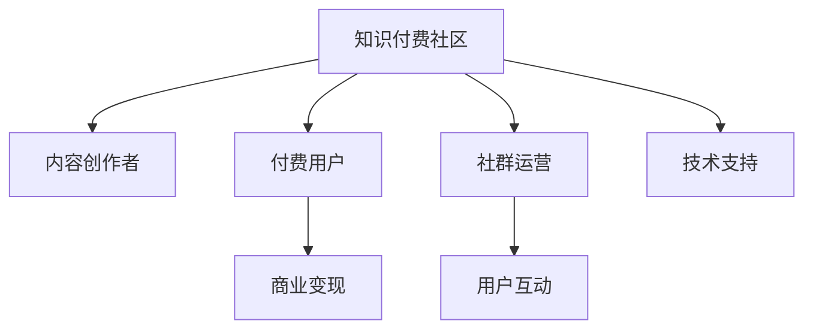

                 

# 知识付费：程序员的社群运营技巧

## 1. 背景介绍

### 1.1 问题由来

随着互联网技术的发展和信息爆炸，知识付费正成为越来越多人的选择。根据《2021年中国知识付费行业报告》显示，知识付费市场规模已达392.9亿元，较2018年的235.8亿元增长了68.2%，显示出强劲的增长势头。

知识付费形式多样，有课程、电子书、咨询、社区等，但其中尤以社区形式的知识付费最为特别。社区知识付费不仅提供内容，更重要的是提供一个交流、互动的平台，让付费用户能够与知识创作者和社区成员进行深度交流，从而提升学习效果。然而，如何运营好一个知识付费社区，让知识创作者和付费用户都能够满意，却是件十分复杂和具有挑战性的事情。

### 1.2 问题核心关键点

知识付费社区的运营涉及到多个方面，从内容生成到用户互动，从平台维护到商业变现，每个环节都需要精心设计。这里主要从以下几个核心点来探讨：

1. **内容质量与多元化**：社区内容是知识付费的核心，必须保证内容质量高、主题丰富、更新及时。
2. **用户激励与互动**：通过有效的用户激励机制，如积分、排名、认证等，提升用户参与度，增强社区互动性。
3. **平台生态与商业变现**：社区平台需要平衡内容生态与商业变现，制定合理的盈利模式，确保社区健康发展。
4. **技术与运营**：社区运营需要借助技术手段提升效率，如用户画像分析、内容推荐算法等，同时确保平台稳定运行。

## 2. 核心概念与联系

### 2.1 核心概念概述

为更好地理解知识付费社区的运营技巧，本节将介绍几个密切相关的核心概念：

- **知识付费社区**：以内容为核心，以社区为载体，通过付费机制汇聚高质量内容的平台。
- **内容创作者**：社区中的知识生产者，通过撰写、分享高质量内容，吸引用户付费。
- **付费用户**：通过付费获取内容服务的用户，是社区知识付费的基础。
- **社群运营**：通过设计合理的机制和流程，提升社区的内容质量、用户粘性、商业价值。
- **用户互动**：社区中用户之间的交流、讨论，增强用户参与度和社区凝聚力。
- **商业变现**：通过会员订阅、广告、付费课程等方式，实现社区平台的盈利。

这些核心概念之间的逻辑关系可以通过以下Mermaid流程图来展示：



这个流程图展示的知识付费社区核心概念及其之间的关系：

1. 知识付费社区通过内容创作者生产内容，吸引付费用户。
2. 社群运营提升社区的用户粘性、内容质量等，形成良性的社区生态。
3. 用户互动增强社区的活跃度，促进内容的传播与分享。
4. 商业变现保证社区的可持续发展。
5. 技术支持是社区运营的基础保障。

## 3. 核心算法原理 & 具体操作步骤
### 3.1 算法原理概述

知识付费社区的运营涉及多个算法模型和技术手段，但核心在于内容的推荐和匹配，以及用户的激励和互动机制设计。

### 3.2 算法步骤详解

**步骤1：内容推荐系统设计**

知识付费社区的核心在于内容，好的内容推荐系统可以让用户更快地找到自己感兴趣的内容。推荐算法的基本流程如下：

1. **用户画像**：基于用户的历史行为、支付记录、兴趣标签等信息，构建用户画像。
2. **内容标签**：对社区中的内容进行标签化，如主题、难度、热度等。
3. **推荐模型**：采用协同过滤、内容过滤、基于深度学习的推荐算法等，预测用户对某个内容的兴趣程度。
4. **排序与展示**：根据推荐算法的结果，对内容进行排序，展示在用户的界面上。

**步骤2：用户激励与互动机制设计**

社区运营需要设计有效的用户激励机制，提升用户参与度，增强社区互动性。

1. **积分系统**：用户通过发布内容、回答问题、点赞评论等获得积分，积分可用于兑换特权、课程、商品等。
2. **排行榜**：根据用户的积分、活跃度、付费次数等指标，设置不同的排行榜，如会员排行榜、活跃用户排行榜等。
3. **认证机制**：对内容创作者进行认证，通过专家评审、用户投票等方式，提升内容的权威性和可信度。
4. **互动奖励**：对用户之间的互动行为，如评论、点赞、分享等，给予奖励，如增加积分、提升排名等。

**步骤3：平台生态与商业变现设计**

社区平台需要通过合理的商业变现模式，实现可持续发展。

1. **会员制**：设置不同等级的会员，提供不同权益，如专属内容、VIP频道、优先互动等，通过会员订阅实现盈利。
2. **广告**：在社区界面投放广告，通过流量变现。
3. **课程销售**：社区中的高价值课程可以独立销售，增加收入。
4. **知识付费商品**：社区中还可销售与课程内容相关的周边商品，如书籍、笔记本等。

**步骤4：技术与运营**

社区运营需要借助技术手段提升效率，同时确保平台稳定运行。

1. **数据存储与计算**：使用分布式数据库和计算集群，保证数据存储与处理的可靠性。
2. **内容管理系统**：开发完善的内容管理系统，方便内容创作者上传、管理内容。
3. **社区互动工具**：设计社区互动工具，如评论、点赞、讨论区等，提升用户互动性。
4. **监控与预警**：通过日志分析和监控工具，实时检测平台运行状态，及时预警并解决异常情况。

### 3.3 算法优缺点

知识付费社区的运营算法具有以下优点：

1. **提升用户体验**：通过内容推荐和互动机制，提升用户粘性，提升社区的用户体验。
2. **丰富内容生态**：多样化的内容形式和推荐算法，满足用户多样化需求，丰富社区内容生态。
3. **盈利模式多样化**：会员制、广告、课程销售等多样化的盈利模式，保障社区可持续发展。
4. **技术支撑**：通过大数据、人工智能等技术手段，提升运营效率和准确性。

但同时也存在一些缺点：

1. **内容质量难以控制**：社区内容质量良莠不齐，需要持续的内容审核和筛选。
2. **运营成本较高**：社区运营需要大量的人力、技术和资金投入，运营成本较高。
3. **用户流失风险**：用户获取和留存是社区运营的难点，需要不断优化用户体验和社区生态。
4. **商业变现难度**：广告和课程销售的盈利模式依赖于用户粘性和活跃度，社区运营需平衡商业与内容。

## 4. 数学模型和公式 & 详细讲解 & 举例说明

### 4.1 数学模型构建

假设社区中的用户数为 $N$，内容数为 $M$，内容标签为 $L$，用户历史行为数据为 $X$，用户画像为 $U$，内容标签为 $C$，内容推荐模型为 $F$，用户互动模型为 $I$，社区平台盈利模型为 $P$。

**内容推荐模型**：
\[ F(U,C) = \alpha_1 U^T \beta_1 + \alpha_2 C^T \beta_2 + \epsilon \]

其中，$U$ 为用户画像向量，$C$ 为内容标签向量，$\alpha_1$ 和 $\alpha_2$ 为模型的系数向量，$\beta_1$ 和 $\beta_2$ 为模型参数向量，$\epsilon$ 为误差项。

**用户互动模型**：
\[ I(U,X) = \gamma_1 X^T \delta_1 + \gamma_2 U^T \delta_2 + \zeta \]

其中，$X$ 为用户历史行为数据，$\gamma_1$ 和 $\gamma_2$ 为模型的系数向量，$\delta_1$ 和 $\delta_2$ 为模型参数向量，$\zeta$ 为误差项。

**社区平台盈利模型**：
\[ P(N,M,L,F,I) = \lambda_1 \times \text{会员订阅收入} + \lambda_2 \times \text{广告收入} + \lambda_3 \times \text{课程销售收入} + \lambda_4 \times \text{商品销售收入} \]

其中，$\lambda_1$、$\lambda_2$、$\lambda_3$ 和 $\lambda_4$ 为社区盈利模型的系数，$\text{会员订阅收入}$、$\text{广告收入}$、$\text{课程销售收入}$ 和 $\text{商品销售收入}$ 分别为不同的盈利渠道。

### 4.2 公式推导过程

**内容推荐模型推导**：
\[ F(U,C) = \alpha_1 U^T \beta_1 + \alpha_2 C^T \beta_2 + \epsilon \]

**用户互动模型推导**：
\[ I(U,X) = \gamma_1 X^T \delta_1 + \gamma_2 U^T \delta_2 + \zeta \]

**社区平台盈利模型推导**：
\[ P(N,M,L,F,I) = \lambda_1 \times \text{会员订阅收入} + \lambda_2 \times \text{广告收入} + \lambda_3 \times \text{课程销售收入} + \lambda_4 \times \text{商品销售收入} \]

### 4.3 案例分析与讲解

**案例1：推荐算法**

某知识付费社区采用协同过滤推荐算法，对用户和内容进行相似度计算，找出相似用户和内容，并推荐相似的内容给当前用户。算法流程如下：

1. **用户相似度计算**：基于用户行为数据和用户画像，计算用户之间的相似度矩阵。
2. **内容相似度计算**：基于内容标签，计算内容之间的相似度矩阵。
3. **相似度加权**：对相似度矩阵进行加权处理，计算用户和内容之间的相似度。
4. **内容推荐**：根据相似度结果，推荐相似的内容给当前用户。

**案例2：用户激励机制**

某知识付费社区采用积分系统，对用户发布内容、回答问题、点赞评论等行为进行积分奖励。积分系统设计如下：

1. **积分计算**：对用户的每个行为进行积分计算，如发布内容获10分，回答问题获5分，点赞评论获2分。
2. **积分兑换**：用户可使用积分兑换会员特权、课程、商品等。
3. **积分排名**：根据用户的积分排名，设置不同的排行榜，如会员排行榜、活跃用户排行榜等。
4. **积分奖励**：对用户之间的互动行为，如评论、点赞、分享等，给予积分奖励，增加用户互动性。

**案例3：平台盈利模型**

某知识付费社区采用多元化盈利模式，实现可持续发展。平台盈利模型设计如下：

1. **会员订阅收入**：根据用户付费的会员等级，提供不同权益，如专属内容、VIP频道、优先互动等。
2. **广告收入**：在社区界面投放广告，通过流量变现。
3. **课程销售收入**：社区中高质量课程可以独立销售，增加收入。
4. **商品销售收入**：社区中还可销售与课程内容相关的周边商品，如书籍、笔记本等。

## 5. 项目实践：代码实例和详细解释说明

### 5.1 开发环境搭建

在进行知识付费社区运营的实践前，我们需要准备好开发环境。以下是使用Python进行Django开发的环境配置流程：

1. 安装Anaconda：从官网下载并安装Anaconda，用于创建独立的Python环境。

2. 创建并激活虚拟环境：
```bash
conda create -n knowledge-payment-env python=3.8 
conda activate knowledge-payment-env
```

3. 安装Django：根据Django版本，从官网获取对应的安装命令。例如：
```bash
pip install django==4.0
```

4. 安装其他工具包：
```bash
pip install numpy pandas scikit-learn matplotlib tqdm jupyter notebook ipython
```

完成上述步骤后，即可在`knowledge-payment-env`环境中开始知识付费社区的开发。

### 5.2 源代码详细实现

下面我们以内容推荐系统为例，给出使用Django开发的知识付费社区的Python代码实现。

首先，定义推荐系统中的用户和内容模型：

```python
from django.db import models

class User(models.Model):
    username = models.CharField(max_length=50)
    email = models.EmailField(unique=True)
    name = models.CharField(max_length=100)
    avatar = models.ImageField(upload_to='avatars/')

    def __str__(self):
        return self.username

class Content(models.Model):
    title = models.CharField(max_length=100)
    description = models.TextField()
    tags = models.CharField(max_length=100)
    author = models.ForeignKey(User, on_delete=models.CASCADE)
    publish_date = models.DateTimeField(auto_now_add=True)

    def __str__(self):
        return self.title
```

然后，定义推荐系统的用户画像和内容标签模型：

```python
class UserProfile(models.Model):
    user = models.OneToOneField(User, on_delete=models.CASCADE)
    interests = models.CharField(max_length=100)
    level = models.IntegerField(default=0)

    def __str__(self):
        return f"{self.user.username} Profile"

class ContentTag(models.Model):
    name = models.CharField(max_length=100)
    content = models.ForeignKey(Content, on_delete=models.CASCADE)

    def __str__(self):
        return f"{self.name} ({self.content.title})"
```

接着，定义推荐算法模型：

```python
class RecommendationModel(models.Model):
    user = models.ForeignKey(User, on_delete=models.CASCADE)
    content = models.ForeignKey(Content, on_delete=models.CASCADE)
    score = models.FloatField(default=0)

    def __str__(self):
        return f"{self.user.username} recommends {self.content.title}"
```

最后，定义推荐系统的推荐引擎：

```python
class RecommendationEngine:
    def __init__(self, user, content):
        self.user = user
        self.content = content

    def calculate_similarity(self):
        # 计算用户和内容的相似度
        pass

    def recommend_contents(self, num=5):
        # 根据相似度推荐内容
        pass
```

完成上述步骤后，即可在`knowledge-payment-env`环境中启动内容推荐系统的开发。

### 5.3 代码解读与分析

让我们再详细解读一下关键代码的实现细节：

**User和Content模型**：
- `User` 模型定义了用户的基本信息，如用户名、邮箱、头像等。
- `Content` 模型定义了内容的标题、描述、标签、作者和发布日期。

**UserProfile和ContentTag模型**：
- `UserProfile` 模型扩展了用户的兴趣和等级，为推荐系统提供用户画像。
- `ContentTag` 模型定义了内容的标签，为推荐系统提供内容特征。

**RecommendationModel模型**：
- `RecommendationModel` 模型记录了用户的推荐内容，并记录了推荐得分。

**RecommendationEngine类**：
- `RecommendationEngine` 类定义了推荐引擎的基本流程，包括计算相似度和推荐内容等。

这些模型和类的设计思路，展示了知识付费社区推荐的实现过程。在实际开发中，需要根据社区的具体需求，进行相应的扩展和优化，如加入更多用户画像特征、优化相似度计算方法、引入深度学习推荐算法等。

## 6. 实际应用场景

### 6.1 智能客服系统

知识付费社区的智能客服系统，可以通过微调大语言模型，实现问答和咨询功能。智能客服系统可以自动回答用户常见问题，引导用户解决问题，提高用户满意度和平台的用户体验。

在技术实现上，可以收集社区内部的问答记录，将问题和最佳答复构建成监督数据，训练大语言模型。微调后的模型能够自动理解用户意图，匹配最合适的答复，并通过自然语言生成技术，生成准确的回答。对于用户提出的新问题，还可以通过检索系统实时搜索相关内容，动态组织生成回答，进一步提升智能客服的准确性和灵活性。

### 6.2 金融投资分析

知识付费社区的金融投资分析，可以通过微调机器学习模型，实现市场分析和投资建议功能。金融投资分析系统可以自动分析市场数据，预测市场走势，提供投资建议。

在技术实现上，可以收集社区用户对市场的分析数据和投资建议，将其作为监督数据，训练机器学习模型。微调后的模型能够自动学习市场规律和用户偏好，预测市场走势，提供投资建议。对于社区用户提出的投资问题，还可以通过检索系统实时搜索相关内容，动态生成分析报告，进一步提升金融投资分析的准确性和可靠性。

### 6.3 医疗健康咨询

知识付费社区的医疗健康咨询，可以通过微调大语言模型，实现健康咨询和疾病诊断功能。医疗健康咨询系统可以自动回答用户健康问题，提供疾病诊断建议，引导用户就医。

在技术实现上，可以收集社区用户的健康咨询数据和医生诊断建议，将其作为监督数据，训练大语言模型。微调后的模型能够自动理解用户健康问题，匹配最合适的诊断建议，并通过自然语言生成技术，生成准确的回答。对于用户提出的新健康问题，还可以通过检索系统实时搜索相关内容，动态生成诊断报告，进一步提升医疗健康咨询的准确性和可靠性。

### 6.4 未来应用展望

随着知识付费社区的不断发展，未来的应用场景将更加多样化和智能化。以下是几个未来应用展望：

1. **个性化推荐系统**：基于用户画像和行为数据，实现更加个性化的内容推荐，提升用户粘性。
2. **智能广告投放系统**：根据用户行为数据和兴趣爱好，实现精准的广告投放，提升广告效果和平台收益。
3. **社区治理系统**：通过用户行为数据和社区规则，实现社区内容的自动审核和治理，提升社区质量。
4. **智能问答系统**：通过微调大语言模型和检索系统，实现智能问答，提升用户满意度和平台互动性。
5. **跨界融合应用**：与其他垂直领域进行跨界融合，实现跨领域的内容推荐和知识共享。

## 7. 工具和资源推荐

### 7.1 学习资源推荐

为了帮助开发者系统掌握知识付费社区的运营技巧，这里推荐一些优质的学习资源：

1. **《知识付费：从0到1》系列博文**：由知识付费领域专家撰写，深入浅出地介绍了知识付费的商业模式、运营策略等前沿话题。

2. **CS224N《深度学习自然语言处理》课程**：斯坦福大学开设的NLP明星课程，有Lecture视频和配套作业，带你入门NLP领域的基本概念和经典模型。

3. **《知识付费社区运营指南》书籍**：全面介绍了知识付费社区的运营技巧，包括内容推荐、用户激励、商业变现等各个环节。

4. **Kaggle知识付费社区竞赛**：通过参与知识付费社区的竞赛，学习社区运营的最佳实践和前沿技术。

5. **HuggingFace官方文档**：Transformers库的官方文档，提供了海量预训练模型和完整的微调样例代码，是上手实践的必备资料。

通过对这些资源的学习实践，相信你一定能够快速掌握知识付费社区的运营技巧，并用于解决实际的社区运营问题。

### 7.2 开发工具推荐

高效的开发离不开优秀的工具支持。以下是几款用于知识付费社区开发常用的工具：

1. Django：Python的Web框架，开发社区系统时使用广泛，具有强大的模块化和扩展性。
2. SQLAlchemy：Python的ORM工具，方便与数据库进行交互，提升开发效率。
3. Redis：内存数据存储和缓存系统，用于提高社区系统的性能和稳定性。
4. ElasticSearch：分布式搜索和分析引擎，用于社区内容的快速检索和搜索。
5. Celery：分布式任务队列系统，用于社区系统的异步任务处理。

合理利用这些工具，可以显著提升知识付费社区的开发效率，加快创新迭代的步伐。

### 7.3 相关论文推荐

知识付费社区的运营技术涉及多个领域，需要从不同角度进行研究。以下是几篇奠基性的相关论文，推荐阅读：

1. **《深度学习在知识付费中的应用》**：介绍深度学习技术在知识付费领域的应用，包括内容推荐、智能客服等。
2. **《知识付费社区运营的挑战与应对策略》**：探讨知识付费社区运营中面临的挑战和解决方案，包括用户激励、平台生态等。
3. **《用户画像驱动的知识付费推荐系统》**：研究如何通过用户画像驱动知识付费推荐系统，提升推荐效果。
4. **《智能客服系统在知识付费中的应用》**：介绍智能客服系统在知识付费中的应用，包括自然语言处理和智能推荐。
5. **《知识付费社区的跨界融合与应用》**：研究知识付费社区与其他垂直领域的跨界融合，提升知识共享和应用效果。

这些论文代表了大语言模型微调技术的发展脉络。通过学习这些前沿成果，可以帮助研究者把握学科前进方向，激发更多的创新灵感。

## 8. 总结：未来发展趋势与挑战

### 8.1 总结

本文对知识付费社区的运营技巧进行了全面系统的介绍。首先阐述了知识付费社区的运营背景和意义，明确了运营技巧在提升用户体验、增强用户粘性、提升商业价值等方面的独特价值。其次，从原理到实践，详细讲解了内容推荐系统、用户激励与互动机制、平台生态与商业变现等核心运营策略，给出了知识付费社区开发的完整代码实例。同时，本文还广泛探讨了知识付费社区在智能客服、金融投资分析、医疗健康咨询等多个行业领域的应用前景，展示了知识付费社区的广阔潜力。此外，本文精选了知识付费社区运营的各类学习资源，力求为读者提供全方位的技术指引。

通过本文的系统梳理，可以看到，知识付费社区运营涉及多个环节和多个学科领域的知识，需要跨学科的复合型人才进行综合设计。唯有精心设计和持续优化，才能让知识付费社区运营更加高效、智能、可靠。

### 8.2 未来发展趋势

展望未来，知识付费社区的运营技术将呈现以下几个发展趋势：

1. **智能化推荐系统**：利用深度学习和大数据技术，实现更加智能化和精准化的内容推荐，提升用户体验。
2. **个性化用户激励**：通过智能算法设计，实现更加个性化的用户激励机制，增强用户粘性。
3. **多元化商业变现**：通过内容生态的不断丰富，实现多元化商业变现，提升平台收益。
4. **社区治理系统**：通过智能算法和社区规则，实现社区内容的自动审核和治理，提升社区质量。
5. **跨界融合应用**：与其他垂直领域进行跨界融合，实现跨领域的内容推荐和知识共享。

这些趋势将进一步提升知识付费社区的运营效率和效果，为知识付费产业带来更多的创新和价值。

### 8.3 面临的挑战

尽管知识付费社区的运营技术已经取得了一定进展，但在迈向更加智能化、普适化应用的过程中，它仍面临诸多挑战：

1. **用户获取和留存**：如何高效获取用户，并通过有效的激励机制提升用户粘性，是社区运营的首要挑战。
2. **内容质量控制**：如何保证社区内容质量，避免低质内容的泛滥，是社区运营的重要难题。
3. **商业变现难度**：广告和课程销售等盈利模式依赖于用户粘性和活跃度，社区运营需平衡商业与内容。
4. **技术实现难度**：知识付费社区涉及大数据、人工智能等多项技术，技术实现难度较大。
5. **监管合规**：知识付费社区需要符合相关法律法规和行业规范，确保平台的合法合规运营。

这些挑战需要社区运营团队不断探索和改进，才能实现知识付费社区的可持续发展和商业变现。

### 8.4 研究展望

面对知识付费社区运营所面临的种种挑战，未来的研究需要在以下几个方面寻求新的突破：

1. **用户行为分析**：通过深入研究用户行为数据，设计更加精准的用户画像和推荐系统，提升用户体验。
2. **用户激励机制优化**：设计更加多样化、个性化的用户激励机制，增强用户粘性和互动性。
3. **内容质量控制技术**：引入更多先进的内容质量控制技术，如内容审核、反垃圾算法等，提升社区内容质量。
4. **跨界融合应用**：探索跨界融合应用的多种形式，实现知识付费社区与其他垂直领域的深度结合。
5. **智能广告投放系统**：研究智能广告投放系统，实现精准广告投放，提升广告效果和平台收益。

这些研究方向将引领知识付费社区运营技术迈向更高的台阶，为知识付费产业带来更多的创新和价值。

## 9. 附录：常见问题与解答

**Q1：知识付费社区的运营难点是什么？**

A: 知识付费社区的运营难点主要在于以下几个方面：
1. **用户获取和留存**：如何高效获取用户，并通过有效的激励机制提升用户粘性。
2. **内容质量控制**：如何保证社区内容质量，避免低质内容的泛滥。
3. **商业变现难度**：广告和课程销售等盈利模式依赖于用户粘性和活跃度，社区运营需平衡商业与内容。
4. **技术实现难度**：知识付费社区涉及大数据、人工智能等多项技术，技术实现难度较大。
5. **监管合规**：知识付费社区需要符合相关法律法规和行业规范，确保平台的合法合规运营。

**Q2：知识付费社区的盈利模式有哪些？**

A: 知识付费社区的盈利模式主要包括以下几种：
1. **会员制**：设置不同等级的会员，提供不同权益，如专属内容、VIP频道、优先互动等，通过会员订阅实现盈利。
2. **广告**：在社区界面投放广告，通过流量变现。
3. **课程销售**：社区中的高价值课程可以独立销售，增加收入。
4. **商品销售**：社区中还可销售与课程内容相关的周边商品，如书籍、笔记本等。
5. **增值服务**：提供社区内的增值服务，如专属咨询、VIP客服等。

**Q3：如何设计知识付费社区的用户激励机制？**

A: 设计知识付费社区的用户激励机制，主要包括以下几个方面：
1. **积分系统**：对用户的每个行为进行积分计算，如发布内容获10分，回答问题获5分，点赞评论获2分。
2. **排行榜**：根据用户的积分、活跃度、付费次数等指标，设置不同的排行榜，如会员排行榜、活跃用户排行榜等。
3. **认证机制**：对内容创作者进行认证，通过专家评审、用户投票等方式，提升内容的权威性和可信度。
4. **互动奖励**：对用户之间的互动行为，如评论、点赞、分享等，给予奖励，如增加积分、提升排名等。

这些设计思路，可以有效地提升用户粘性和互动性，增强社区活力。

**Q4：知识付费社区的内容推荐系统设计思路是什么？**

A: 知识付费社区的内容推荐系统设计思路主要包括以下几个方面：
1. **用户画像**：基于用户的历史行为、支付记录、兴趣标签等信息，构建用户画像。
2. **内容标签**：对社区中的内容进行标签化，如主题、难度、热度等。
3. **推荐模型**：采用协同过滤、内容过滤、基于深度学习的推荐算法等，预测用户对某个内容的兴趣程度。
4. **排序与展示**：根据推荐算法的结果，对内容进行排序，展示在用户的界面上。

这些设计思路，展示了知识付费社区内容推荐系统的实现过程，需要根据社区的具体需求进行相应的扩展和优化。

**Q5：知识付费社区的未来应用场景有哪些？**

A: 知识付费社区的未来应用场景主要包括以下几个方面：
1. **智能客服系统**：通过微调大语言模型，实现问答和咨询功能。智能客服系统可以自动回答用户常见问题，引导用户解决问题，提高用户满意度和平台的用户体验。
2. **金融投资分析**：通过微调机器学习模型，实现市场分析和投资建议功能。金融投资分析系统可以自动分析市场数据，预测市场走势，提供投资建议。
3. **医疗健康咨询**：通过微调大语言模型，实现健康咨询和疾病诊断功能。医疗健康咨询系统可以自动回答用户健康问题，提供疾病诊断建议，引导用户就医。
4. **个性化推荐系统**：基于用户画像和行为数据，实现更加个性化的内容推荐，提升用户粘性。
5. **智能广告投放系统**：根据用户行为数据和兴趣爱好，实现精准的广告投放，提升广告效果和平台收益。
6. **社区治理系统**：通过用户行为数据和社区规则，实现社区内容的自动审核和治理，提升社区质量。
7. **智能问答系统**：通过微调大语言模型和检索系统，实现智能问答，提升用户满意度和平台互动性。
8. **跨界融合应用**：与其他垂直领域进行跨界融合，实现跨领域的内容推荐和知识共享。

这些未来应用场景，将进一步提升知识付费社区的运营效果和用户体验。

---

作者：禅与计算机程序设计艺术 / Zen and the Art of Computer Programming

