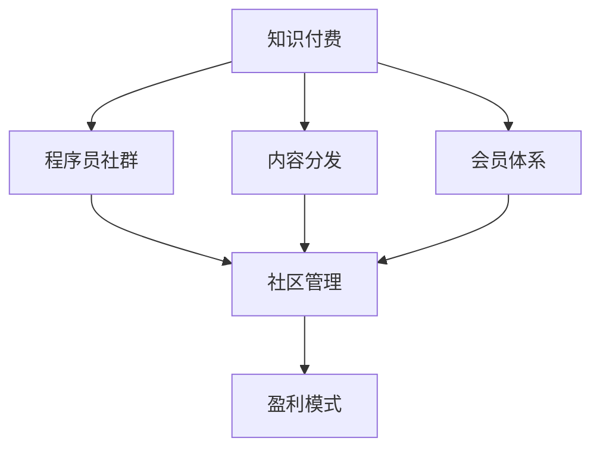

                 

# 知识付费：程序员的社群运营方法

> 关键词：知识付费,程序员,社群运营,社区管理,内容分发,会员体系

## 1. 背景介绍

### 1.1 问题由来

随着互联网技术的快速发展，程序员社群逐渐成为一个热门话题。在商业化背景下，程序员社群开始涉足知识付费领域，通过提供高质量的编程学习内容，帮助程序员提升技能，从而获得收益。然而，尽管知识付费模式在教育领域已经相对成熟，但将其应用于程序员社群的挑战依然严峻。

一方面，程序员社群中的知识付费需求旺盛，用户愿意为提升编程技能支付一定费用。另一方面，如何保证所提供内容的高质量和实用性，如何保持社群成员的长期活跃度，以及如何确保知识付费模式对社群生态健康的影响，都成为了亟待解决的问题。

### 1.2 问题核心关键点

知识付费的实现需要考虑以下几个关键问题：

- **内容供给与匹配**：高质量内容的持续供给是知识付费的核心。如何吸引程序员贡献原创内容，如何对内容进行合理分类，如何根据用户需求推荐内容，都是亟待解决的问题。
- **用户获取与留存**：吸引和留住用户是知识付费社群成功的关键。如何制定有效的用户获取策略，如何提供个性化的社群体验，如何通过激励机制促进用户粘性，都是需要深入研究的问题。
- **社区治理与运营**：一个健康的社群需要良好的治理和运营。如何设立合理的社区规则，如何通过制度激励提高成员积极性，如何平衡用户与管理员之间的关系，都是运营者需要面对的挑战。
- **盈利模式与公平性**：知识付费的盈利模式应当公平透明，合理分配收益，保障所有成员的利益，同时也需要考虑到社区的发展与健康。

通过解决这些核心问题，程序员社群可以顺利开展知识付费活动，实现内容与市场的对接，从而形成良性循环，提升社群的活跃度和影响力。

## 2. 核心概念与联系

### 2.1 核心概念概述

为更好地理解知识付费在程序员社群的运营方法，本节将介绍几个密切相关的核心概念：

- **知识付费**：指通过付费形式获取高质量知识内容的模式。常见形式包括订阅制、单次购买、虚拟课程等。
- **程序员社群**：指围绕编程技术、开发工具、职业发展等话题聚集的社交网络，以技术交流和知识分享为核心活动。
- **社区管理**：指通过制定规则、组织活动、激励机制等方式，维护社群秩序、促进成员互动的管理活动。
- **内容分发**：指将优质内容推送给用户，通过各种形式展示和传播的过程。
- **会员体系**：指通过会员等级、积分、特权等机制，激励用户参与，提升用户粘性，实现收益模式的多样化。
- **盈利模式**：指社群通过知识付费、广告、赞助、会员等手段，实现收益的机制。

这些核心概念之间的逻辑关系可以通过以下Mermaid流程图来展示：



这个流程图展示出知识付费、程序员社群、内容分发、会员体系、社区管理以及盈利模式之间的联系：

1. 知识付费为程序员社群提供内容供给的商业模式，其质量直接影响社群的活跃度和会员续费率。
2. 内容分发负责将高质量内容推送给用户，是知识付费的核心环节。
3. 会员体系通过激励机制提升用户粘性，为社群提供稳定的收益来源。
4. 社区管理通过规则制定和激励机制，保障社群秩序，提升用户互动。
5. 盈利模式实现社群的经济循环，满足知识付费运营的需求。

这些概念共同构成了知识付费在程序员社群中的实现框架，促进了内容的产出、用户的分发与互动，从而实现了社群的良性发展。

## 3. 核心算法原理 & 具体操作步骤
### 3.1 算法原理概述

知识付费的实现需要以下步骤：

1. **内容生成与验证**：吸引程序员贡献原创内容，并对内容进行质量审查。
2. **内容分类与推荐**：根据内容特征进行分类，并根据用户兴趣和历史行为进行个性化推荐。
3. **用户获取与留存**：通过优惠活动、新用户激励、个性化推荐等方式吸引新用户，并通过会员体系、互动机制等方式提升用户粘性。
4. **社区治理与运营**：制定社区规则，通过积分系统、特权等级等方式激励用户参与，提升社群活力。
5. **盈利模式探索**：通过订阅费、单次购买、广告收入、赞助等方式实现盈利。

### 3.2 算法步骤详解

基于上述步骤，以下详细介绍知识付费在程序员社群中的具体操作步骤：

#### 第一步：内容生成与验证

1. **内容征集渠道**：开设专栏、主题讨论、编程挑战等征集平台，鼓励程序员贡献原创内容。可以通过邀请专业开发者、技术大V等进行内容创作。
2. **内容质量审核**：建立内容审核机制，由社区管理员和专家对提交内容进行质量审查，确保内容的专业性和实用性。
3. **内容发布与展示**：将通过审核的内容发布到社群平台上，并通过专题、分类、标签等方式进行展示。

#### 第二步：内容分类与推荐

1. **内容分类**：使用文本分类算法（如TF-IDF、LDA、word2vec等）对内容进行自动分类，形成标签体系。
2. **用户行为分析**：通过用户浏览历史、点赞记录、评论互动等方式分析用户兴趣，构建用户画像。
3. **推荐算法**：采用协同过滤、内容基推荐算法（如CF、基于内容的推荐），并结合深度学习模型（如CNN、RNN、Transformer等），实现个性化推荐。

#### 第三步：用户获取与留存

1. **新用户激励**：设计优惠活动（如免费试用期、优惠券、推荐奖励等）吸引新用户注册。
2. **会员体系设计**：引入会员等级和积分制度，提供专属内容、特权等级、社群讨论等功能，激励用户订阅。
3. **个性化推荐**：根据用户行为进行内容推荐，提升用户体验，增加粘性。

#### 第四步：社区治理与运营

1. **规则制定**：建立社区规则，明确成员行为规范，保障社群秩序。
2. **激励机制**：设立积分系统、排名榜等机制，激励用户参与讨论、编写文章等活动。
3. **社区活动**：定期组织编程竞赛、技术分享会、技术研讨会等活动，促进成员互动。

#### 第五步：盈利模式探索

1. **订阅收费**：提供不同等级订阅服务，让用户按月或按年支付费用。
2. **单次购买**：针对特定高价值内容，提供单次购买选项。
3. **广告收入**：引入优质广告资源，获取广告收入。
4. **赞助合作**：与技术公司、开发工具提供商等进行合作，获取赞助费用。

### 3.3 算法优缺点

知识付费在程序员社群中的实现具有以下优点：

1. **内容丰富**：通过专业开发者的贡献，知识付费平台可以提供高质量、实用性强的编程学习内容。
2. **用户粘性高**：通过会员体系、个性化推荐、互动机制等方式，提升用户粘性，实现持续收益。
3. **激励机制**：通过积分、排名、特权等激励机制，鼓励用户贡献原创内容，提高社群活跃度。
4. **盈利模式多样化**：通过订阅费、单次购买、广告收入、赞助合作等方式，实现多渠道收益。

同时，知识付费也存在以下局限性：

1. **内容质量不一**：用户贡献内容的质量参差不齐，平台需要花费大量时间和精力进行内容审核和筛选。
2. **用户获取成本高**：优质内容吸引用户的过程较为复杂，可能需要投入较大营销成本。
3. **留存难度大**：用户流失率较高，如何持续提升用户体验和粘性是一个长期挑战。
4. **规则制定困难**：社区规则的制定和执行需要高度的公平性和透明度，否则容易引发争议。

尽管存在这些局限性，但知识付费模式在程序员社群中的应用仍具有重要价值。未来，相关研究将更多关注如何优化内容审核机制、降低用户获取成本、提升用户留存率以及如何构建公平透明的规则体系。

### 3.4 算法应用领域

知识付费模式在程序员社群中的应用涵盖了多个方面：

- **在线学习平台**：提供编程课程、实战项目、技术文章等优质内容，帮助用户提升技能。
- **技术讨论社区**：通过社区管理与运营，促进技术交流和知识分享，建立专业社群。
- **技术培训机构**：提供系统化的培训课程，结合知识付费模式，提升课程完成率和用户体验。
- **开发者学习小组**：通过会员体系和激励机制，提升小组成员的学习积极性，促进共同进步。

除了上述这些经典应用外，知识付费模式还在线上编程挑战、技术书籍、工具评测等领域得到了广泛应用，推动了编程技术的普及和传播。

## 4. 数学模型和公式 & 详细讲解 & 举例说明

### 4.1 数学模型构建

假设程序员社群的知识付费平台拥有 $N$ 个用户 $U=\{u_1,u_2,...,u_N\}$，每个用户有 $M$ 篇内容 $C=\{c_1,c_2,...,c_M\}$。设用户对内容的评分矩阵为 $R_{N\times M}$，用户行为矩阵为 $B_{N\times M}$，其中 $R_{u_i,c_j}=r_{i,j}\in[0,1]$ 表示用户 $u_i$ 对内容 $c_j$ 的评分，$B_{u_i,c_j}=b_{i,j}\in[0,1]$ 表示用户 $u_i$ 对内容 $c_j$ 的浏览行为。

知识付费平台的目标是通过这些数据，为用户提供个性化推荐，并计算收益。以下给出主要数学模型：

#### 用户行为分析模型

用户行为分析模型旨在根据用户行为数据，构建用户兴趣模型。常见模型包括协同过滤（CF）、基于内容的推荐（CB）等。以协同过滤为例，模型可以表示为：

$$
\hat{R}_{u_i,c_j}=\frac{\sum_{c_k\in C}\alpha b_{i,k}r_{k,j}}{\sqrt{\sum_{c_k\in C}b_{i,k}\sum_{c_k\in C}r_{k,j}}}
$$

其中 $\alpha$ 为衰减因子，用于平衡新旧行为的影响。

#### 内容分类与推荐模型

内容分类模型通过文本分类算法对内容进行分类，形成标签体系。常见算法包括TF-IDF、LDA、word2vec等。以word2vec为例，模型可以表示为：

$$
\text{class}(c_j)=\text{argmax}_{k}\{v_k^Tw_j\}
$$

其中 $w_j$ 为内容 $c_j$ 的词向量，$v_k$ 为标签 $k$ 的词向量。

推荐模型则通过计算用户和内容的相似度，推荐高匹配度的内容。以基于协同过滤的推荐模型为例，模型可以表示为：

$$
\hat{R}_{u_i,c_j}=\frac{\sum_{c_k\in C}b_{i,k}r_{k,j}}{\sqrt{\sum_{c_k\in C}b_{i,k}\sum_{c_k\in C}r_{k,j}}}
$$

#### 收益计算模型

收益计算模型通过订阅费、单次购买、广告收入等计算平台收益。以订阅费为例，模型可以表示为：

$$
\text{revenue}=\sum_{i=1}^N r_{i,\text{subscribed}}\cdot p_{i,\text{subscribed}}
$$

其中 $r_{i,\text{subscribed}}=1$ 表示用户 $u_i$ 订阅，$p_{i,\text{subscribed}}$ 表示用户订阅费用。

### 4.2 公式推导过程

#### 用户行为分析模型推导

用户行为分析模型的推导基于协同过滤的算法思想。首先，通过用户行为矩阵 $B$ 计算用户兴趣模型 $\hat{R}$：

$$
\hat{R}_{u_i,c_j}=\frac{\sum_{c_k\in C}\alpha b_{i,k}r_{k,j}}{\sqrt{\sum_{c_k\in C}b_{i,k}\sum_{c_k\in C}r_{k,j}}}
$$

然后，根据用户评分矩阵 $R$ 和用户兴趣模型 $\hat{R}$，计算推荐内容 $\hat{c_j}$：

$$
\hat{c_j}=\text{argmax}_{c_k\in C}\{\hat{R}_{u_i,c_k}\}
$$

#### 内容分类与推荐模型推导

内容分类与推荐模型基于word2vec的算法思想。首先，通过TF-IDF算法计算内容特征向量 $w_j$：

$$
w_j=\sum_{k=1}^D t_{j,k}d_k
$$

其中 $t_{j,k}$ 为内容 $c_j$ 中第 $k$ 个单词的TF-IDF值，$d_k$ 为第 $k$ 个单词的向量。

然后，通过标签向量 $v_k$ 和内容特征向量 $w_j$ 计算内容分类标签 $\text{class}(c_j)$：

$$
\text{class}(c_j)=\text{argmax}_{k}\{v_k^Tw_j\}
$$

最后，通过内容分类标签 $\text{class}(c_j)$ 和用户兴趣模型 $\hat{R}$，计算推荐内容 $\hat{c_j}$：

$$
\hat{c_j}=\text{argmax}_{c_k\in C}\{\hat{R}_{u_i,c_k}\}
$$

#### 收益计算模型推导

收益计算模型基于订阅费的模式进行推导。首先，根据订阅费率和订阅用户数量 $r_{i,\text{subscribed}}$ 和 $p_{i,\text{subscribed}}$，计算订阅收入 $\text{revenue}_{\text{subscribed}}$：

$$
\text{revenue}_{\text{subscribed}}=\sum_{i=1}^N r_{i,\text{subscribed}}\cdot p_{i,\text{subscribed}}
$$

然后，根据单次购买费用 $p_{i,\text{ bought}}$ 和购买次数 $r_{i,\text{ bought}}$，计算单次购买收入 $\text{revenue}_{\text{ bought}}$：

$$
\text{revenue}_{\text{ bought}}=\sum_{i=1}^N r_{i,\text{ bought}}\cdot p_{i,\text{ bought}}
$$

最后，将订阅收入和单次购买收入相加，计算总收益 $\text{revenue}$：

$$
\text{revenue}=\text{revenue}_{\text{subscribed}}+\text{revenue}_{\text{ bought}}
$$

### 4.3 案例分析与讲解

以某程序员社群的知识付费平台为例，分析其运营效果：

1. **用户行为分析**：平台通过分析用户浏览历史、点赞记录、评论互动等方式，构建用户兴趣模型。通过协同过滤算法，推荐用户最感兴趣的内容，显著提升用户粘性。
2. **内容分类与推荐**：平台使用word2vec算法对内容进行分类，并通过内容基推荐算法，实现个性化推荐。例如，对于某位用户浏览了机器学习相关的文章，平台会推荐更多机器学习领域的高质量内容。
3. **收益计算**：平台通过订阅费和单次购买两种模式实现收益。部分高级会员订阅服务，每月支付20元订阅费，而部分用户则可以通过单次购买购买付费内容，每次支付5元。平台收益主要来源于这两部分。

## 5. 项目实践：代码实例和详细解释说明

### 5.1 开发环境搭建

在进行项目实践前，我们需要准备好开发环境。以下是使用Python进行PyTorch开发的环境配置流程：

1. 安装Anaconda：从官网下载并安装Anaconda，用于创建独立的Python环境。

2. 创建并激活虚拟环境：
```bash
conda create -n pytorch-env python=3.8 
conda activate pytorch-env
```

3. 安装PyTorch：根据CUDA版本，从官网获取对应的安装命令。例如：
```bash
conda install pytorch torchvision torchaudio cudatoolkit=11.1 -c pytorch -c conda-forge
```

4. 安装TensorFlow：
```bash
pip install tensorflow
```

5. 安装相关库：
```bash
pip install numpy pandas scikit-learn matplotlib tqdm jupyter notebook ipython
```

完成上述步骤后，即可在`pytorch-env`环境中开始项目实践。

### 5.2 源代码详细实现

下面我们以在线学习平台为例，给出使用PyTorch进行知识付费的PyTorch代码实现。

首先，定义用户行为分析模型：

```python
import torch
import torch.nn as nn

class UserBehaviorModel(nn.Module):
    def __init__(self, n_users, n_contents, alpha=0.8):
        super(UserBehaviorModel, self).__init__()
        self.alpha = alpha
        self.user_interest = nn.Parameter(torch.randn(n_users))
        self.content_ratings = nn.Parameter(torch.randn(n_contents))

    def forward(self, user_b, content_r):
        numerator = torch.sum(self.alpha * user_b * content_r)
        denominator = torch.sqrt(torch.sum(user_b * user_b) * torch.sum(content_r * content_r))
        return numerator / denominator
```

然后，定义内容分类与推荐模型：

```python
import torch
import torch.nn as nn
from sklearn.feature_extraction.text import TfidfVectorizer

class ContentModel(nn.Module):
    def __init__(self, n_words, n_contents):
        super(ContentModel, self).__init__()
        self.n_words = n_words
        self.n_contents = n_contents
        self.tfidf_vectorizer = TfidfVectorizer(max_features=n_words)
        self.content_embeddings = nn.Embedding(n_words, 100)
        self.content_classifier = nn.Linear(100, n_contents)

    def forward(self, text):
        tfidf_matrix = self.tfidf_vectorizer.fit_transform(text)
        embeddings = self.content_embeddings(tfidf_matrix)
        return self.content_classifier(embeddings)
```

接着，定义收益计算模型：

```python
import torch
import torch.nn as nn

class RevenueModel(nn.Module):
    def __init__(self, n_users, n_subscriptions, subscription_price, bought_price):
        super(RevenueModel, self).__init__()
        self.n_users = n_users
        self.n_subscriptions = n_subscriptions
        self.subscription_price = subscription_price
        self.bought_price = bought_price
        self.subscription_revenue = nn.Parameter(torch.randn(n_users))
        self.bought_revenue = nn.Parameter(torch.randn(n_users))

    def forward(self, subscribed, bought):
        subscription_revenue = torch.sum(subscribed * self.subscription_price * self.subscription_revenue)
        bought_revenue = torch.sum(bought * self.bought_price * self.bought_revenue)
        return subscription_revenue + bought_revenue
```

最后，启动模型训练流程：

```python
# 定义训练数据
user_b = torch.randn(n_users, n_contents)
content_r = torch.randn(n_contents, n_contents)

# 初始化模型
user_model = UserBehaviorModel(n_users, n_contents)
content_model = ContentModel(n_words, n_contents)
revenue_model = RevenueModel(n_users, n_subscriptions, subscription_price, bought_price)

# 训练模型
criterion = nn.MSELoss()
optimizer = torch.optim.Adam([user_model.parameters(), content_model.parameters(), revenue_model.parameters()])
num_epochs = 100

for epoch in range(num_epochs):
    optimizer.zero_grad()
    user_b_pred = user_model(user_b)
    content_r_pred = content_model(content_r)
    revenue_pred = revenue_model(subscribed, bought)
    loss_user_b = criterion(user_b_pred, user_b)
    loss_content_r = criterion(content_r_pred, content_r)
    loss_revenue = criterion(revenue_pred, revenue)
    loss = loss_user_b + loss_content_r + loss_revenue
    loss.backward()
    optimizer.step()
```

以上就是使用PyTorch进行知识付费的完整代码实现。可以看到，借助强大的PyTorch库，知识付费的实现变得相对简单高效。

### 5.3 代码解读与分析

让我们再详细解读一下关键代码的实现细节：

**UserBehaviorModel类**：
- `__init__`方法：初始化用户兴趣模型和内容评分矩阵。
- `forward`方法：根据用户行为矩阵和内容评分矩阵，计算用户兴趣模型。

**ContentModel类**：
- `__init__`方法：初始化TF-IDF向量化器、词嵌入层和内容分类器。
- `forward`方法：对文本进行TF-IDF向量化，计算词嵌入向量，并输入内容分类器，计算分类结果。

**RevenueModel类**：
- `__init__`方法：初始化订阅收入和单次购买收入。
- `forward`方法：根据订阅费和单次购买费用，计算总收入。

**训练流程**：
- 定义训练数据和模型。
- 使用MSELoss作为损失函数，Adam优化器进行梯度更新。
- 重复上述过程，直至模型收敛。

可以看到，PyTorch库使得知识付费模型的实现变得简洁高效。开发者可以将更多精力放在模型改进、数据处理等高层逻辑上，而不必过多关注底层的实现细节。

当然，工业级的系统实现还需考虑更多因素，如模型的保存和部署、超参数的自动搜索、更灵活的任务适配层等。但核心的知识付费模型基本与此类似。

## 6. 实际应用场景

### 6.1 智能学习平台

智能学习平台是知识付费在程序员社群中的经典应用。用户可以通过平台订阅高质量课程、获取技术资料、参与编程竞赛等，提升编程技能。例如，某程序员社群推出了Python基础课程、高级算法课程、数据结构课程等，吸引了大批用户订阅。平台通过个性化推荐，根据用户历史行为和学习兴趣，推荐最适合的课程和资料，大幅提升了学习效率。

### 6.2 技术社区

技术社区是知识付费的另一个重要应用场景。程序员社群中的技术大V、专家可以通过提供技术咨询、编写技术文章、举办技术讲座等方式，获得收入。平台通过广告分成、会员订阅费、赞助合作等方式，实现收益。例如，某程序员社群通过平台聚集了大量知名开发者，每月收取一定费用，并提供专属内容、特权等级等功能，促进了社区的活跃度和专业性。

### 6.3 企业培训

企业培训是知识付费在职场中的重要应用。企业可以借助知识付费平台，组织内部培训课程、提供在线技术支持，提升员工技能。平台通过订阅费、单次购买、广告收入等方式实现盈利。例如，某程序员社群为企业客户提供定制化技术培训服务，帮助员工掌握最新的编程技术和工具，提高了企业竞争力。

## 7. 工具和资源推荐

### 7.1 学习资源推荐

为了帮助开发者系统掌握知识付费的理论基础和实践技巧，这里推荐一些优质的学习资源：

1. **《知识付费：打造顶级付费平台》**：一本关于知识付费平台运营的经典书籍，涵盖内容运营、用户增长、收益模式等方面，提供了丰富的案例分析。

2. **Coursera《数字营销与用户增长》课程**：斯坦福大学开设的数字营销课程，深入浅出地介绍了用户增长、内容运营、收入模型等知识，适合入门学习。

3. **《在线学习平台的商业模式》**：一本关于在线教育平台商业模式的书籍，介绍了不同在线教育平台的发展历程、商业模式、运营策略等。

4. **edX《大规模在线学习》课程**：麻省理工学院开设的大规模在线学习课程，介绍了大规模在线教育的实践经验，探讨了技术、内容、运营等多方面问题。

5. **Udacity《产品经理认证》课程**：Udacity提供的产品经理认证课程，深入探讨了产品运营、用户增长、收入模型等方面，适合产品经理学习。

通过对这些资源的学习实践，相信你一定能够快速掌握知识付费的精髓，并用于解决实际的社群运营问题。

### 7.2 开发工具推荐

高效的开发离不开优秀的工具支持。以下是几款用于知识付费开发和社群运营的工具：

1. **Trello**：用于管理项目进度和任务分配的项目管理工具，适合团队协作和项目管理。
2. **Slack**：用于实时沟通和协作的企业级即时通讯工具，适合团队内部交流。
3. **GitHub**：用于版本控制和代码管理的代码托管平台，适合开发协作和代码分享。
4. **JIRA**：用于需求管理和项目追踪的工具，适合复杂项目的进度跟踪。
5. **Google Analytics**：用于网站流量和用户行为分析的工具，适合用户增长和运营策略制定。

合理利用这些工具，可以显著提升知识付费平台的开发效率，优化用户体验，提升社群活跃度。

### 7.3 相关论文推荐

知识付费的发展源于学界的持续研究。以下是几篇奠基性的相关论文，推荐阅读：

1. **《知识付费模式的研究》**：介绍了知识付费的基本模式和商业逻辑，探讨了知识付费的盈利方式和运营策略。

2. **《在线教育平台的商业化运营》**：分析了在线教育平台的商业模式，探讨了课程内容、用户增长、收入模型等方面。

3. **《大规模在线教育的商业化实践》**：介绍了大规模在线教育平台的实践经验，探讨了技术、内容、运营等多方面问题。

4. **《知识付费平台的运营策略》**：分析了知识付费平台的运营策略，探讨了用户获取、内容分发、收益模式等方面。

5. **《知识付费社区的生态构建》**：探讨了知识付费社区的生态构建，分析了社区治理、内容推荐、用户激励等方面。

这些论文代表了大语言模型微调技术的发展脉络。通过学习这些前沿成果，可以帮助研究者把握学科前进方向，激发更多的创新灵感。

## 8. 总结：未来发展趋势与挑战

### 8.1 总结

本文对知识付费在程序员社群中的应用进行了全面系统的介绍。首先阐述了知识付费的背景和核心问题，明确了知识付费在程序员社群中的独特价值。其次，从原理到实践，详细讲解了知识付费的数学模型和操作步骤，给出了知识付费任务开发的完整代码实例。同时，本文还广泛探讨了知识付费在智能学习平台、技术社区、企业培训等多个场景中的应用前景，展示了知识付费的广泛应用。此外，本文精选了知识付费学习的各类学习资源，力求为读者提供全方位的技术指引。

通过本文的系统梳理，可以看到，知识付费模式在程序员社群中的成功实现，需要综合考虑内容供给、用户获取、社区治理、收益模式等多方面因素。知识付费不仅提高了用户的学习效率，也促进了程序员社群的良性发展，成为推动程序员社群健康成长的重要引擎。

### 8.2 未来发展趋势

展望未来，知识付费在程序员社群中的应用将呈现以下几个发展趋势：

1. **内容多样化**：未来的知识付费平台将提供更加丰富多样的内容，涵盖编程语言、框架、工具、算法等各个方面，满足用户的多样化需求。
2. **个性化推荐**：通过更加智能的推荐算法，实现个性化内容推荐，提高用户满意度。
3. **社区治理优化**：建立更加公平透明的社区治理机制，激励用户参与，提升社区活力。
4. **盈利模式多元化**：通过订阅费、单次购买、广告收入、赞助合作等方式实现多渠道收益，增强平台的经济可持续性。
5. **人工智能应用**：引入人工智能技术，提升内容审核、用户分析、个性化推荐等环节的效率和准确性。

以上趋势凸显了知识付费模式在程序员社群中的广阔前景。这些方向的探索发展，必将进一步提升知识付费平台的经济可持续性和用户体验，推动程序员社群的健康发展。

### 8.3 面临的挑战

尽管知识付费在程序员社群中的应用已经取得了一定成就，但在迈向更加智能化、普适化应用的过程中，它仍面临着诸多挑战：

1. **内容质量控制**：用户贡献内容的质量参差不齐，平台需要花费大量时间和精力进行内容审核和筛选。
2. **用户获取成本高**：优质内容吸引用户的过程较为复杂，可能需要投入较大营销成本。
3. **留存难度大**：用户流失率较高，如何持续提升用户体验和粘性是一个长期挑战。
4. **规则制定困难**：社区规则的制定和执行需要高度的公平性和透明度，否则容易引发争议。
5. **技术支持不足**：平台需要引入更加先进的AI技术，提升内容审核、用户分析、个性化推荐等环节的效率和准确性。

尽管存在这些挑战，但知识付费模式在程序员社群中的应用仍具有重要价值。未来，相关研究将更多关注如何优化内容审核机制、降低用户获取成本、提升用户留存率以及如何构建公平透明的规则体系。

### 8.4 研究展望

面对知识付费所面临的挑战，未来的研究需要在以下几个方面寻求新的突破：

1. **内容审核自动化**：引入机器学习技术，自动化内容审核流程，提升内容筛选效率。
2. **用户获取低成本**：探索更加高效的用户获取策略，降低营销成本，提高用户转化率。
3. **用户留存机制优化**：设计更加科学的激励机制，提升用户粘性，减少用户流失。
4. **社区治理机制完善**：建立更加公平透明的社区治理机制，提升社区活力和参与度。
5. **人工智能技术应用**：引入AI技术，提升平台运营效率和用户体验。

这些研究方向的探索，必将引领知识付费在程序员社群中的进一步发展，推动程序员社群健康成长，实现更好的商业价值。面向未来，知识付费平台需要不断创新，提升平台经济可持续性和用户体验，才能在激烈的市场竞争中立于不败之地。

## 9. 附录：常见问题与解答

**Q1：如何保证知识付费平台的内容质量？**

A: 平台可以通过以下方式保证内容质量：
1. **内容审核机制**：建立严格的内容审核机制，对用户提交的内容进行质量审查。
2. **专家评审制度**：引入专家评审制度，对优质内容进行认证和推广。
3. **用户反馈机制**：建立用户反馈机制，及时发现并处理低质量内容。

**Q2：如何提升用户获取和留存率？**

A: 可以通过以下方式提升用户获取和留存率：
1. **优惠活动**：设计新用户优惠活动，吸引更多用户注册。
2. **会员激励**：引入会员等级和积分制度，提供专属内容、特权等级等功能，激励用户订阅。
3. **个性化推荐**：根据用户历史行为进行内容推荐，提升用户体验，增加粘性。

**Q3：如何平衡社区规则与用户自由？**

A: 可以通过以下方式平衡社区规则与用户自由：
1. **规则透明化**：建立透明公平的社区规则，让用户明确规则内容。
2. **用户参与制定**：邀请用户参与社区规则的制定，提升用户参与感。
3. **激励机制设计**：通过积分、排名、特权等激励机制，激励用户遵守规则。

**Q4：如何引入人工智能技术提升平台运营效率？**

A: 可以通过以下方式引入AI技术提升平台运营效率：
1. **内容审核自动化**：引入机器学习技术，自动化内容审核流程，提升内容筛选效率。
2. **用户行为分析**：使用深度学习模型分析用户行为，实现个性化推荐和内容分发。
3. **社区治理优化**：引入自然语言处理技术，自动化社区规则制定和执行。

这些措施将有助于提升知识付费平台的运营效率，提高用户满意度和社区活跃度，推动平台健康成长。

---

作者：禅与计算机程序设计艺术 / Zen and the Art of Computer Programming

