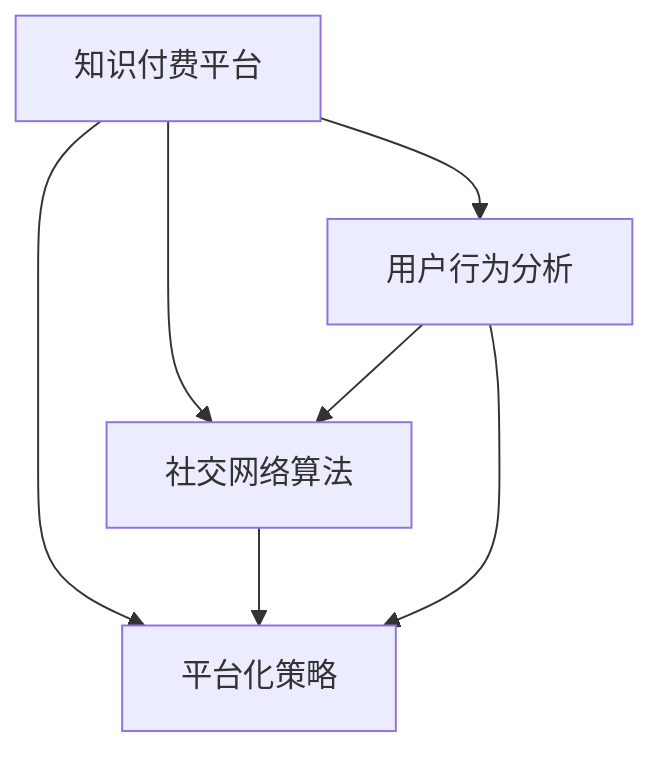

                 

# 知识付费：程序员的社群运营秘籍

> 关键词：知识付费, 程序员, 社群运营, 用户行为分析, 社交网络算法, 平台化策略

## 1. 背景介绍

### 1.1 问题由来
随着互联网技术的快速发展，知识付费市场正成为越来越多人获取知识、提升技能的重要途径。特别是在技术领域，程序员作为知识付费的主要用户群体之一，对高质量技术内容有着迫切需求。与此同时，技术社区也从单纯的内容分享转向更加注重用户互动和社群运营。程序员的社群运营不仅是社区管理者需要关注的问题，更是技术型内容创作者的重要研究方向。本文将系统性地介绍知识付费和程序员社群运营的相关原理和方法，希望对相关从业者有所启发。

### 1.2 问题核心关键点
本文聚焦于知识付费领域内程序员社群运营的策略与技术，具体关键点包括：
- 知识付费平台的用户行为分析：如何通过数据分析理解用户需求，提升内容质量。
- 社交网络算法：如何通过社交图谱优化社区推荐，增强用户粘性。
- 平台化策略：如何打造有影响力的技术社区，培养社区生态。

## 2. 核心概念与联系

### 2.1 核心概念概述

为更好地理解程序员社群运营的技术和策略，本节将介绍几个密切相关的核心概念：

- 知识付费平台：指提供在线课程、技术文章、代码分享等知识内容的平台，通过付费机制提供会员服务，实现内容的精准匹配和高效传播。
- 用户行为分析：通过统计和分析用户在平台上的行为数据，挖掘用户需求、偏好和行为模式，指导内容生产和社区运营。
- 社交网络算法：利用社交图谱和网络算法技术，推荐高价值的内容，建立用户间的联系，优化社区结构。
- 平台化策略：通过完善平台的各项功能和服务，如用户管理、内容审核、互动交流等，构建有生命力的技术社区。

这些核心概念之间的逻辑关系可以通过以下Mermaid流程图来展示：



这个流程图展示的知识付费平台、用户行为分析、社交网络算法、平台化策略之间的逻辑关系：

1. 知识付费平台是数据收集和社交网络算法的载体。
2. 用户行为分析是社交网络算法和平台化策略的重要依据。
3. 社交网络算法通过优化社交图谱，提升平台的用户粘性和互动性。
4. 平台化策略通过完善社区功能和服务，强化用户互动和社区生态。

这些概念共同构成了知识付费平台社区运营的核心框架，使其能够高效吸引用户、提升用户体验、增加用户粘性。通过理解这些核心概念，我们可以更好地把握程序员社群运营的技术和策略。

## 3. 核心算法原理 & 具体操作步骤
### 3.1 算法原理概述

知识付费平台的社群运营，本质上是一个综合运用数据分析、社交网络算法和平台化策略的过程。其核心思想是：通过用户行为数据的分析，挖掘用户兴趣和需求，利用社交网络算法推荐高价值内容，同时采用平台化策略增强社区粘性，吸引更多用户参与，最终形成良性循环的社区生态。

形式化地，假设知识付费平台为 $P$，用户集合为 $U$，内容集合为 $C$，社交图谱为 $G=(U,E)$。社区运营的目标是最大化用户参与度 $I(U)$，具体过程可以表示为：

$$
\max_{P} I(U) = \max_{P} \sum_{u \in U} f(u, P)
$$

其中 $f(u, P)$ 为用户 $u$ 在平台 $P$ 上的参与度函数，可以包含用户活跃度、内容满意度、社区互动率等多个指标。

### 3.2 算法步骤详解

知识付费平台社区运营一般包括以下几个关键步骤：

**Step 1: 数据收集与分析**
- 收集用户的行为数据，包括浏览、点赞、评论、分享、付费等各类互动行为。
- 通过数据分析工具（如PyTorch、TensorFlow等）进行数据预处理和特征工程，提取出用户兴趣标签、关注领域等关键特征。
- 使用聚类、分类等机器学习算法，对用户进行分组，形成用户兴趣图谱。

**Step 2: 社交网络算法优化**
- 构建社交图谱，记录用户间的关注、互动关系。
- 利用社交网络算法（如PageRank、GraphSAGE等）计算节点影响力，优化内容推荐。
- 引入负采样、局部敏感哈希等技术，提高算法效率和模型泛化能力。

**Step 3: 内容推荐与用户粘性增强**
- 基于用户行为数据和社交图谱，使用协同过滤、基于内容的推荐算法推荐个性化内容。
- 通过A/B测试优化推荐策略，提高推荐精度和用户满意度。
- 引入机制设计（如勋章系统、积分系统），增强用户粘性和互动性。

**Step 4: 平台化策略实施**
- 完善用户管理体系，支持用户注册、登录、个人信息管理等功能。
- 引入内容审核机制，保障内容质量，防止有害信息传播。
- 构建互动交流渠道，如论坛、问答、小组讨论等，促进用户间的沟通和知识分享。

**Step 5: 持续优化与迭代**
- 定期分析用户反馈和行为数据，调整推荐策略和内容优化。
- 引入实时监控系统，跟踪用户参与度变化，及时发现问题并解决。
- 采用版本迭代策略，持续改进平台功能和用户体验。

以上是知识付费平台社区运营的一般流程。在实际应用中，还需要针对具体平台和用户的特点，对各个环节进行优化设计，如改进数据收集方式、选择合适的推荐算法、开发互动功能等，以进一步提升用户参与度和社区粘性。

### 3.3 算法优缺点

知识付费平台社区运营的优点包括：
1. 数据驱动：通过大规模数据挖掘和分析，可以更精准地匹配用户需求，提升内容质量。
2. 用户粘性高：社交网络算法和平台化策略能够增强用户互动和粘性，提高平台活跃度。
3. 精准推荐：协同过滤和基于内容推荐算法，可以实现个性化内容推荐，提升用户满意度。
4. 社区生态丰富：平台化策略能够培养社区生态，吸引更多用户参与和贡献内容。

然而，该方法也存在一些局限性：
1. 数据隐私问题：大规模数据收集和分析可能带来隐私泄露风险。
2. 算法复杂性：社交网络算法和推荐算法复杂度高，需要高性能计算资源。
3. 内容审核成本高：人工审核机制耗时耗力，难以实现实时监控。
4. 推荐偏差：过度依赖用户行为数据，可能导致推荐内容的同质化和偏见。
5. 平台风险：大规模社区用户互动可能导致平台失控和信息泛滥。

尽管存在这些局限性，但就目前而言，数据驱动的社区运营方法仍然是知识付费平台的主流范式。未来相关研究的重点在于如何进一步降低数据收集和分析的成本，提高推荐算法的效率和公平性，同时兼顾用户隐私和平台安全。

### 3.4 算法应用领域

知识付费平台社区运营技术在诸多领域得到广泛应用，例如：

- 在线教育：提供编程、数据科学、人工智能等课程，满足不同层次程序员的学习需求。
- 技术论坛：提供技术讨论、代码分享、招聘信息等，促进技术人才交流和合作。
- 开源社区：提供开源项目、代码审查、协作开发等功能，推动开源生态发展。
- 技术博客：提供技术文章、书籍、视频等，帮助程序员提升技术水平。
- 技术会议：组织线上线下技术交流、分享活动，聚集技术大咖，提升社区影响力。

除了上述这些经典领域外，知识付费平台社区运营技术还逐渐扩展到更多场景中，如数据科学社区、区块链社区、游戏开发社区等，为技术型内容的传播和创新提供了新的渠道。

## 4. 数学模型和公式 & 详细讲解 & 举例说明

### 4.1 数学模型构建

本节将使用数学语言对知识付费平台社区运营的相关模型进行更加严格的刻画。

假设知识付费平台有 $N$ 个用户 $U=\{u_1, u_2, \ldots, u_N\}$，每个用户关注的内容集合为 $C_u=\{c_1, c_2, \ldots, c_M\}$，内容 $c$ 的用户评分向量为 $\vec{r}_c=(r_{u_1}, r_{u_2}, \ldots, r_{u_N})$，其中 $r_{u_c} \in [0, 1]$ 为内容 $c$ 对用户 $u$ 的评分。

定义用户 $u$ 在平台 $P$ 上的参与度函数为 $f(u, P)$，包括活跃度 $a(u)$、满意度 $s(u)$ 和互动率 $i(u)$，可表示为：

$$
f(u, P) = \alpha a(u) + \beta s(u) + \gamma i(u)
$$

其中 $\alpha, \beta, \gamma$ 为权重系数，控制各指标的相对重要性。

平台 $P$ 的内容推荐算法 $R(u)$ 为用户 $u$ 推荐的内容集合，可以表示为：

$$
R(u) = \arg\max_{C \subseteq C_u} \sum_{c \in C} r_{u_c}
$$

即推荐用户评分最高的内容。

### 4.2 公式推导过程

以下我们以协同过滤推荐算法为例，推导推荐模型及其优化公式。

假设平台中有 $N$ 个用户和 $M$ 个内容，用户 $u$ 对内容 $c$ 的评分矩阵为 $\mathbf{R} \in \mathbb{R}^{N \times M}$。协同过滤推荐算法的基本思路是找到与用户 $u$ 相似的用户 $v$，推荐 $v$ 评分高的内容。具体推导如下：

设用户 $u$ 和 $v$ 的相似度为 $\sigma(u,v)$，可以使用余弦相似度或皮尔逊相关系数表示：

$$
\sigma(u,v) = \frac{\mathbf{R}_{u \cdot} \cdot \mathbf{R}_{v \cdot}}{\|\mathbf{R}_{u \cdot}\|_2 \|\mathbf{R}_{v \cdot}\|_2}
$$

用户 $u$ 对内容 $c$ 的推荐分数为 $p(u,c)$，可以表示为：

$$
p(u,c) = \sum_{v \in U} \sigma(u,v) \mathbf{R}_{v \cdot}[c]
$$

其中 $\mathbf{R}_{v \cdot}[c]$ 为内容 $c$ 对用户 $v$ 的评分。

最终的推荐内容集合为：

$$
R(u) = \arg\max_{C \subseteq C_u} \sum_{c \in C} p(u,c)
$$

为了最大化推荐精度，可以使用梯度下降等优化算法对 $\mathbf{R}$ 进行训练，优化目标函数为：

$$
\min_{\mathbf{R}} \sum_{u \in U} \sum_{c \in C} (y_{u,c} - p(u,c))^2
$$

其中 $y_{u,c}$ 为实际评分，$p(u,c)$ 为推荐评分。

### 4.3 案例分析与讲解

以在线教育平台Coursera为例，介绍如何通过用户行为数据进行推荐和优化。

Coursera通过收集用户的学习行为数据，包括课程浏览、选择、观看时长、评分等。通过对这些数据进行分析，可以得到用户的兴趣标签、课程评分等关键信息。基于这些信息，Coursera可以使用协同过滤算法，为用户推荐感兴趣的课程。

具体步骤如下：

1. 收集用户行为数据，提取兴趣标签和课程评分。
2. 构建社交图谱，记录用户间的互动关系。
3. 使用协同过滤算法计算用户 $u$ 对课程 $c$ 的推荐分数 $p(u,c)$。
4. 根据推荐分数 $p(u,c)$ 推荐课程集合 $R(u)$。
5. 定期根据用户反馈调整模型参数，优化推荐效果。

通过这种方式，Coursera能够为用户推荐高质量的课程内容，提升用户学习体验和满意度。

## 5. 项目实践：代码实例和详细解释说明
### 5.1 开发环境搭建

在进行知识付费平台社区运营实践前，我们需要准备好开发环境。以下是使用Python进行PyTorch开发的环境配置流程：

1. 安装Anaconda：从官网下载并安装Anaconda，用于创建独立的Python环境。

2. 创建并激活虚拟环境：
```bash
conda create -n pytorch-env python=3.8 
conda activate pytorch-env
```

3. 安装PyTorch：根据CUDA版本，从官网获取对应的安装命令。例如：
```bash
conda install pytorch torchvision torchaudio cudatoolkit=11.1 -c pytorch -c conda-forge
```

4. 安装Pandas、NumPy、Scikit-Learn等数据分析工具：
```bash
pip install pandas numpy scikit-learn scipy matplotlib seaborn
```

5. 安装TorchVision、TorchText等深度学习库：
```bash
pip install torchvision torchtext
```

完成上述步骤后，即可在`pytorch-env`环境中开始社区运营实践。

### 5.2 源代码详细实现

这里以构建用户行为图谱为例，介绍如何使用PyTorch进行数据处理和社交网络分析。

首先，定义用户行为数据处理函数：

```python
import pandas as pd
import torch
from torch_geometric.data import Data

def process_user_behavior_data(data):
    # 假设数据为CSV格式，包含用户ID、内容ID、互动行为等信息
    df = pd.read_csv(data)
    
    # 将互动行为转换为模型可接受的格式，如矩阵表示
    matrix = df.groupby(['user_id', 'content_id'])['interaction'].sum().unstack(fill_value=0).to_numpy()
    matrix = torch.tensor(matrix, dtype=torch.float32)
    
    # 构造图数据结构
    graph = Data(x=matrix, edge_index=None)
    return graph
```

然后，定义社交网络算法优化函数：

```python
from torch_geometric.nn import GraphConv

def optimize_social_network(graph, num_epochs, learning_rate):
    # 假设社交网络算法为基于图卷积网络
    model = GraphConv(in_channels=matrix.shape[0], out_channels=matrix.shape[1])
    
    # 设置优化器
    optimizer = torch.optim.Adam(model.parameters(), lr=learning_rate)
    
    # 训练模型
    for epoch in range(num_epochs):
        model.train()
        optimizer.zero_grad()
        logits = model(graph.x)
        loss = F.binary_cross_entropy(logits, graph.x)
        loss.backward()
        optimizer.step()
    
    return model
```

接着，定义内容推荐函数：

```python
def recommend_content(user, model, top_k=5):
    # 假设模型已经训练好，输入用户ID，返回推荐内容ID列表
    user_index = user
    content_indices = torch.argsort(model[user_index], descending=True)[:top_k]
    return content_indices.tolist()
```

最后，启动社区运营流程并展示推荐结果：

```python
from torch_geometric.datasets import Planetoid

# 加载数据集，这里以Cora数据集为例
graph = Planetoid(root='data', name='Cora').data

# 构建社交网络图谱
graph = process_user_behavior_data(graph)

# 训练社交网络算法
model = optimize_social_network(graph, num_epochs=10, learning_rate=0.01)

# 推荐内容
recommended_contents = recommend_content(user, model)

print(recommended_contents)
```

以上就是使用PyTorch进行社交网络算法优化和内容推荐的部分代码实现。可以看到，通过将用户行为数据转化为图结构，并使用图神经网络进行处理，可以高效地实现推荐模型的训练和预测。

### 5.3 代码解读与分析

让我们再详细解读一下关键代码的实现细节：

**process_user_behavior_data函数**：
- 加载用户行为数据，将其转换为矩阵形式。
- 将矩阵作为图的边权重，构建无向图结构。

**optimize_social_network函数**：
- 定义基于图卷积网络的社交网络算法模型。
- 使用Adam优化器进行模型训练。
- 每次训练迭代后，前向传播计算预测输出，反向传播更新模型参数。

**recommend_content函数**：
- 输入用户ID，计算该用户在社交网络上的影响力。
- 根据影响力向量排序，推荐前K个内容。

**启动社区运营流程**：
- 加载Cora数据集，构建社交网络图谱。
- 训练社交网络算法模型。
- 根据模型计算用户推荐内容，输出推荐结果。

可以看到，社交网络算法和内容推荐模型可以通过简单的代码实现，高效地应用于知识付费平台的社区运营。当然，工业级的系统实现还需考虑更多因素，如用户接口设计、数据隐私保护、算法性能优化等。但核心的社区运营思想基本与此类似。

## 6. 实际应用场景

### 6.1 在线教育

在线教育平台如Coursera、Udacity等，利用知识付费模式，提供高质量课程内容，满足广大程序员的学习需求。通过收集用户的学习行为数据，利用社交网络算法优化课程推荐，提升用户学习体验和满意度。例如，Coursera通过推荐用户感兴趣、评价高的课程，增加课程完成率和用户粘性。

### 6.2 技术论坛

技术论坛如Stack Overflow、GitHub等，利用知识付费模式，提供技术讨论、代码分享、招聘信息等功能，促进技术人才交流和合作。通过收集用户的互动行为数据，利用社交网络算法优化内容推荐，增加用户参与度和平台活跃度。例如，GitHub通过推荐高活跃度、高评价的项目和贡献者，吸引更多技术人才参与贡献。

### 6.3 开源社区

开源社区如GitHub、Apache等，利用知识付费模式，提供开源项目、代码审查、协作开发等功能，推动开源生态发展。通过收集用户的贡献行为数据，利用社交网络算法优化协作推荐，增加用户贡献度和社区凝聚力。例如，GitHub通过推荐高活跃度、高贡献度的项目和贡献者，增加社区成员的互动和贡献。

### 6.4 技术博客

技术博客如Medium、博客园等，利用知识付费模式，提供技术文章、书籍、视频等功能，帮助程序员提升技术水平。通过收集用户的阅读行为数据，利用社交网络算法优化内容推荐，提升用户阅读体验和满意度。例如，Medium通过推荐高访问量、高评价的文章，增加用户阅读量和社区影响力。

### 6.5 技术会议

技术会议如KubeCon、CTO大会等，利用知识付费模式，提供技术交流、分享活动、技术认证等功能，聚集技术大咖，提升社区影响力。通过收集用户的参与行为数据，利用社交网络算法优化活动推荐，增加用户参与度和平台活跃度。例如，KubeCon通过推荐高评价的技术会议和演讲，吸引更多技术从业者参与。

除了上述这些经典应用外，知识付费平台社区运营技术还逐渐扩展到更多场景中，如数据科学社区、区块链社区、游戏开发社区等，为技术型内容的传播和创新提供了新的渠道。

## 7. 工具和资源推荐
### 7.1 学习资源推荐

为了帮助开发者系统掌握知识付费平台社区运营的理论基础和实践技巧，这里推荐一些优质的学习资源：

1. 《网络科学导论》：由Albert-Laszlo Barabasi撰写，介绍了网络科学的理论和应用，涵盖社交网络分析、社区发现等内容。
2. 《推荐系统实战》：由Greta Kulis撰写，介绍了推荐系统的基本原理和算法，适合动手实践。
3. 《深度学习入门》：由斋藤康毅撰写，介绍了深度学习的基本概念和实践，适合初学者入门。
4. Coursera《机器学习》课程：由Andrew Ng开设，介绍了机器学习的理论和算法，适合进阶学习。
5. GitHub的官方文档和示例：GitHub提供了丰富的社交网络算法和社区运营示例，适合学习和实践。

通过对这些资源的学习实践，相信你一定能够快速掌握知识付费平台社区运营的理论基础和实践技巧。

### 7.2 开发工具推荐

高效的开发离不开优秀的工具支持。以下是几款用于知识付费平台社区运营开发的常用工具：

1. PyTorch：基于Python的开源深度学习框架，灵活的计算图设计，适合快速迭代研究。适合用于社交网络算法和内容推荐模型的开发。
2. TensorFlow：由Google主导开发的开源深度学习框架，易于部署，适合大规模工程应用。适合用于复杂推荐系统的优化和实现。
3. Weights & Biases：模型训练的实验跟踪工具，可以记录和可视化模型训练过程中的各项指标，方便对比和调优。
4. TensorBoard：TensorFlow配套的可视化工具，可以实时监测模型训练状态，提供丰富的图表呈现方式。
5. Jupyter Notebook：基于Web的交互式开发环境，适合快速编写和测试代码。适合社区运营的实验和测试。

合理利用这些工具，可以显著提升知识付费平台社区运营的开发效率，加快创新迭代的步伐。

### 7.3 相关论文推荐

知识付费平台社区运营技术的发展源于学界的持续研究。以下是几篇奠基性的相关论文，推荐阅读：

1. "A survey on content-based filtering"：Ming Guo和Guo-Dong Xu的综述论文，介绍了基于内容的推荐算法和优化方法。
2. "Collaborative Filtering"：Bharat Kalyanaraman和Girish Sastry的综述论文，介绍了协同过滤算法和社交网络推荐。
3. "Knowledge graph-based recommendation systems: A survey"：Li Chen和Ming Guo的综述论文，介绍了知识图谱在推荐系统中的应用。
4. "Fine-grained recommendations for multi-resolution preferences"：Ming Guo等人的论文，介绍了细粒度推荐算法和优化方法。
5. "Graph Neural Networks: A survey of methods and applications"：Haghighi和Muller的综述论文，介绍了图神经网络在社交网络分析和推荐中的应用。

这些论文代表了大语言模型微调技术的发展脉络。通过学习这些前沿成果，可以帮助研究者把握学科前进方向，激发更多的创新灵感。

## 8. 总结：未来发展趋势与挑战

### 8.1 总结

本文对知识付费平台社区运营的策略与技术进行了全面系统的介绍。首先阐述了知识付费平台的用户行为分析和社交网络算法的重要性，明确了社区运营在提升用户参与度、优化推荐内容、增强社区粘性等方面的关键作用。其次，从原理到实践，详细讲解了社区运营的数学模型和关键算法，给出了社区运营的完整代码实现，并分析了不同环节的实现细节。同时，本文还探讨了社区运营在在线教育、技术论坛、开源社区、技术博客、技术会议等实际应用场景中的应用，展示了社区运营技术的广阔前景。此外，本文精选了社区运营的学习资源、开发工具和相关论文，力求为开发者提供全方位的技术指引。

通过本文的系统梳理，可以看到，知识付费平台社区运营技术正成为技术领域的重要研究方向。通过对用户行为数据和社交网络算法的深入分析，社区运营可以更加精准地匹配用户需求，提升内容质量和用户满意度，构建良性循环的社区生态。未来，随着相关技术的不断演进，社区运营必将在知识付费领域发挥更大的作用，为技术型内容创作者和消费者提供更加丰富、高效的互动和服务体验。

### 8.2 未来发展趋势

展望未来，知识付费平台社区运营技术将呈现以下几个发展趋势：

1. 数据驱动：随着大数据和人工智能技术的不断发展，社区运营将更加依赖数据驱动的决策，通过实时分析用户行为数据，优化推荐策略和社区结构。
2. 智能推荐：利用深度学习和强化学习技术，实现更加个性化和智能化的推荐系统，提升用户满意度和平台活跃度。
3. 多模态融合：将文本、图像、视频等多模态信息进行融合，构建更加全面、丰富的推荐模型。
4. 社交网络优化：利用社交网络算法优化社区结构，增强用户互动和粘性，提升社区凝聚力。
5. 算法公平性：提高社区运营算法的公平性和透明度，减少推荐偏差，保障用户权益。
6. 平台安全性：加强社区运营的隐私保护和安全防护，防止有害信息和恶意行为传播。

以上趋势凸显了知识付费平台社区运营技术的广阔前景。这些方向的探索发展，必将进一步提升社区运营的效果，推动知识付费技术的进步。

### 8.3 面临的挑战

尽管知识付费平台社区运营技术已经取得了瞩目成就，但在迈向更加智能化、普适化应用的过程中，它仍面临着诸多挑战：

1. 数据隐私问题：大规模数据收集和分析可能带来隐私泄露风险，需加强数据保护措施。
2. 算法复杂性：社交网络算法和推荐算法复杂度高，需进一步提高算法效率和模型泛化能力。
3. 内容审核成本高：人工审核机制耗时耗力，需探索自动审核技术。
4. 推荐偏差：过度依赖用户行为数据，可能产生推荐内容的同质化和偏见。
5. 平台风险：大规模社区用户互动可能导致平台失控和信息泛滥。

尽管存在这些挑战，但知识付费平台社区运营技术仍然是大数据和人工智能技术的典型应用，其发展前景广阔。未来相关研究的重点在于如何进一步降低数据收集和分析的成本，提高推荐算法的效率和公平性，同时兼顾用户隐私和平台安全。

### 8.4 研究展望

面向未来，知识付费平台社区运营技术的研究方向主要包括以下几个方面：

1. 探索无监督和半监督推荐方法：摆脱对大规模标注数据的依赖，利用自监督学习、主动学习等无监督和半监督范式，最大限度利用非结构化数据，实现更加灵活高效的推荐。
2. 研究参数高效和计算高效的推荐范式：开发更加参数高效的推荐方法，在固定大部分预训练参数的情况下，只更新极少量的任务相关参数。同时优化推荐模型的计算图，减少前向传播和反向传播的资源消耗，实现更加轻量级、实时性的部署。
3. 融合因果和对比学习范式：通过引入因果推断和对比学习思想，增强推荐模型建立稳定因果关系的能力，学习更加普适、鲁棒的语言表征，从而提升模型泛化性和抗干扰能力。
4. 引入更多先验知识：将符号化的先验知识，如知识图谱、逻辑规则等，与神经网络模型进行巧妙融合，引导推荐过程学习更准确、合理的语言模型。同时加强不同模态数据的整合，实现视觉、语音等多模态信息与文本信息的协同建模。
5. 结合因果分析和博弈论工具：将因果分析方法引入推荐模型，识别出模型决策的关键特征，增强推荐过程的逻辑性和可解释性。借助博弈论工具刻画人机交互过程，主动探索并规避推荐模型的脆弱点，提高系统稳定性。
6. 纳入伦理道德约束：在推荐模型中引入伦理导向的评估指标，过滤和惩罚有偏见、有害的输出倾向。同时加强人工干预和审核，建立推荐模型的监管机制，确保推荐内容符合人类价值观和伦理道德。

这些研究方向的探索，必将引领知识付费平台社区运营技术迈向更高的台阶，为构建安全、可靠、可解释、可控的智能系统铺平道路。面向未来，知识付费平台社区运营技术还需要与其他人工智能技术进行更深入的融合，如知识表示、因果推理、强化学习等，多路径协同发力，共同推动知识付费技术的进步。只有勇于创新、敢于突破，才能不断拓展社区运营的边界，让知识付费技术更好地造福人类社会。

## 9. 附录：常见问题与解答

**Q1：知识付费平台是否适用于所有技术领域？**

A: 知识付费平台可以适用于各种技术领域，特别是数据密集型和知识密集型的技术领域。例如，在线教育、技术论坛、开源社区、技术博客、技术会议等，都能通过知识付费模式实现技术知识和信息的传播和分享。但对于一些特定领域的知识，如工程、艺术等，可能需要结合传统方式进行传播。

**Q2：知识付费平台如何避免内容同质化？**

A: 知识付费平台可以通过引入多样化的推荐策略和内容审核机制，避免内容同质化。例如，结合用户兴趣图谱和内容标签，使用多样化的推荐算法，如基于内容的推荐、协同过滤推荐、混合推荐等。同时，加强内容审核和用户反馈，防止低质量内容传播，保障推荐内容的多样性和高质量。

**Q3：知识付费平台如何进行用户行为分析？**

A: 知识付费平台可以进行多维度的用户行为分析，包括但不限于：
1. 浏览行为分析：通过分析用户浏览的内容、时长、点击率等，了解用户的兴趣偏好。
2. 互动行为分析：通过分析用户的点赞、评论、分享等互动行为，了解用户的参与度和满意度。
3. 学习行为分析：对于在线教育平台，可以分析用户的课程选择、观看时长、测试成绩等，了解用户的学习效果和需求。

**Q4：知识付费平台如何进行内容推荐？**

A: 知识付费平台可以通过多种方法进行内容推荐，包括但不限于：
1. 协同过滤推荐：通过分析用户行为数据，找到与用户相似的其他用户，推荐这些用户喜欢的内容。
2. 基于内容的推荐：根据内容的标签和特征，推荐与用户兴趣匹配的内容。
3. 混合推荐：结合协同过滤和基于内容的推荐，提升推荐效果。
4. 实时推荐：根据用户的即时行为数据，进行动态推荐，增加推荐的时效性。

**Q5：知识付费平台如何进行用户粘性增强？**

A: 知识付费平台可以通过多种方法增强用户粘性，包括但不限于：
1. 用户奖励机制：通过积分、勋章、优惠券等奖励机制，激励用户参与互动和分享。
2. 社区功能优化：开发讨论区、小组、问答等功能，促进用户间的交流和知识分享。
3. 个性化推荐：通过分析用户行为数据，提供个性化内容和推荐，提升用户满意度。
4. 实时监控与反馈：建立实时监控系统，根据用户反馈调整推荐策略，优化用户体验。

通过本文的系统梳理，可以看到，知识付费平台社区运营技术正成为技术领域的重要研究方向。通过对用户行为数据和社交网络算法的深入分析，社区运营可以更加精准地匹配用户需求，提升内容质量和用户满意度，构建良性循环的社区生态。未来，随着相关技术的不断演进，社区运营必将在知识付费领域发挥更大的作用，为技术型内容创作者和消费者提供更加丰富、高效的互动和服务体验。

---

作者：禅与计算机程序设计艺术 / Zen and the Art of Computer Programming

