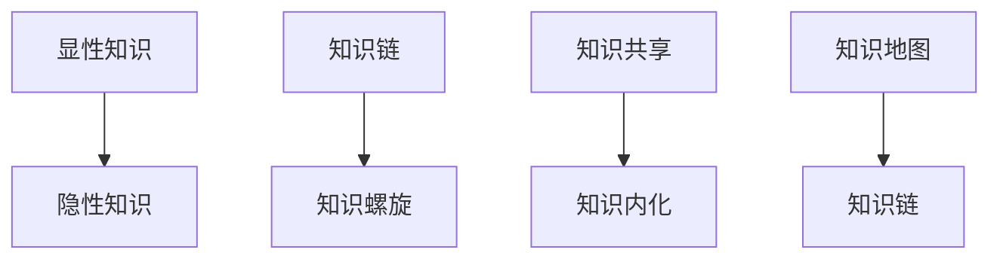

                 

# 知识分享在团队中的重要性

> 关键词：知识管理,团队协作,知识传递,员工发展,组织学习

## 1. 背景介绍

### 1.1 问题由来
在当今信息爆炸的数字化时代，知识分享已成为企业竞争力的重要组成部分。知识的产生与传播速度之快，已经远远超越了传统组织学习的速度。

企业在知识分享方面存在诸多挑战：
- **知识孤岛**：各部门和岗位之间的知识壁垒，使得知识难以在组织内自由流通。
- **知识遗漏**：员工离职、岗位变动等人员流动，导致知识随着人员一起流失。
- **知识传递障碍**：高技能员工忙于日常工作，难以抽出时间进行系统化知识传递。
- **知识共享意愿不足**：员工可能担心分享知识会暴露自身优势，或担心他人利用知识。

因此，如何有效利用知识分享，提升团队整体知识水平，成为现代企业面临的重要课题。

### 1.2 问题核心关键点
- **知识管理(Knowledge Management)**：指通过有组织的方式，收集、存储、检索、共享和应用知识的过程。
- **团队协作(Collaboration)**：指团队成员共同完成任务，共享资源，相互配合的过程。
- **知识传递(Knowledge Transfer)**：指将知识从一个个体或团队传递到另一个个体或团队的过程。
- **员工发展(Employee Development)**：指员工通过持续学习、技能提升，适应组织发展需求的过程。
- **组织学习(Organizational Learning)**：指组织通过不断积累和应用知识，提升整体竞争力的过程。

通过系统化的知识分享机制，可以有效解决上述问题，提升团队整体知识水平，进而增强企业竞争力。

## 2. 核心概念与联系

### 2.1 核心概念概述

知识分享是一个多维度、多层次的复杂过程，需要深入理解其核心概念和关键机制：

- **显性知识**与**隐性知识**：显性知识可以通过语言、文字等方式表达，易于共享；隐性知识难以言传，需通过实践和交流获得。
- **知识链**：知识的产生、传递、应用和创新，形成了一个完整的链条。每个环节都影响知识的效果。
- **知识共享**与**知识内化**：知识共享是指将知识从分享者传递到接收者的过程；知识内化是指接收者将知识转化为自身能力的过程。
- **知识螺旋**：通过持续的知识传递和内化，组织知识不断迭代提升，形成螺旋上升的态势。
- **知识地图**：通过知识地图，将组织知识结构化，便于检索和应用。

这些核心概念之间通过下图的Mermaid流程图进行联系和展示：



这个流程图展示了大语言模型微调的多个核心概念及其相互联系。

## 3. 核心算法原理 & 具体操作步骤

### 3.1 算法原理概述

知识分享的过程，可以抽象为一种算法，其原理包括以下几个关键点：

1. **知识收集与存储**：通过组织内部系统（如知识库、内部论坛）收集和存储各类知识。
2. **知识检索与匹配**：根据知识请求，通过检索系统匹配相关信息。
3. **知识分享与传递**：通过组织内外部通信工具（如邮件、即时通讯工具），将知识传递给需求方。
4. **知识应用与反馈**：将共享知识应用到实际工作中，并通过反馈机制不断优化。

通过这一算法，知识可以在组织内部自由流动，提升整体知识水平和业务效率。

### 3.2 算法步骤详解

知识分享的具体操作步骤分为以下五个阶段：

**Step 1: 知识收集与整理**
- 创建知识收集渠道：如内部论坛、知识库、协作工具等。
- 确定知识分类标准：将知识按业务、技术、流程等维度分类。
- 整理知识条目：将散落在员工、项目文件中的知识收集并整理。

**Step 2: 知识存储与索引**
- 建立知识存储系统：如使用Confluence、SharePoint等。
- 创建知识条目模板：设定知识标题、摘要、标签、版本等。
- 建立知识索引：通过关键字、标签等，便于快速检索。

**Step 3: 知识传播与推广**
- 设定知识分享机制：如定期分享、重大成果分享等。
- 鼓励知识分享行为：通过激励机制，鼓励员工积极分享知识。
- 运用社交网络：利用公司内部社交平台，如Slack、Microsoft Teams，推广知识分享。

**Step 4: 知识应用与反馈**
- 应用知识于实践：在项目实施、业务流程中，使用共享知识。
- 收集反馈信息：通过问卷调查、项目复盘等方式，收集知识应用效果。
- 持续优化改进：根据反馈信息，优化知识收集、存储、分享流程。

**Step 5: 知识复盘与更新**
- 定期知识复盘：组织知识回顾会议，总结应用效果。
- 更新知识库：根据业务变化和知识更新，定期更新知识库内容。
- 知识传承与培养：通过内部培训、导师制度，培养知识传承人。

### 3.3 算法优缺点

知识分享算法具有以下优点：
- **提升效率**：知识传递可快速提升员工业务能力，减少重复劳动。
- **促进协作**：知识共享有利于团队协作，减少沟通成本。
- **固化经验**：将经验知识标准化，易于管理和传承。
- **创新驱动**：通过知识的累积和交流，促进组织创新。

但同时，也存在一些缺点：
- **资源投入**：建立和维护知识分享系统需要大量资源。
- **知识质量参差不齐**：质量不高的知识反而可能误导他人。
- **共享意愿不足**：部分员工对知识分享持保留态度。
- **知识更新滞后**：知识库内容需要定期更新，维护工作量大。

### 3.4 算法应用领域

知识分享算法在各行各业都有广泛应用，如：

- **IT行业**：软件开发、项目管理、技术支持等，通过知识库、内部论坛等方式共享技术知识。
- **医疗行业**：病历记录、临床路径、治疗方案等，通过知识管理系统提升医疗质量。
- **教育行业**：教学资源、学习资料、研究成果等，通过知识库、论文管理系统共享教育资源。
- **制造业**：生产工艺、设备维护、质量控制等，通过知识库、内部培训系统传递工艺知识。
- **金融行业**：市场分析、风险评估、投资策略等，通过知识管理系统共享金融情报。
- **政府机构**：政策解读、项目规划、数据统计等，通过内部知识平台推动政务信息化。

这些领域都利用知识分享算法，提升工作效率，促进组织学习，实现知识传递和应用。

## 4. 数学模型和公式 & 详细讲解

### 4.1 数学模型构建

知识分享过程可抽象为多个变量间的动态关系，建立一个数学模型进行描述。

设知识库中有 $N$ 个知识点，每个知识点 $i$ 的**质量** $Q_i$、**可用性** $A_i$、**更新频率** $U_i$、**影响力** $I_i$，初始化知识 $K_i^0$，第 $t$ 次知识更新后知识库总质量 $K^t$ 和知识库总数量 $N^t$。

知识共享的数学模型为：

$$
K^t = \sum_{i=1}^N K_i^t = \sum_{i=1}^N (Q_i \times A_i \times U_i \times I_i \times K_i^{t-1})
$$

$$
N^t = \sum_{i=1}^N N_i^t = N
$$

### 4.2 公式推导过程

知识质量 $Q_i$ 反映了知识点对业务的价值，可用性 $A_i$ 表示知识点在实际应用中的频率，更新频率 $U_i$ 表示知识点更新的频繁程度，影响力 $I_i$ 表示知识点对其他知识点的辐射能力。

知识库总质量 $K^t$ 为所有知识点的质量和更新次数的乘积之和。

通过知识质量、可用性、更新频率和影响力的乘积，计算每次更新后的知识质量，并累加得到知识库总质量。知识库总数量 $N^t$ 保持不变，表示知识库的知识条目个数。

### 4.3 案例分析与讲解

某公司知识库中包含以下知识点：
- 知识点 1：项目管理方法（质量 $Q_1=8$、可用性 $A_1=0.7$、更新频率 $U_1=0.2$、影响力 $I_1=0.3$）
- 知识点 2：代码审计工具（质量 $Q_2=6$、可用性 $A_2=0.9$、更新频率 $U_2=0.3$、影响力 $I_2=0.5$）
- 知识点 3：团队协作技巧（质量 $Q_3=9$、可用性 $A_3=0.6$、更新频率 $U_3=0.4$、影响力 $I_3=0.2$）

假设公司每月对知识库进行一次更新，初始化知识为 $K_i^0=1$。

第一次更新后：
- 知识点 1 更新后质量为 $Q_1 \times A_1 \times U_1 \times I_1 = 8 \times 0.7 \times 0.2 \times 0.3 = 2.16$
- 知识点 2 更新后质量为 $Q_2 \times A_2 \times U_2 \times I_2 = 6 \times 0.9 \times 0.3 \times 0.5 = 8.1$
- 知识点 3 更新后质量为 $Q_3 \times A_3 \times U_3 \times I_3 = 9 \times 0.6 \times 0.4 \times 0.2 = 2.88$

知识库总质量为：
$$
K^1 = 2.16 + 8.1 + 2.88 = 13.14
$$

知识库总数量为：
$$
N^1 = 3
$$

### 5. 项目实践：代码实例和详细解释说明

### 5.1 开发环境搭建

在Python环境下，使用Django框架搭建知识分享系统：

1. 安装Django：
```bash
pip install django
```

2. 创建项目和应用：
```bash
django-admin startproject knowledge-sharing
cd knowledge-sharing
python manage.py startapp knowledgebase
```

3. 设置数据库：
```bash
vi settings.py
```

4. 配置数据库连接信息：
```python
DATABASES = {
    'default': {
        'ENGINE': 'django.db.backends.sqlite3',
        'NAME': BASE_DIR / 'db.sqlite3',
    }
}
```

5. 创建知识库模型：
```python
from django.db import models
from django.contrib.auth.models import User

class Knowledge(models.Model):
    title = models.CharField(max_length=200)
    content = models.TextField()
    tags = models.CharField(max_length=100)
    author = models.ForeignKey(User, on_delete=models.CASCADE)
    created_at = models.DateTimeField(auto_now_add=True)
    updated_at = models.DateTimeField(auto_now=True)

    def __str__(self):
        return self.title
```

6. 创建知识库表单：
```python
from django import forms

class KnowledgeForm(forms.ModelForm):
    class Meta:
        model = Knowledge
        fields = ['title', 'content', 'tags']
```

7. 创建视图函数：
```python
from django.shortcuts import render, redirect
from .models import Knowledge
from .forms import KnowledgeForm

def knowledge_index(request):
    if request.method == 'POST':
        form = KnowledgeForm(request.POST)
        if form.is_valid():
            knowledge = form.save(commit=False)
            knowledge.author = request.user
            knowledge.save()
            return redirect('knowledge_index')
    else:
        form = KnowledgeForm()
    return render(request, 'knowledge/index.html', {'form': form})

def knowledge_detail(request, pk):
    knowledge = get_object_or_404(Knowledge, pk=pk)
    return render(request, 'knowledge/detail.html', {'knowledge': knowledge})
```

8. 创建模板：
```html
<!-- knowledge/index.html -->
<h1>知识分享平台</h1>
<form method="post">
    
    {{ form.as_p }}
    <button type="submit">提交</button>
</form>

<!-- knowledge/detail.html -->
<h1>{{ knowledge.title }}</h1>
<p>{{ knowledge.content }}</p>
```

完成以上步骤，即可在本地运行知识分享系统。

### 5.2 源代码详细实现

以下是Django框架下知识库的详细实现：

**知识库模型**：
```python
from django.db import models
from django.contrib.auth.models import User

class Knowledge(models.Model):
    title = models.CharField(max_length=200)
    content = models.TextField()
    tags = models.CharField(max_length=100)
    author = models.ForeignKey(User, on_delete=models.CASCADE)
    created_at = models.DateTimeField(auto_now_add=True)
    updated_at = models.DateTimeField(auto_now=True)

    def __str__(self):
        return self.title
```

**知识库表单**：
```python
from django import forms

class KnowledgeForm(forms.ModelForm):
    class Meta:
        model = Knowledge
        fields = ['title', 'content', 'tags']
```

**视图函数**：
```python
from django.shortcuts import render, redirect
from .models import Knowledge
from .forms import KnowledgeForm

def knowledge_index(request):
    if request.method == 'POST':
        form = KnowledgeForm(request.POST)
        if form.is_valid():
            knowledge = form.save(commit=False)
            knowledge.author = request.user
            knowledge.save()
            return redirect('knowledge_index')
    else:
        form = KnowledgeForm()
    return render(request, 'knowledge/index.html', {'form': form})

def knowledge_detail(request, pk):
    knowledge = get_object_or_404(Knowledge, pk=pk)
    return render(request, 'knowledge/detail.html', {'knowledge': knowledge})
```

**模板文件**：
```html
<!-- knowledge/index.html -->
<h1>知识分享平台</h1>
<form method="post">
    
    {{ form.as_p }}
    <button type="submit">提交</button>
</form>

<!-- knowledge/detail.html -->
<h1>{{ knowledge.title }}</h1>
<p>{{ knowledge.content }}</p>
```

通过上述代码，实现了知识库的基本功能：

1. 用户注册登录：使用Django自带的`User`模型。
2. 知识库创建：通过表单提交知识条目，保存到数据库。
3. 知识库浏览：展示所有知识条目，用户可以查看详情。

### 5.3 代码解读与分析

**知识库模型**：
- `title`：知识条目的标题，用于展示。
- `content`：知识条目的内容，可以包含详细的描述。
- `tags`：知识条目的标签，便于检索和分类。
- `author`：知识条目的作者，通过`author_id`关联到`User`模型。
- `created_at`：知识条目的创建时间，用于排序和更新。
- `updated_at`：知识条目的最后更新时间，用于更新频率的计算。

**知识库表单**：
- `form`：使用Django的表单库，自定义表单字段，便于数据的提交和验证。

**视图函数**：
- `knowledge_index`：展示所有知识条目，允许用户提交新知识。
- `knowledge_detail`：展示单个知识条目的详情。

**模板文件**：
- `knowledge/index.html`：展示所有知识条目，允许用户提交新知识。
- `knowledge/detail.html`：展示单个知识条目的详情。

通过上述实现，用户可以方便地创建、浏览、编辑知识条目，实现知识在组织内的自由流动。

### 5.4 运行结果展示

通过运行上述代码，可以在本地启动知识分享系统，展示所有知识条目，允许用户提交新知识。以下是系统运行结果示例：

- 知识条目列表：
```html
<h1>知识分享平台</h1>
<form method="post">
    
    {{ form.as_p }}
    <button type="submit">提交</button>
</form>
```

- 知识条目详情：
```html
<h1>项目管理方法</h1>
<p>这是一篇关于项目管理方法的知识条目，介绍如何使用敏捷、Scrum等方法提升项目管理效率。</p>
```

通过展示系统运行结果，可以看到知识分享平台的基本功能和效果。

## 6. 实际应用场景

### 6.1 智能客服系统

智能客服系统利用知识分享机制，将常见的客户问题、处理流程、解决方案等知识共享给客服人员，提高服务效率和质量。

具体应用如下：
- 知识库存储客服常见问题和解决方案。
- 客服人员通过知识库快速查找答案，减少重复劳动。
- 定期更新知识库，确保信息准确及时。
- 利用数据分析，识别客户常见问题，优化知识库内容。

### 6.2 医疗行业知识管理

医疗行业知识管理通过知识分享，提升医生、护士的知识水平和诊疗能力。

具体应用如下：
- 知识库存储医疗指南、临床路径、病历记录等知识。
- 医生通过知识库查找相关指南，辅助诊断和治疗。
- 定期更新知识库，引入最新医学研究成果。
- 利用知识库进行医疗质量评估和持续改进。

### 6.3 教育行业知识共享

教育行业知识共享通过知识分享，促进教师、学生之间的知识交流和学习。

具体应用如下：
- 知识库存储教学资源、习题解答、研究成果等。
- 教师通过知识库查找教学资源，优化教学内容。
- 学生通过知识库获取学习资料，提高学习效率。
- 定期更新知识库，引入最新教育研究成果。

### 6.4 未来应用展望

随着知识分享机制的普及和深入应用，未来知识管理将更加智能化和自动化：

1. **智能推荐**：通过算法推荐用户最相关的知识内容，提升知识获取效率。
2. **知识图谱**：构建知识图谱，展示知识之间的关联关系，便于理解和应用。
3. **实时更新**：利用大数据和机器学习技术，实现知识库的实时更新和优化。
4. **知识重构**：根据业务变化和知识更新，重新组织和整理知识结构。
5. **社区协作**：利用社交网络，构建知识分享社区，促进知识交流和创新。

这些技术的发展，将使知识分享更加高效、便捷、智能化，进一步提升组织学习和知识管理的水平。

## 7. 工具和资源推荐

### 7.1 学习资源推荐

为了帮助开发者深入理解知识分享机制，这里推荐一些优质的学习资源：

1. **《知识管理的艺术与科学》**：Eric Genton 和 Clive M. Pettit 合著，系统介绍知识管理的理论和实践。
2. **Coursera《知识管理系统》课程**：由Khan Academy 提供，介绍知识管理系统的构建和管理。
3. **Confluence用户手册**：Atlassian 官方文档，详细介绍Confluence知识管理系统的使用。
4. **Django官方文档**：Django 社区维护的官方文档，提供全面的 Django 开发指南和示例代码。
5. **Apache Lucene**：全球领先的搜索引擎库，支持全文检索和知识管理。

这些资源可以帮助开发者深入理解知识分享机制，并应用于实际开发中。

### 7.2 开发工具推荐

知识分享系统开发过程中，以下工具可以显著提升开发效率：

1. **Django**：基于Python的开源Web框架，简单易用，适合快速开发知识分享系统。
2. **Confluence**：Atlassian 的知识管理工具，支持文档编辑、权限管理、版本控制等功能。
3. **JIRA**：Atlassian 的项目管理工具，支持任务分配、进度跟踪、问题管理等功能。
4. **GitLab**：基于Git的代码托管平台，支持项目管理、代码审查、持续集成等功能。
5. **Slack**：企业级即时通讯工具，支持团队协作、知识分享、消息推送等功能。

这些工具结合使用，可以构建一个高效的知识分享和管理系统。

### 7.3 相关论文推荐

知识分享领域的研究已经取得丰硕成果，以下是几篇具有代表性的论文：

1. **《知识管理的理论和实践》**：由Nancy A. Zander 和 William H. Kuhlman 合著，全面综述知识管理的理论和方法。
2. **《知识共享与组织绩效》**：由Xinyun Liu 和 Dongsheng Sun 合著，探讨知识共享对组织绩效的影响。
3. **《知识共享策略与组织学习》**：由Thomas M. Pedersen 和 Mary F. V. Walker 合著，研究知识共享策略对组织学习的影响。
4. **《知识管理系统与企业绩效》**：由Sunny Tan 和 Wen Ge 合著，研究知识管理系统对企业绩效的影响。
5. **《基于云计算的知识管理系统》**：由Guoqing Wang 和 Guanrong Chen 合著，介绍基于云计算的知识管理系统架构和实现。

这些论文为知识管理的研究和应用提供了丰富的理论基础和技术指导。

## 8. 总结：未来发展趋势与挑战

### 8.1 研究成果总结

知识分享机制在提升组织知识水平、促进协作和创新方面取得了显著成效。知识分享系统已经成为企业竞争力的重要组成部分。

### 8.2 未来发展趋势

未来知识分享将呈现以下几个发展趋势：

1. **智能化和自动化**：通过人工智能和大数据技术，实现知识共享的智能化和自动化。
2. **社区协作**：利用社交网络，构建知识共享社区，促进知识交流和创新。
3. **实时更新**：利用大数据和机器学习技术，实现知识库的实时更新和优化。
4. **知识图谱**：构建知识图谱，展示知识之间的关联关系，便于理解和应用。
5. **多渠道融合**：结合文档、视频、音频等多种知识形式，实现多渠道的知识共享。
6. **知识创新**：通过知识螺旋和创新模型，推动组织知识创新和应用。

### 8.3 面临的挑战

尽管知识分享机制已经取得了显著成效，但仍面临以下挑战：

1. **知识质量控制**：如何保证知识库中知识的准确性和权威性。
2. **知识更新速度**：如何快速响应知识的变化和更新。
3. **知识共享意愿**：如何激发员工的知识共享意愿，克服知识孤岛现象。
4. **知识安全与隐私**：如何保护知识的安全与隐私，防止知识泄露和滥用。
5. **知识重构难度**：如何在知识变化和重构时，保证知识的连贯性和可继承性。

### 8.4 研究展望

知识分享机制的未来发展，需要从以下几个方面进行深入研究：

1. **知识质量控制机制**：研究知识质量的标准和评估方法，建立知识审核和验证机制。
2. **实时更新技术**：研究知识更新的算法和策略，实现知识库的实时更新和优化。
3. **激励机制设计**：设计合理的知识共享激励机制，激发员工的共享意愿。
4. **安全与隐私保护**：研究知识共享的安全与隐私保护技术，确保知识安全。
5. **知识重构方法**：研究知识重构的算法和方法，保持知识的连贯性和可继承性。

通过以上研究，知识分享机制将更加高效、智能和可靠，为组织学习和知识管理提供更强大的技术支撑。

## 9. 附录：常见问题与解答

**Q1：知识共享如何激发员工的积极性？**

A: 可以采用以下措施：
- 建立知识共享机制，鼓励员工分享知识和经验。
- 提供知识分享奖励，如晋升、奖金、证书等。
- 设立知识分享指标，与员工绩效挂钩。
- 培训员工，提升知识共享意识和技能。

**Q2：知识共享如何确保知识质量？**

A: 可以采用以下措施：
- 设立知识审核机制，对提交的知识进行审核。
- 建立知识质量标准，定义知识的准确性和权威性。
- 引入第三方专家评审，提升知识的可信度。
- 定期评估知识质量，更新知识库内容。

**Q3：知识共享如何保护知识安全与隐私？**

A: 可以采用以下措施：
- 对知识进行权限控制，限制知识的访问范围。
- 采用加密技术，保护知识的安全和隐私。
- 设立知识使用规范，避免知识的滥用。
- 定期监控知识使用情况，及时发现和处理问题。

**Q4：知识共享如何提高知识更新速度？**

A: 可以采用以下措施：
- 引入实时更新机制，如自动化抽取和更新知识。
- 设立知识更新团队，负责定期更新知识库。
- 引入机器学习算法，预测知识更新趋势，提前准备更新内容。
- 建立知识版本管理，记录知识更新历史，便于追踪和回溯。

**Q5：知识共享如何应对知识重构？**

A: 可以采用以下措施：
- 建立知识重构机制，定义知识的版本和继承关系。
- 引入知识重构算法，自动处理知识变化。
- 设立知识重构团队，负责知识重构和维护。
- 定期评估知识重构效果，确保知识的连贯性和可继承性。

通过以上问题的解答，可以看到知识分享机制在实际应用中需要注意的关键点。只有在这些关键点上下功夫，才能真正实现知识共享的效果，提升组织的知识水平和竞争力。

---

作者：禅与计算机程序设计艺术 / Zen and the Art of Computer Programming

