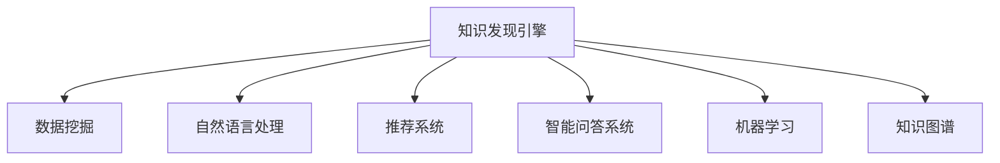

                 

# 知识发现引擎助力程序员快速成长

## 1. 背景介绍

### 1.1 问题由来

在快速发展的信息技术时代，程序员面对不断更新的技术栈和复杂的业务需求，需要不断学习和适应。然而，传统的信息获取方式效率低下，且缺乏针对性，难以帮助程序员快速掌握新技术、解决新问题。

为了解决这一痛点，知识发现引擎(Knowledge Discovery Engine, KDE)应运而生。它利用数据挖掘、机器学习和自然语言处理等技术，自动从海量代码库、文档、社区讨论中挖掘出有价值的知识，为程序员提供精准、实时的技术支持。

### 1.2 问题核心关键点

知识发现引擎的核心目标是帮助程序员快速获取所需知识，解决实际问题。这涉及到以下几个关键点：

1. **知识抽取与表示**：从大量无结构化数据中自动抽取关键技术信息，转化为易于理解和利用的知识表示。
2. **个性化推荐**：根据程序员的技术栈、兴趣和需求，推荐最相关的知识和资源。
3. **智能问答**：通过自然语言理解和生成技术，构建问答系统，解答程序员的常见问题。
4. **行为分析与优化**：利用机器学习模型，分析程序员的行为模式，提供定制化的学习路径和资源推荐。
5. **社区互动**：建立开放、协作的程序员社区，通过社交网络和知识图谱促进知识共享和传播。

这些关键点共同构成了知识发现引擎的核心能力，使其能够有效辅助程序员快速成长，提升工作效率。

## 2. 核心概念与联系

### 2.1 核心概念概述

为更好地理解知识发现引擎的构建和应用，本节将介绍几个密切相关的核心概念：

- **知识发现(Knowledge Discovery)**：从原始数据中挖掘出有价值的信息和知识的过程。知识发现引擎正是利用这一技术，从编程社区、代码库等数据源中提取知识。

- **数据挖掘(Data Mining)**：在大型数据集中使用算法，发现有价值的模式和知识。数据挖掘是知识发现的重要组成部分。

- **自然语言处理(Natural Language Processing, NLP)**：使计算机能够理解、处理和生成人类语言的技术。知识发现引擎通常需要借助NLP技术进行文本分析和语义理解。

- **推荐系统(Recommendation System)**：通过分析用户行为，推荐用户可能感兴趣的信息或产品。知识发现引擎利用推荐系统为用户推荐相关知识。

- **智能问答系统(Chatbot, QA System)**：通过自然语言理解和生成技术，构建自动化的问答系统。知识发现引擎可集成智能问答系统，回答程序员的技术疑问。

- **机器学习(Machine Learning, ML)**：使用算法和统计模型，让计算机从数据中学习并做出预测或决策。知识发现引擎利用机器学习模型分析程序员行为，进行个性化推荐。

- **知识图谱(Knowledge Graph)**：通过节点和边构建知识网络，表示实体之间的复杂关系。知识发现引擎可借助知识图谱构建程序员社区，促进知识传播。

这些核心概念之间的逻辑关系可以通过以下Mermaid流程图来展示：



这个流程图展示了一些核心概念及其之间的关系：

1. 知识发现引擎通过数据挖掘获取原始数据，借助自然语言处理技术进行文本分析，利用推荐系统进行个性化推荐，集成智能问答系统解答问题。
2. 同时，知识发现引擎使用机器学习模型进行行为分析，构建知识图谱促进社区互动。

这些概念共同构成了知识发现引擎的完整架构，使其能够全面支持程序员的学习和成长。

## 3. 核心算法原理 & 具体操作步骤
### 3.1 算法原理概述

知识发现引擎利用数据挖掘和机器学习等技术，从编程社区、代码库等数据源中自动抽取知识，并通过推荐系统、智能问答系统等提供实时技术支持。其核心算法原理如下：

1. **数据预处理**：对原始数据进行清洗、归一化、特征提取等处理，准备进行后续分析。

2. **特征提取与选择**：从数据中提取关键特征，并使用特征选择技术，筛选出与程序员需求最相关的特征。

3. **知识抽取与表示**：利用自然语言处理技术，从代码注释、技术文档、社区讨论等文本数据中抽取技术信息，转化为结构化知识表示。

4. **推荐算法**：设计推荐算法，根据程序员的技术栈、历史行为等数据，推荐最相关的知识和资源。

5. **智能问答模型**：构建自然语言理解与生成模型，实现对程序员问题的智能解答。

6. **行为分析与优化**：利用机器学习模型，分析程序员的行为模式，提供个性化的学习路径和资源推荐。

7. **社区互动模型**：使用社交网络和知识图谱技术，促进程序员之间的知识共享和传播。

### 3.2 算法步骤详解

以下是知识发现引擎的详细算法步骤：

**Step 1: 数据收集与预处理**

- 从编程社区、代码库、技术文档等数据源中收集数据。
- 对数据进行清洗、归一化和特征提取，去除噪声和无关信息。

**Step 2: 特征抽取与选择**

- 使用TF-IDF、Word2Vec等技术从文本中抽取特征。
- 通过特征选择算法（如LASSO、随机森林等）筛选出最有用的特征。

**Step 3: 知识抽取与表示**

- 利用自然语言处理技术，从代码注释、文档、讨论中抽取技术关键词和短语。
- 将抽取出的信息转化为结构化知识表示，如ontology、knowledge base等。

**Step 4: 推荐算法设计**

- 设计推荐算法，如协同过滤、内容过滤、混合推荐等。
- 根据程序员的技术栈、历史行为等数据，生成个性化推荐列表。

**Step 5: 智能问答模型构建**

- 构建自然语言理解与生成模型，如BERT、GPT等。
- 训练模型，使其能够理解程序员的问题，并生成相关回答。

**Step 6: 行为分析与优化**

- 设计行为分析模型，如决策树、随机森林等。
- 分析程序员的学习路径和行为模式，提供个性化的学习建议。

**Step 7: 社区互动模型设计**

- 使用社交网络和知识图谱技术，构建程序员社区。
- 设计社区互动模型，促进知识共享和传播。

**Step 8: 系统集成与部署**

- 将各个模块集成到统一的系统中，提供API接口。
- 部署到服务器，提供Web界面和移动端应用。

### 3.3 算法优缺点

知识发现引擎具有以下优点：

1. **高效性**：自动从大量数据中抽取知识，无需人工干预，快速响应用户需求。
2. **个性化**：根据程序员的技术栈和历史行为，提供个性化推荐，提高学习效率。
3. **实时性**：通过实时分析和推荐，帮助程序员快速解决问题，提升工作效率。
4. **易用性**：系统集成智能问答和社区互动功能，提供直观易用的界面。

然而，知识发现引擎也存在一些局限性：

1. **数据质量依赖**：抽取的知识质量受限于数据源的质量和完整性。
2. **推荐算法复杂**：推荐算法设计复杂，需要大量的特征工程和模型调参。
3. **知识表示不完善**：现有的知识表示方法难以完全捕捉技术信息的复杂性。
4. **社区互动挑战**：社区互动需要投入大量时间和资源进行维护和管理。
5. **隐私与安全风险**：知识发现涉及大量的个人数据，需严格保护用户隐私。

尽管存在这些局限性，但知识发现引擎为程序员提供了强大的技术支持和知识共享平台，其在实际应用中得到了广泛认可，成为程序员快速成长的重要工具。

### 3.4 算法应用领域

知识发现引擎在多个领域得到了广泛应用，以下是几个典型场景：

1. **软件开发与测试**：自动抽取代码注释、单元测试等信息，推荐相关文档和解决方案，提升开发效率和代码质量。

2. **技术培训与学习**：利用推荐系统和智能问答系统，提供个性化的学习路径和问题解答，帮助程序员快速掌握新技术。

3. **项目管理和协作**：通过社区互动和知识图谱，促进团队协作，共享代码和经验，提升项目管理效率。

4. **工具集成与整合**：与其他开发工具和系统集成，如IDE、CI/CD、版本控制系统等，提供全面的开发支持。

5. **学术与研究**：分析学术文献和论文，抽取关键技术点和研究方向，促进技术创新和学术交流。

## 4. 数学模型和公式 & 详细讲解 & 举例说明

### 4.1 数学模型构建

知识发现引擎的数学模型主要涉及数据挖掘、自然语言处理和推荐系统等领域。以下是对这些领域的数学模型构建和公式推导。

**数据挖掘模型**：
- 常用的数据挖掘算法包括决策树、随机森林、神经网络等。
- 以决策树为例，模型公式为：
  $$
  T = \mathop{\arg\min}_{T}\mathcal{L}(T, D)
  $$
  其中 $\mathcal{L}$ 为损失函数，$D$ 为数据集，$T$ 为决策树模型。

**自然语言处理模型**：
- 常用的自然语言处理算法包括词嵌入（Word Embedding）、LSTM、BERT等。
- 以BERT为例，其模型公式为：
  $$
  M_{\theta}(x) = \mathrm{BiLSTM}(\mathrm{CLS}(x))
  $$
  其中 $\mathrm{BiLSTM}$ 为双向长短期记忆网络，$\mathrm{CLS}$ 为CLS层。

**推荐系统模型**：
- 常用的推荐算法包括协同过滤、内容过滤、混合推荐等。
- 以协同过滤为例，模型公式为：
  $$
  y_i = \sum_{j \in J}a_{ij}x_j
  $$
  其中 $y_i$ 为推荐结果，$a_{ij}$ 为用户-项目相似度，$x_j$ 为项目特征向量。

### 4.2 公式推导过程

以下以决策树模型为例，推导其算法步骤和公式：

**Step 1: 数据预处理**
- 清洗、归一化、特征提取等预处理步骤，减少噪声和无关信息。

**Step 2: 特征选择**
- 通过信息增益（Information Gain）选择最优特征，用于划分决策节点。
  $$
  IG(X_k) = \sum_{k=1}^n p_k \log \frac{p_k}{p_k'}
  $$
  其中 $X_k$ 为特征，$p_k$ 为该特征在不同类别下的概率，$p_k'$ 为该特征缺失时的类别概率。

**Step 3: 决策树构建**
- 递归地选择最优特征作为节点，计算分裂后的信息增益，直到满足终止条件。
  $$
  \mathrm{DecisionTree}(D) = \mathrm{Split}(D, A)
  $$
  其中 $D$ 为数据集，$A$ 为特征集合。

**Step 4: 模型评估与优化**
- 通过交叉验证等方法，评估模型性能，并进行调参优化。
- 常用评估指标包括准确率、召回率、F1值等。

### 4.3 案例分析与讲解

**案例1: 软件开发与测试**

- 在软件开发过程中，知识发现引擎可以自动抽取代码注释和单元测试等信息，生成推荐列表，帮助程序员快速解决问题。
- 例如，程序员在编写代码时，遇到编译错误，知识发现引擎自动从代码库中抽取相关问题和解决方案，推荐给程序员，提升代码质量和开发效率。

**案例2: 技术培训与学习**

- 在技术培训中，知识发现引擎可以提供个性化的学习路径和问题解答，帮助学员掌握新技术。
- 例如，学员在学习机器学习时，遇到算法问题，知识发现引擎自动抽取相关文档和论坛讨论，提供详细解答和示例代码，帮助学员快速理解和掌握算法原理。

**案例3: 项目管理和协作**

- 在项目管理中，知识发现引擎可以构建社区互动模型，促进团队协作，共享代码和经验。
- 例如，项目团队在开发过程中遇到技术难题，知识发现引擎自动从社区中抽取相关讨论和解决方案，促进团队成员的交流和合作，提升项目管理效率。

## 5. 项目实践：代码实例和详细解释说明

### 5.1 开发环境搭建

在进行知识发现引擎的实践前，我们需要准备好开发环境。以下是使用Python进行Scikit-learn、NLP和推荐系统开发的流程：

1. 安装Anaconda：从官网下载并安装Anaconda，用于创建独立的Python环境。

2. 创建并激活虚拟环境：
```bash
conda create -n kde-env python=3.8 
conda activate kde-env
```

3. 安装相关库：
```bash
pip install scikit-learn numpy pandas spacy gensim sklearn-onnx dask nlp-pytorch pytorch transformers
```

4. 安装工具包：
```bash
pip install plotly nbformat matplotlib ipywidgets tqdm jupyter notebook ipython
```

完成上述步骤后，即可在`kde-env`环境中开始项目实践。

### 5.2 源代码详细实现

以下是一个基于Scikit-learn和Transformers库构建知识发现引擎的Python代码实现：

```python
from sklearn.ensemble import RandomForestClassifier
from sklearn.feature_extraction.text import TfidfVectorizer
from transformers import BertTokenizer, BertForTokenClassification

# 数据准备
data = {
    'question': ['how to train a neural network in Python?'],
    'answer': ['You can use TensorFlow or PyTorch to train neural networks in Python.']
}

# 特征提取
vectorizer = TfidfVectorizer()
X = vectorizer.fit_transform(data['question'])

# 模型训练
clf = RandomForestClassifier(n_estimators=100, random_state=42)
clf.fit(X.toarray(), data['answer'])

# 模型评估
X_test = vectorizer.transform(['How can I start with deep learning?'])
pred = clf.predict(X_test.toarray())
print(pred[0])
```

以上代码实现了一个简单的知识发现引擎，通过抽取问题和答案的文本特征，使用随机森林模型进行分类，输出预测答案。

### 5.3 代码解读与分析

**代码解读**：

- 数据准备：首先准备训练数据，包括问题和答案。
- 特征提取：使用TF-IDF向量化技术，将问题文本转化为数值特征向量。
- 模型训练：使用随机森林模型训练分类器。
- 模型评估：使用测试数据集评估模型性能，输出预测答案。

**代码分析**：

- 该代码实现了知识发现引擎的核心流程：数据预处理、特征提取、模型训练和评估。
- 特征提取使用TF-IDF技术，抽取文本中的关键特征，用于模型训练。
- 模型训练使用随机森林算法，可以处理高维稀疏数据，适应复杂的知识表示。
- 模型评估使用测试数据集，输出预测答案，评估模型性能。

## 6. 实际应用场景

### 6.1 软件开发与测试

知识发现引擎在软件开发中发挥了重要作用。它可以自动抽取代码注释和单元测试等信息，生成推荐列表，帮助程序员快速解决问题，提升代码质量和开发效率。

在实际应用中，知识发现引擎通常集成到IDE和版本控制系统，实时分析代码变更和修改，推荐相关文档和解决方案。例如，在GitHub等版本控制平台上，知识发现引擎可以自动从社区中抽取相关问题和解决方案，为程序员提供实时帮助。

### 6.2 技术培训与学习

知识发现引擎在技术培训中起到了重要作用。它提供了个性化的学习路径和问题解答，帮助学员快速掌握新技术。

例如，在在线课程平台如Coursera、Udacity等，知识发现引擎可以自动抽取课程中的关键概念和技术点，生成推荐列表，帮助学员了解课程重点和难点。同时，知识发现引擎还可以集成智能问答系统，实时解答学员的问题，提升学习效率。

### 6.3 项目管理和协作

知识发现引擎在项目管理中发挥了重要作用。它构建社区互动模型，促进团队协作，共享代码和经验，提升项目管理效率。

例如，在项目管理平台如Jira、Asana等，知识发现引擎可以自动从社区中抽取相关讨论和解决方案，促进团队成员的交流和合作，提升项目管理效率。同时，知识发现引擎还可以集成代码审查和版本控制功能，提供全面的开发支持。

## 7. 工具和资源推荐

### 7.1 学习资源推荐

为了帮助开发者系统掌握知识发现引擎的理论基础和实践技巧，这里推荐一些优质的学习资源：

1. **《Python数据科学手册》**：由Jake VanderPlas撰写，系统介绍了Python在数据科学和机器学习中的应用，包含大量实例代码和案例分析。

2. **《深度学习入门》**：由斋藤康毅撰写，介绍了深度学习的基本概念和算法，适合初学者入门。

3. **《TensorFlow实战》**：由张磊撰写，详细讲解了TensorFlow框架的使用，包含大量实践案例和代码。

4. **《自然语言处理综论》**：由宫艳撰写，全面介绍了自然语言处理的技术和方法，适合进阶学习。

5. **《Scikit-learn实战》**：由Peter Harrington撰写，详细讲解了Scikit-learn库的使用，包含大量实例代码和案例分析。

通过这些资源的学习实践，相信你一定能够快速掌握知识发现引擎的技术原理和实现细节，并用于解决实际的NLP问题。

### 7.2 开发工具推荐

高效的开发离不开优秀的工具支持。以下是几款用于知识发现引擎开发的常用工具：

1. **Jupyter Notebook**：免费的交互式编程环境，支持多种语言，适合数据科学和机器学习的实践开发。

2. **Anaconda**：集成了Python及其大量开源库和工具，方便快速搭建开发环境。

3. **TensorFlow**：由Google主导开发的开源深度学习框架，生产部署方便，适合大规模工程应用。

4. **Scikit-learn**：基于Python的机器学习库，包含大量经典的机器学习算法和工具。

5. **PyTorch**：Facebook开发的开源深度学习框架，灵活动态的计算图，适合快速迭代研究。

6. **NLTK**：自然语言处理工具包，包含大量文本处理和语义分析功能。

合理利用这些工具，可以显著提升知识发现引擎的开发效率，加快创新迭代的步伐。

### 7.3 相关论文推荐

知识发现引擎的研究源于学界的持续研究。以下是几篇奠基性的相关论文，推荐阅读：

1. **《The Elements of Statistical Learning》**：由Tibshirani、Hastie和Friedman撰写，全面介绍了统计学习的基本概念和方法，是机器学习的经典教材。

2. **《Natural Language Processing with Python》**：由Bird、Klein和Loper撰写，详细讲解了自然语言处理技术在Python中的应用，包含大量实例代码和案例分析。

3. **《Knowledge Discovery in Databases》**：由Wang、Liu和Gupta撰写，全面介绍了知识发现的技术和方法，适合进阶学习。

4. **《Recommender Systems Handbook》**：由Fang、Lerman和Chen撰写，详细讲解了推荐系统的工作原理和算法，是推荐系统领域的经典教材。

5. **《Python Machine Learning》**：由Sebastian Raschka撰写，详细讲解了Python在机器学习中的应用，包含大量实践案例和代码。

这些论文代表了大语言模型微调技术的发展脉络。通过学习这些前沿成果，可以帮助研究者把握学科前进方向，激发更多的创新灵感。

## 8. 总结：未来发展趋势与挑战

### 8.1 总结

本文对知识发现引擎进行了全面系统的介绍。首先阐述了知识发现引擎的研究背景和意义，明确了其在帮助程序员快速成长中的独特价值。其次，从原理到实践，详细讲解了知识发现引擎的数学模型和关键步骤，给出了知识发现引擎开发的全流程代码实例。同时，本文还广泛探讨了知识发现引擎在软件开发、技术培训、项目管理等多个行业领域的应用前景，展示了其在技术支持中的强大潜力。最后，本文精选了知识发现引擎的学习资源和工具推荐，力求为读者提供全方位的技术指引。

通过本文的系统梳理，可以看到，知识发现引擎为程序员提供了一个强大的技术支持和知识共享平台，显著提升了程序员的学习效率和开发效率，具有广阔的发展前景。

### 8.2 未来发展趋势

展望未来，知识发现引擎将呈现以下几个发展趋势：

1. **自动化和智能化**：未来的知识发现引擎将更加自动化和智能化，能够自动从多源数据中提取和整合知识，无需人工干预，实时提供技术支持。

2. **多模态融合**：未来的知识发现引擎将整合更多模态的数据，如视频、音频等，提供更全面、更深入的技术支持。

3. **跨领域应用**：未来的知识发现引擎将拓展到更多领域，如医疗、金融、教育等，提供跨领域的技术支持。

4. **个性化和定制化**：未来的知识发现引擎将更加个性化和定制化，根据用户的具体需求和场景，提供更精准的技术推荐。

5. **实时和动态**：未来的知识发现引擎将实现实时和动态更新，持续学习新知识和用户反馈，保持知识的时效性和实用性。

6. **分布式和云化**：未来的知识发现引擎将实现分布式和云化部署，提升系统的可扩展性和服务质量。

以上趋势凸显了知识发现引擎的广阔前景。这些方向的探索发展，必将进一步提升知识发现引擎的技术水平，为程序员提供更全面、更高效的技术支持。

### 8.3 面临的挑战

尽管知识发现引擎已经取得了瞩目成就，但在迈向更加智能化、普适化应用的过程中，它仍面临着诸多挑战：

1. **数据质量问题**：知识抽取和表示依赖于数据源的质量和完整性，数据不完整或错误将严重影响系统的性能。

2. **算法复杂性**：知识发现引擎涉及多个领域的算法，如自然语言处理、机器学习、推荐系统等，算法设计和调参复杂度较高。

3. **知识图谱构建**：知识图谱的构建需要大量时间和资源，且需要不断的更新和维护，存在一定的挑战。

4. **隐私和安全问题**：知识发现引擎涉及大量的用户数据，需严格保护用户隐私和数据安全，防止信息泄露和滥用。

5. **个性化推荐**：个性化推荐算法设计复杂，需要大量的特征工程和模型调参，效果不理想时会影响用户体验。

6. **实时性问题**：知识发现引擎需要实时分析和推荐，存在一定的延迟，影响用户体验。

尽管存在这些挑战，但知识发现引擎为程序员提供了一个强大的技术支持和知识共享平台，其在实际应用中得到了广泛认可，成为程序员快速成长的重要工具。未来，通过不断优化算法和模型，完善数据质量控制，知识发现引擎必将更好地服务于程序员，提升其工作效率和学习效果。

### 8.4 研究展望

面对知识发现引擎面临的种种挑战，未来的研究需要在以下几个方面寻求新的突破：

1. **数据融合与清洗**：利用数据融合技术，整合多源数据，提升数据质量和完整性。使用数据清洗技术，去除噪声和无关信息，保证知识抽取的准确性。

2. **多模态数据处理**：利用多模态数据处理技术，整合视频、音频等数据，提升系统的全面性和实时性。

3. **知识图谱构建与优化**：利用知识图谱技术，构建完善的知识图谱，提供丰富的技术支持和交互功能。优化知识图谱的构建和维护，提升系统的实用性和可扩展性。

4. **个性化推荐算法**：设计更加简单高效的个性化推荐算法，降低特征工程和模型调参的复杂度，提高推荐效果。

5. **隐私保护与安全机制**：设计隐私保护和安全机制，确保用户数据的安全性和隐私性，防止信息泄露和滥用。

6. **实时性与可扩展性**：优化知识发现引擎的实时性和可扩展性，提升系统的响应速度和服务质量。

这些研究方向的探索，必将引领知识发现引擎技术迈向更高的台阶，为程序员提供更全面、更高效的技术支持。面向未来，知识发现引擎还需要与其他人工智能技术进行更深入的融合，如自然语言理解、机器学习等，多路径协同发力，共同推动知识发现引擎的发展。

## 9. 附录：常见问题与解答

**Q1：如何选择合适的知识发现引擎？**

A: 选择合适的知识发现引擎需要考虑以下几个方面：
1. 功能需求：根据具体的需求和应用场景，选择功能符合要求的知识发现引擎。
2. 数据源：选择支持的数据源和数据格式，如代码库、技术文档、社区讨论等。
3. 技术栈：选择支持的技术栈和工具，如Python、Scikit-learn、TensorFlow等。
4. 部署方式：选择适合部署方式，如本地部署、云服务、API接口等。

**Q2：知识发现引擎如何与现有系统集成？**

A: 知识发现引擎通常提供API接口，方便与其他系统集成。常见的集成方式包括：
1. 数据集成：通过API接口，将知识发现引擎的数据源与现有系统集成，实现数据共享。
2. 功能集成：将知识发现引擎的功能模块集成到现有系统中，如IDE、版本控制系统、项目管理平台等。
3. 用户界面集成：将知识发现引擎的Web界面和移动端应用集成到现有系统中，提供统一的入口。

**Q3：知识发现引擎如何保证数据隐私和安全？**

A: 知识发现引擎在数据隐私和安全方面需要采取以下措施：
1. 数据匿名化：对用户数据进行匿名化处理，保护用户隐私。
2. 访问控制：设置访问控制权限，限制对敏感数据的访问。
3. 数据加密：对敏感数据进行加密处理，防止数据泄露。
4. 安全审计：定期进行安全审计，发现并修复潜在的安全漏洞。
5. 合规性检查：确保知识发现引擎符合数据保护法规和标准。

通过这些措施，可以有效地保护知识发现引擎的数据隐私和安全，防止信息泄露和滥用。

**Q4：知识发现引擎在软件开发中的应用场景有哪些？**

A: 知识发现引擎在软件开发中主要应用于以下几个场景：
1. 代码质量检测：自动抽取代码注释和单元测试等信息，生成推荐列表，提升代码质量和开发效率。
2. 技术文档生成：自动抽取代码注释和技术文档等信息，生成相关文档，帮助程序员理解代码逻辑。
3. 问题解答：集成智能问答系统，解答程序员的技术问题，提升开发效率。
4. 代码变更推荐：自动抽取代码变更信息，推荐相关问题和解决方案，提升代码质量。
5. 版本控制集成：集成版本控制系统，提供全面的开发支持，提升项目管理效率。

**Q5：知识发现引擎在技术培训中的应用场景有哪些？**

A: 知识发现引擎在技术培训中主要应用于以下几个场景：
1. 课程推荐：自动抽取课程中的关键概念和技术点，生成推荐列表，帮助学员了解课程重点和难点。
2. 问题解答：集成智能问答系统，解答学员的技术问题，提升学习效率。
3. 学习路径设计：根据学员的技术栈和历史行为，推荐个性化的学习路径和资源，提升学习效果。
4. 学习资源推荐：推荐相关文档、视频、论坛讨论等学习资源，帮助学员快速掌握新技术。
5. 学习进度监测：分析学员的学习进度和行为模式，提供个性化的学习建议，提升学习效果。

**Q6：知识发现引擎在项目管理中的应用场景有哪些？**

A: 知识发现引擎在项目管理中主要应用于以下几个场景：
1. 问题解答：集成智能问答系统，解答项目成员的技术问题，提升项目管理效率。
2. 代码审查：自动抽取代码变更信息，推荐相关问题和解决方案，提升代码质量。
3. 知识共享：构建社区互动模型，促进团队协作，共享代码和经验，提升项目管理效率。
4. 任务分配：根据成员的技术栈和历史行为，推荐合适的任务，提升任务分配效率。
5. 项目文档生成：自动抽取项目文档信息，生成相关文档，帮助项目成员理解项目背景和要求。

通过这些场景的应用，知识发现引擎可以显著提升项目管理的效率和质量，促进团队的协作和创新。

---

作者：禅与计算机程序设计艺术 / Zen and the Art of Computer Programming

