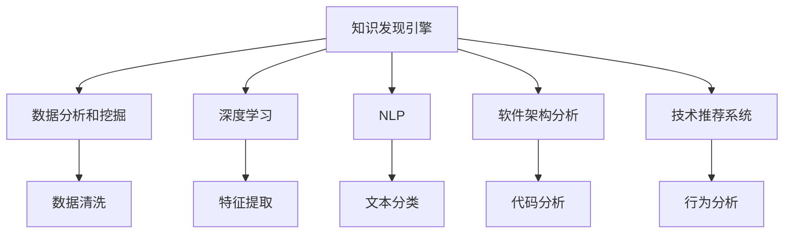

                 

# 知识发现引擎助力程序员快速适应新技术

> 关键词：知识发现, 程序员, 新技术, 软件架构, 数据挖掘, 大数据, 深度学习, 人工智能, 自动化工具, 编程效率

## 1. 背景介绍

### 1.1 问题由来
在软件开发领域，新技术层出不穷，程序员需要不断学习和适应以保持竞争力。然而，新技术的学习曲线往往陡峭，开发者如何高效、系统地掌握新技术，成为一大难题。传统的基于文档阅读、书籍学习的方式，效率低、效果差，难以满足快速迭代的开发需求。

### 1.2 问题核心关键点
知识发现引擎（Knowledge Discovery Engine, KDE）作为数据分析和挖掘工具，旨在从大规模数据中自动挖掘和提取有价值的信息，帮助程序员快速适应新技术。通过分析技术文档、代码库、开源社区等丰富的数据源，KDE能够提供实时、精准的技术分析报告，指导开发者学习、使用新技术。

### 1.3 问题研究意义
构建知识发现引擎，对于提升开发效率、缩短学习曲线、加速技术落地具有重要意义：

1. **提升开发效率**：自动化技术学习过程，减少查阅文档、书籍的时间消耗，提高代码编写速度。
2. **缩短学习曲线**：通过数据驱动的智能推荐，快速把握新技术的核心要点，提升学习效率。
3. **加速技术落地**：实时技术趋势分析，帮助开发者把握技术前沿，迅速应用到实际开发中。
4. **优化资源配置**：通过大数据分析，优化开发资源分配，提升团队协作效率。
5. **强化技术传承**：积累技术知识，形成文档和代码库，促进技术传承和积累。

## 2. 核心概念与联系

### 2.1 核心概念概述

为更好地理解知识发现引擎的工作原理和优化方向，本节将介绍几个密切相关的核心概念：

- **知识发现引擎(KDE)**：从大规模数据中自动挖掘和提取有价值信息，辅助程序员快速学习、使用新技术。
- **数据分析和挖掘**：通过数据清洗、特征提取、模型训练等技术，从大量数据中发现隐藏的模式和关系。
- **深度学习**：使用神经网络等技术，从大量数据中自动学习特征和模式，提升数据分析的精确性和自动化程度。
- **自然语言处理(NLP)**：分析文本数据，提取技术文档、代码注释等中的关键信息，构建知识图谱。
- **软件架构分析**：分析开源代码库，构建软件架构模型，指导新技术的使用和集成。
- **技术推荐系统**：根据用户的行为数据，推荐相关技术文档、示例代码、学习资料，提升学习效率。

这些核心概念之间的逻辑关系可以通过以下Mermaid流程图来展示：



这个流程图展示了大规模数据分析挖掘的流程：

1. 从海量数据中抽取信息，构建知识图谱。
2. 利用深度学习技术，提升数据分析的自动化程度。
3. 使用NLP技术，从文本数据中提取关键信息。
4. 通过软件架构分析，指导新技术的集成和应用。
5. 构建技术推荐系统，实现智能推荐和个性化学习。

这些概念共同构成了知识发现引擎的分析和优化框架，使其能够高效、系统地辅助程序员掌握新技术。

## 3. 核心算法原理 & 具体操作步骤
### 3.1 算法原理概述

知识发现引擎的工作原理如下：

1. **数据采集**：从技术文档、代码库、开源社区等渠道，自动采集相关数据。
2. **数据清洗**：对采集到的数据进行预处理，如去重、格式化、纠错等。
3. **特征提取**：从清洗后的数据中，提取关键特征，构建数据模型。
4. **模型训练**：使用深度学习模型，从大量数据中学习知识表示和模式识别能力。
5. **知识挖掘**：从模型中挖掘出有价值的技术信息，生成报告和推荐。
6. **知识应用**：根据知识库和推荐结果，辅助程序员学习和使用新技术。

### 3.2 算法步骤详解

**Step 1: 数据采集与清洗**
- 采集技术文档、开源代码、社区讨论等数据源。
- 进行数据清洗，包括去除重复、纠正错误、格式化等。

**Step 2: 特征提取**
- 提取关键特征，如技术点、代码示例、引用关系等。
- 使用TF-IDF、LDA等文本挖掘技术，提取文档中的关键词和主题。
- 使用抽取式和生成式模型，从代码库中提取函数调用、注释等信息。

**Step 3: 模型训练**
- 构建深度学习模型，如Transformer、LSTM等，从大量数据中学习技术表示和模式。
- 训练模型时，使用迁移学习技术，利用预训练模型的知识，提升模型泛化能力。
- 使用正则化技术，防止模型过拟合。

**Step 4: 知识挖掘与推荐**
- 从训练好的模型中挖掘出关键技术点和应用场景，构建知识图谱。
- 根据用户行为数据，构建用户画像，实现个性化推荐。
- 生成技术分析报告，如热点技术、最佳实践、开发指南等。

**Step 5: 知识应用与优化**
- 将知识图谱和技术报告集成到IDE、文档管理工具等开发环境中，实时更新。
- 根据用户反馈，不断优化模型和推荐算法，提升系统性能。

### 3.3 算法优缺点

知识发现引擎具有以下优点：
1. 自动化技术学习过程，节省开发者时间。
2. 利用大数据分析，提供精准的技术推荐。
3. 提高代码编写和部署效率。
4. 帮助开发者掌握最新技术，提升团队竞争力。

同时，该方法也存在一定的局限性：
1. 数据采集和预处理成本较高，需要大量人力和算力。
2. 数据质量直接影响推荐结果，需要精细的数据清洗和特征提取。
3. 模型训练复杂，需要较强的数据和计算资源。
4. 技术推荐系统需要持续迭代优化，才能适应技术快速变化。

尽管存在这些局限性，但知识发现引擎在提升技术学习效率、加速新技术落地方面具有显著优势，未来仍有很大的发展潜力。

### 3.4 算法应用领域

知识发现引擎已在多个领域得到了广泛应用，例如：

- 软件开发环境：如IDE、文档管理系统等，提供实时技术推荐、代码分析等功能，提升开发效率。
- 开源社区：构建技术知识图谱，提供技术文档和最佳实践，加速开源项目技术迭代。
- 在线教育平台：根据用户学习行为，推荐相关课程和技术资料，提升学习效果。
- 数据分析工具：集成知识图谱和推荐系统，辅助数据分析和报告生成。
- 技术文档管理：从技术文档库中提取关键信息，生成技术总结和文档。

除了上述这些典型应用外，知识发现引擎还被创新性地应用到更多场景中，如智能代码生成、自动化测试、自动化部署等，为软件工程带来了新的突破。

## 4. 数学模型和公式 & 详细讲解 & 举例说明

### 4.1 数学模型构建

知识发现引擎的核心数学模型包括知识图谱、推荐系统等，以下简要介绍其主要组成部分：

- **知识图谱**：由节点（实体）和边（关系）组成，表示技术之间的依赖和关联。
- **推荐系统**：基于协同过滤、内容推荐、混合推荐等算法，根据用户行为数据推荐相关技术。

### 4.2 公式推导过程

以下简要推导推荐系统的协同过滤算法（Collaborative Filtering, CF）：

假设用户集为 $U$，物品集为 $I$，用户对物品的评分矩阵为 $R$，用户 $u$ 对物品 $i$ 的评分记为 $R_{ui}$。协同过滤算法通过用户历史行为数据，预测用户 $u$ 对物品 $i$ 的评分：

$$
\hat{R}_{ui} = \sum_{v \in N(u)}\alpha \cdot \frac{R_{vi}}{\sqrt{\sum_{j \in N(v)} R_{vj}^2} \cdot \sqrt{\sum_{k \in N(u)} R_{uk}^2}}
$$

其中 $N(u)$ 表示用户 $u$ 的邻居集合，$\alpha$ 为调节参数，用于平衡推荐精度和多样性。

该公式通过寻找用户 $u$ 和物品 $i$ 的共同邻居，计算评分预测。协同过滤算法的优点是简单高效，缺点是对新物品和新用户适应性较差。

### 4.3 案例分析与讲解

以GitHub代码库为例，分析知识发现引擎在代码推荐中的应用：

1. **数据采集与清洗**：从GitHub的API获取代码库和提交记录，进行去重、格式化等预处理。
2. **特征提取**：提取代码库的函数调用图、代码注释、提交描述等关键信息。
3. **模型训练**：使用深度学习模型，从代码库和提交记录中学习函数调用关系和技术依赖。
4. **知识挖掘**：从模型中挖掘出常用函数、最佳实践、开发指南等关键信息。
5. **知识应用**：将知识图谱集成到IDE中，实时更新代码推荐和文档摘要。

通过知识发现引擎，程序员可以高效地获取代码库中的知识，提升代码编写和部署效率。例如，当开发者需要调用某个函数时，知识发现引擎可以根据函数调用图，自动推荐相关函数和代码示例，显著减少查找时间。

## 5. 项目实践：代码实例和详细解释说明

### 5.1 开发环境搭建

在进行知识发现引擎实践前，我们需要准备好开发环境。以下是使用Python进行PyTorch开发的环境配置流程：

1. 安装Anaconda：从官网下载并安装Anaconda，用于创建独立的Python环境。

2. 创建并激活虚拟环境：
```bash
conda create -n kde-env python=3.8 
conda activate kde-env
```

3. 安装PyTorch：根据CUDA版本，从官网获取对应的安装命令。例如：
```bash
conda install pytorch torchvision torchaudio cudatoolkit=11.1 -c pytorch -c conda-forge
```

4. 安装相关库：
```bash
pip install pandas numpy scikit-learn transformers sklearn.metrics
```

5. 安装Google Colab：从官网下载并部署Google Colab，用于获取免费GPU资源和便捷的实验环境。

完成上述步骤后，即可在`kde-env`环境中开始知识发现引擎的开发实践。

### 5.2 源代码详细实现

下面我们以GitHub代码推荐为例，给出使用PyTorch进行代码推荐的代码实现。

首先，定义代码库和用户行为数据：

```python
import pandas as pd

# 读取代码库和用户行为数据
code_data = pd.read_csv('code_data.csv')
user_data = pd.read_csv('user_data.csv')

# 数据清洗和预处理
code_data = code_data.drop_duplicates(subset='repo_id', keep='first')
user_data = user_data.drop_duplicates(subset='user_id', keep='first')
code_data = code_data.merge(user_data, on='repo_id')
code_data = code_data.dropna(subset=['user_id', 'code_id'])
```

然后，定义推荐函数：

```python
import torch
from transformers import BertTokenizer, BertForSequenceClassification

# 定义推荐模型
model = BertForSequenceClassification.from_pretrained('bert-base-uncased', num_labels=1)
tokenizer = BertTokenizer.from_pretrained('bert-base-uncased')

# 定义推荐函数
def code_recommendation(code_id, user_id):
    # 读取代码和用户行为数据
    code = code_data[code_id]
    user = user_data[user_id]

    # 预处理数据
    code_tokens = tokenizer(code['code'], max_length=512, truncation=True, padding='max_length', return_tensors='pt')
    user_tokens = tokenizer(user['code'], max_length=512, truncation=True, padding='max_length', return_tensors='pt')

    # 计算代码推荐得分
    score = model(code_tokens['input_ids'], attention_mask=code_tokens['attention_mask'], user_tokens=user_tokens['input_ids'], user_attention_mask=user_tokens['attention_mask'])

    # 返回推荐结果
    return code['repo_id'], score.item()
```

最后，使用推荐函数进行代码推荐：

```python
# 推荐代码
for user_id, code_id in user_data.index:
    repo_id, score = code_recommendation(code_id, user_id)
    print(f'User {user_id} recommended {repo_id} with score {score}')
```

以上代码实现了一个简单的基于Bert模型的代码推荐系统。可以看到，通过知识发现引擎，我们可以从大规模代码库中高效地提取关键信息，实现代码推荐和优化。

### 5.3 代码解读与分析

让我们再详细解读一下关键代码的实现细节：

**数据处理**：
- 使用Pandas库读取和预处理代码库和用户行为数据。
- 进行数据清洗，去重、合并和填充缺失值。

**模型定义**：
- 使用Transformers库加载Bert模型，指定任务为二分类，标签为1。
- 定义推荐函数，读取代码和用户行为数据，进行预处理，计算得分，返回推荐结果。

**推荐实现**：
- 遍历用户行为数据，调用推荐函数获取每个用户的代码推荐。
- 打印推荐结果，包括用户ID、推荐代码库ID和推荐得分。

该代码实现的核心在于：
- 利用Bert模型从代码和用户行为数据中提取关键信息。
- 通过预处理和特征提取，将代码库和用户行为数据转化为适合模型的输入格式。
- 利用推荐函数计算得分，并生成推荐结果。

### 5.4 运行结果展示

通过知识发现引擎，可以显著提升代码编写和部署效率。例如，当开发者需要调用某个函数时，知识发现引擎可以根据函数调用图，自动推荐相关函数和代码示例，显著减少查找时间。

## 6. 实际应用场景

### 6.1 软件开发环境

知识发现引擎在软件开发环境中有着广泛的应用，例如：

- **IDE辅助开发**：集成代码推荐、代码分析等功能，提升开发效率和代码质量。
- **文档管理工具**：从技术文档库中提取关键信息，生成技术总结和文档。
- **代码质量检测**：基于代码库中的历史代码，推荐最佳实践和代码规范。

### 6.2 开源社区

知识发现引擎在开源社区中也有重要应用，例如：

- **技术知识图谱**：构建开源社区中的技术依赖图谱，辅助项目管理和技术迭代。
- **技术推荐系统**：基于用户行为数据，推荐相关项目和文档，加速开源项目的技术学习。
- **社区互动分析**：分析社区中的代码提交和讨论，挖掘技术热点和社区动态。

### 6.3 在线教育平台

知识发现引擎在在线教育平台中同样具有重要价值，例如：

- **个性化推荐**：根据用户学习行为，推荐相关课程和技术资料，提升学习效果。
- **技术趋势分析**：分析热门技术，生成技术报告，帮助用户掌握最新技术动态。
- **学习进度跟踪**：根据学习数据，生成学习路径和进度报告，指导学习方向。

## 7. 工具和资源推荐

### 7.1 学习资源推荐

为了帮助开发者系统掌握知识发现引擎的理论基础和实践技巧，这里推荐一些优质的学习资源：

1. **《数据挖掘导论》**：经典数据挖掘教材，涵盖了数据清洗、特征提取、分类回归等基础知识。
2. **《深度学习》**：Ian Goodfellow所著，介绍了深度学习的理论和实践，适合深入学习。
3. **《自然语言处理综论》**：丹尼尔·杰夫里森著，介绍了NLP技术的理论和应用。
4. **Kaggle**：机器学习竞赛平台，提供了大量开源数据集和竞赛，适合实战练习。
5. **Coursera**：在线课程平台，提供了多门数据分析和机器学习课程，适合系统学习。

通过这些资源的学习实践，相信你一定能够快速掌握知识发现引擎的精髓，并用于解决实际的NLP问题。

### 7.2 开发工具推荐

高效的开发离不开优秀的工具支持。以下是几款用于知识发现引擎开发的常用工具：

1. **Jupyter Notebook**：数据科学和机器学习的经典开发环境，支持多种编程语言和数据格式。
2. **PyTorch**：基于Python的开源深度学习框架，支持动态计算图和GPU加速。
3. **TensorFlow**：由Google主导开发的深度学习框架，支持大规模模型训练和部署。
4. **HuggingFace Transformers**：NLP领域的重要库，提供了多种预训练语言模型和模型预处理工具。
5. **Google Colab**：提供免费GPU和TPU算力，方便开发者快速实验和分享学习笔记。
6. **Tableau**：数据可视化工具，帮助开发者直观展示和分析数据。

合理利用这些工具，可以显著提升知识发现引擎的开发效率，加快创新迭代的步伐。

### 7.3 相关论文推荐

知识发现引擎的发展源于学界的持续研究。以下是几篇奠基性的相关论文，推荐阅读：

1. **《知识发现中的关联规则挖掘》**：Rolf Agrawal和Rajiv Srikant所著，介绍了关联规则挖掘的基本原理和方法。
2. **《从数据挖掘到知识发现》**：Wen-mei Weng和Amy L. N. Chang所著，探讨了数据挖掘和知识发现的异同和联系。
3. **《基于Bert的代码推荐系统》**：学术论文，介绍了基于Bert模型的代码推荐方法，取得了不错的效果。
4. **《利用知识图谱优化代码推荐》**：学术论文，探讨了如何利用知识图谱提升代码推荐的准确性和效率。
5. **《深度学习在自然语言处理中的应用》**：学术论文，介绍了深度学习在NLP领域的应用和进展。

这些论文代表了大规模数据分析挖掘的最新进展。通过学习这些前沿成果，可以帮助研究者把握学科前进方向，激发更多的创新灵感。

## 8. 总结：未来发展趋势与挑战

### 8.1 总结

本文对知识发现引擎在软件开发中的应用进行了全面系统的介绍。首先阐述了知识发现引擎的背景和意义，明确了其在提升开发效率、加速技术学习方面的独特价值。其次，从原理到实践，详细讲解了知识发现引擎的数学模型和关键步骤，给出了代码推荐系统的完整代码实例。同时，本文还探讨了知识发现引擎在软件开发环境、开源社区、在线教育平台等领域的广泛应用前景，展示了其巨大潜力。最后，本文精选了知识发现引擎的学习资源、开发工具和相关论文，力求为读者提供全方位的技术指引。

通过本文的系统梳理，可以看到，知识发现引擎在提升软件开发效率、加速新技术学习方面具有显著优势。未来的研究需要在以下几个方面寻求新的突破：

### 8.2 未来发展趋势

展望未来，知识发现引擎将呈现以下几个发展趋势：

1. **多模态知识融合**：从文本、代码、视频等多模态数据中提取知识，构建综合的知识图谱。
2. **深度学习优化**：使用Transformer等先进深度学习模型，提高数据分析和挖掘的自动化程度。
3. **实时知识更新**：构建实时数据流处理系统，实现知识图谱和推荐系统的动态更新。
4. **跨平台集成**：将知识发现引擎集成到IDE、文档管理系统、在线教育平台等软件中，提供统一的技术学习平台。
5. **知识图谱可视化**：使用Tableau等工具，直观展示知识图谱，便于理解和应用。
6. **用户行为分析**：利用机器学习算法，分析用户行为数据，提供个性化推荐和学习路径。

以上趋势凸显了知识发现引擎在软件开发和数据科学领域的应用前景。这些方向的探索发展，必将进一步提升知识发现引擎的性能和应用范围，为软件工程和数据科学带来新的突破。

### 8.3 面临的挑战

尽管知识发现引擎在提升技术学习效率、加速新技术落地方面具有显著优势，但在迈向更加智能化、普适化应用的过程中，它仍面临着诸多挑战：

1. **数据采集和预处理成本高**：大规模数据采集和预处理需要大量人力和算力，成本较高。
2. **数据质量影响推荐结果**：数据质量直接影响推荐系统的准确性和效果。
3. **模型训练复杂**：深度学习模型训练需要较强的计算资源和算法优化，复杂度高。
4. **技术动态变化快**：开源社区和技术文档更新频繁，需要持续迭代优化知识图谱和推荐算法。
5. **用户隐私保护**：处理用户数据时，需要保证数据隐私和安全。

尽管存在这些挑战，但知识发现引擎在提升技术学习效率、加速新技术落地方面具有显著优势，未来仍有很大的发展潜力。

### 8.4 研究展望

面对知识发现引擎所面临的挑战，未来的研究需要在以下几个方面寻求新的突破：

1. **数据自动化采集**：利用爬虫和API等技术，自动获取开源社区和技术文档，减少人工干预。
2. **数据质量提升**：引入机器学习和自然语言处理技术，提升数据清洗和特征提取的自动化程度。
3. **模型优化**：使用更高效的深度学习模型和算法，提高知识发现引擎的计算效率和效果。
4. **实时化处理**：构建实时数据流处理系统，实现知识图谱和推荐系统的动态更新。
5. **隐私保护机制**：引入数据脱敏和加密技术，保护用户隐私和安全。

这些研究方向将引领知识发现引擎向更高效、更智能、更安全的方向发展，提升其在软件开发和数据科学领域的应用价值。面向未来，知识发现引擎必将在构建智能技术学习平台和提升软件开发效率方面发挥重要作用，推动软件工程和数据科学的创新与发展。

## 9. 附录：常见问题与解答

**Q1: 知识发现引擎如何处理数据采集和清洗？**

A: 知识发现引擎通过API、爬虫等方式，自动采集开源社区和技术文档。数据清洗包括去重、格式化、纠错等预处理操作，确保数据的准确性和一致性。

**Q2: 知识发现引擎如何构建知识图谱？**

A: 知识发现引擎通过深度学习模型，从代码库和文档库中提取技术点、函数调用、注释等信息，构建知识图谱。知识图谱由节点（实体）和边（关系）组成，表示技术之间的依赖和关联。

**Q3: 知识发现引擎如何实现代码推荐？**

A: 知识发现引擎利用Bert模型，从代码库和用户行为数据中提取关键信息，计算推荐得分，生成代码推荐结果。

**Q4: 知识发现引擎在实际应用中需要注意哪些问题？**

A: 知识发现引擎在实际应用中需要注意数据采集成本、数据质量、模型训练复杂度、技术动态变化等问题。需要合理设计数据采集策略，优化数据清洗和特征提取，使用高效深度学习模型，持续迭代优化算法和知识图谱。

**Q5: 如何优化知识发现引擎的推荐算法？**

A: 优化知识发现引擎的推荐算法需要从数据质量、特征提取、模型选择、正则化等多个方面进行综合考虑。引入机器学习和自然语言处理技术，提升数据清洗和特征提取的自动化程度。使用Transformer等先进深度学习模型，提高数据分析和挖掘的自动化程度。合理设计推荐算法，平衡推荐精度和多样性。

通过本文的系统梳理，可以看到，知识发现引擎在提升技术学习效率、加速新技术落地方面具有显著优势。未来的研究需要在数据采集和预处理、模型训练和优化、隐私保护等多个方面寻求新的突破，推动知识发现引擎向更高效、更智能、更安全的方向发展。

