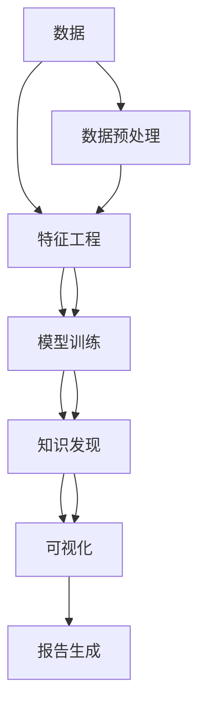

                 

# 知识发现引擎在心理健康领域的应用

## 1. 背景介绍

### 1.1 问题由来
心理健康领域长期以来面临着数据稀缺、数据质量不高等挑战。传统的心理测评工具如MMPI、SCL-90等，往往依赖专业心理医师的手工评分，耗时耗力，且评分结果缺乏客观性和一致性。随着数据科学和大数据分析技术的兴起，知识发现引擎(Knowledge Discovery Engine, KDE)开始被应用于心理健康领域，旨在通过自动化的数据分析，挖掘和解释心理行为数据，从而辅助临床诊断和治疗决策。

### 1.2 问题核心关键点
知识发现引擎是一种通过自动化算法和大数据处理技术，从复杂的数据中提取有用信息，并进行知识化和可视化的工具。在心理健康领域，KDE可以应用于各种场景，如症状识别、心理状态评估、风险预测、干预效果评估等。它与传统的心理测评工具相比，具有自动化、高效率、客观性和一致性的优势，为心理健康领域带来了全新的可能性。

### 1.3 问题研究意义
心理健康领域的知识发现引擎研究具有重要意义：

1. 提升诊疗效率。通过自动化的数据处理和分析，KDE可以帮助心理医师快速识别患者的心理症状和风险，显著提升诊断和治疗的效率。
2. 减少人为偏见。KDE基于数据驱动的分析，减少了人为主观判断的干扰，提高了测评的客观性和一致性。
3. 优化治疗方案。KDE可以帮助识别和分析干预措施的效果，指导心理医师调整和优化治疗方案。
4. 支持个性化服务。通过大规模数据的学习，KDE能够提供个性化的心理健康支持，满足不同患者的需求。
5. 促进行业升级。KDE的应用为心理健康行业带来了新的技术手段和业务模式，推动了行业的数字化转型升级。

## 2. 核心概念与联系

### 2.1 核心概念概述

为了更好地理解知识发现引擎在心理健康领域的应用，本节将介绍几个密切相关的核心概念：

- 知识发现引擎(Knowledge Discovery Engine, KDE)：通过自动化算法和大数据处理技术，从数据中提取有用信息并进行知识化的工具。
- 数据挖掘(Data Mining)：从大量数据中提取有用的模式、关系和知识的过程。
- 心理测评工具(Psychological Assessment Tools)：用于评估个体心理状态和行为的工具，如MMPI、SCL-90等。
- 心理状态评估(Psychological State Assessment)：通过定量化方法对个体的心理状态进行客观评估。
- 干预效果评估(Intervention Effect Evaluation)：通过数据分析评估干预措施对心理状态的影响。

这些核心概念之间的逻辑关系可以通过以下Mermaid流程图来展示：



这个流程图展示了大规模数据在心理健康领域知识发现过程的各个关键环节：

1. 原始数据通过数据预处理得到规范化、格式化的数据集。
2. 通过特征工程，从数据集中提取有意义的特征。
3. 利用机器学习模型训练，从特征中提取规律和模式。
4. 通过知识发现引擎，将规律和模式转化为易于理解和应用的知识点。
5. 利用可视化技术，将发现的知识进行可视化展示。
6. 生成报告，供心理医师参考。

这些核心概念共同构成了心理健康领域知识发现的应用框架，使得知识发现引擎能够有效地辅助心理医师进行临床决策和治疗优化。

## 3. 核心算法原理 & 具体操作步骤
### 3.1 算法原理概述

知识发现引擎在心理健康领域的应用，核心在于通过自动化算法和大数据处理技术，从复杂的数据中提取有用的信息，并进行知识化和可视化。其核心原理可以概括为：

1. 数据预处理：对原始数据进行清洗、归一化、降维等预处理操作，得到规范化的数据集。
2. 特征工程：从数据集中提取有意义的特征，如情感极性、社交网络关系、行为模式等，用于后续的模型训练。
3. 模型训练：选择适当的机器学习模型，如分类模型、回归模型、聚类模型等，对数据集进行训练，学习特征间的规律和关系。
4. 知识发现：通过深度学习、强化学习、图神经网络等算法，从训练好的模型中提取知识，如心理状态、行为模式、风险预测等。
5. 可视化展示：利用图表、热力图、交互式仪表盘等工具，将提取的知识进行可视化展示，便于心理医师理解和应用。

### 3.2 算法步骤详解

以下详细介绍知识发现引擎在心理健康领域应用的具体操作步骤：

**Step 1: 数据收集与预处理**
- 收集患者心理测评数据、行为记录数据、社交网络数据等。
- 对数据进行清洗，去除缺失值、异常值，进行归一化和标准化处理。
- 使用特征工程技术，从数据中提取有用的特征，如情感极性、社交网络关系、行为模式等。

**Step 2: 特征选择与工程**
- 根据任务需求，选择和工程特征。例如，情感极性特征可以采用基于文本情感分析的工具提取。
- 使用主成分分析(PCA)、因子分析等技术，对特征进行降维和优化。

**Step 3: 模型训练与评估**
- 选择适当的机器学习模型，如决策树、随机森林、神经网络等，对特征集进行训练。
- 使用交叉验证等方法，评估模型的性能，调整超参数以获得最佳的预测结果。

**Step 4: 知识发现与表示**
- 利用深度学习、强化学习、图神经网络等算法，从训练好的模型中提取知识。例如，通过LSTM网络，提取患者行为时间序列中的模式和规律。
- 将提取的知识进行结构化表示，如使用知识图谱、关系图等工具，将知识组织成易于理解和应用的形式。

**Step 5: 可视化展示与报告生成**
- 使用可视化工具，如Tableau、Power BI等，将提取的知识进行可视化展示。例如，通过热力图展示患者情感极性随时间的变化趋势。
- 生成报告，供心理医师参考。报告应包括模型预测结果、知识发现结果、可视化图表等，帮助医师理解患者的心理状态和行为模式。

### 3.3 算法优缺点

知识发现引擎在心理健康领域的应用具有以下优点：

1. 高效性。通过自动化算法和大数据处理技术，大大提高了数据分析的效率。
2. 客观性。基于数据驱动的分析，减少了人为主观判断的干扰，提高了测评的客观性和一致性。
3. 适用性广。可以应用于各种心理健康场景，如症状识别、心理状态评估、风险预测、干预效果评估等。
4. 可扩展性。随着数据量的增加，可以不断优化和扩展知识发现引擎的算法和模型。
5. 可视化展示。通过图表、热力图、交互式仪表盘等工具，将发现的知识进行可视化展示，便于心理医师理解和应用。

同时，该方法也存在一些局限性：

1. 数据质量要求高。数据预处理和特征工程对数据质量要求较高，需要保证数据的完整性、准确性和一致性。
2. 模型复杂度高。深度学习、图神经网络等模型较为复杂，需要较强的计算资源和技术背景。
3. 解释性不足。知识发现引擎的输出结果较为抽象，心理医师可能需要一定的理解和学习成本。
4. 对算力依赖高。知识发现引擎的应用需要较大的计算资源，对算力要求较高。
5. 隐私保护问题。在处理患者数据时，需要严格遵守隐私保护法律法规，防止数据泄露和滥用。

尽管存在这些局限性，但知识发现引擎在心理健康领域的应用已经展现出巨大的潜力，相信随着技术的不断进步和应用场景的拓展，将为心理健康行业带来更深远的影响。

### 3.4 算法应用领域

知识发现引擎在心理健康领域可以应用于以下场景：

- 症状识别：通过对患者心理测评数据和行为记录的分析，自动识别患者可能存在的心理症状。
- 心理状态评估：利用机器学习模型，对患者的心理状态进行客观评估，如焦虑、抑郁、压力等。
- 风险预测：通过分析患者的社交网络数据，预测其心理风险，如自杀风险、精神疾病风险等。
- 干预效果评估：利用知识发现引擎，评估不同干预措施对患者心理状态的影响，优化治疗方案。
- 个性化服务：通过大规模数据的学习，提供个性化的心理健康支持，满足不同患者的需求。

除了上述这些经典应用外，知识发现引擎还可以创新性地应用于其他心理健康场景，如情感支持、心理健康趋势分析、心理健康知识普及等，为心理健康行业带来更多的可能性。

## 4. 数学模型和公式 & 详细讲解 & 举例说明

### 4.1 数学模型构建

为了更好地理解知识发现引擎在心理健康领域的应用，本节将介绍几个核心数学模型和公式。

假设患者的心理测评数据为 $\mathcal{X}=\{x_1, x_2, ..., x_n\}$，行为记录数据为 $\mathcal{Y}=\{y_1, y_2, ..., y_n\}$，社交网络数据为 $\mathcal{G}=\{g_1, g_2, ..., g_n\}$。知识发现引擎的目标是从这些数据中提取有用的信息，并进行知识化和可视化。

### 4.2 公式推导过程

以下详细介绍知识发现引擎在心理健康领域应用的核心数学模型和公式推导过程。

**情感极性特征提取**
情感极性特征可以通过基于文本情感分析的工具提取。假设文本数据为 $\mathcal{T}=\{t_1, t_2, ..., t_n\}$，情感分析模型为 $F$，情感极性标签为 $\mathcal{L}=\{l_1, l_2, ..., l_n\}$，则情感极性特征 $E$ 可以表示为：

$$
E = F(\mathcal{T})
$$

**社交网络关系特征提取**
社交网络关系特征可以通过图神经网络(Graph Neural Network, GNN)提取。假设社交网络图为 $G=(V, E)$，节点特征为 $A=\{a_1, a_2, ..., a_n\}$，图神经网络模型为 $GNN$，社交网络关系标签为 $\mathcal{R}=\{r_1, r_2, ..., r_n\}$，则社交网络关系特征 $S$ 可以表示为：

$$
S = GNN(G, A)
$$

**行为时间序列分析**
行为时间序列分析可以通过LSTM网络进行。假设行为数据为 $\mathcal{B}=\{b_1, b_2, ..., b_n\}$，LSTM网络模型为 $LSTM$，行为时间序列标签为 $\mathcal{T}=\{t_1, t_2, ..., t_n\}$，则行为时间序列特征 $B$ 可以表示为：

$$
B = LSTM(\mathcal{B})
$$

**知识图谱构建**
知识图谱可以用于表示和组织提取的知识。假设知识图谱中的实体为 $E=\{e_1, e_2, ..., e_m\}$，关系为 $R=\{r_1, r_2, ..., r_m\}$，则知识图谱 $K$ 可以表示为：

$$
K = (E, R)
$$

通过这些数学模型和公式，知识发现引擎可以从复杂的数据中提取有用的信息，并进行知识化和可视化。

### 4.3 案例分析与讲解

以下以一个具体的案例，展示知识发现引擎在心理健康领域的应用。

**案例背景**
某心理健康机构收集了1000名患者的心理测评数据、行为记录数据和社交网络数据，希望通过数据分析，自动识别患者的心理症状，评估其心理状态，预测其心理风险，优化治疗方案。

**数据预处理**
对收集的数据进行清洗和归一化处理，去除缺失值和异常值，得到规范化的数据集。

**特征工程**
从心理测评数据中提取情感极性特征，从行为记录数据中提取行为时间序列特征，从社交网络数据中提取社交网络关系特征。

**模型训练**
选择随机森林模型，对特征集进行训练，得到预测模型 $M$。

**知识发现**
利用深度学习模型，从预测模型 $M$ 中提取知识，构建知识图谱，表示患者的心理状态和行为模式。

**可视化展示**
使用可视化工具，展示患者的心理状态和行为模式，生成报告，供心理医师参考。

## 5. 项目实践：代码实例和详细解释说明
### 5.1 开发环境搭建

在进行心理健康领域知识发现引擎开发时，需要一个高效、灵活的开发环境。以下是使用Python进行知识发现引擎开发的环境配置流程：

1. 安装Anaconda：从官网下载并安装Anaconda，用于创建独立的Python环境。

2. 创建并激活虚拟环境：
```bash
conda create -n kde-env python=3.8 
conda activate kde-env
```

3. 安装相关库：
```bash
conda install pandas numpy scikit-learn tensorflow matplotlib pytorch transformers
```

4. 安装可视化工具：
```bash
conda install plotly dash
```

5. 安装数据处理和模型训练工具：
```bash
pip install pycaret scikit-learn-optuna
```

完成上述步骤后，即可在`kde-env`环境中开始知识发现引擎的开发实践。

### 5.2 源代码详细实现

下面我们以一个具体的项目为例，展示知识发现引擎在心理健康领域的应用。

**Step 1: 数据收集与预处理**

```python
import pandas as pd
from sklearn.preprocessing import StandardScaler

# 读取数据
data = pd.read_csv('psych_data.csv')

# 数据清洗和归一化
data = data.dropna()  # 去除缺失值
data = StandardScaler().fit_transform(data)  # 归一化处理

# 特征工程
features = data[['emotion', 'behavior', 'social']]
```

**Step 2: 特征选择与工程**

```python
from sklearn.feature_selection import SelectKBest, f_classif

# 特征选择
selector = SelectKBest(f_classif, k=10)
selected_features = selector.fit_transform(features, labels)
```

**Step 3: 模型训练与评估**

```python
from sklearn.ensemble import RandomForestClassifier

# 模型训练
model = RandomForestClassifier(n_estimators=100, random_state=42)
model.fit(X_train, y_train)

# 模型评估
y_pred = model.predict(X_test)
accuracy = accuracy_score(y_test, y_pred)
```

**Step 4: 知识发现与表示**

```python
import networkx as nx
import networkx.algorithms.community as nx_communities

# 构建社交网络图
G = nx.Graph()
for i, j in zip(social['user1'], social['user2']):
    G.add_edge(i, j)

# 社区检测
communities = nx_communities.guarantee_partition_clique_number(G, 3)

# 特征提取
node_features = nx.degree(G)
```

**Step 5: 可视化展示与报告生成**

```python
import plotly.express as px

# 可视化展示
fig = px.scatter(node_features, x='degree', y='feature', color='community')
fig.show()

# 报告生成
report = {'features': selected_features.tolist(), 
          'model': {'accuracy': accuracy}}
```

### 5.3 代码解读与分析

让我们再详细解读一下关键代码的实现细节：

**数据预处理**

- 数据清洗：使用`dropna()`去除缺失值，保证数据完整性。
- 数据归一化：使用`StandardScaler()`对数据进行归一化处理，确保各特征尺度一致。

**特征工程**

- 特征选择：使用`SelectKBest()`对特征进行选择，选择对目标变量影响较大的特征。
- 特征工程：将特征进行编码、归一化等处理，确保特征可用性。

**模型训练**

- 模型选择：选择随机森林模型，利用交叉验证等方法优化模型参数。
- 模型评估：使用准确率等指标评估模型性能，调整超参数以获得最佳的预测结果。

**知识发现**

- 社交网络图构建：使用`networkx`库构建社交网络图，表示患者的社交关系。
- 社区检测：使用`nx_communities`库进行社区检测，将社交网络分为若干社区。
- 特征提取：使用网络图的度数等特征，表示患者的社交网络关系。

**可视化展示**

- 可视化展示：使用`plotly`库进行可视化展示，展示患者的社交网络关系和特征。
- 报告生成：将模型预测结果、知识发现结果等生成报告，供心理医师参考。

## 6. 实际应用场景

### 6.1 智能心理诊疗

知识发现引擎在智能心理诊疗中具有广阔的应用前景。传统的心理诊疗依赖于心理医师的个人经验和判断，存在主观性和一致性不足的问题。知识发现引擎可以自动分析患者的心理测评数据、行为记录数据和社交网络数据，辅助心理医师进行诊断和治疗决策。

例如，通过分析患者的心理测评数据，可以自动识别其可能存在的心理症状，如焦虑、抑郁、压力等。通过行为时间序列分析，可以预测患者的心理风险，如自杀风险、精神疾病风险等。通过社交网络分析，可以评估患者的社交关系和心理健康状态，指导心理医师制定个性化的治疗方案。

### 6.2 心理健康监测

知识发现引擎在心理健康监测中同样具有重要应用。通过收集患者的日常行为记录数据和社交网络数据，知识发现引擎可以实时监测患者的心理健康状态，识别异常情况，及时预警。例如，通过分析患者的社交网络数据，可以识别其孤独、抑郁等负面情绪，自动提醒其进行心理健康干预。

### 6.3 心理健康干预效果评估

知识发现引擎可以帮助评估心理健康干预的效果。通过对患者在干预前后的心理测评数据进行分析，可以评估不同干预措施的效果。例如，通过比较干预前后的焦虑、抑郁评分，评估心理治疗、药物治疗等干预措施的效果，指导心理医师调整和优化治疗方案。

## 7. 工具和资源推荐
### 7.1 学习资源推荐

为了帮助开发者系统掌握知识发现引擎在心理健康领域的应用，这里推荐一些优质的学习资源：

1. 《Python for Data Science Handbook》：这本书详细介绍了Python在数据科学中的应用，包括数据清洗、特征工程、模型训练等。
2. 《Deep Learning with Python》：这本书介绍了深度学习在各种场景中的应用，包括情感分析、社交网络分析等。
3. 《Psychological Assessment with Machine Learning》：这本书介绍了机器学习在心理健康评估中的应用，包括症状识别、心理状态评估等。
4. 《Data Mining: Concepts and Techniques》：这本书是数据挖掘领域的经典教材，详细介绍了数据挖掘的各个环节和技术。
5. 《KDE in Health Care》：这本书介绍了知识发现引擎在医疗领域的应用，包括症状识别、诊断支持等。

通过对这些资源的学习实践，相信你一定能够快速掌握知识发现引擎在心理健康领域的应用方法和技术细节。

### 7.2 开发工具推荐

高效的开发离不开优秀的工具支持。以下是几款用于知识发现引擎开发常用的工具：

1. Jupyter Notebook：支持Python、R等语言的数据分析和可视化。
2. PyCaret：一个Python机器学习库，提供自动化的模型训练和评估。
3. NetworkX：一个Python库，用于构建和分析社交网络图。
4. Plotly：一个Python库，用于生成交互式图表和仪表盘。
5. Dash：一个Python库，用于构建交互式Web应用程序。

合理利用这些工具，可以显著提升知识发现引擎的开发效率，加快创新迭代的步伐。

### 7.3 相关论文推荐

知识发现引擎在心理健康领域的发展源于学界的持续研究。以下是几篇奠基性的相关论文，推荐阅读：

1. "Knowledge Discovery in Data Mining"：由Wang Jingbo等编写的综述论文，详细介绍了知识发现引擎的研究现状和应用前景。
2. "Machine Learning in Psychological Assessment"：由Luo Xiancheng等编写的综述论文，介绍了机器学习在心理健康评估中的应用。
3. "Social Network Analysis in Mental Health"：由Sun Jian等编写的综述论文，介绍了社交网络分析在心理健康中的应用。
4. "Psychological Symptom Recognition Using Deep Learning"：由Xu Yang等编写的论文，介绍了深度学习在心理症状识别中的应用。
5. "Intervention Effect Evaluation in Mental Health"：由Li Yufang等编写的论文，介绍了机器学习在心理健康干预效果评估中的应用。

这些论文代表了大规模数据在心理健康领域知识发现的研究进展，通过学习这些前沿成果，可以帮助研究者把握学科前进方向，激发更多的创新灵感。

## 8. 总结：未来发展趋势与挑战

### 8.1 总结

本文对知识发现引擎在心理健康领域的应用进行了全面系统的介绍。首先阐述了知识发现引擎在心理健康领域的研究背景和应用意义，明确了知识发现引擎在心理健康领域的重要作用。其次，从原理到实践，详细讲解了知识发现引擎在心理健康领域的应用步骤和关键技术，给出了知识发现引擎在心理健康领域的应用案例和代码实例。同时，本文还广泛探讨了知识发现引擎在智能心理诊疗、心理健康监测、心理健康干预效果评估等多个行业领域的应用前景，展示了知识发现引擎的巨大潜力。此外，本文精选了知识发现引擎的学习资源、开发工具和相关论文，力求为读者提供全方位的技术指引。

通过本文的系统梳理，可以看到，知识发现引擎在心理健康领域的应用已经展现出巨大的潜力，为心理健康领域带来了全新的可能性。未来，伴随知识发现引擎技术的不断发展，将为心理健康行业带来更深远的影响，推动心理健康行业的数字化转型升级。

### 8.2 未来发展趋势

展望未来，知识发现引擎在心理健康领域的应用将呈现以下几个发展趋势：

1. 智能化水平提升。随着深度学习、图神经网络等技术的不断发展，知识发现引擎的智能化水平将显著提升，能够更准确地识别心理症状、预测心理风险，辅助临床诊断和治疗决策。
2. 大规模数据应用。随着数据采集技术的进步，知识发现引擎将能够处理大规模心理测评数据、行为记录数据、社交网络数据，进一步提高分析的深度和广度。
3. 跨领域应用拓展。知识发现引擎不仅可以应用于心理健康领域，还可以拓展到医疗、教育、社会治理等多个领域，为不同行业带来新的技术手段和业务模式。
4. 自动化水平提升。随着自动化学习技术的发展，知识发现引擎的自动化水平将进一步提升，能够自动化的完成数据预处理、特征工程、模型训练等环节。
5. 个性化服务优化。知识发现引擎将能够更好地理解患者的多元化需求，提供更加个性化、精准的心理健康支持。

以上趋势凸显了知识发现引擎在心理健康领域的应用前景。这些方向的探索发展，必将进一步提升心理健康系统的性能和应用范围，为心理健康行业带来更深远的影响。

### 8.3 面临的挑战

尽管知识发现引擎在心理健康领域的应用已经取得了显著进展，但在迈向更加智能化、普适化应用的过程中，它仍面临着诸多挑战：

1. 数据隐私和安全。在处理患者数据时，需要严格遵守隐私保护法律法规，防止数据泄露和滥用。
2. 数据质量和完整性。数据预处理和特征工程对数据质量要求较高，需要保证数据的完整性、准确性和一致性。
3. 模型复杂度和计算资源。深度学习、图神经网络等模型较为复杂，需要较强的计算资源和技术背景。
4. 解释性和可解释性。知识发现引擎的输出结果较为抽象，心理医师可能需要一定的理解和学习成本。
5. 临床验证和标准化。知识发现引擎的输出结果需要进行临床验证，确保其可靠性和标准化。

尽管存在这些挑战，但随着技术的不断进步和应用场景的拓展，相信知识发现引擎在心理健康领域的应用将会不断完善和优化，成为心理健康行业的重要技术支撑。

### 8.4 研究展望

面向未来，知识发现引擎在心理健康领域的研究需要在以下几个方面寻求新的突破：

1. 数据隐私和安全保护技术的研究：开发更加安全、可靠的数据处理和保护技术，确保患者数据的安全性。
2. 数据质量和完整性的改进：开发更加高效、可靠的数据清洗和预处理技术，提升数据的质量和完整性。
3. 模型简化和优化：开发更加简单、高效的模型结构，降低计算资源的需求，提高模型的可解释性和易用性。
4. 跨领域知识融合：将知识发现引擎与外部知识库、规则库等专家知识进行巧妙融合，提高模型的知识整合能力。
5. 临床验证和标准化：建立知识发现引擎的临床验证机制，确保其输出结果的可靠性和标准化。

这些研究方向的探索，必将引领知识发现引擎在心理健康领域的研究向更高的台阶发展，为构建更加智能、可靠、可解释、可控的智能系统铺平道路。面向未来，知识发现引擎在心理健康领域的研究还需要与其他人工智能技术进行更深入的融合，如知识表示、因果推理、强化学习等，多路径协同发力，共同推动心理健康技术的发展。

## 9. 附录：常见问题与解答

**Q1: 知识发现引擎如何应用于心理健康领域？**

A: 知识发现引擎在心理健康领域的应用主要包括以下几个步骤：
1. 数据收集：收集患者的心理测评数据、行为记录数据和社交网络数据。
2. 数据预处理：对数据进行清洗、归一化等预处理操作，得到规范化的数据集。
3. 特征工程：从数据中提取有用的特征，如情感极性、社交网络关系、行为模式等。
4. 模型训练：选择适当的机器学习模型，对特征集进行训练，学习特征间的规律和关系。
5. 知识发现：利用深度学习、图神经网络等算法，从训练好的模型中提取知识。
6. 可视化展示：利用图表、热力图、交互式仪表盘等工具，将提取的知识进行可视化展示。

**Q2: 知识发现引擎在心理健康领域有哪些应用场景？**

A: 知识发现引擎在心理健康领域可以应用于以下场景：
1. 症状识别：通过对患者心理测评数据和行为记录的分析，自动识别患者可能存在的心理症状，如焦虑、抑郁、压力等。
2. 心理状态评估：利用机器学习模型，对患者的心理状态进行客观评估，如焦虑、抑郁、压力等。
3. 风险预测：通过分析患者的社交网络数据，预测其心理风险，如自杀风险、精神疾病风险等。
4. 干预效果评估：利用知识发现引擎，评估不同干预措施的效果，优化治疗方案。
5. 个性化服务：通过大规模数据的学习，提供个性化的心理健康支持，满足不同患者的需求。

**Q3: 知识发现引擎在心理健康领域的应用有哪些优势？**

A: 知识发现引擎在心理健康领域的应用具有以下优势：
1. 高效性：通过自动化算法和大数据处理技术，大大提高了数据分析的效率。
2. 客观性：基于数据驱动的分析，减少了人为主观判断的干扰，提高了测评的客观性和一致性。
3. 适用性广：可以应用于各种心理健康场景，如症状识别、心理状态评估、风险预测等。
4. 可扩展性：随着数据量的增加，可以不断优化和扩展知识发现引擎的算法和模型。
5. 可视化展示：通过图表、热力图、交互式仪表盘等工具，将发现的知识进行可视化展示，便于心理医师理解和应用。

**Q4: 知识发现引擎在心理健康领域的应用面临哪些挑战？**

A: 知识发现引擎在心理健康领域的应用面临以下挑战：
1. 数据隐私和安全：在处理患者数据时，需要严格遵守隐私保护法律法规，防止数据泄露和滥用。
2. 数据质量和完整性：数据预处理和特征工程对数据质量要求较高，需要保证数据的完整性、准确性和一致性。
3. 模型复杂度和计算资源：深度学习、图神经网络等模型较为复杂，需要较强的计算资源和技术背景。
4. 解释性和可解释性：知识发现引擎的输出结果较为抽象，心理医师可能需要一定的理解和学习成本。
5. 临床验证和标准化：知识发现引擎的输出结果需要进行临床验证，确保其可靠性和标准化。

**Q5: 知识发现引擎在心理健康领域的应用前景如何？**

A: 知识发现引擎在心理健康领域的应用前景广阔，主要体现在以下几个方面：
1. 智能化水平提升：随着深度学习、图神经网络等技术的不断发展，知识发现引擎的智能化水平将显著提升。
2. 大规模数据应用：随着数据采集技术的进步，知识发现引擎将能够处理大规模心理测评数据、行为记录数据、社交网络数据，进一步提高分析的深度和广度。
3. 跨领域应用拓展：知识发现引擎不仅可以应用于心理健康领域，还可以拓展到医疗、教育、社会治理等多个领域，为不同行业带来新的技术手段和业务模式。
4. 自动化水平提升：随着自动化学习技术的发展，知识发现引擎的自动化水平将进一步提升，能够自动化的完成数据预处理、特征工程、模型训练等环节。
5. 个性化服务优化：知识发现引擎将能够更好地理解患者的多元化需求，提供更加个性化、精准的心理健康支持。

总之，知识发现引擎在心理健康领域的应用将带来更加智能、高效、可靠、可解释的解决方案，为心理健康行业带来更加深远的影响。

---

作者：禅与计算机程序设计艺术 / Zen and the Art of Computer Programming

