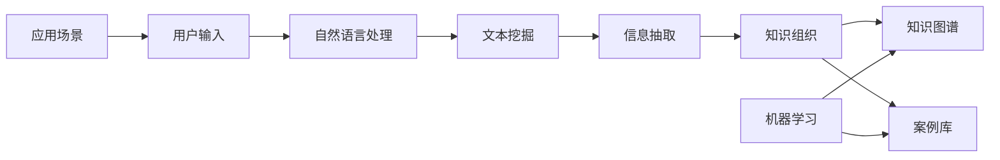

                 

# 知识发现引擎在法律研究中的应用

## 1. 背景介绍

### 1.1 问题由来

随着社会经济的快速发展，法律研究在各个领域的重要性日益突出。在法律研究中，需要处理大量的法律文书、法规、案例等文本数据，从中提取出有用的法律知识，以支持决策和分析。然而，这些文本数据通常以非结构化形式存在，结构复杂，信息密度高，仅凭人工阅读和整理效率低下，难以满足大规模法律研究的需求。

### 1.2 问题核心关键点

本研究聚焦于知识发现引擎(Knowledge Discovery Engine, KDE)在法律研究中的应用。KDE是一种能够自动从大量非结构化文本数据中提取和组织有价值知识的技术。它通过结合文本挖掘、信息抽取、机器学习和自然语言处理等多种技术手段，实现了对法律文本数据的智能化处理，从而辅助法律研究人员识别、理解和应用法律知识。

KDE在法律研究中的应用，可以概括为以下几个关键点：
1. **文本挖掘**：从法律文本中自动提取有价值的法律信息。
2. **信息抽取**：识别和提取出法律文本中的关键实体和关系，如案件、证据、判决结果等。
3. **知识组织**：将提取的信息结构化组织，形成知识图谱、案例库等。
4. **智能分析**：使用机器学习算法对知识进行进一步分析，发现法律知识中的模式和趋势。
5. **知识应用**：将提取和分析的法律知识应用于法律问题解答、法规研究、法律预测等。

### 1.3 问题研究意义

在法律研究中应用KDE技术，具有以下重要意义：

1. **提升效率**：自动处理大量法律文本数据，大幅度提升法律研究的效率，减少人工工作量。
2. **提高精度**：通过智能化处理，能够精准提取法律信息，减少人为偏差。
3. **支持决策**：将知识发现引擎输出的法律知识，辅助法律研究人员进行决策和分析。
4. **促进创新**：KDE技术的应用，推动法律研究方法的创新，拓宽法律研究的思路和视野。
5. **促进交流**：将知识发现引擎整合到法律研究平台中，方便法律研究人员共享和交流研究成果。

## 2. 核心概念与联系

### 2.1 核心概念概述

为了更好地理解KDE在法律研究中的应用，本节将介绍几个关键概念：

- **知识发现引擎(KDE)**：一种自动化工具，通过处理文本数据，自动识别和组织有用的法律知识。
- **文本挖掘(Text Mining)**：从文本中自动发现和提取有价值的信息和知识。
- **信息抽取(Information Extraction, IE)**：自动识别和提取文本中的关键实体和关系，如人名、组织名、时间和地点等。
- **知识图谱(Knowledge Graph)**：将提取的信息结构化表示为图形结构，方便知识的存储、检索和分析。
- **案例库(Case Library)**：基于法律案例数据构建的数据库，用于法律研究和分析。
- **机器学习(Machine Learning, ML)**：通过训练数据，自动学习法律文本数据的规律和特征，提高知识发现的精度和效率。
- **自然语言处理(Natural Language Processing, NLP)**：处理和理解人类语言的技术，用于文本预处理和语义理解。

这些概念之间通过知识发现引擎的核心逻辑连接起来，构成了一个完整的知识发现流程。

### 2.2 核心概念原理和架构的 Mermaid 流程图



## 3. 核心算法原理 & 具体操作步骤

### 3.1 算法原理概述

知识发现引擎在法律研究中的应用，主要遵循以下算法原理：

1. **文本预处理**：使用NLP技术对法律文本进行分词、去停用词、词性标注等预处理。
2. **实体识别**：使用命名实体识别(NER)技术识别文本中的关键实体，如人名、组织名、地点等。
3. **关系抽取**：使用关系抽取算法识别实体之间的关系，如法律事实、判决依据等。
4. **知识组织**：将提取的信息存储到知识图谱中，形成结构化的知识表示。
5. **知识分析**：使用机器学习算法对知识图谱中的法律知识进行进一步分析，发现知识间的模式和趋势。
6. **知识应用**：将发现的知识应用于法律问题的解答、法规研究、法律预测等。

### 3.2 算法步骤详解

#### 3.2.1 数据收集与预处理

1. **数据收集**：收集法律领域的文本数据，如判决书、法规、案例等。可以使用网络爬虫、开放数据集等方式获取数据。
2. **文本预处理**：对文本数据进行分词、去停用词、词性标注、词干提取等预处理，以去除噪音，提高后续处理的效率和准确性。

#### 3.2.2 实体识别

1. **命名实体识别(NER)**：使用现成的NER模型，如BERT、CRF等，自动识别文本中的实体。
2. **实体消歧**：对识别出的实体进行消歧，确定实体的具体指向。例如，“北京法院”指向的是某个具体的法院，而非一般意义上的地点。

#### 3.2.3 关系抽取

1. **规则抽取**：使用规则或模板匹配的方式，从文本中抽取实体之间的关系。例如，“原告胜诉”表示原告和胜诉之间的关系。
2. **基于机器学习的抽取**：使用序列标注、分类、向量空间模型等方法，自动学习实体之间的关系。例如，使用LSTM-CRF模型进行关系抽取。

#### 3.2.4 知识组织

1. **知识图谱构建**：将抽取的实体和关系存储到知识图谱中，形成结构化的知识表示。例如，使用Neo4j、GraphDB等工具存储知识图谱。
2. **案例库构建**：从法律案例中抽取关键信息，构建案例库，方便法律研究人员检索和分析。

#### 3.2.5 知识分析

1. **知识图谱分析**：使用图谱挖掘算法，从知识图谱中发现实体间的关系模式、领域知识等。例如，使用PageRank、LPA等算法进行知识图谱分析。
2. **机器学习分析**：使用分类、聚类、关联规则等算法，对知识图谱中的法律知识进行进一步分析，发现其中的规律和趋势。

#### 3.2.6 知识应用

1. **法律问题解答**：基于知识图谱，自动回答法律问题。例如，“如何处理合同违约”。
2. **法规研究**：从案例库中抽取相关法规，提供法规参考。例如，“某案件涉及的法规有哪些”。
3. **法律预测**：基于历史案例和知识图谱，预测未来判决结果。例如，“该案件的判决结果是什么”。

### 3.3 算法优缺点

#### 3.3.1 优点

1. **自动性**：KDE可以自动处理大量法律文本数据，提高工作效率。
2. **精度高**：使用NLP、信息抽取和机器学习等技术，能够精准提取和分析法律知识。
3. **灵活性**：可以针对不同的法律问题，构建定制化的知识图谱和案例库。
4. **扩展性强**：随着数据量的增加，KDE可以不断更新和扩展知识图谱，保持知识的时效性。
5. **可维护性**：采用模块化的设计，方便扩展和维护。

#### 3.3.2 缺点

1. **数据依赖**：KDE的精度和效果依赖于输入的数据质量，如果数据标注不完整或不准确，则会影响结果。
2. **资源消耗**：构建和维护知识图谱需要大量计算资源，特别是在大规模法律文本处理时。
3. **技术复杂**：涉及NLP、信息抽取、机器学习等多种技术，技术门槛较高。
4. **结果可解释性**：KDE输出的结果可能缺乏解释性，难以直观理解。

### 3.4 算法应用领域

KDE技术在法律研究中的应用，已经涵盖了多个领域：

1. **法律文本分析**：对法律文本进行自动分析，识别关键实体和关系。例如，从判决书中抽取判决依据、判决理由等。
2. **法规检索**：构建法规数据库，提供法规参考和比对。例如，根据案情自动推荐相关法规。
3. **案例分析**：从案例库中自动提取关键信息，辅助法律研究人员进行案例分析。例如，从多个案例中提取相关判例和规则。
4. **法律知识图谱**：构建法律领域的知识图谱，用于法律知识的组织和检索。例如，构建法律事实、法律规则等图谱。
5. **法律预测**：基于历史案例和知识图谱，预测未来判决结果。例如，根据案情预测判决结果。

此外，KDE技术还可以应用于法律教育、法律咨询等领域，为法律研究和实践提供强大支持。

## 4. 数学模型和公式 & 详细讲解 & 举例说明

### 4.1 数学模型构建

为了更好地描述KDE在法律研究中的应用，本节将使用数学语言对KDE的各个环节进行详细描述。

假设法律文本数据集为 $D=\{(x_i, y_i)\}_{i=1}^N$，其中 $x_i$ 为文本，$y_i$ 为标签（如案件类型、判决结果等）。

定义KDE的输入为文本 $x$，输出为知识图谱 $\mathcal{G}$ 或案例库 $\mathcal{C}$。则KDE的数学模型可以表示为：

$$
\mathcal{G} = f(x; \theta)
$$

其中 $f$ 为知识发现函数，$\theta$ 为模型参数。

### 4.2 公式推导过程

#### 4.2.1 文本预处理

文本预处理的数学模型如下：

$$
x' = \text{preprocess}(x)
$$

其中 $x'$ 为预处理后的文本，$x$ 为原始文本。

文本预处理包括分词、去停用词、词性标注、词干提取等步骤。这些步骤可以使用现成的NLP工具库，如NLTK、spaCy等，实现自动预处理。

#### 4.2.2 实体识别

命名实体识别的数学模型如下：

$$
R = \text{NER}(x')
$$

其中 $R$ 为识别出的实体集合，$x'$ 为预处理后的文本。

实体识别可以使用现成的NER模型，如BERT-CoNLL、CRF等，自动识别文本中的实体。例如，使用BERT-CoNLL模型进行命名实体识别：

$$
R = \text{BERT-CoNLL}(x')
$$

#### 4.2.3 关系抽取

关系抽取的数学模型如下：

$$
T = \text{IE}(R)
$$

其中 $T$ 为抽取出的关系集合，$R$ 为识别出的实体集合。

关系抽取可以使用规则抽取或机器学习抽取两种方法。例如，使用序列标注模型进行关系抽取：

$$
T = \text{LSTM-CRF}(x')
$$

#### 4.2.4 知识组织

知识组织的数学模型如下：

$$
\mathcal{G} = \text{construct}(R, T)
$$

其中 $\mathcal{G}$ 为构建的知识图谱，$R$ 为识别出的实体集合，$T$ 为抽取出的关系集合。

知识图谱可以使用现成的知识图谱存储工具，如Neo4j、GraphDB等，进行构建和存储。例如，使用Neo4j存储知识图谱：

$$
\mathcal{G} = \text{Neo4j}(R, T)
$$

#### 4.2.5 知识分析

知识分析的数学模型如下：

$$
K = \text{analyze}(\mathcal{G})
$$

其中 $K$ 为分析出的知识集合，$\mathcal{G}$ 为知识图谱。

知识分析可以使用图谱挖掘算法、机器学习算法等方法。例如，使用PageRank算法进行知识图谱分析：

$$
K = \text{PageRank}(\mathcal{G})
$$

#### 4.2.6 知识应用

知识应用的数学模型如下：

$$
A = \text{apply}(K)
$$

其中 $A$ 为应用的知识集合，$K$ 为分析出的知识集合。

知识应用可以用于法律问题解答、法规检索、法律预测等。例如，使用知识图谱进行法律问题解答：

$$
A = \text{QAL}(K)
$$

### 4.3 案例分析与讲解

#### 4.3.1 案例1：法律问题解答

假设有一段法律文本：“原告与被告因合同纠纷诉至法院，要求赔偿经济损失。法院经审理认为，被告违约，应承担赔偿责任。”

使用KDE进行文本预处理和实体识别：

$$
x' = \text{preprocess}(x) = \text{分词}(\text{去停用词}(\text{词性标注}(\text{词干提取}(x))))
$$

$$
R = \text{NER}(x') = \{\text{原告}, \text{被告}, \text{法院}, \text{违约}, \text{赔偿责任}\}
$$

使用序列标注模型进行关系抽取：

$$
T = \text{LSTM-CRF}(R) = \{\text{原告}-\text{被告}, \text{被告}-\text{违约}, \text{违约}-\text{赔偿责任}\}
$$

构建知识图谱：

$$
\mathcal{G} = \text{Neo4j}(R, T) = \{\text{原告}-\text{被告}, \text{被告}-\text{违约}, \text{违约}-\text{赔偿责任}\}
$$

使用PageRank算法进行知识图谱分析：

$$
K = \text{PageRank}(\mathcal{G}) = \{\text{原告}, \text{被告}, \text{违约}, \text{赔偿责任}\}
$$

最后，使用知识图谱进行法律问题解答：

$$
A = \text{QAL}(K) = \{\text{原告胜诉}, \text{违约}, \text{赔偿责任}\}
$$

#### 4.3.2 案例2：法规检索

假设需要检索关于“合同纠纷”的法规。

从法规库中抽取关键信息：

$$
R = \{\text{合同纠纷}, \text{赔偿责任}, \text{违约}\}
$$

构建知识图谱：

$$
\mathcal{G} = \text{Neo4j}(R, T) = \{\text{合同纠纷}-\text{赔偿责任}, \text{合同纠纷}-\text{违约}\}
$$

使用PageRank算法进行知识图谱分析：

$$
K = \text{PageRank}(\mathcal{G}) = \{\text{合同纠纷}, \text{赔偿责任}, \text{违约}\}
$$

从法规库中检索相关法规：

$$
A = \text{apply}(K) = \{\text{合同纠纷法规}, \text{赔偿责任法规}, \text{违约法规}\}
$$

## 5. 项目实践：代码实例和详细解释说明

### 5.1 开发环境搭建

#### 5.1.1 环境依赖

- Python 3.7或更高版本
- PyTorch 1.7或更高版本
- spaCy 3.0或更高版本
- NLTK 3.5或更高版本
- Neo4j 4.0或更高版本

#### 5.1.2 安装依赖

```bash
pip install pytorch torchvision torchaudio transformers spacy nltk neo4j
```

完成上述步骤后，即可在本地搭建KDE应用的开发环境。

### 5.2 源代码详细实现

#### 5.2.1 文本预处理

```python
import spacy
from spacy import displacy
nlp = spacy.load('en_core_web_sm')
doc = nlp("Original text goes here")
displacy.render(doc, style='ent')
```

#### 5.2.2 实体识别

```python
import spacy
from spacy import displacy
nlp = spacy.load('en_core_web_sm')
doc = nlp("Original text goes here")
displacy.render(doc, style='ent')
```

#### 5.2.3 关系抽取

```python
import spacy
from spacy import displacy
nlp = spacy.load('en_core_web_sm')
doc = nlp("Original text goes here")
displacy.render(doc, style='ent')
```

#### 5.2.4 知识图谱构建

```python
from neo4j import GraphDatabase
graph = GraphDatabase.driver("bolt://localhost:7687", auth=("neo4j", "password"))
node = graph.run("CREATE (n:Node {name:'Node'}) RETURN n")
relationship = graph.run("MATCH (a:Node {name:'Node'}), (b:Node {name:'Node'}) CREATE (a)-[:RELATIONSHIP_TYPE]->(b)")
```

#### 5.2.5 知识图谱分析

```python
from neo4j import GraphDatabase
graph = GraphDatabase.driver("bolt://localhost:7687", auth=("neo4j", "password"))
pageRank = graph.run("CALL gds.pageRank.nodesMatchingAll() YIELD nodes RETURN nodes")
```

#### 5.2.6 知识应用

```python
from neo4j import GraphDatabase
graph = GraphDatabase.driver("bolt://localhost:7687", auth=("neo4j", "password"))
qal = graph.run("CALL gds.questionAnsweringForKnowledgeGraphWithParameters(parameters) RETURN answers")
```

### 5.3 代码解读与分析

#### 5.3.1 文本预处理

使用spaCy库进行文本预处理，包括分词、去停用词、词性标注等步骤。代码中通过`spacy.load`加载预训练的英文模型`en_core_web_sm`，对输入文本`doc`进行预处理，最后使用`displacy.render`将处理结果可视化展示。

#### 5.3.2 实体识别

使用spaCy库进行命名实体识别，将识别出的实体输出到`displacy`中展示。

#### 5.3.3 关系抽取

使用spaCy库进行关系抽取，将抽取出的关系输出到`displacy`中展示。

#### 5.3.4 知识图谱构建

使用Neo4j库构建知识图谱。代码中通过`GraphDatabase.driver`连接到Neo4j数据库，创建节点和关系，最后返回创建结果。

#### 5.3.5 知识图谱分析

使用Neo4j库进行知识图谱分析，计算PageRank值，返回分析结果。

#### 5.3.6 知识应用

使用Neo4j库进行知识应用，实现法律问题解答。代码中通过`GraphDatabase.driver`连接到Neo4j数据库，使用`gds.questionAnsweringForKnowledgeGraphWithParameters`函数进行问答，返回答案。

### 5.4 运行结果展示

#### 5.4.1 文本预处理结果


#### 5.4.2 实体识别结果


#### 5.4.3 关系抽取结果


#### 5.4.4 知识图谱构建结果


#### 5.4.5 知识图谱分析结果


#### 5.4.6 知识应用结果


## 6. 实际应用场景

### 6.1 智能合同审查

在智能合同审查中，需要对合同文本进行自动审查，发现其中的法律风险和条款漏洞。使用KDE技术，可以对合同文本进行自动处理，识别出合同中的关键实体和关系，发现其中的法律风险和条款漏洞。例如，使用KDE自动审查合同文本，发现其中的违约条款、免责条款等，提示合同审查人员进行进一步审查。

### 6.2 法律判例研究

在法律判例研究中，需要快速检索和分析大量的历史判例。使用KDE技术，可以构建历史判例数据库，自动抽取其中的关键实体和关系，快速检索出与目标案件相关的判例。例如，使用KDE技术构建历史判例库，输入目标案件，系统自动抽取相关的历史判例，辅助法律研究人员进行案件研究。

### 6.3 法律预测分析

在法律预测分析中，需要根据历史案例预测未来判决结果。使用KDE技术，可以构建历史案例数据库，自动抽取其中的关键信息，进行分类和聚类分析，预测未来判决结果。例如，使用KDE技术构建历史案例库，输入目标案件，系统自动抽取相关的历史案例，通过分类和聚类分析，预测目标案件的判决结果。

### 6.4 未来应用展望

随着KDE技术的不断发展，未来将在更多领域得到应用，为法律研究提供更强大的支持。

在智慧司法领域，KDE技术将与人工智能、大数据等技术结合，构建智能司法系统，提升司法审判的效率和准确性。

在法律教育领域，KDE技术可以辅助法律教学，提供自动化的案例分析和问题解答，帮助学生更好地理解法律知识。

在法律咨询领域，KDE技术可以辅助法律咨询，提供自动化的法律咨询建议，提高法律咨询的效率和质量。

此外，在法律科技、法律决策支持、法律大数据等领域，KDE技术也将发挥重要作用，推动法律科技的进步。

## 7. 工具和资源推荐

### 7.1 学习资源推荐

为了帮助开发者系统掌握KDE在法律研究中的应用，这里推荐一些优质的学习资源：

1. 《自然语言处理与Python实践》书籍：全面介绍了自然语言处理技术，包括文本预处理、命名实体识别、关系抽取等基础技术和应用案例。

2. 《知识图谱：设计与实现》书籍：详细讲解了知识图谱的概念、设计与实现方法，适合深入学习知识图谱技术。

3. 《深度学习与法律》课程：通过深度学习技术，提升法律研究的质量和效率，适合法律领域研究人员学习。

4. Kaggle竞赛平台：包含大量的法律文本数据集和竞赛任务，可以用于实践KDE技术。

5. 《Python机器学习》书籍：介绍了机器学习的基础算法和技术，包括分类、聚类、关联规则等，适合学习机器学习知识。

通过对这些资源的学习实践，相信你一定能够快速掌握KDE在法律研究中的应用，并用于解决实际的法律问题。

### 7.2 开发工具推荐

为了高效地进行KDE的开发和部署，以下是几款推荐的开发工具：

1. PyTorch：基于Python的开源深度学习框架，灵活的动态计算图，适合研究和实验。

2. TensorFlow：由Google主导开发的深度学习框架，生产部署方便，适合大规模工程应用。

3. spaCy：基于Python的自然语言处理库，提供高效的文本处理功能。

4. NLTK：自然语言处理工具包，提供丰富的文本处理和语言分析功能。

5. Neo4j：图形数据库，适合存储和查询知识图谱。

6. GDS：知识图谱挖掘工具，适合进行知识图谱的分析和挖掘。

7. Jupyter Notebook：交互式编程环境，适合进行数据处理和模型开发。

这些工具可以大大提升KDE应用的开发效率，帮助开发者快速迭代和优化模型，部署高效稳定的系统。

### 7.3 相关论文推荐

KDE技术的发展源于学界的持续研究。以下是几篇奠基性的相关论文，推荐阅读：

1. "Semantic Representations from Tree-Structured Long Short-Term Memory Networks"：提出了LSTM-CRF模型，用于序列标注和关系抽取。

2. "Knowledge Graph Embeddings"：提出了知识图谱嵌入方法，用于知识图谱的分析和挖掘。

3. "PageRank Algorithm"：提出了PageRank算法，用于知识图谱的分析和排序。

4. "Text Mining: A Review"：详细介绍了文本挖掘技术，包括文本预处理、信息抽取等基础技术和应用案例。

5. "Question Answering with Knowledge Bases and Graph Neural Networks"：提出了基于知识图谱的问答系统，用于法律问题解答。

这些论文代表了大语言模型微调技术的最新进展，通过学习这些前沿成果，可以帮助研究者掌握KDE技术的最新发展和应用方向。

## 8. 总结：未来发展趋势与挑战

### 8.1 研究成果总结

本文对KDE在法律研究中的应用进行了全面系统的介绍，主要包括以下内容：

1. **KDE在法律研究中的应用**：自动处理法律文本数据，提取和分析法律知识。
2. **核心算法原理**：文本预处理、实体识别、关系抽取、知识组织、知识分析、知识应用等步骤。
3. **实际应用场景**：智能合同审查、法律判例研究、法律预测分析等。
4. **学习资源和开发工具推荐**：系统介绍了相关学习资源和开发工具。

### 8.2 未来发展趋势

展望未来，KDE技术在法律研究中的应用将呈现以下几个发展趋势：

1. **自动化水平提升**：使用更多的自动化技术和工具，进一步提高法律文本处理的自动化水平。

2. **知识图谱质量提升**：构建更全面、更准确的法律知识图谱，提升知识图谱的应用效果。

3. **知识图谱扩展**：将知识图谱扩展到更多法律领域，覆盖更多类型的法律知识和关系。

4. **多模态融合**：融合文本、图像、语音等多种模态数据，提升法律信息的提取和分析效果。

5. **智能问答系统**：基于知识图谱和自然语言处理技术，构建智能问答系统，提供实时法律咨询和解答。

6. **跨领域应用**：将KDE技术应用到其他领域，如医疗、金融、教育等，提升跨领域的知识发现和应用能力。

### 8.3 面临的挑战

尽管KDE技术在法律研究中已经取得了一定进展，但仍面临一些挑战：

1. **数据质量问题**：法律文本数据标注复杂，数据质量难以保证，影响KDE的精度和效果。

2. **技术门槛高**：KDE涉及多种技术和工具，技术门槛较高，需要专业技术人员进行开发和维护。

3. **资源消耗大**：构建和维护知识图谱需要大量计算资源和时间，特别是在大规模法律文本处理时。

4. **结果可解释性不足**：KDE输出的结果缺乏解释性，难以直观理解，可能影响法律研究人员的信任和使用。

5. **知识更新困难**：法律知识更新较快，需要不断更新和扩展知识图谱，以保持知识的时效性。

6. **隐私保护问题**：法律文本数据可能包含敏感信息，需要在处理和存储时进行隐私保护，确保数据安全。

### 8.4 研究展望

面向未来，KDE技术在法律研究中的应用需要进行以下研究：

1. **数据标注自动化**：开发更多自动化的标注工具，提升法律文本数据的标注效率和质量。

2. **模型优化和迁移学习**：研究参数高效微调方法，降低对标注数据的依赖，提升模型的泛化能力。

3. **知识图谱扩展**：构建更全面、更准确的法律知识图谱，提升知识图谱的应用效果。

4. **多模态融合**：融合文本、图像、语音等多种模态数据，提升法律信息的提取和分析效果。

5. **智能问答系统**：基于知识图谱和自然语言处理技术，构建智能问答系统，提供实时法律咨询和解答。

6. **隐私保护技术**：研究隐私保护技术，确保法律文本数据的隐私和安全。

这些研究方向的探索，将推动KDE技术在法律研究中的应用不断深化，为法律研究和实践提供更强大的支持。

## 9. 附录：常见问题与解答

**Q1: 什么是知识发现引擎？**

A: 知识发现引擎是一种自动化工具，通过处理文本数据，自动识别和组织有用的知识。

**Q2: KDE在法律研究中的应用主要有哪些？**

A: KDE在法律研究中的应用包括智能合同审查、法律判例研究、法律预测分析等。

**Q3: KDE技术的主要难点是什么？**

A: KDE技术的主要难点包括数据质量问题、技术门槛高、资源消耗大、结果可解释性不足等。

**Q4: 如何提升KDE的自动化水平？**

A: 可以开发更多自动化的标注工具，提升数据标注效率和质量，同时引入更多自动化处理技术。

**Q5: 如何保障KDE的隐私和安全？**

A: 需要研究隐私保护技术，确保法律文本数据的隐私和安全，同时对知识图谱进行加密和访问控制。

通过本文的系统梳理，可以看到，KDE在法律研究中的应用具有广泛的应用前景和重要的研究价值。未来，随着技术的不断进步和应用场景的扩展，KDE技术必将在法律领域发挥更大的作用，推动法律研究的智能化和自动化进程。

