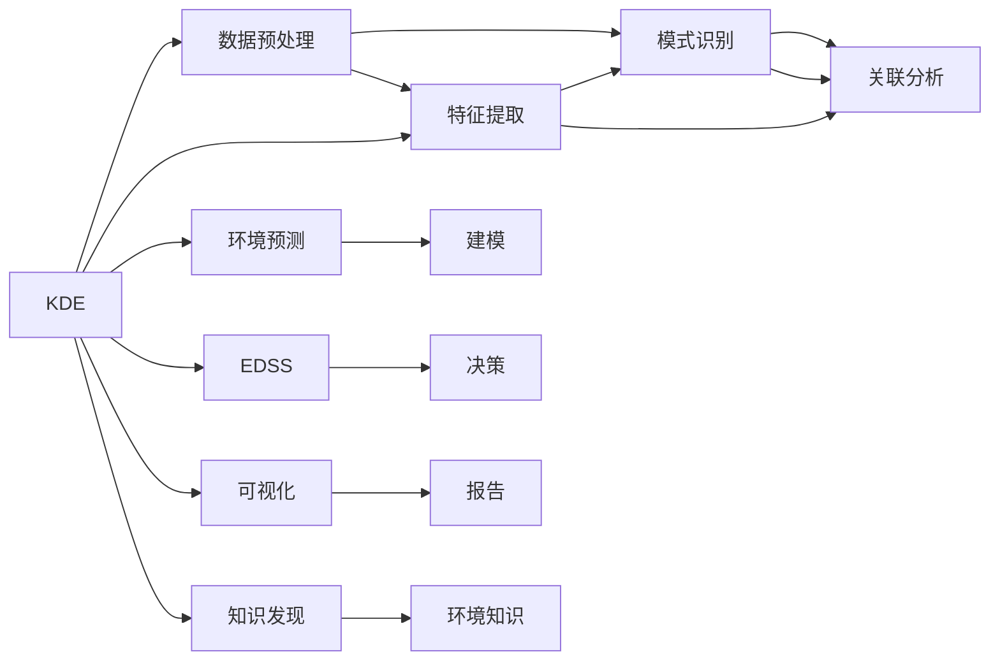

                 

## 1. 背景介绍

### 1.1 问题由来
环境保护作为全球关注的重大议题，其重要性不言而喻。随着科技的进步，人们越来越依赖于数据分析和知识发现来了解环境问题，并制定科学合理的解决方案。知识发现引擎（Knowledge Discovery Engine, KDE）在此过程中扮演了重要角色。

近年来，全球气候变化、污染事件频发，环境保护领域的复杂性和多样性日益凸显。如何高效、全面地分析海量数据，从中挖掘出有价值的环境保护知识，已成为当前的一大挑战。知识发现引擎通过对大规模环境数据进行分析和挖掘，揭示环境问题的本质，辅助决策制定，从而为环境保护贡献力量。

### 1.2 问题核心关键点
知识发现引擎的核心在于其能够自动地、智能地从大量数据中发现模式、趋势和关联，并将这些知识以易于理解和利用的形式呈现。在环境保护应用中，知识发现引擎可以揭示出环境变化规律，预测环境趋势，辅助环境决策，为环境保护提供科学的依据。

具体而言，知识发现引擎在环境保护中的应用包括：

- 环境数据的自动化处理和特征提取。
- 模式识别和趋势预测。
- 基于知识发现的环境决策支持。
- 环境知识的可视化和报告生成。

这些应用使得知识发现引擎在环境保护领域具有重要的应用价值。

## 2. 核心概念与联系

### 2.1 核心概念概述

为更好地理解知识发现引擎在环境保护中的应用，本节将介绍几个密切相关的核心概念：

- **知识发现引擎（KDE）**：通过数据分析、机器学习和统计方法，从大规模数据中发现和提取有用知识的技术。KDE包括数据预处理、特征提取、模式识别、关联分析等多个环节，旨在揭示数据的内在规律和知识。

- **环境数据（Environmental Data）**：指与环境状态、污染水平、生态变化等相关的各类监测数据，包括气象数据、水质数据、空气质量数据、土壤数据、生态系统数据等。这些数据量巨大、类型多样，是KDE处理的主要对象。

- **数据挖掘（Data Mining）**：从大量数据中提取有用信息、发现模式和关联的过程。数据挖掘技术包括分类、聚类、关联规则、异常检测等，是KDE的核心技术手段。

- **环境预测与建模（Environmental Prediction and Modeling）**：使用历史数据和模型，预测未来的环境状态和变化趋势，辅助决策。

- **环境决策支持系统（Environmental Decision Support System, EDSS）**：利用知识发现引擎提供的环境知识，辅助政府、企业等决策者进行环境政策制定、污染治理等决策。

- **可视化（Visualization）**：将复杂的环境数据和分析结果以图形、图表等形式展示，便于理解和利用。

这些核心概念之间存在紧密的联系和相互作用，共同构成了知识发现引擎在环境保护中的应用框架。

### 2.2 核心概念原理和架构的 Mermaid 流程图



这个流程图展示了知识发现引擎在环境保护应用中的核心环节及其相互关系：

1. **数据预处理**：对原始环境数据进行清洗、整理、归一化等处理，为后续分析奠定基础。
2. **特征提取**：从处理后的数据中提取关键特征，用于进一步的模式识别和关联分析。
3. **模式识别**：通过分类、聚类等方法，识别环境数据的模式和规律。
4. **关联分析**：发现数据之间的关联，揭示潜在的关系和趋势。
5. **环境预测与建模**：使用历史数据构建模型，预测未来环境状态和趋势。
6. **环境决策支持**：利用KDE提供的知识，辅助环境决策。
7. **可视化与报告**：将环境知识以图形、图表等形式展示，生成报告，便于理解和传播。

## 3. 核心算法原理 & 具体操作步骤
### 3.1 算法原理概述

知识发现引擎在环境保护中的应用，本质上是通过数据分析和机器学习技术，从环境数据中发现模式、规律和知识，并将其应用于环境预测和决策支持。其核心算法原理包括数据预处理、特征提取、模式识别、关联分析等。

- **数据预处理**：清洗和整理原始环境数据，去除噪声和异常值，确保数据质量和一致性。
- **特征提取**：从处理后的数据中提取关键特征，如温度、湿度、污染浓度等。
- **模式识别**：通过分类、聚类等方法，识别环境数据的模式和规律，如季节性变化、污染高峰期等。
- **关联分析**：使用关联规则算法，发现数据之间的关联，如气象条件与污染水平的关系。

### 3.2 算法步骤详解

知识发现引擎在环境保护中的操作步骤如下：

**Step 1: 数据收集与预处理**
- 收集环境监测数据，包括气象、水质、空气质量、土壤、生态系统等数据。
- 清洗数据，去除噪声和异常值，确保数据的一致性和准确性。
- 对数据进行归一化、标准化等处理，为后续分析奠定基础。

**Step 2: 特征提取与选择**
- 从预处理后的数据中提取关键特征，如温度、湿度、污染浓度、生态指标等。
- 使用特征选择方法，选择最具有代表性和信息量的特征，以减少计算复杂度。

**Step 3: 模式识别与关联分析**
- 使用分类算法（如KNN、SVM、决策树等）进行模式识别，识别环境数据的分类特征，如季节变化、污染高峰等。
- 使用聚类算法（如K-means、DBSCAN等）进行聚类分析，发现数据之间的分组特征。
- 使用关联规则算法（如Apriori、FP-growth等）进行关联分析，揭示数据之间的关联特征。

**Step 4: 环境预测与建模**
- 使用历史数据构建时间序列模型或回归模型，预测未来的环境状态和变化趋势。
- 结合统计分析和机器学习方法，进行模型评估和优化。

**Step 5: 环境决策支持**
- 将环境预测结果和知识发现结果整合，辅助环境决策。
- 利用决策支持系统，生成决策方案和建议。

**Step 6: 可视化与报告生成**
- 将环境预测结果和知识发现结果以图形、图表等形式展示，生成报告。
- 将报告提交给决策者和相关利益相关者，供其参考和应用。

### 3.3 算法优缺点

知识发现引擎在环境保护中的应用具有以下优点：
1. 高效处理海量数据。通过自动化处理和分析，大幅提高数据利用效率。
2. 揭示环境规律的智能分析。利用机器学习算法发现环境数据的内在规律和关联。
3. 辅助决策的科学依据。通过环境预测和知识发现，辅助决策制定，提高决策的科学性和合理性。

同时，该方法也存在一些局限性：
1. 数据质量和一致性要求高。数据预处理环节复杂，需要保证数据的质量和一致性。
2. 特征提取和选择具有挑战性。选择合适的特征和特征组合对环境预测的准确性有很大影响。
3. 模型的解释性不足。复杂模型难以解释其内部机制，可能影响决策的透明性和可信度。
4. 预测结果的不确定性。环境预测存在一定的随机性和不确定性，可能影响决策的准确性。

尽管存在这些局限性，知识发现引擎在环境保护领域仍具有重要应用价值，能够为环境保护提供科学、全面、高效的知识支持。

### 3.4 算法应用领域

知识发现引擎在环境保护中的应用广泛，涵盖了环境监测、污染控制、生态保护等多个领域。具体应用如下：

- **环境监测**：通过对历史和实时数据进行分析和挖掘，及时发现环境异常情况，预警环境风险。
- **污染控制**：通过模式识别和关联分析，发现污染源和污染物之间的关系，辅助制定污染治理策略。
- **生态保护**：利用生态系统数据进行分析和建模，预测生态变化趋势，制定生态保护措施。
- **环境预测与建模**：通过历史数据和模型，预测未来的环境状态和趋势，辅助决策。
- **环境决策支持**：利用环境知识和预测结果，辅助政府、企业等决策者进行环境政策制定、污染治理等决策。

## 4. 数学模型和公式 & 详细讲解 & 举例说明
### 4.1 数学模型构建

本节将使用数学语言对知识发现引擎在环境保护中的应用进行更加严格的刻画。

假设环境数据集为 $D=\{(x_i,y_i)\}_{i=1}^N$，其中 $x_i$ 为环境监测数据，$y_i$ 为环境分类标签。

定义环境预测模型为 $M_{\theta}(x_i)$，其中 $\theta$ 为模型参数。设 $x_i$ 和 $y_i$ 之间的关系为 $y_i=f(x_i)+\epsilon$，其中 $\epsilon$ 为噪声。

定义环境分类模型的损失函数为：

$$
\mathcal{L}(\theta) = \frac{1}{N} \sum_{i=1}^N \ell(f(x_i),y_i)
$$

其中 $\ell$ 为分类损失函数，如交叉熵损失。

### 4.2 公式推导过程

以下我们以时间序列预测为例，推导时间序列模型的预测公式及其梯度的计算公式。

假设环境监测数据 $x_i$ 为时间序列，预测下一时刻的环境状态 $y_{i+1}=M_{\theta}(x_i)$。使用线性回归模型进行预测：

$$
y_{i+1} = \theta_0 + \theta_1 x_i + \epsilon_i
$$

其中 $\epsilon_i$ 为随机噪声，假设独立同分布，均值为0，方差为 $\sigma^2$。

目标是最小化预测误差：

$$
\min_{\theta} \mathcal{L}(\theta) = \frac{1}{N} \sum_{i=1}^N (y_{i+1} - M_{\theta}(x_i))^2
$$

利用最小二乘法求解，可得：

$$
\theta = (X^TX)^{-1}X^Ty
$$

其中 $X=[1,x_i]$ 为特征矩阵，$y=[y_2,...,y_{N+1}]$ 为预测值。

将 $\theta$ 代入预测公式，得：

$$
y_{i+1} = \hat{y}_i = X_i^T\theta
$$

### 4.3 案例分析与讲解

假设有一组气象数据 $x_i=[T_i, P_i, H_i]$，分别表示温度、气压和湿度，预测未来一天的空气质量 $y$。数据集如下：

| 温度 $T_i$ | 气压 $P_i$ | 湿度 $H_i$ | 空气质量 $y_i$ |
|------------|-----------|-----------|----------------|
| 20         | 1000      | 50        | 20             |
| 22         | 1010      | 55        | 22             |
| 24         | 1020      | 60        | 24             |
| ...        | ...       | ...       | ...            |

根据时间序列模型，预测第5天的空气质量 $y_5$：

- **数据预处理**：将原始数据进行归一化处理，确保数据的一致性。
- **特征提取**：选择温度、气压和湿度作为预测特征。
- **模型构建**：使用线性回归模型进行预测，得到 $\theta$。
- **预测结果**：代入模型得到 $\hat{y}_5$。

## 5. 项目实践：代码实例和详细解释说明
### 5.1 开发环境搭建

在进行环境保护相关的知识发现实践前，我们需要准备好开发环境。以下是使用Python进行Scikit-learn开发的环境配置流程：

1. 安装Anaconda：从官网下载并安装Anaconda，用于创建独立的Python环境。

2. 创建并激活虚拟环境：
```bash
conda create -n environmental-env python=3.8 
conda activate environmental-env
```

3. 安装Scikit-learn：
```bash
conda install scikit-learn
```

4. 安装各类工具包：
```bash
pip install numpy pandas matplotlib seaborn scikit-learn statsmodels statsmodels visualdl
```

完成上述步骤后，即可在`environmental-env`环境中开始环境保护相关的知识发现实践。

### 5.2 源代码详细实现

这里我们以一个简单的环境污染预测项目为例，展示如何使用Scikit-learn进行基于时间序列预测的知识发现。

首先，定义数据预处理函数：

```python
import pandas as pd
from sklearn.preprocessing import MinMaxScaler

def preprocess_data(data, scale=True):
    if scale:
        scaler = MinMaxScaler(feature_range=(0, 1))
        scaled_data = scaler.fit_transform(data)
    else:
        scaled_data = data
    return scaled_data
```

然后，定义模型训练和预测函数：

```python
from sklearn.linear_model import LinearRegression
from sklearn.metrics import mean_squared_error

def train_model(data, train_size=0.8):
    train_size = int(len(data) * train_size)
    train_data, test_data = data[:train_size], data[train_size:]
    X_train = train_data.drop('y', axis=1)
    y_train = train_data['y']
    X_test = test_data.drop('y', axis=1)
    y_test = test_data['y']
    
    model = LinearRegression()
    model.fit(X_train, y_train)
    
    train_pred = model.predict(X_train)
    test_pred = model.predict(X_test)
    
    return model, train_pred, test_pred

def evaluate_model(model, train_pred, test_pred):
    train_mse = mean_squared_error(y_train, train_pred)
    test_mse = mean_squared_error(y_test, test_pred)
    print(f'Train MSE: {train_mse}')
    print(f'Test MSE: {test_mse}')
```

最后，启动训练流程并在测试集上评估：

```python
data = pd.read_csv('environmental_data.csv')
scaled_data = preprocess_data(data)

# 将数据分成训练集和测试集
train_data = scaled_data[:train_size]
test_data = scaled_data[train_size:]

# 模型训练和预测
model, train_pred, test_pred = train_model(train_data)

# 评估模型
evaluate_model(model, train_pred, test_pred)
```

以上就是使用Scikit-learn进行环境保护相关的知识发现实践的完整代码实现。可以看到，通过Scikit-learn库，我们可以用相对简洁的代码完成模型训练和预测。

### 5.3 代码解读与分析

让我们再详细解读一下关键代码的实现细节：

**preprocess_data函数**：
- 定义了数据预处理函数，可以对原始数据进行归一化处理。

**train_model函数**：
- 定义了模型训练函数，将数据划分为训练集和测试集，使用线性回归模型进行训练，并返回训练集和测试集的预测结果。

**evaluate_model函数**：
- 定义了模型评估函数，计算训练集和测试集的均方误差，并输出评估结果。

**启动训练流程**：
- 首先对原始数据进行预处理，得到归一化后的数据。
- 将数据分成训练集和测试集。
- 调用模型训练函数，进行模型训练，得到训练集和测试集的预测结果。
- 调用模型评估函数，对模型进行评估，输出评估结果。

## 6. 实际应用场景
### 6.1 智能监测预警

基于知识发现引擎的环境监测预警系统，可以实时监控环境状态，及时发现异常情况，并发出预警，辅助决策者采取应对措施。

系统收集环境监测数据，包括气象数据、水质数据、空气质量数据等。利用知识发现引擎进行模式识别和趋势分析，预测未来的环境状态。一旦发现环境状态异常，系统自动报警，通知相关人员进行处理。例如，当某区域出现污染超标时，系统会自动发出警报，建议采取相应的污染治理措施，如增加监测频次、增加污染物处理设备等。

### 6.2 生态保护规划

生态保护是环境保护的重要内容之一。通过知识发现引擎，可以揭示生态系统的变化规律，辅助制定科学合理的生态保护规划。

系统收集生态系统数据，包括植被覆盖、野生动物数量、土壤类型等数据。利用知识发现引擎进行分类和聚类分析，发现生态系统中的关键因素和变化趋势。根据分析结果，制定科学合理的生态保护规划，如扩大保护区范围、增加生态修复投入等，确保生态系统的健康和稳定。

### 6.3 污染治理决策

污染治理是环境保护的重要任务之一。利用知识发现引擎，可以揭示污染源和污染物之间的关系，辅助制定污染治理策略。

系统收集污染源数据，包括工业排放、农业废弃物、交通排放等数据。利用知识发现引擎进行模式识别和关联分析，发现主要污染源和污染物之间的关系。根据分析结果，制定科学的污染治理策略，如限制高污染工业企业的发展、加强农业废弃物处理等，确保污染物的有效治理。

### 6.4 未来应用展望

随着知识发现引擎技术的不断发展，其在环境保护领域的应用将更加广泛和深入。未来，知识发现引擎将在以下几个方面进一步拓展其应用：

1. **智能环境预测**：利用时间序列模型、神经网络等方法，实现更准确的环境预测，提高环境决策的科学性和合理性。
2. **环境数据融合**：将不同类型的环境数据（如气象数据、水质数据、空气质量数据等）进行融合，形成更全面、准确的环境知识，辅助环境决策。
3. **环境知识图谱**：构建环境知识图谱，将环境数据、模型、指标等知识进行统一存储和管理，方便知识查询和利用。
4. **环境决策支持**：利用知识发现引擎提供的环境知识，辅助政府、企业等决策者进行环境政策制定、污染治理等决策，提高决策的科学性和透明度。
5. **环境风险评估**：利用知识发现引擎进行环境风险评估，预测环境风险的发生概率和影响范围，为环境风险管理提供依据。

这些趋势将进一步提升知识发现引擎在环境保护领域的应用价值，为环境保护提供更加科学、全面、高效的知识支持。

## 7. 工具和资源推荐
### 7.1 学习资源推荐

为了帮助开发者系统掌握知识发现引擎的理论基础和实践技巧，这里推荐一些优质的学习资源：

1. **《Python数据科学手册》**：涵盖数据预处理、特征提取、模型选择、评估等多个环节，是数据科学入门的经典书籍。
2. **《统计学习方法》**：由李航教授所著，系统介绍了统计学习方法的理论和应用，适合机器学习和数据分析的学习者。
3. **Coursera的机器学习课程**：由斯坦福大学教授Andrew Ng主讲，涵盖机器学习的基本概念和算法，适合初学者。
4. **Kaggle平台**：一个数据科学竞赛平台，提供大量实际数据集和模型，适合实践练习。
5. **GitHub的Scikit-learn库**：一个开源的机器学习库，提供丰富的算法和工具，适合快速实现模型和数据分析。

通过对这些资源的学习实践，相信你一定能够快速掌握知识发现引擎的理论基础和实践技巧，并用于解决实际的环境保护问题。

### 7.2 开发工具推荐

高效的开发离不开优秀的工具支持。以下是几款用于环境保护知识发现开发的常用工具：

1. **Python编程语言**：适合快速迭代和实验，是数据科学和机器学习的标准语言。
2. **Jupyter Notebook**：一个开源的交互式笔记本环境，适合快速编写和调试代码。
3. **Scikit-learn库**：一个开源的机器学习库，提供丰富的算法和工具，适合快速实现模型和数据分析。
4. **TensorFlow**：由Google开发的深度学习框架，适合大规模深度学习模型的开发和部署。
5. **R programming language**：一个适合统计分析和数据科学的数据处理语言，适合数据探索和可视化。

合理利用这些工具，可以显著提升环境保护知识发现的开发效率，加快创新迭代的步伐。

### 7.3 相关论文推荐

知识发现引擎技术的发展源于学界的持续研究。以下是几篇奠基性的相关论文，推荐阅读：

1. **《机器学习》（周志华著）**：系统介绍了机器学习的基本概念、算法和应用，适合初学者。
2. **《数据挖掘：概念与技术》（Joachims著）**：介绍了数据挖掘的基本概念、算法和技术，适合数据科学的学习者。
3. **《大数据时代的知识发现与决策支持》（赵清山著）**：介绍了大数据时代下的知识发现和决策支持技术，适合从事环境保护的决策者。
4. **《数据挖掘的理论与技术》（王小宁著）**：介绍了数据挖掘的基本理论和技术，适合数据分析和机器学习的学习者。
5. **《环境数据挖掘》（王丽梅著）**：介绍了环境数据挖掘的基本概念、算法和应用，适合环境保护领域的学习者。

这些论文代表了大数据和知识发现技术的发展脉络，为环境保护知识发现提供了丰富的理论支持和实践指导。

## 8. 总结：未来发展趋势与挑战
### 8.1 研究成果总结

本文对知识发现引擎在环境保护中的应用进行了全面系统的介绍。首先阐述了知识发现引擎的基本概念和核心算法原理，明确了其在环境保护中的重要作用。其次，从原理到实践，详细讲解了知识发现引擎在环境保护中的应用流程和技术细节，给出了环境保护知识发现的代码实现。最后，广泛探讨了知识发现引擎在环境保护领域的实际应用场景和未来发展趋势，展示了知识发现引擎的巨大应用价值。

通过本文的系统梳理，可以看到，知识发现引擎在环境保护领域具有重要的应用价值，能够为环境保护提供科学、全面、高效的知识支持。

### 8.2 未来发展趋势

展望未来，知识发现引擎在环境保护中的应用将呈现以下几个发展趋势：

1. **智能环境预测**：利用深度学习、时间序列等方法，实现更准确的环境预测，提高环境决策的科学性和合理性。
2. **环境数据融合**：将不同类型的环境数据进行融合，形成更全面、准确的环境知识，辅助环境决策。
3. **环境知识图谱**：构建环境知识图谱，将环境数据、模型、指标等知识进行统一存储和管理，方便知识查询和利用。
4. **环境决策支持**：利用知识发现引擎提供的环境知识，辅助政府、企业等决策者进行环境政策制定、污染治理等决策，提高决策的科学性和透明度。
5. **环境风险评估**：利用知识发现引擎进行环境风险评估，预测环境风险的发生概率和影响范围，为环境风险管理提供依据。

这些趋势将进一步提升知识发现引擎在环境保护领域的应用价值，为环境保护提供更加科学、全面、高效的知识支持。

### 8.3 面临的挑战

尽管知识发现引擎在环境保护领域取得了不少进展，但在迈向更加智能化、普适化应用的过程中，它仍面临诸多挑战：

1. **数据质量和一致性**：环境数据的质量和一致性要求高，需要保证数据的质量和一致性。
2. **特征提取和选择**：选择合适的特征和特征组合对环境预测的准确性有很大影响。
3. **模型的解释性**：复杂模型难以解释其内部机制，可能影响决策的透明性和可信度。
4. **预测结果的不确定性**：环境预测存在一定的随机性和不确定性，可能影响决策的准确性。

尽管存在这些挑战，知识发现引擎在环境保护领域仍具有重要的应用价值，能够为环境保护提供科学、全面、高效的知识支持。

### 8.4 研究展望

面对知识发现引擎在环境保护领域所面临的挑战，未来的研究需要在以下几个方面寻求新的突破：

1. **智能环境预测**：利用深度学习、时间序列等方法，实现更准确的环境预测，提高环境决策的科学性和合理性。
2. **环境数据融合**：将不同类型的环境数据进行融合，形成更全面、准确的环境知识，辅助环境决策。
3. **环境知识图谱**：构建环境知识图谱，将环境数据、模型、指标等知识进行统一存储和管理，方便知识查询和利用。
4. **环境决策支持**：利用知识发现引擎提供的环境知识，辅助政府、企业等决策者进行环境政策制定、污染治理等决策，提高决策的科学性和透明度。
5. **环境风险评估**：利用知识发现引擎进行环境风险评估，预测环境风险的发生概率和影响范围，为环境风险管理提供依据。

这些研究方向将引领知识发现引擎在环境保护领域迈向更高的台阶，为环境保护提供更加科学、全面、高效的知识支持。面向未来，知识发现引擎还需要与其他人工智能技术进行更深入的融合，如知识表示、因果推理、强化学习等，多路径协同发力，共同推动环境智能系统的进步。只有勇于创新、敢于突破，才能不断拓展知识发现引擎的边界，让智能技术更好地造福环境保护事业。

## 9. 附录：常见问题与解答

**Q1：知识发现引擎在环境保护中的应用是否仅限于预测模型？**

A: 知识发现引擎在环境保护中的应用不仅限于预测模型，还包括分类、聚类、关联分析等多个方面。预测模型只是其中的一部分，通过这些多维度的分析，可以更全面地理解环境数据的内在规律和变化趋势。

**Q2：如何选择合适的特征和特征组合？**

A: 选择合适的特征和特征组合对环境预测的准确性有很大影响。通常，可以选择与环境状态变化相关的关键特征，如温度、湿度、污染浓度等。同时，可以使用特征选择算法（如特征重要性排序、递归特征消除等），选择最具有代表性和信息量的特征。

**Q3：知识发现引擎的模型是否需要进行调参？**

A: 知识发现引擎的模型同样需要进行调参，以优化模型的预测性能。常见的调参方法包括网格搜索、随机搜索、贝叶斯优化等，通过不断地尝试和验证，找到最佳的模型参数组合。

**Q4：知识发现引擎在环境保护中的应用是否需要数据清洗？**

A: 是的，数据清洗是知识发现引擎的重要环节，需要去除噪声和异常值，确保数据的一致性和准确性。数据清洗过程包括缺失值处理、异常值检测、数据归一化等步骤，确保数据质量。

**Q5：如何评估知识发现引擎的效果？**

A: 知识发现引擎的效果评估通常使用均方误差（MSE）、平均绝对误差（MAE）等指标进行衡量。同时，可以利用交叉验证等方法，对模型的泛化能力和稳定性进行评估。

总之，知识发现引擎在环境保护领域具有重要的应用价值，能够为环境保护提供科学、全面、高效的知识支持。通过合理选择特征和模型，进行有效的调参和评估，可以更好地发挥知识发现引擎的潜力，为环境保护贡献力量。

