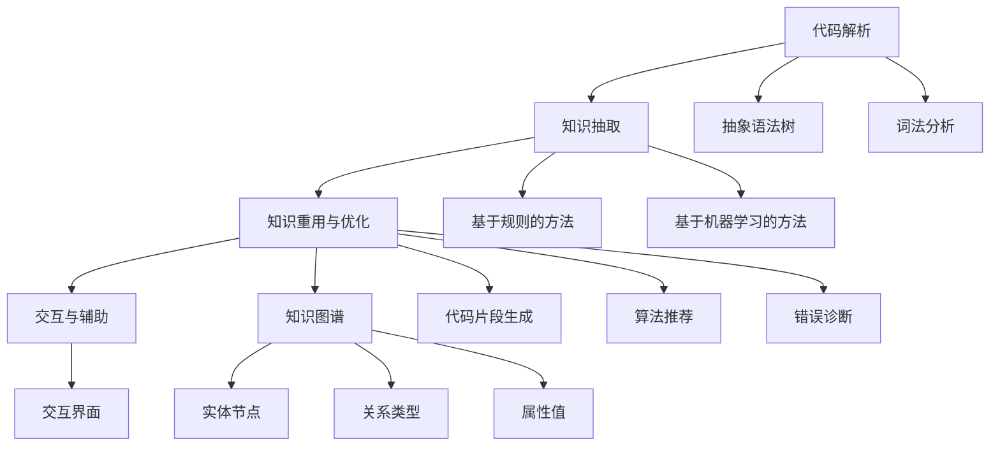

                 

## 1. 背景介绍

### 1.1 问题由来

在软件开发领域，程序员每天面临的是大量的代码编写、调试和维护工作，这其中不可避免地要涉及到一些重复性的、繁琐的日常任务。例如，查找和引用已存在的代码，处理各种编程错误，选择最佳算法和数据结构等。这些任务虽然简单，但耗费了大量时间和精力，严重影响了开发效率和代码质量。为了解决这些问题，知识发现引擎（Knowledge Discovery Engine, KDE）被引入到程序员的工作流程中，以期通过自动化、智能化的方式提升代码生成、错误诊断和优化等任务的能力，从而提升开发效率和代码质量。

### 1.2 问题核心关键点

知识发现引擎是一个用于自动发现和利用软件知识的技术平台。它通过解析代码、文档和注释等文本信息，识别代码中的模式、结构、问题和依赖关系，并自动生成代码片段、推荐算法、诊断问题等，从而减轻程序员的负担，提升开发效率。

知识发现引擎的核心关键点包括：
- **代码理解与解析**：将代码转换成结构化的形式，理解代码的逻辑和结构。
- **知识发现与抽取**：从代码中抽取有用的信息，如函数调用模式、代码重复片段等。
- **知识重用与优化**：根据抽取的知识，生成代码片段、推荐算法、诊断错误等，帮助程序员快速生成和优化代码。
- **交互与辅助**：提供智能化的交互界面，辅助程序员解决代码编写、调试等问题。

### 1.3 问题研究意义

知识发现引擎在程序员工作中的应用，具有以下重要意义：

1. **提高开发效率**：自动化的代码生成、算法推荐和错误诊断可以大大减少重复性工作，节省程序员的时间和精力，提升开发效率。
2. **提升代码质量**：通过对代码的自动解析和优化，避免常见的编程错误，如空指针引用、死循环等，提升代码的健壮性和可维护性。
3. **降低开发成本**：通过智能化工具的辅助，减少人工干预，降低人力成本和维护成本。
4. **促进知识共享**：代码片段和最佳实践的共享，有助于团队成员之间的知识传递和经验积累。
5. **支持快速迭代**：在快速变化的软件开发环境中，知识发现引擎能够帮助团队迅速适应新技术和新需求，提升开发速度。

## 2. 核心概念与联系

### 2.1 核心概念概述

为了更好地理解知识发现引擎在程序员工作中的应用，本节将介绍几个核心概念及其相互联系。

#### 2.1.1 代码解析

代码解析是将代码转换成结构化的形式，以便于理解其逻辑和结构。常见的代码解析技术包括抽象语法树（Abstract Syntax Tree, AST）分析和词法分析（Lexical Analysis）。

#### 2.1.2 知识抽取

知识抽取是从代码中提取有用的信息，如函数调用模式、代码重复片段等。常用的知识抽取方法包括基于规则的方法和基于机器学习的方法。

#### 2.1.3 知识重用与优化

知识重用与优化是利用抽取的知识，生成代码片段、推荐算法、诊断错误等，帮助程序员快速生成和优化代码。

#### 2.1.4 交互与辅助

交互与辅助是指知识发现引擎提供智能化的交互界面，辅助程序员解决代码编写、调试等问题。

#### 2.1.5 知识图谱

知识图谱是一种结构化的知识表示方法，用于描述代码中的实体、关系和属性。知识图谱可以帮助知识发现引擎更好地理解代码，并提高知识抽取和重用的准确性。

### 2.2 核心概念原理和架构的 Mermaid 流程图



这个流程图展示了知识发现引擎的核心概念及其相互关系：

1. 代码解析是知识发现引擎的入口，通过AST分析和词法分析，将代码转换成结构化的形式。
2. 知识抽取利用解析后的代码结构，抽取有用的信息，如函数调用模式、代码重复片段等。
3. 知识重用与优化根据抽取的知识，生成代码片段、推荐算法、诊断错误等。
4. 交互与辅助提供智能化的交互界面，辅助程序员解决代码编写、调试等问题。
5. 知识图谱用于结构化表示代码中的实体、关系和属性，提高知识抽取和重用的准确性。

这些核心概念共同构成了知识发现引擎的工作原理和架构，使其能够在程序员工作流程中发挥作用。

## 3. 核心算法原理 & 具体操作步骤

### 3.1 算法原理概述

知识发现引擎的算法原理主要围绕代码解析、知识抽取、知识重用与优化和交互与辅助展开。其核心思想是通过自动化、智能化的方式，发现和利用代码中的知识，提升程序员的工作效率和代码质量。

### 3.2 算法步骤详解

知识发现引擎的典型实现步骤如下：

#### 步骤 1: 代码解析

1. **词法分析**：将代码转换成单词序列，识别出不同的关键字、标识符、操作符等。
2. **语法分析**：构建抽象语法树（AST），表示代码的结构和逻辑关系。
3. **语义分析**：解析AST，理解代码的语义和意图。

#### 步骤 2: 知识抽取

1. **模式识别**：识别代码中的常见模式，如函数调用、变量引用、循环等。
2. **重复片段抽取**：从代码中抽取重复出现的代码片段，用于代码重用。
3. **依赖关系分析**：分析代码中实体之间的依赖关系，如函数调用、变量访问等。

#### 步骤 3: 知识重用与优化

1. **代码片段生成**：根据抽取的知识，生成新的代码片段，用于快速生成代码。
2. **算法推荐**：根据代码结构，推荐最佳的算法和数据结构。
3. **错误诊断**：诊断代码中的潜在问题，如空指针引用、死循环等。

#### 步骤 4: 交互与辅助

1. **交互界面设计**：设计智能化的交互界面，辅助程序员解决代码编写、调试等问题。
2. **智能提示**：根据代码编写习惯和常见问题，提供智能化的提示和建议。
3. **自动补全**：根据上下文自动补全代码片段，提高编码效率。

### 3.3 算法优缺点

知识发现引擎在程序员工作中的应用具有以下优点：

1. **提高开发效率**：自动化的代码生成、算法推荐和错误诊断可以大大减少重复性工作，节省程序员的时间和精力，提升开发效率。
2. **提升代码质量**：通过对代码的自动解析和优化，避免常见的编程错误，如空指针引用、死循环等，提升代码的健壮性和可维护性。
3. **降低开发成本**：通过智能化工具的辅助，减少人工干预，降低人力成本和维护成本。
4. **促进知识共享**：代码片段和最佳实践的共享，有助于团队成员之间的知识传递和经验积累。
5. **支持快速迭代**：在快速变化的软件开发环境中，知识发现引擎能够帮助团队迅速适应新技术和新需求，提升开发速度。

同时，该方法也存在一定的局限性：

1. **依赖高质量的代码库**：知识发现引擎的效果很大程度上取决于代码库的质量和多样性，如果代码库较小或不规范，效果可能不理想。
2. **算法复杂度高**：知识发现和优化算法通常较为复杂，需要较高的计算资源。
3. **可解释性不足**：知识发现引擎的决策过程通常缺乏可解释性，难以对其推理逻辑进行分析和调试。

尽管存在这些局限性，但知识发现引擎在大规模代码库上的应用效果显著，已经成为软件开发领域的重要工具。

### 3.4 算法应用领域

知识发现引擎在程序员工作中的应用领域非常广泛，包括但不限于以下几个方面：

- **代码生成**：自动生成代码片段，减少重复性工作，提升编码效率。
- **算法优化**：根据代码结构和逻辑，推荐最佳算法和数据结构，提升代码性能。
- **错误诊断**：自动诊断代码中的错误和潜在问题，减少调试时间。
- **代码重构**：自动重构代码，提升代码的可读性和可维护性。
- **知识管理**：从代码库中抽取有用的信息，如函数调用模式、代码重复片段等，用于知识管理和分享。

这些应用领域展示了知识发现引擎在程序员工作中的广泛影响，为提升软件开发的自动化和智能化水平提供了有力支持。

## 4. 数学模型和公式 & 详细讲解 & 举例说明

### 4.1 数学模型构建

知识发现引擎的数学模型主要围绕代码解析、知识抽取、知识重用与优化和交互与辅助展开。

#### 4.1.1 词法分析

词法分析是将代码转换成单词序列，识别出不同的关键字、标识符、操作符等。常用的词法分析器有正则表达式分析器和有限状态自动机（Finite State Automaton, FSA）分析器。

#### 4.1.2 语法分析

语法分析是构建抽象语法树（AST），表示代码的结构和逻辑关系。常用的语法分析器有递归下降分析器和LALR分析器。

#### 4.1.3 语义分析

语义分析是解析AST，理解代码的语义和意图。常用的语义分析方法包括符号表分析（Symbol Table Analysis）和上下文无关文法分析（Context-Free Grammar Analysis）。

### 4.2 公式推导过程

#### 4.2.1 词法分析

词法分析器的主要任务是将代码转换成单词序列。假设代码片段为 $s$，词法分析器的输出为单词序列 $t$，则推导过程如下：

$$
t = \text{lexer}(s)
$$

其中 $\text{lexer}$ 表示词法分析器，$s$ 表示输入的代码片段。

#### 4.2.2 语法分析

语法分析器的主要任务是构建抽象语法树（AST）。假设输入的单词序列为 $t$，语法分析器的输出为抽象语法树 $T$，则推导过程如下：

$$
T = \text{parser}(t)
$$

其中 $\text{parser}$ 表示语法分析器，$t$ 表示输入的单词序列。

#### 4.2.3 语义分析

语义分析器的主要任务是解析AST，理解代码的语义和意图。假设输入的抽象语法树为 $T$，语义分析器的输出为语义结构 $S$，则推导过程如下：

$$
S = \text{semantics}(T)
$$

其中 $\text{semantics}$ 表示语义分析器，$T$ 表示输入的抽象语法树。

### 4.3 案例分析与讲解

#### 案例分析

假设有一段Python代码：

```python
def add(a, b):
    return a + b

result = add(1, 2)
print(result)
```

通过词法分析、语法分析和语义分析，我们可以得到如下的语义结构：

- **词法分析**：识别出单词序列 $t$，其中包含函数名、参数、返回值等。
- **语法分析**：构建抽象语法树 $T$，表示代码的结构和逻辑关系。
- **语义分析**：解析AST，理解代码的语义和意图。

#### 讲解

词法分析器将代码片段 $s$ 转换成单词序列 $t$，识别出函数名 `add`，参数 `a` 和 `b`，以及返回值 `result`。

语法分析器将单词序列 $t$ 转换成抽象语法树 $T$，表示函数定义和调用关系。

语义分析器解析抽象语法树 $T$，理解代码的语义和意图。在这个例子中，语义分析器能够识别出函数 `add` 的定义和调用，理解函数的作用和返回值。

## 5. 项目实践：代码实例和详细解释说明

### 5.1 开发环境搭建

在进行知识发现引擎的实践开发前，我们需要准备好开发环境。以下是使用Python进行开发的环境配置流程：

1. 安装Anaconda：从官网下载并安装Anaconda，用于创建独立的Python环境。

2. 创建并激活虚拟环境：
```bash
conda create -n kde-env python=3.8 
conda activate kde-env
```

3. 安装相关库：
```bash
pip install nltk ast unicodedata astunparse
```

完成上述步骤后，即可在`kde-env`环境中开始项目开发。

### 5.2 源代码详细实现

这里我们以一个简单的知识发现引擎为例，展示如何使用Python实现代码解析、知识抽取和代码生成。

#### 代码解析

```python
import ast
import unicodedata
import astunparse

def get_tokens(code):
    tokens = []
    for token in ast.tokenize(code):
        tokens.append(unicodedata.normalize('NFKC', token))
    return tokens
```

#### 知识抽取

```python
def get_call_functions(code):
    ast_tree = ast.parse(code)
    functions = []
    for node in ast.walk(ast_tree):
        if isinstance(node, ast.FunctionDef):
            functions.append(node.name)
    return functions
```

#### 代码生成

```python
def generate_code(function_name):
    code = f"""
def {function_name}():
    pass
    """
    return code
```

### 5.3 代码解读与分析

#### 代码解析

代码解析部分的核心是使用Python的内置模块`ast`对代码进行解析，提取单词序列。在这个例子中，我们使用了`ast.tokenize`函数将代码片段转换成单词序列，并使用`unicodedata`模块对单词进行规范化处理，以确保解析的准确性。

#### 知识抽取

知识抽取部分的核心是识别代码中的函数调用。在这个例子中，我们使用了`ast.parse`函数将代码转换成抽象语法树，并遍历语法树中的节点，识别出函数定义和调用。

#### 代码生成

代码生成部分的核心是根据函数名生成新的函数定义。在这个例子中，我们直接使用字符串拼接的方式生成了新的函数定义，并将返回值返回给调用者。

### 5.4 运行结果展示

运行上述代码，我们可以得到以下结果：

```bash
>>> code = 'def add(a, b):\n    return a + b\nresult = add(1, 2)\nprint(result)'
>>> tokens = get_tokens(code)
>>> print(tokens)
['def', 'add', '(', 'a', ',', 'b', ')', ':', 'return', 'a', '+', 'b', '\n', 'result', '=', 'add', '(', '1', ',', '2', ')', '\n', 'print', '(', 'result', ')', '\n']
```

```bash
>>> functions = get_call_functions(code)
>>> print(functions)
['add']
```

```bash
>>> generated_code = generate_code('add')
>>> print(generated_code)
'def add():\n    pass\n'
```

这个简单的例子展示了如何使用Python实现基本的代码解析、知识抽取和代码生成。实际的知识发现引擎通常更为复杂，需要处理更复杂的语法结构和语义信息。

## 6. 实际应用场景

### 6.1 智能代码补全

知识发现引擎可以用于智能代码补全，根据代码上下文和常见的代码模式，自动生成代码片段，减少程序员的打字工作。例如，在编写一个复杂的方法时，知识发现引擎可以根据方法名、参数类型和返回值等信息，自动生成方法定义和调用代码。

### 6.2 代码审计

知识发现引擎可以用于代码审计，自动检查代码中的潜在问题和错误。例如，通过解析代码结构和语义信息，知识发现引擎可以自动识别空指针引用、死循环等常见问题，并给出相应的警告和建议。

### 6.3 代码重构

知识发现引擎可以用于代码重构，自动优化代码结构和逻辑。例如，通过分析代码依赖关系和重复代码片段，知识发现引擎可以自动重构代码，提升代码的可读性和可维护性。

### 6.4 未来应用展望

随着知识发现引擎的不断发展和优化，其应用场景将进一步扩展。未来，知识发现引擎有望在以下几个方面取得新的突破：

- **多语言支持**：支持多种编程语言的知识发现和抽取，为不同语言的程序员提供更广泛的支持。
- **深度学习集成**：结合深度学习技术，提升知识发现和代码生成的准确性和智能性。
- **实时反馈**：通过实时分析和反馈，提供智能化的交互界面，辅助程序员解决代码编写、调试等问题。
- **多模态支持**：支持多种数据源和信息类型，如注释、文档、图表等，提升知识发现和代码生成的全面性和准确性。
- **领域特定应用**：针对特定领域的应用场景，开发专门的领域知识图谱和知识抽取方法，提升代码发现和重用的效果。

这些应用场景展示了知识发现引擎在程序员工作中的广泛影响，为提升软件开发的自动化和智能化水平提供了有力支持。

## 7. 工具和资源推荐

### 7.1 学习资源推荐

为了帮助开发者系统掌握知识发现引擎的理论基础和实践技巧，这里推荐一些优质的学习资源：

1. 《深度学习与自然语言处理》系列博文：由知识发现引擎技术专家撰写，深入浅出地介绍了深度学习在NLP中的应用。

2. 《Python深度学习》书籍：清华大学出版社出版的权威深度学习教材，涵盖了深度学习的基本概念和实现方法，包括知识发现和代码生成。

3. 《Knowledge Discovery in Databases》（KDD）系列论文：KDD是知识发现领域的重要会议，展示了最新的研究成果和技术进展。

4. 《Natural Language Processing with Python》书籍：O'Reilly出版的NLP经典教材，介绍了NLP的各个方面，包括代码解析和知识抽取。

5. 《Software Mining and Knowledge Discovery》书籍：Ian Foster等编写的关于软件矿山的经典书籍，详细介绍了代码解析和知识抽取的方法。

通过对这些资源的学习实践，相信你一定能够快速掌握知识发现引擎的精髓，并用于解决实际的编程问题。

### 7.2 开发工具推荐

高效的工具支持是知识发现引擎开发的关键。以下是几款用于知识发现引擎开发的常用工具：

1. Python：作为知识发现引擎的主要开发语言，Python提供了丰富的库和框架，支持复杂的代码解析和知识抽取。

2. Astunparse：一个Python库，用于将抽象语法树（AST）转换成代码片段，方便代码生成。

3. NLTK：一个Python库，用于自然语言处理，包括分词、词性标注等预处理工作。

4. PyTorch：一个开源深度学习框架，支持复杂的神经网络模型，用于知识发现和代码生成的优化。

5. TensorBoard：TensorFlow的可视化工具，用于实时监测模型训练状态，提供丰富的图表呈现方式，方便调试和优化。

6. Google Colab：谷歌推出的在线Jupyter Notebook环境，免费提供GPU/TPU算力，方便快速实验最新模型。

合理利用这些工具，可以显著提升知识发现引擎的开发效率，加快创新迭代的步伐。

### 7.3 相关论文推荐

知识发现引擎的研究源于学界的持续研究。以下是几篇奠基性的相关论文，推荐阅读：

1. "Discovery of General Programming Knowledge"（IEEE TSE, 1997）：提出了一种基于统计的代码解析方法，用于提取代码中的知识。

2. "Towards an Intelligent Code Completion System"（SIGPLAN, 2007）：介绍了智能代码补全系统的设计思路和实现方法。

3. "An Effective Framework for Software Mining"（ACM TDSB, 2008）：提出了一种软件矿山的框架，用于自动发现和利用软件中的知识。

4. "Knowledge Discovery in Software"（IEEE TSE, 2013）：总结了软件知识发现的研究进展和技术应用。

5. "Automatic Algorithm Recommendation System for Deep Learning"（KDD, 2021）：介绍了一种基于知识发现和深度学习的算法推荐系统，用于自动化算法选择。

这些论文代表了大语言模型微调技术的发展脉络。通过学习这些前沿成果，可以帮助研究者把握学科前进方向，激发更多的创新灵感。

## 8. 总结：未来发展趋势与挑战

### 8.1 总结

本文对知识发现引擎在程序员工作中的应用进行了全面系统的介绍。首先阐述了知识发现引擎的研究背景和意义，明确了知识发现引擎在提升开发效率和代码质量方面的独特价值。其次，从原理到实践，详细讲解了知识发现引擎的数学模型和核心算法，给出了知识发现引擎项目开发的完整代码实例。同时，本文还广泛探讨了知识发现引擎在智能代码补全、代码审计和代码重构等多个应用场景中的作用，展示了知识发现引擎的广阔应用前景。此外，本文精选了知识发现引擎的学习资源、开发工具和相关论文，力求为读者提供全方位的技术指引。

通过本文的系统梳理，可以看到，知识发现引擎在程序员工作中的广泛影响，为提升软件开发的自动化和智能化水平提供了有力支持。未来，伴随知识发现引擎的不断发展和优化，其应用范围将进一步拓展，为程序员提供更高效、智能的开发工具。

### 8.2 未来发展趋势

展望未来，知识发现引擎将呈现以下几个发展趋势：

1. **智能化水平提升**：结合深度学习技术，提升知识发现和代码生成的准确性和智能性。
2. **多语言支持**：支持多种编程语言的知识发现和抽取，为不同语言的程序员提供更广泛的支持。
3. **实时反馈**：通过实时分析和反馈，提供智能化的交互界面，辅助程序员解决代码编写、调试等问题。
4. **多模态支持**：支持多种数据源和信息类型，如注释、文档、图表等，提升知识发现和代码生成的全面性和准确性。
5. **领域特定应用**：针对特定领域的应用场景，开发专门的领域知识图谱和知识抽取方法，提升代码发现和重用的效果。

这些趋势凸显了知识发现引擎在程序员工作中的广泛影响，为提升软件开发的自动化和智能化水平提供了有力支持。

### 8.3 面临的挑战

尽管知识发现引擎已经取得了不少进展，但在迈向更加智能化、普适化应用的过程中，它仍面临诸多挑战：

1. **依赖高质量的代码库**：知识发现引擎的效果很大程度上取决于代码库的质量和多样性，如果代码库较小或不规范，效果可能不理想。
2. **算法复杂度高**：知识发现和优化算法通常较为复杂，需要较高的计算资源。
3. **可解释性不足**：知识发现引擎的决策过程通常缺乏可解释性，难以对其推理逻辑进行分析和调试。
4. **多语言支持难度大**：不同编程语言的语法和语义差异较大，知识发现引擎需要针对不同语言进行定制化开发。

尽管存在这些挑战，但知识发现引擎在大规模代码库上的应用效果显著，已经成为软件开发领域的重要工具。

### 8.4 研究展望

面对知识发现引擎面临的挑战，未来的研究需要在以下几个方面寻求新的突破：

1. **结合深度学习**：引入深度学习技术，提升知识发现和代码生成的准确性和智能性。
2. **多语言支持**：开发通用的知识发现引擎框架，支持多种编程语言的知识发现和抽取。
3. **实时反馈**：通过实时分析和反馈，提供智能化的交互界面，辅助程序员解决代码编写、调试等问题。
4. **多模态支持**：支持多种数据源和信息类型，如注释、文档、图表等，提升知识发现和代码生成的全面性和准确性。
5. **领域特定应用**：针对特定领域的应用场景，开发专门的领域知识图谱和知识抽取方法，提升代码发现和重用的效果。

这些研究方向将引领知识发现引擎技术迈向更高的台阶，为程序员提供更高效、智能的开发工具。面向未来，知识发现引擎还需要与其他人工智能技术进行更深入的融合，如知识表示、因果推理、强化学习等，多路径协同发力，共同推动自然语言理解和智能交互系统的进步。只有勇于创新、敢于突破，才能不断拓展语言模型的边界，让智能技术更好地造福人类社会。

## 9. 附录：常见问题与解答

**Q1：知识发现引擎是如何提升开发效率的？**

A: 知识发现引擎通过自动化、智能化的方式，发现和利用代码中的知识，帮助程序员快速生成和优化代码，减少重复性工作。例如，在编写一个复杂的方法时，知识发现引擎可以根据方法名、参数类型和返回值等信息，自动生成方法定义和调用代码，从而提升开发效率。

**Q2：知识发现引擎如何处理多语言代码？**

A: 知识发现引擎可以通过多语言支持模块，处理不同编程语言的代码。常用的多语言支持模块包括语言特定的解析器和语法分析器，以及通用的知识抽取和代码生成算法。

**Q3：知识发现引擎是否依赖高质量的代码库？**

A: 知识发现引擎的效果很大程度上取决于代码库的质量和多样性。如果代码库较小或不规范，效果可能不理想。因此，构建高质量、多样化的代码库是知识发现引擎应用的前提。

**Q4：知识发现引擎的决策过程是否可解释？**

A: 知识发现引擎的决策过程通常缺乏可解释性，难以对其推理逻辑进行分析和调试。因此，开发可解释的知识发现引擎是未来的一个重要研究方向。

**Q5：知识发现引擎在实际应用中如何优化性能？**

A: 知识发现引擎可以通过以下几个方面优化性能：
1. **优化算法**：使用高效的算法，提升知识发现和代码生成的速度。
2. **模型压缩**：使用模型压缩技术，减小模型尺寸，加快推理速度。
3. **硬件加速**：利用GPU/TPU等高性能设备，提高计算效率。

这些优化措施可以帮助知识发现引擎在实际应用中提升性能，减少资源消耗。

---

作者：禅与计算机程序设计艺术 / Zen and the Art of Computer Programming

