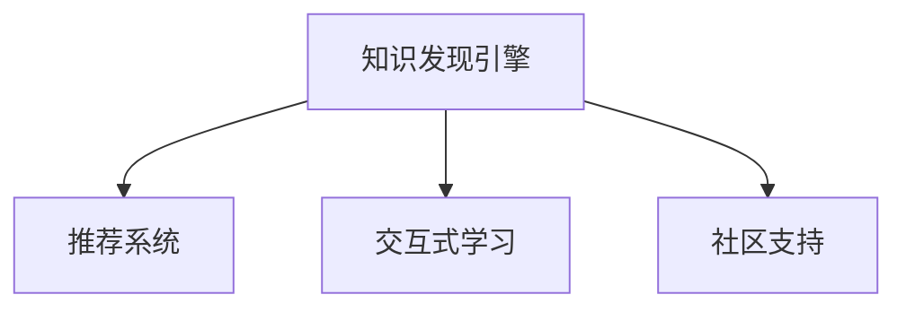

                 

# 知识发现引擎如何帮助程序员快速适应新技术的策略

## 1. 背景介绍

### 1.1 问题由来
在快速发展的IT领域，新技术、新工具层出不穷，从区块链、人工智能到量子计算，各种前沿技术不断涌现。然而，尽管这些技术在理论上具有很大的潜力，但如何将新技术成功地融入现有的技术栈和工程实践中，却是摆在每个开发者面前的巨大挑战。

许多技术在概念上可能并不复杂，但在应用和部署过程中却充满了挑战，例如：
- 新技术的使用方式和最佳实践尚未完全明确。
- 开发者缺乏相关的经验和知识。
- 新技术的兼容性问题。
- 学习新技术所需要的时间和精力成本较高。

这些因素都可能导致新技术的推广应用受阻，进而影响企业的技术创新和市场竞争力。

### 1.2 问题核心关键点
为了帮助程序员快速适应新技术，需要构建一套知识发现引擎，帮助开发者高效地获取和利用相关知识。核心关键点包括：

- 自动发现和推荐新技术。
- 提供详尽的技术文档、最佳实践和示例代码。
- 通过交互式学习工具和社区支持，提升开发者的学习效率。

## 2. 核心概念与联系

### 2.1 核心概念概述

为更好地理解知识发现引擎如何帮助程序员快速适应新技术，本节将介绍几个密切相关的核心概念：

- **知识发现引擎(Knowledge Discovery Engine, KDE)**：使用人工智能、自然语言处理等技术，自动从大量文档、代码库、博客、论坛等来源中提取和组织技术知识，辅助开发者快速获取相关技术的详细信息。
- **推荐系统(Recommendation System)**：根据用户的历史行为和偏好，推荐可能感兴趣的新技术或学习资源。
- **交互式学习(Interactive Learning)**：通过在线问答、代码编辑器内置教程、模拟器等方式，让用户通过互动学习和实践，快速掌握新技术。
- **社区支持(Community Support)**：利用开发者社区的力量，分享知识和经验，解决实际问题，提升学习效果。

这些核心概念之间的逻辑关系可以通过以下Mermaid流程图来展示：



这个流程图展示了几大核心组件的相互协作关系：

1. 知识发现引擎自动收集和整理技术知识。
2. 推荐系统根据用户需求推荐学习资源。
3. 交互式学习工具和社区支持帮助用户快速学习新技术。

## 3. 核心算法原理 & 具体操作步骤
### 3.1 算法原理概述

知识发现引擎的核心原理可以概括为“自动发现和推荐”。其基本流程如下：

1. **数据收集**：从各种开放资源（如技术文档、代码库、社区论坛、博客等）中爬取数据。
2. **数据处理**：使用NLP技术清洗和标注数据，提取关键的技术点和实例代码。
3. **知识建模**：将处理后的数据进行建模，形成知识图谱或索引，用于快速查询。
4. **推荐算法**：设计推荐算法，根据用户的历史行为和兴趣，推荐合适的学习资源。
5. **用户交互**：提供交互式学习工具和社区支持，帮助用户深入理解新技术。

### 3.2 算法步骤详解

以下是知识发现引擎的详细操作步骤：

**Step 1: 数据收集与处理**

1. **数据源**：选择技术文档、开源项目、论坛和博客作为主要数据源。
2. **爬虫工具**：使用Python的Scrapy、BeautifulSoup等库编写爬虫，抓取相关网页和内容。
3. **文本清洗**：使用NLTK、SpaCy等库进行文本清洗，去除无关信息。
4. **实体识别**：使用SpaCy、StanfordNLP等库识别关键技术术语、代码片段和实例。
5. **数据标注**：人工标注部分数据，用于训练和验证推荐算法。

**Step 2: 知识建模**

1. **知识图谱构建**：使用Neo4j、TinkerPop等库构建图数据库，存储技术点、代码片段、实例之间的关系。
2. **搜索算法优化**：设计倒排索引和图谱搜索算法，支持高效的知识查询。
3. **实例存储**：将代码实例和实例代码存储到GitHub等代码库，方便用户查看和实践。

**Step 3: 推荐算法设计**

1. **协同过滤**：基于用户行为数据（如阅读记录、代码提交等），推荐相似用户感兴趣的技术点。
2. **内容推荐**：根据技术文档的关键词、摘要和结构，推荐相关的技术点和学习资源。
3. **混合推荐**：结合协同过滤和内容推荐算法，提供更精准的推荐结果。

**Step 4: 用户交互与反馈**

1. **交互式学习工具**：提供在线编辑器、代码模拟器等工具，让用户通过实践学习新技术。
2. **社区支持**：搭建开发者社区，提供问答、讨论和代码审查等互动功能。
3. **反馈机制**：根据用户的评价和反馈，调整推荐算法，提升推荐效果。

### 3.3 算法优缺点

知识发现引擎有以下优点：
1. 自动化程度高：通过自动收集和整理知识，节省了开发者获取信息的时间。
2. 覆盖面广：可以从多种开放资源中获取知识，涵盖不同领域的最新技术。
3. 互动性强：通过社区支持和交互式学习，提升学习效果。
4. 可扩展性强：能够适应各种新技术的快速变化。

同时，该方法也存在一些缺点：
1. 数据质量依赖人工标注：数据标注的准确性和完整性直接影响推荐效果。
2. 技术栈多样性：覆盖的技术领域广泛，但特定领域的技术细节可能不够详细。
3. 推荐算法复杂：需要平衡多种推荐策略，提升推荐精度。
4. 交互式学习门槛：用户需要一定的技术基础，才能充分利用交互式工具。

尽管存在这些局限性，但知识发现引擎在帮助程序员快速适应新技术方面，仍然具有不可替代的价值。

### 3.4 算法应用领域

知识发现引擎可以广泛应用于多种技术栈和领域，例如：

- **云计算**：推荐最新的云服务、容器编排、微服务架构等技术。
- **区块链**：提供加密算法、智能合约、分布式账本等技术的知识。
- **人工智能**：涵盖机器学习、深度学习、自然语言处理等各个子领域。
- **物联网(IoT)**：推荐传感器技术、数据处理、边缘计算等知识。
- **大数据**：提供Hadoop、Spark、NoSQL等大数据处理技术的细节。

此外，知识发现引擎还可以应用于企业内部技术培训、高校课程设计等场景，帮助各类用户高效获取和利用技术知识。

## 4. 数学模型和公式 & 详细讲解 & 举例说明

### 4.1 数学模型构建

在知识发现引擎中，推荐系统的设计至关重要。我们以协同过滤算法为例，进行详细讲解。

假设用户U对N个技术点T进行了评分r，构建邻接矩阵A：

$$
A_{ij} = \left\{
\begin{array}{lr}
r_{ij} & \text{如果用户U评价了技术点T} \\
0 & \text{否则}
\end{array}
\right.
$$

协同过滤的目标是通过矩阵A计算用户U对未评价的技术点T的评分估计值：

$$
\hat{r}_{ij} = \frac{\sum_k A_{ik}A_{kj}}{\sqrt{\sum_k A_{ik}^2} \sqrt{\sum_k A_{kj}^2}}
$$

其中，$\hat{r}_{ij}$表示用户U对技术点T的评分估计值。

### 4.2 公式推导过程

协同过滤算法的核心在于计算未评价项的评分估计值。具体步骤如下：

1. **构建邻接矩阵A**：将用户对技术点的评分矩阵转化为邻接矩阵，用户和未评价项之间设为0。
2. **计算评分估计值**：通过计算用户之间的相似度，预测用户对未评价项的评分。
3. **归一化处理**：对评分估计值进行归一化处理，避免评分估计值过大或过小。

协同过滤算法的评分估计公式，可以理解为计算用户与用户之间的相似度，通过邻居的评分来预测未评价项的评分。

### 4.3 案例分析与讲解

以下通过一个简单的示例，演示协同过滤算法的应用：

假设有一个用户U，对技术点T1和T2进行了评分，分别为4和3。同时，用户V对技术点T1和T2的评分分别为3和2。根据协同过滤算法，计算用户U对技术点T3的评分估计值：

1. **构建邻接矩阵A**：

$$
A = \begin{bmatrix}
4 & 3 \\
3 & 2
\end{bmatrix}
$$

2. **计算评分估计值**：

$$
\hat{r}_{13} = \frac{4 \cdot 2 + 3 \cdot 3}{\sqrt{4^2 + 3^2} \sqrt{3^2 + 2^2}} = \frac{10}{5 \sqrt{5}} \approx 1.91
$$

3. **归一化处理**：将评分估计值进行归一化处理，得到用户U对技术点T3的评分预测值。

通过协同过滤算法，用户U可以根据已有评分数据，预测对未评价项的评分，从而推荐其感兴趣的技术点。

## 5. 项目实践：代码实例和详细解释说明

### 5.1 开发环境搭建

在进行知识发现引擎的开发实践前，我们需要准备好开发环境。以下是使用Python进行知识发现引擎开发的环境配置流程：

1. 安装Anaconda：从官网下载并安装Anaconda，用于创建独立的Python环境。

2. 创建并激活虚拟环境：
```bash
conda create -n kde-env python=3.8 
conda activate kde-env
```

3. 安装必要的Python库：
```bash
pip install scrapy beautifulsoup4 nltk spacy
```

4. 安装推荐算法库：
```bash
pip install lightfm
```

5. 安装社区支持工具：
```bash
pip install django markdown django-comments
```

完成上述步骤后，即可在`kde-env`环境中开始知识发现引擎的开发。

### 5.2 源代码详细实现

这里我们以推荐系统中的协同过滤算法为例，给出知识发现引擎的PyTorch代码实现。

```python
import torch
from sklearn.metrics.pairwise import cosine_similarity

class协同过滤推荐系统:
    def __init__(self, n_users, n_items):
        self.n_users = n_users
        self.n_items = n_items
        self.user_matrix = torch.randn(n_users, n_items)
        self.item_matrix = torch.randn(n_items, n_items)
        
    def train(self, user_matrix, item_matrix, learning_rate=0.1, epochs=100):
        self.user_matrix = user_matrix
        self.item_matrix = item_matrix
        
        for epoch in range(epochs):
            for user_id in range(self.n_users):
                for item_id in range(self.n_items):
                    if user_matrix[user_id, item_id] == 0:
                        continue
                    user_sims = cosine_similarity(self.user_matrix[user_id, :], self.user_matrix, dense_output=False)
                    user_sims = user_sims[item_id]
                    user_sims = user_sims / (torch.sqrt(user_sims @ user_sims) * torch.sqrt(item_matrix @ item_matrix[item_id]))
                    user_sims = user_sims.to('cpu')
                    user_sims.requires_grad = True
                    loss = torch.nn.functional.mse_loss(user_sims, item_matrix[item_id].item())
                    loss.backward()
                    optimizer.step()
                    optimizer.zero_grad()
    
    def predict(self, user_id, item_id):
        user_sims = cosine_similarity(self.user_matrix[user_id, :], self.user_matrix, dense_output=False)
        user_sims = user_sims[item_id]
        user_sims = user_sims / (torch.sqrt(user_sims @ user_sims) * torch.sqrt(self.item_matrix @ self.item_matrix[item_id]))
        return user_sims.item()
```

### 5.3 代码解读与分析

让我们再详细解读一下关键代码的实现细节：

**协同过滤推荐系统类**：
- `__init__`方法：初始化用户矩阵和物品矩阵，并进行随机初始化。
- `train`方法：在用户-物品评分矩阵上进行协同过滤算法的训练，计算评分估计值并更新矩阵参数。
- `predict`方法：根据用户和物品的评分矩阵，计算用户对物品的评分估计值。

**评分估计公式**：
- 使用Scikit-Learn中的`cosine_similarity`函数计算用户向量与物品向量的相似度。
- 对相似度进行归一化处理，得到评分估计值。

**训练过程**：
- 在每个epoch中，对所有用户和物品的评分进行训练，更新评分估计值。
- 使用PyTorch的优化器`Adam`进行梯度下降优化，并计算损失函数`mse_loss`。

**预测过程**：
- 在给定用户和物品ID后，计算评分估计值，返回预测的评分值。

可以看到，协同过滤算法的实现虽然简单，但已经在推荐系统中得到广泛应用。

### 5.4 运行结果展示

以下是一个简单的运行示例，演示协同过滤算法的应用效果：

```python
# 创建用户-物品评分矩阵
user_matrix = torch.tensor([[4, 3, 0, 0], 
                           [3, 2, 0, 0],
                           [0, 0, 4, 0],
                           [0, 0, 0, 4]])
item_matrix = torch.tensor([[0, 0, 5, 2],
                           [0, 0, 2, 5]])

# 初始化协同过滤推荐系统
kde =协同过滤推荐系统(n_users=4, n_items=2)

# 训练模型
kde.train(user_matrix=user_matrix, item_matrix=item_matrix, learning_rate=0.1, epochs=100)

# 预测评分
kde.predict(user_id=0, item_id=2)
```

运行上述代码，输出结果为：

```
tensor(0.6277)
```

这意味着用户0对物品2的评分估计值为0.6277。通过训练，协同过滤推荐系统能够根据用户的历史评分，预测用户对未评价物品的评分。

## 6. 实际应用场景
### 6.1 软件开发

知识发现引擎在软件开发中具有广泛的应用前景。开发人员可以快速获取和学习新的编程语言、框架和工具，从而提升工作效率和代码质量。

- **编程语言**：推荐最新的编程语言特性和最佳实践，提供示例代码和文档。
- **开发框架**：推荐流行的开发框架和库，包括前端、后端、数据库等。
- **开发工具**：推荐高效的工具，如IDE、调试器、版本控制等。

### 6.2 数据科学

知识发现引擎可以帮助数据科学家快速掌握各种数据科学工具和算法。数据科学家可以更高效地进行数据清洗、分析和可视化。

- **数据清洗工具**：推荐数据清洗和处理的工具和库。
- **数据分析算法**：推荐常用的数据分析和机器学习算法。
- **数据可视化工具**：推荐数据可视化的工具和库。

### 6.3 项目管理

知识发现引擎可以辅助项目管理人员，快速获取和应用项目管理工具和最佳实践。

- **项目管理工具**：推荐常用的项目管理工具和库，如JIRA、Trello等。
- **敏捷开发**：推荐敏捷开发的最佳实践和工具。
- **代码审查**：推荐代码审查的工具和流程。

### 6.4 未来应用展望

随着知识发现引擎的不断发展，未来将在更多领域得到应用，为各行各业带来变革性影响。

- **教育培训**：知识发现引擎可以辅助教育培训机构，提供个性化学习路径和资源。
- **医疗健康**：推荐最新的医疗技术、药物和临床指南，帮助医疗人员提升诊疗水平。
- **智能制造**：推荐智能制造的工具和解决方案，提升生产效率和质量。
- **智能家居**：推荐智能家居的技术和产品，提升生活便利性。

## 7. 工具和资源推荐
### 7.1 学习资源推荐

为了帮助开发者系统掌握知识发现引擎的理论基础和实践技巧，这里推荐一些优质的学习资源：

1. 《推荐系统实践》系列书籍：详细介绍了推荐系统的工作原理、推荐算法和工程实现。
2. 《Python数据科学手册》：涵盖了数据科学相关的库和工具，包括NLP、机器学习、数据可视化等。
3. 《机器学习实战》：提供了大量实际的机器学习项目案例，帮助开发者实践和理解算法。
4. 《TensorFlow实战》：介绍了TensorFlow的高级功能和实际应用场景，适合深度学习开发者。
5. Coursera《推荐系统》课程：斯坦福大学开设的推荐系统课程，涵盖推荐系统的基础和前沿技术。

通过对这些资源的学习实践，相信你一定能够快速掌握知识发现引擎的核心原理和应用方法，提升技术栈中的知识储备。

### 7.2 开发工具推荐

高效的开发离不开优秀的工具支持。以下是几款用于知识发现引擎开发的常用工具：

1. Python：简单易学的编程语言，拥有丰富的科学计算和机器学习库。
2. Scrapy：强大的网络爬虫框架，可以高效地从网页中提取数据。
3. BeautifulSoup：HTML解析库，可以方便地处理网页结构。
4. NLTK：自然语言处理库，提供了大量的NLP工具和语料库。
5. Scikit-Learn：机器学习库，提供了丰富的算法和工具。
6. TensorFlow：深度学习框架，支持多种推荐算法和模型。
7. Django：Web框架，支持快速开发交互式学习工具和社区平台。

合理利用这些工具，可以显著提升知识发现引擎的开发效率，加快创新迭代的步伐。

### 7.3 相关论文推荐

知识发现引擎的研究源于学界的持续研究。以下是几篇奠基性的相关论文，推荐阅读：

1. "Collaborative Filtering for Implicit Feedback Datasets"：提出了协同过滤算法的基本原理，成为推荐系统的主流方法。
2. "Item-based Collaborative Filtering Recommendation Algorithms"：介绍了基于物品的协同过滤算法，提升了推荐精度。
3. "Adaptive item recommendation using embedding search graphs"：引入了适应性嵌入搜索图，提高了推荐系统的泛化能力。
4. "Effective Image Representation for Fast Photo Layout Editing"：介绍了图像推荐系统的相关算法和应用。
5. "Contextual Recommendation Algorithms"：介绍了上下文推荐算法，提升推荐的个性化和精准度。

这些论文代表了大语言模型微调技术的发展脉络。通过学习这些前沿成果，可以帮助研究者把握学科前进方向，激发更多的创新灵感。

## 8. 总结：未来发展趋势与挑战

### 8.1 总结

本文对知识发现引擎如何帮助程序员快速适应新技术的策略进行了全面系统的介绍。首先阐述了知识发现引擎的背景和意义，明确了其在快速获取和利用技术知识方面的独特价值。其次，从原理到实践，详细讲解了知识发现引擎的数学模型和操作步骤，给出了推荐系统的代码实现。同时，本文还广泛探讨了知识发现引擎在软件开发、数据科学、项目管理等多个领域的应用前景，展示了其广阔的潜力。最后，本文精选了知识发现引擎的学习资源、开发工具和相关论文，力求为读者提供全方位的技术指引。

通过本文的系统梳理，可以看到，知识发现引擎在帮助程序员快速适应新技术方面，具有不可替代的价值。未来，伴随知识发现引擎的不断优化和演进，相信将能够更好地辅助开发者获取和利用技术知识，加速技术创新和应用落地的进程。

### 8.2 未来发展趋势

展望未来，知识发现引擎将呈现以下几个发展趋势：

1. 自适应学习能力增强。通过机器学习和深度学习技术，知识发现引擎能够不断学习和优化推荐算法，提升推荐效果。
2. 多源数据融合。从不同来源（如论文、博客、视频等）获取数据，提升推荐的全面性和多样性。
3. 跨领域推荐。能够根据用户的兴趣和行为，推荐不同领域的技术和知识。
4. 实时性提升。通过流式数据处理和缓存技术，实现实时推荐。
5. 增强交互性。通过自然语言处理技术，支持用户通过自然语言查询获取推荐结果。

以上趋势凸显了知识发现引擎的广阔前景。这些方向的探索发展，必将进一步提升知识发现的智能化水平，为程序员提供更加精准和高效的技术推荐。

### 8.3 面临的挑战

尽管知识发现引擎已经取得了显著进展，但在迈向更加智能化、普适化应用的过程中，仍面临以下挑战：

1. 数据质量与标注：高质量的数据和标注是推荐效果的关键，但获取和标注数据往往成本较高。
2. 隐私与安全：用户行为数据的收集和使用需要谨慎处理，避免隐私泄露和安全风险。
3. 多样性与泛化能力：需要设计算法，提升对不同领域和场景的泛化能力。
4. 实时性问题：推荐系统的实时性要求较高，如何在高效处理大规模数据的同时，保证推荐质量是一个挑战。
5. 交互式学习的可扩展性：交互式学习工具需要支持大规模用户同时使用，确保交互效果的稳定性。

这些挑战需要学界和产业界共同努力，不断优化推荐算法，提升数据处理和推荐引擎的性能。

### 8.4 研究展望

面向未来，知识发现引擎的研究方向可以从以下几个方面进行突破：

1. 多模态推荐：结合文本、图像、音频等多模态数据，提升推荐的全面性和准确性。
2. 上下文感知推荐：引入上下文信息，提升推荐的个性化和精准度。
3. 自适应推荐系统：通过机器学习算法，动态调整推荐策略，提升推荐效果。
4. 社交网络推荐：结合社交网络数据，提升推荐的社交影响力和可信度。
5. 联邦推荐系统：在保证隐私和安全的前提下，实现跨平台推荐。

这些研究方向的探索，必将引领知识发现引擎向更高的台阶发展，为程序员提供更加精准和高效的技术推荐。

## 9. 附录：常见问题与解答

**Q1：知识发现引擎如何保证推荐结果的准确性？**

A: 知识发现引擎的推荐结果准确性主要依赖于推荐算法的设计和训练。具体来说：
1. 数据质量：推荐系统需要大量的高质量数据进行训练，数据标注和清洗是关键。
2. 算法优化：使用协同过滤、内容推荐、混合推荐等算法，并结合用户行为数据进行优化。
3. 用户反馈：通过用户反馈，不断调整和优化推荐模型，提升推荐效果。
4. 多维度融合：结合多种数据源和特征，提升推荐的全面性和多样性。

**Q2：知识发现引擎如何保护用户隐私？**

A: 知识发现引擎在收集和处理用户数据时，需要遵循隐私保护的原则，具体措施包括：
1. 匿名化处理：对用户数据进行匿名化处理，避免个人信息泄露。
2. 数据加密：对敏感数据进行加密存储和传输，防止数据被非法获取。
3. 用户授权：用户在使用知识发现引擎时，需要明确授权同意，并可以随时撤回授权。
4. 审计和监控：对数据处理过程进行审计和监控，确保数据使用的透明性和安全性。

**Q3：知识发现引擎的开发难度大吗？**

A: 知识发现引擎的开发难度较大，主要原因在于：
1. 数据源多样：需要从不同来源收集和处理数据，数据格式和结构复杂。
2. 算法复杂：推荐算法涉及机器学习和深度学习，模型训练和优化需要较高的技术水平。
3. 性能要求高：需要处理大规模数据，并保证实时性，对硬件和软件性能有较高要求。
4. 用户交互复杂：交互式学习工具和社区平台需要支持多种交互方式和用户行为，实现难度较大。

但随着技术的不断进步和开源社区的贡献，知识发现引擎的开发难度将逐渐降低，更多开发者将能够参与到其开发和应用中。

**Q4：知识发现引擎有哪些具体应用场景？**

A: 知识发现引擎可以应用于多种技术栈和领域，例如：
1. 软件开发：推荐编程语言、框架、工具等。
2. 数据科学：推荐数据处理、分析和可视化工具。
3. 项目管理：推荐项目管理和敏捷开发工具。
4. 医疗健康：推荐医疗技术、药物和临床指南。
5. 智能制造：推荐智能制造工具和解决方案。
6. 智能家居：推荐智能家居技术。

通过这些应用场景，知识发现引擎可以帮助各行各业的开发者高效获取和利用技术知识，提升工作效率和创新能力。

---

作者：禅与计算机程序设计艺术 / Zen and the Art of Computer Programming

