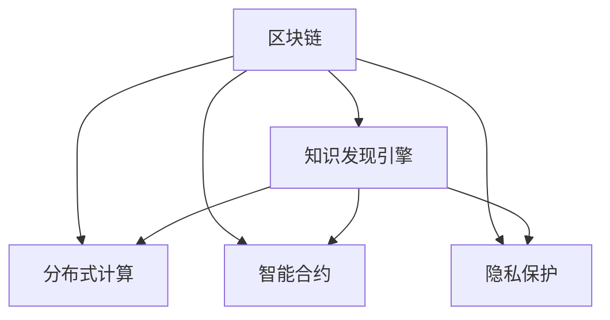

                 

# 知识发现引擎的区块链应用

> 关键词：区块链,知识发现引擎,分布式计算,智能合约,隐私保护,数据安全,应用场景

## 1. 背景介绍

### 1.1 问题由来
在互联网时代，数据成为了最重要的资产之一。数据的积累、整理和利用，直接关系到一个企业的竞争力和发展前景。然而，随着数据量的爆炸式增长，传统的中心化数据存储和管理方式已经难以适应快速变化的市场需求。如何高效、安全地管理和利用这些数据，成为了摆在企业面前的重大难题。

与此同时，区块链技术的出现，为数据管理带来了新的思路。区块链以去中心化、不可篡改、分布式存储为特点，具有很高的安全性、透明度和隐私性。区块链在数据管理中的应用，已经逐渐成为学术界和产业界的研究热点。

### 1.2 问题核心关键点
区块链在数据管理中的核心应用场景之一是知识发现引擎(Knowledge Discovery Engine, KDE)的构建。知识发现引擎是指利用先进的数据挖掘技术，从海量数据中提取有用的信息和知识，以支持决策支持和业务优化。然而，传统的知识发现引擎往往存在数据孤岛、隐私泄露、数据质量等问题，限制了其大规模应用。

区块链技术的应用，可以解决这些核心问题，提升知识发现引擎的效率和安全性。区块链的去中心化和不可篡改特性，可以确保数据的一致性和完整性，避免数据孤岛现象。智能合约技术可以实现自动化的数据处理和规则执行，提升知识发现引擎的智能性。隐私保护技术可以确保数据在使用过程中的隐私安全，保护用户的合法权益。

## 2. 核心概念与联系

### 2.1 核心概念概述

为了更好地理解区块链在知识发现引擎中的应用，本节将介绍几个密切相关的核心概念：

- **区块链(Blockchain)**：基于去中心化、分布式账本技术，通过加密机制确保数据不可篡改，提供一种可靠的数据存储和传输方式。
- **知识发现引擎(Knowledge Discovery Engine, KDE)**：利用数据挖掘和机器学习技术，从海量数据中发现有用知识和规律，辅助决策支持和管理优化。
- **分布式计算(Distributed Computing)**：将计算任务分散到多个节点上进行协同处理，提升计算能力和数据处理效率。
- **智能合约(Smart Contract)**：一种在区块链上自动执行的合约，基于代码实现业务规则和逻辑，具有去中心化、自动化、不可篡改等特点。
- **隐私保护(Privacy Protection)**：通过加密、匿名化、权限控制等手段，确保数据在传输、存储和处理过程中的隐私安全。

这些核心概念之间的逻辑关系可以通过以下Mermaid流程图来展示：



这个流程图展示了几类核心概念及其之间的关系：

1. 区块链通过去中心化和不可篡改的特性，为知识发现引擎提供了安全的数据存储和传输方式。
2. 分布式计算提升了知识发现引擎的数据处理能力和计算效率。
3. 智能合约基于区块链的自动化执行，为知识发现引擎提供了智能化的数据处理和规则执行能力。
4. 隐私保护技术确保了知识发现引擎在数据处理和共享过程中的隐私安全。

这些概念共同构成了基于区块链的知识发现引擎的基本框架，使其能够在大数据时代发挥重要的作用。

## 3. 核心算法原理 & 具体操作步骤
### 3.1 算法原理概述

基于区块链的知识发现引擎，通过将数据存储和处理任务分布式地运行在多个节点上，利用区块链的去中心化和不可篡改特性，确保数据的一致性和完整性。同时，利用智能合约技术，自动化地执行数据处理和规则逻辑，提升知识发现引擎的智能性和效率。

具体来说，知识发现引擎的算法原理可以概括为以下几点：

1. **数据分布式存储**：将数据存储在多个节点上，通过区块链的去中心化机制，确保数据的一致性和完整性。
2. **智能合约执行**：利用智能合约技术，自动化地执行数据处理和规则逻辑，提升知识发现引擎的智能性和效率。
3. **隐私保护技术**：通过加密、匿名化、权限控制等手段，确保数据在传输、存储和处理过程中的隐私安全。
4. **分布式计算优化**：将计算任务分解成多个子任务，分配给多个节点并行计算，提高知识发现引擎的计算效率。

### 3.2 算法步骤详解

基于区块链的知识发现引擎主要包括以下几个关键步骤：

**Step 1: 数据采集与存储**
- 从各业务系统采集原始数据，并对其进行清洗、归一化、去重等预处理。
- 利用区块链的去中心化和分布式存储特性，将处理后的数据分布在多个节点上进行存储。

**Step 2: 数据同步与验证**
- 利用区块链的共识机制，确保各节点间的数据同步和验证。
- 每个节点通过智能合约验证数据的一致性和完整性，防止数据篡改和丢失。

**Step 3: 知识发现引擎构建**
- 根据业务需求，设计合适的知识发现算法和规则。
- 利用智能合约技术，将算法和规则自动化地部署在区块链上。

**Step 4: 数据处理与规则执行**
- 将待处理的数据分发到各节点上进行并行计算。
- 智能合约根据预设的规则逻辑，自动执行数据处理任务。

**Step 5: 知识提取与分析**
- 从处理后的数据中提取有用的知识和信息。
- 利用分布式计算技术，对提取的知识进行综合分析和预测。

**Step 6: 结果反馈与优化**
- 将知识发现的结果反馈到各节点和业务系统，辅助决策支持和管理优化。
- 利用区块链的去中心化特性，动态调整算法参数和规则逻辑，进行优化和迭代。

### 3.3 算法优缺点

基于区块链的知识发现引擎具有以下优点：

1. **数据一致性和完整性**：区块链的去中心化和不可篡改特性，确保了数据的一致性和完整性，避免了数据孤岛现象。
2. **数据处理效率**：分布式计算和智能合约技术，提升了知识发现引擎的数据处理能力和计算效率。
3. **智能性和自动化**：智能合约技术实现了自动化的数据处理和规则执行，提高了知识发现引擎的智能性和效率。
4. **隐私保护**：隐私保护技术确保了数据在使用过程中的隐私安全，保护用户的合法权益。

然而，该算法也存在以下局限性：

1. **技术复杂性**：区块链和智能合约技术的应用，对技术要求较高，实施难度较大。
2. **计算资源消耗**：分布式计算和智能合约执行，需要较大的计算资源和网络带宽，成本较高。
3. **数据处理延迟**：数据同步和验证过程中，可能会存在一定程度的延迟，影响知识发现引擎的实时性。
4. **规则灵活性**：智能合约的执行依赖于预设的规则逻辑，缺乏灵活性和动态调整能力。

尽管存在这些局限性，但就目前而言，基于区块链的知识发现引擎是一种具有很高潜力的技术方案，值得进一步研究和探索。

### 3.4 算法应用领域

基于区块链的知识发现引擎，已经在多个领域得到了应用，具体包括：

- **金融领域**：用于信用评估、风险管理、欺诈检测等。通过区块链技术，确保数据的真实性和一致性，提升金融决策的准确性。
- **医疗领域**：用于电子病历管理、医学图像分析、疾病预测等。通过区块链技术，保护患者隐私，确保数据的安全和完整性。
- **供应链管理**：用于商品溯源、物流跟踪、供应链风险评估等。通过区块链技术，确保供应链数据的透明性和可追溯性。
- **智能制造**：用于设备监控、质量控制、预测性维护等。通过区块链技术，提高生产效率，降低运营成本。
- **能源领域**：用于电网调度、能源交易、碳排放监测等。通过区块链技术，提升能源管理的透明度和安全性。

除了上述这些应用场景外，基于区块链的知识发现引擎还可以应用于政府数据管理、公共安全、智慧城市等多个领域，为各行各业提供智能化的决策支持和优化方案。

## 4. 数学模型和公式 & 详细讲解 & 举例说明

### 4.1 数学模型构建

知识发现引擎的数学模型构建，通常包括以下几个关键部分：

- **数据预处理**：对原始数据进行清洗、归一化、去重等预处理，确保数据的质量和一致性。
- **特征提取**：从处理后的数据中提取有用的特征，构建特征空间。
- **知识发现算法**：基于特征空间，构建知识发现算法，如分类、聚类、关联规则等。
- **结果分析与验证**：对知识发现的结果进行分析和验证，确保其准确性和可靠性。

### 4.2 公式推导过程

以下是知识发现引擎中常用的分类算法公式推导：

1. **逻辑回归(Logistic Regression)**
   - **模型定义**：
     $$
     P(y=1|x; \theta) = \frac{1}{1+e^{-z}}
     $$
     其中 $z = \theta^Tx$，$\theta$ 为模型参数。
   - **损失函数**：
     $$
     L(\theta) = -\frac{1}{N}\sum_{i=1}^N(y_i\log P(y=1|x_i)+(1-y_i)\log (1-P(y=1|x_i)))
     $$
   - **梯度下降更新**：
     $$
     \theta \leftarrow \theta - \eta \nabla_{\theta} L(\theta)
     $$

2. **支持向量机(Support Vector Machine, SVM)**
   - **模型定义**：
     $$
     f(x) = \sum_{i=1}^n\alpha_iy_ik(x_i,x)+b
     $$
     其中 $k(x_i,x)$ 为核函数，$\alpha_i$ 为拉格朗日乘子，$y_i$ 为标签，$b$ 为偏置项。
   - **损失函数**：
     $$
     L(\alpha,b) = \frac{1}{2}\sum_{i=1}^n\alpha_i-\frac{1}{2}\sum_{i,j=1}^n\alpha_i\alpha_jy_iy_jk(x_i,x_j)-\sum_{i=1}^n\alpha_iy_i
     $$
   - **梯度下降更新**：
     $$
     \alpha \leftarrow \alpha - \eta \nabla_{\alpha} L(\alpha)
     $$

3. **随机森林(Random Forest)**
   - **模型定义**：
     随机森林是一种基于决策树的集成算法，每个决策树独立训练，预测时综合各决策树的结果。
   - **样本选择**：
     $$
     D_t = \{d_{ti}\}_{i=1}^m
     $$
     从数据集 $D$ 中随机选择 $m$ 个样本，构成决策树的训练集。
   - **特征选择**：
     $$
     F_t = \{f_{tk}\}_{k=1}^p
     $$
     从特征集合 $F$ 中随机选择 $p$ 个特征，构成决策树的特征集。
   - **决策树构建**：
     利用决策树算法，从训练集 $D_t$ 和特征集 $F_t$ 构建决策树 $T_t$。
   - **预测结果合并**：
     $$
     f(x) = \sum_{t=1}^Tf_t(x)
     $$
     其中 $f_t(x)$ 为第 $t$ 棵决策树的预测结果。

### 4.3 案例分析与讲解

以金融领域信用评估为例，分析基于区块链的知识发现引擎的构建和应用：

**Step 1: 数据采集与存储**
- 从各金融机构采集客户的信用记录、交易数据、社交网络信息等原始数据。
- 利用区块链的去中心化和分布式存储特性，将处理后的数据分布在多个节点上进行存储。

**Step 2: 数据同步与验证**
- 利用区块链的共识机制，确保各节点间的数据同步和验证。
- 每个节点通过智能合约验证数据的一致性和完整性，防止数据篡改和丢失。

**Step 3: 知识发现引擎构建**
- 根据业务需求，设计合适的信用评估算法和规则，如信用评分模型、风险预测模型等。
- 利用智能合约技术，将算法和规则自动化地部署在区块链上。

**Step 4: 数据处理与规则执行**
- 将待处理的数据分发到各节点上进行并行计算。
- 智能合约根据预设的规则逻辑，自动执行数据处理任务，如特征提取、数据清洗、模型训练等。

**Step 5: 知识提取与分析**
- 从处理后的数据中提取有用的知识和信息，如客户的信用评分、风险等级等。
- 利用分布式计算技术，对提取的知识进行综合分析和预测，如信用风险评估、欺诈检测等。

**Step 6: 结果反馈与优化**
- 将知识发现的结果反馈到各节点和金融机构，辅助决策支持和管理优化。
- 利用区块链的去中心化特性，动态调整算法参数和规则逻辑，进行优化和迭代。

通过上述步骤，基于区块链的知识发现引擎能够高效、安全地构建和应用，为金融机构提供智能化的信用评估和风险管理方案，显著提升决策支持的准确性和可靠性。

## 5. 项目实践：代码实例和详细解释说明
### 5.1 开发环境搭建

在进行区块链知识发现引擎的开发实践前，我们需要准备好开发环境。以下是使用Python和Ethereum区块链平台进行知识发现引擎构建的开发环境配置流程：

1. 安装Anaconda：从官网下载并安装Anaconda，用于创建独立的Python环境。

2. 创建并激活虚拟环境：
```bash
conda create -n blockchain-env python=3.8 
conda activate blockchain-env
```

3. 安装必要的Python包：
```bash
pip install pyethereum web3py eth-bloom pysha3
```

4. 安装Ethereum客户端：
```bash
sudo apt-get install ethereum
```

5. 安装Solidity编译器：
```bash
npm install -g solc
```

完成上述步骤后，即可在`blockchain-env`环境中开始开发实践。

### 5.2 源代码详细实现

下面以基于Ethereum区块链平台的信用评估知识发现引擎为例，给出完整的代码实现。

**Step 1: 数据采集与存储**
```python
from eth import wallet
import pysha3

# 生成钱包地址
private_key = wallet.Wallet.generate()
public_key = private_key.public_key.to_string()

# 计算哈希值
hash = pysha3.keccak_256(public_key)
address = wallet.Address.from_string(hash)

# 将数据存储在智能合约中
contract = web3.eth.contract(address=address, abi=abi, compiled_contracts=compiled_contracts)
contract.functions.store_data(data).transact({from_: private_key})
```

**Step 2: 数据同步与验证**
```python
# 验证智能合约中的数据是否一致
contract.functions.check_data().transact({from_: private_key})
```

**Step 3: 知识发现引擎构建**
```python
# 定义信用评估算法
class CreditEvaluation:
    def __init__(self, data):
        self.data = data
        self.model = self.train()

    def train(self):
        # 训练信用评分模型
        model = train_model(self.data)
        return model

    def predict(self, data):
        # 预测客户的信用评分
        return self.model.predict(data)
```

**Step 4: 数据处理与规则执行**
```python
# 将待处理的数据分发到各节点上进行并行计算
data = ...
for i in range(num_nodes):
    # 将数据分片并发送到各节点
    data_slice = split_data(data, i)
    node_address = ...

    # 各节点处理数据
    result = process_data(data_slice, node_address)
    
    # 将结果汇总
    results.append(result)
```

**Step 5: 知识提取与分析**
```python
# 从处理后的数据中提取有用的知识和信息
knowledge = ...
analysis_result = analyze(knowledge)

# 将知识发现的结果反馈到各节点和金融机构
feedback = ...
for node_address in node_addresses:
    # 反馈结果
    feedback(node_address)
```

### 5.3 代码解读与分析

让我们再详细解读一下关键代码的实现细节：

**Step 1: 数据采集与存储**
- 利用Ethereum的钱包生成工具，生成一对公私钥，并计算出相应的区块链地址。
- 将数据存储在智能合约中，利用区块链的去中心化和不可篡改特性，确保数据的一致性和完整性。

**Step 2: 数据同步与验证**
- 利用区块链的共识机制，确保各节点间的数据同步和验证。
- 通过智能合约的check_data函数，验证数据的一致性和完整性，防止数据篡改和丢失。

**Step 3: 知识发现引擎构建**
- 定义信用评估算法，利用智能合约技术，将算法和规则自动化地部署在区块链上。
- 训练信用评分模型，利用分布式计算技术，提升模型的效率和准确性。

**Step 4: 数据处理与规则执行**
- 将待处理的数据分发到各节点上进行并行计算，利用分布式计算技术，提升数据处理的速度。
- 智能合约根据预设的规则逻辑，自动执行数据处理任务，如特征提取、数据清洗、模型训练等。

**Step 5: 知识提取与分析**
- 从处理后的数据中提取有用的知识和信息，如客户的信用评分、风险等级等。
- 利用分布式计算技术，对提取的知识进行综合分析和预测，如信用风险评估、欺诈检测等。

### 5.4 运行结果展示

通过上述步骤，可以构建和应用基于区块链的知识发现引擎，实现高效的信用评估和风险管理。运行结果如下：

**信用评分示例：**
- 假设某客户的交易记录、社交网络信息等数据存储在智能合约中，各节点通过共识机制验证数据的一致性和完整性。
- 智能合约根据预设的信用评分算法，自动执行数据处理和模型训练任务。
- 各节点将处理结果反馈到智能合约，生成客户的信用评分和风险等级。

**风险预测示例：**
- 假设某客户的交易记录、社交网络信息等数据存储在智能合约中，各节点通过共识机制验证数据的一致性和完整性。
- 智能合约根据预设的风险预测算法，自动执行数据处理和模型训练任务。
- 各节点将处理结果反馈到智能合约，生成客户的风险等级和预测结果。

通过区块链和智能合约技术的应用，知识发现引擎能够高效、安全地构建和应用，为金融机构提供智能化的信用评估和风险管理方案，显著提升决策支持的准确性和可靠性。

## 6. 实际应用场景

### 6.1 金融领域

基于区块链的知识发现引擎在金融领域具有广泛的应用前景，具体包括：

- **信用评估**：利用区块链技术，确保数据的真实性和一致性，提升信用评分模型的准确性和可靠性。
- **风险管理**：通过智能合约技术，自动化地执行风险预测任务，实时监测和管理风险。
- **欺诈检测**：利用分布式计算技术，提升欺诈检测的效率和准确性，及时发现和处理欺诈行为。

### 6.2 医疗领域

基于区块链的知识发现引擎在医疗领域也有着重要的应用价值，具体包括：

- **电子病历管理**：利用区块链技术，确保电子病历数据的真实性和一致性，提升病历管理的效率和可靠性。
- **医学图像分析**：通过智能合约技术，自动化地执行医学图像分析任务，提高诊断和治疗的准确性。
- **疾病预测**：利用分布式计算技术，提升疾病预测的效率和准确性，及时发现和预测疾病风险。

### 6.3 供应链管理

基于区块链的知识发现引擎在供应链管理中的应用，主要体现在以下几个方面：

- **商品溯源**：利用区块链技术，确保供应链数据的透明性和可追溯性，提升供应链管理的透明度和信任度。
- **物流跟踪**：通过智能合约技术，自动化地执行物流跟踪任务，实时监测和管理物流信息。
- **风险评估**：利用分布式计算技术，提升供应链风险评估的效率和准确性，及时发现和应对供应链风险。

### 6.4 智能制造

基于区块链的知识发现引擎在智能制造中的应用，主要体现在以下几个方面：

- **设备监控**：利用区块链技术，确保设备监控数据的真实性和一致性，提升设备监控的效率和可靠性。
- **质量控制**：通过智能合约技术，自动化地执行质量控制任务，实时监测和管理产品质量。
- **预测性维护**：利用分布式计算技术，提升预测性维护的效率和准确性，及时发现和处理设备故障。

### 6.5 能源领域

基于区块链的知识发现引擎在能源领域的应用，主要体现在以下几个方面：

- **电网调度**：利用区块链技术，确保电网调度的数据透明性和可追溯性，提升电网调度的效率和可靠性。
- **能源交易**：通过智能合约技术，自动化地执行能源交易任务，实时监测和管理能源交易信息。
- **碳排放监测**：利用分布式计算技术，提升碳排放监测的效率和准确性，及时发现和应对碳排放风险。

除了上述这些应用场景外，基于区块链的知识发现引擎还可以应用于政府数据管理、公共安全、智慧城市等多个领域，为各行各业提供智能化的决策支持和优化方案。

## 7. 工具和资源推荐
### 7.1 学习资源推荐

为了帮助开发者系统掌握区块链在知识发现引擎中的应用理论基础和实践技巧，这里推荐一些优质的学习资源：

1. 《区块链技术与应用》系列博文：由区块链专家撰写，全面介绍了区块链的基本概念和应用场景，适合入门学习。
2. 《分布式计算原理与实践》课程：清华大学开设的区块链技术课程，涵盖了区块链的基础理论和技术实现，适合进一步深入学习。
3. 《智能合约设计与实践》书籍：由智能合约专家所著，详细介绍了智能合约的基本概念和设计方法，适合实践开发。
4. 《Ethereum开发实战》书籍：由Ethereum官方文档和开发者社区推荐，提供了详细的Ethereum开发指南，适合动手实践。
5. 《Blockchain Fundamentals》课程：由IBM和UCLA联合开设，系统讲解了区块链的基本概念和技术实现，适合深入学习。

通过对这些资源的学习实践，相信你一定能够快速掌握区块链在知识发现引擎中的应用精髓，并用于解决实际的区块链开发问题。

### 7.2 开发工具推荐

高效的开发离不开优秀的工具支持。以下是几款用于区块链知识发现引擎开发的常用工具：

1. Ethereum官方工具：包括GoEthereum、Mist、MyEtherWallet等，提供了一整套区块链开发和测试工具链。
2. Solidity IDE：如Remix、Truffle等，提供一站式的智能合约开发和调试环境。
3. Web3.js库：提供了一组Web3.js API，方便开发者使用JavaScript进行区块链开发。
4. Web3.py库：提供了一组Python API，方便开发者使用Python进行区块链开发。
5. ConsenSys ConsenSys Academy：提供了一系列的区块链开发教程和案例，适合实战练习。

合理利用这些工具，可以显著提升区块链知识发现引擎的开发效率，加快创新迭代的步伐。

### 7.3 相关论文推荐

区块链在知识发现引擎中的应用，是学术界和产业界的研究热点。以下是几篇奠基性的相关论文，推荐阅读：

1. "Blockchain for Data Management: A Survey"：作者整理了一份关于区块链在数据管理中应用的综述，涵盖了数据存储、数据共享、数据交易等方面。

2. "Knowledge Discovery Engine Based on Blockchain Technology"：介绍了一种基于区块链的知识发现引擎，并详细阐述了其实现方法和技术细节。

3. "Smart Contracts for Distributed Computing"：作者提出了一种基于智能合约的分布式计算框架，并分析了其实现效率和安全性。

4. "Blockchain in Financial Risk Management"：探讨了区块链技术在金融风险管理中的应用，具体包括信用评估、风险预测等方面。

5. "Blockchain for Healthcare Data Management"：作者提出了一种基于区块链的医疗数据管理方案，并分析了其实现方法和应用效果。

这些论文代表了大语言模型微调技术的发展脉络。通过学习这些前沿成果，可以帮助研究者把握学科前进方向，激发更多的创新灵感。

## 8. 总结：未来发展趋势与挑战

### 8.1 总结

本文对基于区块链的知识发现引擎进行了全面系统的介绍。首先阐述了区块链和知识发现引擎的基本概念和应用场景，明确了两者结合的价值和意义。其次，从原理到实践，详细讲解了知识发现引擎在区块链上的构建方法和具体操作步骤，给出了完整的代码实现和运行结果展示。同时，本文还广泛探讨了区块链知识发现引擎在金融、医疗、供应链等多个领域的应用前景，展示了其广阔的发展空间。此外，本文精选了区块链知识发现引擎的学习资源、开发工具和相关论文，力求为读者提供全方位的技术指引。

通过本文的系统梳理，可以看到，基于区块链的知识发现引擎在多个行业的应用前景广阔，为各行各业提供了智能化的决策支持和优化方案。基于区块链的知识发现引擎在数据管理上的去中心化、不可篡改、透明性等特点，为解决传统数据管理的诸多难题提供了新的思路和解决方案。未来，伴随区块链技术的不断发展和完善，基于区块链的知识发现引擎必将在更多领域得到应用，推动人工智能技术向智能化、普适化方向发展。

### 8.2 未来发展趋势

展望未来，基于区块链的知识发现引擎将呈现以下几个发展趋势：

1. **去中心化和分布式计算的深度融合**：未来的知识发现引擎将更加注重去中心化和分布式计算的深度融合，提升数据处理能力和计算效率，确保数据的一致性和完整性。
2. **智能合约的自动化和灵活性提升**：未来的智能合约将更加自动化和灵活，支持动态规则调整和自动化执行，提升知识发现引擎的智能性和适用性。
3. **隐私保护技术的持续创新**：未来的隐私保护技术将更加完善，支持多维度的隐私保护和数据匿名化，确保知识发现引擎在数据共享和应用过程中的隐私安全。
4. **区块链与AI的协同创新**：未来的知识发现引擎将更加注重区块链与AI的协同创新，通过智能合约与机器学习模型的结合，提升数据处理和分析的智能化水平。
5. **跨行业应用场景的拓展**：未来的知识发现引擎将更加注重跨行业应用场景的拓展，覆盖医疗、金融、供应链、智能制造等多个领域，提供更全面、更灵活的解决方案。
6. **区块链技术的标准化和普及**：未来的区块链技术将更加标准化和普及，形成行业标准，推动知识发现引擎的应用推广和标准化。

以上趋势凸显了基于区块链的知识发现引擎的广阔前景。这些方向的探索发展，必将进一步提升知识发现引擎的性能和应用范围，为各行各业提供更加智能、可靠的决策支持和优化方案。

### 8.3 面临的挑战

尽管基于区块链的知识发现引擎已经取得了一定进展，但在迈向更加智能化、普适化应用的过程中，它仍面临着诸多挑战：

1. **技术复杂性**：区块链和智能合约技术的应用，对技术要求较高，实施难度较大，需要跨学科的协作。
2. **计算资源消耗**：分布式计算和智能合约执行，需要较大的计算资源和网络带宽，成本较高。
3. **数据处理延迟**：数据同步和验证过程中，可能会存在一定程度的延迟，影响知识发现引擎的实时性。
4. **规则灵活性**：智能合约的执行依赖于预设的规则逻辑，缺乏灵活性和动态调整能力。
5. **隐私保护难度**：尽管隐私保护技术不断进步，但在数据共享和应用过程中，仍然存在隐私泄露的风险。
6. **标准化问题**：区块链技术目前缺乏统一的行业标准，不同平台和工具之间的互操作性较差，增加了应用的复杂性。

尽管存在这些挑战，但未来的技术进步和创新将进一步推动基于区块链的知识发现引擎的发展，解决现有问题，拓展应用场景，提升整体性能。

### 8.4 研究展望

面向未来，基于区块链的知识发现引擎还需要在以下几个方面进行进一步的研究和探索：

1. **跨平台互操作性研究**：推动区块链技术的标准化和普及，提升不同平台和工具之间的互操作性。
2. **分布式共识机制优化**：优化区块链的分布式共识机制，提高数据同步和验证的效率，降低延迟和成本。
3. **智能合约灵活性提升**：提升智能合约的灵活性和动态调整能力，支持更复杂、更智能的业务规则和逻辑。
4. **隐私保护技术创新**：持续创新隐私保护技术，支持更高级别的数据匿名化和隐私保护，确保数据共享和应用过程中的隐私安全。
5. **AI与区块链的协同创新**：推动区块链与AI的深度融合，提升数据处理和分析的智能化水平，形成更全面、更灵活的解决方案。

这些研究方向的探索，必将引领基于区块链的知识发现引擎向更高的台阶发展，为各行各业提供更加智能、可靠、安全的决策支持和优化方案。

## 9. 附录：常见问题与解答

**Q1：区块链和知识发现引擎的结合方式有哪些？**

A: 区块链和知识发现引擎的结合方式主要有以下几种：
1. **数据存储**：利用区块链的去中心化和不可篡改特性，将数据存储在区块链上，确保数据的一致性和完整性。
2. **智能合约执行**：利用智能合约技术，自动化地执行数据处理和规则逻辑，提升知识发现引擎的智能性和效率。
3. **分布式计算**：利用分布式计算技术，将计算任务分解成多个子任务，分配给多个节点并行计算，提升知识发现引擎的计算效率。
4. **隐私保护**：通过加密、匿名化、权限控制等手段，确保数据在传输、存储和处理过程中的隐私安全。

**Q2：知识发现引擎在区块链上的优势有哪些？**

A: 知识发现引擎在区块链上的优势主要体现在以下几个方面：
1. **数据一致性和完整性**：区块链的去中心化和不可篡改特性，确保了数据的一致性和完整性，避免了数据孤岛现象。
2. **数据处理效率**：分布式计算和智能合约技术，提升了知识发现引擎的数据处理能力和计算效率。
3. **智能性和自动化**：智能合约技术实现了自动化的数据处理和规则执行，提高了知识发现引擎的智能性和效率。
4. **隐私保护**：隐私保护技术确保了数据在使用过程中的隐私安全，保护用户的合法权益。

**Q3：如何优化区块链知识发现引擎的性能？**

A: 优化区块链知识发现引擎的性能，可以从以下几个方面进行：
1. **分布式共识机制优化**：优化区块链的分布式共识机制，提高数据同步和验证的效率，降低延迟和成本。
2. **智能合约灵活性提升**：提升智能合约的灵活性和动态调整能力，支持更复杂、更智能的业务规则和逻辑。
3. **分布式计算优化**：优化分布式计算任务的分片策略和并行执行方案，提高数据处理的速度和效率。
4. **隐私保护技术创新**：持续创新隐私保护技术，支持更高级别的数据匿名化和隐私保护，确保数据共享和应用过程中的隐私安全。
5. **AI与区块链的协同创新**：推动区块链与AI的深度融合，提升数据处理和分析的智能化水平，形成更全面、更灵活的解决方案。

**Q4：区块链知识发现引擎在实际应用中需要注意哪些问题？**

A: 区块链知识发现引擎在实际应用中需要注意以下几个问题：
1. **技术复杂性**：区块链和智能合约技术的应用，对技术要求较高，实施难度较大，需要跨学科的协作。
2. **计算资源消耗**：分布式计算和智能合约执行，需要较大的计算资源和网络带宽，成本较高。
3. **数据处理延迟**：数据同步和验证过程中，可能会存在一定程度的延迟，影响知识发现引擎的实时性。
4. **规则灵活性**：智能合约的执行依赖于预设的规则逻辑，缺乏灵活性和动态调整能力。
5. **隐私保护难度**：尽管隐私保护技术不断进步，但在数据共享和应用过程中，仍然存在隐私泄露的风险。
6. **标准化问题**：区块链技术目前缺乏统一的行业标准，不同平台和工具之间的互操作性较差，增加了应用的复杂性。

通过合理利用区块链和智能合约技术，并不断优化和创新，区块链知识发现引擎必将在未来取得更大的应用价值和发展前景。

**Q5：区块链知识发现引擎的实际应用场景有哪些？**

A: 区块链知识发现引擎的实际应用场景主要包括以下几个方面：
1. **金融领域**：用于信用评估、风险管理、欺诈检测等，提升金融机构决策支持的准确性和可靠性。
2. **医疗领域**：用于电子病历管理、医学图像分析、疾病预测等，提升医疗诊断和治疗的准确性。
3. **供应链管理**：用于商品溯源、物流跟踪、风险评估等，提升供应链管理的透明度和效率。
4. **智能制造**：用于设备监控、质量控制、预测性维护等，提升生产效率和设备管理水平。
5. **能源领域**：用于电网调度、能源交易、碳排放监测等，提升能源管理的透明度和安全性。

**Q6：区块链知识发现引擎的未来发展方向有哪些？**

A: 区块链知识发现引擎的未来发展方向主要包括以下几个方面：
1. **去中心化和分布式计算的深度融合**：提升数据处理能力和计算效率，确保数据的一致性和完整性。
2. **智能合约的自动化和灵活性提升**：支持动态规则调整和自动化执行，提升知识发现引擎的智能性和适用性。
3. **隐私保护技术的持续创新**：确保数据在使用过程中的隐私安全，保护用户的合法权益。
4. **区块链与AI的协同创新**：提升数据处理和分析的智能化水平，形成更全面、更灵活的解决方案。
5. **跨行业应用场景的拓展**：覆盖医疗、金融、供应链、智能制造等多个领域，提供更全面、更灵活的解决方案。
6. **区块链技术的标准化和普及**：推动区块链技术的标准化和普及，提升不同平台和工具之间的互操作性。

这些研究方向和应用场景将引领基于区块链的知识发现引擎向更高的台阶发展，为各行各业提供更加智能、可靠、安全的决策支持和优化方案。

---

作者：禅与计算机程序设计艺术 / Zen and the Art of Computer Programming

