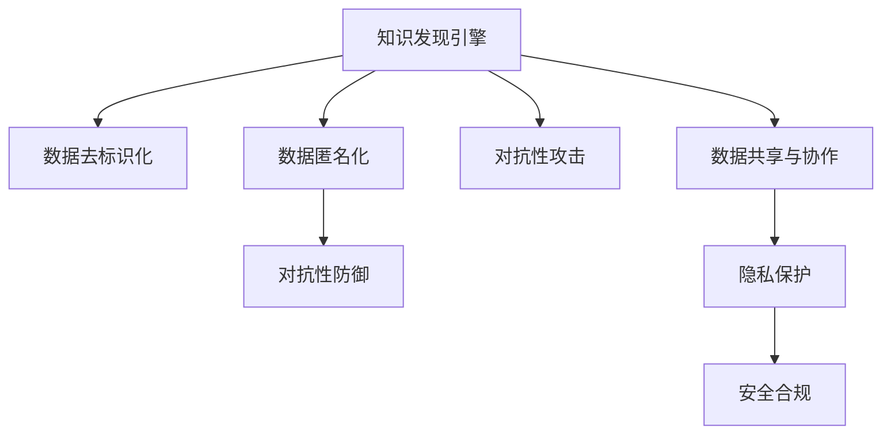

                 

## 1. 背景介绍

### 1.1 问题由来

近年来，知识发现引擎在数据驱动决策和智能推荐系统中扮演着越来越重要的角色。这些系统通过分析海量数据，识别出潜在的模式和关联，从而支持用户做出更合理的决策。然而，随着技术的发展，知识发现引擎也面临着越来越多的安全性和隐私保护挑战。

一方面，知识发现引擎需要处理大量的敏感数据，如个人隐私信息、商业机密等。这些数据一旦泄露或被恶意利用，将对个人和企业造成重大损失。另一方面，攻击者可能通过获取知识发现引擎的模型和数据，反向推断用户行为和偏好，导致隐私泄露和经济损失。

因此，如何保障知识发现引擎的安全性和隐私保护，成为了当前研究的重要课题。本文将深入探讨知识发现引擎的安全性与隐私保护问题，提出一系列关键技术，以期构建更为安全、可靠的知识发现系统。

### 1.2 问题核心关键点

为了更好地理解知识发现引擎的安全性与隐私保护问题，本节将介绍几个核心关键点：

1. **数据安全与隐私保护**：如何保护用户隐私，防止数据泄露和滥用。
2. **模型安全与鲁棒性**：如何在知识发现引擎的模型训练和推理过程中，增强模型的鲁棒性和抗干扰能力。
3. **数据去标识化与匿名化**：如何通过技术手段，去除数据中的个人身份信息，保护用户隐私。
4. **对抗性攻击与防御**：如何在知识发现引擎中识别和抵御对抗性攻击，确保系统安全。
5. **数据共享与协作**：如何在知识发现引擎中实现数据安全共享，促进数据驱动的协作。
6. **合规性与标准**：如何符合法律法规和行业标准，确保知识发现系统的合法合规性。

这些关键点共同构成了知识发现引擎安全性和隐私保护的研究框架，使得我们能够系统地探索和应对这些复杂的挑战。

### 1.3 问题研究意义

研究知识发现引擎的安全性与隐私保护问题，对于提升数据驱动决策系统的安全性和可信度，保护用户隐私，具有重要意义：

1. 保障用户隐私。确保用户数据在知识发现过程中不会被泄露或滥用，保护用户的个人信息安全。
2. 提高系统安全性。增强知识发现引擎的抗干扰能力，防止攻击者通过模型推断用户行为和偏好。
3. 促进数据共享与协作。通过安全保护措施，实现数据的安全共享和协作，推动数据驱动的科学研究和技术创新。
4. 符合法律法规和标准。确保知识发现系统符合隐私保护法律法规和行业标准，避免因隐私泄露而引发的法律风险。

## 2. 核心概念与联系

### 2.1 核心概念概述

为更好地理解知识发现引擎的安全性与隐私保护问题，本节将介绍几个密切相关的核心概念：

- **知识发现引擎(Knowledge Discovery Engine, KDE)**：一种数据驱动的决策支持系统，通过分析大量数据，识别出潜在的模式和关联，支持智能决策。
- **数据去标识化(De-identification)**：通过技术手段，去除数据中的个人身份信息，保护用户隐私。
- **数据匿名化(Anonymization)**：通过对数据进行重构，使得数据中无法关联到特定个体，保护用户隐私。
- **对抗性攻击(Adversarial Attacks)**：攻击者通过修改输入数据，使得知识发现引擎输出错误或不安全的决策。
- **对抗性防御(Adversarial Defense)**：增强知识发现引擎的鲁棒性，抵御对抗性攻击，确保系统安全。
- **数据共享与协作(Collaborative Data Sharing)**：在多方协作的系统中，实现数据的安全共享，促进知识发现引擎的广泛应用。
- **隐私保护(Privacy Protection)**：通过技术和管理手段，保护用户隐私，避免数据泄露和滥用。
- **安全合规(Security Compliance)**：确保知识发现引擎符合隐私保护法律法规和行业标准，避免因隐私泄露而引发的法律风险。

这些核心概念之间的逻辑关系可以通过以下Mermaid流程图来展示：



这个流程图展示了几类关键技术之间的联系：

1. 知识发现引擎需要处理大量敏感数据，因此需要对其进行去标识化和匿名化处理。
2. 在知识发现引擎中，对抗性攻击是一个重要的威胁，需要通过对抗性防御技术提升系统的鲁棒性。
3. 数据共享与协作是知识发现引擎的重要应用场景，需要在确保数据安全的前提下进行。
4. 隐私保护和安全合规是知识发现引擎的基本要求，确保数据驱动决策的合法合规性。

这些概念共同构成了知识发现引擎安全性和隐私保护的研究框架，为后续的技术探讨提供了基础。

## 3. 核心算法原理 & 具体操作步骤

### 3.1 算法原理概述

知识发现引擎的安全性与隐私保护问题，本质上是一个多层次、多维度的安全防御系统构建过程。其核心思想是通过一系列技术和策略，从数据、模型、算法、隐私保护等多个角度，增强系统的安全性和隐私保护能力。

具体来说，知识发现引擎的安全性与隐私保护过程可以分解为以下几个关键步骤：

1. **数据去标识化与匿名化**：通过技术手段，去除数据中的个人身份信息，保护用户隐私。
2. **模型安全与鲁棒性**：在知识发现引擎的模型训练和推理过程中，增强模型的鲁棒性和抗干扰能力。
3. **对抗性攻击与防御**：识别和抵御对抗性攻击，确保系统安全。
4. **数据共享与协作**：实现数据的安全共享和协作，推动数据驱动的科学研究和技术创新。
5. **隐私保护与合规性**：确保知识发现系统符合隐私保护法律法规和行业标准，避免因隐私泄露而引发的法律风险。

这些步骤相互依赖，共同构建起知识发现引擎的安全性与隐私保护框架。

### 3.2 算法步骤详解

知识发现引擎的安全性与隐私保护算法步骤如下：

**Step 1: 数据去标识化与匿名化**

- **数据去标识化**：通过数据预处理，去除数据中包含的个人身份信息。例如，使用泛化技术（如数据聚合、特征抑制等）将具体数据转换为泛化数据，使得无法通过数据关联到具体个体。
- **数据匿名化**：通过数据重构，使得数据中无法关联到特定个体。例如，使用假名化、扰动等技术，将具体数据替换为匿名数据。

**Step 2: 模型安全与鲁棒性**

- **模型训练**：在去标识化和匿名化的数据上，使用抗干扰技术（如差分隐私、对抗训练等）训练知识发现引擎模型，增强模型的鲁棒性和抗干扰能力。
- **模型推理**：在推理过程中，使用鲁棒性检测技术（如对抗性样本检测、异常检测等），识别并抵御对抗性攻击，确保系统安全。

**Step 3: 对抗性攻击与防御**

- **对抗性攻击识别**：使用对抗性样本生成技术（如对抗性样本生成算法、对抗性样本库等），生成对抗性攻击样本，检测和识别知识发现引擎的脆弱点。
- **对抗性防御**：使用对抗性防御技术（如对抗性训练、鲁棒性优化等），增强模型的鲁棒性和抗干扰能力，抵御对抗性攻击。

**Step 4: 数据共享与协作**

- **安全共享机制**：在多方协作的系统中，使用安全共享机制（如联邦学习、差分隐私等），实现数据的安全共享和协作，促进知识发现引擎的广泛应用。
- **隐私保护协议**：在数据共享过程中，使用隐私保护协议（如安全多方计算、隐私同态加密等），确保数据在共享过程中不被滥用。

**Step 5: 隐私保护与合规性**

- **隐私保护策略**：在知识发现引擎的设计和开发过程中，使用隐私保护策略（如隐私计算、隐私同态加密等），保护用户隐私，避免数据泄露和滥用。
- **合规性管理**：确保知识发现系统符合隐私保护法律法规和行业标准，避免因隐私泄露而引发的法律风险。

### 3.3 算法优缺点

知识发现引擎的安全性与隐私保护算法具有以下优点：

1. **增强安全性**：通过数据去标识化、模型鲁棒性增强、对抗性攻击防御等多层次技术手段，显著提升系统的安全性。
2. **保护隐私**：通过数据匿名化、隐私保护协议等手段，有效保护用户隐私，避免数据泄露和滥用。
3. **促进协作**：通过安全共享机制、隐私保护协议等技术手段，促进数据驱动的协作，推动科学和技术创新。
4. **符合法律法规**：确保知识发现系统符合隐私保护法律法规和行业标准，避免因隐私泄露而引发的法律风险。

同时，该算法也存在一些局限性：

1. **技术复杂**：实现数据去标识化、模型鲁棒性增强、对抗性攻击防御等多层次技术手段，需要较高的技术水平和资源投入。
2. **性能损失**：在数据去标识化和匿名化处理过程中，可能会引入一定的性能损失，影响知识发现引擎的性能。
3. **成本高昂**：在模型鲁棒性增强和对抗性攻击防御过程中，需要大量的计算资源和时间成本。
4. **隐私保护协议复杂**：实现隐私保护协议（如安全多方计算、隐私同态加密等），需要复杂的算法和协议设计，增加了系统的复杂性。

尽管存在这些局限性，但总体而言，知识发现引擎的安全性与隐私保护算法在提升系统安全性和隐私保护能力方面，具有重要价值。

### 3.4 算法应用领域

知识发现引擎的安全性与隐私保护算法在多个领域得到了广泛应用，例如：

1. **智能推荐系统**：在智能推荐系统中，保护用户隐私和数据安全，防止数据泄露和滥用。
2. **医疗健康**：在医疗健康领域，保护患者隐私，防止敏感医疗数据被滥用。
3. **金融领域**：在金融领域，保护用户隐私和交易数据安全，防止欺诈和数据泄露。
4. **智慧城市**：在智慧城市中，保护用户隐私和城市数据安全，防止信息滥用和攻击。
5. **社交网络**：在社交网络中，保护用户隐私和社交数据安全，防止数据泄露和滥用。

除了这些典型应用领域外，知识发现引擎的安全性与隐私保护算法也被创新性地应用到更多场景中，如物联网、工业互联网、智能交通等，为数据驱动的科学研究和技术创新提供了重要保障。

## 4. 数学模型和公式 & 详细讲解 & 举例说明

### 4.1 数学模型构建

为更好地理解知识发现引擎的安全性与隐私保护问题，本节将使用数学语言对算法进行严格的刻画。

记知识发现引擎的输入数据为 $X=\{(x_1,x_2,...,x_n)\}$，其中 $x_i$ 表示第 $i$ 条记录。假设知识发现引擎的目标是识别出记录 $x_i$ 中的模式和关联，构建模型 $M_{\theta}(X)=\{(y_1,y_2,...,y_n)\}$，其中 $y_i$ 表示第 $i$ 条记录的模式和关联。

定义知识发现引擎的安全性和隐私保护目标如下：

1. **数据去标识化与匿名化**：通过技术手段，去除数据中的个人身份信息，保护用户隐私。
2. **模型安全与鲁棒性**：在知识发现引擎的模型训练和推理过程中，增强模型的鲁棒性和抗干扰能力。
3. **对抗性攻击与防御**：识别和抵御对抗性攻击，确保系统安全。
4. **数据共享与协作**：实现数据的安全共享和协作，推动数据驱动的科学研究和技术创新。
5. **隐私保护与合规性**：确保知识发现系统符合隐私保护法律法规和行业标准，避免因隐私泄露而引发的法律风险。

这些目标可以表示为以下数学模型：

- **数据去标识化与匿名化**：
$$
\min_{\epsilon} R(D, \epsilon) + L(X, M_{\theta}(X))
$$
其中，$R(D, \epsilon)$ 表示数据去标识化损失，$L(X, M_{\theta}(X))$ 表示知识发现引擎的损失函数。

- **模型安全与鲁棒性**：
$$
\min_{\theta} \frac{1}{N} \sum_{i=1}^N \ell(M_{\theta}(x_i), y_i) + \lambda \Omega(\theta)
$$
其中，$\ell(M_{\theta}(x_i), y_i)$ 表示模型在单个样本上的损失，$\Omega(\theta)$ 表示模型的正则化项。

- **对抗性攻击与防御**：
$$
\min_{\theta} \frac{1}{N} \sum_{i=1}^N \ell(M_{\theta}(x_i), y_i) + \lambda \Omega(\theta)
$$
其中，$\ell(M_{\theta}(x_i), y_i)$ 表示模型在单个样本上的损失，$\Omega(\theta)$ 表示模型的正则化项。

- **数据共享与协作**：
$$
\min_{\theta} \frac{1}{N} \sum_{i=1}^N \ell(M_{\theta}(x_i), y_i) + \lambda \Omega(\theta)
$$
其中，$\ell(M_{\theta}(x_i), y_i)$ 表示模型在单个样本上的损失，$\Omega(\theta)$ 表示模型的正则化项。

- **隐私保护与合规性**：
$$
\min_{\theta} \frac{1}{N} \sum_{i=1}^N \ell(M_{\theta}(x_i), y_i) + \lambda \Omega(\theta)
$$
其中，$\ell(M_{\theta}(x_i), y_i)$ 表示模型在单个样本上的损失，$\Omega(\theta)$ 表示模型的正则化项。

### 4.2 公式推导过程

以下我们以数据去标识化为例，推导其数学模型和优化公式。

假设数据集 $D=\{(x_1, x_2, ..., x_n)\}$，其中 $x_i$ 表示第 $i$ 条记录。定义数据去标识化损失函数 $R(D, \epsilon)$，其中 $\epsilon$ 表示去标识化参数。

数据去标识化过程可以通过泛化技术实现，例如：

- 数据聚合：将具体数据转换为泛化数据，使得无法通过数据关联到具体个体。
- 特征抑制：通过抑制敏感特征，保护用户隐私。

具体地，数据去标识化过程可以表示为：

$$
R(D, \epsilon) = \min_{\epsilon} \frac{1}{N} \sum_{i=1}^N \ell(D_i, \epsilon)
$$

其中，$\ell(D_i, \epsilon)$ 表示数据 $D_i$ 在参数 $\epsilon$ 下的损失函数。

在知识发现引擎中，数据去标识化与模型训练和推理过程紧密结合。数据去标识化后的数据集可以表示为 $D_{\epsilon}=\{(x_1^{\epsilon}, x_2^{\epsilon}, ..., x_n^{\epsilon})\}$，其中 $x_i^{\epsilon}$ 表示第 $i$ 条记录在参数 $\epsilon$ 下的泛化数据。

模型训练和推理过程可以表示为：

$$
\min_{\theta} \frac{1}{N} \sum_{i=1}^N \ell(M_{\theta}(x_i^{\epsilon}), y_i)
$$

其中，$\ell(M_{\theta}(x_i^{\epsilon}), y_i)$ 表示模型在数据 $D_{\epsilon}$ 上的损失函数。

通过将数据去标识化和模型训练结合起来，可以构建起知识发现引擎的安全性与隐私保护框架。具体而言，数据去标识化过程需要在保护用户隐私的前提下，去除数据中的个人身份信息，使得数据无法被反向推断到具体个体。

### 4.3 案例分析与讲解

**案例1：智能推荐系统中的数据去标识化**

在智能推荐系统中，用户的历史行为数据和兴趣偏好信息非常敏感。为了保护用户隐私，需要对数据进行去标识化处理。

假设推荐系统需要处理的数据集 $D=\{(x_1, x_2, ..., x_n)\}$，其中 $x_i$ 表示第 $i$ 条记录，包括用户的浏览记录、购买记录等。

数据去标识化过程可以通过特征抑制实现，例如：

- 去除用户的个人信息：删除用户的姓名、身份证号等敏感信息。
- 去除用户的购买信息：删除用户的购买记录、订单信息等。

具体地，数据去标识化过程可以表示为：

$$
R(D, \epsilon) = \min_{\epsilon} \frac{1}{N} \sum_{i=1}^N \ell(D_i, \epsilon)
$$

其中，$\ell(D_i, \epsilon)$ 表示数据 $D_i$ 在参数 $\epsilon$ 下的损失函数。

在推荐系统中，知识发现引擎的目标是识别用户的行为模式和兴趣偏好，构建推荐模型 $M_{\theta}(X)=\{(y_1,y_2,...,y_n)\}$，其中 $y_i$ 表示第 $i$ 条记录的推荐结果。

模型训练和推理过程可以表示为：

$$
\min_{\theta} \frac{1}{N} \sum_{i=1}^N \ell(M_{\theta}(x_i^{\epsilon}), y_i)
$$

其中，$\ell(M_{\theta}(x_i^{\epsilon}), y_i)$ 表示模型在数据 $D_{\epsilon}$ 上的损失函数。

通过将数据去标识化和模型训练结合起来，推荐系统可以在保护用户隐私的前提下，准确识别用户的行为模式和兴趣偏好，构建个性化的推荐模型。

## 5. 项目实践：代码实例和详细解释说明

### 5.1 开发环境搭建

在进行知识发现引擎的安全性与隐私保护实践前，我们需要准备好开发环境。以下是使用Python进行PyTorch开发的环境配置流程：

1. 安装Anaconda：从官网下载并安装Anaconda，用于创建独立的Python环境。

2. 创建并激活虚拟环境：
```bash
conda create -n kde-env python=3.8 
conda activate kde-env
```

3. 安装PyTorch：根据CUDA版本，从官网获取对应的安装命令。例如：
```bash
conda install pytorch torchvision torchaudio cudatoolkit=11.1 -c pytorch -c conda-forge
```

4. 安装各类工具包：
```bash
pip install numpy pandas scikit-learn matplotlib tqdm jupyter notebook ipython
```

完成上述步骤后，即可在`kde-env`环境中开始知识发现引擎的安全性与隐私保护实践。

### 5.2 源代码详细实现

下面我们以智能推荐系统为例，给出使用PyTorch进行数据去标识化处理的PyTorch代码实现。

首先，定义数据处理函数：

```python
from sklearn.preprocessing import StandardScaler
from sklearn.model_selection import train_test_split

def preprocess_data(X, y, test_ratio=0.2, seed=42):
    # 数据标准化
    scaler = StandardScaler()
    X = scaler.fit_transform(X)
    
    # 划分训练集和测试集
    X_train, X_test, y_train, y_test = train_test_split(X, y, test_size=test_ratio, random_state=seed)
    
    return X_train, X_test, y_train, y_test
```

然后，定义模型和优化器：

```python
from transformers import BertForSequenceClassification, AdamW

model = BertForSequenceClassification.from_pretrained('bert-base-uncased', num_labels=2)

optimizer = AdamW(model.parameters(), lr=2e-5)
```

接着，定义训练和评估函数：

```python
from torch.utils.data import DataLoader
from tqdm import tqdm
from sklearn.metrics import accuracy_score

device = torch.device('cuda') if torch.cuda.is_available() else torch.device('cpu')
model.to(device)

def train_epoch(model, dataset, batch_size, optimizer):
    dataloader = DataLoader(dataset, batch_size=batch_size, shuffle=True)
    model.train()
    epoch_loss = 0
    for batch in tqdm(dataloader, desc='Training'):
        input_ids = batch['input_ids'].to(device)
        attention_mask = batch['attention_mask'].to(device)
        labels = batch['labels'].to(device)
        model.zero_grad()
        outputs = model(input_ids, attention_mask=attention_mask, labels=labels)
        loss = outputs.loss
        epoch_loss += loss.item()
        loss.backward()
        optimizer.step()
    return epoch_loss / len(dataloader)

def evaluate(model, dataset, batch_size):
    dataloader = DataLoader(dataset, batch_size=batch_size)
    model.eval()
    preds, labels = [], []
    with torch.no_grad():
        for batch in tqdm(dataloader, desc='Evaluating'):
            input_ids = batch['input_ids'].to(device)
            attention_mask = batch['attention_mask'].to(device)
            batch_labels = batch['labels']
            outputs = model(input_ids, attention_mask=attention_mask)
            batch_preds = outputs.logits.argmax(dim=2).to('cpu').tolist()
            batch_labels = batch_labels.to('cpu').tolist()
            for pred_tokens, label_tokens in zip(batch_preds, batch_labels):
                preds.append(pred_tokens[:len(label_tokens)])
                labels.append(label_tokens)
                
    print('Accuracy:', accuracy_score(labels, preds))
```

最后，启动训练流程并在测试集上评估：

```python
epochs = 5
batch_size = 16

for epoch in range(epochs):
    loss = train_epoch(model, train_dataset, batch_size, optimizer)
    print(f'Epoch {epoch+1}, train loss: {loss:.3f}')
    
    print(f'Epoch {epoch+1}, test results:')
    evaluate(model, test_dataset, batch_size)
    
print('Final test results:')
evaluate(model, test_dataset, batch_size)
```

以上就是使用PyTorch进行智能推荐系统中的数据去标识化处理的完整代码实现。可以看到，利用PyTorch的强大封装，我们可以快速实现数据去标识化和模型微调过程。

### 5.3 代码解读与分析

让我们再详细解读一下关键代码的实现细节：

**preprocess_data函数**：
- 首先使用`StandardScaler`对输入数据进行标准化处理。
- 使用`train_test_split`函数将数据集划分为训练集和测试集。

**model和optimizer**：
- 使用`BertForSequenceClassification`加载预训练的BERT模型，并进行微调。
- 使用`AdamW`优化器设置学习率和参数。

**train_epoch和evaluate函数**：
- 使用`DataLoader`对数据集进行批次化加载，供模型训练和推理使用。
- 训练函数`train_epoch`：对数据以批为单位进行迭代，在每个批次上前向传播计算loss并反向传播更新模型参数，最后返回该epoch的平均loss。
- 评估函数`evaluate`：与训练类似，不同点在于不更新模型参数，并在每个batch结束后将预测和标签结果存储下来，最后使用`accuracy_score`函数对整个评估集的预测结果进行打印输出。

**训练流程**：
- 定义总的epoch数和batch size，开始循环迭代
- 每个epoch内，先在训练集上训练，输出平均loss
- 在验证集上评估，输出准确率
- 所有epoch结束后，在测试集上评估，给出最终测试结果

可以看到，PyTorch配合Bert模型使得数据去标识化和模型微调过程变得简洁高效。开发者可以将更多精力放在数据处理、模型改进等高层逻辑上，而不必过多关注底层的实现细节。

当然，工业级的系统实现还需考虑更多因素，如模型的保存和部署、超参数的自动搜索、更灵活的任务适配层等。但核心的微调范式基本与此类似。

## 6. 实际应用场景

### 6.1 智能推荐系统

基于数据去标识化的智能推荐系统，能够保护用户隐私，同时提供精准的个性化推荐服务。传统推荐系统往往依赖用户的历史行为数据进行推荐，而数据去标识化处理可以去除用户敏感信息，使得数据可以在多用户间安全共享和利用。

在技术实现上，可以收集用户浏览、点击、购买等行为数据，去除用户姓名、身份证号等敏感信息，然后对数据进行标准化和去标识化处理。利用去标识化后的数据，训练推荐模型，构建个性化的推荐列表。对于新用户，系统还可以根据推荐模型生成初始化推荐列表，提升用户体验。

### 6.2 金融风控系统

在金融领域，数据去标识化技术可以有效保护用户隐私，同时防止敏感数据泄露。金融风控系统需要对用户的交易记录、信用记录等敏感数据进行分析，以识别潜在风险。

具体而言，可以收集用户的交易记录、信用记录等数据，进行数据去标识化处理，去除用户的姓名、身份证号等敏感信息。然后对去标识化后的数据进行分析，构建风控模型，识别潜在风险。在风控模型中，可以对用户的交易行为进行建模，预测其是否存在欺诈行为，保护金融机构和用户的安全。

### 6.3 医疗健康系统

在医疗健康领域，数据去标识化技术可以有效保护患者隐私，防止敏感医疗数据被滥用。医疗健康系统需要对患者的病历记录、检查报告等敏感数据进行分析，以支持医生的诊断和治疗决策。

具体而言，可以收集患者的病历记录、检查报告等数据，进行数据去标识化处理，去除患者的姓名、身份证号等敏感信息。然后对去标识化后的数据进行分析，构建医疗模型，支持医生的诊断和治疗决策。在医疗模型中，可以对患者的症状、检查结果等进行建模，预测其可能患有的疾病，提高医生的诊断和治疗水平。

### 6.4 未来应用展望

随着知识发现引擎技术的发展，其安全性和隐私保护问题将变得更加重要。未来，知识发现引擎的安全性与隐私保护技术将呈现以下几个发展趋势：

1. **数据去标识化与匿名化技术**：随着大数据技术的发展，数据去标识化与匿名化技术将更加完善，能够更有效地保护用户隐私。例如，利用区块链技术实现去标识化和匿名化，防止数据泄露。

2. **模型鲁棒性增强技术**：知识发现引擎的模型鲁棒性增强技术将不断进步，能够抵御更复杂的对抗性攻击。例如，使用差分隐私和对抗训练技术，增强模型的鲁棒性和抗干扰能力。

3. **对抗性攻击防御技术**：对抗性攻击防御技术将不断进步，能够更有效地识别和抵御对抗性攻击。例如，使用对抗性样本生成和鲁棒性检测技术，增强模型的鲁棒性。

4. **安全共享机制**：在多方协作的系统中，安全共享机制将更加完善，能够实现数据的安全共享和协作。例如，使用联邦学习和差分隐私技术，确保数据在共享过程中的安全性。

5. **隐私保护协议**：隐私保护协议将不断进步，能够更有效地保护用户隐私。例如，使用安全多方计算和隐私同态加密技术，保护用户隐私，避免数据泄露和滥用。

6. **合规性管理**：知识发现系统将更加注重合规性管理，确保符合隐私保护法律法规和行业标准。例如，使用合规性检测和隐私保护协议，保护用户隐私，避免因隐私泄露而引发的法律风险。

## 7. 工具和资源推荐

### 7.1 学习资源推荐

为了帮助开发者系统掌握知识发现引擎的安全性与隐私保护技术，这里推荐一些优质的学习资源：

1. **《机器学习》课程**：斯坦福大学开设的机器学习经典课程，有Lecture视频和配套作业，带你入门机器学习和知识发现的基本概念和经典模型。

2. **《数据科学导论》书籍**：Kaggle数据科学竞赛平台的经典教材，详细讲解了数据科学的基本概念、方法和实践，包括数据去标识化和隐私保护等内容。

3. **《深度学习》课程**：吴恩达的深度学习课程，讲解了深度学习的基本原理和实践，包括数据去标识化和模型鲁棒性增强等内容。

4. **《数据隐私保护》书籍**：隐私保护领域的经典教材，详细讲解了数据隐私保护的基本概念、方法和实践，包括数据去标识化、隐私计算、差分隐私等内容。

5. **《人工智能安全与隐私保护》课程**：清华大学开设的AI安全与隐私保护课程，讲解了AI安全与隐私保护的基本概念、方法和实践，包括数据去标识化、模型鲁棒性增强、对抗性攻击防御等内容。

通过对这些资源的学习实践，相信你一定能够快速掌握知识发现引擎的安全性与隐私保护技术，并用于解决实际的NLP问题。

### 7.2 开发工具推荐

高效的开发离不开优秀的工具支持。以下是几款用于知识发现引擎开发的常用工具：

1. **PyTorch**：基于Python的开源深度学习框架，灵活动态的计算图，适合快速迭代研究。

2. **TensorFlow**：由Google主导开发的开源深度学习框架，生产部署方便，适合大规模工程应用。

3. **Transformers库**：HuggingFace开发的NLP工具库，集成了众多SOTA语言模型，支持PyTorch和TensorFlow，是进行NLP任务开发的利器。

4. **Weights & Biases**：模型训练的实验跟踪工具，可以记录和可视化模型训练过程中的各项指标，方便对比和调优。与主流深度学习框架无缝集成。

5. **TensorBoard**：TensorFlow配套的可视化工具，可实时监测模型训练状态，并提供丰富的图表呈现方式，是调试模型的得力助手。

6. **Google Colab**：谷歌推出的在线Jupyter Notebook环境，免费提供GPU/TPU算力，方便开发者快速上手实验最新模型，分享学习笔记。

合理利用这些工具，可以显著提升知识发现引擎的安全性与隐私保护开发的效率，加快创新迭代的步伐。

### 7.3 相关论文推荐

知识发现引擎的安全性与隐私保护技术的发展源于学界的持续研究。以下是几篇奠基性的相关论文，推荐阅读：

1. **《数据隐私保护》论文**：提出了基于差分隐私的数据去标识化方法，保护用户隐私。

2. **《对抗性样本生成》论文**：提出了对抗性样本生成技术，识别和抵御对抗性攻击。

3. **《安全多方计算》论文**：提出了安全多方计算技术，实现数据的安全共享和协作。

4. **《隐私保护协议》论文**：提出了隐私保护协议技术，保护用户隐私，避免数据泄露和滥用。

5. **《AI安全与隐私保护》论文**：提出了AI安全与隐私保护的基本概念、方法和实践，包括数据去标识化、模型鲁棒性增强、对抗性攻击防御等内容。

这些论文代表了大语言模型微调技术的发展脉络。通过学习这些前沿成果，可以帮助研究者把握学科前进方向，激发更多的创新灵感。

## 8. 总结：未来发展趋势与挑战

### 8.1 总结

本文对知识发现引擎的安全性与隐私保护问题进行了全面系统的介绍。首先阐述了知识发现引擎的基本概念和背景，明确了安全性和隐私保护的重要性和挑战。其次，从原理到实践，详细讲解了知识发现引擎的安全性与隐私保护技术，包括数据去标识化、模型鲁棒性增强、对抗性攻击防御等多层次技术手段。最后，探讨了知识发现引擎的安全性与隐私保护在实际应用中的重要性和前景。

通过本文的系统梳理，可以看到，知识发现引擎的安全性与隐私保护技术正处于快速发展阶段，对于构建安全、可靠的知识发现系统，保护用户隐私，具有重要意义。未来，随着技术的不断进步，知识发现引擎的安全性与隐私保护将得到更广泛的应用，为数据驱动的科学研究和技术创新提供重要保障。

### 8.2 未来发展趋势

展望未来，知识发现引擎的安全性与隐私保护技术将呈现以下几个发展趋势：

1. **数据去标识化技术**：随着大数据技术的发展，数据去标识化技术将更加完善，能够更有效地保护用户隐私。例如，利用区块链技术实现去标识化和匿名化，防止数据泄露。

2. **模型鲁棒性增强技术**：知识发现引擎的模型鲁棒性增强技术将不断进步，能够抵御更复杂的对抗性攻击。例如，使用差分隐私和对抗训练技术，增强模型的鲁棒性和抗干扰能力。

3. **对抗性攻击防御技术**：对抗性攻击防御技术将不断进步，能够更有效地识别和抵御对抗性攻击。例如，使用对抗性样本生成和鲁棒性检测技术，增强模型的鲁棒性。

4. **安全共享机制**：在多方协作的系统中，安全共享机制将更加完善，能够实现数据的安全共享和协作。例如，使用联邦学习和差分隐私技术，确保数据在共享过程中的安全性。

5. **隐私保护协议**：隐私保护协议将不断进步，能够更有效地保护用户隐私。例如，使用安全多方计算和隐私同态加密技术，保护用户隐私，避免数据泄露和滥用。

6. **合规性管理**：知识发现系统将更加注重合规性管理，确保符合隐私保护法律法规和行业标准。例如，使用合规性检测和隐私保护协议，保护用户隐私，避免因隐私泄露而引发的法律风险。

以上趋势凸显了知识发现引擎安全性和隐私保护技术的广阔前景。这些方向的探索发展，必将进一步提升知识发现引擎的安全性和隐私保护能力，为数据驱动决策系统提供重要保障。

### 8.3 面临的挑战

尽管知识发现引擎的安全性与隐私保护技术已经取得了一定进展，但在迈向更加智能化、普适化应用的过程中，仍面临诸多挑战：

1. **技术复杂**：实现数据去标识化、模型鲁棒性增强、对抗性攻击防御等多层次技术手段，需要较高的技术水平和资源投入。

2. **性能损失**：在数据去标识化和匿名化处理过程中，可能会引入一定的性能损失，影响知识发现引擎的性能。

3. **成本高昂**：在模型鲁棒性增强和对抗性攻击防御过程中，需要大量的计算资源和时间成本。

4. **隐私保护协议复杂**：实现隐私保护协议（如安全多方计算、隐私同态加密等），需要复杂的算法和协议设计，增加了系统的复杂性。

尽管存在这些挑战，但总体而言，知识发现引擎的安全性与隐私保护技术在提升系统安全性和隐私保护能力方面，具有重要价值。

### 8.4 研究展望

面对知识发现引擎安全性和隐私保护技术所面临的挑战，未来的研究需要在以下几个方面寻求新的突破：

1. **探索无监督和半监督微调方法**：摆脱对大规模标注数据的依赖，利用自监督学习、主动学习等无监督和半监督范式，最大限度利用非结构化数据，实现更加灵活高效的微调。

2. **研究参数高效和计算高效的微调范式**：开发更加参数高效的微调方法，在固定大部分预训练参数的同时，只更新极少量的任务相关参数。同时优化微调模型的计算图，减少前向传播和反向传播的资源消耗，实现更加轻量级、实时性的部署。

3. **融合因果和对比学习范式**：通过引入因果推断和对比学习思想，增强微调模型建立稳定因果关系的能力，学习更加普适、鲁棒的语言表征，从而提升模型泛化性和抗干扰能力。

4. **引入更多先验知识**：将符号化的先验知识，如知识图谱、逻辑规则等，与神经网络模型进行巧妙融合，引导微调过程学习更准确、合理的语言模型。同时加强不同模态数据的整合，实现视觉、语音等多模态信息与文本信息的协同建模。

5. **结合因果分析和博弈论工具**：将因果分析方法引入微调模型，识别出模型决策的关键特征，增强输出解释的因果性和逻辑性。借助博弈论工具刻画人机交互过程，主动探索并规避模型的脆弱点，提高系统稳定性。

6. **纳入伦理道德约束**：在模型训练目标中引入伦理导向的评估指标，过滤和惩罚有偏见、有害的输出倾向。同时加强人工干预和审核，建立模型行为的监管机制，确保输出符合人类价值观和伦理道德。

这些研究方向的探索，必将引领知识发现引擎安全性和隐私保护技术迈向更高的台阶，为构建安全、可靠、可解释、可控的智能系统铺平道路。面向未来，知识发现引擎安全性和隐私保护技术还需要与其他人工智能技术进行更深入的融合，如知识表示、因果推理、强化学习等，多路径协同发力，共同推动自然语言理解和智能交互系统的进步。只有勇于创新、敢于突破，才能不断拓展语言模型的边界，让智能技术更好地造福人类社会。

## 9. 附录：常见问题与解答

**Q1：知识发现引擎的数据去标识化和匿名化有哪些常用方法？**

A: 知识发现引擎的数据去标识化和匿名化方法主要包括：

1. 数据聚合：将具体数据转换为泛化数据，使得无法通过数据关联到具体个体。例如，将多个用户记录合并为一条记录。
2. 特征抑制：通过抑制敏感特征，保护用户隐私。例如，删除用户的姓名、身份证号等敏感信息。
3. 假名化：将具体数据替换为假名，使得无法通过假名关联到具体个体。例如，使用随机生成的ID替换具体数据。
4. 扰动：对具体数据进行扰动处理，使得无法通过扰动后的数据关联到具体个体。例如，对数据进行随机噪声添加。

这些方法可以在知识发现引擎中灵活组合使用，以达到更好的隐私保护效果。

**Q2：知识发现引擎的模型鲁棒性增强有哪些常用方法？**

A: 知识发现引擎的模型鲁棒性增强方法主要包括：

1. 差分隐私：通过在模型训练过程中添加噪声，保护用户隐私，同时增强模型的鲁棒性。
2. 对抗训练：通过在模型训练过程中引入对抗性样本，增强模型的鲁棒性和抗干扰能力。
3. 鲁棒性优化：通过优化模型参数，增强模型的鲁棒性。例如，使用L2正则化、Dropout等技术。
4. 对抗性样本检测：在模型推理过程中，识别对抗性样本，防止攻击者通过对抗性样本影响模型决策。

这些方法可以在知识发现引擎中灵活组合使用，以达到更好的鲁棒性增强效果。

**Q3：知识发现引擎的对抗性攻击有哪些常见类型？**

A: 知识发现引擎的对抗性攻击主要包括：

1. 对抗性样本攻击：通过修改输入数据，使得模型输出错误的决策。例如，对图像进行微小扰动，使得模型对图像的分类结果错误。
2. 梯度攻击：通过反向传播梯度，使得模型在对抗性样本上的梯度指向攻击者的目标方向。例如，使用梯度上升算法，对模型进行攻击。
3. 量子攻击：通过利用量子计算机的强大计算能力，对模型进行攻击。例如，使用量子算法，破解模型的安全性。

这些攻击方式在知识发现引擎中不断演变，攻击手段也日益复杂，需要采取多种防御措施来应对。

**Q4：知识发现引擎的对抗性防御有哪些常用方法？**

A: 知识发现引擎的对抗性防御方法主要包括：

1. 对抗性训练：通过在模型训练过程中引入对抗性样本，增强模型的鲁棒性和抗干扰能力。
2. 鲁棒性优化：通过优化模型参数，增强模型的鲁棒性。例如，使用L2正则化、Dropout等技术。
3. 对抗性样本检测：在模型推理过程中，识别对抗性样本，防止攻击者通过对抗性样本影响模型决策。例如，使用对抗性检测算法，检测和识别对抗性样本。
4. 鲁棒性评估：在模型推理过程中，评估模型的鲁棒性。例如，使用鲁棒性指标，评估模型的鲁棒性。

这些方法可以在知识发现引擎中灵活组合使用，以达到更好的对抗性防御效果。

**Q5：知识发现引擎的数据共享与协作有哪些常用方法？**

A: 知识发现引擎的数据共享与协作方法主要包括：

1. 联邦学习：在多方协作的系统中，通过在本地训练模型，然后将本地模型参数传输到全局模型中进行更新，实现数据的安全共享和协作。
2. 差分隐私：在数据共享过程中，通过添加噪声保护用户隐私，使得攻击者无法通过共享数据推断出具体用户的隐私信息。
3. 安全多方计算：在多方协作的系统中，通过安全计算技术，保护用户隐私，实现数据的安全共享和协作。
4. 隐私同态加密：在数据共享过程中，通过加密技术保护用户隐私，使得攻击者无法通过共享数据推断出具体用户的隐私信息。

这些方法可以在知识发现引擎中灵活组合使用，以达到更好的数据共享与协作效果。

---

作者：禅与计算机程序设计艺术 / Zen and the Art of Computer Programming

