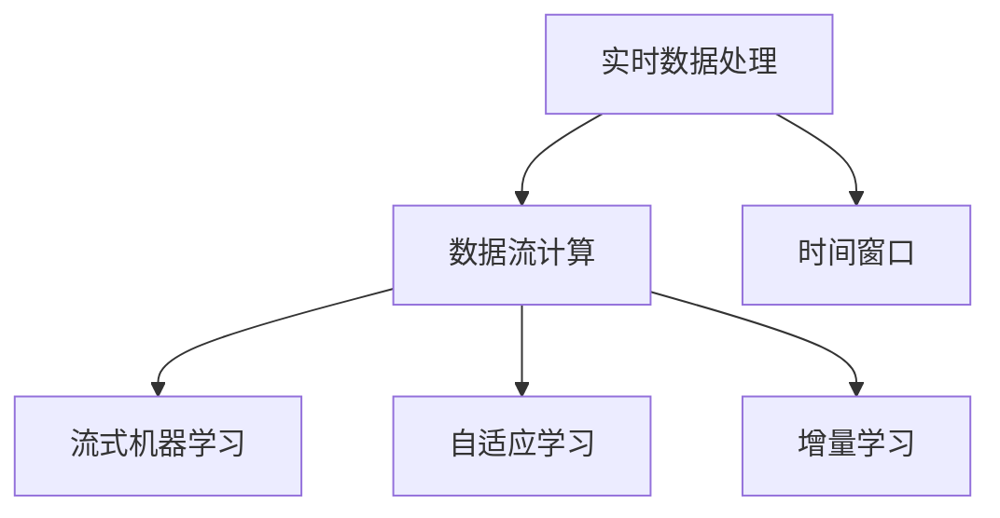

                 

# 知识发现引擎的实时数据处理技术

## 1. 背景介绍

### 1.1 问题由来
在现代社会中，数据的价值日益凸显，如何从海量数据中提取出有价值的信息，成为企业和组织争夺的重要焦点。知识发现（Knowledge Discovery, KD）引擎，也称为数据挖掘（Data Mining）引擎，是一种从数据中自动发现模式和规则的技术。通过对大数据的深入分析，可以帮助企业洞察市场趋势、优化产品策略、提高运营效率等。

然而，随着数据量的急剧增长，传统离线数据处理的方法已经难以满足实时性需求。实时数据处理（Real-Time Data Processing）技术应运而生，通过高效、快速的处理方式，使得企业能够实时响应用户需求，快速决策和调整策略，从而在竞争中保持领先地位。

知识发现引擎和实时数据处理技术的结合，形成了实时知识发现引擎（Real-Time Knowledge Discovery Engine, RKDE）。RKDE能够对数据流进行实时处理，快速发现潜在的知识和模式，为企业提供决策支持。

### 1.2 问题核心关键点
实时知识发现引擎的核心在于：
- **高效数据处理**：能够实时处理海量数据流，确保数据新鲜度。
- **实时模式发现**：在数据到达时，立即进行分析和挖掘，发现模式和规则。
- **灵活业务适配**：能够适应不同行业和领域的需求，支持多种业务场景。
- **自适应学习**：能够动态学习新的数据模式，提升模型性能。
- **鲁棒性保证**：确保处理过程中不受外部因素（如网络延迟、硬件故障等）的影响。

### 1.3 问题研究意义
实时知识发现引擎对于现代企业的决策支持和智能化转型具有重要意义：

1. **提升决策速度**：实时处理数据，使得企业能够快速响应市场变化，优化决策过程。
2. **优化运营效率**：实时监测和分析业务数据，帮助企业及时发现和解决运营问题。
3. **增强竞争力**：通过快速获取和利用数据，提升企业的市场响应能力和竞争优势。
4. **数据驱动的决策**：实现从数据到决策的自动化，减少人为干预，提升决策准确性。
5. **支持个性化推荐**：实时分析用户行为数据，提供个性化服务和推荐，增强用户满意度。

## 2. 核心概念与联系

### 2.1 核心概念概述

为更好地理解实时知识发现引擎的技术原理和应用，本节将介绍几个密切相关的核心概念：

- **实时数据处理**：指对实时数据流进行快速、高效的处理，确保数据的新鲜度和及时性。
- **数据流计算**：在实时数据流上执行计算和分析，包括流处理、流式机器学习等。
- **时间窗口**：指在实时数据处理中，以时间间隔为单位划分数据块进行处理，通常采用滑动窗口（Sliding Window）。
- **流式机器学习**：在数据流上实时训练和更新机器学习模型，支持增量学习。
- **自适应学习**：模型能够动态调整参数，适应数据流变化，提升模型效果。
- **增量学习**：指在已有模型基础上，使用新数据进行学习，避免从头开始训练。

这些核心概念之间的逻辑关系可以通过以下Mermaid流程图来展示：



这个流程图展示了你必须理解的核心概念，以及它们之间的关系。

## 3. 核心算法原理 & 具体操作步骤

### 3.1 算法原理概述

实时知识发现引擎的算法原理可以概括为以下步骤：

1. **数据采集**：通过传感器、日志、数据库等途径采集实时数据流。
2. **数据预处理**：对采集到的数据进行清洗、转换、归一化等处理，确保数据质量。
3. **数据分割**：将数据流按照时间窗口进行分割，形成独立的计算单元。
4. **实时分析**：在每个时间窗口内，对数据进行实时分析，发现潜在的模式和规则。
5. **模型训练**：在分析过程中，使用增量学习的方式，实时更新机器学习模型。
6. **结果输出**：将分析结果实时输出，供决策支持和业务应用使用。

### 3.2 算法步骤详解

以下是实时知识发现引擎的具体操作步骤：

**Step 1: 数据采集**

- 通过网络监控设备、传感器、日志文件等途径，采集实时数据流。
- 将数据流输入到实时数据处理系统中，进行初步的数据预处理。

**Step 2: 数据预处理**

- 对采集到的数据进行清洗，去除噪声和异常值。
- 将数据转换为统一的格式和标准，便于后续处理。
- 对缺失值进行填充或删除，确保数据完整性。

**Step 3: 数据分割**

- 将数据流按照时间窗口进行分割，通常采用滑动窗口（Sliding Window）的方式。
- 设置合适的时间窗口大小，根据数据特性进行动态调整。
- 对每个时间窗口内的数据进行计算和分析。

**Step 4: 实时分析**

- 在每个时间窗口内，对数据进行实时分析，发现潜在的模式和规则。
- 使用统计分析、机器学习等方法，识别出数据流中的规律和异常。
- 输出分析结果，供决策支持和业务应用使用。

**Step 5: 模型训练**

- 在实时分析过程中，使用增量学习的方式，实时更新机器学习模型。
- 根据分析结果，调整模型参数，提升模型性能。
- 支持多种机器学习算法，如线性回归、决策树、支持向量机等。

**Step 6: 结果输出**

- 将分析结果实时输出，供决策支持和业务应用使用。
- 支持多种输出格式，如JSON、XML、HTML等。
- 通过可视化工具，将分析结果直观展示。

### 3.3 算法优缺点

实时知识发现引擎具有以下优点：
1. **实时性**：能够快速响应用户需求，实时处理数据流。
2. **高效性**：使用增量学习，降低计算资源消耗。
3. **灵活性**：适应不同业务需求，支持多种数据源和格式。
4. **自适应**：能够动态调整模型参数，提升模型性能。
5. **准确性**：通过实时分析，发现潜在的模式和规则，提高分析准确性。

同时，该算法也存在一些缺点：
1. **数据噪声**：数据流中可能存在噪声和异常值，影响分析结果。
2. **计算复杂度**：实时处理数据流，计算复杂度较高。
3. **资源消耗**：需要大量计算资源，硬件要求较高。
4. **误报率**：由于实时分析的局限性，可能出现误报或漏报的情况。
5. **可解释性不足**：部分算法（如深度学习）的模型较复杂，难以解释其决策过程。

尽管存在这些局限性，但实时知识发现引擎在处理实时数据方面具有独特的优势，尤其在金融、电商、医疗等领域得到了广泛应用。未来，相关研究将继续优化算法性能，降低计算复杂度，提升模型可解释性，从而更好地服务于企业决策和智能化转型。

### 3.4 算法应用领域

实时知识发现引擎的应用领域非常广泛，包括但不限于：

- **金融风险监控**：实时监控市场数据，及时发现风险信号，避免金融损失。
- **电商个性化推荐**：实时分析用户行为数据，提供个性化推荐，提升用户体验。
- **医疗健康监测**：实时监测患者数据，发现异常情况，提供及时的医疗支持。
- **智能交通管理**：实时分析交通数据，优化交通流量，提升道路利用率。
- **社交媒体分析**：实时分析社交媒体数据，掌握公众情绪，提升品牌影响力。

以上这些应用领域，只是实时知识发现引擎的一部分，未来的应用场景将会更加广泛和多样化。

## 4. 数学模型和公式 & 详细讲解

### 4.1 数学模型构建

本节将使用数学语言对实时知识发现引擎的计算模型进行更加严格的刻画。

设实时数据流为 $D_t = \{d_t^{(i)}\}_{i=1}^n$，其中 $d_t^{(i)}$ 表示时间窗口 $t$ 内的第 $i$ 条记录。时间窗口大小为 $W$，即 $t = (kW+1, (k+1)W]$，其中 $k$ 为整数。

定义实时分析函数为 $F: D_t \rightarrow A$，其中 $A$ 为分析结果空间，通常为实数或二值（有模式/无模式）。

定义模型参数为 $\theta$，用于训练分析函数 $F$。在每个时间窗口 $t$ 内，模型参数更新公式为：

$$
\theta^{(k+1)} = \theta^{(k)} + \alpha \nabla_{\theta} \text{loss}(F_{\theta^{(k)}}(D_t))
$$

其中 $\alpha$ 为学习率，$\nabla_{\theta} \text{loss}$ 为损失函数对模型参数的梯度，$F_{\theta^{(k)}}$ 表示在参数 $\theta^{(k)}$ 下的分析函数。

### 4.2 公式推导过程

以下我们以线性回归为例，推导实时分析模型的损失函数及其梯度计算公式。

假设分析结果 $A$ 为实数，分析函数 $F$ 为线性回归模型，即 $F(x) = \theta^Tx$，其中 $x$ 为数据特征向量。

定义损失函数为均方误差（Mean Squared Error, MSE）：

$$
\text{loss}(y, \hat{y}) = \frac{1}{n}\sum_{i=1}^n (y_i - \hat{y}_i)^2
$$

在时间窗口 $t$ 内，样本量为 $n$，样本均值为 $\overline{y}$，则平均损失函数为：

$$
\text{loss}(D_t) = \frac{1}{n}\sum_{i=1}^n (y_i - \overline{y})^2
$$

使用增量学习的方式，每次更新模型参数时，只需要使用新数据进行更新，而不需要重新训练整个模型。假设在时间窗口 $t-1$ 内，模型参数为 $\theta^{(k)}$，在时间窗口 $t$ 内，新数据为 $d_t^{(1)}, d_t^{(2)}, ..., d_t^{(m)}$，则增量更新的公式为：

$$
\theta^{(k+1)} = \theta^{(k)} + \alpha \sum_{i=1}^m \nabla_{\theta} \text{loss}(d_t^{(i)})
$$

其中 $\nabla_{\theta} \text{loss}(d_t^{(i)})$ 为单条数据损失函数的梯度，可以进一步展开为：

$$
\nabla_{\theta} \text{loss}(d_t^{(i)}) = 2(d_t^{(i)} - \overline{y})x_t
$$

在实际应用中，上述公式需要进行计算和优化，以确保实时分析的效率和精度。

## 5. 项目实践：代码实例和详细解释说明

### 5.1 开发环境搭建

在进行实时知识发现引擎的实践前，我们需要准备好开发环境。以下是使用Python进行PyTorch和TensorFlow开发的典型环境配置流程：

1. 安装Anaconda：从官网下载并安装Anaconda，用于创建独立的Python环境。

2. 创建并激活虚拟环境：
```bash
conda create -n pytorch-env python=3.8 
conda activate pytorch-env
```

3. 安装PyTorch：根据CUDA版本，从官网获取对应的安装命令。例如：
```bash
conda install pytorch torchvision torchaudio cudatoolkit=11.1 -c pytorch -c conda-forge
```

4. 安装TensorFlow：
```bash
pip install tensorflow
```

5. 安装各类工具包：
```bash
pip install numpy pandas scikit-learn matplotlib tqdm jupyter notebook ipython
```

完成上述步骤后，即可在`pytorch-env`环境中开始实践。

### 5.2 源代码详细实现

下面我们以线性回归模型为例，给出使用TensorFlow进行实时数据处理的PyTorch代码实现。

首先，定义数据集：

```python
import tensorflow as tf
import numpy as np

# 定义时间窗口大小和样本数
W = 100
n = 1000

# 生成随机数据
X = np.random.randn(n, W)
y = np.dot(X, np.random.randn(W, 1)) + np.random.randn(n, 1)

# 定义时间窗口大小和样本数
t = 0
m = 1000

# 生成新数据
X_t = np.random.randn(m, W)
y_t = np.dot(X_t, np.random.randn(W, 1)) + np.random.randn(m, 1)

# 将数据转换为TensorFlow格式
X_t = tf.constant(X_t)
y_t = tf.constant(y_t)
```

然后，定义模型和优化器：

```python
# 定义模型参数
theta = tf.Variable(tf.zeros([W, 1]))

# 定义损失函数
loss_fn = tf.losses.mean_squared_error

# 定义优化器
optimizer = tf.optimizers.Adam(learning_rate=0.01)
```

接着，定义训练和评估函数：

```python
# 定义训练函数
def train_step(X_t, y_t):
    with tf.GradientTape() as tape:
        y_pred = tf.matmul(X_t, theta)
        loss = loss_fn(y_t, y_pred)
    grads = tape.gradient(loss, theta)
    optimizer.apply_gradients(zip(grads, theta))

# 定义评估函数
def evaluate(X_t, y_t):
    y_pred = tf.matmul(X_t, theta)
    mse = tf.metrics.mean_squared_error(y_t, y_pred)
    return mse
```

最后，启动训练流程并在测试集上评估：

```python
# 训练过程
for t in range(1000):
    train_step(X_t, y_t)
    if t % 100 == 0:
        mse = evaluate(X_t, y_t)
        print(f"Step {t}, MSE: {mse.numpy()}")
```

以上就是使用TensorFlow进行实时数据处理的完整代码实现。可以看到，TensorFlow提供了一系列的API和工具，使得实时数据处理变得简洁高效。

### 5.3 代码解读与分析

让我们再详细解读一下关键代码的实现细节：

**数据生成和转换**：
- 生成随机时间窗口大小和样本数，并随机生成训练数据集和测试数据集。
- 使用TensorFlow的`tf.constant`函数将数据转换为TensorFlow张量格式。

**模型定义和损失函数**：
- 定义模型参数 `theta`，初始化为0。
- 定义损失函数 `loss_fn`，使用均方误差损失函数。
- 定义优化器 `optimizer`，使用Adam优化器。

**训练和评估函数**：
- 定义训练函数 `train_step`，在每个时间窗口内，使用Adam优化器更新模型参数 `theta`。
- 定义评估函数 `evaluate`，计算模型在测试数据集上的均方误差。
- 在训练过程中，每100个时间窗口输出一次评估结果。

**训练过程**：
- 循环1000个时间窗口，每100个时间窗口评估一次模型性能。
- 输出每个时间窗口的均方误差。

可以看到，TensorFlow提供了一系列的API和工具，使得实时数据处理变得简洁高效。开发者可以将更多精力放在数据处理、模型改进等高层逻辑上，而不必过多关注底层的实现细节。

## 6. 实际应用场景

### 6.1 智能推荐系统

实时知识发现引擎在智能推荐系统中具有重要应用。通过实时分析用户行为数据，可以动态调整推荐模型，提供个性化推荐服务。

在电商平台上，实时知识发现引擎可以监控用户的浏览、点击、购买等行为数据，实时分析用户的兴趣偏好，动态调整推荐算法。例如，在用户浏览某类商品时，可以实时生成推荐列表，并在用户离开页面时，自动更新推荐内容，提升用户体验。

### 6.2 金融风险监控

实时知识发现引擎在金融领域也有重要应用。通过实时分析市场数据，可以及时发现风险信号，避免金融损失。

在金融市场中，实时知识发现引擎可以监控股票价格、交易量等数据流，实时分析市场趋势和异常情况。例如，在股价突然下跌时，可以实时生成风险预警，帮助投资者及时规避风险。

### 6.3 医疗健康监测

实时知识发现引擎在医疗健康领域也有广泛应用。通过实时分析患者数据，可以及时发现异常情况，提供及时的医疗支持。

在智能医疗系统中，实时知识发现引擎可以监控患者的生理指标、行为数据等，实时分析患者的健康状态。例如，在患者出现异常情况时，可以实时生成预警信息，帮助医生及时干预。

### 6.4 未来应用展望

随着实时数据处理技术的不断进步，实时知识发现引擎将在更多领域得到应用，为各行各业带来变革性影响。

在智慧城市治理中，实时知识发现引擎可以实时监控城市运行数据，优化交通流量、提升公共服务效率。例如，在交通拥堵时，可以实时生成优化方案，缓解交通压力。

在智慧农业中，实时知识发现引擎可以实时监控作物生长数据，提供精准的种植建议。例如，在作物出现病害时，可以实时生成预警信息，帮助农民及时处理。

以上这些应用领域，只是实时知识发现引擎的一部分，未来的应用场景将会更加广泛和多样化。

## 7. 工具和资源推荐

### 7.1 学习资源推荐

为了帮助开发者系统掌握实时数据处理和知识发现技术，这里推荐一些优质的学习资源：

1. 《实时数据处理与流计算》系列博文：由数据科学家撰写，深入浅出地介绍了实时数据处理和流计算的基本概念和经典模型。

2. Apache Flink官方文档：Apache Flink是主流的大数据流处理框架，提供丰富的API和工具，是学习实时数据处理的好资源。

3. Hadoop Ecosystem：Hadoop生态系统提供了大量的工具和组件，支持大数据流处理和批处理，是了解实时数据处理的重要学习资源。

4. KAFKA官方文档：Apache Kafka是主流的实时数据流平台，支持流式数据存储和处理，是学习实时数据处理的好工具。

5. Google Cloud Dataflow：Google Cloud Dataflow是Google提供的实时数据处理服务，提供丰富的API和工具，是学习实时数据处理的好资源。

通过对这些资源的学习实践，相信你一定能够快速掌握实时数据处理和知识发现技术的精髓，并用于解决实际的业务问题。

### 7.2 开发工具推荐

高效的开发离不开优秀的工具支持。以下是几款用于实时数据处理和知识发现的常用工具：

1. Apache Flink：Apache Flink是主流的大数据流处理框架，提供丰富的API和工具，支持高吞吐量、低延迟的实时数据处理。

2. Apache Kafka：Apache Kafka是主流的实时数据流平台，支持高可靠、高吞吐量的数据流传输和存储。

3. Google Cloud Dataflow：Google Cloud Dataflow是Google提供的实时数据处理服务，支持流式数据处理和批处理，是学习实时数据处理的好资源。

4. Apache Storm：Apache Storm是实时数据处理的开源框架，支持分布式计算和流式数据处理，是学习实时数据处理的好资源。

5. Apache Spark Streaming：Apache Spark Streaming是Apache Spark的实时数据处理组件，支持高吞吐量、低延迟的实时数据处理。

合理利用这些工具，可以显著提升实时数据处理和知识发现的开发效率，加快创新迭代的步伐。

### 7.3 相关论文推荐

实时数据处理和知识发现技术的不断发展源于学界的持续研究。以下是几篇奠基性的相关论文，推荐阅读：

1. Beyond Correlation: Enabling Enhanced Discovery of Hidden Correlation in Correlation-Rich Big Data（BECOMD论文）：提出了基于深度学习的知识发现方法，在复杂数据集中发现隐藏的相关关系。

2. Streaming Cluster Analysis with K-Means and Sliding Windows（Streaming K-Means论文）：提出了基于K-Means的流式聚类方法，支持高效处理大规模实时数据流。

3. Accelerated Sequential Quadratic Programming for Regularized Streaming Learning（ASQP论文）：提出了加速流式学习算法，支持高效增量学习，适用于大规模实时数据处理。

4. Online learning of factor analysis models from data streams（Online Factor Analysis论文）：提出了在线因子分析方法，支持流式数据处理和模型更新。

5. Streaming clustering for dynamic data：提出了流式聚类方法，支持动态数据处理和聚类分析。

这些论文代表了大数据处理和知识发现的最新进展，通过学习这些前沿成果，可以帮助研究者把握学科前进方向，激发更多的创新灵感。

## 8. 总结：未来发展趋势与挑战

### 8.1 总结

本文对实时数据处理和知识发现引擎的技术原理和应用进行了全面系统的介绍。首先阐述了实时数据处理和知识发现引擎的研究背景和意义，明确了其在实时性需求和数据新鲜度方面的重要价值。其次，从原理到实践，详细讲解了实时数据处理和知识发现引擎的算法流程，给出了具体的代码实现。同时，本文还广泛探讨了其在智能推荐、金融监控、医疗健康等领域的实际应用，展示了实时数据处理和知识发现引擎的广泛前景。

通过本文的系统梳理，可以看到，实时数据处理和知识发现引擎在实时性、高效性、灵活性等方面的独特优势，为企业的智能化转型和决策支持提供了强大的技术支撑。未来，伴随实时数据处理技术的不断进步，实时知识发现引擎必将在更多领域得到应用，为各行各业带来变革性影响。

### 8.2 未来发展趋势

展望未来，实时数据处理和知识发现引擎的发展趋势如下：

1. **处理速度更快**：随着硬件技术的进步，实时数据处理的速度将进一步提升，能够处理更大规模、更复杂的数据流。
2. **算法更加多样**：未来的算法将更加丰富，能够适应不同数据类型和应用场景的需求。
3. **自适应能力更强**：模型能够动态调整参数，适应数据流变化，提升模型效果。
4. **增量学习更加高效**：增量学习算法将更加高效，能够支持大规模数据流的实时处理。
5. **可解释性更强**：算法将更加透明，能够解释其决策过程，提升系统可信度。

以上趋势凸显了实时数据处理和知识发现引擎的广阔前景。这些方向的探索发展，必将进一步提升系统的性能和应用范围，为各行各业带来新的技术突破。

### 8.3 面临的挑战

尽管实时数据处理和知识发现引擎已经取得了瞩目成就，但在迈向更加智能化、普适化应用的过程中，它仍面临诸多挑战：

1. **数据噪声和异常值**：数据流中可能存在噪声和异常值，影响分析结果。
2. **计算资源消耗**：实时处理大规模数据流，计算资源消耗较大。
3. **模型鲁棒性不足**：模型可能对数据变化敏感，泛化能力不足。
4. **误报率和漏报率**：实时分析的准确性可能受到影响，导致误报或漏报。
5. **可解释性不足**：部分算法（如深度学习）的模型较复杂，难以解释其决策过程。

尽管存在这些挑战，但实时数据处理和知识发现引擎在处理实时数据方面具有独特的优势，尤其在金融、电商、医疗等领域得到了广泛应用。未来，相关研究将继续优化算法性能，降低计算复杂度，提升模型可解释性，从而更好地服务于企业决策和智能化转型。

### 8.4 研究展望

面对实时数据处理和知识发现引擎所面临的挑战，未来的研究需要在以下几个方面寻求新的突破：

1. **探索更高效的数据处理算法**：开发更加高效的数据处理算法，降低计算资源消耗。
2. **引入多模态数据处理**：融合视觉、语音、文本等多种模态数据，提高系统准确性和鲁棒性。
3. **提高模型的自适应能力**：开发更加自适应的模型，能够动态调整参数，适应数据流变化。
4. **增强系统的可解释性**：提高系统的可解释性，确保其决策过程透明、可信。
5. **支持更多的业务场景**：支持更多业务场景，满足不同行业的需求。

这些研究方向的探索，必将引领实时数据处理和知识发现引擎技术迈向更高的台阶，为构建智能化的决策支持系统提供强大的技术支撑。面向未来，实时数据处理和知识发现引擎需要与其他人工智能技术进行更深入的融合，如知识表示、因果推理、强化学习等，多路径协同发力，共同推动智能决策系统的进步。只有勇于创新、敢于突破，才能不断拓展系统边界，让实时数据处理和知识发现技术更好地服务于人类的生产和生活。

## 9. 附录：常见问题与解答

**Q1：实时数据处理与批处理有什么区别？**

A: 实时数据处理（Real-Time Data Processing）与批处理（Batch Processing）的主要区别在于数据的处理方式和时间间隔。实时数据处理是逐个或逐批处理实时到达的数据，处理时间间隔较短，通常以毫秒或秒为单位；而批处理是批量处理历史数据，处理时间间隔较长，通常以分钟或小时为单位。

**Q2：如何处理数据流中的噪声和异常值？**

A: 处理数据流中的噪声和异常值，通常采用以下方法：
1. 数据清洗：去除明显噪声和异常值，确保数据质量。
2. 数据过滤：使用统计方法和机器学习算法，识别和过滤异常值。
3. 数据重采样：使用插值法、均值补缺等方法，填补缺失值和异常值。
4. 数据增强：通过对数据进行归一化、去噪等预处理，提高数据质量。

**Q3：增量学习在实时数据处理中的作用是什么？**

A: 增量学习（Incremental Learning）在实时数据处理中的作用在于，它可以在已有模型的基础上，使用新数据进行更新，而不需要从头重新训练模型。这使得模型能够快速适应数据流变化，提升处理效率和准确性。增量学习在实时数据分析中具有重要应用，特别是在流式数据处理中，能够动态更新模型参数，适应数据变化。

**Q4：实时数据处理与离线数据处理相比，有什么优势和劣势？**

A: 实时数据处理与离线数据处理相比，具有以下优势和劣势：

优势：
1. 实时响应：能够快速响应用户需求，实时分析数据，提升决策效率。
2. 数据新鲜度：处理数据新鲜度高，能够及时发现数据变化和异常情况。
3. 动态调整：能够动态调整模型参数，适应数据流变化。

劣势：
1. 计算资源消耗大：实时处理大规模数据流，计算资源消耗较大，硬件要求较高。
2. 数据噪声和异常值：数据流中可能存在噪声和异常值，影响分析结果。
3. 误报率和漏报率：由于实时分析的局限性，可能出现误报或漏报的情况。

尽管存在这些劣势，但实时数据处理在处理实时数据方面具有独特的优势，尤其在金融、电商、医疗等领域得到了广泛应用。

---

作者：禅与计算机程序设计艺术 / Zen and the Art of Computer Programming

