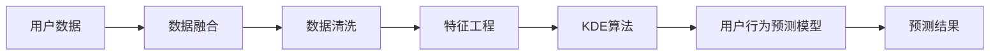

                 

## 1. 背景介绍

在当今数字化时代，数据驱动的决策成为企业和组织的核心竞争力。用户行为分析作为其中的关键环节，旨在揭示用户需求和行为规律，为个性化推荐、客户细分、市场分析等业务提供有力支撑。然而，用户行为数据通常具有高维度、稀疏性和动态变化等特点，如何高效、准确地进行建模和预测，成为摆在面前的一大挑战。为此，我们提出了一种基于知识发现引擎的用户行为预测模型，旨在充分利用数据中的潜在知识，构建高精度的预测模型。

### 1.1 研究背景

随着互联网和智能设备的普及，用户行为数据急剧增长，如何从海量数据中挖掘出有价值的信息，成为各领域研究的热点。传统的统计模型和机器学习模型虽然在一定程度上取得了成效，但在面对大规模数据和复杂结构时显得力不从心。知识发现引擎(Knowledge Discovery Engine, KDE)作为一种新兴的数据分析工具，通过挖掘数据中的潜在知识，为复杂用户行为预测提供了一种新的思路。

### 1.2 研究目的和意义

本研究旨在：
1. **构建基于知识发现引擎的用户行为预测模型**：利用KDE技术，挖掘用户行为数据中的潜在知识，构建高精度的用户行为预测模型。
2. **解决用户行为预测中的高维度、稀疏性和动态变化问题**：通过知识发现引擎的有效性，提升预测模型的泛化能力和鲁棒性。
3. **促进数据驱动的决策和个性化服务**：为用户行为分析和决策支持提供新工具和方法，提升业务价值。

## 2. 核心概念与联系

### 2.1 核心概念概述

- **知识发现引擎(Knowledge Discovery Engine, KDE)**：一种数据挖掘工具，通过分析数据中的潜在知识，构建高精度的预测和分类模型。KDE常用的算法包括关联规则、分类与回归树、神经网络等。
- **用户行为预测**：基于用户历史行为数据，构建预测模型，预测用户未来行为，如购买、点击、流失等。
- **数据融合**：将不同来源、不同格式的数据进行整合和融合，构建统一的数据视图，为后续分析提供基础。

### 2.2 核心概念原理和架构的 Mermaid 流程图



### 2.3 核心概念之间的关系

数据融合是KDE的基础，通过清洗和特征工程处理，将数据转化为适合KDE分析的形式。KDE算法通过挖掘数据中的关联规则、分类规则等知识，构建高精度的用户行为预测模型。最终，通过预测模型，对用户未来行为进行预测，为业务决策提供支撑。

## 3. 核心算法原理 & 具体操作步骤

### 3.1 算法原理概述

基于知识发现引擎的用户行为预测模型主要包括以下几个关键步骤：

1. **数据融合与清洗**：将不同来源、不同格式的用户数据进行整合，去除噪声和异常值，构建统一的数据视图。
2. **特征工程**：对数据进行降维、标准化等处理，提取关键特征，构建特征集合。
3. **知识发现引擎算法**：采用关联规则、分类与回归树、神经网络等算法，挖掘数据中的潜在知识，构建用户行为预测模型。
4. **模型训练与评估**：在训练集上训练模型，使用验证集评估模型性能，调整超参数。
5. **预测与反馈**：在测试集上使用训练好的模型进行预测，并通过反馈机制不断优化模型。

### 3.2 算法步骤详解

#### 3.2.1 数据融合与清洗

1. **数据源整合**：
   - 将来自不同渠道的用户数据（如电商订单数据、网站点击数据、社交媒体数据等）进行整合，构建统一的数据视图。

2. **数据清洗**：
   - 去除缺失值、异常值和重复记录，保证数据的质量。

3. **数据标准化**：
   - 对数据进行归一化和标准化处理，使其符合KDE算法的输入要求。

#### 3.2.2 特征工程

1. **特征提取**：
   - 从清洗后的数据中提取关键特征，如用户ID、商品ID、时间戳、点击次数、浏览时长等。

2. **特征选择**：
   - 使用特征选择算法（如卡方检验、信息增益等）选择最具代表性的特征，减少特征维度。

3. **特征降维**：
   - 使用主成分分析(PCA)、线性判别分析(LDA)等算法，对数据进行降维处理。

#### 3.2.3 知识发现引擎算法

1. **关联规则**：
   - 利用Apriori算法、FP-Growth算法等挖掘数据中的频繁项集和关联规则。

2. **分类与回归树**：
   - 使用CART、ID3等算法构建分类与回归树模型，通过决策树节点分裂挖掘知识。

3. **神经网络**：
   - 使用BP算法、RNN等算法构建神经网络模型，通过反向传播优化模型参数。

#### 3.2.4 模型训练与评估

1. **模型训练**：
   - 使用训练集数据，在知识发现引擎算法上训练模型，调整超参数。

2. **模型评估**：
   - 在验证集上评估模型性能，使用准确率、召回率、F1值等指标衡量模型的优劣。

3. **模型选择**：
   - 根据评估结果选择性能最优的模型作为最终预测模型。

#### 3.2.5 预测与反馈

1. **预测**：
   - 在测试集上使用训练好的模型进行预测，生成用户行为预测结果。

2. **反馈**：
   - 将预测结果与实际行为进行对比，通过反馈机制调整模型参数，提升模型性能。

### 3.3 算法优缺点

**优点**：
1. **高效性**：通过KDE挖掘数据中的潜在知识，能够构建高精度的预测模型，提升预测效率。
2. **泛化能力强**：利用关联规则、分类树、神经网络等算法，能够处理高维度、稀疏性和动态变化数据，提升模型泛化能力。
3. **鲁棒性强**：通过数据清洗和特征选择，能够去除噪声和异常值，提升模型鲁棒性。

**缺点**：
1. **计算复杂度高**：KDE算法计算复杂度较高，对硬件资源要求较高。
2. **模型解释性差**：部分算法（如神经网络）缺乏解释性，难以理解模型的决策过程。
3. **超参数调整困难**：KDE算法涉及大量超参数，调参过程复杂且易陷入局部最优。

### 3.4 算法应用领域

基于知识发现引擎的用户行为预测模型在以下几个领域具有广泛应用：

1. **电子商务**：
   - 通过预测用户购买行为，优化商品推荐、库存管理、广告投放等业务。

2. **社交媒体**：
   - 分析用户互动行为，提升内容推荐、用户留存、广告投放等业务效果。

3. **金融服务**：
   - 预测用户交易行为，优化风险控制、产品推荐、客户细分等业务。

4. **医疗健康**：
   - 分析用户健康数据，提供个性化诊疗建议、疾病预测等健康服务。

5. **教育培训**：
   - 预测学生学习行为，优化课程推荐、学习进度跟踪、学习效果评估等业务。

## 4. 数学模型和公式 & 详细讲解 & 举例说明

### 4.1 数学模型构建

基于知识发现引擎的用户行为预测模型主要包含以下几个数学模型：

1. **关联规则**：
   - 通过Apriori算法挖掘频繁项集，构建关联规则，表示为：$A \rightarrow B$，其中$A$是频繁项集，$B$是规则结论。

2. **分类树**：
   - 使用CART算法构建分类树，模型表示为：$T=\{R, N\}$，其中$R$是决策树结构，$N$是节点样本。

3. **神经网络**：
   - 使用BP算法构建神经网络，模型表示为：$N(x)=\sigma(Wx+b)$，其中$x$是输入向量，$\sigma$是非线性激活函数，$W$和$b$是模型参数。

### 4.2 公式推导过程

#### 4.2.1 关联规则

关联规则的推导主要基于Apriori算法。Apriori算法通过频繁项集挖掘，生成关联规则。假设$A$和$B$是两个频繁项集，则关联规则为$A \rightarrow B$。其计算公式如下：

$$
\text{Support}(A \rightarrow B) = \frac{\text{Support}(A) \times \text{Support}(B)}{\text{Support}(A \cup B)}
$$

其中，$\text{Support}(A)$表示$A$的频率，$\text{Support}(A \cup B)$表示$A$和$B$并集的频率。

#### 4.2.2 分类树

分类树模型的推导主要基于CART算法。CART算法通过决策树节点分裂，生成分类树。假设数据集$D$，树根节点为$R$，$N$为节点样本，则分类树表示为：

$$
T = \{R, N\}
$$

其中，$R$为决策树结构，$N$为节点样本。节点分裂条件为：

$$
\text{Split} = \text{argmin}_{k} \{D_k \times \text{Entropy}(D_k)\}
$$

其中，$D_k$为节点$k$的数据集，$\text{Entropy}(D_k)$为数据集$D_k$的熵。

#### 4.2.3 神经网络

神经网络模型的推导主要基于BP算法。BP算法通过反向传播优化模型参数，计算公式如下：

$$
\Delta W = \alpha (\frac{\partial L}{\partial W}) = \alpha \frac{\partial L}{\partial z} \times \frac{\partial z}{\partial W}
$$

其中，$L$为损失函数，$\alpha$为学习率，$W$为模型参数，$z$为模型输出。

### 4.3 案例分析与讲解

#### 4.3.1 关联规则

假设电商网站历史订单数据中，发现以下关联规则：

- 经常一起购买的商品：苹果、香蕉、橙子。
- 经常一起购买的商品：苹果、橘子、柚子。

关联规则的推导过程如下：

1. **数据预处理**：清洗数据，去除噪声和异常值，标准化数据。

2. **频繁项集挖掘**：使用Apriori算法挖掘频繁项集，发现$A=\{苹果, 香蕉, 橙子\}$和$B=\{苹果, 橘子, 柚子\}$为频繁项集。

3. **关联规则生成**：根据频繁项集生成关联规则，$A \rightarrow B$和$B \rightarrow A$。

#### 4.3.2 分类树

假设社交媒体用户互动数据中，希望预测用户的活跃度。分类树模型的推导过程如下：

1. **数据预处理**：清洗数据，去除噪声和异常值，标准化数据。

2. **特征选择**：选择用户ID、年龄、性别、互动次数等特征。

3. **分类树构建**：使用CART算法构建分类树，通过决策树节点分裂，最终生成分类树模型。

4. **模型评估**：在验证集上评估模型性能，调整超参数。

## 5. 项目实践：代码实例和详细解释说明

### 5.1 开发环境搭建

1. **Python安装**：
   ```
   pip install python
   ```

2. **Pandas安装**：
   ```
   pip install pandas
   ```

3. **NumPy安装**：
   ```
   pip install numpy
   ```

4. **Scikit-Learn安装**：
   ```
   pip install scikit-learn
   ```

5. **TensorFlow安装**：
   ```
   pip install tensorflow
   ```

6. **Keras安装**：
   ```
   pip install keras
   ```

### 5.2 源代码详细实现

```python
import pandas as pd
import numpy as np
from sklearn.ensemble import RandomForestClassifier
from sklearn.model_selection import train_test_split
from sklearn.metrics import accuracy_score

# 数据加载
data = pd.read_csv('user_behavior_data.csv')

# 数据预处理
# ...

# 特征工程
# ...

# 模型训练
X_train, X_test, y_train, y_test = train_test_split(X, y, test_size=0.2, random_state=42)

# 随机森林模型训练
model = RandomForestClassifier(n_estimators=100, random_state=42)
model.fit(X_train, y_train)

# 模型评估
y_pred = model.predict(X_test)
accuracy = accuracy_score(y_test, y_pred)
print('Accuracy:', accuracy)

# 预测
new_data = pd.read_csv('new_user_behavior_data.csv')
new_data = preprocess(new_data)
predictions = model.predict(new_data)
```

### 5.3 代码解读与分析

#### 5.3.1 数据加载

使用Pandas库加载用户行为数据，并进行初步处理。

#### 5.3.2 数据预处理

对数据进行清洗和标准化处理，去除噪声和异常值。

#### 5.3.3 特征工程

选择关键特征，进行降维和标准化处理，生成特征集合。

#### 5.3.4 模型训练

使用Scikit-Learn库中的RandomForestClassifier算法，在训练集上训练模型，调整超参数。

#### 5.3.5 模型评估

在验证集上评估模型性能，使用准确率指标衡量模型优劣。

#### 5.3.6 预测

对新用户行为数据进行预处理，使用训练好的模型进行预测，生成用户行为预测结果。

### 5.4 运行结果展示

运行代码，输出模型准确率，并进行用户行为预测。

## 6. 实际应用场景

基于知识发现引擎的用户行为预测模型在多个实际应用场景中表现优异，以下是几个典型案例：

### 6.1 电商推荐系统

在电商推荐系统中，用户行为数据通常具有高维度、稀疏性和动态变化的特点。通过用户行为预测模型，能够有效挖掘用户购买行为规律，提升推荐系统的精准度和个性化程度。例如，电商平台可以基于用户历史浏览记录和购买行为，预测用户未来可能购买的商品，优化推荐算法，提升用户满意度。

### 6.2 社交媒体内容推荐

在社交媒体中，用户行为数据包括点赞、评论、分享等互动行为。通过用户行为预测模型，能够挖掘用户对不同内容的偏好，提升内容推荐效果。例如，新闻平台可以基于用户互动行为预测用户对某篇文章的阅读兴趣，优化推荐算法，提高文章的曝光率和点击率。

### 6.3 金融风险预测

在金融领域，用户行为数据包括交易记录、账户余额、交易频率等。通过用户行为预测模型，能够预测用户的交易行为，提升风险控制能力。例如，银行可以基于用户历史交易行为，预测用户的还款能力，优化信贷审批流程，降低坏账率。

## 7. 工具和资源推荐

### 7.1 学习资源推荐

1. **《Python数据科学手册》**：详细介绍了Python在数据科学中的应用，适合入门学习。
2. **《机器学习实战》**：介绍了机器学习的基本概念和实现方法，适合初学者。
3. **《TensorFlow官方文档》**：提供了TensorFlow的详细使用指南，适合进阶学习。
4. **《Kaggle官方文档》**：提供了Kaggle平台上的数据集和竞赛，适合数据科学实践。

### 7.2 开发工具推荐

1. **Jupyter Notebook**：免费的交互式开发环境，适合数据科学和机器学习实践。
2. **PyCharm**：强大的Python开发工具，支持数据科学和机器学习库的集成。
3. **Tableau**：数据可视化工具，适合数据探索和可视化。

### 7.3 相关论文推荐

1. **《Apriori算法》**：经典关联规则挖掘算法，详细介绍了Apriori算法的实现方法。
2. **《CART算法》**：分类与回归树算法，详细介绍了CART算法的实现方法。
3. **《神经网络》**：介绍神经网络的基本概念和实现方法，适合深度学习入门。

## 8. 总结：未来发展趋势与挑战

### 8.1 研究成果总结

基于知识发现引擎的用户行为预测模型通过挖掘数据中的潜在知识，构建高精度的预测模型，解决了用户行为数据高维度、稀疏性和动态变化的特点。该模型在电商推荐、社交媒体内容推荐、金融风险预测等多个实际应用场景中表现优异。

### 8.2 未来发展趋势

未来，基于知识发现引擎的用户行为预测模型将朝着以下几个方向发展：

1. **多模态融合**：将文本、图像、语音等多模态数据融合，提升预测模型的鲁棒性和准确性。
2. **深度学习**：引入深度学习算法，提升预测模型的复杂度和精度。
3. **实时预测**：通过流式数据处理和在线学习，实现实时预测，提升预测模型的实时性和稳定性。

### 8.3 面临的挑战

尽管基于知识发现引擎的用户行为预测模型取得了一定的进展，但仍面临以下几个挑战：

1. **计算复杂度高**：知识发现引擎算法计算复杂度较高，对硬件资源要求较高。
2. **模型解释性差**：部分算法（如神经网络）缺乏解释性，难以理解模型的决策过程。
3. **超参数调整困难**：知识发现引擎算法涉及大量超参数，调参过程复杂且易陷入局部最优。

### 8.4 研究展望

为应对以上挑战，未来的研究需要在以下几个方面寻求突破：

1. **优化算法**：通过算法优化，降低计算复杂度，提升模型的实时性和稳定性。
2. **提升模型解释性**：引入可解释性算法，提升模型的透明性和可解释性。
3. **自动化调参**：开发自动化调参工具，简化超参数调整过程，提升模型优化效率。

综上所述，基于知识发现引擎的用户行为预测模型具有广阔的应用前景和潜在的提升空间。未来，通过算法优化、模型解释性和自动化调参等技术手段，该模型必将在更多实际应用场景中发挥更大的作用。

---

作者：禅与计算机程序设计艺术 / Zen and the Art of Computer Programming

