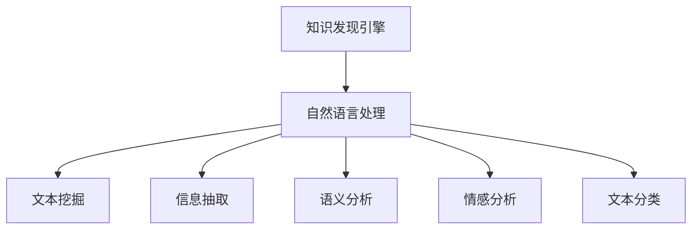

                 

# 知识发现引擎的自然语言处理技术应用

> 关键词：知识发现引擎, 自然语言处理(NLP), 文本挖掘, 信息抽取, 语义分析, 情感分析, 文本分类

## 1. 背景介绍

### 1.1 问题由来
在现代信息爆炸的时代，数据已经成为了企业最宝贵的资产之一。然而，传统的结构化数据管理方式，如表格、文档等，已经难以满足日益增长的数据需求。人们需要一种更为高效、灵活的数据管理方式，能够自动发现并提取有价值的信息，支撑决策支持、知识驱动等高级应用。在这种背景下，知识发现引擎(Knowledge Discovery Engine, KDE)应运而生。

知识发现引擎通过对大量非结构化数据进行分析，自动挖掘出隐藏在文本、图片、视频等媒体中的有用信息，为决策者提供数据支持。在这个过程中，自然语言处理(Natural Language Processing, NLP)技术扮演着至关重要的角色。NLP技术能够自动识别、提取和理解文本中的实体、关系、事件等信息，帮助知识发现引擎快速完成信息抽取、语义分析等任务。

### 1.2 问题核心关键点
目前，知识发现引擎在诸多领域都有广泛应用，如金融、医疗、零售、能源等。NLP技术在知识发现引擎中的关键应用点包括：

- 文本挖掘：自动发现文本中的关键词、短语、概念等信息，辅助主题建模、实体识别、情感分析等任务。
- 信息抽取：从文本中抽取结构化信息，如事件、关系、实体等，生成结构化数据库或知识图谱。
- 语义分析：理解文本的含义和背景信息，进行关键词关系、实体关系等分析。
- 情感分析：分析文本的情感倾向，评估公众舆情、市场情绪等。
- 文本分类：对文本进行分类，如新闻分类、文章分类等，便于信息归档和检索。

NLP技术在大数据时代的兴起，为知识发现引擎带来了质的飞跃，其重要性和应用前景愈发突出。

## 2. 核心概念与联系

### 2.1 核心概念概述

为更好地理解知识发现引擎中NLP技术的应用，本节将介绍几个密切相关的核心概念：

- 知识发现引擎(KDE)：通过对非结构化数据进行分析，自动发现并提取隐藏在其中的有用信息，辅助决策支持和知识管理。
- 自然语言处理(NLP)：一种利用计算机技术对自然语言进行处理和分析的学科，能够理解、生成、分析和评价自然语言。
- 文本挖掘(Text Mining)：从大量文本数据中自动抽取有用信息的过程，如关键词提取、主题建模、实体识别等。
- 信息抽取(Information Extraction)：从非结构化文本中抽取结构化信息，如实体关系、事件序列等，生成知识图谱或数据库。
- 语义分析(Semantic Analysis)：理解文本的含义和上下文信息，进行实体关系、关键词关系等分析。
- 情感分析(Sentiment Analysis)：分析文本的情感倾向，评估公众舆情、市场情绪等。
- 文本分类(Text Classification)：对文本进行分类，如新闻分类、文章分类等，便于信息归档和检索。

这些核心概念之间的逻辑关系可以通过以下Mermaid流程图来展示：



这个流程图展示了知识发现引擎中NLP技术的核心应用方向：

1. 知识发现引擎通过对非结构化数据进行分析，自动发现并提取有用信息。
2. 自然语言处理是知识发现引擎的核心技术之一，能够自动理解、分析和生成自然语言。
3. 文本挖掘、信息抽取、语义分析、情感分析、文本分类等技术，都是自然语言处理的具体应用方向。

这些核心概念共同构成了知识发现引擎的NLP技术体系，使其能够高效自动地从大量非结构化数据中提取有用信息，为决策支持和知识管理提供有力支撑。

## 3. 核心算法原理 & 具体操作步骤
### 3.1 算法原理概述

知识发现引擎中的NLP技术，主要是通过机器学习算法和大规模语料库进行训练，自动发现和提取文本中的信息。其核心算法原理包括：

- 文本挖掘：通过文本分类、主题建模等算法，自动提取文本中的关键词、短语、主题等信息。
- 信息抽取：利用实体识别、关系抽取等算法，从文本中抽取结构化信息，如实体关系、事件序列等。
- 语义分析：通过词向量表示、依存句法分析等方法，理解文本的含义和上下文信息，进行实体关系、关键词关系等分析。
- 情感分析：使用情感词典、机器学习算法等方法，自动评估文本的情感倾向，如正面、负面、中性等。
- 文本分类：通过训练分类器，对文本进行自动分类，如新闻分类、文章分类等。

这些算法原理涵盖了自然语言处理的各个方面，是知识发现引擎实现信息抽取、语义分析、情感分析等任务的基础。

### 3.2 算法步骤详解

知识发现引擎中的NLP技术应用步骤通常包括以下几个关键步骤：

**Step 1: 数据预处理**
- 收集和清洗非结构化数据，如新闻、社交媒体帖子、客户评论等。
- 对文本进行分词、去停用词、标准化等预处理，去除噪音和无关信息。

**Step 2: 特征提取**
- 使用TF-IDF、词向量等方法提取文本特征，生成文本向量。
- 对于实体识别、关系抽取等任务，使用预训练的BERT、GPT等模型提取文本特征。

**Step 3: 模型训练**
- 选择合适的算法进行训练，如逻辑回归、随机森林、支持向量机等。
- 在标注数据上训练分类器、序列标注器、实体关系抽取器等模型。
- 对于情感分析、语义分析等任务，使用预训练模型进行微调。

**Step 4: 模型评估**
- 在验证集上评估模型的性能，选择合适的指标如准确率、召回率、F1分数等。
- 调整模型参数，优化模型性能。

**Step 5: 部署与监控**
- 将训练好的模型部署到生产环境中，进行信息抽取、情感分析、语义分析等任务。
- 实时监控模型性能，根据业务需求调整模型参数。

### 3.3 算法优缺点

知识发现引擎中的NLP技术具有以下优点：
1. 高效自动化。自动发现和提取文本信息，降低人工成本，提高工作效率。
2. 处理海量数据。能够处理大规模的非结构化数据，发现隐藏在海量数据中的有用信息。
3. 多任务支持。能够同时进行文本挖掘、信息抽取、语义分析、情感分析等任务，提供全面的信息支持。
4. 模型效果良好。通过大规模语料库的训练，模型在信息抽取、情感分析等任务上取得了较好的效果。

同时，这些算法也存在一些缺点：
1. 数据依赖性强。依赖于大量标注数据进行训练，标注数据质量和数量对模型性能有很大影响。
2. 模型复杂度高。NLP模型参数量较大，训练和推理耗时较长。
3. 应用领域限制。对于一些特定的领域或任务，NLP模型的泛化能力有限，需要进一步优化和改进。
4. 结果解释性差。NLP模型往往是黑盒模型，难以解释其内部决策过程和推理逻辑。

尽管存在这些局限性，NLP技术在知识发现引擎中的应用已经取得了显著的成效，成为现代数据管理的重要工具。

### 3.4 算法应用领域

知识发现引擎中的NLP技术，已经在多个领域得到了广泛的应用，如金融、医疗、零售、能源等：

- **金融领域**：从大量新闻、市场报告中自动抽取有用信息，如股票价格、市场情绪、事件等，辅助投资决策。
- **医疗领域**：从临床记录、研究论文中提取医学实体、关系、疾病信息，生成知识图谱，支持临床研究和疾病诊断。
- **零售领域**：从客户评论、社交媒体中提取产品评价、品牌声誉等信息，进行市场分析和客户管理。
- **能源领域**：从新闻、报告中提取能源价格、政策等信息，辅助能源市场预测和决策。

除了这些传统应用领域外，NLP技术在信息抽取、情感分析、语义分析等方向的应用也日益广泛，为各个行业带来了新的发展机遇。

## 4. 数学模型和公式 & 详细讲解 & 举例说明

### 4.1 数学模型构建

在知识发现引擎中，NLP技术主要通过机器学习算法和大规模语料库进行训练。以情感分析为例，构建情感分析模型的数学模型如下：

假设文本数据集为 $D=\{(x_i, y_i)\}_{i=1}^N$，其中 $x_i$ 为文本，$y_i$ 为情感标签，取值为 $+1$（正面）或 $-1$（负面）。情感分析的目标是训练一个分类器，将文本分类为正面或负面。假设训练好的分类器为 $M(x)$，输出概率为 $P(y|x)$，则情感分析的数学模型可以表示为：

$$
P(y|x) = \frac{e^{M(x)}(1+yM(x))}{1+e^{M(x)}(1+yM(x))}
$$

其中 $M(x)$ 为分类器的输出，$y=1$ 时表示文本为正面，$y=-1$ 时表示文本为负面。

### 4.2 公式推导过程

情感分析模型的推导过程如下：

假设训练集为 $D=\{(x_i, y_i)\}_{i=1}^N$，其中 $x_i$ 为文本，$y_i$ 为情感标签。训练分类器的目标是最小化损失函数：

$$
\mathcal{L}(M) = -\frac{1}{N}\sum_{i=1}^N [y_i\log P(y_i|x_i)+(1-y_i)\log (1-P(y_i|x_i))]
$$

其中 $P(y_i|x_i)$ 为分类器在 $x_i$ 上输出 $y_i$ 的概率。根据贝叶斯定理，$P(y_i|x_i)$ 可以表示为：

$$
P(y_i|x_i) = \frac{P(y_i)P(x_i|y_i)}{\sum_{j=1}^2P(y_j)P(x_i|y_j)}
$$

将上述公式代入损失函数，得：

$$
\mathcal{L}(M) = -\frac{1}{N}\sum_{i=1}^N [y_i\log P(y_i|x_i)+(1-y_i)\log (1-P(y_i|x_i)) - P(y_i)\log P(x_i|y_i) - P(y_i)\log (\sum_{j=1}^2P(y_j)P(x_i|y_j))]
$$

简化后得：

$$
\mathcal{L}(M) = -\frac{1}{N}\sum_{i=1}^N [-y_i\log P(y_i|x_i)-(1-y_i)\log (1-P(y_i|x_i)) - P(y_i)\log P(x_i|y_i)]
$$

进一步简化得：

$$
\mathcal{L}(M) = -\frac{1}{N}\sum_{i=1}^N [y_i\log P(y_i|x_i)+(1-y_i)\log (1-P(y_i|x_i))]
$$

这就是情感分析模型的损失函数，用于训练分类器。

### 4.3 案例分析与讲解

以下以金融领域的新闻情感分析为例，展示NLP技术在知识发现引擎中的应用。

**数据准备**：
- 收集大量新闻文本数据，标注其情感倾向，生成标注数据集。
- 对文本进行预处理，如分词、去停用词、标准化等。

**模型构建**：
- 使用预训练的BERT模型作为特征提取器，提取文本特征。
- 将提取的文本特征输入到情感分类器中，进行训练。

**模型评估**：
- 在验证集上评估模型的情感分类效果，计算准确率、召回率、F1分数等指标。
- 根据评估结果调整模型参数，优化模型性能。

**模型部署**：
- 将训练好的模型部署到生产环境中，实时监测金融新闻的情感倾向。
- 根据情感分析结果，生成市场情绪报告，辅助投资决策。

## 5. 项目实践：代码实例和详细解释说明

### 5.1 开发环境搭建

在进行NLP项目实践前，我们需要准备好开发环境。以下是使用Python进行PyTorch开发的环境配置流程：

1. 安装Anaconda：从官网下载并安装Anaconda，用于创建独立的Python环境。

2. 创建并激活虚拟环境：
```bash
conda create -n pytorch-env python=3.8 
conda activate pytorch-env
```

3. 安装PyTorch：根据CUDA版本，从官网获取对应的安装命令。例如：
```bash
conda install pytorch torchvision torchaudio cudatoolkit=11.1 -c pytorch -c conda-forge
```

4. 安装Transformers库：
```bash
pip install transformers
```

5. 安装各类工具包：
```bash
pip install numpy pandas scikit-learn matplotlib tqdm jupyter notebook ipython
```

完成上述步骤后，即可在`pytorch-env`环境中开始NLP项目实践。

### 5.2 源代码详细实现

这里我们以情感分析为例，给出使用Transformers库对BERT模型进行情感分析的PyTorch代码实现。

首先，定义情感分类器：

```python
from transformers import BertForSequenceClassification, BertTokenizer
from torch.utils.data import Dataset, DataLoader
from torch.nn import BCEWithLogitsLoss
from sklearn.metrics import accuracy_score, precision_score, recall_score, f1_score

class SentimentDataset(Dataset):
    def __init__(self, texts, labels):
        self.texts = texts
        self.labels = labels
        self.tokenizer = BertTokenizer.from_pretrained('bert-base-uncased')
        
    def __len__(self):
        return len(self.texts)
    
    def __getitem__(self, item):
        text = self.texts[item]
        label = self.labels[item]
        
        encoding = self.tokenizer(text, truncation=True, padding='max_length', max_length=512, return_tensors='pt')
        input_ids = encoding['input_ids']
        attention_mask = encoding['attention_mask']
        
        return {'input_ids': input_ids, 
                'attention_mask': attention_mask,
                'labels': label}

# 创建dataset
tokenizer = BertTokenizer.from_pretrained('bert-base-uncased')
train_dataset = SentimentDataset(train_texts, train_labels)
dev_dataset = SentimentDataset(dev_texts, dev_labels)
test_dataset = SentimentDataset(test_texts, test_labels)

# 定义模型
model = BertForSequenceClassification.from_pretrained('bert-base-uncased', num_labels=2)

# 定义优化器
optimizer = AdamW(model.parameters(), lr=2e-5)

# 定义损失函数
loss_fn = BCEWithLogitsLoss()

# 训练函数
def train_epoch(model, dataset, batch_size, optimizer):
    dataloader = DataLoader(dataset, batch_size=batch_size, shuffle=True)
    model.train()
    epoch_loss = 0
    for batch in dataloader:
        input_ids = batch['input_ids'].to(device)
        attention_mask = batch['attention_mask'].to(device)
        labels = batch['labels'].to(device)
        model.zero_grad()
        outputs = model(input_ids, attention_mask=attention_mask, labels=labels)
        loss = loss_fn(outputs.logits, labels)
        epoch_loss += loss.item()
        loss.backward()
        optimizer.step()
    return epoch_loss / len(dataloader)

# 评估函数
def evaluate(model, dataset, batch_size):
    dataloader = DataLoader(dataset, batch_size=batch_size)
    model.eval()
    preds, labels = [], []
    with torch.no_grad():
        for batch in dataloader:
            input_ids = batch['input_ids'].to(device)
            attention_mask = batch['attention_mask'].to(device)
            labels = batch['labels'].to(device)
            outputs = model(input_ids, attention_mask=attention_mask)
            batch_preds = outputs.logits.argmax(dim=1).to('cpu').tolist()
            batch_labels = labels.to('cpu').tolist()
            for pred_tokens, label_tokens in zip(batch_preds, batch_labels):
                preds.append(pred_tokens)
                labels.append(label_tokens)
                
    print(classification_report(labels, preds))
```

然后，启动情感分析训练流程并在测试集上评估：

```python
epochs = 5
batch_size = 16

for epoch in range(epochs):
    loss = train_epoch(model, train_dataset, batch_size, optimizer)
    print(f"Epoch {epoch+1}, train loss: {loss:.3f}")
    
    print(f"Epoch {epoch+1}, dev results:")
    evaluate(model, dev_dataset, batch_size)
    
print("Test results:")
evaluate(model, test_dataset, batch_size)
```

以上就是使用PyTorch对BERT模型进行情感分析的完整代码实现。可以看到，得益于Transformers库的强大封装，我们可以用相对简洁的代码完成BERT模型的加载和情感分析任务。

### 5.3 代码解读与分析

让我们再详细解读一下关键代码的实现细节：

**SentimentDataset类**：
- `__init__`方法：初始化文本、标签、分词器等关键组件。
- `__len__`方法：返回数据集的样本数量。
- `__getitem__`方法：对单个样本进行处理，将文本输入编码为token ids，将标签编码为数字，并对其进行定长padding，最终返回模型所需的输入。

**模型和优化器**：
- 定义了情感分类器模型，使用BertForSequenceClassification类。
- 定义了AdamW优化器，学习率为2e-5。
- 定义了BCEWithLogitsLoss损失函数，用于二分类任务的损失计算。

**训练函数**：
- 使用PyTorch的DataLoader对数据集进行批次化加载，供模型训练使用。
- 在每个批次上前向传播计算loss并反向传播更新模型参数，最后返回该epoch的平均loss。

**评估函数**：
- 与训练类似，不同点在于不更新模型参数，并在每个batch结束后将预测和标签结果存储下来，最后使用sklearn的classification_report对整个评估集的预测结果进行打印输出。

**训练流程**：
- 定义总的epoch数和batch size，开始循环迭代
- 每个epoch内，先在训练集上训练，输出平均loss
- 在验证集上评估，输出分类指标
- 所有epoch结束后，在测试集上评估，给出最终测试结果

可以看到，PyTorch配合Transformers库使得BERT情感分析的代码实现变得简洁高效。开发者可以将更多精力放在数据处理、模型改进等高层逻辑上，而不必过多关注底层的实现细节。

当然，工业级的系统实现还需考虑更多因素，如模型的保存和部署、超参数的自动搜索、更灵活的任务适配层等。但核心的情感分析范式基本与此类似。

## 6. 实际应用场景

### 6.1 智能投研

在金融领域，NLP技术已经被广泛应用于智能投研系统的构建。传统的投研工作往往依赖分析师的经验和判断，容易受到主观因素的影响，且难以快速适应市场变化。通过NLP技术，智能投研系统能够自动监测和分析新闻、市场报告、社交媒体等海量数据，提供实时的市场情绪、舆情监测、热点分析等服务，辅助投资决策。

具体而言，可以收集金融领域相关的新闻、公告、社交媒体帖子等文本数据，进行情感分析和主题建模。通过情感分析，评估市场情绪，判断市场走势。通过主题建模，识别出市场关注的热点事件，进行事件驱动的投资分析。如此构建的智能投研系统，能大幅提升投资决策的效率和精准度。

### 6.2 医疗问答

在医疗领域，NLP技术被广泛应用于医疗问答系统的构建。传统的医疗问答依赖医生的人工回答，耗时长且效率低。通过NLP技术，医疗问答系统能够自动理解病人的咨询内容，匹配最合适的回答。

具体而言，可以收集大量医学文献、临床记录、病人咨询等文本数据，进行实体识别和关系抽取。通过实体识别，提取文本中的疾病、症状、药品等信息。通过关系抽取，分析疾病与症状、药品之间的关系。在用户咨询时，自动匹配最相关的医学知识和答案，生成简明易懂的回答。如此构建的医疗问答系统，能够快速响应病人的咨询需求，提供高质量的医疗建议。

### 6.3 舆情分析

在社会舆情分析中，NLP技术能够自动从海量社交媒体、新闻等文本数据中提取有用信息，分析公众情绪和舆情变化。通过NLP技术，可以自动识别热点事件、公众情绪、舆情变化等，为政府和企业提供实时的舆情监测和分析报告。

具体而言，可以收集社交媒体、新闻等文本数据，进行情感分析和主题建模。通过情感分析，评估公众情绪，判断舆情变化趋势。通过主题建模，识别出舆情关注的焦点事件。在舆情变化时，自动生成舆情报告，供决策者参考。如此构建的舆情分析系统，能够及时响应舆情变化，辅助决策者制定应对策略。

## 7. 工具和资源推荐

### 7.1 学习资源推荐

为了帮助开发者系统掌握NLP技术在知识发现引擎中的应用，这里推荐一些优质的学习资源：

1. 《自然语言处理综论》：清华大学郑理和颜慧等著，全面介绍了NLP的基础理论、技术和应用。

2. 《深度学习入门：基于PyTorch的理论与实现》：李沐著，深入浅出地介绍了深度学习的基本概念和NLP任务的实现。

3. 《自然语言处理与深度学习》：斯坦福大学李飞飞等著，涵盖NLP和深度学习的最新进展和应用案例。

4. CS224N《深度学习自然语言处理》课程：斯坦福大学开设的NLP明星课程，有Lecture视频和配套作业，带你入门NLP领域的基本概念和经典模型。

5. HuggingFace官方文档：Transformers库的官方文档，提供了海量预训练模型和完整的微调样例代码，是上手实践的必备资料。

通过对这些资源的学习实践，相信你一定能够快速掌握NLP技术在知识发现引擎中的应用，并用于解决实际的NLP问题。

### 7.2 开发工具推荐

高效的开发离不开优秀的工具支持。以下是几款用于NLP项目开发的常用工具：

1. PyTorch：基于Python的开源深度学习框架，灵活动态的计算图，适合快速迭代研究。大部分预训练语言模型都有PyTorch版本的实现。

2. TensorFlow：由Google主导开发的开源深度学习框架，生产部署方便，适合大规模工程应用。同样有丰富的预训练语言模型资源。

3. Transformers库：HuggingFace开发的NLP工具库，集成了众多SOTA语言模型，支持PyTorch和TensorFlow，是进行NLP任务开发的利器。

4. Weights & Biases：模型训练的实验跟踪工具，可以记录和可视化模型训练过程中的各项指标，方便对比和调优。与主流深度学习框架无缝集成。

5. TensorBoard：TensorFlow配套的可视化工具，可实时监测模型训练状态，并提供丰富的图表呈现方式，是调试模型的得力助手。

6. Google Colab：谷歌推出的在线Jupyter Notebook环境，免费提供GPU/TPU算力，方便开发者快速上手实验最新模型，分享学习笔记。

合理利用这些工具，可以显著提升NLP项目开发的效率，加快创新迭代的步伐。

### 7.3 相关论文推荐

NLP技术在大数据时代的兴起，源于学界的持续研究。以下是几篇奠基性的相关论文，推荐阅读：

1. Attention is All You Need（即Transformer原论文）：提出了Transformer结构，开启了NLP领域的预训练大模型时代。

2. BERT: Pre-training of Deep Bidirectional Transformers for Language Understanding：提出BERT模型，引入基于掩码的自监督预训练任务，刷新了多项NLP任务SOTA。

3. Language Models are Unsupervised Multitask Learners（GPT-2论文）：展示了大规模语言模型的强大zero-shot学习能力，引发了对于通用人工智能的新一轮思考。

4. Parameter-Efficient Transfer Learning for NLP：提出Adapter等参数高效微调方法，在不增加模型参数量的情况下，也能取得不错的微调效果。

5. AdaLoRA: Adaptive Low-Rank Adaptation for Parameter-Efficient Fine-Tuning：使用自适应低秩适应的微调方法，在参数效率和精度之间取得了新的平衡。

这些论文代表了大规模语言模型微调技术的发展脉络。通过学习这些前沿成果，可以帮助研究者把握学科前进方向，激发更多的创新灵感。

## 8. 总结：未来发展趋势与挑战

### 8.1 总结

本文对知识发现引擎中NLP技术的应用进行了全面系统的介绍。首先阐述了NLP技术在知识发现引擎中的重要作用，明确了其在文本挖掘、信息抽取、语义分析、情感分析等任务中的应用方向。其次，从原理到实践，详细讲解了NLP任务的算法原理和操作步骤，给出了完整的代码实例和详细解释说明。同时，本文还广泛探讨了NLP技术在智能投研、医疗问答、舆情分析等多个行业领域的应用前景，展示了NLP技术在知识发现引擎中的巨大潜力。

通过本文的系统梳理，可以看到，NLP技术在知识发现引擎中的应用已经取得了显著的成效，成为现代数据管理的重要工具。未来，伴随NLP技术的进一步发展，知识发现引擎必将在更多领域带来变革性影响，为决策支持和知识管理提供更有力的技术支撑。

### 8.2 未来发展趋势

展望未来，NLP技术在知识发现引擎中的应用将呈现以下几个发展趋势：

1. 模型规模持续增大。随着算力成本的下降和数据规模的扩张，预训练语言模型的参数量还将持续增长。超大规模语言模型蕴含的丰富语言知识，有望支撑更加复杂多变的下游任务。

2. 多任务学习成为常态。NLP模型将更加注重多任务学习，在多个任务之间共享知识和参数，提高模型的泛化能力和应用灵活性。

3. 零样本学习和少样本学习兴起。受启发于 Prompt 学习的思路，未来的NLP模型将更好地利用预训练知识，通过少样本或零样本学习，在更少的标注样本上也能实现理想的效果。

4. 知识图谱与NLP的深度融合。通过知识图谱和NLP技术的结合，可以构建更加全面、精确的信息抽取和语义分析系统，提升知识发现引擎的智能化水平。

5. 跨模态学习成为热点。NLP模型将与其他模态的数据融合，如视觉、音频等，形成跨模态的知识发现引擎，提供更全面、更深入的信息抽取和分析能力。

6. 自监督学习逐渐普及。自监督学习技术将广泛应用于NLP模型的预训练和微调过程中，降低对标注数据的依赖，提高模型的鲁棒性和泛化能力。

以上趋势凸显了NLP技术在知识发现引擎中的广泛应用前景，NLP技术将不断推动知识发现引擎向更高智能化水平发展。

### 8.3 面临的挑战

尽管NLP技术在知识发现引擎中的应用已经取得了显著成效，但在迈向更加智能化、普适化应用的过程中，仍面临诸多挑战：

1. 数据依赖性强。依赖于大量标注数据进行训练，标注数据质量和数量对模型性能有很大影响。如何获取高质量、大规模的标注数据，仍是亟待解决的问题。

2. 模型复杂度高。NLP模型参数量较大，训练和推理耗时较长，对硬件资源要求较高。如何优化模型结构，提高模型推理效率，仍是重要的研究方向。

3. 结果解释性差。NLP模型往往是黑盒模型，难以解释其内部决策过程和推理逻辑。如何赋予NLP模型更强的可解释性，提供更加透明和可信的决策支持，将是未来亟待解决的问题。

4. 应用领域限制。对于一些特定的领域或任务，NLP模型的泛化能力有限，需要进一步优化和改进。如何提高NLP模型在不同领域和任务上的泛化能力，仍是重要的研究方向。

5. 安全性问题。NLP模型容易学习到有害、歧视性信息，甚至可能被用于恶意用途。如何增强NLP模型的安全性，确保其输出符合伦理道德标准，将是未来亟待解决的问题。

6. 知识融合能力不足。现有的NLP模型往往局限于文本信息的抽取和分析，难以灵活吸收和运用更广泛的先验知识。如何让NLP模型更好地与外部知识库、规则库等专家知识结合，形成更加全面、准确的信息整合能力，仍有较大的提升空间。

这些挑战反映了NLP技术在知识发现引擎中的应用仍处于快速发展阶段，需要更多理论和实践的积累和突破。

### 8.4 研究展望

面向未来，NLP技术在知识发现引擎中的应用还需要在以下几个方面进行深入研究：

1. 探索无监督和半监督微调方法。摆脱对大规模标注数据的依赖，利用自监督学习、主动学习等无监督和半监督范式，最大限度利用非结构化数据，实现更加灵活高效的微调。

2. 研究参数高效和计算高效的微调范式。开发更加参数高效的微调方法，在固定大部分预训练参数的同时，只更新极少量的任务相关参数。同时优化微调模型的计算图，减少前向传播和反向传播的资源消耗，实现更加轻量级、实时性的部署。

3. 引入因果和对比学习范式。通过引入因果推断和对比学习思想，增强NLP模型建立稳定因果关系的能力，学习更加普适、鲁棒的语言表征，从而提升模型泛化性和抗干扰能力。

4. 纳入伦理道德约束。在模型训练目标中引入伦理导向的评估指标，过滤和惩罚有偏见、有害的输出倾向。同时加强人工干预和审核，建立模型行为的监管机制，确保输出符合人类价值观和伦理道德。

这些研究方向将进一步提升NLP技术在知识发现引擎中的应用水平，为构建安全、可靠、可解释、可控的智能系统铺平道路。面向未来，NLP技术还需要与其他人工智能技术进行更深入的融合，如知识表示、因果推理、强化学习等，多路径协同发力，共同推动自然语言理解和智能交互系统的进步。只有勇于创新、敢于突破，才能不断拓展NLP技术的边界，让智能技术更好地造福人类社会。

## 9. 附录：常见问题与解答

**Q1：NLP技术在知识发现引擎中的应用是否适用于所有领域？**

A: NLP技术在知识发现引擎中的应用已经取得了显著的成效，但并不是适用于所有领域。对于一些特定领域，如生物医学、法律等，NLP模型的泛化能力有限，需要进一步优化和改进。此外，对于一些需要实时性、个性化很强的任务，如对话、推荐等，NLP模型的应用也需要针对性的改进优化。

**Q2：如何缓解NLP模型在知识发现引擎中的过拟合问题？**

A: 缓解NLP模型在知识发现引擎中的过拟合问题，可以采取以下策略：
1. 数据增强：通过回译、近义替换等方式扩充训练集。
2. 正则化：使用L2正则、Dropout、Early Stopping等避免过拟合。
3. 对抗训练：引入对抗样本，提高模型鲁棒性。
4. 参数高效微调：只调整少量参数，减少需优化的参数量。
5. 多模型集成：训练多个NLP模型，取平均输出，抑制过拟合。

这些策略往往需要根据具体任务和数据特点进行灵活组合。只有在数据、模型、训练、推理等各环节进行全面优化，才能最大限度地发挥NLP模型的性能。

**Q3：如何在NLP项目中实现高效开发？**

A: 在NLP项目中实现高效开发，可以采取以下措施：
1. 使用先进的深度学习框架和工具，如PyTorch、TensorFlow、Transformers库等，提供高效开发环境。
2. 采用模块化和组件化的开发方式，提高代码复用性和可维护性。
3. 采用分布式训练和推理，提高计算效率和模型性能。
4. 利用云计算平台，如Google Colab、AWS、阿里云等，提供灵活的算力和存储资源。
5. 引入自动化测试和部署工具，如TensorBoard、Weights & Biases等，提高开发效率和质量。

通过这些措施，可以显著提升NLP项目的开发效率，加快创新迭代的步伐。

---

作者：禅与计算机程序设计艺术 / Zen and the Art of Computer Programming

