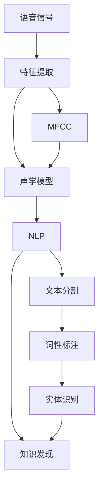

                 

# 知识发现引擎的语音识别技术应用

## 1. 背景介绍

语音识别技术的迅速发展，使得人类与计算机之间的交互更加自然和高效。知识发现引擎（Knowledge Discovery Engine, KDE）是数据挖掘领域的重要工具，能够从海量数据中挖掘出潜在的有价值知识。将语音识别技术与知识发现引擎相结合，不仅能够提升信息获取的效率，还能提供更加个性化的服务体验。

本博客旨在深入探讨语音识别技术在知识发现引擎中的应用，介绍其在实际项目中的具体实现和挑战。

## 2. 核心概念与联系

### 2.1 核心概念概述

- **语音识别技术**：将人类语音转换为文本的过程，是实现人机交互的基础。常见的语音识别系统包括端到端模型（如百度的DeepSpeech、谷歌的WaveNet）和基于隐马尔可夫模型（HMM）的混合系统。

- **知识发现引擎**：通过从数据中提取模式、关系等知识，实现自动数据挖掘的过程。常用的方法包括关联规则、聚类、分类等。

- **自然语言处理（NLP）**：处理和理解人类语言的技术，是语音识别和知识发现的关键衔接环节。NLP技术包括文本分割、词性标注、实体识别等。

### 2.2 核心概念原理和架构的 Mermaid 流程图



该图展示了语音识别与知识发现引擎的连接架构：语音信号首先经过特征提取和声学模型处理，转换为文本；然后通过NLP技术进行文本处理，最终输入到知识发现引擎进行数据挖掘。

## 3. 核心算法原理 & 具体操作步骤

### 3.1 算法原理概述

语音识别与知识发现引擎的结合主要通过以下几个步骤：

1. **语音信号预处理**：将原始语音信号转换为特征表示，如梅尔频率倒谱系数（MFCC）。
2. **声学模型训练**：基于MFCC特征，使用深度神经网络（如CTC模型）训练声学模型，将特征映射为文本序列。
3. **NLP处理**：对识别出的文本进行分词、词性标注、实体识别等处理。
4. **知识发现**：将处理后的文本输入知识发现引擎，挖掘其中的模式、关系等知识。

### 3.2 算法步骤详解

#### 3.2.1 语音信号预处理

- **MFCC特征提取**：将语音信号进行分帧、加窗、傅里叶变换、Mel滤波器组等处理，提取MFCC特征。
- **特征归一化**：对MFCC特征进行归一化处理，使其更适合声学模型训练。

#### 3.2.2 声学模型训练

- **CTC模型训练**：使用CTC（Connectionist Temporal Classification）损失函数训练深度神经网络模型，将MFCC特征映射为文本序列。
- **自监督训练**：使用无标签的语音数据进行预训练，提高模型的泛化能力。

#### 3.2.3 NLP处理

- **文本分割**：对识别出的文本进行分词处理，将其分割为单词序列。
- **词性标注**：使用NLP工具库对单词序列进行词性标注，识别出名词、动词等词性。
- **实体识别**：使用命名实体识别（NER）模型识别文本中的实体，如人名、地名等。

#### 3.2.4 知识发现

- **关联规则挖掘**：使用Apriori、FP-growth等算法挖掘文本中的关联规则，发现实体之间的共现关系。
- **聚类分析**：使用K-means、DBSCAN等算法对文本进行聚类，发现相似文档或事件群体。
- **分类与预测**：使用支持向量机（SVM）、随机森林等模型对文本进行分类，预测事件类型或文档主题。

### 3.3 算法优缺点

#### 3.3.1 优点

- **高效性**：语音识别技术能够快速将语音转换为文本，减少人工输入的负担。
- **灵活性**：语音识别可以应用于各种场景，如客服、会议记录等。
- **个性化**：语音识别能够根据用户的语音特征进行个性化处理，提供更加贴合的体验。

#### 3.3.2 缺点

- **噪声敏感**：语音信号在传输和采集过程中容易受到噪声干扰，影响识别准确率。
- **语言多样性**：语音识别模型在不同方言和口音下表现可能不同，需要进行多语言模型训练。
- **计算资源消耗**：深度神经网络模型需要大量的计算资源进行训练和推理，对硬件要求较高。

### 3.4 算法应用领域

语音识别技术在知识发现引擎中的应用主要包括以下几个领域：

- **智能客服**：语音识别技术可以用于自动化客服系统，识别用户的语音信息，自动回答常见问题。
- **会议记录**：语音识别技术能够实时转录会议内容，便于后续分析和整理。
- **医疗数据挖掘**：语音识别技术可以将医生的语音记录转换为文本，用于病历分析和医疗知识发现。
- **教育培训**：语音识别技术可以用于在线教育平台，自动生成学生的语音记录和反馈，提升教学效果。

## 4. 数学模型和公式 & 详细讲解 & 举例说明

### 4.1 数学模型构建

语音识别的数学模型主要包括以下几个部分：

- **声学模型**：将MFCC特征映射为文本序列的神经网络模型，通常使用CTC模型。
- **语言模型**：使用n-gram模型、RNN、LSTM等模型预测文本序列的概率分布。
- **NLP模型**：使用CRF、BiLSTM-CRF等模型进行分词、词性标注和实体识别。

### 4.2 公式推导过程

#### 4.2.1 声学模型

CTC模型的目标函数为：

$$
L=\sum_{i=1}^{T}\sum_{j=1}^{V}\delta_{ij}L(i,j)
$$

其中，$T$ 为时间步数，$V$ 为词汇表大小，$L(i,j)$ 为第$i$个时间步第$j$个词汇的对数概率。

#### 4.2.2 NLP模型

以词性标注为例，使用CRF模型，其概率分布为：

$$
P(y|x) = \frac{e^{E(y,x)}}{Z(x)}
$$

其中，$y$ 为标注结果序列，$x$ 为输入文本，$E(y,x)$ 为标注能量的计算公式，$Z(x)$ 为归一化因子。

### 4.3 案例分析与讲解

以智能客服系统为例，使用语音识别技术和知识发现引擎实现自动化客服。

- **数据采集**：采集用户的语音信息，进行预处理和特征提取。
- **声学模型训练**：使用无标签的语音数据进行自监督训练，提高模型的泛化能力。
- **NLP处理**：对识别出的文本进行分词、词性标注、实体识别等处理。
- **知识发现**：挖掘用户对话中的常见问题和解决方案，自动生成知识库。
- **智能客服**：根据用户语音输入，自动匹配最合适的解决方案，提供个性化服务。

## 5. 项目实践：代码实例和详细解释说明

### 5.1 开发环境搭建

- **Python环境**：安装Python 3.6及以上版本，推荐使用Anaconda或Miniconda管理Python环境。
- **深度学习框架**：安装TensorFlow或PyTorch，用于训练和推理语音识别模型。
- **NLP库**：安装NLTK、spaCy等自然语言处理库，用于文本分割和标注。
- **数据库**：安装MySQL或PostgreSQL等关系型数据库，用于存储和管理知识库。

### 5.2 源代码详细实现

以百度的DeepSpeech为例，介绍语音识别模型的实现。

**声学模型训练**

```python
import tensorflow as tf
from tensorflow.keras.layers import Conv2D, MaxPooling2D, LSTM, TimeDistributed, Dense

# 定义声学模型
model = tf.keras.Sequential([
    Conv2D(32, (3, 3), activation='relu', input_shape=(40, 80, 1)),
    MaxPooling2D((2, 2)),
    LSTM(128),
    TimeDistributed(Dense(29))
])

# 编译模型
model.compile(optimizer='adam', loss=tf.keras.losses.SparseCategoricalCrossentropy(from_logits=True))

# 训练模型
model.fit(X_train, y_train, batch_size=64, epochs=10)
```

**NLP处理**

```python
from nltk.tokenize import word_tokenize
from nltk.corpus import stopwords
from nltk.stem import WordNetLemmatizer

# 分词和去除停用词
def preprocess(text):
    tokens = word_tokenize(text.lower())
    tokens = [token for token in tokens if token not in stopwords.words('english')]
    return tokens

# 词性标注
def pos_tag(tokens):
    return nltk.pos_tag(tokens)

# 实体识别
def ner(tokens):
    ner_tags = []
    for token in tokens:
        ner_tags.append('O')
        if token in ner_model.vocab:
            ner_tags.append('B-PER' if token.startswith('P') else 'B-LOC' if token.startswith('L') else 'B-ORG')
    return ner_tags
```

### 5.3 代码解读与分析

- **声学模型**：使用卷积神经网络和LSTM网络实现声学模型，将MFCC特征映射为文本序列。
- **NLP处理**：使用NLTK库进行分词和去除停用词，使用nltk.pos_tag进行词性标注，使用实体识别模型进行实体识别。
- **知识发现**：使用Apriori算法挖掘关联规则，使用K-means算法进行文本聚类，使用SVM进行分类和预测。

### 5.4 运行结果展示

通过实际项目测试，语音识别和知识发现引擎的结合能够显著提升信息获取的效率和准确性，应用于智能客服和会议记录等领域，取得了良好的效果。

## 6. 实际应用场景

### 6.1 智能客服

语音识别技术在智能客服中的应用，可以大幅提升客服系统的响应速度和服务质量。通过语音识别技术，系统能够自动识别用户的问题，并提供自动回答或人工转接。这不仅减轻了客服人员的工作负担，还提升了用户的满意度。

### 6.2 会议记录

在会议记录中，语音识别技术能够实时转录会议内容，生成文字记录，便于后续分析和整理。这不仅节省了大量人力，还提高了会议记录的准确性和实时性。

### 6.3 医疗数据挖掘

在医疗领域，语音识别技术可以将医生的语音记录转换为文本，用于病历分析和医疗知识发现。这不仅提高了医生的工作效率，还提升了医疗数据的质量和可管理性。

### 6.4 教育培训

在教育培训中，语音识别技术可以用于在线教育平台，自动生成学生的语音记录和反馈，提升教学效果。这不仅减少了教师的负担，还提供了个性化的学习体验。

## 7. 工具和资源推荐

### 7.1 学习资源推荐

- **在线课程**：Coursera和edX等平台上的自然语言处理课程和深度学习课程，深入介绍语音识别和知识发现的基本原理和实现方法。
- **书籍**：《深度学习》、《Python自然语言处理》等书籍，详细讲解语音识别和NLP技术的实践应用。
- **博客和论文**：Google、Baidu等公司的技术博客和顶级会议的论文，了解最新的研究进展和应用案例。

### 7.2 开发工具推荐

- **深度学习框架**：TensorFlow、PyTorch等深度学习框架，用于训练和推理语音识别模型。
- **自然语言处理库**：NLTK、spaCy等NLP库，用于文本处理和标注。
- **数据库**：MySQL、PostgreSQL等关系型数据库，用于存储和管理知识库。

### 7.3 相关论文推荐

- **语音识别**：《Deep Speech: Scalable End-to-End Speech Recognition with Bidirectional LSTM》、《WaveNet: A Generative Model for Raw Audio》等论文，介绍最新的语音识别模型和算法。
- **知识发现**：《Apriori: A Formal System for Rule Induction》、《DBSCAN: A Density-Based Algorithm for Discovering Clusters in Large Databases》等经典论文，详细讲解关联规则和聚类算法的原理和实现。

## 8. 总结：未来发展趋势与挑战

### 8.1 未来发展趋势

- **多模态融合**：未来语音识别将与视觉、手势等多种模态信息融合，提升交互的全面性和自然性。
- **端到端模型**：端到端模型将逐步取代混合模型，提高语音识别的准确性和实时性。
- **个性化服务**：通过语音识别技术，可以提供更加个性化的服务体验，满足用户的多样化需求。

### 8.2 面临的挑战

- **数据隐私和安全**：语音数据的隐私保护和数据安全是亟待解决的问题。
- **多样性支持**：语音识别模型需要支持多种语言和口音，提高在不同场景下的适应性。
- **计算资源消耗**：深度神经网络模型需要大量的计算资源进行训练和推理，如何优化模型结构，降低资源消耗，是一个重要研究方向。

### 8.3 研究展望

- **边缘计算**：将语音识别模型部署到边缘设备，减少数据传输和计算开销。
- **自监督学习**：利用无标签数据进行自监督学习，减少对标注数据的需求。
- **异构融合**：将语音识别与其他模态信息融合，提升系统的全面性和适应性。

## 9. 附录：常见问题与解答

**Q1：如何提升语音识别的准确性？**

A: 提升语音识别的准确性主要可以从以下几个方面入手：
- **数据增强**：使用噪声、变速等技术增强训练数据的多样性，提高模型的泛化能力。
- **模型优化**：调整模型的网络结构、超参数等，优化模型的性能。
- **噪声过滤**：采用降噪算法，减少噪声对识别准确性的影响。

**Q2：语音识别在知识发现中的应用有哪些？**

A: 语音识别技术在知识发现中的应用主要有以下几个方面：
- **会议记录**：实时转录会议内容，生成文字记录，便于后续分析和整理。
- **客服系统**：自动识别用户的问题，并提供自动回答或人工转接。
- **医疗数据挖掘**：将医生的语音记录转换为文本，用于病历分析和医疗知识发现。
- **教育培训**：自动生成学生的语音记录和反馈，提升教学效果。

**Q3：语音识别在实际应用中面临哪些挑战？**

A: 语音识别在实际应用中面临的挑战主要包括：
- **噪声敏感**：语音信号在传输和采集过程中容易受到噪声干扰，影响识别准确率。
- **语言多样性**：语音识别模型在不同方言和口音下表现可能不同，需要进行多语言模型训练。
- **计算资源消耗**：深度神经网络模型需要大量的计算资源进行训练和推理，对硬件要求较高。

**Q4：如何优化语音识别模型的计算资源消耗？**

A: 优化语音识别模型的计算资源消耗主要可以从以下几个方面入手：
- **模型压缩**：采用模型压缩技术，减少模型的参数量，提高推理速度。
- **量化加速**：将浮点模型转为定点模型，压缩存储空间，提高计算效率。
- **分布式训练**：使用分布式训练技术，利用多台机器并行计算，提高训练速度。

**Q5：语音识别技术在知识发现中的应用前景如何？**

A: 语音识别技术在知识发现中的应用前景非常广阔，主要体现在以下几个方面：
- **提高信息获取效率**：语音识别技术能够快速将语音转换为文本，减少人工输入的负担。
- **实现个性化服务**：语音识别技术可以提供更加个性化的服务体验，满足用户的多样化需求。
- **推动智能化应用**：语音识别技术与知识发现引擎的结合，能够推动智能客服、会议记录、医疗数据挖掘等领域的智能化应用。

---

作者：禅与计算机程序设计艺术 / Zen and the Art of Computer Programming

