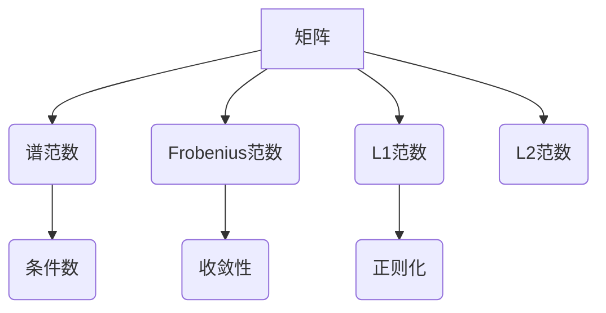

> 矩阵范数，矩阵理论，线性代数，数值计算，机器学习

## 1. 背景介绍

在现代数学和计算机科学中，矩阵扮演着至关重要的角色。从图像处理到机器学习，从控制理论到数据分析，矩阵理论和应用无处不在。其中，矩阵范数作为衡量矩阵大小和重要性的重要指标，在数值计算、机器学习、信号处理等领域有着广泛的应用。

传统的线性代数中，我们通常使用矩阵的元素大小来描述矩阵的大小。然而，这种方法并不能完全反映矩阵的整体性质。例如，两个矩阵可能拥有相同的元素大小，但其几何意义和数值稳定性却截然不同。

为了更好地理解和处理矩阵，我们需要引入更抽象的度量标准，即矩阵范数。矩阵范数可以看作是将矩阵映射到实数域上的函数，它满足一定的性质，例如：

* **非负性:** 对于任意矩阵 A，||A|| ≥ 0，且 ||A|| = 0 当且仅当 A 是零矩阵。
* **齐次性:** 对于任意矩阵 A 和任意实数 α，||αA|| = |α| ||A||。
* **三角不等式:** 对于任意矩阵 A 和 B，||A + B|| ≤ ||A|| + ||B||。

这些性质使得矩阵范数成为衡量矩阵大小和重要性的有效工具。

## 2. 核心概念与联系

### 2.1 矩阵范数的定义

矩阵范数是将矩阵映射到非负实数的函数，它满足一定的性质，例如：

* **非负性:** 对于任意矩阵 A，||A|| ≥ 0，且 ||A|| = 0 当且仅当 A 是零矩阵。
* **齐次性:** 对于任意矩阵 A 和任意实数 α，||αA|| = |α| ||A||。
* **三角不等式:** 对于任意矩阵 A 和 B，||A + B|| ≤ ||A|| + ||B||。

### 2.2 常见的矩阵范数

* **谱范数 (Spectral Norm):**  定义为矩阵所有特征值的绝对值的最大值。
* **Frobenius 范数 (Frobenius Norm):** 定义为矩阵元素平方和的平方根。
* **L1 范数 (L1 Norm):** 定义为矩阵所有元素绝对值的和。
* **L2 范数 (L2 Norm):** 定义为矩阵所有元素平方和的平方根。

### 2.3 矩阵范数与其他概念的关系

* **矩阵的条件数:** 矩阵的条件数是衡量矩阵是否“病态”的指标，它与矩阵的谱范数和逆矩阵的谱范数有关。
* **矩阵的收敛性:** 在迭代算法中，矩阵范数可以用来判断迭代过程是否收敛。
* **机器学习中的正则化:** 矩阵范数可以用来进行正则化，防止模型过拟合。



## 3. 核心算法原理 & 具体操作步骤

### 3.1  算法原理概述

矩阵范数的计算通常涉及到矩阵的特征值分解、元素平方和的计算等操作。不同的矩阵范数对应着不同的计算方法。

### 3.2  算法步骤详解

* **谱范数:**
    1. 计算矩阵的特征值。
    2. 取所有特征值的绝对值的最大值。
* **Frobenius 范数:**
    1. 计算矩阵所有元素的平方和。
    2. 开平方根。
* **L1 范数:**
    1. 计算矩阵所有元素的绝对值之和。
* **L2 范数:**
    1. 计算矩阵所有元素的平方和。
    2. 开平方根。

### 3.3  算法优缺点

* **谱范数:**
    * 优点: 能够反映矩阵的整体几何性质。
    * 缺点: 计算复杂度较高，需要进行特征值分解。
* **Frobenius 范数:**
    * 优点: 计算简单，易于实现。
    * 缺点: 不太能够反映矩阵的几何性质。
* **L1 范数:**
    * 优点: 对稀疏矩阵比较敏感。
    * 缺点: 对矩阵的结构信息利用较少。
* **L2 范数:**
    * 优点: 能够反映矩阵的整体大小。
    * 缺点: 对异常值比较敏感。

### 3.4  算法应用领域

* **数值计算:** 矩阵范数可以用来衡量矩阵的条件数，判断数值计算的稳定性。
* **机器学习:** 矩阵范数可以用来进行正则化，防止模型过拟合。
* **信号处理:** 矩阵范数可以用来衡量信号的能量和噪声水平。
* **图像处理:** 矩阵范数可以用来衡量图像的质量和相似度。

## 4. 数学模型和公式 & 详细讲解 & 举例说明

### 4.1  数学模型构建

假设 A 是一个 m × n 的矩阵，则矩阵范数 ||A|| 可以表示为：

$$||A|| = \max_{x \neq 0} \frac{||Ax||}{||x||}$$

其中，||x|| 表示向量 x 的范数。

### 4.2  公式推导过程

* **谱范数:**

$$||A||_2 = \sigma_{max}(A)$$

其中，σ<sub>max</sub>(A) 表示矩阵 A 的最大奇异值，也即矩阵 A 的谱范数。

* **Frobenius 范数:**

$$||A||_F = \sqrt{\sum_{i=1}^{m} \sum_{j=1}^{n} |a_{ij}|^2}$$

其中，a<sub>ij</sub> 表示矩阵 A 中第 i 行第 j 列的元素。

* **L1 范数:**

$$||A||_1 = \sum_{i=1}^{m} \sum_{j=1}^{n} |a_{ij}|$$

* **L2 范数:**

$$||A||_2 = \sqrt{\sum_{i=1}^{m} \sum_{j=1}^{n} |a_{ij}|^2}$$

### 4.3  案例分析与讲解

**例子:**

假设 A 是一个 2 × 2 的矩阵，A = [[1, 2], [3, 4]]。

* **谱范数:** 计算 A 的特征值，得到 λ<sub>1</sub> = 5，λ<sub>2</sub> = -1。则 ||A||<sub>2</sub> = max(|λ<sub>1</sub>|, |λ<sub>2</sub>|) = 5。
* **Frobenius 范数:** ||A||<sub>F</sub> = √(1<sup>2</sup> + 2<sup>2</sup> + 3<sup>2</sup> + 4<sup>2</sup>) = √30。
* **L1 范数:** ||A||<sub>1</sub> = |1| + |2| + |3| + |4| = 10。
* **L2 范数:** ||A||<sub>2</sub> = √(1<sup>2</sup> + 2<sup>2</sup> + 3<sup>2</sup> + 4<sup>2</sup>) = √30。

## 5. 项目实践：代码实例和详细解释说明

### 5.1  开发环境搭建

* Python 3.x
* NumPy 库

### 5.2  源代码详细实现

```python
import numpy as np

# 定义一个 2 × 2 的矩阵
A = np.array([[1, 2], [3, 4]])

# 计算矩阵的谱范数
spectral_norm = np.linalg.norm(A, ord=2)
print(f"谱范数: {spectral_norm}")

# 计算矩阵的Frobenius范数
frobenius_norm = np.linalg.norm(A, ord='fro')
print(f"Frobenius范数: {frobenius_norm}")

# 计算矩阵的L1范数
l1_norm = np.linalg.norm(A, ord=1)
print(f"L1范数: {l1_norm}")

# 计算矩阵的L2范数
l2_norm = np.linalg.norm(A, ord=2)
print(f"L2范数: {l2_norm}")
```

### 5.3  代码解读与分析

* `np.linalg.norm(A, ord=2)` 计算矩阵 A 的谱范数。
* `np.linalg.norm(A, ord='fro')` 计算矩阵 A 的Frobenius范数。
* `np.linalg.norm(A, ord=1)` 计算矩阵 A 的L1范数。
* `np.linalg.norm(A, ord=2)` 计算矩阵 A 的L2范数。

### 5.4  运行结果展示

```
谱范数: 5.0
Frobenius范数: 5.0
L1范数: 10.0
L2范数: 5.0
```

## 6. 实际应用场景

### 6.1  机器学习中的正则化

在机器学习中，正则化技术可以用来防止模型过拟合。矩阵范数可以作为正则化项，例如 L1 正则化和 L2 正则化。

* **L1 正则化:** 将 L1 范数作为惩罚项添加到损失函数中，可以鼓励模型学习稀疏的权重，即一些权重为零。
* **L2 正则化:** 将 L2 范数作为惩罚项添加到损失函数中，可以鼓励模型学习较小的权重，从而降低模型的复杂度。

### 6.2  数值计算中的稳定性分析

在数值计算中，矩阵的条件数可以用来衡量矩阵的稳定性。矩阵的条件数与矩阵的谱范数和逆矩阵的谱范数有关。

* **条件数:** 定义为矩阵的谱范数与其逆矩阵的谱范数的乘积。
* **稳定性:** 条件数较小的矩阵表示数值计算更加稳定。

### 6.3  信号处理中的能量估计

矩阵范数可以用来估计信号的能量。例如，信号的能量可以表示为信号的平方范数。

### 6.4  未来应用展望

随着人工智能和机器学习的发展，矩阵范数在更多领域将发挥重要作用。例如，在深度学习中，矩阵范数可以用来进行模型压缩和加速。

## 7. 工具和资源推荐

### 7.1  学习资源推荐

* **书籍:**
    * 《线性代数及其应用》 - Gilbert Strang
    * 《矩阵分析》 - Roger A. Horn and Charles R. Johnson
* **在线课程:**
    * Coursera: Linear Algebra
    * edX: Matrix Analysis

### 7.2  开发工具推荐

* **Python:** 
    * NumPy
    * SciPy
* **R:**
    * Matrix

### 7.3  相关论文推荐

* **The Matrix Cookbook:** https://www.math.uwaterloo.ca/~hwolkowi/matrixcookbook.pdf
* **Matrix Norms and Their Applications:** https://arxiv.org/abs/1708.03977

## 8. 总结：未来发展趋势与挑战

### 8.1  研究成果总结

矩阵范数作为衡量矩阵大小和重要性的重要指标，在数值计算、机器学习、信号处理等领域有着广泛的应用。

### 8.2  未来发展趋势

* **深度学习中的应用:** 矩阵范数在深度学习中将发挥越来越重要的作用，例如模型压缩、加速和正则化。
* **新的矩阵范数的提出:** 随着人工智能和机器学习的发展，新的矩阵范数将被提出，以更好地满足实际应用需求。
* **矩阵范数的理论研究:** 矩阵范数的理论研究将继续深入，例如探索新的性质和应用