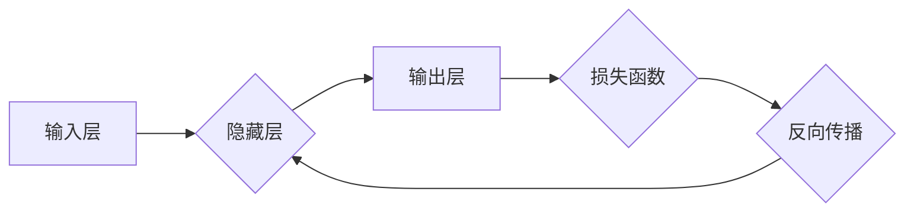

> 神经网络,机器学习,深度学习,卷积神经网络,循环神经网络,人工智能,算法

## 1. 背景介绍

人工智能（AI）作为科技发展的重要方向，近年来取得了令人瞩目的进展。其中，机器学习（ML）作为AI的核心技术之一，以其强大的学习能力和应用潜力，在各个领域掀起了新的革命浪潮。而神经网络作为机器学习的重要分支，凭借其模仿生物神经网络结构和功能的独特优势，成为了推动AI发展的重要驱动力。

传统的机器学习算法通常依赖于人工特征工程，需要人类专家对数据进行预处理和特征提取，这不仅耗时费力，而且难以捕捉数据的复杂非线性关系。而神经网络则能够自动学习数据中的特征，无需人工干预，从而突破了传统机器学习算法的局限性。

随着计算能力的提升和海量数据的积累，深度学习技术，即利用多层神经网络进行学习的机器学习方法，得到了蓬勃发展。深度学习在图像识别、语音识别、自然语言处理等领域取得了突破性的进展，展现出强大的应用潜力。

## 2. 核心概念与联系

### 2.1 神经网络的基本结构

神经网络由大量相互连接的神经元（节点）组成，这些神经元按照一定的层次结构排列，形成多层网络。每个神经元接收来自其他神经元的输入信号，并对其进行处理，然后将处理后的信号传递给下一层神经元。

神经网络的结构可以分为输入层、隐藏层和输出层。输入层接收原始数据，隐藏层对数据进行特征提取和学习，输出层输出最终结果。

### 2.2 激活函数

激活函数是神经网络中一个重要的组成部分，它决定了神经元对输入信号的响应方式。常见的激活函数包括 sigmoid 函数、ReLU 函数、tanh 函数等。激活函数的作用是引入非线性，使神经网络能够学习复杂的数据关系。

### 2.3 权重和偏置

权重和偏置是神经网络中的参数，它们决定了神经元之间的连接强度和激活阈值。在训练过程中，通过调整权重和偏置的值，使神经网络的输出与实际目标值之间的误差最小化。

### 2.4 前向传播和反向传播

前向传播是指将输入数据通过神经网络传递，得到最终输出的过程。反向传播是指根据输出结果与目标值的误差，调整神经网络的权重和偏置的过程。反向传播算法是训练神经网络的关键算法，它利用梯度下降法不断优化网络参数。

**Mermaid 流程图**



## 3. 核心算法原理 & 具体操作步骤

### 3.1 算法原理概述

神经网络的训练过程本质上是一个优化问题，目标是找到一组最优的权重和偏置，使得神经网络的输出与实际目标值之间的误差最小化。

常用的优化算法包括梯度下降法、动量法、Adam 算法等。这些算法通过不断调整权重和偏置的值，使误差函数逐渐减小，最终达到训练目标。

### 3.2 算法步骤详解

1. **初始化权重和偏置:** 随机初始化神经网络的权重和偏置。
2. **前向传播:** 将输入数据通过神经网络传递，得到最终输出。
3. **计算损失函数:** 计算输出结果与实际目标值之间的误差，即损失函数的值。
4. **反向传播:** 根据损失函数的梯度，反向传播误差信息，更新神经网络的权重和偏置。
5. **重复步骤2-4:** 重复前向传播和反向传播的过程，直到损失函数达到最小值或训练次数达到上限。

### 3.3 算法优缺点

**优点:**

* 能够自动学习数据中的特征，无需人工干预。
* 能够处理复杂的数据关系，学习非线性模式。
* 在图像识别、语音识别、自然语言处理等领域取得了突破性的进展。

**缺点:**

* 训练过程需要大量的计算资源和时间。
* 容易陷入局部最优解。
* 对训练数据的质量要求较高。

### 3.4 算法应用领域

神经网络的应用领域非常广泛，包括：

* **图像识别:** 人脸识别、物体检测、图像分类等。
* **语音识别:** 语音转文本、语音助手等。
* **自然语言处理:** 机器翻译、文本摘要、情感分析等。
* **推荐系统:** 商品推荐、内容推荐等。
* **医疗诊断:** 疾病预测、影像分析等。

## 4. 数学模型和公式 & 详细讲解 & 举例说明

### 4.1 数学模型构建

神经网络的数学模型可以表示为一个多层感知机（MLP），其结构由输入层、隐藏层和输出层组成。每个神经元接收来自其他神经元的输入信号，并对其进行线性变换和非线性激活函数处理，最终输出信号。

**输入层:**

* $x_1, x_2, ..., x_n$ 表示输入数据的n个特征。

**隐藏层:**

* $h_1, h_2, ..., h_m$ 表示隐藏层的m个神经元输出。
* $w_{ij}$ 表示第i个隐藏层神经元与第j个输入层神经元的连接权重。
* $b_i$ 表示第i个隐藏层神经元的偏置。
* $f(\cdot)$ 表示激活函数。

**输出层:**

* $y_1, y_2, ..., y_k$ 表示输出层的k个神经元输出。
* $v_{ij}$ 表示第i个输出层神经元与第j个隐藏层神经元的连接权重。
* $c_i$ 表示第i个输出层神经元的偏置。

### 4.2 公式推导过程

**隐藏层神经元输出:**

$$h_i = f\left(\sum_{j=1}^{n} w_{ij}x_j + b_i\right)$$

**输出层神经元输出:**

$$y_i = f\left(\sum_{j=1}^{m} v_{ij}h_j + c_i\right)$$

**损失函数:**

常用的损失函数包括均方误差（MSE）和交叉熵损失函数。

**均方误差:**

$$L = \frac{1}{2}\sum_{i=1}^{k}(y_i - t_i)^2$$

其中，$t_i$ 表示实际目标值。

**交叉熵损失函数:**

$$L = -\sum_{i=1}^{k} t_i \log(y_i)$$

### 4.3 案例分析与讲解

**图像分类:**

假设我们有一个图像分类任务，目标是将图像分类为猫、狗或鸟。我们可以使用一个包含多个隐藏层的卷积神经网络（CNN）来解决这个问题。

CNN 可以自动学习图像中的特征，例如边缘、纹理和形状。通过训练 CNN，我们可以使它能够将图像分类为不同的类别。

## 5. 项目实践：代码实例和详细解释说明

### 5.1 开发环境搭建

* Python 3.x
* TensorFlow 或 PyTorch

### 5.2 源代码详细实现

```python
import tensorflow as tf

# 定义模型结构
model = tf.keras.models.Sequential([
    tf.keras.layers.Conv2D(32, (3, 3), activation='relu', input_shape=(28, 28, 1)),
    tf.keras.layers.MaxPooling2D((2, 2)),
    tf.keras.layers.Conv2D(64, (3, 3), activation='relu'),
    tf.keras.layers.MaxPooling2D((2, 2)),
    tf.keras.layers.Flatten(),
    tf.keras.layers.Dense(10, activation='softmax')
])

# 编译模型
model.compile(optimizer='adam',
              loss='sparse_categorical_crossentropy',
              metrics=['accuracy'])

# 加载数据
(x_train, y_train), (x_test, y_test) = tf.keras.datasets.mnist.load_data()

# 数据预处理
x_train = x_train.astype('float32') / 255.0
x_test = x_test.astype('float32') / 255.0
x_train = x_train.reshape((x_train.shape[0], 28, 28, 1))
x_test = x_test.reshape((x_test.shape[0], 28, 28, 1))

# 训练模型
model.fit(x_train, y_train, epochs=5)

# 评估模型
loss, accuracy = model.evaluate(x_test, y_test)
print('Test loss:', loss)
print('Test accuracy:', accuracy)
```

### 5.3 代码解读与分析

这段代码实现了使用 TensorFlow 库构建和训练一个简单的卷积神经网络用于 MNIST 手写数字识别任务。

* **模型结构:** 代码定义了一个包含两层卷积层、两层最大池化层、一层 Flatten 层和一层全连接层的 CNN 模型。
* **模型编译:** 代码使用 Adam 优化器、稀疏类别交叉熵损失函数和准确率作为评估指标编译了模型。
* **数据加载和预处理:** 代码使用 TensorFlow 的 MNIST 数据集，并将数据预处理为适合 CNN 输入的格式。
* **模型训练:** 代码使用训练数据训练模型，并设置了 5 个 epochs。
* **模型评估:** 代码使用测试数据评估模型的性能，并打印测试损失和准确率。

### 5.4 运行结果展示

运行这段代码后，会输出模型在测试集上的损失和准确率。通常情况下，经过训练的模型在测试集上可以达到 98% 以上的准确率。

## 6. 实际应用场景

### 6.1 图像识别

* **人脸识别:** 用于解锁手机、身份验证、人脸搜索等。
* **物体检测:** 用于自动驾驶、安防监控、工业自动化等。
* **图像分类:** 用于医疗影像诊断、产品分类、场景识别等。

### 6.2 语音识别

* **语音助手:** 例如 Siri、Alexa、Google Assistant 等。
* **语音转文本:** 用于会议记录、字幕生成、语音输入等。
* **语音合成:** 用于语音导航、电子书朗读、虚拟助手等。

### 6.3 自然语言处理

* **机器翻译:** 将一种语言翻译成另一种语言。
* **文本摘要:** 自动生成文本的简短摘要。
* **情感分析:** 分析文本中的情感倾向，例如正面、负面或中性。

### 6.4 其他应用场景

* **推荐系统:** 根据用户的历史行为推荐商品、内容等。
* **金融预测:** 用于股票预测、风险评估、欺诈检测等。
* **医疗诊断:** 用于疾病预测、影像分析、药物研发等。

### 6.5 未来应用展望

随着人工智能技术的不断发展，神经网络的应用场景将更加广泛，例如：

* **个性化教育:** 根据学生的学习情况提供个性化的学习方案。
* **智能医疗:** 提供更精准的诊断和治疗方案。
* **自动驾驶:** 实现更安全、更智能的自动驾驶系统。

## 7. 工具和资源推荐

### 7.1 学习资源推荐

* **书籍:**
    * 《深度学习》
    * 《神经网络与深度学习》
    * 《动手学深度学习》
* **在线课程:**
    * Coursera: 深度学习 Specialization
    * Udacity: Deep Learning Nanodegree
    * fast.ai: Practical Deep Learning for Coders

### 7.2 开发工具推荐

* **TensorFlow:** 开源深度学习框架，支持多种硬件平台。
* **PyTorch:** 开源深度学习框架，以其灵活性和易用性而闻名。
* **Keras:** 高级深度学习 API，可以运行在 TensorFlow、Theano 或 CNTK 后端。

