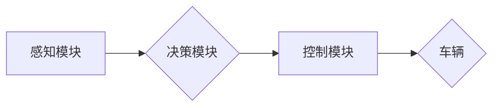

> 自动驾驶, 端到端学习, 深度学习, 优化策略, 模型架构, 数据集, 训练方法

## 1. 背景介绍

自动驾驶技术作为未来交通运输的重要发展方向，近年来取得了显著进展。其中，端到端学习（End-to-End Learning）方法凭借其简洁高效的优势，在自动驾驶领域得到了广泛应用。端到端学习是指将感知、决策和控制等多个模块直接学习为一个整体模型，无需人工设计复杂的中间层，从而简化了模型设计和训练过程。

然而，端到端学习自动驾驶模型也面临着诸多挑战，例如：

* **数据需求量大:** 自动驾驶模型需要大量的真实驾驶数据进行训练，而获取高质量的标注数据成本高昂且耗时。
* **模型复杂度高:** 端到端学习模型通常具有复杂的网络结构，训练过程需要大量的计算资源和时间。
* **安全性和可靠性:** 自动驾驶系统需要具备高安全性、可靠性和鲁棒性，以应对复杂多变的驾驶环境。

为了解决这些挑战，研究者们不断探索新的优化策略和方法，以提高端到端学习自动驾驶模型的性能和效率。

## 2. 核心概念与联系

端到端学习自动驾驶模型的核心概念包括：

* **感知模块:** 用于获取车辆周围环境的信息，例如图像、激光雷达数据等。
* **决策模块:** 根据感知模块获取的信息，做出驾驶决策，例如转向、加速、制动等。
* **控制模块:** 将决策模块的输出转化为车辆的实际控制指令。

这些模块之间通过神经网络进行连接，形成一个完整的端到端学习模型。

**Mermaid 流程图:**



## 3. 核心算法原理 & 具体操作步骤

### 3.1  算法原理概述

端到端学习自动驾驶模型通常采用深度学习算法进行训练，例如卷积神经网络（CNN）、循环神经网络（RNN）和强化学习（RL）。

* **CNN:** 用于处理图像数据，提取图像特征。
* **RNN:** 用于处理序列数据，例如驾驶轨迹和传感器数据。
* **RL:** 用于学习驾驶策略，通过奖励机制引导模型学习最优的驾驶行为。

### 3.2  算法步骤详解

端到端学习自动驾驶模型的训练步骤如下：

1. **数据收集和预处理:** 收集大量的真实驾驶数据，并进行预处理，例如图像裁剪、数据增强等。
2. **模型构建:** 根据任务需求，构建相应的深度学习模型，例如CNN-RNN模型或CNN-RL模型。
3. **模型训练:** 使用训练数据训练模型，并通过优化算法，例如梯度下降，调整模型参数，使模型性能达到最佳。
4. **模型评估:** 使用测试数据评估模型性能，例如准确率、召回率、平均位移误差等。
5. **模型部署:** 将训练好的模型部署到实际车辆中，实现自动驾驶功能。

### 3.3  算法优缺点

**优点:**

* **简洁高效:** 端到端学习方法简化了模型设计和训练过程，提高了训练效率。
* **鲁棒性强:** 模型能够学习到复杂的驾驶规律，具有较强的鲁棒性。
* **可扩展性强:** 可以根据任务需求，灵活调整模型结构和参数。

**缺点:**

* **数据需求量大:** 需要大量的真实驾驶数据进行训练，获取数据成本高昂。
* **模型复杂度高:** 训练过程需要大量的计算资源和时间。
* **可解释性差:** 模型内部的决策过程难以解释，难以进行故障诊断。

### 3.4  算法应用领域

端到端学习方法广泛应用于自动驾驶领域，例如：

* **自动驾驶决策:** 学习驾驶员的行为模式，做出最优的驾驶决策。
* **自动泊车:** 学习车辆周围环境信息，自动完成泊车操作。
* **自动变道:** 学习车辆周围环境信息，自动完成变道操作。

## 4. 数学模型和公式 & 详细讲解 & 举例说明

### 4.1  数学模型构建

端到端学习自动驾驶模型的数学模型通常基于深度学习框架，例如TensorFlow或PyTorch。模型的输入是车辆周围环境的信息，例如图像、激光雷达数据等。模型的输出是驾驶决策，例如转向、加速、制动等。

### 4.2  公式推导过程

深度学习模型的训练过程基于梯度下降算法，目标函数是模型预测结果与真实结果之间的误差。

**损失函数:**

$$
L = \frac{1}{N} \sum_{i=1}^{N} \left\| y_i - \hat{y}_i \right\|^2
$$

其中：

* $L$ 是损失函数
* $N$ 是样本数量
* $y_i$ 是真实标签
* $\hat{y}_i$ 是模型预测结果

**梯度下降算法:**

$$
\theta = \theta - \alpha \nabla L(\theta)
$$

其中：

* $\theta$ 是模型参数
* $\alpha$ 是学习率
* $\nabla L(\theta)$ 是损失函数对模型参数的梯度

### 4.3  案例分析与讲解

例如，在自动驾驶决策任务中，可以使用CNN-RNN模型进行端到端学习。CNN模块用于提取图像特征，RNN模块用于处理驾驶轨迹信息。模型的输出是驾驶决策，例如转向角度、加速度等。

通过训练数据，模型可以学习到驾驶场景下不同图像特征和驾驶轨迹对应的驾驶决策。

## 5. 项目实践：代码实例和详细解释说明

### 5.1  开发环境搭建

自动驾驶模型开发环境通常包括：

* **操作系统:** Linux
* **编程语言:** Python
* **深度学习框架:** TensorFlow或PyTorch
* **硬件平台:** GPU

### 5.2  源代码详细实现

以下是一个使用TensorFlow构建CNN-RNN自动驾驶决策模型的代码示例：

```python
import tensorflow as tf

# 定义CNN模型
def build_cnn_model(input_shape):
    model = tf.keras.models.Sequential([
        tf.keras.layers.Conv2D(32, (3, 3), activation='relu', input_shape=input_shape),
        tf.keras.layers.MaxPooling2D((2, 2)),
        tf.keras.layers.Conv2D(64, (3, 3), activation='relu'),
        tf.keras.layers.MaxPooling2D((2, 2)),
        tf.keras.layers.Flatten(),
        tf.keras.layers.Dense(128, activation='relu'),
    ])
    return model

# 定义RNN模型
def build_rnn_model(input_shape):
    model = tf.keras.models.Sequential([
        tf.keras.layers.LSTM(128, input_shape=input_shape),
        tf.keras.layers.Dense(64, activation='relu'),
        tf.keras.layers.Dense(3, activation='softmax')  # 输出转向、加速、制动
    ])
    return model

# 构建端到端学习模型
def build_end_to_end_model(input_shape):
    cnn_model = build_cnn_model(input_shape)
    rnn_model = build_rnn_model(cnn_model.output_shape[1:])
    model = tf.keras.models.Model(inputs=cnn_model.input, outputs=rnn_model.output)
    return model

# 训练模型
model = build_end_to_end_model((64, 64, 3))  # 假设图像大小为64x64
model.compile(optimizer='adam', loss='categorical_crossentropy', metrics=['accuracy'])
model.fit(train_data, train_labels, epochs=10)

```

### 5.3  代码解读与分析

* 代码首先定义了CNN和RNN模型的构建函数。
* 然后构建了端到端学习模型，将CNN模型的输出作为RNN模型的输入。
* 最后使用Adam优化器、交叉熵损失函数和准确率指标训练模型。

### 5.4  运行结果展示

训练完成后，可以使用测试数据评估模型性能，例如准确率、召回率等。

## 6. 实际应用场景

端到端学习自动驾驶模型已在一些实际应用场景中得到应用，例如：

* **自动驾驶汽车:** Tesla Autopilot、Waymo等自动驾驶汽车公司都采用了端到端学习方法。
* **无人机:** 无人机自动飞行、自动避障等任务也利用了端到端学习方法。
* **机器人:** 机器人导航、抓取等任务也应用了端到端学习方法。

### 6.4  未来应用展望

未来，端到端学习自动驾驶模型将应用于更广泛的场景，例如：

* **智能交通系统:** 自动化交通信号灯控制、智能交通流管理等。
* **城市规划:** 基于自动驾驶数据进行城市规划和交通优化。
* **物流运输:** 自动化物流运输、无人配送等。

## 7. 工具和资源推荐

### 7.1  学习资源推荐

* **书籍:**
    * Deep Learning by Ian Goodfellow, Yoshua Bengio, and Aaron Courville
    * Hands-On Machine Learning with Scikit-Learn, Keras & TensorFlow by Aurélien Géron
* **在线课程:**
    * TensorFlow Tutorials: https://www.tensorflow.org/tutorials
    * PyTorch Tutorials: https://pytorch.org/tutorials/

### 7.2  开发工具推荐

* **深度学习框架:** TensorFlow, PyTorch
* **图像处理库:** OpenCV
* **数据可视化工具:** Matplotlib, Seaborn

### 7.3  相关论文推荐

* **End to End Learning for Self-Driving Cars** by Bojarski et al. (2016)
* **Learning to Drive with Deep Reinforcement Learning** by Schulman et al. (2015)
* **Deep Reinforcement Learning for Autonomous Driving** by Wang et al. (2018)

## 8. 总结：未来发展趋势与挑战

### 8.1  研究成果总结

端到端学习自动驾驶模型取得了显著进展，在自动驾驶决策、自动泊车、自动变道等任务中展现出强大的性能。

### 8.2  未来发展趋势

未来，端到端学习自动驾驶模型将朝着以下方向发展：

* **模型复杂度提升:** 探索更深、更复杂的网络结构，提高模型的表达能力和泛化能力。
* **数据增强技术:** 开发更有效的图像和传感器数据增强技术，缓解数据需求量大的问题。
* **安全性和可靠性提升:** 研究更有效的安全性和可靠性评估方法，提高模型在复杂环境下的鲁棒性。

### 8.3  面临的挑战

端到端学习自动驾驶模型仍然面临着一些挑战：

* **数据标注成本高:** 获取高质量的标注数据成本高昂且耗时。
* **模型解释性差:** 模型内部的决策过程难以解释，难以进行故障诊断。
* **安全性和可靠性:** 模型在复杂环境下的安全性和可靠性仍需进一步提升。

### 8.4  研究展望

未来，需要进一步研究以下问题：

* 如何降低数据标注成本，提高数据标注效率。
* 如何提高模型的解释性，使模型决策过程更加透明。
* 如何进一步提升模型的安全性和可靠性，使其能够在复杂环境下安全可靠地运行。

## 9. 附录：常见问题与解答

**常见问题:**

* **端到端学习自动驾驶模型的训练数据来源？**

**解答:** 端到端学习自动驾驶模型的训练数据主要来源于真实驾驶场景的采集，例如摄像头、激光雷达、GPS等传感器数据。

* **端到端学习自动驾驶模型的训练时间和资源需求？**

**解答:** 端到端学习自动驾驶模型的训练时间和资源需求取决于模型复杂度、数据量和硬件平台