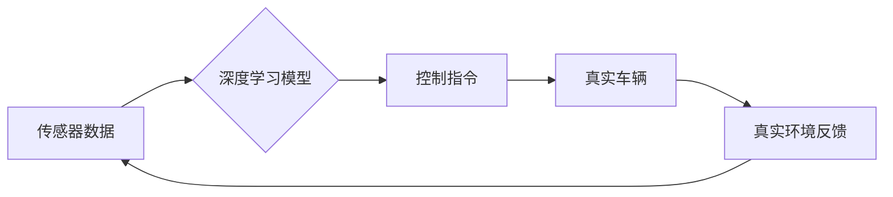

> 自动驾驶, 端到端学习, 闭环训练, 闭环验证, 深度学习, 强化学习, 仿真环境

## 1. 背景介绍

自动驾驶技术作为未来交通运输的重要发展方向，近年来取得了显著进展。其中，端到端自动驾驶方法凭借其简洁高效的架构和强大的学习能力，成为研究热点。传统的自动驾驶系统通常采用分层架构，将感知、决策和控制等任务分别处理，需要大量的标注数据和复杂的规则设计。而端到端自动驾驶方法将整个驾驶过程视为一个整体，通过深度学习网络直接从传感器数据中学习驾驶策略，简化了系统设计，提高了学习效率。

然而，端到端自动驾驶方法也面临着一些挑战。首先，真实世界驾驶环境复杂多变，包含各种不可预测的因素，难以完全模拟。其次，训练自动驾驶模型需要大量的真实驾驶数据，而收集和标注这些数据成本高昂且耗时。因此，如何有效地训练和验证端到端自动驾驶模型，使其能够在真实世界环境中安全可靠地行驶，是当前研究的重点。

闭环训练和闭环验证是解决上述问题的有效手段。闭环训练是指在仿真环境中训练模型，并利用模型的输出控制仿真环境，从而形成一个闭环系统。闭环验证是指在真实世界环境中验证模型的性能，并利用模型的输出控制车辆行驶，从而形成另一个闭环系统。

## 2. 核心概念与联系

### 2.1 闭环训练

闭环训练是指在仿真环境中训练自动驾驶模型，并利用模型的输出控制仿真环境，形成一个闭环系统。

**流程图：**


**核心概念：**

* **仿真环境：** 模拟真实驾驶环境的虚拟环境，可以根据需要设置各种场景和条件。
* **深度学习模型：** 用于学习驾驶策略的深度神经网络，可以从传感器数据中预测车辆的运动轨迹和控制指令。
* **控制指令：** 由深度学习模型输出，用于控制仿真环境中的车辆行驶。
* **仿真环境反馈：** 仿真环境根据控制指令的执行结果，反馈给深度学习模型，用于模型的训练和更新。

### 2.2 闭环验证

闭环验证是指在真实世界环境中验证自动驾驶模型的性能，并利用模型的输出控制车辆行驶，形成另一个闭环系统。

**流程图：**



**核心概念：**

* **真实车辆：** 用于测试自动驾驶模型的实际车辆，通常配备了传感器和控制系统。
* **真实环境反馈：** 真实环境中车辆的运动状态和周围环境信息，反馈给深度学习模型，用于模型的评估和改进。

## 3. 核心算法原理 & 具体操作步骤

### 3.1 算法原理概述

端到端自动驾驶的核心算法是深度学习算法，主要包括以下几种：

* **卷积神经网络 (CNN)：** 用于从传感器数据中提取特征，例如图像、激光雷达点云等。
* **循环神经网络 (RNN)：** 用于处理时间序列数据，例如车辆速度、方向等。
* **强化学习 (RL)：** 用于训练模型学习驾驶策略，通过奖励机制引导模型向目标方向学习。

### 3.2 算法步骤详解

1. **数据收集和预处理：** 收集真实世界驾驶数据或生成仿真环境数据，并进行预处理，例如数据清洗、特征提取等。
2. **模型构建：** 根据任务需求，选择合适的深度学习模型架构，并进行参数初始化。
3. **模型训练：** 利用训练数据，训练深度学习模型，并使用优化算法更新模型参数。
4. **模型评估：** 利用测试数据，评估模型的性能，例如准确率、召回率、平均奖励等。
5. **模型部署：** 将训练好的模型部署到实际车辆中，用于控制车辆行驶。

### 3.3 算法优缺点

**优点：**

* 简化了系统设计，提高了学习效率。
* 可以学习到复杂的驾驶策略，适应各种驾驶场景。
* 能够不断学习和改进，提高驾驶安全性。

**缺点：**

* 需要大量的训练数据，数据收集和标注成本高昂。
* 模型训练时间长，需要强大的计算资源。
* 模型解释性差，难以理解模型的决策过程。

### 3.4 算法应用领域

端到端自动驾驶算法广泛应用于以下领域：

* 自动驾驶汽车
* 无人机
* 机器人
* 智能交通系统

## 4. 数学模型和公式 & 详细讲解 & 举例说明

### 4.1 数学模型构建

端到端自动驾驶模型通常采用深度神经网络作为数学模型，其结构可以根据任务需求进行设计。常见的网络架构包括 CNN、RNN 和 Transformer 等。

**举例说明：**

一个简单的端到端自动驾驶模型可以采用 CNN-RNN 架构，其中 CNN 用于提取传感器数据中的特征，RNN 用于处理时间序列数据，最终输出控制指令。

### 4.2 公式推导过程

深度神经网络的训练过程基于梯度下降算法，其核心公式包括：

* **损失函数：** 用于衡量模型预测结果与真实值的差距。常见的损失函数包括均方误差 (MSE) 和交叉熵损失 (CE)。
* **梯度：** 用于衡量损失函数对模型参数的导数。
* **优化算法：** 用于更新模型参数，例如随机梯度下降 (SGD) 和 Adam 等。

**举例说明：**

假设损失函数为 MSE，则梯度下降算法的更新公式为：

$$
\theta = \theta - \alpha \nabla L(\theta)
$$

其中：

* $\theta$ 为模型参数
* $\alpha$ 为学习率
* $\nabla L(\theta)$ 为损失函数对模型参数的梯度

### 4.3 案例分析与讲解

**举例说明：**

在自动驾驶场景中，可以使用 MSE 作为损失函数，衡量模型预测的车辆轨迹与真实轨迹的差距。通过梯度下降算法，不断更新模型参数，使预测轨迹与真实轨迹的差距最小化。

## 5. 项目实践：代码实例和详细解释说明

### 5.1 开发环境搭建

* 操作系统：Ubuntu 20.04
* 编程语言：Python 3.8
* 深度学习框架：TensorFlow 2.0
* 仿真环境：CARLA

### 5.2 源代码详细实现

```python
import tensorflow as tf

# 定义模型架构
model = tf.keras.Sequential([
    tf.keras.layers.Conv2D(32, (3, 3), activation='relu', input_shape=(64, 64, 3)),
    tf.keras.layers.MaxPooling2D((2, 2)),
    tf.keras.layers.Conv2D(64, (3, 3), activation='relu'),
    tf.keras.layers.MaxPooling2D((2, 2)),
    tf.keras.layers.Flatten(),
    tf.keras.layers.Dense(128, activation='relu'),
    tf.keras.layers.Dense(4, activation='linear')
])

# 定义损失函数和优化器
loss_fn = tf.keras.losses.MeanSquaredError()
optimizer = tf.keras.optimizers.Adam(learning_rate=0.001)

# 训练模型
model.compile(loss=loss_fn, optimizer=optimizer)
model.fit(x_train, y_train, epochs=10)

# 评估模型
loss = model.evaluate(x_test, y_test)
print(f'Loss: {loss}')
```

### 5.3 代码解读与分析

* 代码首先定义了模型架构，包括卷积层、池化层、全连接层等。
* 然后定义了损失函数和优化器，用于训练模型。
* 接着使用 `model.fit()` 函数训练模型，传入训练数据和训练参数。
* 最后使用 `model.evaluate()` 函数评估模型，传入测试数据和计算损失值。

### 5.4 运行结果展示

训练完成后，可以将模型部署到实际车辆中，并通过传感器数据控制车辆行驶。

## 6. 实际应用场景

### 6.1 自动驾驶汽车

端到端自动驾驶技术在自动驾驶汽车领域应用广泛，可以实现车辆的自动泊车、自动变道、自动巡航等功能。

### 6.2 无人机

端到端自动驾驶技术也可以应用于无人机，实现无人机的自动飞行、自动避障等功能。

### 6.3 机器人

端到端自动驾驶技术还可以应用于机器人，实现机器人的自主导航、环境感知等功能。

### 6.4 未来应用展望

随着技术的不断发展，端到端自动驾驶技术将在更多领域得到应用，例如智能交通系统、物流配送、农业机械等。

## 7. 工具和资源推荐

### 7.1 学习资源推荐

* **书籍：**
    * Deep Learning by Ian Goodfellow
    * Reinforcement Learning: An Introduction by Richard S. Sutton and Andrew G. Barto
* **在线课程：**
    * TensorFlow Tutorials
    * Coursera: Deep Learning Specialization
* **博客和论坛：**
    * Towards Data Science
    * Reddit: r/MachineLearning

### 7.2 开发工具推荐

* **深度学习框架：** TensorFlow, PyTorch, Keras
* **仿真环境：** CARLA, Gazebo, SUMO
* **数据标注工具：** LabelImg, CVAT

### 7.3 相关论文推荐

* **端到端自动驾驶论文：**
    * End to End Learning for Self-Driving Cars
    * Learning to Drive with Deep Reinforcement Learning

## 8. 总结：未来发展趋势与挑战

### 8.1 研究成果总结

端到端自动驾驶技术取得了显著进展，能够实现车辆的自动驾驶功能，并不断提高驾驶安全性。

### 8.2 未来发展趋势

* **模型复杂度提升：** 未来将开发更复杂、更强大的深度学习模型，例如 Transformer、Graph Neural Network 等。
* **数据量和质量提升：** 将收集和标注更多真实世界驾驶数据，提高数据质量和多样性。
* **安全性和可靠性提升：** 将加强对安全性和可靠性的研究，开发更安全的自动驾驶系统。

### 8.3 面临的挑战

* **数据安全和隐私问题：** 自动驾驶系统需要收集大量用户数据，如何保证数据安全和隐私是重要的挑战。
* **伦理和法律问题：** 自动驾驶系统在遇到紧急情况时如何做出决策，如何承担责任是需要解决的伦理和法律问题。
* **技术标准和规范：** 自动驾驶技术的标准和规范尚不完善，需要制定统一的标准，促进行业发展。

### 8.4 研究展望

未来，端到端自动驾驶技术将继续发展，并应用于更多领域，为人类社会带来更多便利。


## 9. 附录：常见问题与解答

**常见问题：**

* **端到端自动驾驶与传统自动驾驶的区别是什么？**

**解答：**

端到端自动驾驶方法将整个驾驶过程视为一个整体，通过深度学习网络直接从传感器数据中学习驾驶策略，而传统自动驾驶系统通常采用分层架构，将感知、决策和控制等任务分别处理。

* **端到端自动驾驶的训练数据来源是什么？**

**解答：**

端到端自动驾驶的训练数据可以来自真实世界驾驶数据或仿真环境数据。

* **端到端自动驾驶的安全性如何保证？**

**解答：**

端到端自动驾驶的安全性需要通过多种手段保证，例如数据安全、模型验证、冗余系统等。

* **端到端自动驾驶技术何时能够实现商业化？**

**解答：**

端到端自动驾驶技术的商业化时间取决于技术成熟度、法律法规、社会接受程度等多种因素，目前尚无法给出确切时间表。

* **端到端自动驾驶技术有哪些应用领域？**

**解答：**

端到端自动驾驶技术可以应用于各种交通工具，例如汽车、卡车、公交车、出租车、机器人等。

## 作者：禅与计算机程序设计艺术 / Zen and the Art of Computer Programming 