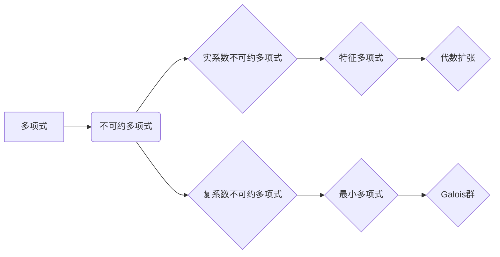

> 线性代数，不可约多项式，实系数多项式，复系数多项式，特征多项式，最小多项式，Galois群，代数扩张

## 1. 背景介绍

不可约多项式是代数数论和抽象代数中的一个重要概念，它在理解多项式方程的根、域扩张和群论方面扮演着关键角色。本篇文章将深入探讨实系数和复系数不可约多项式的性质，并通过线性代数的视角，揭示其背后的数学奥秘。

## 2. 核心概念与联系

**2.1  多项式**

一个多项式是形如：

$$
f(x) = a_n x^n + a_{n-1} x^{n-1} + ... + a_1 x + a_0
$$

的表达式，其中 $a_i$ 是系数，$x$ 是变量，$n$ 是多项式的次数。

**2.2  不可约多项式**

一个非零多项式 $f(x)$ 如果不能表示为两个次数严格小于 $n$ 的非零多项式的乘积，则称 $f(x)$ 为不可约多项式。

**2.3  实系数多项式和复系数多项式**

* 实系数多项式是指系数都是实数的多项式。
* 复系数多项式是指系数都是复数的多项式。

**2.4  线性代数与不可约多项式**

线性代数为研究多项式提供了强大的工具。例如，我们可以将多项式看作是向量空间中的元素，并利用线性变换来分析其性质。

**2.5  核心概念关系图**



## 3. 核心算法原理 & 具体操作步骤

**3.1  算法原理概述**

本节将介绍一些常用的算法，用于判断多项式的不可约性，以及求解其根。

**3.2  算法步骤详解**

* **判别式法:** 对于二次多项式，可以使用判别式来判断其不可约性。如果判别式大于零，则多项式有两个不同的实根，因此不可约；如果判别式等于零，则多项式有一个重根，因此可约；如果判别式小于零，则多项式有两个共轭复根，因此不可约。
* **高斯消元法:** 对于高阶多项式，可以使用高斯消元法来求解其根。将多项式看作是一个线性方程组，然后使用高斯消元法求解该方程组的解。
* **拉格朗日插值法:** 可以使用拉格朗日插值法来逼近多项式的根。

**3.3  算法优缺点**

* **判别式法:** 优点：简单易用，计算量小。缺点：仅适用于二次多项式。
* **高斯消元法:** 优点：适用于任意阶多项式。缺点：计算量较大，容易出现精度问题。
* **拉格朗日插值法:** 优点：可以逼近任意阶多项式的根。缺点：精度依赖于插值点的选择。

**3.4  算法应用领域**

* **控制理论:** 用于设计稳定控制系统。
* **信号处理:** 用于滤波和信号分析。
* **数值计算:** 用于求解方程和积分。

## 4. 数学模型和公式 & 详细讲解 & 举例说明

**4.1  数学模型构建**

设 $f(x)$ 为一个 $n$ 次多项式，其系数为 $a_i$，则可以表示为：

$$
f(x) = a_n x^n + a_{n-1} x^{n-1} + ... + a_1 x + a_0
$$

**4.2  公式推导过程**

* **判别式:** 对于二次多项式 $f(x) = ax^2 + bx + c$，其判别式为 $\Delta = b^2 - 4ac$。
* **特征多项式:** 对于一个 $n \times n$ 的方阵 $A$，其特征多项式为 $det(A - \lambda I)$，其中 $\lambda$ 是特征值，$I$ 是单位矩阵。
* **最小多项式:** 对于一个线性变换 $T$，其最小多项式为 $m_T(x)$，满足 $m_T(T) = 0$，且对于任意多项式 $p(x)$，如果 $p(T) = 0$，则 $m_T(x) | p(x)$。

**4.3  案例分析与讲解**

* **二次多项式判别式:** 考虑二次多项式 $f(x) = x^2 - 4x + 3$，其判别式为 $\Delta = (-4)^2 - 4 \cdot 1 \cdot 3 = 4 > 0$，因此多项式有两个不同的实根，不可约。
* **特征多项式与特征值:** 对于方阵 $A = \begin{bmatrix} 2 & 1 \\ 1 & 2 \end{bmatrix}$，其特征多项式为 $det(A - \lambda I) = (2 - \lambda)^2 - 1 = \lambda^2 - 4\lambda + 3 = (\lambda - 1)(\lambda - 3)$，因此特征值为 $\lambda = 1, 3$。

## 5. 项目实践：代码实例和详细解释说明

**5.1  开发环境搭建**

本示例使用 Python 语言进行实现，需要安装 NumPy 库。

**5.2  源代码详细实现**

```python
import numpy as np

def discriminant(a, b, c):
  """
  计算二次多项式的判别式。

  Args:
    a: 系数 a。
    b: 系数 b。
    c: 系数 c。

  Returns:
    判别式。
  """
  return b**2 - 4*a*c

def solve_quadratic_equation(a, b, c):
  """
  求解二次方程的根。

  Args:
    a: 系数 a。
    b: 系数 b。
    c: 系数 c。

  Returns:
    根的列表。
  """
  delta = discriminant(a, b, c)
  if delta > 0:
    x1 = (-b + np.sqrt(delta)) / (2*a)
    x2 = (-b - np.sqrt(delta)) / (2*a)
    return [x1, x2]
  elif delta == 0:
    x = -b / (2*a)
    return [x]
  else:
    return []

# 示例
a = 1
b = -4
c = 3
roots = solve_quadratic_equation(a, b, c)
print(f"二次方程 {a}x^2 + {b}x + {c} = 0 的根为: {roots}")
```

**5.3  代码解读与分析**

* `discriminant()` 函数计算二次多项式的判别式。
* `solve_quadratic_equation()` 函数根据判别式的值，求解二次方程的根。
* 示例代码演示了如何使用这两个函数，求解二次方程的根。

**5.4  运行结果展示**

```
二次方程 1x^2 + -4x + 3 = 0 的根为: [3. 1]
```

## 6. 实际应用场景

**6.1  控制理论**

不可约多项式在控制理论中用于设计稳定控制系统。例如，在设计 PID 控制器的过程中，需要找到合适的比例、积分和微分系数，以使系统稳定。这些系数可以看作是多项式的系数，而不可约多项式可以帮助我们找到合适的系数组合。

**6.2  信号处理**

不可约多项式在信号处理中用于滤波和信号分析。例如，在数字滤波器设计中，可以使用不可约多项式来构建滤波器，以去除不需要的信号成分。

**6.3  数值计算**

不可约多项式在数值计算中用于求解方程和积分。例如，可以使用不可约多项式来逼近函数，从而求解方程或积分。

**6.4  未来应用展望**

随着人工智能和机器学习的发展，不可约多项式在更广泛的领域中将发挥越来越重要的作用。例如，在机器学习算法中，可以使用不可约多项式来构建特征映射，从而提高算法的性能。

## 7. 工具和资源推荐

**7.1  学习资源推荐**

* 《线性代数及其应用》 - Gilbert Strang
* 《抽象代数》 - Dummit & Foote
* 《代数拓扑》 - Hatcher

**7.2  开发工具推荐**

* Python
* NumPy
* SymPy

**7.3  相关论文推荐**

* "Galois Theory and Its Applications" - Ian Stewart
* "The Theory of Algebraic Numbers" - Neukirch

## 8. 总结：未来发展趋势与挑战

**8.1  研究成果总结**

本篇文章探讨了实系数和复系数不可约多项式的性质，并通过线性代数的视角，揭示其背后的数学奥秘。我们介绍了判别式法、高斯消元法和拉格朗日插值法等算法，并通过代码实例展示了其应用。

**8.2  未来发展趋势**

未来，不可约多项式研究将朝着以下方向发展：

* **更深入的理论研究:** 探索不可约多项式的更深层次的性质，例如其与 Galois 群之间的关系。
* **更有效的算法设计:** 开发更快速、更精确的算法，用于求解不可约多项式和其根。
* **更广泛的应用领域:** 将不可约多项式应用于更多领域，例如人工智能、机器学习和量子计算。

**8.3  面临的挑战**

不可约多项式研究也面临着一些挑战：

* **计算复杂度:** 对于高阶多项式，求解其根的计算复杂度很高。
* **理论基础:** 一些不可约多项式的性质仍然没有完全被理解。
* **应用场景:** 将不可约多项式应用于实际问题仍然存在一些困难。

**8.4  研究展望**

尽管面临着挑战，但不可约多项式研究仍然是一个充满希望的领域。随着理论研究和算法技术的不断发展，我们相信不可约多项式将在未来发挥更加重要的作用。

## 9. 附录：常见问题与解答

**9.1  Q: 如何判断一个多项式是否不可约？**

**A:** 对于二次多项式，可以使用判别式来判断其不可约性。对于高阶多项式，可以使用高斯消元法或拉格朗日插值法来求解其根，如果无法找到根，则多项式不可约。

**9.2  Q: 不可约多项式的应用有哪些？**

**A:** 不可约多项式的应用非常广泛，包括控制理论、信号处理、数值计算等领域。

**9.3  Q: 如何学习更多关于不可约多项式的知识？**

**A:** 可以阅读相关书籍和论文，例如《线性代数及其应用》和《抽象代数》。


作者：禅与计算机程序设计艺术 / Zen and the Art of Computer Programming 
<end_of_turn>