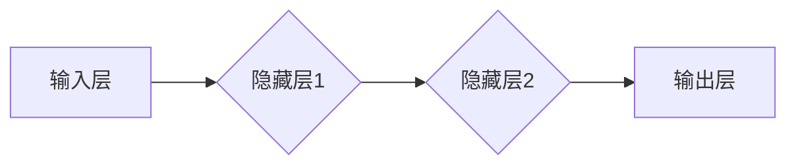

> 深度学习、神经网络、卷积神经网络、反向传播、梯度下降、激活函数

## 1. 背景介绍

在当今数据爆炸的时代，深度学习作为机器学习领域最前沿的技术，在图像识别、自然语言处理、语音识别等领域取得了突破性的进展。然而，想要真正理解深度学习的精髓，需要深入探究其核心概念、算法原理以及数学模型。本文将以深度学习为主题，带领读者从基础知识到实践应用，全面解析其内在机制，帮助读者夯实认知，掌握深度学习的本质。

## 2. 核心概念与联系

深度学习的核心概念是**人工神经网络 (Artificial Neural Network, ANN)**。它模仿了人脑的神经元结构和功能，通过多层神经元网络进行信息处理。

**ANN 的基本结构包括：**

* **输入层:**接收原始数据。
* **隐藏层:**对数据进行特征提取和转换，通常有多层隐藏层。
* **输出层:**输出最终结果。

**神经元之间的连接权重决定了信息传递的方式，通过训练调整这些权重，使网络能够学习数据中的模式和规律。**

**Mermaid 流程图:**



**核心概念联系:**

* **激活函数:** 决定神经元输出的非线性特性，例如 sigmoid 函数、ReLU 函数等。
* **权重:** 连接神经元之间的参数，通过训练调整权重以学习数据。
* **偏置:**  神经元自身的阈值，影响神经元的激活状态。
* **反向传播:** 用于训练神经网络的算法，通过计算误差并反向传播梯度来更新权重。

## 3. 核心算法原理 & 具体操作步骤

### 3.1  算法原理概述

深度学习的核心算法是**反向传播算法 (Backpropagation)**。它通过计算误差并反向传播梯度来更新神经网络的权重，从而使网络能够学习数据。

**反向传播算法的基本步骤如下：**

1. **前向传播:** 将输入数据通过神经网络传递，计算输出结果。
2. **误差计算:** 计算输出结果与真实值的误差。
3. **反向传播:** 将误差反向传播到各层神经元，计算每个神经元的梯度。
4. **权重更新:** 根据梯度更新神经网络的权重，使误差最小化。

### 3.2  算法步骤详解

**1. 前向传播:**

* 将输入数据输入到神经网络的输入层。
* 每个神经元接收来自前一层神经元的输入信号，并将其与自身权重相乘，然后加上偏置。
* 将结果通过激活函数进行非线性变换，得到该神经元的输出信号。
* 将输出信号传递到下一层神经元，重复上述过程，直到输出层。

**2. 误差计算:**

* 计算输出层神经元的输出值与真实值的误差。
* 使用损失函数 (Loss Function) 将误差量化。

**3. 反向传播:**

* 从输出层开始，计算每个神经元的梯度。
* 梯度表示权重调整的方向和幅度。
* 将梯度反向传播到前一层神经元，并根据链式法则计算前一层神经元的梯度。
* 重复上述过程，直到计算到输入层。

**4. 权重更新:**

* 使用梯度下降算法 (Gradient Descent) 更新神经网络的权重。
* 权重更新的方向与梯度方向相反，幅度由学习率 (Learning Rate) 控制。

### 3.3  算法优缺点

**优点:**

* 能够学习复杂的数据模式。
* 性能优于传统机器学习算法。
* 可用于各种应用场景。

**缺点:**

* 训练时间长，需要大量数据和计算资源。
* 容易陷入局部最优解。
* 模型解释性差，难以理解网络的决策过程。

### 3.4  算法应用领域

* **图像识别:** 人脸识别、物体检测、图像分类等。
* **自然语言处理:** 文本分类、机器翻译、情感分析等。
* **语音识别:** 语音转文本、语音助手等。
* **推荐系统:** 商品推荐、内容推荐等。
* **医疗诊断:** 病情预测、疾病诊断等。

## 4. 数学模型和公式 & 详细讲解 & 举例说明

### 4.1  数学模型构建

深度学习的数学模型主要基于线性代数、微积分和概率论。

**主要数学概念:**

* **矩阵:** 用于表示数据和权重。
* **向量:** 用于表示单个数据点或神经元的激活值。
* **张量:** 用于表示多维数据，例如图像数据。
* **梯度:** 用于表示函数变化的方向和幅度。
* **损失函数:** 用于衡量模型预测结果与真实值的误差。

### 4.2  公式推导过程

**1. 激活函数:**

* Sigmoid 函数: $$f(x) = \frac{1}{1 + e^{-x}}$$

**2. 损失函数:**

* 均方误差 (MSE): $$L = \frac{1}{n} \sum_{i=1}^{n} (y_i - \hat{y}_i)^2$$

**3. 梯度下降算法:**

* 权重更新公式: $$\theta = \theta - \alpha \frac{\partial L}{\partial \theta}$$

其中:

* $\theta$ 表示权重。
* $\alpha$ 表示学习率。
* $\frac{\partial L}{\partial \theta}$ 表示损失函数对权重的梯度。

### 4.3  案例分析与讲解

**举例说明:**

假设我们有一个简单的线性回归模型，用于预测房价。输入特征为房屋面积，输出为房价。

* 损失函数为均方误差。
* 梯度下降算法用于更新模型参数。

通过训练数据，模型会学习到房屋面积与房价之间的关系，并能够预测新的房屋价格。

## 5. 项目实践：代码实例和详细解释说明

### 5.1  开发环境搭建

* Python 3.x
* TensorFlow 或 PyTorch 深度学习框架
* Jupyter Notebook 或 VS Code 开发环境

### 5.2  源代码详细实现

```python
import tensorflow as tf

# 定义模型
model = tf.keras.models.Sequential([
    tf.keras.layers.Dense(units=64, activation='relu', input_shape=(1,)),
    tf.keras.layers.Dense(units=1)
])

# 编译模型
model.compile(optimizer='adam', loss='mse')

# 训练模型
model.fit(x_train, y_train, epochs=100)

# 评估模型
loss = model.evaluate(x_test, y_test)
print('Loss:', loss)

# 预测
predictions = model.predict(x_new)
print('Predictions:', predictions)
```

### 5.3  代码解读与分析

* **定义模型:** 使用 TensorFlow 的 Sequential 模型构建一个简单的线性回归模型。
* **编译模型:** 使用 Adam 优化器和均方误差损失函数编译模型。
* **训练模型:** 使用训练数据训练模型，设置训练轮数为 100。
* **评估模型:** 使用测试数据评估模型的性能，输出损失值。
* **预测:** 使用训练好的模型预测新的数据点。

### 5.4  运行结果展示

运行代码后，会输出模型的训练过程和评估结果，以及对新数据点的预测结果。

## 6. 实际应用场景

深度学习在各个领域都有广泛的应用场景，例如：

* **图像识别:** 自动驾驶、医疗影像分析、人脸识别等。
* **自然语言处理:** 机器翻译、文本摘要、聊天机器人等。
* **语音识别:** 语音助手、语音搜索、语音转文本等。
* **推荐系统:** 商品推荐、内容推荐、个性化服务等。

### 6.4  未来应用展望

随着深度学习技术的不断发展，其应用场景将更加广泛，例如：

* **药物研发:** 利用深度学习加速药物研发过程。
* **材料科学:** 利用深度学习设计新型材料。
* **金融科技:** 利用深度学习进行风险管理、欺诈检测等。

## 7. 工具和资源推荐

### 7.1  学习资源推荐

* **书籍:**
    * 深度学习 (Deep Learning) - Ian Goodfellow, Yoshua Bengio, Aaron Courville
    * 深度学习实战 (Hands-On Machine Learning with Scikit-Learn, Keras & TensorFlow) - Aurélien Géron
* **在线课程:**
    * Coursera: 深度学习 Specialization
    * Udacity: 深度学习 Nanodegree
    * fast.ai: 深度学习课程

### 7.2  开发工具推荐

* **TensorFlow:** Google 开发的开源深度学习框架。
* **PyTorch:** Facebook 开发的开源深度学习框架。
* **Keras:** TensorFlow 上的深度学习 API，易于使用。

### 7.3  相关论文推荐

* **ImageNet Classification with Deep Convolutional Neural Networks** - Alex Krizhevsky, Ilya Sutskever, Geoffrey E. Hinton
* **Sequence to Sequence Learning with Neural Networks** - Ilya Sutskever, Oriol Vinyals, Quoc V. Le
* **Attention Is All You Need** - Ashish Vaswani, Noam Shazeer, Niki Parmar, Jakob Uszkoreit, Llion Jones, Aidan N. Gomez, Łukasz Kaiser, Illia Polosukhin

## 8. 总结：未来发展趋势与挑战

### 8.1  研究成果总结

深度学习取得了令人瞩目的成就，在图像识别、自然语言处理等领域取得了突破性的进展。

### 8.2  未来发展趋势

* **模型更深、更广:** 探索更深层次和更广阔结构的神经网络。
* **数据更丰富、更有效:** 利用更多数据和更有效的训练方法提高模型性能。
* **解释性更强:** 研究更易于理解和解释的深度学习模型。
* **应用更广泛:** 将深度学习应用到更多领域，例如医疗、教育、金融等。

### 8.3  面临的挑战

* **计算资源:** 训练大型深度学习模型需要大量的计算资源。
* **数据标注:** 深度学习模型需要大量标注数据，标注成本高昂。
* **模型可解释性:** 深度学习模型的决策过程难以理解，缺乏透明度。
* **伦理问题:** 深度学习技术可能带来伦理问题，例如算法偏见、隐私泄露等。

### 8.4  研究展望

未来，深度学习研究将继续朝着更深、更广、更强、更普的趋势发展，并积极解决面临的挑战，为人类社会带来更多福祉。

## 9. 附录：常见问题与解答

**1. 什么是激活函数？**

激活函数是神经网络中每个神经元输出的非线性变换函数，它决定了神经元的激活状态。

**2. 什么是反向传播算法？**

反向传播算法是深度学习训练模型的核心算法，它通过计算误差并反向传播梯度来更新神经网络的权重。

**3. 什么是损失函数？**

损失函数用于衡量模型预测结果与真实值的误差，它指导模型训练的方向。

**4. 如何选择合适的深度学习框架？**

选择深度学习框架需要考虑项目需求、个人经验和社区支持等因素。

**5. 如何解决深度学习模型的过拟合问题？**

过拟合是指模型在训练数据上表现良好，但在测试数据上表现差。解决过拟合问题的方法包括：

* 增加训练数据量。
* 使用正则化技术，例如 L1 正则化、L2 正则化。
* 使用 dropout 技术，随机丢弃神经元。
* 使用交叉验证技术，评估模型在不同数据集上的性能。


作者：禅与计算机程序设计艺术 / Zen and the Art of Computer Programming 
<end_of_turn>