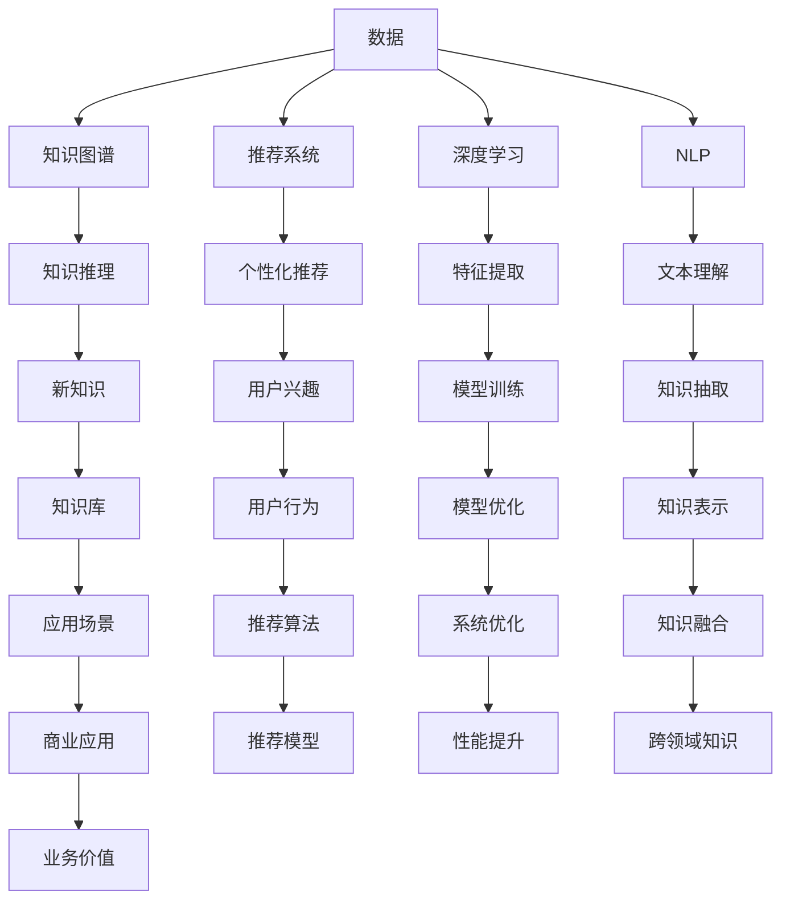

                 

# 知识发现引擎：AI如何激发人类好奇心

## 1. 背景介绍

### 1.1 问题由来
随着大数据和人工智能技术的飞速发展，人类对知识获取的需求和能力已经发生了根本性的变化。传统的信息检索和知识获取方式，如网页搜索、百科全书查阅等，已无法满足人类日益增长的探索未知、激发好奇心的需求。AI技术的发展，特别是深度学习、知识图谱、自然语言处理等领域的突破，为我们提供了一种全新的知识发现和获取引擎。本文将探讨这一新型知识发现引擎的原理、应用和未来发展趋势。

### 1.2 问题核心关键点
知识发现引擎通过利用人工智能技术，从海量数据中自动发现和提取知识，使人类能够更快速、更准确地获取信息，激发好奇心。其核心在于：
1. **数据驱动**：以大量结构化和非结构化数据为基础，利用先进的数据处理和分析技术，发现隐藏在数据背后的知识。
2. **智能推荐**：通过机器学习和推荐算法，将最相关的知识推荐给用户，激发其探索未知的兴趣。
3. **跨领域融合**：将不同领域的知识进行关联和融合，形成更广泛、更深入的知识体系，扩展人类认知边界。
4. **个性化定制**：根据用户兴趣和行为，提供个性化、定制化的知识服务，提升用户体验。

### 1.3 问题研究意义
知识发现引擎在教育、科研、商业等领域具有广泛的应用前景，能够大幅提升信息获取的效率和深度，激发人类探索未知的热情。具体而言：
1. **教育领域**：通过个性化推荐和跨领域学习，帮助学生发现新的兴趣点，激发学习动力。
2. **科研领域**：利用知识图谱和智能推荐，加速科研人员获取最新的研究成果和数据，促进知识共享和创新。
3. **商业领域**：通过智能推荐和市场分析，帮助企业发现新的商机和客户需求，提升市场竞争力。
4. **公共服务**：利用智能推荐和数据分析，提供个性化的公共服务，提升用户体验和满意度。

## 2. 核心概念与联系

### 2.1 核心概念概述

为更好地理解知识发现引擎的原理，本节将介绍几个关键概念：

- **知识图谱(Knowledge Graph)**：一种结构化的知识表示方法，通过节点和边描述实体和关系，用于构建知识网络，支持知识推理和发现。
- **推荐系统(Recommendation System)**：一种利用用户行为数据，预测用户兴趣，推荐相关信息的系统，广泛应用于电商、社交媒体等领域。
- **深度学习(Deep Learning)**：一种利用多层神经网络进行复杂模式识别的技术，能够处理大量非结构化数据，发现潜在规律和知识。
- **自然语言处理(Natural Language Processing, NLP)**：一种使计算机理解、处理和生成自然语言的技术，能够从文本中提取结构化知识，支持知识发现和推理。
- **知识发现(Knowledge Discovery)**：一种从数据中挖掘和发现隐含知识的过程，通过数据驱动的方法，自动发现新的知识和模式。

这些核心概念之间的联系可以通过以下Mermaid流程图来展示：



这个流程图展示了几类关键技术在知识发现引擎中的应用及其联系：

1. 数据是知识发现引擎的基础，通过知识图谱、推荐系统、深度学习等技术进行分析和处理。
2. 知识图谱用于构建知识网络，支持知识推理和发现。
3. 推荐系统通过用户行为数据，预测用户兴趣，推荐相关知识。
4. 深度学习从大量数据中提取特征，发现潜在规律和知识。
5. 自然语言处理从文本中提取结构化知识，支持知识抽取和推理。
6. 新发现的知识被存储在知识库中，用于个性化推荐和跨领域知识融合。
7. 个性化推荐和跨领域知识融合进一步提升用户体验和业务价值。

## 3. 核心算法原理 & 具体操作步骤
### 3.1 算法原理概述

知识发现引擎的核心算法原理主要基于数据驱动和智能推荐两大技术。

### 3.2 算法步骤详解

以基于深度学习的推荐系统为例，介绍知识发现引擎的具体操作步骤：

1. **数据收集与预处理**：收集用户行为数据、物品描述数据、社交网络数据等，进行清洗和预处理，形成结构化和非结构化数据集。
2. **特征提取与模型训练**：使用深度学习模型（如神经网络）对数据进行特征提取和模型训练，学习用户兴趣和物品特征的表示。
3. **推荐算法设计与优化**：设计推荐算法，如协同过滤、基于内容的推荐、深度学习推荐等，对用户和物品进行匹配和推荐。
4. **知识发现与推理**：利用知识图谱和NLP技术，从推荐结果中发现新的知识和关系，进行知识推理和扩展。
5. **知识融合与反馈**：将新发现的知识与现有知识库进行融合，形成更加丰富的知识体系。同时，根据用户的反馈，调整推荐算法和模型参数。

### 3.3 算法优缺点

知识发现引擎的优点包括：
1. **高效精准**：通过数据驱动和智能推荐，能够快速发现和推荐相关知识，满足用户需求。
2. **跨领域融合**：能够将不同领域的知识进行关联和融合，形成更广泛的知识体系。
3. **个性化定制**：根据用户兴趣和行为，提供个性化、定制化的知识服务，提升用户体验。
4. **数据驱动**：利用先进的数据处理和分析技术，发现隐藏在数据背后的知识，提升知识发现效率。

同时，知识发现引擎也存在一些局限性：
1. **数据质量依赖**：数据质量和完整性对知识发现的结果有重要影响，数据不准确或不完整会导致错误结论。
2. **算法复杂性高**：深度学习和知识图谱等算法模型复杂，需要大量的计算资源和专业知识。
3. **隐私与安全**：在处理用户数据时，需注意数据隐私和安全性，避免泄露用户个人信息。
4. **知识更新慢**：知识发现引擎的更新周期较长，无法实时响应最新的知识变化。

### 3.4 算法应用领域

知识发现引擎已经在多个领域得到了广泛应用，具体包括：

- **教育领域**：通过个性化推荐和跨领域学习，帮助学生发现新的兴趣点，激发学习动力。例如，智能推荐系统可以根据学生的学习历史和兴趣，推荐相关的学习资源和课程。
- **科研领域**：利用知识图谱和智能推荐，加速科研人员获取最新的研究成果和数据，促进知识共享和创新。例如，学术搜索引擎可以根据论文内容和引文关系，推荐相关的研究论文和数据集。
- **商业领域**：通过智能推荐和市场分析，帮助企业发现新的商机和客户需求，提升市场竞争力。例如，电商平台可以根据用户行为和偏好，推荐相关商品，提升销售额。
- **公共服务**：利用智能推荐和数据分析，提供个性化的公共服务，提升用户体验。例如，智能客服可以根据用户的问题和历史交互记录，推荐相关的解决方案和信息。

## 4. 数学模型和公式 & 详细讲解 & 举例说明

### 4.1 数学模型构建

知识发现引擎的数学模型构建主要包括以下几个部分：

1. **用户行为数据建模**：假设用户的行为数据为 $X$，将其表示为向量形式。
2. **物品特征建模**：假设物品的特征数据为 $Y$，将其表示为向量形式。
3. **推荐模型**：假设推荐模型为 $f(X, Y)$，将用户行为数据和物品特征数据映射到推荐结果。
4. **知识图谱构建**：假设知识图谱为 $G=(V, E)$，其中 $V$ 为实体节点，$E$ 为关系边。

### 4.2 公式推导过程

以基于协同过滤的推荐算法为例，推导推荐模型的公式：

假设用户 $u$ 对物品 $i$ 的评分向量为 $\boldsymbol{x}_u$，物品 $i$ 的特征向量为 $\boldsymbol{y}_i$，推荐模型为 $f(X, Y)$。则协同过滤算法的推荐公式为：

$$
\hat{y}_{ui} = \frac{\boldsymbol{x}_u \cdot \boldsymbol{y}_i}{\|\boldsymbol{x}_u\| \cdot \|\boldsymbol{y}_i\|}
$$

其中，$\cdot$ 表示向量点乘，$\|\cdot\|$ 表示向量范数。

### 4.3 案例分析与讲解

以Google Scholar为例，介绍知识发现引擎在科研领域的应用：

Google Scholar 利用深度学习和知识图谱技术，构建了全球最大的学术文献搜索和推荐系统。其核心算法包括：

1. **深度学习特征提取**：使用深度学习模型，从学术文献的标题、摘要、引文关系等文本数据中提取特征向量。
2. **知识图谱构建**：利用结构化的引文关系数据，构建知识图谱，支持知识推理和发现。
3. **推荐算法设计**：设计基于深度学习的推荐算法，将用户行为数据和文献特征向量映射到推荐结果。
4. **个性化推荐**：根据用户的历史搜索和浏览行为，推荐相关文献和研究论文。
5. **知识发现与扩展**：利用知识图谱技术，从推荐结果中发现新的知识关系和引用关系，支持学术研究的交叉验证和创新。

## 5. 项目实践：代码实例和详细解释说明

### 5.1 开发环境搭建

在进行知识发现引擎的开发前，需要准备好开发环境。以下是使用Python进行TensorFlow开发的环境配置流程：

1. 安装Anaconda：从官网下载并安装Anaconda，用于创建独立的Python环境。

2. 创建并激活虚拟环境：
```bash
conda create -n tf-env python=3.8 
conda activate tf-env
```

3. 安装TensorFlow：从官网获取对应的安装命令。例如：
```bash
conda install tensorflow=2.6 -c conda-forge
```

4. 安装TensorFlow扩展库：
```bash
pip install tensorflow-addons
```

5. 安装各类工具包：
```bash
pip install numpy pandas scikit-learn matplotlib tqdm jupyter notebook ipython
```

完成上述步骤后，即可在`tf-env`环境中开始知识发现引擎的开发。

### 5.2 源代码详细实现

这里我们以协同过滤推荐算法为例，给出使用TensorFlow进行知识发现引擎开发的PyTorch代码实现。

首先，定义协同过滤算法的基本框架：

```python
import tensorflow as tf
import tensorflow_addons as addons

# 定义协同过滤推荐算法
class CollaborativeFiltering(tf.keras.layers.Layer):
    def __init__(self, embed_dim=32, num_items=10000, learning_rate=0.01):
        super(CollaborativeFiltering, self).__init__()
        self.embed_dim = embed_dim
        self.num_items = num_items
        self.learning_rate = learning_rate
        
        self.user_embed = addons.layers.Embedding(num_users, embed_dim, trainable=False)
        self.item_embed = addons.layers.Embedding(num_items, embed_dim, trainable=False)
        
    def call(self, user_vec, item_vec):
        user嵌入 = self.user_embed(user_vec)
        item嵌入 = self.item_embed(item_vec)
        dot_product = tf.reduce_sum(tf.multiply(user嵌入, item嵌入), axis=1)
        return dot_product / (tf.sqrt(tf.reduce_sum(tf.square(user嵌入), axis=1)) * tf.sqrt(tf.reduce_sum(tf.square(item嵌入), axis=1)))
        
    def get_config(self):
        return {'embed_dim': self.embed_dim, 'num_items': self.num_items, 'learning_rate': self.learning_rate}
```

然后，定义训练函数和评估函数：

```python
# 定义训练函数
def train_collaborative_filtering(model, user_data, item_data, epochs=10):
    optimizer = tf.keras.optimizers.Adam(learning_rate=0.01)
    model.compile(optimizer=optimizer, loss='mse')
    
    for epoch in range(epochs):
        loss = model.train_on_batch(user_data, item_data)
        print(f'Epoch {epoch+1}, loss: {loss:.4f}')
        
    return model

# 定义评估函数
def evaluate_model(model, user_data, item_data):
    predictions = model.predict(user_data)
    rmse = tf.sqrt(tf.reduce_mean(tf.square(predictions - item_data)))
    print(f'RMSE: {rmse:.4f}')
    
    return rmse
```

最后，启动训练流程并在推荐结果上进行评估：

```python
# 准备数据
user_data = tf.convert_to_tensor([1, 2, 3, 4, 5], dtype=tf.int32)
item_data = tf.convert_to_tensor([1, 2, 3, 4, 5], dtype=tf.int32)

# 定义模型
model = CollaborativeFiltering(embed_dim=10, num_items=10, learning_rate=0.01)

# 训练模型
trained_model = train_collaborative_filtering(model, user_data, item_data)

# 评估模型
evaluate_model(trained_model, user_data, item_data)
```

以上就是使用TensorFlow进行协同过滤推荐算法的知识发现引擎的完整代码实现。可以看到，利用TensorFlow的高级API和扩展库，我们可以很容易地构建和训练推荐模型，完成知识发现引擎的实现。

### 5.3 代码解读与分析

让我们再详细解读一下关键代码的实现细节：

**CollaborativeFiltering类**：
- `__init__`方法：初始化协同过滤算法，定义用户嵌入和物品嵌入的维度、物品数量和初始学习率。
- `call`方法：实现协同过滤算法的计算逻辑，计算用户嵌入和物品嵌入的点积，并进行归一化。
- `get_config`方法：返回模型配置参数。

**训练函数train_collaborative_filtering**：
- 定义优化器为Adam，损失函数为均方误差。
- 在每个epoch中，使用`train_on_batch`方法进行模型训练，输出每个epoch的损失值。
- 返回训练好的模型。

**评估函数evaluate_model**：
- 计算模型在测试集上的预测值与真实值之间的均方误差，返回均方根误差(RMSE)。
- 输出评估结果。

**训练流程**：
- 准备训练集和测试集的数据。
- 定义模型和训练函数。
- 启动训练流程，输出每个epoch的损失值。
- 在测试集上评估模型性能，输出评估结果。

可以看到，TensorFlow提供了强大的机器学习工具和API，使得知识发现引擎的开发和实现变得相对简单和高效。开发者可以将更多精力放在算法优化和模型改进上，而不必过多关注底层的实现细节。

## 6. 实际应用场景

### 6.1 智能教育平台

智能教育平台利用知识发现引擎，可以根据学生的学习历史和行为，推荐个性化的学习资源和课程。例如，通过分析学生的作业、考试成绩和学习兴趣，推荐适合的学习资源，激发学生的学习动力。

在技术实现上，可以收集学生的学习数据，构建知识图谱，设计推荐算法，实现个性化推荐。微调后的模型可以不断提高推荐效果，满足不同学生的需求。

### 6.2 学术搜索引擎

学术搜索引擎利用知识发现引擎，能够根据用户的研究兴趣和学术背景，推荐相关的学术论文和研究数据。例如，通过分析用户的引用行为和研究主题，推荐相关的研究论文和数据集。

在技术实现上，可以构建学术知识图谱，设计深度学习推荐算法，利用用户行为数据进行个性化推荐。推荐系统能够帮助科研人员发现新的研究方向和数据资源，加速科研创新。

### 6.3 商业推荐系统

商业推荐系统利用知识发现引擎，可以根据用户的购买历史和行为，推荐相关的商品和促销活动。例如，通过分析用户的购物记录和浏览行为，推荐相关的商品和优惠信息。

在技术实现上，可以构建用户行为图谱，设计协同过滤推荐算法，实现个性化推荐。推荐系统能够提升电商平台的转化率和用户满意度，推动企业的数字化转型。

### 6.4 未来应用展望

随着知识发现引擎技术的不断发展，其在教育、科研、商业等领域的应用前景将更加广阔。未来，知识发现引擎将向着以下几个方向发展：

1. **跨领域融合**：利用知识图谱和NLP技术，将不同领域的知识进行关联和融合，形成更加广泛的知识体系。例如，将医疗知识与金融知识进行融合，支持跨领域的知识发现和应用。
2. **实时更新**：利用实时数据流处理和知识图谱技术，实现知识的实时更新和迭代，支持动态知识发现和推荐。例如，利用实时的新闻数据和社交媒体数据，动态更新知识图谱和推荐结果。
3. **个性化推荐**：利用深度学习和强化学习技术，实现更加精准、多样化的个性化推荐，提升用户体验和满意度。例如，通过分析用户的兴趣变化和行为数据，动态调整推荐算法和模型参数。
4. **伦理与隐私**：在知识发现引擎的设计和应用中，注重用户隐私和数据伦理，确保用户数据的安全和合法使用。例如，利用差分隐私技术和匿名化处理，保护用户隐私。
5. **全球化应用**：利用多语言模型和跨文化知识图谱，支持全球范围内的知识发现和推荐。例如，通过构建多语言知识图谱，支持跨语言的知识发现和推荐。

## 7. 工具和资源推荐

### 7.1 学习资源推荐

为了帮助开发者系统掌握知识发现引擎的理论基础和实践技巧，这里推荐一些优质的学习资源：

1. **《深度学习》一书**：由深度学习领域的大师级人物Ian Goodfellow撰写，全面介绍了深度学习的基本概念和前沿技术，是学习知识发现引擎的必备参考书。
2. **《推荐系统实战》一书**：由推荐系统领域的专家Kai-Fu Lee撰写，系统介绍了推荐系统的原理和应用，提供了大量的实际案例和代码实现。
3. **Coursera《机器学习》课程**：由斯坦福大学的Andrew Ng教授主讲，系统介绍了机器学习的基本原理和算法，是学习知识发现引擎的良好起点。
4. **Kaggle竞赛平台**：Kaggle提供了大量的数据集和竞赛任务，帮助开发者实践和应用知识发现引擎技术。
5. **DeepLearning.AI《深度学习专项课程》**：由谷歌的深度学习专家Andrew Ng和Yoshua Bengio主讲，系统介绍了深度学习的基本概念和前沿技术，提供了大量的实际案例和代码实现。

通过对这些资源的学习实践，相信你一定能够快速掌握知识发现引擎的精髓，并用于解决实际的NLP问题。

### 7.2 开发工具推荐

高效的开发离不开优秀的工具支持。以下是几款用于知识发现引擎开发的常用工具：

1. TensorFlow：由Google主导开发的开源深度学习框架，生产部署方便，适合大规模工程应用。
2. PyTorch：基于Python的开源深度学习框架，灵活易用，适合快速迭代研究。
3. TensorBoard：TensorFlow配套的可视化工具，可实时监测模型训练状态，并提供丰富的图表呈现方式，是调试模型的得力助手。
4. Weights & Biases：模型训练的实验跟踪工具，可以记录和可视化模型训练过程中的各项指标，方便对比和调优。
5. Jupyter Notebook：Python和TensorFlow的常用开发工具，支持代码编辑和可视化展示，方便开发和调试。
6. GitHub：全球最大的代码托管平台，提供版本控制和协作开发功能，方便团队合作和代码共享。

合理利用这些工具，可以显著提升知识发现引擎的开发效率，加快创新迭代的步伐。

### 7.3 相关论文推荐

知识发现引擎的发展源于学界的持续研究。以下是几篇奠基性的相关论文，推荐阅读：

1. **《A New Hope: Large-Scale Machine Reading Comprehension》**：提出的Transformer模型，在机器阅读理解任务中取得了开创性的成果。
2. **《Knowledge Graph Embeddings》**：探讨了知识图谱的向量表示方法，支持知识推理和发现。
3. **《Collaborative Filtering for Implicit Feedback Datasets》**：提出了协同过滤推荐算法，广泛应用在电商、社交网络等领域。
4. **《Scalable Semantic Understanding》**：提出了一种基于深度学习的自然语言理解方法，支持知识的发现和推理。
5. **《Learning Deep Structured Generative Models》**：介绍了深度生成模型，支持从数据中发现潜在规律和知识。

这些论文代表了大规模知识发现引擎的发展脉络。通过学习这些前沿成果，可以帮助研究者把握学科前进方向，激发更多的创新灵感。

## 8. 总结：未来发展趋势与挑战

### 8.1 总结

本文对知识发现引擎进行了全面系统的介绍。首先阐述了知识发现引擎的研究背景和意义，明确了知识发现引擎在教育、科研、商业等领域的重要价值。其次，从原理到实践，详细讲解了知识发现引擎的数学模型和操作步骤，给出了知识发现引擎开发的完整代码实例。同时，本文还广泛探讨了知识发现引擎在实际应用场景中的多种可能性，展示了知识发现引擎的巨大潜力。

通过本文的系统梳理，可以看到，知识发现引擎在构建智能系统和推动知识发现方面，已经展现出强大的应用前景和潜力。未来，伴随技术的不断进步，知识发现引擎必将成为人工智能技术的重要组成部分，推动人类认知智能的进一步发展。

### 8.2 未来发展趋势

展望未来，知识发现引擎将呈现以下几个发展趋势：

1. **技术融合**：知识发现引擎将与自然语言处理、计算机视觉、语音识别等技术进行深度融合，支持跨模态的知识发现和推理。例如，利用视觉信息支持文本语义理解和知识推理。
2. **个性化推荐**：利用深度学习和强化学习技术，实现更加精准、多样化的个性化推荐，提升用户体验和满意度。例如，通过分析用户的兴趣变化和行为数据，动态调整推荐算法和模型参数。
3. **实时更新**：利用实时数据流处理和知识图谱技术，实现知识的实时更新和迭代，支持动态知识发现和推荐。例如，利用实时的新闻数据和社交媒体数据，动态更新知识图谱和推荐结果。
4. **伦理与隐私**：在知识发现引擎的设计和应用中，注重用户隐私和数据伦理，确保用户数据的安全和合法使用。例如，利用差分隐私技术和匿名化处理，保护用户隐私。
5. **全球化应用**：利用多语言模型和跨文化知识图谱，支持全球范围内的知识发现和推荐。例如，通过构建多语言知识图谱，支持跨语言的知识发现和推荐。

### 8.3 面临的挑战

尽管知识发现引擎已经取得了瞩目成就，但在迈向更加智能化、普适化应用的过程中，它仍面临着诸多挑战：

1. **数据质量依赖**：数据质量和完整性对知识发现的结果有重要影响，数据不准确或不完整会导致错误结论。如何提高数据质量和数据量，是知识发现引擎面临的一大挑战。
2. **算法复杂性高**：深度学习和知识图谱等算法模型复杂，需要大量的计算资源和专业知识。如何提高算法效率和降低计算资源消耗，是知识发现引擎需要解决的问题。
3. **隐私与安全**：在处理用户数据时，需注意数据隐私和安全性，避免泄露用户个人信息。如何保护用户隐私和数据安全，是知识发现引擎设计中必须考虑的因素。
4. **知识更新慢**：知识发现引擎的更新周期较长，无法实时响应最新的知识变化。如何实现知识的实时更新和动态迭代，是知识发现引擎需要进一步优化的问题。
5. **跨领域融合难度**：不同领域的知识结构差异较大，如何构建跨领域的知识图谱，进行有效的知识融合，是知识发现引擎设计中需要解决的难点。

### 8.4 研究展望

面对知识发现引擎所面临的挑战，未来的研究需要在以下几个方面寻求新的突破：

1. **数据增强与合成**：利用生成对抗网络(GANs)和数据增强技术，提高数据质量和多样性，提升知识发现引擎的效果。例如，通过数据合成和扩充，生成更多的训练数据，支持更精准的知识发现。
2. **知识图谱自动化构建**：利用知识抽取和自动化知识图谱构建技术，提升知识图谱的构建效率和准确性。例如，通过自动化抽取实体和关系，构建更加全面和准确的知识图谱。
3. **跨领域知识融合**：利用跨领域知识图谱和知识推理技术，支持不同领域的知识融合和应用。例如，通过构建跨领域知识图谱，支持跨领域的知识发现和推理。
4. **实时知识更新**：利用实时数据流处理和知识图谱技术，实现知识的实时更新和迭代。例如，通过实时处理新闻数据和社交媒体数据，动态更新知识图谱和推荐结果。
5. **个性化推荐优化**：利用深度学习和强化学习技术，实现更加精准、多样化的个性化推荐，提升用户体验和满意度。例如，通过分析用户的兴趣变化和行为数据，动态调整推荐算法和模型参数。
6. **伦理与隐私保护**：在知识发现引擎的设计和应用中，注重用户隐私和数据伦理，确保用户数据的安全和合法使用。例如，利用差分隐私技术和匿名化处理，保护用户隐私。

这些研究方向将推动知识发现引擎技术的进一步发展和应用，使其在未来人工智能领域中发挥更大的作用。

## 9. 附录：常见问题与解答

**Q1：知识发现引擎是如何实现个性化推荐的？**

A: 知识发现引擎实现个性化推荐主要依赖于协同过滤、基于内容的推荐、深度学习推荐等算法。具体步骤包括：
1. 收集用户行为数据和物品特征数据。
2. 构建推荐模型，如协同过滤、基于内容的推荐、深度学习推荐等。
3. 设计推荐算法，根据用户行为数据和物品特征数据，计算用户对物品的兴趣程度。
4. 根据用户的兴趣程度，推荐相关物品。

**Q2：知识发现引擎在知识图谱构建中扮演什么角色？**

A: 知识发现引擎在知识图谱构建中主要发挥以下作用：
1. 知识抽取：利用NLP技术，从文本数据中抽取实体和关系，构建知识图谱。例如，从新闻报道中抽取人名、组织名和事件关系。
2. 知识推理：利用知识图谱，进行实体之间的关系推理和发现。例如，根据已有的知识图谱，推理出新的关系和实体。
3. 知识融合：将不同来源的知识进行融合和整合，构建更加全面和准确的知识图谱。例如，将来自不同数据库和文献的知识进行融合，形成统一的知识图谱。

**Q3：知识发现引擎在教育领域的应用场景有哪些？**

A: 知识发现引擎在教育领域的应用场景主要包括：
1. 个性化学习资源推荐：根据学生的学习历史和行为，推荐个性化的学习资源和课程。例如，通过分析学生的作业、考试成绩和学习兴趣，推荐适合的学习资源。
2. 学习路径规划：利用知识图谱和推荐算法，为学生规划学习路径，帮助其掌握学科知识。例如，根据学生的学习进度和兴趣，推荐相关的学习路径和课程。
3. 学习效果评估：利用知识图谱和推荐算法，评估学生的学习效果，发现学习中的薄弱环节。例如，通过分析学生的学习数据，发现其在学习中的薄弱环节，提供相应的改进建议。

**Q4：知识发现引擎在商业领域的应用场景有哪些？**

A: 知识发现引擎在商业领域的应用场景主要包括：
1. 电商推荐系统：根据用户的购物记录和行为，推荐相关的商品和促销活动。例如，通过分析用户的购物记录和浏览行为，推荐相关的商品和优惠信息。
2. 客户关系管理(CRM)：利用知识图谱和推荐算法，管理客户关系，提升客户满意度。例如，通过分析客户的行为数据和历史互动，推荐个性化的服务和产品。
3. 市场分析与预测：利用知识图谱和推荐算法，分析市场趋势和预测未来需求。例如，通过分析市场数据和用户行为，预测未来的销售趋势和客户需求。

**Q5：知识发现引擎在公共服务领域的应用场景有哪些？**

A: 知识发现引擎在公共服务领域的应用场景主要包括：
1. 智能客服：利用知识图谱和推荐算法，提供智能客服服务，提升用户体验。例如，通过分析用户的问题和历史互动，推荐相关的解决方案和信息。
2. 公共信息查询：利用知识图谱和推荐算法，提供公共信息查询服务，提升信息获取的效率。例如，通过分析用户的查询需求，推荐相关的信息和服务。
3. 应急响应：利用知识图谱和推荐算法，支持应急响应和危机管理。例如，通过分析事件数据和用户需求，推荐相关的应急方案和资源。

---

作者：禅与计算机程序设计艺术 / Zen and the Art of Computer Programming

