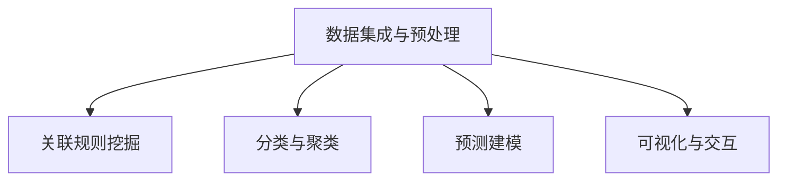

                 

## 1. 背景介绍

### 1.1 问题由来
在现代社会，信息爆炸现象已经不可逆转，我们正处于一个数据泛滥的时代。如何从海量数据中提取出有价值的信息，使之转化为可供人类决策和认知的知识，成为了一个重要的问题。传统的信息检索和统计方法已经无法满足需求，急需更高级别的认知工具。

在这一背景下，知识发现引擎（Knowledge Discovery Engine, KDE）应运而生，它通过自动化、智能化的方式，帮助人类从数据中挖掘出深层次的知识和洞察，为决策提供支持。

### 1.2 问题核心关键点
知识发现引擎的核心在于其能够通过数据驱动的方式，自动地发现数据中的模式、关联和趋势，并将其转化为可理解、可操作的知识。其关键点在于：
1. **数据集成与预处理**：整合来自不同源的数据，并对数据进行清洗、归一化等预处理操作，确保数据质量。
2. **关联规则挖掘**：从数据中挖掘出频繁项集、关联规则等，揭示数据之间的内在联系。
3. **分类与聚类**：对数据进行分类与聚类，帮助识别数据中的不同类别和群组。
4. **预测与建模**：使用机器学习算法构建预测模型，用于未来趋势的预测和趋势的建模。
5. **可视化与交互**：将挖掘出的知识以图形化、可视化的方式呈现，支持交互式探索和理解。

这些核心功能使得知识发现引擎能够有效解决信息爆炸带来的知识提取问题，为决策提供有力支持。

### 1.3 问题研究意义
知识发现引擎的研究与应用，具有重要的理论和实践意义：

1. **知识积累与创新**：通过系统化的知识发现，加速知识的积累与传播，促进科学创新和社会进步。
2. **智能决策支持**：为政府、企业等机构提供智能决策支持，提升决策效率和准确性。
3. **商业应用价值**：在零售、金融、医疗等领域，帮助企业优化运营，提升服务质量，降低运营成本。
4. **教育与培训**：在教育领域，通过知识发现技术，帮助学生发现知识之间的关联，提高学习效果。
5. **科学研究支持**：支持科学研究，揭示科学现象背后的规律，推动学科发展。

总之，知识发现引擎不仅具有理论意义，更具有广泛的应用前景，是解决信息爆炸问题的有效手段。

## 2. 核心概念与联系

### 2.1 核心概念概述

为了更好地理解知识发现引擎，我们先介绍几个关键概念：

- **数据挖掘（Data Mining）**：从数据中自动发现有用的信息和知识的过程。数据挖掘的目的是揭示数据中潜在的模式和关系。
- **关联规则**：在事务数据库中，揭示事物之间的关联性。如在超市交易中，苹果和香蕉的共同购买频率较高，揭示了两种商品的关联关系。
- **分类与聚类**：将数据分组，使同一组内的数据具有相似特征，不同组的数据具有明显差异。
- **预测建模**：使用历史数据训练模型，对未来数据进行预测，揭示未来的趋势和规律。
- **可视化与交互**：将挖掘出的知识以图形化方式呈现，便于用户理解和交互。

这些概念之间的联系可以通过以下Mermaid流程图来展示：



这个流程图展示了知识发现引擎的主要流程，从数据集成与预处理到关联规则挖掘、分类与聚类、预测建模、可视化与交互，每一步都是知识发现的重要环节。

## 3. 核心算法原理 & 具体操作步骤
### 3.1 算法原理概述

知识发现引擎的算法原理主要基于统计学、机器学习和数据挖掘技术。其核心思想是通过对数据进行统计分析、模式识别和知识推理，发现数据中的知识，并转化为可操作的洞察。

形式化地，假设我们有数据集 $D=\{(x_i,y_i)\}_{i=1}^N$，其中 $x_i$ 为输入特征，$y_i$ 为标签或输出，我们的目标是找到一个映射函数 $f$，使得 $y=f(x)$ 能够最大限度地拟合训练数据。常见的模型包括决策树、随机森林、神经网络、支持向量机等。

知识发现引擎的工作流程包括：

1. **数据集成与预处理**：整合多源数据，进行去重、清洗、归一化等操作，确保数据质量。
2. **关联规则挖掘**：使用频繁项集算法如Apriori算法，发现数据中的关联规则。
3. **分类与聚类**：使用分类算法如KNN、SVM、神经网络等，对数据进行分类；使用聚类算法如K-means、DBSCAN等，对数据进行分组。
4. **预测建模**：使用回归、分类、时间序列等算法，构建预测模型。
5. **可视化与交互**：使用可视化工具如Tableau、Power BI等，将挖掘出的知识以图形化方式呈现，支持交互式探索。

### 3.2 算法步骤详解

以关联规则挖掘为例，我们详细讲解知识发现引擎的核心算法步骤：

**Step 1: 数据预处理**
- 整合数据：从不同源的数据库中整合数据。
- 数据清洗：去除噪声、缺失值、重复值等。
- 数据归一化：将数据转换为标准格式，便于后续处理。

**Step 2: 频繁项集挖掘**
- 扫描数据库：使用Apriori算法，对数据库进行扫描，找出所有频繁项集。
- 关联规则提取：基于频繁项集，提取出所有关联规则。

**Step 3: 关联规则分析**
- 规则评估：根据规则的置信度和支持度，评估规则的可靠性。
- 规则融合：将多个规则进行融合，形成综合规则。

**Step 4: 结果可视化**
- 数据可视化：将挖掘出的关联规则以图形化方式呈现。
- 交互式探索：支持用户通过交互界面，深入探索规则背后的含义。

### 3.3 算法优缺点

知识发现引擎的算法具有以下优点：
1. **自动化**：自动化数据挖掘过程，减少人工干预，提高效率。
2. **多源数据整合**：能够整合多源数据，提供全面的视角。
3. **模型可解释性**：挖掘出的规则和模型具有较好的可解释性，便于理解和应用。
4. **灵活性**：适用于各种类型的数据，如结构化数据、半结构化数据、非结构化数据等。

但同时，这些算法也存在一些局限性：
1. **数据依赖性强**：算法的性能依赖于数据的质量和数量。
2. **计算复杂度高**：对于大规模数据集，计算复杂度较高，可能需要较长时间。
3. **规则解释困难**：对于复杂的关联规则，解释其背后的逻辑较困难。
4. **过度拟合问题**：在处理小规模数据时，容易过度拟合，导致模型泛化性能差。

### 3.4 算法应用领域

知识发现引擎在多个领域中得到了广泛应用，例如：

- **零售业**：通过挖掘顾客购物行为数据，发现关联商品，优化库存管理，提升销售业绩。
- **金融业**：挖掘客户交易数据，发现欺诈行为，提高风险控制能力。
- **医疗领域**：分析患者病历数据，发现疾病关联，支持诊断和治疗决策。
- **社交网络**：挖掘用户行为数据，发现社群结构，支持社交推荐和广告投放。
- **工业制造**：分析生产数据，优化生产流程，提高生产效率。

除了上述领域，知识发现引擎还在智能交通、智慧城市、环保监测等领域有广泛应用，推动了这些领域的信息化和智能化进程。

## 4. 数学模型和公式 & 详细讲解

### 4.1 数学模型构建

以分类算法为例，我们介绍常用的分类模型及其数学模型构建方法。

假设我们有一个数据集 $D=\{(x_i,y_i)\}_{i=1}^N$，其中 $x_i \in \mathbb{R}^d$ 为输入特征，$y_i \in \{0,1\}$ 为二分类标签。我们的目标是为每个样本 $x_i$ 找到一个决策边界，使得分类误差最小。

常见的分类模型包括逻辑回归、决策树、支持向量机等。这里以逻辑回归为例，介绍其数学模型构建方法：

- **逻辑回归模型**：假设 $y=1$ 的概率为 $p(y|x;\theta)$，则有 $p(y|x;\theta)=\frac{1}{1+\exp(-z(x;\theta))}$，其中 $z(x;\theta)=\theta^Tx$。

- **损失函数**：使用交叉熵损失函数 $\mathcal{L}(\theta)=\frac{1}{N}\sum_{i=1}^N(-y_i\log(p(y_i|x_i;\theta))-(1-y_i)\log(1-p(y_i|x_i;\theta)))$。

- **优化目标**：最小化损失函数 $\mathcal{L}(\theta)$，得到模型参数 $\theta$。

### 4.2 公式推导过程

以下是逻辑回归模型的详细推导过程：

1. **概率模型**：设样本 $x_i$ 的特征为 $x_i \in \mathbb{R}^d$，决策边界为 $z(x;\theta)=\theta^Tx$，则 $y=1$ 的概率为 $p(y|x;\theta)=\frac{1}{1+\exp(-z(x;\theta))}$。

2. **损失函数**：使用交叉熵损失函数，即 $\mathcal{L}(\theta)=\frac{1}{N}\sum_{i=1}^N(-y_i\log(p(y_i|x_i;\theta))-(1-y_i)\log(1-p(y_i|x_i;\theta)))$。

3. **梯度下降**：利用梯度下降算法，更新模型参数 $\theta$，使得损失函数最小化。

4. **结果可视化**：将模型参数 $\theta$ 可视化，展示模型在不同输入特征下的预测结果。

### 4.3 案例分析与讲解

以一个简单的购物篮数据分析为例，展示知识发现引擎的应用：

假设我们有一个购物篮数据集，记录了顾客购买商品的情况。我们希望挖掘出不同商品之间的关联关系，以便优化库存管理和提升销售额。

**Step 1: 数据预处理**
- 整合数据：从数据库中导出数据。
- 数据清洗：去除重复记录，处理缺失值。
- 数据归一化：将购买次数归一化，使其在0到1之间。

**Step 2: 频繁项集挖掘**
- 扫描数据库：使用Apriori算法，找出所有频繁项集。
- 关联规则提取：基于频繁项集，提取出所有关联规则。

**Step 3: 关联规则分析**
- 规则评估：根据规则的置信度和支持度，评估规则的可靠性。
- 规则融合：将多个规则进行融合，形成综合规则。

**Step 4: 结果可视化**
- 数据可视化：将挖掘出的关联规则以图形化方式呈现。
- 交互式探索：支持用户通过交互界面，深入探索规则背后的含义。

## 5. 项目实践：代码实例和详细解释说明
### 5.1 开发环境搭建

在进行知识发现引擎的开发实践前，我们需要准备好开发环境。以下是使用Python进行PyTorch开发的环境配置流程：

1. 安装Anaconda：从官网下载并安装Anaconda，用于创建独立的Python环境。

2. 创建并激活虚拟环境：
```bash
conda create -n pytorch-env python=3.8 
conda activate pytorch-env
```

3. 安装PyTorch：根据CUDA版本，从官网获取对应的安装命令。例如：
```bash
conda install pytorch torchvision torchaudio cudatoolkit=11.1 -c pytorch -c conda-forge
```

4. 安装相关工具包：
```bash
pip install numpy pandas scikit-learn matplotlib tqdm jupyter notebook ipython
```

完成上述步骤后，即可在`pytorch-env`环境中开始开发实践。

### 5.2 源代码详细实现

这里我们以Apriori算法为例，给出使用Python实现关联规则挖掘的代码实现。

首先，定义数据集：

```python
from sympy import symbols
import numpy as np

# 创建购物篮数据集
data = [
    [1, 1, 0, 0, 1],
    [1, 0, 1, 0, 1],
    [0, 1, 0, 0, 1],
    [1, 1, 0, 0, 0],
    [0, 1, 1, 1, 1],
    [1, 1, 0, 0, 0],
    [0, 1, 1, 1, 1]
]

# 将数据转换为矩阵形式
data_matrix = np.array(data)
```

然后，定义Apriori算法：

```python
from itertools import combinations

# 定义Apriori算法
def apriori(data, min_support=0.5, max_length=2):
    # 将数据转换为集合形式
    itemsets = [set(row) for row in data]

    # 找出所有频繁项集
    frequent_itemsets = []
    for length in range(1, max_length + 1):
        # 找出所有长度为length的频繁项集
        for itemset in combinations(itemsets, length):
            # 计算itemset的支持度
            support = sum(itemset in rows for rows in data) / len(data)
            # 如果支持度大于等于min_support，加入频繁项集
            if support >= min_support:
                frequent_itemsets.append(itemset)

    return frequent_itemsets

# 运行Apriori算法
frequent_itemsets = apriori(data_matrix)
print(frequent_itemsets)
```

接下来，定义关联规则提取：

```python
from itertools import combinations

# 定义关联规则提取
def extract_rules(frequent_itemsets, min_confidence=0.5, min_support=0.5):
    rules = []
    for itemset in frequent_itemsets:
        # 计算itemset的支持度和置信度
        support = sum(itemset in rows for rows in data) / len(data)
        confidence = sum((itemset - set(rows)) in rows for rows in data) / sum(itemset in rows for rows in data)

        # 如果置信度和支持度都大于等于min_confidence和min_support，加入规则
        if confidence >= min_confidence and support >= min_support:
            rules.append((itemset, rows))

    return rules

# 运行关联规则提取
rules = extract_rules(frequent_itemsets, min_confidence=0.5, min_support=0.5)
print(rules)
```

最后，定义结果可视化：

```python
import matplotlib.pyplot as plt

# 可视化关联规则
def visualize_rules(rules):
    # 提取所有规则
    all_items = set()
    for rule in rules:
        all_items |= set(rule[0]) | set(rule[1])

    # 绘制规则树
    fig, ax = plt.subplots(figsize=(8, 6))
    ax.set_xlim(0, len(all_items))
    ax.set_ylim(0, len(rules))
    ax.set_xticks(range(len(all_items)))
    ax.set_xticklabels(all_items)

    # 绘制规则线
    for i, rule in enumerate(rules):
        items = sorted(rule[0] | rule[1])
        ax.plot([items.index(item) for item in items], [i] * len(items), marker='o', linestyle='-', color='b')

    # 显示规则图
    plt.show()

# 运行可视化
visualize_rules(rules)
```

以上就是使用Python实现Apriori算法的完整代码实现。可以看到，通过简单的代码实现，我们完成了关联规则挖掘和可视化的过程。

### 5.3 代码解读与分析

让我们再详细解读一下关键代码的实现细节：

**Apriori算法**：
- `apriori`函数：对数据集进行扫描，找出所有频繁项集。
- `data_matrix`：将数据转换为矩阵形式，便于处理。
- `itemsets`：将数据转换为集合形式，便于计算支持度。
- `frequent_itemsets`：存储所有频繁项集。

**关联规则提取**：
- `extract_rules`函数：基于频繁项集，提取出所有关联规则。
- `confidence`：计算规则的置信度。
- `support`：计算规则的支持度。
- `rules`：存储所有关联规则。

**结果可视化**：
- `visualize_rules`函数：将挖掘出的关联规则以图形化方式呈现。
- `all_items`：提取所有规则中的项。
- `ax`：绘制规则树。
- `plot`函数：绘制规则线。

可以看到，Python的简洁语法和丰富的库支持，使得关联规则挖掘的实现变得简单高效。开发者可以借助这些代码，快速构建和优化自己的知识发现引擎。

## 6. 实际应用场景
### 6.1 智能推荐系统

知识发现引擎在智能推荐系统中的应用非常广泛。通过挖掘用户行为数据，分析用户偏好，为用户推荐个性化的商品、内容和服务。

例如，在电商平台，通过分析用户浏览、购买记录，挖掘出用户偏好，然后推荐相关商品，提高用户购买率和满意度。在视频网站，通过分析用户观看历史，推荐用户可能感兴趣的视频内容，提高用户粘性。

### 6.2 金融风控系统

在金融领域，知识发现引擎可以用于风险控制和欺诈检测。通过分析客户交易数据，挖掘出潜在的风险点和欺诈行为，及时采取措施，降低金融风险。

例如，在信用卡欺诈检测中，通过分析交易数据，挖掘出异常交易模式，识别潜在的欺诈行为，提前预警，保护客户财产安全。

### 6.3 医疗诊断系统

在医疗领域，知识发现引擎可以用于疾病预测和诊断。通过分析患者病历数据，挖掘出疾病的关联和规律，支持医生诊断和治疗决策。

例如，在癌症预测中，通过分析患者基因数据和临床数据，挖掘出癌症风险因素和预测模型，帮助医生早期发现癌症患者，提高治疗效果。

## 7. 工具和资源推荐
### 7.1 学习资源推荐

为了帮助开发者系统掌握知识发现引擎的理论基础和实践技巧，这里推荐一些优质的学习资源：

1. 《数据挖掘：概念与技术》书籍：详细介绍了数据挖掘的基本概念、算法和应用。

2. 《Python数据科学手册》书籍：介绍了使用Python进行数据挖掘和数据分析的工具和技巧。

3. Coursera《数据科学》课程：斯坦福大学开设的入门级数据科学课程，包括数据预处理、关联规则挖掘等核心内容。

4. Kaggle数据科学竞赛：提供了大量实际数据集和比赛题目，帮助开发者实践和提升数据挖掘能力。

5. GitHub知识发现引擎项目：提供了大量的开源代码和示例，帮助开发者快速上手知识发现引擎开发。

通过对这些资源的学习实践，相信你一定能够快速掌握知识发现引擎的精髓，并用于解决实际的数据挖掘问题。

### 7.2 开发工具推荐

高效的开发离不开优秀的工具支持。以下是几款用于知识发现引擎开发的常用工具：

1. Python：Python是数据挖掘和机器学习的通用语言，具有丰富的库支持，如NumPy、Pandas、Scikit-Learn等。

2. R语言：R语言也是数据挖掘和统计分析的常用语言，拥有丰富的统计函数和可视化工具。

3. Apache Spark：基于内存计算的分布式计算框架，支持大规模数据处理和机器学习任务。

4. Tableau：数据可视化工具，支持交互式探索和数据发现。

5. Power BI：微软推出的商业智能工具，支持数据可视化、数据挖掘和报告生成。

合理利用这些工具，可以显著提升知识发现引擎的开发效率，加快创新迭代的步伐。

### 7.3 相关论文推荐

知识发现引擎的研究源于学界的持续研究。以下是几篇奠基性的相关论文，推荐阅读：

1. 《数据挖掘：概念与技术》：Pang-Ning Tan、Michael Steinbach、Vipin Kumar著，详细介绍了数据挖掘的基本概念、算法和应用。

2. 《Apriori算法》：Rakesh Agrawal、Rajiv Srikant等著，介绍了Apriori算法的原理和实现。

3. 《C4.5算法》：Quinlan等著，介绍了决策树算法的原理和实现。

4. 《机器学习：一种统计学习方法》：Tom Mitchell著，介绍了机器学习的基本概念和算法。

这些论文代表了大数据挖掘和机器学习的发展脉络。通过学习这些前沿成果，可以帮助研究者把握学科前进方向，激发更多的创新灵感。

## 8. 总结：未来发展趋势与挑战
### 8.1 研究成果总结

知识发现引擎的研究与应用，在过去几十年中取得了显著进展。通过数据驱动的方式，发现数据中的模式、关联和趋势，挖掘出有价值的知识和洞察，为决策提供支持。

知识发现引擎的研究成果主要集中在以下几个方面：

1. **数据挖掘算法**：开发了多种数据挖掘算法，如关联规则挖掘、分类与聚类、预测建模等，广泛应用于各行各业。

2. **数据可视化工具**：开发了多种数据可视化工具，如Tableau、Power BI等，支持用户通过交互界面深入探索数据。

3. **知识图谱**：构建了多种知识图谱，如DBpedia、Wikidata等，为知识发现提供了强大的基础。

4. **深度学习技术**：将深度学习技术引入数据挖掘和知识发现，如自然语言处理、图像识别等，拓展了知识发现的边界。

### 8.2 未来发展趋势

展望未来，知识发现引擎的研究与应用将呈现以下几个发展趋势：

1. **自动化和智能化**：随着AI技术的发展，知识发现引擎将更加智能化，能够自动进行数据预处理、模型训练和结果解释。

2. **多模态数据融合**：将文本、图像、视频等多种数据类型进行融合，进行综合分析，提供更全面的洞察。

3. **大数据处理**：处理大规模数据集，实现实时数据挖掘和分析，支持大规模应用场景。

4. **跨领域应用**：拓展知识发现引擎在更多领域的应用，如智慧城市、智能交通等。

5. **伦理和隐私保护**：研究知识发现引擎中的伦理和隐私问题，确保数据安全和用户隐私。

6. **开放平台**：构建开放的知识发现引擎平台，促进数据共享和合作。

### 8.3 面临的挑战

尽管知识发现引擎的研究与应用取得了显著进展，但在迈向更加智能化、普适化应用的过程中，它仍面临着诸多挑战：

1. **数据质量问题**：数据质量不高、数据缺失等问题，严重影响知识发现的准确性。

2. **算法复杂性**：算法复杂度高，计算资源消耗大，难以处理大规模数据集。

3. **结果解释性**：挖掘出的结果复杂，难以解释其背后的逻辑，用户难以理解。

4. **数据隐私问题**：数据隐私保护问题，数据采集和使用需要遵守法律法规。

5. **应用场景限制**：知识发现引擎的算法和技术，在某些特定领域的应用场景中效果不佳。

6. **知识图谱构建**：知识图谱的构建和维护，需要大量的手动工作，难以大规模扩展。

### 8.4 研究展望

面对知识发现引擎面临的挑战，未来的研究需要在以下几个方面寻求新的突破：

1. **数据清洗与预处理**：开发更高效的数据清洗和预处理算法，确保数据质量。

2. **算法优化**：优化算法，降低计算复杂度，支持大规模数据处理。

3. **结果解释**：研究如何使结果更易于理解和解释，提高用户对知识发现的信任度。

4. **隐私保护**：研究数据隐私保护技术，确保数据安全和用户隐私。

5. **跨领域应用**：拓展知识发现引擎在更多领域的应用，支持跨领域知识发现。

6. **知识图谱自动化构建**：开发自动化的知识图谱构建工具，支持大规模知识发现。

这些研究方向的探索，必将引领知识发现引擎技术迈向更高的台阶，为数据驱动决策提供更强有力的支持。面向未来，知识发现引擎需要在智能化、自动化、跨领域应用等方面取得突破，才能更好地服务于社会和经济的发展。

## 9. 附录：常见问题与解答

**Q1：知识发现引擎与数据挖掘有什么区别？**

A: 知识发现引擎和数据挖掘是密切相关的领域。数据挖掘是从数据中提取有用信息和知识的过程，而知识发现引擎则是在数据挖掘的基础上，通过自动化、智能化的方式，发现数据中的模式、关联和趋势，并将其转化为可操作的洞察。

**Q2：知识发现引擎有哪些实际应用？**

A: 知识发现引擎在多个领域中得到了广泛应用，例如：

1. 零售业：挖掘顾客购物行为数据，发现关联商品，优化库存管理，提升销售额。
2. 金融业：挖掘客户交易数据，发现欺诈行为，提高风险控制能力。
3. 医疗领域：分析患者病历数据，发现疾病关联，支持诊断和治疗决策。
4. 社交网络：挖掘用户行为数据，发现社群结构，支持社交推荐和广告投放。
5. 智能推荐系统：分析用户行为数据，推荐个性化的商品、内容和服务。

**Q3：如何提高知识发现引擎的效率？**

A: 提高知识发现引擎的效率，可以从以下几个方面入手：

1. 数据预处理：优化数据清洗和预处理算法，确保数据质量。
2. 算法优化：优化算法，降低计算复杂度，支持大规模数据处理。
3. 分布式计算：使用分布式计算框架，如Apache Spark，提高计算效率。
4. 硬件加速：使用GPU、TPU等硬件加速设备，提高计算速度。

**Q4：知识发现引擎中的伦理和隐私问题如何解决？**

A: 知识发现引擎中的伦理和隐私问题，需要通过以下几个方面来解决：

1. 数据隐私保护：采用数据脱敏、加密等技术，保护用户隐私。
2. 知情同意：在数据采集和使用过程中，确保用户知情同意，遵守法律法规。
3. 透明化：公开知识发现引擎的算法和结果，提高透明度。
4. 伦理审查：建立伦理审查机制，确保知识发现引擎的使用符合伦理要求。

这些措施可以保障知识发现引擎的应用合法合规，确保用户隐私和数据安全。

---

作者：禅与计算机程序设计艺术 / Zen and the Art of Computer Programming

