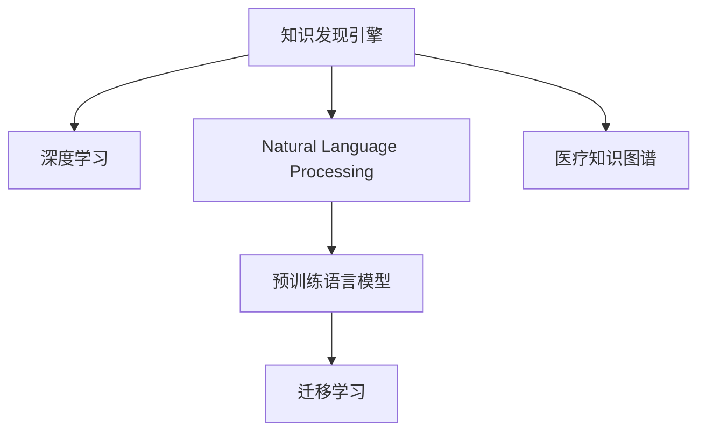

                 

# 知识发现引擎：助力医疗领域的智慧转型

## 1. 背景介绍

### 1.1 问题由来
随着人工智能技术的迅猛发展，特别是在数据驱动下，知识发现和挖掘（Knowledge Discovery in Databases，KDD）成为了热点研究领域。在医疗领域，知识发现引擎（Knowledge Discovery Engine，KDE）通过深度学习和数据挖掘等技术手段，从海量医疗数据中自动地发现潜在的知识模式，助力医生诊疗决策，提升医疗服务质量，加速医疗领域的智慧转型。

### 1.2 问题核心关键点
医疗数据通常具有高度的非结构化和复杂性，传统的数据挖掘技术在处理这些数据时存在诸多局限。随着深度学习和大规模预训练语言模型的兴起，基于神经网络的知识发现引擎在医疗领域逐步展现出巨大的潜力。

其核心关键点包括：
- 数据预处理：对海量医疗数据进行清洗、归一化、缺失值处理等。
- 特征工程：提取与疾病相关的高维特征，构建有效的特征表示。
- 深度学习模型：使用预训练语言模型或神经网络模型进行训练，发现潜在的知识模式。
- 数据可视化和解释：将发现的知识可视化，为医生提供直观的决策支持。
- 医疗知识图谱：构建医疗知识图谱，关联疾病、症状、药物等信息，促进知识发现和迁移学习。

## 2. 核心概念与联系

### 2.1 核心概念概述

为更好地理解知识发现引擎在医疗领域的实现与优化，本节将介绍几个密切相关的核心概念：

- 知识发现引擎（KDE）：使用机器学习、深度学习等技术，从海量数据中自动发现知识模式，辅助医疗决策。
- 深度学习（Deep Learning）：使用多层神经网络结构，通过大量数据进行训练，学习复杂的非线性关系。
- 自然语言处理（NLP）：使用计算机处理、理解、生成人类语言的技术，常用于医疗文本数据处理。
- 预训练语言模型（Pre-trained Language Model，PLM）：通过大规模无标签数据预训练，学习通用的语言表示。
- 迁移学习（Transfer Learning）：利用预训练模型的知识，在特定任务上进行微调，提高模型性能。
- 医疗知识图谱（Medical Knowledge Graph）：构建医疗领域的知识图谱，关联疾病、药物、症状等信息，促进知识发现和推理。

这些核心概念之间的逻辑关系可以通过以下Mermaid流程图来展示：



这个流程图展示了几大核心概念及其之间的关系：

1. 知识发现引擎通过深度学习发现知识模式，辅助医疗决策。
2. 自然语言处理技术常用于医疗文本数据的预处理和特征提取。
3. 预训练语言模型为深度学习提供了通用的语言表示，进一步提高了知识发现的精度。
4. 迁移学习利用预训练模型的知识，在特定医疗任务上进行微调。
5. 医疗知识图谱为知识发现提供了结构化的知识网络，增强了推理能力。

## 3. 核心算法原理 & 具体操作步骤
### 3.1 算法原理概述

知识发现引擎通过深度学习模型，从医疗数据中自动发现知识模式。其核心算法原理基于监督学习和无监督学习的混合范式：

- 监督学习：使用已标注的医疗数据集，训练分类或回归模型，预测新样本的标签或数值。
- 无监督学习：对未标注的医疗数据进行聚类、降维等分析，挖掘数据中的潜在结构和规律。

具体步骤包括：
1. 数据预处理：清洗、归一化、缺失值处理。
2. 特征工程：提取与疾病相关的特征，构建有效的特征向量。
3. 模型训练：使用监督或无监督算法，训练深度学习模型。
4. 结果验证：在验证集上评估模型性能，调整超参数。
5. 知识可视化：将发现的知识以图表形式展示，辅助医生决策。

### 3.2 算法步骤详解

以下是一个基于监督学习的方法的详细步骤：

**Step 1: 数据预处理**
- 数据清洗：移除噪声数据，填补缺失值。
- 数据归一化：将数据进行归一化，使其具有相同的尺度。
- 特征选择：选择与疾病相关的高维特征，减少噪声干扰。

**Step 2: 特征工程**
- 文本特征提取：将医疗文本数据转换为向量表示，如使用词向量、BERT嵌入等。
- 数值特征构建：对临床数据进行特征构建，如年龄、性别、血液指标等。
- 特征融合：将不同模态的数据特征融合，构建统一的特征表示。

**Step 3: 模型训练**
- 数据划分：将数据集分为训练集、验证集和测试集。
- 选择模型：选择合适的深度学习模型，如卷积神经网络、循环神经网络等。
- 模型训练：在训练集上训练模型，最小化损失函数。
- 模型验证：在验证集上评估模型性能，避免过拟合。

**Step 4: 结果验证**
- 模型评估：在测试集上评估模型的泛化能力。
- 超参数调整：根据模型性能，调整学习率、批大小等超参数。
- 结果可视化：将发现的知识以图表形式展示，辅助医生诊断和治疗。

**Step 5: 知识可视化**
- 结果可视化：将知识以图表形式展示，如热力图、散点图等。
- 交互式可视化：提供交互式界面，允许医生调整参数，观察结果变化。

### 3.3 算法优缺点

知识发现引擎在医疗领域的优点包括：
1. 自动化数据处理：自动清洗、归一化数据，减少人工工作量。
2. 提升决策质量：通过深度学习发现知识模式，辅助医生决策。
3. 通用性强：可以应用于多种医疗问题，如诊断、治疗、预防等。

其缺点包括：
1. 数据质量要求高：需要高质量的医疗数据集，才能保证模型性能。
2. 计算资源消耗大：大规模深度学习模型需要较高的计算资源。
3. 可解释性不足：深度学习模型往往缺乏可解释性，难以理解模型决策过程。
4. 泛化能力有限：模型过于复杂可能导致过拟合，泛化能力不足。

尽管存在这些局限性，但知识发现引擎在医疗领域的应用前景仍然广阔。未来需进一步优化算法和数据处理方法，降低计算资源消耗，提升模型可解释性，增强泛化能力。

### 3.4 算法应用领域

知识发现引擎在医疗领域有广泛的应用，主要包括以下几个方面：

- **疾病预测**：通过分析历史病历数据，预测未来可能出现的疾病，如癌症、糖尿病等。
- **患者分层**：根据患者特征，将患者分为高危、中危和低危等级别，进行个性化治疗。
- **药物研发**：从海量文献数据中发现药物的作用机制和副作用，加速新药研发进程。
- **医疗知识图谱**：构建医疗领域的知识图谱，促进知识发现和迁移学习。
- **影像分析**：利用深度学习模型，自动识别和分析医学影像，如CT、MRI等。

此外，知识发现引擎还被应用于临床试验、公共卫生、医疗资源管理等领域，为医疗服务的智能化转型提供了重要支持。

## 4. 数学模型和公式 & 详细讲解 & 举例说明

### 4.1 数学模型构建

在知识发现引擎中，深度学习模型通常采用监督学习的方式进行训练。假设我们有 $N$ 个样本数据 $(x_i,y_i)$，其中 $x_i$ 为特征向量，$y_i$ 为标签。模型参数为 $\theta$，目标是最小化损失函数 $L(\theta)$，具体公式如下：

$$
L(\theta) = \frac{1}{N}\sum_{i=1}^N \ell(y_i,f(x_i;\theta))
$$

其中 $\ell$ 为损失函数，如交叉熵损失、均方误差等。模型参数的更新公式为：

$$
\theta \leftarrow \theta - \eta \nabla_{\theta}L(\theta)
$$

其中 $\eta$ 为学习率，$\nabla_{\theta}L(\theta)$ 为损失函数对模型参数的梯度。

### 4.2 公式推导过程

以二分类任务为例，假设模型输出为 $f(x;\theta)=\sigma(W^Tx+b)$，其中 $\sigma$ 为激活函数，$W$ 和 $b$ 为模型参数。

设样本 $(x_i,y_i)$ 为二分类任务，$y_i \in \{0,1\}$，则二分类交叉熵损失函数定义为：

$$
\ell(y_i,f(x_i;\theta)) = -[y_i\log f(x_i;\theta)+(1-y_i)\log (1-f(x_i;\theta))]
$$

将其代入经验风险公式，得：

$$
L(\theta) = -\frac{1}{N}\sum_{i=1}^N [y_i\log f(x_i;\theta)+(1-y_i)\log(1-f(x_i;\theta))]
$$

根据链式法则，损失函数对模型参数 $\theta$ 的梯度为：

$$
\frac{\partial L(\theta)}{\partial \theta} = -\frac{1}{N}\sum_{i=1}^N \left[\frac{y_i}{f(x_i;\theta)}-\frac{1-y_i}{1-f(x_i;\theta)}\right] \frac{\partial f(x_i;\theta)}{\partial \theta}
$$

其中 $\frac{\partial f(x_i;\theta)}{\partial \theta}$ 可进一步递归展开，利用自动微分技术完成计算。

### 4.3 案例分析与讲解

以基于BERT的疾病预测为例，我们将疾病标签作为监督信号，使用BERT模型进行预测。

**模型构建**
- 使用BERT嵌入对医疗文本进行编码，生成词向量表示。
- 将词向量表示与临床数据融合，构建统一的特征表示。

**训练过程**
- 将数据集划分为训练集、验证集和测试集。
- 在训练集上使用交叉熵损失函数，最小化模型输出与真实标签的差距。
- 在验证集上评估模型性能，避免过拟合。

**结果验证**
- 在测试集上评估模型的泛化能力。
- 使用混淆矩阵、ROC曲线等指标，分析模型预测效果。
- 将发现的知识以图表形式展示，如热力图、散点图等。

## 5. 项目实践：代码实例和详细解释说明

### 5.1 开发环境搭建

在进行知识发现引擎项目开发前，我们需要准备好开发环境。以下是使用Python进行TensorFlow开发的环境配置流程：

1. 安装Anaconda：从官网下载并安装Anaconda，用于创建独立的Python环境。

2. 创建并激活虚拟环境：
```bash
conda create -n tf-env python=3.8 
conda activate tf-env
```

3. 安装TensorFlow：根据CUDA版本，从官网获取对应的安装命令。例如：
```bash
conda install tensorflow tensorflow==2.8 
conda install tensorflow-gpu tensorflow==2.8 -c nvidia -c conda-forge
```

4. 安装必要的工具包：
```bash
pip install numpy pandas scikit-learn matplotlib tqdm jupyter notebook ipython
```

完成上述步骤后，即可在`tf-env`环境中开始项目开发。

### 5.2 源代码详细实现

我们以基于BERT的疾病预测为例，给出使用TensorFlow进行知识发现引擎开发的代码实现。

```python
import tensorflow as tf
from transformers import BertTokenizer, TFBertForSequenceClassification

# 初始化BERT模型
tokenizer = BertTokenizer.from_pretrained('bert-base-cased')
model = TFBertForSequenceClassification.from_pretrained('bert-base-cased', num_labels=num_classes)

# 数据预处理
train_dataset = tf.data.Dataset.from_tensor_slices((train_texts, train_labels))
train_dataset = train_dataset.map(lambda text, label: tokenizer(text, truncation=True, padding=True, max_length=max_length))
train_dataset = train_dataset.shuffle(buffer_size=1024).batch(batch_size)

# 模型训练
optimizer = tf.keras.optimizers.Adam(learning_rate=learning_rate)
loss_fn = tf.keras.losses.SparseCategoricalCrossentropy(from_logits=True)

def train_step(data):
    with tf.GradientTape() as tape:
        predictions = model(data['input_ids'], attention_mask=data['attention_mask'])
        loss = loss_fn(labels, predictions)
    gradients = tape.gradient(loss, model.trainable_variables)
    optimizer.apply_gradients(zip(gradients, model.trainable_variables))

@tf.function
def train_epoch(model, train_dataset, batch_size):
    for batch in train_dataset:
        train_step(batch)
        
# 模型评估
eval_dataset = tf.data.Dataset.from_tensor_slices((eval_texts, eval_labels))
eval_dataset = eval_dataset.map(lambda text, label: tokenizer(text, truncation=True, padding=True, max_length=max_length))
eval_dataset = eval_dataset.shuffle(buffer_size=1024).batch(batch_size)

def evaluate(model, eval_dataset, batch_size):
    losses = []
    labels = []
    predictions = []
    for batch in eval_dataset:
        predictions += model(batch['input_ids'], attention_mask=batch['attention_mask']).numpy()
        labels += batch['labels'].numpy()
        loss = loss_fn(labels, predictions)
        losses.append(loss)
    return tf.reduce_mean(losses), tf.keras.metrics.AUC()

# 训练和评估
epochs = 5
batch_size = 16

for epoch in range(epochs):
    train_epoch(model, train_dataset, batch_size)
    loss, auc = evaluate(model, eval_dataset, batch_size)
    print(f"Epoch {epoch+1}, loss: {loss:.3f}, AUC: {auc:.3f}")
```

以上就是使用TensorFlow对BERT进行疾病预测的知识发现引擎代码实现。可以看到，通过TensorFlow库的封装，代码实现变得简洁高效。

### 5.3 代码解读与分析

让我们再详细解读一下关键代码的实现细节：

**数据预处理**
- 使用BERT tokenizer对输入文本进行分词，生成词向量表示。
- 将词向量表示与临床数据融合，构建统一的特征向量。

**模型训练**
- 使用交叉熵损失函数，最小化模型输出与真实标签的差距。
- 在训练集上迭代训练，每次前向传播计算损失，反向传播更新模型参数。

**模型评估**
- 使用交叉熵损失函数，评估模型在验证集上的性能。
- 使用AUC指标，衡量模型的准确率和召回率。

**训练和评估流程**
- 在每个epoch内，使用模型在训练集上进行训练。
- 在验证集上评估模型性能，记录损失和AUC指标。
- 在训练过程中，周期性保存模型参数，以便于后续恢复。

可以看到，TensorFlow库的提供丰富的API，极大简化了深度学习模型的开发过程。同时，TensorFlow的计算图机制也使得模型在分布式训练、模型并行等复杂场景下的优化变得更为便捷。

## 6. 实际应用场景

### 6.1 智能诊断系统

基于知识发现引擎的智能诊断系统，可以通过分析患者的医疗记录和影像数据，自动发现与疾病相关的模式，辅助医生进行诊断。

在技术实现上，可以收集大量历史病历数据，使用BERT等模型对文本进行嵌入，结合临床数据进行特征融合，构建统一的特征表示。在训练过程中，将患者的诊断数据作为监督信号，训练模型预测疾病类型。对于新入院的患者，系统可以根据其症状描述、影像数据等生成预测结果，辅助医生进行诊断。

### 6.2 个性化治疗方案

知识发现引擎还可以应用于个性化治疗方案的生成。通过分析历史病例数据，发现不同治疗方案对疾病的疗效和副作用，生成个性化的治疗方案。

在实现过程中，可以将历史病例数据作为监督信号，训练模型预测不同治疗方案的效果。系统可以根据患者的病情和特征，自动推荐个性化的治疗方案，提高治疗效果，降低副作用。

### 6.3 药物研发加速

知识发现引擎在药物研发领域也有重要应用。通过分析大量生物医学文献数据，发现药物的作用机制和副作用，加速新药研发进程。

在实现过程中，可以使用BERT等模型对文本进行嵌入，构建药物-疾病-基因等知识图谱，通过图神经网络等方法进行知识发现。系统可以根据药物特征和疾病特征，自动发现潜在的治疗方案，加速药物研发流程。

### 6.4 未来应用展望

随着知识发现引擎技术的不断发展，其在医疗领域的应用前景将更加广阔。

1. **精准医疗**：通过分析患者的基因数据和医疗记录，发现与疾病相关的基因型和表型信息，实现精准医疗。
2. **公共卫生**：利用知识发现引擎，对流行病数据进行实时分析，预测疫情传播趋势，提供决策支持。
3. **医疗资源管理**：通过分析医院的运营数据，优化医疗资源的分配和管理，提升医疗服务效率。
4. **智能问诊**：利用知识发现引擎，构建智能问答系统，解答患者的常见问题，提升医疗服务质量。

随着技术的进步，知识发现引擎必将在医疗领域发挥更大的作用，为医疗服务的智能化转型提供重要支持。

## 7. 工具和资源推荐

### 7.1 学习资源推荐

为了帮助开发者系统掌握知识发现引擎的理论基础和实践技巧，这里推荐一些优质的学习资源：

1. 《深度学习理论与实践》系列博文：由大模型技术专家撰写，深入浅出地介绍了深度学习的基本原理和应用实例。
2. CS229《机器学习》课程：斯坦福大学开设的机器学习经典课程，内容详实，涵盖多种机器学习算法。
3. 《TensorFlow实战》书籍：TensorFlow官方文档和教程，详细介绍TensorFlow的使用方法和优化技巧。
4. Weights & Biases：模型训练的实验跟踪工具，可以记录和可视化模型训练过程中的各项指标，方便对比和调优。
5. TensorBoard：TensorFlow配套的可视化工具，可实时监测模型训练状态，并提供丰富的图表呈现方式。

通过对这些资源的学习实践，相信你一定能够快速掌握知识发现引擎的精髓，并用于解决实际的医疗问题。

### 7.2 开发工具推荐

高效的开发离不开优秀的工具支持。以下是几款用于知识发现引擎开发的常用工具：

1. TensorFlow：基于Python的开源深度学习框架，生产部署方便，适合大规模工程应用。
2. PyTorch：基于Python的开源深度学习框架，灵活度高，适用于学术研究。
3. Weights & Biases：模型训练的实验跟踪工具，可以记录和可视化模型训练过程中的各项指标，方便对比和调优。
4. TensorBoard：TensorFlow配套的可视化工具，可实时监测模型训练状态，并提供丰富的图表呈现方式。
5. Jupyter Notebook：交互式开发环境，适合快速迭代研究。

合理利用这些工具，可以显著提升知识发现引擎的开发效率，加快创新迭代的步伐。

### 7.3 相关论文推荐

知识发现引擎的发展源于学界的持续研究。以下是几篇奠基性的相关论文，推荐阅读：

1. "Knowledge Discovery in Databases: Challenges and Techniques"：经典的KDD综述文章，介绍了知识发现的主要技术和应用场景。
2. "A Survey on Deep Learning for Healthcare"：综述了深度学习在医疗领域的最新进展和应用。
3. "Medical Knowledge Graphs: A Survey and Tutorial"：介绍了医疗知识图谱的基本概念、构建方法和应用。
4. "Knowledge Discovery with Deep Learning: A Review"：综述了深度学习在知识发现领域的应用，包括监督学习、无监督学习等。
5. "Medical Knowledge Discovery via Pre-trained Language Models"：介绍了基于预训练语言模型的知识发现方法，如BERT在医疗领域的应用。

这些论文代表了大规模知识发现引擎的发展脉络。通过学习这些前沿成果，可以帮助研究者把握学科前进方向，激发更多的创新灵感。

## 8. 总结：未来发展趋势与挑战

### 8.1 总结

本文对基于知识发现引擎在医疗领域的实现与优化进行了全面系统的介绍。首先阐述了知识发现引擎在医疗领域的应用背景和重要性，明确了知识发现引擎在提升医疗决策质量和效率方面的独特价值。其次，从原理到实践，详细讲解了知识发现引擎的数学模型和操作步骤，给出了知识发现引擎项目开发的完整代码实例。同时，本文还广泛探讨了知识发现引擎在智能诊断、个性化治疗、药物研发等多个领域的应用前景，展示了知识发现引擎的巨大潜力。此外，本文精选了知识发现引擎技术的各类学习资源，力求为读者提供全方位的技术指引。

通过本文的系统梳理，可以看到，基于深度学习知识发现引擎在医疗领域的应用前景广阔，极大地提升了医疗服务的智能化水平，为医疗服务的智慧转型提供了重要支持。未来，伴随深度学习技术的进一步发展，知识发现引擎必将在医疗领域发挥更大的作用，推动医疗服务质量的持续提升。

### 8.2 未来发展趋势

展望未来，知识发现引擎在医疗领域的应用将呈现以下几个发展趋势：

1. **自动化程度提升**：随着深度学习模型的不断发展，知识发现引擎的自动化程度将进一步提升，能够自动处理更多的医疗数据，提供更加精准的诊断和治疗建议。
2. **多模态融合**：知识发现引擎将逐步融合多种数据模态，如医学影像、电子病历、基因数据等，提升诊断和治疗的全面性。
3. **跨领域应用拓展**：知识发现引擎的应用将逐步扩展到更多领域，如公共卫生、智能问诊、医疗资源管理等，为各行各业的智能化转型提供支持。
4. **模型可解释性增强**：知识发现引擎将更加注重模型可解释性，通过可视化工具和技术手段，提升医生对模型决策的理解和信任。
5. **隐私保护与安全**：随着医疗数据的敏感性增加，知识发现引擎将更加注重数据隐私和安全保护，确保数据的安全性和合规性。

以上趋势凸显了知识发现引擎技术的广阔前景。这些方向的探索发展，必将进一步提升知识发现引擎的应用效果，为医疗服务的智能化转型提供更强有力的支持。

### 8.3 面临的挑战

尽管知识发现引擎在医疗领域的应用前景广阔，但在迈向更加智能化、普适化应用的过程中，它仍面临着诸多挑战：

1. **数据质量与多样性**：医疗数据具有高度的非结构化和复杂性，高质量的数据集获取和处理仍然是一个重要挑战。如何提高数据质量和多样性，是一个长期的问题。
2. **计算资源消耗**：深度学习模型在处理大量医疗数据时，需要较高的计算资源。如何优化计算资源消耗，提升模型训练和推理效率，是未来的研究方向。
3. **可解释性与透明性**：深度学习模型的决策过程往往缺乏可解释性，难以理解模型内部工作机制。如何提高模型的透明性和可解释性，是知识发现引擎面临的重要问题。
4. **数据隐私与安全**：医疗数据具有高度的隐私性，如何保护患者数据隐私，同时确保模型训练和推理的安全性，是一个关键挑战。
5. **多模态数据融合**：不同模态的数据（如文本、影像、基因等）具有不同的结构和表示方式，如何有效融合这些数据，提升知识的全面性和准确性，是未来的研究方向。

只有从数据、算法、隐私、计算等多个维度协同发力，才能真正实现知识发现引擎在医疗领域的应用价值。相信随着学界和产业界的共同努力，这些挑战终将一一被克服，知识发现引擎必将在医疗领域发挥更大的作用，为医疗服务的智能化转型提供重要支持。

### 8.4 研究展望

面对知识发现引擎面临的诸多挑战，未来的研究需要在以下几个方面寻求新的突破：

1. **数据增强与标注**：探索无监督和半监督学习方法，利用自监督学习、主动学习等技术，从非结构化数据中自动发现知识模式。
2. **多模态数据融合**：研究多模态数据融合技术，提升不同模态数据的协同建模能力，实现知识的全方位整合。
3. **可解释性增强**：引入可解释性技术，如特征归因、可视化工具等，提升模型的透明性和可解释性，帮助医生理解模型决策。
4. **隐私保护与安全**：引入隐私保护技术，如差分隐私、联邦学习等，确保数据隐私和安全。
5. **模型优化与加速**：研究模型压缩、稀疏化等技术，提升模型的计算效率和推理速度。

这些研究方向的探索，必将引领知识发现引擎技术迈向更高的台阶，为构建安全、可靠、可解释、可控的智能系统铺平道路。面向未来，知识发现引擎还需要与其他人工智能技术进行更深入的融合，如知识表示、因果推理、强化学习等，多路径协同发力，共同推动医疗服务的智能化转型。

## 9. 附录：常见问题与解答

**Q1：知识发现引擎在医疗领域的应用有哪些？**

A: 知识发现引擎在医疗领域的应用包括智能诊断、个性化治疗、药物研发、医疗知识图谱构建等。通过分析医疗数据，发现潜在的知识模式，辅助医生诊断和治疗，提升医疗服务质量。

**Q2：知识发现引擎如何处理多模态数据？**

A: 知识发现引擎通过特征融合技术，将不同模态的数据（如文本、影像、基因等）进行整合，构建统一的特征表示。例如，通过BERT嵌入文本数据，使用卷积神经网络处理影像数据，使用图神经网络处理知识图谱数据，进行协同建模，发现多模态数据中的知识模式。

**Q3：知识发现引擎面临哪些挑战？**

A: 知识发现引擎在医疗领域面临的挑战包括数据质量与多样性、计算资源消耗、可解释性与透明性、数据隐私与安全、多模态数据融合等。这些挑战需要通过数据增强、模型优化、隐私保护等技术手段进行应对，提升知识发现引擎的应用效果。

**Q4：知识发现引擎的未来发展方向是什么？**

A: 知识发现引擎的未来发展方向包括自动化程度提升、多模态融合、跨领域应用拓展、模型可解释性增强、隐私保护与安全等。这些方向的探索将进一步提升知识发现引擎的应用效果，为医疗服务的智能化转型提供更全面的支持。

**Q5：知识发现引擎与深度学习的关系是什么？**

A: 知识发现引擎是深度学习技术在医疗领域的重要应用，通过深度学习模型从大量医疗数据中自动发现知识模式。知识发现引擎利用深度学习模型的能力，进行特征提取和模式识别，辅助医生进行诊断和治疗。

---

作者：禅与计算机程序设计艺术 / Zen and the Art of Computer Programming

