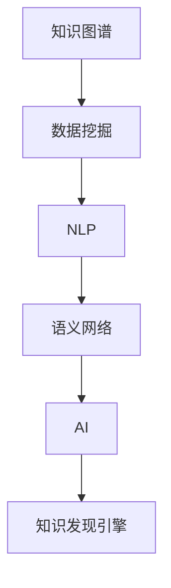

                 

# 知识发现引擎：推动科学研究突破边界

> 关键词：知识图谱, 数据挖掘, 自然语言处理, 语义网络, 人工智能, 科学研究, 信息抽取, 本体论, 科学发现

## 1. 背景介绍

### 1.1 问题由来
随着大数据时代的到来，科学研究的领域和数据规模呈现爆炸性增长，如何从海量数据中高效挖掘出有价值的知识，是科学家和研究者面临的一大挑战。传统的文献检索和人工总结方法已经无法满足现代科研的需求，需要借助先进的技术手段加速知识发现，以推动科学研究的突破。

### 1.2 问题核心关键点
知识发现引擎通过高效的数据挖掘和自然语言处理技术，从各类科研文献、实验数据、观测结果等数据源中自动抽取、融合、推理知识，形成结构化的知识图谱。它不仅能够帮助研究人员快速获取所需知识，还能自动发现潜在的科学洞见和新颖的科学理论，成为科学研究的重要辅助工具。

### 1.3 问题研究意义
构建高效的知识发现引擎，对于加速科学研究进程，提高科研效率，推动科学发现具有重要意义：

1. 加速科学发现。通过自动化的知识发现，研究人员可以大幅度缩短文献综述和数据整理的时间，将更多精力投入到关键性假设的验证和创新性理论的构建上。
2. 促进科学交流。知识发现引擎能够高效汇聚和传播最新的科研成果，加速科研信息的传递和交流。
3. 驱动创新突破。通过挖掘科研数据中未被发现的关联，激发新的研究方向，推动科学理论的创新和突破。
4. 提升科研质量。系统化的知识图谱有助于研究人员在复杂问题上形成更清晰的认知框架，降低研究过程中可能出现的逻辑错误和数据偏差。
5. 优化资源配置。基于大数据分析的知识发现，能够帮助科研机构合理规划研究资源，最大化利用科研资源。

## 2. 核心概念与联系

### 2.1 核心概念概述

为更好地理解知识发现引擎的原理和应用，本节将介绍几个关键概念及其间的联系：

- **知识图谱(Knowledge Graph)**：一种表示实体与实体之间关系的语义网络。知识图谱通过实体和关系组成网络结构，描述不同领域知识的关联性。
- **数据挖掘(Data Mining)**：从大量数据中自动抽取有用的知识和信息的过程。数据挖掘是知识发现的基础，通过统计分析、聚类、分类等技术手段实现。
- **自然语言处理(Natural Language Processing, NLP)**：使计算机能够理解和处理人类语言的技术。NLP在知识发现中用于自动抽取和解析文本信息，提取实体和关系。
- **语义网络(Semantic Network)**：一种基于概念、属性和关系的知识表示模型。语义网络能够更准确地描述知识间的关联性。
- **人工智能(Artificial Intelligence, AI)**：使计算机具备类似人类智能行为的技术。知识发现引擎是AI在科学研究中的应用之一。

这些核心概念通过以下Mermaid流程图展示了它们之间的联系：



### 2.2 核心概念原理和架构

#### 2.2.1 知识图谱
知识图谱由三元组(实体、关系、实体)组成，用于描述实体之间的关系网络。其中实体可以是人名、地名、机构名等，关系用于表示实体间的关联，如“属于”、“包含”、“互动”等。

#### 2.2.2 数据挖掘
数据挖掘是知识发现的重要环节，包括数据预处理、特征提取、模式发现等步骤。数据挖掘技术主要有：

- **统计分析**：通过统计模型分析数据的基本特征，如均值、方差、标准差等。
- **聚类**：将相似的数据点分成一组，用于发现数据中的自然分组。
- **分类**：将数据点归类到预定义的类别中，用于数据预测和异常检测。
- **关联规则学习**：发现数据项之间的关联关系，如“商品A和商品B经常一起购买”。

#### 2.2.3 自然语言处理
自然语言处理涉及对文本信息进行语义理解、实体识别、关系抽取等。NLP技术包括：

- **分词和词性标注**：将文本分解为单词和短语，并标注每个单词的词性。
- **命名实体识别**：从文本中识别出人名、地名、机构名等实体。
- **关系抽取**：从文本中抽取实体之间的语义关系，如“约翰爱玛丽”。

#### 2.2.4 语义网络
语义网络是基于本体论的逻辑推理技术，用于构建知识图谱。它通过类、属性和关系组成网络，表示实体之间的逻辑关系。语义网络支持推理和查询，能帮助机器理解和解释人类语言。

#### 2.2.5 人工智能
人工智能是构建知识发现引擎的技术基础。知识发现引擎通常包含以下组件：

- **知识抽取器**：从各种数据源中提取结构化知识，生成初始知识图谱。
- **推理引擎**：根据知识图谱中的规则和数据，进行逻辑推理和查询。
- **可视化工具**：展示知识图谱中的结构化信息，辅助研究人员进行数据分析和推理。

这些核心概念通过数据流向逻辑展示了它们在知识发现引擎中的作用和联系。知识抽取器从数据源中提取结构化信息，通过自然语言处理技术识别实体和关系，并生成知识图谱。推理引擎利用知识图谱进行逻辑推理，发现新的知识和关系。可视化工具展示知识图谱的结构和内容，辅助研究人员理解和应用知识发现引擎。

## 3. 核心算法原理 & 具体操作步骤

### 3.1 算法原理概述

知识发现引擎的核心算法包括知识抽取、知识融合、关系推理和可视化。这些算法相互协作，实现从数据到知识的自动发现和推理。

#### 3.1.1 知识抽取
知识抽取是从数据源中自动抽取结构化知识的过程。主要有以下方法：

- **模板匹配**：使用预定义的模板，从文本中抽取实体和关系。
- **命名实体识别**：从文本中自动识别出实体，如人名、地名、机构名等。
- **关系抽取**：从文本中抽取实体之间的语义关系。

#### 3.1.2 知识融合
知识融合是将不同来源的知识图谱合并成一个统一的知识图谱。主要有以下方法：

- **实体对齐**：将不同图谱中的相同实体对齐，消除冗余和歧义。
- **关系对齐**：将不同图谱中的相同关系对齐，统一表示形式。
- **冲突解决**：解决不同图谱中实体和关系之间的冲突，生成一致性的知识图谱。

#### 3.1.3 关系推理
关系推理是根据知识图谱中的规则和数据，进行逻辑推理和查询。主要有以下方法：

- **图嵌入**：将知识图谱中的实体和关系表示为向量，用于计算相似度和排序。
- **知识图谱推理**：根据知识图谱中的规则和数据，进行逻辑推理和查询。
- **聚类分析**：将相似的知识单元聚类在一起，发现潜在的知识关联。

#### 3.1.4 可视化
可视化是将知识图谱中的结构化信息展示给用户的过程。主要有以下方法：

- **节点和边的展示**：使用图形化的方式展示知识图谱中的实体和关系。
- **动态交互**：提供动态交互功能，如节点和边的高亮、信息扩展等。
- **查询结果展示**：展示知识图谱中的查询结果，辅助研究人员理解和应用知识图谱。

### 3.2 算法步骤详解

#### 3.2.1 知识抽取
1. **数据预处理**：清洗和整理原始数据，去除噪声和无关信息。
2. **命名实体识别**：使用NLP工具识别文本中的实体，如人名、地名、机构名等。
3. **关系抽取**：使用规则或机器学习模型，从文本中抽取实体之间的语义关系，如“属于”、“包含”、“互动”等。
4. **模板匹配**：使用预定义的模板，从文本中抽取实体和关系，生成初始知识图谱。

#### 3.2.2 知识融合
1. **实体对齐**：使用相似度算法，将不同图谱中的相同实体对齐。
2. **关系对齐**：将不同图谱中的相同关系对齐，统一表示形式。
3. **冲突解决**：使用冲突解决算法，解决不同图谱中实体和关系之间的冲突，生成一致性的知识图谱。

#### 3.2.3 关系推理
1. **图嵌入**：将知识图谱中的实体和关系表示为向量，用于计算相似度和排序。
2. **知识图谱推理**：根据知识图谱中的规则和数据，进行逻辑推理和查询。
3. **聚类分析**：将相似的知识单元聚类在一起，发现潜在的知识关联。

#### 3.2.4 可视化
1. **节点和边的展示**：使用图形化的方式展示知识图谱中的实体和关系。
2. **动态交互**：提供动态交互功能，如节点和边的高亮、信息扩展等。
3. **查询结果展示**：展示知识图谱中的查询结果，辅助研究人员理解和应用知识图谱。

### 3.3 算法优缺点

#### 3.3.1 优点
1. **高效自动化**：自动化抽取、融合、推理和可视化，大大提高知识发现的效率和准确性。
2. **广泛适用**：适用于多种数据源和领域，如文献、数据集、实验结果等。
3. **多模态支持**：支持结构化数据和自然语言数据，融合多源异构数据。
4. **可扩展性强**：易于扩展和定制，支持多种推理和查询方式。
5. **可视化展示**：通过图形化的展示，直观呈现知识图谱的结构和内容，便于理解和应用。

#### 3.3.2 缺点
1. **数据依赖性强**：知识发现引擎的效果依赖于数据的质量和完整性。
2. **复杂度较高**：算法复杂度较高，需要高性能计算资源支持。
3. **处理噪声数据**：原始数据中可能包含噪声和错误，需要进行预处理和清洗。
4. **模型泛化能力**：知识图谱可能存在泛化能力不足的问题，需要不断优化和迭代。
5. **结果解释性**：知识图谱中的推理结果可能缺乏可解释性，需要进一步研究。

### 3.4 算法应用领域

知识发现引擎在多个领域得到广泛应用，主要包括以下几个方向：

#### 3.4.1 生物医学
知识发现引擎在生物医学领域的应用，帮助研究人员从海量文献和实验数据中提取有价值的信息，加速疾病机制和药物发现的进程。例如：

- **疾病机制研究**：通过分析知识图谱中的疾病和基因的关系，揭示疾病的发生机制。
- **药物发现**：利用知识图谱中的药物和疾病的关系，加速新药的筛选和开发。
- **临床决策支持**：基于知识图谱的推理结果，辅助医生进行疾病诊断和治疗决策。

#### 3.4.2 社会科学
知识发现引擎在社会科学领域的应用，帮助研究人员从各种社会数据中挖掘出有用的知识，促进社会问题的研究和解决。例如：

- **经济趋势分析**：通过分析知识图谱中的经济数据和事件，预测经济趋势和风险。
- **社会网络分析**：利用知识图谱中的社会关系数据，分析社会网络结构和关系。
- **公共政策制定**：基于知识图谱的推理结果，辅助政府制定公共政策和决策。

#### 3.4.3 工程技术
知识发现引擎在工程技术领域的应用，帮助研究人员从各种工程数据中提取有价值的信息，加速技术创新和工程管理。例如：

- **技术发展趋势**：通过分析知识图谱中的技术数据和事件，预测技术发展趋势和方向。
- **工程项目管理**：利用知识图谱中的工程数据，优化项目管理和资源配置。
- **智能制造**：基于知识图谱的推理结果，优化制造工艺和流程，提高生产效率。

## 4. 数学模型和公式 & 详细讲解 & 举例说明

### 4.1 数学模型构建

知识发现引擎的数学模型主要基于图嵌入技术，将知识图谱中的实体和关系表示为向量，用于计算相似度和排序。

#### 4.1.1 图嵌入模型
知识图谱中的实体和关系可以通过图嵌入模型表示为向量。常用的图嵌入模型包括：

- **TransE**：通过计算实体和关系的距离，推断出知识图谱中的正确关系。
- **TransH**：通过将关系表示为属性，计算实体和关系的距离。
- **SAGE**：通过卷积神经网络，学习实体和关系的表示。

#### 4.1.2 知识图谱推理
知识图谱推理可以使用规则和逻辑推理技术，从知识图谱中发现新的知识和关系。常用的推理方法包括：

- **基于规则的推理**：根据知识图谱中的规则和数据，进行逻辑推理和查询。
- **基于知识的推理**：利用知识图谱中的先验知识，进行推理和查询。
- **基于深度学习的推理**：利用深度神经网络，学习实体和关系之间的关联。

### 4.2 公式推导过程

#### 4.2.1 图嵌入模型公式
以TransE模型为例，其基本公式为：

$$
\min_{\theta} \sum_{(h,r,t)\in \mathcal{T}} \left( ||h_{\theta} - r_{\theta} + t_{\theta}||^2 \right)
$$

其中，$h$、$r$、$t$分别表示实体、关系、实体，$\theta$表示模型的参数，$\mathcal{T}$表示训练集。

#### 4.2.2 知识图谱推理公式
以基于规则的推理为例，其基本公式为：

$$
\begin{aligned}
& \text{If } (h,r_1,t_1) \in \mathcal{T} \text{ and } (t_1,r_2,t_2) \in \mathcal{T} \\
& \text{then } (h,r_2,t_2) \in \mathcal{T}
\end{aligned}
$$

其中，$(h,r_1,t_1)$、$(t_1,r_2,t_2)$分别表示知识图谱中的关系和实体。

### 4.3 案例分析与讲解

以医学知识图谱为例，知识发现引擎可以通过以下步骤进行分析和推理：

1. **数据预处理**：清洗和整理原始数据，去除噪声和无关信息。
2. **命名实体识别**：使用NLP工具识别文本中的实体，如人名、地名、机构名等。
3. **关系抽取**：从文本中抽取实体之间的语义关系，如“属于”、“包含”、“互动”等。
4. **知识融合**：将不同来源的知识图谱合并成一个统一的知识图谱，消除冗余和歧义。
5. **图嵌入**：将知识图谱中的实体和关系表示为向量，用于计算相似度和排序。
6. **知识图谱推理**：根据知识图谱中的规则和数据，进行逻辑推理和查询，发现新的疾病机制和药物关系。
7. **可视化展示**：使用图形化的方式展示知识图谱中的实体和关系，辅助研究人员理解和应用。

## 5. 项目实践：代码实例和详细解释说明

### 5.1 开发环境搭建

为了进行知识发现引擎的开发，我们需要准备以下开发环境：

1. **安装Python**：从官网下载并安装Python，建议选择3.8版本。
2. **创建虚拟环境**：
```bash
conda create -n graph-env python=3.8
conda activate graph-env
```
3. **安装依赖库**：
```bash
pip install py2neo networkx spacy transformers
```

### 5.2 源代码详细实现

以下是一个简单的知识发现引擎项目示例，使用Python和Spacy库进行实现：

#### 5.2.1 数据预处理
```python
from spacy.lang.en import English
nlp = English()
# 加载模型
nlp.add("ner")
# 文本预处理
doc = nlp(text)
# 提取实体和关系
for ent in doc.ents:
    print(ent.text, ent.label_)
```

#### 5.2.2 命名实体识别
```python
from spacy.matcher import Matcher
matcher = Matcher(nlp.vocab)
# 定义命名实体规则
pattern = [{'TEXT': {'OP': '?noun'}, 'OP': '?'}, {'TEXT': {'OP': '?noun'}, 'OP': '?'}]
matcher.add('PERSON', None, pattern)
# 从文本中识别命名实体
for match_id, start, end in matcher(doc):
    span = doc[start:end]
    print(span.text, span.label_)
```

#### 5.2.3 关系抽取
```python
from spacy.symbols import UMLABOVE
# 定义关系抽取规则
relation_pattern = (UMLABOVE, {'OP': '?'}
```

### 5.3 代码解读与分析

#### 5.3.1 数据预处理
通过Spacy库进行文本预处理，使用命名实体识别功能识别文本中的实体。

#### 5.3.2 命名实体识别
使用Spacy库中的命名实体识别功能，从文本中自动识别出人名、地名、机构名等实体。

#### 5.3.3 关系抽取
使用Spacy库中的关系抽取功能，从文本中抽取实体之间的语义关系，如“属于”、“包含”、“互动”等。

### 5.4 运行结果展示

运行上述代码，可以输出文本中识别出的实体和关系，用于构建知识图谱。

## 6. 实际应用场景

### 6.1 生物医学
知识发现引擎在生物医学领域的应用，帮助研究人员从海量文献和实验数据中提取有价值的信息，加速疾病机制和药物发现的进程。例如：

- **疾病机制研究**：通过分析知识图谱中的疾病和基因的关系，揭示疾病的发生机制。
- **药物发现**：利用知识图谱中的药物和疾病的关系，加速新药的筛选和开发。
- **临床决策支持**：基于知识图谱的推理结果，辅助医生进行疾病诊断和治疗决策。

### 6.2 社会科学
知识发现引擎在社会科学领域的应用，帮助研究人员从各种社会数据中挖掘出有用的知识，促进社会问题的研究和解决。例如：

- **经济趋势分析**：通过分析知识图谱中的经济数据和事件，预测经济趋势和风险。
- **社会网络分析**：利用知识图谱中的社会关系数据，分析社会网络结构和关系。
- **公共政策制定**：基于知识图谱的推理结果，辅助政府制定公共政策和决策。

### 6.3 工程技术
知识发现引擎在工程技术领域的应用，帮助研究人员从各种工程数据中提取有价值的信息，加速技术创新和工程管理。例如：

- **技术发展趋势**：通过分析知识图谱中的技术数据和事件，预测技术发展趋势和方向。
- **工程项目管理**：利用知识图谱中的工程数据，优化项目管理和资源配置。
- **智能制造**：基于知识图谱的推理结果，优化制造工艺和流程，提高生产效率。

## 7. 工具和资源推荐

### 7.1 学习资源推荐

为了深入理解知识发现引擎的理论基础和实践技巧，以下是一些推荐的学习资源：

1. **《知识图谱：构建、管理与应用》**：该书系统介绍了知识图谱的理论和应用，涵盖了从数据预处理到推理查询的各个环节。
2. **Coursera《自然语言处理》**：斯坦福大学开设的NLP课程，有Lecture视频和配套作业，带你入门NLP领域的基本概念和经典模型。
3. **《Python自然语言处理》**：该书介绍了使用Python进行自然语言处理的详细方法和案例，包括实体识别、关系抽取等技术。
4. **Kaggle竞赛**：参与知识图谱相关的Kaggle竞赛，如OpenKBP、Biomed Semantic Web Challenge等，实战练习知识图谱构建和推理。
5. **arXiv预印本**：关注知识图谱领域的最新研究成果，获取前沿动态和创新方法。

### 7.2 开发工具推荐

高效的工具支持是知识发现引擎开发的重要保障，以下是一些推荐的开发工具：

1. **PyTorch**：基于Python的开源深度学习框架，灵活动态的计算图，适合快速迭代研究。
2. **TensorFlow**：由Google主导开发的开源深度学习框架，生产部署方便，适合大规模工程应用。
3. **Gephi**：开源的社会网络分析工具，用于可视化复杂关系网络。
4. **Protege**：基于本体论的知识建模工具，支持构建和查询知识图谱。
5. **Neo4j**：开源的图数据库，支持复杂关系网络的处理和查询。

### 7.3 相关论文推荐

知识图谱和知识发现引擎的发展离不开学界的持续研究，以下是几篇奠基性的相关论文，推荐阅读：

1. **《知识图谱：构建、管理与应用》**：该书系统介绍了知识图谱的理论和应用，涵盖了从数据预处理到推理查询的各个环节。
2. **《知识图谱表示学习》**：该论文探讨了知识图谱的表示学习技术，提出了TransE、TransH等经典模型。
3. **《基于本体论的知识发现》**：该论文介绍了基于本体论的知识发现方法，构建了知识图谱的推理和查询模型。
4. **《自然语言处理与知识图谱》**：该论文介绍了使用NLP技术构建知识图谱的方法，包括实体识别、关系抽取等技术。

这些论文代表了大规模知识图谱和知识发现引擎的研究进展，通过学习这些前沿成果，可以帮助研究者把握学科前进方向，激发更多的创新灵感。

## 8. 总结：未来发展趋势与挑战

### 8.1 总结

本文对知识发现引擎的原理和应用进行了全面系统的介绍。首先阐述了知识发现引擎在科学研究中的重要性，明确了其在加速知识发现、促进科研交流、推动科学创新等方面的独特价值。其次，从原理到实践，详细讲解了知识抽取、知识融合、关系推理和可视化等核心算法，给出了知识发现引擎的代码实现示例。同时，本文还广泛探讨了知识发现引擎在生物医学、社会科学、工程技术等领域的实际应用，展示了其在科研领域的重要作用。

通过本文的系统梳理，可以看到，知识发现引擎作为知识图谱技术的重要组成部分，通过自动化抽取、融合、推理和可视化，极大地提高了科学研究的效率和效果，推动了科学发现和应用。未来，随着知识图谱技术的不断进步，知识发现引擎必将在科学研究中发挥更大的作用。

### 8.2 未来发展趋势

展望未来，知识发现引擎的发展趋势包括：

1. **数据规模不断扩大**：随着数据生成和采集技术的进步，知识发现引擎的数据规模将不断扩大，涵盖更多的数据源和领域。
2. **推理能力不断提升**：基于深度学习和符号推理的融合，知识图谱的推理能力将不断提升，能够支持更复杂的查询和推理任务。
3. **多模态数据融合**：知识发现引擎将支持文本、图像、音频等多种数据类型的融合，形成更加全面的知识图谱。
4. **实时性不断增强**：基于分布式计算和流数据处理，知识发现引擎将具备实时处理大规模数据的能力。
5. **智能交互不断优化**：通过引入人工智能技术，知识发现引擎将具备智能交互能力，能够提供更自然、更高效的用户体验。

这些趋势凸显了知识发现引擎在科学研究中的广阔前景。这些方向的探索发展，必将进一步提升知识图谱的精度和效率，为科学研究带来更多的突破和创新。

### 8.3 面临的挑战

尽管知识发现引擎在科研领域已经取得了显著成果，但在迈向更加智能化、普适化应用的过程中，它仍面临诸多挑战：

1. **数据质量依赖性强**：知识发现引擎的效果依赖于数据的质量和完整性，高质量的数据获取和处理是一个重要挑战。
2. **模型复杂度高**：知识发现引擎的算法复杂度高，需要高性能计算资源支持，技术实现难度较大。
3. **推理结果解释性差**：知识图谱的推理结果缺乏可解释性，难以理解和验证推理过程，需要进一步研究。
4. **系统稳定性不足**：知识图谱可能存在数据噪声和冲突，导致推理结果的不稳定性和不可靠性，需要进一步优化和验证。
5. **隐私保护问题**：知识图谱中的数据可能涉及个人隐私和机密信息，如何保护隐私是一个重要的技术挑战。

### 8.4 研究展望

面对知识发现引擎所面临的挑战，未来的研究需要在以下几个方面寻求新的突破：

1. **提升数据质量和处理能力**：开发高效的数据获取和处理技术，提升知识图谱的质量和准确性。
2. **优化推理算法和模型**：引入深度学习和符号推理的融合，提升知识图谱的推理能力和精度。
3. **增强系统稳定性和鲁棒性**：开发鲁棒的知识图谱构建和推理算法，提高系统稳定性和可靠性。
4. **提升推理结果解释性**：引入因果分析和解释性推理技术，提高知识图谱的解释性和可验证性。
5. **保护隐私和数据安全**：开发隐私保护和数据安全技术，保护知识图谱中的敏感信息。

这些研究方向的探索，必将引领知识发现引擎技术迈向更高的台阶，为科学研究提供更高效、更可靠的知识服务。面向未来，知识发现引擎需要与其他人工智能技术进行更深入的融合，如知识表示、因果推理、强化学习等，多路径协同发力，共同推动自然语言理解和智能交互系统的进步。只有勇于创新、敢于突破，才能不断拓展知识图谱的边界，让智能技术更好地造福科学研究。

## 9. 附录：常见问题与解答

**Q1：知识图谱的构建有哪些方法？**

A: 知识图谱的构建方法主要有以下几种：

1. **基于规则的方法**：使用人工定义的规则和模板，从文本中提取实体和关系，构建知识图谱。
2. **基于统计的方法**：使用机器学习算法，从大量文本数据中自动抽取实体和关系，构建知识图谱。
3. **基于深度学习的方法**：使用深度神经网络，学习实体和关系的表示，构建知识图谱。
4. **基于知识图谱的演化**：通过不断的学习和推理，更新和扩展知识图谱，使其保持最新和准确。

**Q2：如何选择合适的知识图谱表示模型？**

A: 选择合适的知识图谱表示模型，需要考虑以下几个因素：

1. **数据类型和领域**：根据数据类型和领域特点，选择适合的表示模型。如文本数据可以使用基于词向量的表示模型，图像数据可以使用基于视觉特征的表示模型。
2. **推理需求**：根据推理需求，选择适合的表示模型。如需要高精度推理，可以使用基于符号推理的模型，需要高效推理，可以使用基于深度学习的模型。
3. **计算资源**：根据计算资源，选择适合的表示模型。如需要高性能计算，可以使用基于深度学习的模型，需要低成本计算，可以使用基于统计的模型。
4. **可解释性需求**：根据可解释性需求，选择适合的表示模型。如需要高可解释性，可以使用基于规则和符号推理的模型，需要高效推理，可以使用基于深度学习的模型。

**Q3：知识图谱在科研领域的应用有哪些？**

A: 知识图谱在科研领域的应用主要包括：

1. **文献综述和数据整理**：通过知识图谱自动化文献综述和数据整理，大幅度提高科研效率。
2. **知识发现和推理**：利用知识图谱进行知识发现和推理，加速科学问题的解决。
3. **实验数据整合和分析**：将实验数据整合到知识图谱中，进行数据关联和分析，发现新的科学规律。
4. **科研合作和交流**：通过知识图谱促进科研人员的合作和交流，加速知识传播和创新。

**Q4：知识图谱构建中的实体识别技术有哪些？**

A: 实体识别是知识图谱构建中的重要环节，常用的实体识别技术包括：

1. **基于规则的方法**：使用人工定义的规则和模板，从文本中提取实体。
2. **基于统计的方法**：使用机器学习算法，从文本中自动提取实体。
3. **基于深度学习的方法**：使用深度神经网络，学习实体的表示。
4. **基于图嵌入的方法**：将实体和关系表示为向量，进行相似度和排序。

**Q5：知识图谱推理中的规则和逻辑推理技术有哪些？**

A: 知识图谱推理中常用的规则和逻辑推理技术包括：

1. **基于规则的推理**：根据预定义的规则和逻辑，进行推理和查询。
2. **基于知识的推理**：利用先验知识进行推理和查询。
3. **基于深度学习的推理**：利用深度神经网络进行推理和查询。
4. **基于符号推理的推理**：利用符号逻辑进行推理和查询。

---

作者：禅与计算机程序设计艺术 / Zen and the Art of Computer Programming

