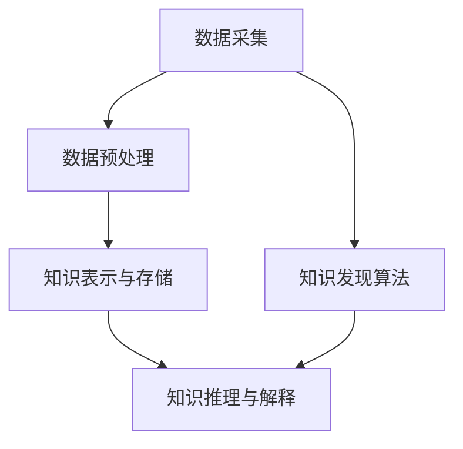

                 

# 知识发现引擎：知识与洞察力的完美结合体

> 关键词：知识发现引擎,知识图谱,语义网,数据挖掘,数据融合,深度学习,推理引擎

## 1. 背景介绍

### 1.1 问题由来

在数字化时代，数据已经成为了推动社会进步和经济发展的关键资源。然而，数据本身并不能直接产生价值，只有通过对数据的分析和挖掘，才能揭示出隐藏的规律和知识，为决策提供支持。因此，知识发现引擎（Knowledge Discovery Engine, KDE）应运而生，通过大数据技术、人工智能算法等手段，从海量的数据中自动发现和提取有价值的信息和知识。

知识发现引擎的核心理念是将数据转化为知识，再通过对知识的分析和应用，提升决策的效率和精准度。这一过程不仅需要强大的数据处理能力，还需要结合领域知识和人类智慧，形成一个集数据、技术和业务于一体的复杂系统。

### 1.2 问题核心关键点

知识发现引擎的构建，涉及数据收集、数据预处理、知识表示与存储、知识发现算法、知识推理与解释等多个环节。这些环节相互依赖、相互影响，共同构成了一个完整的知识发现流程。

核心关键点包括：

- 数据采集：如何高效、准确地收集不同来源的数据，并将其转化为可处理的格式。
- 数据预处理：对采集到的数据进行清洗、去重、归一化等预处理，确保数据质量和一致性。
- 知识表示与存储：选择合适的知识表示方法（如本体论、语义网、图谱等），将知识结构化地存储，方便后续的检索和应用。
- 知识发现算法：运用各种数据挖掘算法（如关联规则、分类聚类、时序分析等），从数据中自动发现和提取知识模式。
- 知识推理与解释：构建知识推理引擎，支持知识推理和应用场景的动态模拟，并将发现的知识转换为可解释的形式，辅助人类理解和使用。

### 1.3 问题研究意义

知识发现引擎的构建，对于提升企业的数据利用效率、推动科学研究的深入、促进社会治理的智能化具有重要意义：

1. 提升数据利用效率：通过知识发现引擎，企业能够从海量数据中提取有用信息，减少数据挖掘成本，提高决策的准确性和效率。
2. 推动科学研究：知识发现引擎能够自动发现科研中的新现象和规律，加速科学知识的积累和传播，促进科学研究的深入发展。
3. 促进社会治理：通过知识发现引擎，政府能够掌握社会发展的动态，优化政策制定，提升社会治理的智能化水平。

## 2. 核心概念与联系

### 2.1 核心概念概述

知识发现引擎的构建涉及多个核心概念，包括：

- 数据采集：通过爬虫、API、传感器等手段，从不同的数据源（如社交网络、物联网、电子文档等）收集数据。
- 数据预处理：对采集到的数据进行清洗、去重、归一化等预处理，确保数据质量和一致性。
- 知识表示与存储：选择合适的知识表示方法（如本体论、语义网、图谱等），将知识结构化地存储，方便后续的检索和应用。
- 知识发现算法：运用各种数据挖掘算法（如关联规则、分类聚类、时序分析等），从数据中自动发现和提取知识模式。
- 知识推理与解释：构建知识推理引擎，支持知识推理和应用场景的动态模拟，并将发现的知识转换为可解释的形式，辅助人类理解和使用。

这些核心概念之间的逻辑关系可以通过以下Mermaid流程图来展示：



这个流程图展示了知识发现引擎的核心概念及其之间的关系：

1. 数据采集与预处理为后续的知识发现提供了基础数据。
2. 知识表示与存储为知识的结构化存储和查询提供了支持。
3. 知识发现算法从数据中自动发现知识模式。
4. 知识推理与解释将发现的知识进行推理和应用，并转化为可解释的形式。

## 3. 核心算法原理 & 具体操作步骤
### 3.1 算法原理概述

知识发现引擎的核心算法原理基于数据挖掘和人工智能技术，主要包括数据预处理、知识表示与存储、知识发现算法和知识推理与解释四个部分。

### 3.2 算法步骤详解

**Step 1: 数据采集与预处理**

1. 数据采集：通过爬虫、API、传感器等手段，从不同的数据源（如社交网络、物联网、电子文档等）收集数据。
2. 数据清洗：对采集到的数据进行去重、去噪、格式化等处理，确保数据的质量和一致性。
3. 数据整合：将来自不同源的数据整合到一起，构建统一的数据库，便于后续分析。

**Step 2: 知识表示与存储**

1. 选择知识表示方法：根据应用场景选择合适的知识表示方法，如本体论、语义网、图谱等。
2. 构建知识图谱：将数据转化为知识图谱的形式，构建节点和边，表示实体和关系。
3. 存储与管理：选择合适的存储方式，如关系型数据库、图形数据库等，对知识图谱进行存储和管理。

**Step 3: 知识发现算法**

1. 选择算法：根据数据类型和应用需求，选择合适的知识发现算法，如关联规则、分类聚类、时序分析等。
2. 数据挖掘：运用选定的算法对数据进行挖掘，自动发现和提取知识模式。
3. 知识评估：对挖掘出的知识进行评估，确定其有效性和可靠性。

**Step 4: 知识推理与解释**

1. 构建推理引擎：根据知识图谱，构建知识推理引擎，支持知识推理和应用场景的动态模拟。
2. 知识推理：运用推理引擎对知识图谱进行推理，发现新的知识模式和规律。
3. 结果解释：将推理出的知识转换为可解释的形式，辅助人类理解和使用。

### 3.3 算法优缺点

知识发现引擎具有以下优点：

1. 自动化程度高：通过自动化流程，能够高效、准确地发现和提取知识，减少了人工干预的复杂性。
2. 适用性强：适用于各种数据类型和应用场景，能够处理结构化、半结构化、非结构化等多种形式的数据。
3. 可扩展性好：能够随着数据规模和业务需求的变化进行动态扩展，适应性较强。

同时，知识发现引擎也存在一些局限性：

1. 数据质量要求高：数据采集和预处理需要确保数据的准确性和一致性，否则会影响结果的可靠性。
2. 算法复杂度高：知识发现算法的复杂度较高，对计算资源和算法调优要求较高。
3. 结果解释困难：部分知识发现算法的结果可能难以解释，需要结合领域知识和人工审核。

### 3.4 算法应用领域

知识发现引擎在多个领域得到了广泛应用，包括：

- 商业智能：通过分析企业内部的销售数据、客户数据等，发现业务规律，提升销售和营销决策的精准度。
- 金融风险管理：利用金融数据，发现潜在的风险因素，进行风险评估和预警，提升金融服务的稳健性。
- 医疗健康：从医疗数据中提取有用的信息，支持疾病的诊断和治疗，提高医疗服务的智能化水平。
- 环境监测：通过采集和分析环境数据，发现环境变化的趋势和规律，支持环境治理和保护。
- 智能制造：从制造数据中提取知识，支持生产过程的优化和自动化，提升制造业的智能化水平。

## 4. 数学模型和公式 & 详细讲解 & 举例说明

### 4.1 数学模型构建

知识发现引擎的数学模型主要基于统计学和机器学习的理论。以关联规则为例，其数学模型可以表示为：

$$
A \rightarrow B \quad (support > \alpha, confidence > \beta)
$$

其中，$A$ 和 $B$ 分别表示两个关联的项，$support$ 表示 $A$ 和 $B$ 同时出现的频率，$\alpha$ 和 $\beta$ 分别为支持度和置信度阈值。

### 4.2 公式推导过程

以关联规则的计算公式为例，推导过程如下：

1. 首先，根据支持度阈值 $\alpha$，计算 $A$ 和 $B$ 同时出现的频率，即 $support(A \cap B)$。
2. 然后，根据置信度阈值 $\beta$，计算 $A$ 出现时 $B$ 出现的频率，即 $confidence(A \rightarrow B)$。
3. 最后，将满足 $support(A \cap B) > \alpha$ 和 $confidence(A \rightarrow B) > \beta$ 的规则作为最终结果。

### 4.3 案例分析与讲解

以电商网站的用户行为分析为例，可以构建如下关联规则：

- 规则 1：当用户浏览了 A 商品，并且点击了 B 商品，则用户最终购买 C 商品的概率为 70%。
- 规则 2：当用户浏览了 D 商品，并且点击了 E 商品，则用户最终购买 F 商品的概率为 80%。

这些规则可以帮助电商网站优化推荐策略，提高用户的购买转化率。

## 5. 项目实践：代码实例和详细解释说明
### 5.1 开发环境搭建

在进行知识发现引擎的开发前，我们需要准备好开发环境。以下是使用Python进行PyTorch开发的环境配置流程：

1. 安装Anaconda：从官网下载并安装Anaconda，用于创建独立的Python环境。

2. 创建并激活虚拟环境：
```bash
conda create -n pytorch-env python=3.8 
conda activate pytorch-env
```

3. 安装PyTorch：根据CUDA版本，从官网获取对应的安装命令。例如：
```bash
conda install pytorch torchvision torchaudio cudatoolkit=11.1 -c pytorch -c conda-forge
```

4. 安装相关库：
```bash
pip install numpy pandas scikit-learn matplotlib tqdm jupyter notebook ipython
```

完成上述步骤后，即可在`pytorch-env`环境中开始知识发现引擎的开发。

### 5.2 源代码详细实现

下面以用户行为分析为例，给出使用PyTorch进行知识发现引擎的代码实现。

首先，定义用户行为数据的处理函数：

```python
import pandas as pd
from sklearn.model_selection import train_test_split

def process_data(data_path):
    # 读取数据文件
    df = pd.read_csv(data_path)
    
    # 数据清洗和处理
    df = df.drop_duplicates()
    df = df.dropna()
    df = df.drop('user_id', axis=1)
    
    # 特征工程
    df['browsed'] = df['browsed'].str.split(',').apply(lambda x: 1 if len(x) > 0 else 0)
    df['clicked'] = df['clicked'].str.split(',').apply(lambda x: 1 if len(x) > 0 else 0)
    df['purchased'] = df['purchased'].str.split(',').apply(lambda x: 1 if len(x) > 0 else 0)
    
    # 数据划分
    train_df, test_df = train_test_split(df, test_size=0.2, random_state=42)
    return train_df, test_df
```

然后，定义关联规则的挖掘函数：

```python
from apriori import apriori
from mlxtend.frequent_patterns import association_rules

def mine_association_rules(train_df):
    # 计算项集
    items = train_df[['browsed', 'clicked']].groupby(['user_id'], as_index=False).count().values.tolist()
    
    # 计算关联规则
    frequent_itemsets = apriori(items, min_support=0.01, use_colnames=True)
    rules = association_rules(frequent_itemsets, metric="lift", min_threshold=1)
    
    # 筛选规则
    rules = rules[rules['confidence'] > 0.5]
    
    return rules
```

最后，将上述函数封装成知识发现引擎模块，并测试其效果：

```python
from knowledge_discovery import mine_association_rules

# 数据预处理
train_df, test_df = process_data('user_behavior.csv')

# 关联规则挖掘
rules = mine_association_rules(train_df)

# 结果展示
print(rules)
```

以上就是使用PyTorch进行用户行为分析的完整代码实现。可以看到，通过数据清洗、特征工程、关联规则挖掘等步骤，能够从用户行为数据中提取有用的信息，并发现关联规则。

### 5.3 代码解读与分析

让我们再详细解读一下关键代码的实现细节：

**process_data函数**：
- `read_csv`方法：读取CSV格式的数据文件。
- `drop_duplicates`方法：去除重复数据。
- `dropna`方法：去除包含缺失值的数据行。
- `drop`方法：删除不需要的特征列。
- `str.split`方法：将字符串按逗号分割，转换为布尔类型。
- `groupby`方法：按用户ID分组，计算浏览和点击的频次。
- `count`方法：计算每个用户ID的浏览和点击次数。
- `tolist`方法：将计算结果转换为列表。

**mine_association_rules函数**：
- `apriori`方法：计算关联规则，需要指定最小支持度。
- `association_rules`方法：根据计算出的频繁项集，生成关联规则，需要指定度量方式和置信度阈值。
- `rules[rules['confidence'] > 0.5]`：筛选出置信度大于0.5的关联规则。

**知识发现引擎模块**：
- 将数据预处理和关联规则挖掘封装为独立的函数，方便复用。
- 通过模块化设计，能够提高代码的可维护性和可扩展性。

## 6. 实际应用场景
### 6.1 商业智能

知识发现引擎在商业智能（Business Intelligence, BI）领域有广泛应用。通过分析企业内部的销售数据、客户数据等，发现业务规律，提升销售和营销决策的精准度。

在技术实现上，可以收集企业内部的交易记录、用户行为数据、市场调研数据等，使用知识发现引擎进行数据挖掘，发现关联规则、时序规律、聚类等知识模式。这些知识可以用于客户细分、销售预测、渠道优化等方面，帮助企业制定更科学的决策。

### 6.2 金融风险管理

金融机构需要实时监测市场风险，及时应对潜在风险。通过知识发现引擎，利用金融数据，发现潜在的风险因素，进行风险评估和预警，提升金融服务的稳健性。

在技术实现上，可以收集金融市场数据、客户交易数据、信用评分数据等，构建知识图谱，使用知识发现引擎进行关联规则、分类聚类等数据分析，发现风险因素和模式。这些知识可以用于信用评估、风险预警、投资策略优化等方面，帮助金融机构降低风险，提高运营效率。

### 6.3 医疗健康

知识发现引擎在医疗健康领域也有重要应用。从医疗数据中提取有用的信息，支持疾病的诊断和治疗，提高医疗服务的智能化水平。

在技术实现上，可以收集医疗记录、实验室数据、影像数据等，构建知识图谱，使用知识发现引擎进行关联规则、分类聚类等数据分析，发现疾病模式和规律。这些知识可以用于疾病预测、治疗方案推荐、药物研发等方面，帮助医生提高诊断和治疗效果，提升医疗服务的智能化水平。

### 6.4 环境监测

通过知识发现引擎，采集和分析环境数据，发现环境变化的趋势和规律，支持环境治理和保护。

在技术实现上，可以收集气象数据、水质数据、空气质量数据等，构建知识图谱，使用知识发现引擎进行关联规则、分类聚类等数据分析，发现环境变化的规律。这些知识可以用于污染源监测、环境预警、生态保护等方面，帮助政府和环保机构制定更科学的环境政策，保护生态环境。

### 6.5 智能制造

知识发现引擎在智能制造领域也有广泛应用。从制造数据中提取知识，支持生产过程的优化和自动化，提升制造业的智能化水平。

在技术实现上，可以收集生产数据、设备数据、工人数据等，构建知识图谱，使用知识发现引擎进行关联规则、分类聚类等数据分析，发现生产过程的规律。这些知识可以用于生产过程优化、设备故障预测、质量控制等方面，帮助制造企业提高生产效率，降低生产成本。

## 7. 工具和资源推荐
### 7.1 学习资源推荐

为了帮助开发者系统掌握知识发现引擎的理论基础和实践技巧，这里推荐一些优质的学习资源：

1. 《大数据科学与工程》系列书籍：深入浅出地介绍了大数据技术的基本概念和应用方法，适合初学者入门。
2. 《机器学习实战》系列书籍：介绍了机器学习的基本算法和实现技巧，提供了丰富的代码示例，适合实践学习。
3. 《知识图谱：概念、技术与应用》书籍：系统介绍了知识图谱的基本概念、构建方法与应用场景，适合深入学习。
4. 《数据挖掘导论》课程：由斯坦福大学开设的知名课程，讲解了数据挖掘的基本方法与算法，适合进阶学习。
5. 《深度学习入门》课程：由DeepLearning.ai开设的深度学习入门课程，讲解了深度学习的基本框架与实现方法，适合全面学习。

通过对这些资源的学习实践，相信你一定能够快速掌握知识发现引擎的精髓，并用于解决实际的NLP问题。

### 7.2 开发工具推荐

高效的开发离不开优秀的工具支持。以下是几款用于知识发现引擎开发的常用工具：

1. Python：基于Python的开源编程语言，拥有丰富的第三方库和框架，适合数据分析与机器学习开发。
2. PyTorch：基于Python的深度学习框架，灵活动态的计算图，适合快速迭代研究。
3. Scikit-learn：基于Python的数据挖掘和机器学习库，提供了丰富的算法和工具，适合快速实现数据挖掘任务。
4. Pandas：基于Python的数据处理库，支持数据清洗、数据整合等预处理操作，适合处理复杂数据集。
5. TensorBoard：TensorFlow配套的可视化工具，可实时监测模型训练状态，提供丰富的图表呈现方式，适合调试模型。
6. Weights & Biases：模型训练的实验跟踪工具，可以记录和可视化模型训练过程中的各项指标，适合对比和调优。

合理利用这些工具，可以显著提升知识发现引擎的开发效率，加快创新迭代的步伐。

### 7.3 相关论文推荐

知识发现引擎的研究源于学界的持续研究。以下是几篇奠基性的相关论文，推荐阅读：

1. 《The Knowledge Discovery Process》（Fayyad等，1996）：系统介绍了知识发现的基本过程与方法，奠定了知识发现的理论基础。
2. 《A Knowledge Discovery Process》（Wang等，1996）：提出了一种基于规则的知识发现方法，展示了知识发现的实际应用。
3. 《Knowledge Discovery in Databases: An Introduction》（Wang等，2003）：介绍了知识发现的各个环节与方法，提供了丰富的案例分析。
4. 《Principles of Knowledge Discovery in Databases》（Fayyad等，2014）：系统介绍了知识发现的过程与方法，提供了丰富的应用案例。
5. 《Knowledge Discovery in Biological Databases》（Sanjay等，2015）：介绍了知识发现引擎在生物信息学领域的应用，展示了其在生命科学研究中的应用潜力。

这些论文代表了大数据和知识发现的最新研究进展，通过学习这些前沿成果，可以帮助研究者把握学科前进方向，激发更多的创新灵感。

## 8. 总结：未来发展趋势与挑战

### 8.1 总结

本文对知识发现引擎进行了全面系统的介绍。首先阐述了知识发现引擎的核心理念和研究背景，明确了其对于提升数据利用效率、推动科学研究的深入、促进社会治理智能化的重要意义。其次，从原理到实践，详细讲解了知识发现引擎的构建过程和关键步骤，给出了知识发现引擎的代码实现。同时，本文还探讨了知识发现引擎在多个领域的应用场景，展示了其广泛的适用性和潜在的价值。

通过本文的系统梳理，可以看到，知识发现引擎是一个集数据、技术、业务于一体的复杂系统，其构建涉及多个环节和多种技术。尽管面临一定的挑战，但随着技术的不断进步和应用场景的不断扩展，知识发现引擎必将在更多领域发挥重要作用，推动数据的深入挖掘和知识的应用。

### 8.2 未来发展趋势

展望未来，知识发现引擎将呈现以下几个发展趋势：

1. 数据源多样化：知识发现引擎将从单一的数据源拓展到多源数据融合，支持数据的多样化和异构化。
2. 数据质量提升：通过数据清洗、数据增强等技术手段，提升数据质量，确保知识发现的准确性和可靠性。
3. 知识图谱化：通过构建知识图谱，将数据转化为结构化的知识表示，支持更加高效的查询和推理。
4. 算法自动化：通过自动化调参、自动化模型选择等技术手段，提升知识发现的效率和效果。
5. 跨领域应用：通过跨领域知识图谱的构建，支持不同领域之间的知识融合和协同，拓展知识发现的应用范围。
6. 交互式应用：通过自然语言接口，支持用户与知识发现引擎的交互式查询和推理，提升用户体验。

以上趋势凸显了知识发现引擎的广阔前景。这些方向的探索发展，必将进一步提升数据利用效率、推动科学研究的深入、促进社会治理的智能化，为人类社会带来更深刻的变革。

### 8.3 面临的挑战

尽管知识发现引擎已经取得了一定的进展，但在迈向更加智能化、普适化应用的过程中，仍面临诸多挑战：

1. 数据获取难度大：高质量的数据采集和清洗需要大量的时间和资源投入，部分领域的数据获取难度较大。
2. 算法复杂度高：知识发现算法的复杂度较高，对计算资源和算法调优要求较高。
3. 结果解释困难：部分知识发现算法的结果可能难以解释，需要结合领域知识和人工审核。
4. 知识图谱构建复杂：知识图谱的构建需要专业知识，部分领域的知识图谱构建难度较大。
5. 跨领域知识整合困难：不同领域之间的知识图谱难以融合，跨领域知识融合的效果有待提升。

面对这些挑战，未来的研究需要在以下几个方面寻求新的突破：

1. 探索自动化数据获取和预处理技术，提升数据采集和清洗的效率。
2. 研究高效的知识表示与存储方法，提升知识图谱的构建效率和质量。
3. 开发更智能的知识发现算法，提升知识发现的效果和可解释性。
4. 引入跨领域知识融合技术，提升知识图谱的跨领域整合能力。
5. 开发交互式知识发现工具，提升用户与知识发现引擎的交互体验。

只有通过不断创新和优化，才能克服知识发现引擎面临的挑战，推动其向更广阔的应用场景拓展。

### 8.4 研究展望

面对知识发现引擎的挑战，未来的研究需要在以下几个方面寻求新的突破：

1. 探索自动化数据获取和预处理技术，提升数据采集和清洗的效率。
2. 研究高效的知识表示与存储方法，提升知识图谱的构建效率和质量。
3. 开发更智能的知识发现算法，提升知识发现的效果和可解释性。
4. 引入跨领域知识融合技术，提升知识图谱的跨领域整合能力。
5. 开发交互式知识发现工具，提升用户与知识发现引擎的交互体验。

这些研究方向的探索，必将引领知识发现引擎走向更高的台阶，为构建智能化的知识发现系统铺平道路。面向未来，知识发现引擎的研究还需要与其他人工智能技术进行更深入的融合，如自然语言处理、机器学习、计算机视觉等，多路径协同发力，共同推动知识发现技术的进步。只有勇于创新、敢于突破，才能不断拓展知识发现引擎的边界，让人类社会的数据利用更加高效、智能。

## 9. 附录：常见问题与解答

**Q1：知识发现引擎是否适用于所有数据类型？**

A: 知识发现引擎适用于各种数据类型，包括结构化数据、半结构化数据和非结构化数据。对于不同类型的数据，需要采用不同的处理和挖掘方法。

**Q2：知识发现引擎如何处理噪声数据？**

A: 知识发现引擎通常会采用数据清洗、去重等预处理技术，去除数据中的噪声和异常值，确保数据的质量和一致性。

**Q3：知识发现引擎如何优化模型选择？**

A: 知识发现引擎通常采用自动化调参、模型选择等技术手段，根据数据类型和应用需求，选择合适的算法和模型。

**Q4：知识发现引擎如何处理大数据？**

A: 知识发现引擎通常采用分布式计算和并行处理技术，处理大规模数据集，提升数据处理的效率和效果。

**Q5：知识发现引擎如何提升可解释性？**

A: 知识发现引擎通常采用可视化技术，将发现的知识转换为图形、图表等形式，辅助人类理解和使用。

这些问题的解答，帮助我们更全面地理解知识发现引擎的构建和应用，为实际应用提供指导。

---

作者：禅与计算机程序设计艺术 / Zen and the Art of Computer Programming

