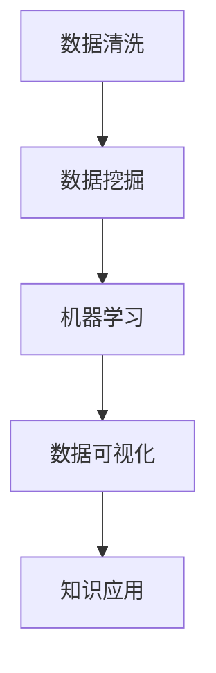

                 

# 知识发现引擎：驱动企业创新的核心引擎

> 关键词：知识发现引擎,企业创新,大数据,人工智能,数据挖掘,深度学习

## 1. 背景介绍

在数字化转型的大潮中，企业正面临前所未有的挑战和机遇。如何在海量数据中挖掘出有价值的知识，以支持战略决策、优化运营流程、提升客户体验，成为众多企业关注的焦点。知识发现引擎(Knowledge Discovery Engine, KDE)应运而生，成为驱动企业创新的核心引擎。本文将全面介绍知识发现引擎的基本原理、核心算法、实施步骤、典型应用，以期为读者提供系统化的知识发现实践指导。

## 2. 核心概念与联系

### 2.1 核心概念概述

知识发现引擎（KDE）是一种利用大数据分析技术，从复杂的数据集（如结构化数据、半结构化数据、非结构化数据）中提取和发现知识的过程。KDE集成了数据清洗、数据挖掘、机器学习、数据可视化等多种技术手段，旨在帮助企业洞察数据背后隐藏的商业价值，从而驱动业务创新。

其核心概念包括：
- 数据清洗：清洗数据中的噪声、缺失值、异常值等，确保数据的质量和一致性。
- 数据挖掘：运用各种算法（如聚类、分类、关联规则等）发现数据中的模式和规律。
- 机器学习：通过训练模型对数据进行预测、分类、推荐等，提取高层次的认知和逻辑。
- 数据可视化：将分析结果以图表、地图、仪表盘等形式直观展现，便于理解和决策。

### 2.2 核心概念原理和架构的 Mermaid 流程图



这个流程图展示了知识发现引擎的基本流程。从数据清洗到机器学习，再到数据可视化，最终应用于业务决策，形成一个闭环的知识发现流程。

## 3. 核心算法原理 & 具体操作步骤

### 3.1 算法原理概述

知识发现引擎的原理是利用先进的数据分析技术和算法，对企业内外部数据进行系统性的挖掘和处理，发现其中的知识模式，形成洞察力，辅助企业进行决策和创新。主要算法包括：

- **数据清洗算法**：用于处理数据中的噪声、缺失值、异常值等问题，保证数据的质量和一致性。
- **数据挖掘算法**：包括分类、聚类、关联规则挖掘等，用于发现数据中的模式和规律。
- **机器学习算法**：包括回归、决策树、随机森林、深度学习等，用于对数据进行预测、分类、推荐等，提取高层次的认知和逻辑。
- **数据可视化算法**：包括散点图、柱状图、热力图等，用于将分析结果以直观形式展现，便于理解和决策。

### 3.2 算法步骤详解

知识发现引擎的实施步骤一般包括以下几个关键环节：

**Step 1: 数据准备**
- 收集和整合企业内外部数据，包括销售数据、客户数据、市场数据、社交媒体数据等。
- 进行数据清洗，包括去重、标准化、缺失值填充、异常值处理等。
- 进行数据预处理，包括特征工程、归一化、降维等。

**Step 2: 数据挖掘**
- 根据业务需求选择合适的数据挖掘算法，如分类算法用于客户分群、聚类算法用于市场细分等。
- 进行特征选择，提取最相关的特征进行模型训练。
- 使用交叉验证等技术评估模型性能，优化算法参数。

**Step 3: 模型训练**
- 选择合适的机器学习算法，如回归、分类、推荐系统等，对数据进行建模。
- 进行超参数调优，选择最优模型。
- 评估模型性能，确保模型的泛化能力。

**Step 4: 数据可视化**
- 使用可视化工具，如Tableau、PowerBI等，将分析结果以图表、仪表盘等形式展现。
- 提供多维度的数据透视，帮助决策者进行深入分析。

**Step 5: 知识应用**
- 将分析结果转化为业务洞察，指导企业决策。
- 进行业务流程优化、市场细分、客户细分、产品推荐等。
- 持续监控和调整，确保知识发现引擎的有效性。

### 3.3 算法优缺点

知识发现引擎的优点包括：
- 帮助企业挖掘数据中的隐含知识，提供有价值的商业洞察。
- 支持多种数据分析方法和技术，灵活性高。
- 支持多维度的数据可视化，便于理解和决策。

其缺点包括：
- 数据质量和清洗工作对结果影响较大，需要投入大量时间和资源。
- 模型选择和调参复杂，需要专业知识和技能。
- 结果解释性较差，决策者难以理解复杂算法过程。

### 3.4 算法应用领域

知识发现引擎在多个领域有广泛的应用，包括但不限于：
- 客户关系管理（CRM）：利用客户数据进行客户分群、流失预测、推荐系统等。
- 市场营销：通过市场数据进行市场细分、广告投放优化、产品推荐等。
- 供应链管理：利用销售数据进行库存管理、需求预测、供应商评估等。
- 风险管理：通过交易数据进行欺诈检测、信用评估等。
- 健康医疗：通过医疗数据进行疾病预测、治疗方案推荐等。

## 4. 数学模型和公式 & 详细讲解 & 举例说明

### 4.1 数学模型构建

知识发现引擎的数学模型构建主要涉及以下几个方面：
- **数据清洗模型**：包括缺失值填补、异常值检测等。
- **数据挖掘模型**：包括K-Means聚类、决策树分类、Apriori关联规则挖掘等。
- **机器学习模型**：包括线性回归、支持向量机、随机森林、深度学习等。
- **数据可视化模型**：包括散点图、柱状图、热力图、桑基图等。

### 4.2 公式推导过程

以聚类算法为例，介绍其数学模型和公式推导过程：

**K-Means聚类算法**：
- **目标函数**：
  $$
  \min_{C,z} \sum_{i=1}^n \sum_{k=1}^K ||x_i - \mu_k||^2
  $$
  其中 $n$ 为样本数，$K$ 为聚类数，$x_i$ 为第 $i$ 个样本点，$\mu_k$ 为第 $k$ 个聚类中心。

- **更新公式**：
  $$
  \mu_k = \frac{1}{N_k} \sum_{i \in C_k} x_i \quad (k = 1, ..., K)
  $$
  其中 $N_k$ 为第 $k$ 个聚类包含的样本数，$C_k$ 为第 $k$ 个聚类的样本集合。

### 4.3 案例分析与讲解

**案例一：客户细分**
- **问题描述**：某电商平台需要根据客户的历史购买数据，进行客户分群，以便进行个性化推荐和营销。
- **解决方案**：使用K-Means聚类算法，对客户数据进行聚类，发现不同客户群体的消费行为特征。
- **模型实现**：
  - 数据预处理：去除缺失值、标准化数据。
  - 特征选择：选择客户消费金额、购买频率、年龄段等特征。
  - 模型训练：使用K-Means算法进行聚类，得到5个客户群。
  - 可视化：使用散点图展示每个聚类中心，直观了解聚类效果。

**案例二：市场细分**
- **问题描述**：某快速消费品公司需要根据市场数据，对不同地理区域的消费者进行细分，以便制定有针对性的营销策略。
- **解决方案**：使用层次聚类算法，对市场数据进行聚类，发现不同市场区域的消费者特征。
- **模型实现**：
  - 数据预处理：标准化数据。
  - 特征选择：选择市场规模、消费者收入、消费习惯等特征。
  - 模型训练：使用层次聚类算法进行聚类，得到若干市场细分区域。
  - 可视化：使用热力图展示每个市场细分区域的特征，直观了解市场细分效果。

## 5. 项目实践：代码实例和详细解释说明

### 5.1 开发环境搭建

为了进行知识发现引擎的开发，需要准备以下开发环境：
- **Python**：推荐使用Python 3.7及以上版本。
- **Pandas**：用于数据处理和分析。
- **Scikit-learn**：用于机器学习算法实现。
- **Matplotlib/Seaborn**：用于数据可视化。
- **Jupyter Notebook**：用于交互式数据分析和代码编写。

### 5.2 源代码详细实现

以下是一个基于Pandas和Scikit-learn的K-Means聚类算法实现的代码示例：

```python
import pandas as pd
from sklearn.cluster import KMeans
import matplotlib.pyplot as plt

# 加载数据
data = pd.read_csv('customer_data.csv')

# 数据预处理
data = data.dropna()
data = data[['age', 'income', 'spending']]

# 标准化数据
from sklearn.preprocessing import StandardScaler
scaler = StandardScaler()
data = scaler.fit_transform(data)

# 进行K-Means聚类
kmeans = KMeans(n_clusters=3, random_state=0)
kmeans.fit(data)

# 可视化聚类结果
plt.scatter(data[:, 0], data[:, 1], c=kmeans.labels_)
plt.show()
```

### 5.3 代码解读与分析

上述代码实现了K-Means聚类算法，对客户数据进行聚类。代码主要分为数据加载、数据预处理、标准化、聚类和可视化五个步骤。

- **数据加载**：使用Pandas的`read_csv`函数加载数据。
- **数据预处理**：使用Pandas的`dropna`函数去除缺失值，选择与聚类相关的特征。
- **标准化**：使用Scikit-learn的`StandardScaler`对数据进行标准化。
- **聚类**：使用Scikit-learn的`KMeans`算法进行聚类，设置聚类数为3。
- **可视化**：使用Matplotlib绘制散点图，展示聚类结果。

## 6. 实际应用场景

### 6.1 客户细分与个性化推荐

某电商平台通过客户细分，实现了个性化的推荐服务。具体流程如下：
- **数据收集**：收集客户的历史购买数据、浏览记录、个人信息等。
- **数据清洗**：去除缺失值、异常值，标准化数据。
- **聚类分析**：使用K-Means聚类算法，将客户分为不同群体。
- **推荐模型**：根据每个客户群体的特征，训练推荐模型，进行个性化推荐。
- **效果评估**：通过A/B测试，评估推荐效果，持续优化模型。

### 6.2 市场营销细分

某快速消费品公司通过市场细分，实现了有针对性的市场营销策略。具体流程如下：
- **数据收集**：收集不同地理区域的销售数据、消费者收入、消费习惯等。
- **数据清洗**：标准化数据，去除异常值。
- **聚类分析**：使用层次聚类算法，将市场区域分为不同细分市场。
- **策略制定**：针对每个细分市场，制定不同的营销策略。
- **效果评估**：通过销售数据分析，评估营销效果，持续优化策略。

### 6.3 供应链优化

某制造企业通过供应链优化，实现了库存管理和需求预测。具体流程如下：
- **数据收集**：收集销售数据、库存数据、供应商数据等。
- **数据清洗**：去除异常值，标准化数据。
- **聚类分析**：使用K-Means聚类算法，对供应商进行分类。
- **预测模型**：基于供应商分类，建立预测模型，预测需求。
- **优化决策**：根据预测结果，优化库存管理和供应商选择。

### 6.4 未来应用展望

未来，知识发现引擎将在更多领域得到应用，为企业创新提供更强大的支持。
- **智能制造**：通过数据分析，优化生产流程，提升生产效率。
- **智慧城市**：利用传感器数据，优化城市管理，提升公共服务。
- **智慧医疗**：通过患者数据，优化医疗资源分配，提升诊疗效果。
- **智能农业**：通过土壤、气象数据，优化农业生产，提高产量和品质。

## 7. 工具和资源推荐

### 7.1 学习资源推荐

为了帮助读者系统掌握知识发现引擎的理论和实践，这里推荐一些优质的学习资源：
- **Coursera《数据科学导论》**：斯坦福大学的在线课程，系统讲解数据科学的基础知识和应用。
- **Kaggle**：数据科学竞赛平台，提供大量真实数据集和开源代码，可练习和分享数据分析技能。
- **《Python数据科学手册》**：一本系统讲解Python数据科学工具和技术的书籍，适合初学者和中级读者。

### 7.2 开发工具推荐

以下是几款用于知识发现引擎开发的常用工具：
- **Pandas**：Python的数据处理和分析库，支持数据清洗和预处理。
- **Scikit-learn**：Python的机器学习库，提供多种经典算法实现。
- **TensorFlow/Keras**：深度学习框架，适合处理大规模数据和高维数据。
- **Tableau/PowerBI**：数据可视化工具，支持多维度数据透视和交互式展示。

### 7.3 相关论文推荐

以下是几篇奠基性的相关论文，推荐阅读：
- **《数据挖掘：概念与技术》**：作者Pang-Ning Tan等人，介绍了数据挖掘的基本概念和技术。
- **《K-means算法》**：作者C. Elkan，介绍了K-Means聚类算法的原理和实现。
- **《深度学习》**：作者Ian Goodfellow等人，介绍了深度学习的基本理论和应用。

## 8. 总结：未来发展趋势与挑战

### 8.1 研究成果总结

本文介绍了知识发现引擎的基本原理、核心算法、实施步骤和典型应用，希望为读者提供系统化的知识发现实践指导。

### 8.2 未来发展趋势

展望未来，知识发现引擎的发展趋势包括：
- **自动化和智能化**：自动化数据清洗和模型训练，提高效率。
- **多模态数据融合**：融合多种数据源，提升分析深度和广度。
- **实时数据分析**：实时处理数据，提升决策的及时性和灵活性。
- **深度学习应用**：利用深度学习模型，提升复杂数据的处理能力。
- **增强学习**：利用增强学习技术，优化模型和决策策略。

### 8.3 面临的挑战

尽管知识发现引擎取得了显著进展，但在实际应用中仍面临诸多挑战：
- **数据质量问题**：数据质量对分析结果有重大影响，需要投入大量资源进行清洗和预处理。
- **模型选择和调参复杂**：选择合适的算法和调优参数需要专业知识，难以快速实现。
- **结果解释性差**：复杂算法的结果难以解释，决策者难以理解和信任。
- **安全性和隐私保护**：数据隐私和安全问题，需要严格的数据管理和访问控制。

### 8.4 研究展望

未来，知识发现引擎的研究方向包括：
- **知识图谱技术**：利用知识图谱，提升数据分析的准确性和理解深度。
- **因果分析**：引入因果分析，增强模型决策的逻辑性和可解释性。
- **联邦学习**：利用联邦学习技术，保护数据隐私的同时，提升数据分析能力。
- **自适应学习**：利用自适应学习技术，实时调整模型参数和决策策略。

## 9. 附录：常见问题与解答

**Q1：知识发现引擎与数据挖掘有什么区别？**

A: 数据挖掘是从数据中提取有用信息的过程，而知识发现引擎则是一个基于数据挖掘技术的系统化、自动化工具，旨在帮助企业进行决策和创新。

**Q2：如何进行数据预处理？**

A: 数据预处理包括去重、标准化、缺失值填充、异常值检测等步骤，目的是确保数据的质量和一致性。

**Q3：如何选择合适的聚类算法？**

A: 选择合适的聚类算法需要考虑数据特征、聚类目的、计算复杂度等因素。例如，K-Means适用于大数据集，层次聚类适用于树形结构数据。

**Q4：如何进行数据可视化？**

A: 数据可视化可以使用多种工具，如Tableau、PowerBI、Matplotlib等，将分析结果以图表、仪表盘等形式展现，便于理解和决策。

**Q5：如何评估知识发现引擎的效果？**

A: 知识发现引擎的效果评估可以从多个维度进行，如准确率、召回率、F1分数、ROC曲线等，具体方法需要根据业务需求进行选择。

---

作者：禅与计算机程序设计艺术 / Zen and the Art of Computer Programming

