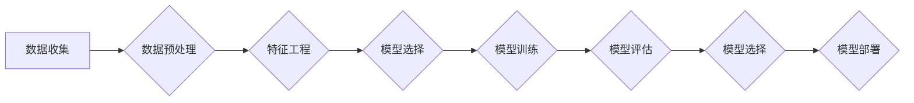

> 自动机器学习，AutoML，机器学习，模型训练，算法优化，代码实战，深度学习

## 1. 背景介绍

机器学习（Machine Learning）作为人工智能（Artificial Intelligence）的核心技术之一，近年来取得了令人瞩目的成就。从图像识别到自然语言处理，机器学习算法在各个领域展现出强大的应用潜力。然而，传统的机器学习开发流程往往需要专业知识和经验，对数据科学家和工程师提出了很高的门槛。

自动机器学习（AutoML）应运而生，旨在自动化机器学习流程，让机器学习技术更易于使用和普及。AutoML的目标是通过算法和自动化技术，简化机器学习模型的构建、训练和部署过程，让非专业人士也能轻松地利用机器学习的力量。

## 2. 核心概念与联系

AutoML的核心概念包括：

* **自动化特征工程:** 自动选择、转换和组合特征，以提高模型性能。
* **模型架构搜索:** 自动搜索最优的模型架构，例如神经网络的层数、节点数和激活函数。
* **超参数优化:** 自动调整模型训练过程中的超参数，例如学习率、批处理大小和训练轮数。
* **模型评估和选择:** 自动评估不同模型的性能，并选择最优模型。

AutoML流程通常可以概括为以下步骤：



## 3. 核心算法原理 & 具体操作步骤

### 3.1  算法原理概述

AutoML算法主要分为以下几类：

* **进化算法:** 借鉴自然进化机制，通过选择、交叉和变异操作，不断优化模型架构和超参数。
* **梯度下降算法:** 利用梯度下降法，优化模型参数和超参数。
* **贝叶斯优化算法:** 通过构建概率模型，高效地搜索最优超参数。
* **强化学习算法:** 将模型训练看作一个强化学习问题，通过奖励机制，引导模型学习最优策略。

### 3.2  算法步骤详解

以进化算法为例，其具体步骤如下：

1. **初始化种群:** 生成初始模型架构和超参数集合，作为种群。
2. **评估个体:** 对每个模型进行评估，计算其性能指标，例如准确率、召回率和F1-score。
3. **选择个体:** 根据性能指标，选择部分高性能个体作为父代。
4. **交叉操作:** 将父代个体进行交叉操作，生成新的子代个体。
5. **变异操作:** 对子代个体进行变异操作，增加遗传多样性。
6. **新一代种群:** 将新一代个体组成新的种群，重复步骤2-5，直到达到终止条件。

### 3.3  算法优缺点

**优点:**

* 自动化程度高，简化了机器学习开发流程。
* 可以探索更广泛的模型空间，提高模型性能。
* 降低了对专业知识和经验的要求。

**缺点:**

* 计算资源消耗较大，训练时间较长。
* 算法本身也需要进行调优和改进。
* 对于复杂的任务，AutoML效果可能不如人工设计模型。

### 3.4  算法应用领域

AutoML在各个领域都有广泛的应用，例如：

* **图像识别:** 自动构建图像分类、目标检测和图像分割模型。
* **自然语言处理:** 自动构建文本分类、情感分析和机器翻译模型。
* **预测分析:** 自动构建预测销量、风险评估和客户流失模型。
* **医疗诊断:** 自动构建疾病诊断、影像分析和药物研发模型。

## 4. 数学模型和公式 & 详细讲解 & 举例说明

### 4.1  数学模型构建

AutoML算法通常基于数学模型，例如进化算法的适应度函数、梯度下降算法的损失函数等。这些模型用于指导算法的搜索和优化过程。

### 4.2  公式推导过程

以进化算法为例，其适应度函数通常定义为模型性能指标，例如准确率或F1-score。

$$
fitness(model) = \frac{correct\_predictions}{total\_predictions}
$$

其中，`correct\_predictions`表示模型正确预测的数量，`total\_predictions`表示模型总预测的数量。

### 4.3  案例分析与讲解

假设我们有一个图像分类任务，目标是识别猫和狗的图片。我们可以使用进化算法进行AutoML，其适应度函数定义为模型在测试集上的准确率。

通过不断迭代，进化算法会搜索出最优的模型架构和超参数，最终得到一个能够准确识别猫和狗的模型。

## 5. 项目实践：代码实例和详细解释说明

### 5.1  开发环境搭建

AutoML项目开发环境通常需要以下软件：

* Python 3.x
* TensorFlow 或 PyTorch 等深度学习框架
* Scikit-learn 等机器学习库
* Jupyter Notebook 或 VS Code 等代码编辑器

### 5.2  源代码详细实现

以下是一个简单的AutoML代码示例，使用Scikit-learn库进行模型选择和超参数优化：

```python
from sklearn.datasets import load_iris
from sklearn.model_selection import train_test_split
from sklearn.ensemble import RandomForestClassifier
from sklearn.metrics import accuracy_score
from sklearn.model_selection import GridSearchCV

# 加载数据
iris = load_iris()
X = iris.data
y = iris.target

# 数据分割
X_train, X_test, y_train, y_test = train_test_split(X, y, test_size=0.2, random_state=42)

# 定义模型
model = RandomForestClassifier()

# 定义超参数搜索空间
param_grid = {
    'n_estimators': [50, 100, 200],
    'max_depth': [None, 5, 10],
    'min_samples_split': [2, 5, 10]
}

# 使用GridSearchCV进行超参数优化
grid_search = GridSearchCV(estimator=model, param_grid=param_grid, scoring='accuracy', cv=5)
grid_search.fit(X_train, y_train)

# 获取最优模型和超参数
best_model = grid_search.best_estimator_
best_params = grid_search.best_params_

# 模型评估
y_pred = best_model.predict(X_test)
accuracy = accuracy_score(y_test, y_pred)
print(f'Accuracy: {accuracy}')
```

### 5.3  代码解读与分析

这段代码首先加载了Iris数据集，并将其分割为训练集和测试集。然后，定义了一个随机森林分类器模型，并定义了超参数搜索空间。

使用GridSearchCV进行超参数优化，它会对所有可能的超参数组合进行训练和评估，并选择最优的模型。

最后，代码评估了最优模型在测试集上的准确率。

### 5.4  运行结果展示

运行这段代码后，会输出最优模型的准确率。

## 6. 实际应用场景

AutoML在各个领域都有广泛的应用场景，例如：

### 6.1  医疗诊断

AutoML可以用于自动构建疾病诊断模型，例如根据患者的症状和检查结果预测疾病类型。

### 6.2  金融风险评估

AutoML可以用于自动构建金融风险评估模型，例如预测客户的违约风险或欺诈风险。

### 6.3  客户流失预测

AutoML可以用于自动构建客户流失预测模型，例如预测哪些客户可能会离开公司。

### 6.4  未来应用展望

随着AutoML技术的不断发展，其应用场景将会更加广泛，例如：

* **个性化推荐:** 自动构建个性化推荐模型，为用户提供更精准的商品或服务推荐。
* **自动驾驶:** 自动构建自动驾驶模型，提高自动驾驶系统的安全性与可靠性。
* **药物研发:** 自动构建药物研发模型，加速新药的研发过程。

## 7. 工具和资源推荐

### 7.1  学习资源推荐

* **书籍:**
    * Automating Machine Learning: A Practical Guide to AutoML
    * Hands-On AutoML with Python

* **在线课程:**
    * Coursera: AutoML Specialization
    * Udacity: Machine Learning Engineer Nanodegree

### 7.2  开发工具推荐

* **Auto-sklearn:** 基于Scikit-learn的AutoML工具包。
* **TPOT:** 基于遗传算法的AutoML工具包。
* **H2O.ai:** 开源机器学习平台，提供AutoML功能。

### 7.3  相关论文推荐

* **AutoML-Zero:** Evolving Machine Learning Algorithms from Scratch
* **Neural Architecture Search with Reinforcement Learning**
* **Efficient Neural Architecture Search via Parameter Sharing**

## 8. 总结：未来发展趋势与挑战

### 8.1  研究成果总结

AutoML技术取得了显著的进展，自动化程度不断提高，模型性能也得到提升。

### 8.2  未来发展趋势

未来AutoML的发展趋势包括：

* **更强大的算法:** 开发更先进的算法，例如基于强化学习的AutoML算法。
* **更广泛的应用场景:** 将AutoML应用到更多领域，例如自动驾驶、药物研发等。
* **更易于使用的工具:** 开发更易于使用的AutoML工具，降低使用门槛。

### 8.3  面临的挑战

AutoML技术还面临一些挑战，例如：

* **计算资源消耗:** AutoML算法通常需要大量的计算资源，这限制了其应用范围。
* **算法解释性:** AutoML算法的决策过程往往难以解释，这不利于模型的信任和可解释性。
* **数据质量:** AutoML算法的性能依赖于数据质量，数据不完整或噪声会影响模型性能。

### 8.4  研究展望

未来研究方向包括：

* **开发更高效的AutoML算法:** 降低算法的计算复杂度，提高算法的效率。
* **提高AutoML算法的解释性:** 研究可解释的AutoML算法，使模型的决策过程更加透明。
* **开发针对不同数据类型的AutoML算法:** 针对文本、图像、音频等不同数据类型，开发相应的AutoML算法。

## 9. 附录：常见问题与解答

### 9.1  AutoML与传统机器学习的区别是什么？

AutoML自动化了机器学习流程，而传统机器学习需要人工进行特征工程、模型选择、超参数优化等步骤。

### 9.2  AutoML的适用场景有哪些？

AutoML适用于各种机器学习任务，例如分类、回归、聚类等，尤其适合数据量大、特征多、模型复杂的任务。

### 9.3  AutoML有哪些工具和资源？

一些常用的AutoML工具和资源包括Auto-sklearn、TPOT、H2O.ai等。

### 9.4  AutoML的未来发展趋势是什么？

未来AutoML的发展趋势包括更强大的算法、更广泛的应用场景、更易于使用的工具等。


作者：禅与计算机程序设计艺术 / Zen and the Art of Computer Programming 
<end_of_turn>