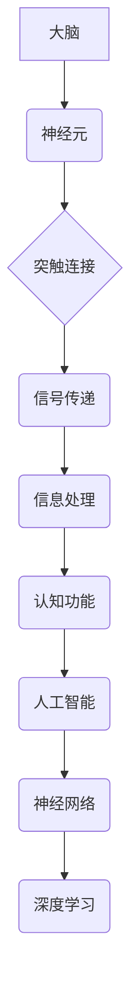

> 人工智能，模拟大脑，神经网络，深度学习，机器学习，计算极限，认知科学

## 1. 背景介绍

自人类开始思考机器的可能性以来，模拟大脑结构一直是人工智能领域的核心目标之一。从早期的图灵测试到如今的深度学习，我们不断探索着机器能否真正像人类一样思考。

大脑的复杂性是难以想象的，它由数十亿的神经元组成，这些神经元通过数万亿的突触连接相互传递信息。这种高度复杂的网络结构赋予了我们感知、学习、记忆和决策等能力。

然而，模拟大脑的结构并非易事。我们对大脑的了解还十分有限，其运作机制仍然是一个谜。此外，即使我们能够完全理解大脑的结构，如何将其转化为可编程的算法也是一个巨大的挑战。

## 2. 核心概念与联系

### 2.1 神经网络

神经网络是一种模仿大脑结构的计算模型。它由多个层的神经元组成，每个神经元接收来自其他神经元的输入，并根据这些输入进行处理，最终输出一个信号。

神经网络的学习过程是通过调整神经元之间的连接权重来实现的。通过大量的训练数据，神经网络可以学习到复杂的模式和关系，从而实现各种任务，例如图像识别、语音识别和自然语言处理。

### 2.2 深度学习

深度学习是神经网络的一种特殊形式，它使用具有多层结构的神经网络。深度学习模型能够学习到更抽象和高级的特征，从而在许多任务中取得了优异的性能。

### 2.3 脑科学与人工智能

脑科学和人工智能是两个相互关联的领域。脑科学研究大脑的结构和功能，而人工智能试图构建能够模拟大脑功能的机器。

通过结合脑科学和人工智能的知识，我们可以更好地理解大脑的工作原理，并开发出更智能的人工智能系统。



## 3. 核心算法原理 & 具体操作步骤

### 3.1 算法原理概述

深度学习算法的核心原理是通过多层神经网络学习到数据的特征表示。

每个神经元接收来自上一层的输出作为输入，并通过一个激活函数进行处理，输出到下一层。

通过调整神经网络的权重和偏置，使得网络能够学习到数据的潜在模式和关系。

### 3.2 算法步骤详解

1. **数据预处理:** 将原始数据转换为深度学习模型可以理解的格式。
2. **网络结构设计:** 根据任务需求设计神经网络的层数、神经元数量和激活函数等参数。
3. **权重初始化:** 为神经网络的权重赋予初始值。
4. **前向传播:** 将输入数据通过神经网络进行传递，计算输出结果。
5. **反向传播:** 计算输出结果与真实值的误差，并根据误差反向调整神经网络的权重和偏置。
6. **优化算法:** 使用优化算法，例如梯度下降，来更新神经网络的权重和偏置。
7. **训练和评估:** 循环进行前向传播和反向传播，直到模型的性能达到预期的水平。

### 3.3 算法优缺点

**优点:**

* 能够学习到复杂的特征表示。
* 在图像识别、语音识别和自然语言处理等任务中取得了优异的性能。

**缺点:**

* 需要大量的训练数据。
* 训练过程耗时且计算资源消耗大。
* 模型的解释性较差。

### 3.4 算法应用领域

* **图像识别:** 人脸识别、物体检测、图像分类。
* **语音识别:** 语音转文本、语音助手。
* **自然语言处理:** 机器翻译、文本摘要、情感分析。
* **医疗诊断:** 病理图像分析、疾病预测。
* **金融分析:** 欺诈检测、风险评估。

## 4. 数学模型和公式 & 详细讲解 & 举例说明

### 4.1 数学模型构建

深度学习模型可以看作是一个多层的神经网络，每个神经元都接收来自上一层的输出作为输入，并通过一个激活函数进行处理，输出到下一层。

我们可以用数学公式来描述神经网络的计算过程。

假设一个神经网络有 $L$ 层，第 $l$ 层有 $N_l$ 个神经元，则神经网络的计算过程可以表示为：

$$
z_j^{(l)} = \sum_{i=1}^{N_{l-1}} w_{ji}^{(l)} a_i^{(l-1)} + b_j^{(l)}
$$

$$
a_j^{(l)} = f(z_j^{(l)})
$$

其中：

* $z_j^{(l)}$ 是第 $l$ 层第 $j$ 个神经元的输入值。
* $a_j^{(l)}$ 是第 $l$ 层第 $j$ 个神经元的输出值。
* $w_{ji}^{(l)}$ 是第 $l$ 层第 $j$ 个神经元与第 $l-1$ 层第 $i$ 个神经元的连接权重。
* $b_j^{(l)}$ 是第 $l$ 层第 $j$ 个神经元的偏置值。
* $f(z)$ 是激活函数。

### 4.2 公式推导过程

上述公式的推导过程基于神经网络的结构和计算原理。

每个神经元接收来自上一层的输出作为输入，并通过一个加权和操作来计算其输入值。

然后，通过激活函数将输入值转换为输出值。

### 4.3 案例分析与讲解

例如，在图像识别任务中，我们可以使用卷积神经网络（CNN）来提取图像特征。

CNN 的结构包含多个卷积层和池化层。

卷积层使用卷积核来提取图像的局部特征，池化层则用来降低特征图的维度。

通过训练 CNN 模型，我们可以学习到图像的特征表示，并将其用于图像分类任务。

## 5. 项目实践：代码实例和详细解释说明

### 5.1 开发环境搭建

为了实现深度学习模型的开发，我们需要搭建一个合适的开发环境。

常用的开发环境包括：

* **Python:** 深度学习框架的主要编程语言。
* **TensorFlow:** Google 开发的开源深度学习框架。
* **PyTorch:** Facebook 开发的开源深度学习框架。
* **Keras:** TensorFlow 的高层API，简化了模型的构建和训练过程。

### 5.2 源代码详细实现

以下是一个使用 TensorFlow 和 Keras 实现图像分类模型的简单代码示例：

```python
from tensorflow import keras
from tensorflow.keras import layers

# 定义模型结构
model = keras.Sequential(
    [
        layers.Conv2D(32, (3, 3), activation="relu", input_shape=(28, 28, 1)),
        layers.MaxPooling2D((2, 2)),
        layers.Conv2D(64, (3, 3), activation="relu"),
        layers.MaxPooling2D((2, 2)),
        layers.Flatten(),
        layers.Dense(10, activation="softmax"),
    ]
)

# 编译模型
model.compile(
    optimizer="adam",
    loss="sparse_categorical_crossentropy",
    metrics=["accuracy"],
)

# 加载数据集
(x_train, y_train), (x_test, y_test) = keras.datasets.mnist.load_data()

# 数据预处理
x_train = x_train.astype("float32") / 255
x_test = x_test.astype("float32") / 255
x_train = x_train.reshape((x_train.shape[0], 28, 28, 1))
x_test = x_test.reshape((x_test.shape[0], 28, 28, 1))

# 训练模型
model.fit(x_train, y_train, epochs=5)

# 评估模型
loss, accuracy = model.evaluate(x_test, y_test)
print("Test loss:", loss)
print("Test accuracy:", accuracy)
```

### 5.3 代码解读与分析

这段代码定义了一个简单的卷积神经网络模型，并使用 MNIST 手写数字数据集进行训练。

模型结构包含两个卷积层、两个池化层、一个 Flatten 层和一个全连接层。

模型使用 Adam 优化器、交叉熵损失函数和准确率作为评估指标。

### 5.4 运行结果展示

训练完成后，我们可以使用测试集评估模型的性能。

输出结果会显示测试集上的损失值和准确率。

## 6. 实际应用场景

### 6.1 医疗诊断

深度学习在医疗诊断领域有着广泛的应用，例如：

* **病理图像分析:** 使用深度学习模型分析病理切片图像，辅助医生诊断癌症和其他疾病。
* **疾病预测:** 基于患者的医疗记录和基因信息，使用深度学习模型预测疾病风险。

### 6.2 金融分析

深度学习在金融分析领域也发挥着重要作用，例如：

* **欺诈检测:** 使用深度学习模型分析交易数据，识别异常交易行为，防止欺诈。
* **风险评估:** 基于客户的财务信息和行为数据，使用深度学习模型评估贷款风险。

### 6.3 自动驾驶

深度学习是自动驾驶技术的核心技术之一，例如：

* **目标检测:** 使用深度学习模型识别道路上的车辆、行人和其他物体。
* **路径规划:** 使用深度学习模型规划自动驾驶车辆行驶的路径。

### 6.4 未来应用展望

随着深度学习技术的不断发展，其应用场景将更加广泛，例如：

* **个性化教育:** 使用深度学习模型根据学生的学习情况提供个性化的学习内容和教学方法。
* **智能客服:** 使用深度学习模型构建智能客服系统，自动回答用户的问题。
* **药物研发:** 使用深度学习模型加速药物研发过程，发现新的药物候选物。

## 7. 工具和资源推荐

### 7.1 学习资源推荐

* **深度学习课程:** Coursera、edX、Udacity 等平台提供丰富的深度学习课程。
* **深度学习书籍:** 《深度学习》、《动手学深度学习》等书籍是深度学习学习的经典教材。
* **深度学习博客:** TensorFlow、PyTorch 等深度学习框架的官方博客提供最新的技术资讯和应用案例。

### 7.2 开发工具推荐

* **TensorFlow:** Google 开发的开源深度学习框架，功能强大，应用广泛。
* **PyTorch:** Facebook 开发的开源深度学习框架，灵活易用，适合研究和开发。
* **Keras:** TensorFlow 的高层API，简化了模型的构建和训练过程。

### 7.3 相关论文推荐

* **AlexNet:** 《ImageNet Classification with Deep Convolutional Neural Networks》
* **VGGNet:** 《Very Deep Convolutional Networks for Large-Scale Image Recognition》
* **ResNet:** 《Deep Residual Learning for Image Recognition》

## 8. 总结：未来发展趋势与挑战

### 8.1 研究成果总结

近年来，深度学习取得了令人瞩目的成就，在图像识别、语音识别、自然语言处理等领域取得了突破性的进展。

这些成果证明了深度学习在模拟大脑功能方面具有巨大的潜力。

### 8.2 未来发展趋势

未来，深度学习的发展趋势包括：

* **模型规模的扩大:** 训练更大型的深度学习模型，以学习更复杂的特征表示。
* **算法的创新:** 开发新的深度学习算法，提高模型的效率和性能。
* **硬件的加速:** 开发新的硬件平台，加速深度学习模型的训练和推理过程。
* **解释性和可信度:** 提高深度学习模型的解释性和可信