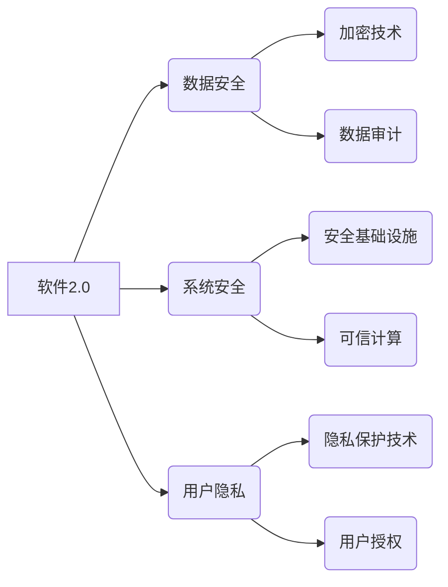

> 软件2.0, 安全性, 威胁, 对策, 人工智能, 区块链, 加密, 审计, 可信计算

## 1. 背景介绍

软件已经深刻地融入到我们生活的方方面面，从智能手机到自动驾驶汽车，再到医疗诊断系统，软件无处不在。随着软件技术的不断发展，软件的复杂度和规模也越来越大，出现了“软件2.0”的时代。软件2.0的特点是更加智能化、分布式化和连接性强，例如：

* **智能化:** 软件2.0更加注重人工智能（AI）的应用，能够学习、适应和自主决策。
* **分布式化:** 软件2.0更加依赖于分布式架构，数据和计算资源分散在多个节点上。
* **连接性强:** 软件2.0更加注重与其他系统和设备的互联互通，形成一个庞大的网络生态系统。

然而，软件2.0的这些特性也带来了新的安全挑战。传统的安全防护手段已经难以应对软件2.0的复杂性和动态性，因此，我们需要探索新的安全理念和技术来保障软件2.0的安全性。

## 2. 核心概念与联系

软件2.0的安全挑战主要体现在以下几个方面：

* **数据安全:** 软件2.0处理的海量数据更加敏感和重要，数据泄露和篡改的风险更加高。
* **系统安全:** 软件2.0的复杂性和分布式性使得系统更加脆弱，攻击者可以利用漏洞进行攻击，造成系统瘫痪或数据丢失。
* **用户隐私:** 软件2.0的智能化功能可能会收集和分析用户的个人信息，侵犯用户的隐私权。

为了应对这些挑战，我们需要从以下几个方面入手：

* **增强安全基础设施:** 建立完善的安全基础设施，包括防火墙、入侵检测系统、安全信息和事件管理系统等。
* **采用先进的安全技术:** 采用人工智能、区块链、加密等先进的安全技术，提高软件的安全性。
* **加强安全意识:** 加强软件开发人员、用户和管理人员的安全意识，提高安全防护能力。

**核心概念与架构关系：**

## 3. 核心算法原理 & 具体操作步骤

### 3.1  算法原理概述

**可信计算**是软件2.0安全的重要保障之一。可信计算旨在通过技术手段确保软件的可靠性和安全性，使其能够在不受信任的环境下正常运行。

可信计算的核心思想是将软件的各个环节进行严格的验证和认证，确保软件的完整性、机密性和可用性。

### 3.2  算法步骤详解

可信计算的具体操作步骤可以概括为以下几个方面：

1. **代码验证:** 对软件代码进行静态和动态分析，检测是否存在漏洞和恶意代码。
2. **环境验证:** 对软件运行的环境进行验证，确保环境安全可靠。
3. **数据加密:** 对软件处理的数据进行加密，防止数据泄露和篡改。
4. **身份认证:** 对软件用户进行身份认证，确保只有授权用户才能访问软件。
5. **审计记录:** 对软件运行过程中的所有操作进行记录，以便进行安全审计。

### 3.3  算法优缺点

**优点:**

* **提高软件安全性:** 可信计算可以有效地降低软件漏洞和攻击风险。
* **增强用户信任:** 可信计算可以增强用户对软件的信任，提高软件的接受度。
* **促进软件创新:** 可信计算可以为软件开发提供新的技术保障，促进软件的创新发展。

**缺点:**

* **技术复杂:** 可信计算的技术较为复杂，需要专业的技术人员进行实施。
* **成本较高:** 可信计算的实施成本较高，需要投入大量的资金和人力资源。
* **性能影响:** 可信计算可能会对软件性能造成一定的影响。

### 3.4  算法应用领域

可信计算技术广泛应用于以下领域：

* **金融行业:** 用于保护金融交易的安全性和可靠性。
* **医疗行业:** 用于保护患者的医疗信息安全。
* **政府行业:** 用于保障政府信息系统的安全性和可靠性。
* **物联网:** 用于保障物联网设备的安全性和可靠性。

## 4. 数学模型和公式 & 详细讲解 & 举例说明

### 4.1  数学模型构建

可信计算的安全性可以利用概率论和信息论进行建模。

**假设:**

* 软件系统包含N个组件。
* 每个组件的故障概率为p。
* 组件之间的相互依赖关系可以用图论模型表示。

**目标:**

* 计算软件系统的整体故障概率。

**模型:**

可以使用概率论中的树形模型或网络模型来表示软件系统的故障概率。

**公式:**

软件系统的整体故障概率可以表示为：

$$P_{fail} = 1 - \prod_{i=1}^{N} (1 - p_i)$$

其中：

* $P_{fail}$ 是软件系统的整体故障概率。
* $p_i$ 是第i个组件的故障概率。

### 4.2  公式推导过程

该公式的推导过程基于以下原理：

* 每个组件独立故障的概率为 $1 - (1 - p_i)$。
* 所有组件都正常工作的概率为 $\prod_{i=1}^{N} (1 - p_i)$。
* 软件系统整体故障的概率为 $1$ 减去所有组件都正常工作的概率。

### 4.3  案例分析与讲解

**例子:**

假设一个软件系统包含3个组件，每个组件的故障概率为0.1。

则软件系统的整体故障概率为：

$$P_{fail} = 1 - (1 - 0.1) * (1 - 0.1) * (1 - 0.1) = 0.027$$

即软件系统的整体故障概率为2.7%。

## 5. 项目实践：代码实例和详细解释说明

### 5.1  开发环境搭建

可信计算的项目实践需要搭建相应的开发环境，包括：

* 操作系统: Linux 或 Windows
* 编程语言: C/C++ 或 Java
* 安全工具: 代码分析工具、虚拟机、安全测试平台等

### 5.2  源代码详细实现

可信计算的代码实现涉及到多个方面，例如：

* 代码签名和验证
* 数据加密和解密
* 身份认证和授权
* 安全审计和日志记录

具体代码实现需要根据具体的应用场景和需求进行定制。

### 5.3  代码解读与分析

代码解读和分析需要对代码进行静态和动态分析，了解代码的功能、逻辑和安全特性。

可以使用代码分析工具、调试器和安全测试平台等工具进行代码解读和分析。

### 5.4  运行结果展示

可信计算的运行结果需要展示软件系统的安全性指标，例如：

* 漏洞数量和类型
* 攻击成功率
* 数据泄露风险
* 系统可用性

可以使用安全测试平台、日志分析工具和性能测试工具等工具进行运行结果展示。

## 6. 实际应用场景

### 6.1  金融行业

可信计算可以应用于金融交易系统，确保交易的安全性和可靠性。例如，可信计算可以用于验证交易的合法性、防止交易欺诈和保护用户资金安全。

### 6.2  医疗行业

可信计算可以应用于电子病历系统，保护患者的医疗信息安全。例如，可信计算可以用于验证医生的身份、防止医疗数据的泄露和篡改，以及确保患者的隐私权。

### 6.3  政府行业

可信计算可以应用于政府信息系统，保障政府信息的安全性和可靠性。例如，可信计算可以用于保护政府数据的机密性、防止网络攻击和确保政府服务的正常运行。

### 6.4  未来应用展望

随着软件2.0的不断发展，可信计算技术将得到更广泛的应用，例如：

* **物联网安全:** 保障物联网设备的安全性和可靠性。
* **人工智能安全:** 确保人工智能系统的安全性和可控性。
* **区块链安全:** 加强区块链系统的安全性。

## 7. 工具和资源推荐

### 7.1  学习资源推荐

* **书籍:**
    * 《可信计算》
    * 《软件安全》
* **网站:**
    * NIST 可信计算框架
    * OWASP 安全漏洞指南

### 7.2  开发工具推荐

* **代码分析工具:** SonarQube, Fortify
* **虚拟机:** VirtualBox, VMware
* **安全测试平台:** Metasploit, Burp Suite

### 7.3  相关论文推荐

* **可信计算的最新研究进展**
* **软件2.0安全挑战与对策**

## 8. 总结：未来发展趋势与挑战

### 8.1  研究成果总结

可信计算技术已经取得了一定的成果，为软件2.0的安全提供了新的保障。

### 8.2  未来发展趋势

可信计算技术将朝着以下方向发展：

* **更加智能化:** 利用人工智能技术，实现更加智能化的可信计算。
* **更加自动化:** 利用自动化技术，简化可信计算的实施过程。
* **更加可扩展:** 支持更加复杂的软件系统和应用场景。

### 8.3  面临的挑战

可信计算技术还面临着一些挑战，例如：

* **技术复杂性:** 可信计算技术仍然比较复杂，需要专业的技术人员进行实施。
* **成本问题:** 可信计算的实施成本较高，需要投入大量的资金和人力资源。
* **标准化问题:** 可信计算的标准化程度还不够高，需要进一步的规范和标准化工作。

### 8.4  研究展望

未来，可信计算技术将继续得到发展和完善，为软件2.0的安全提供更加强大的保障。

## 9. 附录：常见问题与解答

**常见问题:**

* 什么是可信计算？
* 可信计算有哪些应用场景？
* 如何实施可信计算？

**解答:**

* 可信计算是一种技术手段，旨在确保软件的可靠性和安全性。
* 可信计算应用于金融、医疗、政府等多个领域。
* 可信计算的实施需要专业的技术人员和相应的工具。

作者：禅与计算机程序设计艺术 / Zen and the Art of Computer Programming 
<end_of_turn>