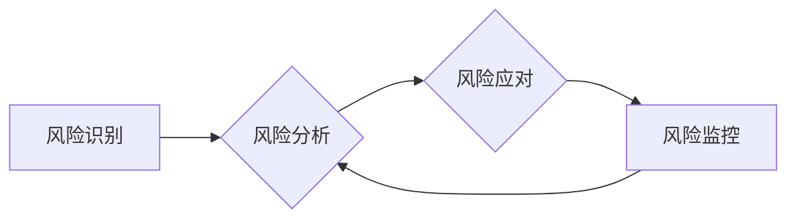

> 软件2.0,风险管理,人工智能,机器学习,安全保障,可持续发展,伦理规范

## 1. 背景介绍

软件已经深刻地融入到人类生活的方方面面，从智能手机到自动驾驶汽车，再到医疗诊断和金融交易，软件无处不在。随着软件技术的不断发展，软件的规模、复杂度和影响力都在不断提升，软件2.0时代正在到来。

软件2.0的特点是更加智能化、自动化和分布式。它将更加依赖于人工智能、机器学习等新兴技术，并以微服务架构、云计算等为基础，构建更加灵活、可扩展和高效的软件系统。然而，软件2.0的这些特性也带来了新的风险和挑战。

传统的软件风险管理框架难以应对软件2.0时代带来的复杂性，需要建立新的风险管理框架来应对这些挑战。

## 2. 核心概念与联系

**2.1 软件2.0风险类型**

软件2.0的风险类型可以分为以下几类：

* **安全风险:**  人工智能算法的攻击、数据泄露、系统漏洞等。
* **可靠性风险:**  软件系统故障、数据丢失、功能失效等。
* **可维护性风险:**  软件系统更新困难、代码维护成本高昂等。
* **伦理风险:**  人工智能算法的偏见、算法透明度不足、数据隐私保护等。
* **可持续性风险:**  软件系统能源消耗高、硬件资源浪费等。

**2.2 风险管理框架**

软件2.0风险管理框架应遵循以下原则：

* **全生命周期管理:** 从软件设计、开发、部署到运行维护的全生命周期进行风险管理。
* **主动防御:**  预先识别和评估风险，采取措施预防和控制风险。
* **持续改进:**  不断监控和评估风险，根据实际情况调整风险管理策略。
* **协同合作:**  建立跨部门、跨团队的风险管理机制，加强沟通和协作。

**2.3 风险管理流程**

软件2.0风险管理流程可以分为以下几个阶段：

* **风险识别:**  识别软件2.0可能面临的各种风险。
* **风险分析:**  评估风险的可能性和影响程度。
* **风险应对:**  制定风险应对策略，包括风险规避、风险转移、风险控制和风险接受。
* **风险监控:**  持续监控风险，及时发现和应对新的风险。

**2.4  Mermaid 流程图**



## 3. 核心算法原理 & 具体操作步骤

**3.1 算法原理概述**

软件2.0风险管理框架的核心算法可以是基于机器学习的风险预测模型。该模型可以利用历史数据和软件系统运行数据，预测软件系统可能面临的风险类型和风险等级。

**3.2 算法步骤详解**

1. **数据收集:** 收集软件系统运行数据、安全事件数据、代码质量数据等相关数据。
2. **数据预处理:** 对收集到的数据进行清洗、转换和特征提取。
3. **模型训练:** 利用机器学习算法，例如支持向量机、决策树、神经网络等，对数据进行训练，建立风险预测模型。
4. **模型评估:** 对训练好的模型进行评估，验证模型的预测准确率和泛化能力。
5. **模型部署:** 将训练好的模型部署到软件系统中，实时监控软件系统运行状态，并预测潜在风险。

**3.3 算法优缺点**

* **优点:** 能够自动识别和预测风险，提高风险管理效率。
* **缺点:** 需要大量的训练数据，模型的准确性依赖于数据质量。

**3.4 算法应用领域**

* **软件安全:**  预测软件系统可能面临的安全攻击，并采取相应的防御措施。
* **软件可靠性:**  预测软件系统可能出现的故障，并采取措施提高软件可靠性。
* **软件维护:**  预测软件系统可能需要维护的代码模块，并提前进行维护工作。

## 4. 数学模型和公式 & 详细讲解 & 举例说明

**4.1 数学模型构建**

风险预测模型可以构建为一个二分类问题，其中：

* **正例:** 软件系统可能面临风险。
* **负例:** 软件系统没有面临风险。

模型的目标是学习一个函数，将软件系统运行数据映射到风险概率。

**4.2 公式推导过程**

假设软件系统运行数据为特征向量 X，风险预测模型为函数 f(X)，则风险概率为：

$$P(风险|X) = f(X)$$

其中，f(X) 可以是 sigmoid 函数、softmax 函数等。

**4.3 案例分析与讲解**

例如，我们可以使用支持向量机 (SVM) 算法构建风险预测模型。SVM 算法的目标是找到一个超平面，将正例和负例分开。

在软件风险预测中，超平面可以表示为：

$$w^T X + b = 0$$

其中，w 是权重向量，b 是偏置项。

SVM 算法会寻找一个最大间隔的超平面，使得正例和负例尽可能分开。

## 5. 项目实践：代码实例和详细解释说明

**5.1 开发环境搭建**

* Python 3.x
* TensorFlow 或 PyTorch 等深度学习框架
* Jupyter Notebook 或 VS Code 等开发工具

**5.2 源代码详细实现**

```python
import tensorflow as tf

# 定义模型结构
model = tf.keras.models.Sequential([
    tf.keras.layers.Dense(64, activation='relu', input_shape=(input_dim,)),
    tf.keras.layers.Dense(32, activation='relu'),
    tf.keras.layers.Dense(1, activation='sigmoid')
])

# 编译模型
model.compile(optimizer='adam',
              loss='binary_crossentropy',
              metrics=['accuracy'])

# 训练模型
model.fit(X_train, y_train, epochs=10)

# 评估模型
loss, accuracy = model.evaluate(X_test, y_test)
print('Loss:', loss)
print('Accuracy:', accuracy)
```

**5.3 代码解读与分析**

* 代码首先定义了一个简单的深度学习模型，包含三个全连接层。
* 模型使用 Adam 优化器，损失函数为二分类交叉熵，评估指标为准确率。
* 模型使用训练数据进行训练，并评估模型在测试数据上的性能。

**5.4 运行结果展示**

运行结果会显示模型的损失值和准确率。

## 6. 实际应用场景

**6.1 软件安全**

* 预测软件系统可能面临的 SQL 注入、跨站脚本攻击等安全漏洞。
* 识别恶意代码和网络攻击行为。

**6.2 软件可靠性**

* 预测软件系统可能出现的崩溃、死锁、数据丢失等故障。
* 识别软件系统性能瓶颈，并采取措施提高软件性能。

**6.3 软件维护**

* 预测软件系统可能需要维护的代码模块，并提前进行维护工作。
* 识别软件系统中的代码缺陷，并采取措施修复缺陷。

**6.4 未来应用展望**

* 将风险预测模型与自动化测试、代码审查等工具结合，实现自动化风险管理。
* 利用风险预测模型，为软件开发人员提供风险提示和建议，帮助他们开发更加安全、可靠和可维护的软件。

## 7. 工具和资源推荐

**7.1 学习资源推荐**

* **书籍:**
    * 《软件工程》
    * 《风险管理》
    * 《机器学习》
* **在线课程:**
    * Coursera 上的软件工程课程
    * edX 上的风险管理课程
    * Udacity 上的机器学习课程

**7.2 开发工具推荐**

* **Python:**  Python 是一个非常流行的编程语言，广泛应用于数据科学、机器学习等领域。
* **TensorFlow:** TensorFlow 是一个开源的机器学习框架，提供丰富的工具和资源，方便用户构建和训练机器学习模型。
* **PyTorch:** PyTorch 是另一个开源的机器学习框架，以其灵活性和易用性而闻名。

**7.3 相关论文推荐**

* **软件风险预测模型的研究进展**
* **基于机器学习的软件安全风险分析**
* **软件可靠性预测模型的构建与应用**

## 8. 总结：未来发展趋势与挑战

**8.1 研究成果总结**

软件2.0风险管理框架的研究取得了显著进展，特别是基于机器学习的风险预测模型取得了很好的效果。

**8.2 未来发展趋势**

* **模型的准确性:**  提高风险预测模型的准确性，降低误判率。
* **模型的解释性:**  提高风险预测模型的解释性，帮助用户理解模型的决策过程。
* **模型的泛化能力:**  提高风险预测模型的泛化能力，使其能够应用于不同的软件系统和场景。
* **模型的安全性:**  确保风险预测模型的安全性，防止模型被恶意攻击。

**8.3 面临的挑战**

* **数据质量:**  风险预测模型的准确性依赖于数据质量，获取高质量的软件运行数据是一个挑战。
* **模型复杂度:**  复杂的机器学习模型难以理解和维护，需要开发更易于理解和维护的模型。
* **伦理问题:**  风险预测模型可能会产生偏见，需要解决模型的伦理问题。

**8.4 研究展望**

未来，软件2.0风险管理框架的研究将继续深入，探索更有效的风险管理方法，帮助软件系统更加安全、可靠和可持续发展。

## 9. 附录：常见问题与解答

**9.1 如何评估风险预测模型的准确性？**

可以使用准确率、召回率、F1-score 等指标评估风险预测模型的准确性。

**9.2 如何提高风险预测模型的解释性？**

可以使用可解释机器学习 (XAI) 技术，例如 LIME、SHAP 等，解释模型的决策过程。

**9.3 如何解决风险预测模型的偏见问题？**

可以使用数据预处理、模型训练和评估等方法，减轻模型的偏见。


作者：禅与计算机程序设计艺术 / Zen and the Art of Computer Programming 
<end_of_turn>