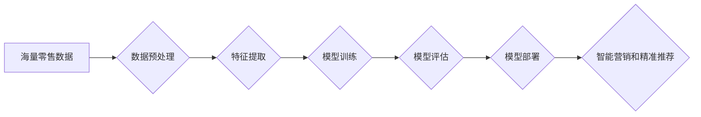

> 零售大模型、智能营销、精准推荐、深度学习、Transformer、自然语言处理、计算机视觉

## 1. 背景介绍

在当今数据爆炸的时代，零售行业面临着前所未有的机遇和挑战。消费者行为日益复杂，商品种类繁多，竞争日益激烈。传统零售模式难以满足消费者日益增长的个性化需求。为了应对这些挑战，零售企业纷纷寻求数字化转型，利用人工智能（AI）技术提升运营效率、优化客户体验，并实现可持续发展。

零售大模型作为一种新型的AI技术，正逐渐成为零售行业数字化转型的关键驱动力。它通过对海量零售数据进行深度学习和分析，能够洞察消费者需求、预测市场趋势、个性化推荐商品，并实现智能营销、精准推荐等功能。

## 2. 核心概念与联系

零售大模型的核心概念包括：

* **大模型:** 指规模庞大、参数数量众多的人工智能模型，通常拥有数十亿甚至数千亿个参数。
* **深度学习:** 一种机器学习方法，利用多层神经网络模拟人类大脑的学习过程，能够从复杂的数据中提取特征和模式。
* **自然语言处理 (NLP):**  使计算机能够理解、生成和处理人类语言的技术。
* **计算机视觉 (CV):** 使计算机能够“看”和理解图像的技术。

零售大模型通常结合上述技术，构建一个复杂的智能系统，能够处理各种类型的数据，包括文本、图像、视频、用户行为数据等。

**Mermaid 流程图:**



## 3. 核心算法原理 & 具体操作步骤

### 3.1  算法原理概述

零售大模型通常基于深度学习算法，例如Transformer、BERT、GPT等。这些算法能够学习数据中的复杂关系和模式，并生成预测结果。

* **Transformer:**  一种新型的深度学习架构，能够有效处理序列数据，例如文本和时间序列数据。它通过自注意力机制学习数据之间的长距离依赖关系，能够捕捉到更丰富的语义信息。
* **BERT:**  一种基于Transformer的预训练语言模型，能够理解上下文信息，并进行文本分类、问答、文本生成等任务。
* **GPT:**  一种基于Transformer的文本生成模型，能够生成流畅、连贯的文本。

### 3.2  算法步骤详解

1. **数据收集和预处理:** 收集各种类型的数据，例如用户行为数据、商品信息、市场趋势数据等，并进行清洗、转换、格式化等预处理操作。
2. **特征提取:** 从原始数据中提取有价值的特征，例如用户画像、商品属性、购买历史等。可以使用传统机器学习算法或深度学习算法进行特征提取。
3. **模型训练:** 使用深度学习算法对提取的特征进行训练，构建一个能够预测用户需求、商品推荐等任务的模型。
4. **模型评估:** 使用测试数据对模型进行评估，并根据评估结果进行模型调优。
5. **模型部署:** 将训练好的模型部署到生产环境中，并将其集成到零售系统的各个环节。

### 3.3  算法优缺点

**优点:**

* 能够处理海量数据，并从数据中提取复杂的关系和模式。
* 能够实现个性化推荐、智能营销等功能，提升客户体验。
* 能够预测市场趋势，帮助零售企业制定更有效的策略。

**缺点:**

* 训练成本高，需要大量的计算资源和数据。
* 模型解释性差，难以理解模型的决策过程。
* 数据安全和隐私问题需要得到重视。

### 3.4  算法应用领域

* **精准推荐:** 根据用户的兴趣、购买历史、浏览记录等信息，推荐个性化的商品。
* **智能营销:**  根据用户的画像和行为特征，进行精准的营销推广。
* **库存管理:**  预测商品需求，优化库存水平，降低库存成本。
* **价格优化:**  根据市场趋势和用户需求，动态调整商品价格。
* **客户服务:**  利用聊天机器人等技术，提供智能化的客户服务。

## 4. 数学模型和公式 & 详细讲解 & 举例说明

### 4.1  数学模型构建

零售大模型通常使用以下数学模型进行构建：

* **线性回归:** 用于预测连续型变量，例如商品价格、销量等。
* **逻辑回归:** 用于预测分类型变量，例如用户是否会购买商品。
* **支持向量机 (SVM):** 用于分类和回归任务，能够处理高维数据。
* **神经网络:**  用于处理复杂的数据，能够学习数据中的非线性关系。

### 4.2  公式推导过程

例如，使用线性回归模型预测商品销量，其数学公式如下：

$$
y = \beta_0 + \beta_1 x_1 + \beta_2 x_2 + ... + \beta_n x_n + \epsilon
$$

其中：

* $y$ 是预测的销量。
* $\beta_0, \beta_1, ..., \beta_n$ 是模型参数。
* $x_1, x_2, ..., x_n$ 是商品特征，例如价格、库存量、促销活动等。
* $\epsilon$ 是误差项。

模型参数可以通过最小二乘法等方法进行估计。

### 4.3  案例分析与讲解

例如，假设我们想要预测一款商品的销量，其特征包括价格、库存量、促销活动等。我们可以使用线性回归模型，并根据历史数据训练模型。训练完成后，我们可以输入新的商品特征，预测其销量。

## 5. 项目实践：代码实例和详细解释说明

### 5.1  开发环境搭建

* Python 3.x
* TensorFlow 或 PyTorch 深度学习框架
* Jupyter Notebook 或 VS Code 代码编辑器

### 5.2  源代码详细实现

```python
import tensorflow as tf

# 定义模型结构
model = tf.keras.Sequential([
    tf.keras.layers.Dense(64, activation='relu', input_shape=(5,)),
    tf.keras.layers.Dense(32, activation='relu'),
    tf.keras.layers.Dense(1)
])

# 编译模型
model.compile(optimizer='adam', loss='mse')

# 训练模型
model.fit(X_train, y_train, epochs=10)

# 评估模型
loss = model.evaluate(X_test, y_test)
print('测试损失:', loss)

# 预测
predictions = model.predict(X_new)
print('预测销量:', predictions)
```

### 5.3  代码解读与分析

* 代码首先定义了一个简单的深度学习模型，包含三个全连接层。
* 然后，模型被编译，指定了优化器、损失函数等参数。
* 接着，模型使用训练数据进行训练，训练过程会迭代多次，不断调整模型参数，以降低损失函数的值。
* 训练完成后，模型可以使用测试数据进行评估，并计算测试损失。
* 最后，可以使用训练好的模型对新的数据进行预测。

### 5.4  运行结果展示

运行结果将显示模型的测试损失和预测销量。

## 6. 实际应用场景

### 6.1  精准推荐

零售大模型可以根据用户的兴趣、购买历史、浏览记录等信息，推荐个性化的商品。例如，电商平台可以利用零售大模型，为用户推荐他们可能感兴趣的商品，提高用户转化率。

### 6.2  智能营销

零售大模型可以根据用户的画像和行为特征，进行精准的营销推广。例如，超市可以利用零售大模型，根据用户的购物习惯，推送相关的促销信息，提高营销效果。

### 6.3  库存管理

零售大模型可以预测商品需求，优化库存水平，降低库存成本。例如，服装品牌可以利用零售大模型，预测不同季节不同款式的商品需求，合理安排库存，避免积压或缺货。

### 6.4  未来应用展望

随着人工智能技术的不断发展，零售大模型的应用场景将更加广泛。例如，未来零售大模型可以用于：

* **个性化商品设计:** 根据用户的需求和喜好，设计个性化的商品。
* **智能化门店运营:** 利用机器人、无人机等智能设备，实现门店的自动化运营。
* **虚拟试衣间:** 利用计算机视觉技术，实现虚拟试衣间，让用户在家就能试穿衣服。

## 7. 工具和资源推荐

### 7.1  学习资源推荐

* **书籍:**
    * 深度学习
    * 人工智能
    * 自然语言处理
* **在线课程:**
    * Coursera
    * edX
    * Udacity

### 7.2  开发工具推荐

* **Python:** 
* **TensorFlow:** 
* **PyTorch:** 
* **Jupyter Notebook:** 
* **VS Code:**

### 7.3  相关论文推荐

* BERT: Pre-training of Deep Bidirectional Transformers for Language Understanding
* GPT-3: Language Models are Few-Shot Learners
* Transformer: Attention Is All You Need

## 8. 总结：未来发展趋势与挑战

### 8.1  研究成果总结

零售大模型在精准推荐、智能营销、库存管理等方面取得了显著成果，为零售行业数字化转型提供了强大的技术支撑。

### 8.2  未来发展趋势

* 模型规模和能力将进一步提升，能够处理更复杂的数据，并实现更精准的预测。
* 模型解释性将得到加强，能够更好地解释模型的决策过程，提高用户信任度。
* 模型的应用场景将更加广泛，覆盖零售行业的各个环节。

### 8.3  面临的挑战

* 数据安全和隐私问题需要得到重视，确保用户数据的安全和隐私。
* 模型的解释性需要得到加强，提高用户对模型的信任度。
* 模型的部署和维护成本较高，需要企业投入更多的资源。

### 8.4  研究展望

未来，零售大模型的研究将更加注重模型的解释性、可解释性和安全性，并探索新的应用场景，为零售行业带来更大的价值。

## 9. 附录：常见问题与解答

* **Q1: 零售大模型的训练成本很高吗？**

* **A1:** 确实，零售大模型的训练成本较高，需要大量的计算资源和数据。但是，随着计算技术的进步和开源框架的普及，训练成本正在逐渐降低。

* **Q2: 零售大模型的模型解释性如何？**

* **A2:** 零售大模型的模型解释性仍然是一个挑战。目前，一些研究方法可以帮助解释模型的决策过程，但仍需进一步改进。

* **Q3: 零售大模型的应用场景有哪些？**

* **A3:** 零售大模型的应用场景非常广泛，包括精准推荐、智能营销、库存管理、价格优化、客户服务等。

作者：禅与计算机程序设计艺术 / Zen and the Art of Computer Programming


<end_of_turn>