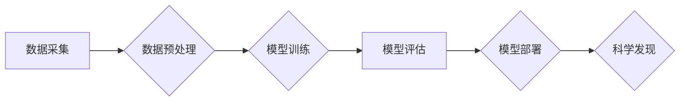

>人工智能，科学计算，机器学习，深度学习，自然语言处理，数据分析，科学发现

## 1. 背景介绍

科学研究历来是人类探索世界、理解自然规律和推动社会进步的重要驱动力。然而，传统的科学研究方法往往面临着数据量大、计算复杂、分析周期长等挑战。随着人工智能（AI）技术的飞速发展，特别是深度学习算法的突破，AI为科学研究带来了前所未有的机遇。

AI for Science，即人工智能助力科学研究，是指利用人工智能技术加速科学发现、推动科学研究的各个环节。它涵盖了从数据采集、分析和处理到模型构建、实验设计和结果解释等多个方面。

## 2. 核心概念与联系

AI for Science的核心概念包括：

* **机器学习（Machine Learning）：** 算法从数据中学习模式和规律，无需明确编程。
* **深度学习（Deep Learning）：** 基于多层神经网络的机器学习方法，能够处理复杂的数据结构和模式。
* **自然语言处理（Natural Language Processing）：** 理解和处理人类语言，用于提取科学文献中的知识和信息。
* **数据分析（Data Analysis）：** 从海量数据中发现隐藏的模式和趋势。

**AI for Science的架构**



## 3. 核心算法原理 & 具体操作步骤

### 3.1  算法原理概述

深度学习算法是AI for Science的核心驱动力。其中，卷积神经网络（CNN）和循环神经网络（RNN）在科学计算领域表现出色。

* **卷积神经网络（CNN）：**擅长处理图像和视频数据，能够提取图像中的特征和模式。
* **循环神经网络（RNN）：**擅长处理序列数据，例如文本和时间序列数据，能够捕捉序列中的依赖关系和上下文信息。

### 3.2  算法步骤详解

**深度学习算法的训练步骤：**

1. **数据准备：**收集和预处理科学数据，例如图像、文本、时间序列等。
2. **模型构建：**选择合适的深度学习模型，例如CNN或RNN，并定义模型的结构和参数。
3. **模型训练：**使用训练数据训练模型，调整模型参数，使模型能够准确地预测或分类数据。
4. **模型评估：**使用测试数据评估模型的性能，例如准确率、召回率、F1-score等。
5. **模型部署：**将训练好的模型部署到实际应用场景中，用于科学计算和数据分析。

### 3.3  算法优缺点

**深度学习算法的优点：**

* **高精度：**深度学习算法能够学习复杂的数据模式，实现高精度预测和分类。
* **自动化特征提取：**深度学习算法能够自动提取数据中的特征，无需人工特征工程。
* **处理大规模数据：**深度学习算法能够处理海量数据，并从中发现隐藏的模式。

**深度学习算法的缺点：**

* **数据依赖：**深度学习算法需要大量的训练数据才能达到高精度。
* **计算资源消耗：**深度学习算法的训练过程需要大量的计算资源。
* **可解释性差：**深度学习模型的内部工作机制难以理解，缺乏可解释性。

### 3.4  算法应用领域

深度学习算法在科学计算领域有着广泛的应用，例如：

* **药物发现：**预测药物的活性、毒性等特性。
* **材料科学：**设计新型材料，预测材料的性能。
* **天文学：**分析天文图像，发现新的天体。
* **生物信息学：**分析基因序列，预测蛋白质结构。

## 4. 数学模型和公式 & 详细讲解 & 举例说明

### 4.1  数学模型构建

深度学习模型的数学基础是神经网络。神经网络由多个层组成，每层包含多个神经元。神经元之间通过连接进行信息传递，每个连接都有一个权重。

**神经网络的数学模型：**

* **激活函数：**将神经元的输入转换为输出，常用的激活函数包括ReLU、Sigmoid、Tanh等。
* **损失函数：**衡量模型预测结果与真实结果之间的差异，常用的损失函数包括均方误差、交叉熵等。
* **优化算法：**用于更新模型参数，使损失函数最小化的算法，常用的优化算法包括梯度下降、Adam等。

### 4.2  公式推导过程

**梯度下降算法的公式：**

$$
\theta = \theta - \alpha \nabla L(\theta)
$$

其中：

* $\theta$：模型参数
* $\alpha$：学习率
* $\nabla L(\theta)$：损失函数对模型参数的梯度

### 4.3  案例分析与讲解

**举例说明：**

假设我们训练一个图像分类模型，目标是将图像分类为猫或狗。

* **输入数据：**图像像素值
* **输出数据：**猫或狗的概率

我们可以使用CNN模型进行训练，并使用交叉熵损失函数和Adam优化算法。

训练过程中，模型会不断调整参数，使预测结果与真实结果之间的差异最小化。最终，训练好的模型能够准确地将图像分类为猫或狗。

## 5. 项目实践：代码实例和详细解释说明

### 5.1  开发环境搭建

* **操作系统：**Linux或macOS
* **编程语言：**Python
* **深度学习框架：**TensorFlow或PyTorch
* **其他工具：**Git、Jupyter Notebook

### 5.2  源代码详细实现

```python
# 使用TensorFlow构建一个简单的CNN模型

import tensorflow as tf

# 定义模型结构
model = tf.keras.models.Sequential([
    tf.keras.layers.Conv2D(32, (3, 3), activation='relu', input_shape=(28, 28, 1)),
    tf.keras.layers.MaxPooling2D((2, 2)),
    tf.keras.layers.Conv2D(64, (3, 3), activation='relu'),
    tf.keras.layers.MaxPooling2D((2, 2)),
    tf.keras.layers.Flatten(),
    tf.keras.layers.Dense(10, activation='softmax')
])

# 编译模型
model.compile(optimizer='adam',
              loss='sparse_categorical_crossentropy',
              metrics=['accuracy'])

# 训练模型
model.fit(x_train, y_train, epochs=5)

# 评估模型
loss, accuracy = model.evaluate(x_test, y_test)
print('Test loss:', loss)
print('Test accuracy:', accuracy)
```

### 5.3  代码解读与分析

* **模型结构：**该代码定义了一个简单的CNN模型，包含两个卷积层、两个最大池化层、一个全连接层和一个softmax输出层。
* **模型编译：**使用Adam优化算法、交叉熵损失函数和准确率作为评估指标编译模型。
* **模型训练：**使用训练数据训练模型，训练5个epochs。
* **模型评估：**使用测试数据评估模型的性能，打印测试损失和准确率。

### 5.4  运行结果展示

运行代码后，会输出测试损失和准确率。

## 6. 实际应用场景

### 6.1  药物发现

AI for Science在药物发现领域有着广泛的应用，例如：

* **虚拟筛选：**利用机器学习算法从大量的化合物库中筛选出潜在的药物候选物。
* **药物设计：**根据药物目标蛋白的结构和功能，利用深度学习算法设计新型药物分子。
* **毒性预测：**利用机器学习算法预测药物的毒性，减少药物研发过程中的风险。

### 6.2  材料科学

AI for Science在材料科学领域也有着重要的应用，例如：

* **材料性能预测：**利用机器学习算法预测材料的力学、电学、热学等性能。
* **新型材料设计：**利用深度学习算法设计新型材料，例如高强度轻质材料、导电材料等。
* **材料缺陷检测：**利用计算机视觉技术和深度学习算法检测材料中的缺陷。

### 6.3  天文学

AI for Science在天文学领域也有着重要的应用，例如：

* **天体分类：**利用机器学习算法对天文图像进行分类，例如星系、恒星、星云等。
* **天体发现：**利用深度学习算法分析天文图像，发现新的天体，例如黑洞、脉冲星等。
* **宇宙学研究：**利用机器学习算法分析宇宙微波背景辐射数据，研究宇宙的起源和演化。

### 6.4  未来应用展望

AI for Science的应用前景广阔，未来将有更多新的应用场景出现，例如：

* **精准医疗：**利用AI技术个性化治疗方案，提高医疗效果。
* **可持续发展：**利用AI技术优化资源利用，减少环境污染。
* **科学探索：**利用AI技术探索宇宙的奥秘，揭示生命起源的秘密。

## 7. 工具和资源推荐

### 7.1  学习资源推荐

* **在线课程：**Coursera、edX、Udacity等平台提供深度学习和机器学习相关的在线课程。
* **书籍：**
    * 《深度学习》
    * 《机器学习实战》
    * 《Python机器学习》
* **博客和论坛：**
    * TensorFlow博客
    * PyTorch博客
    * Kaggle论坛

### 7.2  开发工具推荐

* **深度学习框架：**TensorFlow、PyTorch、Keras等。
* **编程语言：**Python。
* **数据处理工具：**Pandas、NumPy等。
* **可视化工具：**Matplotlib、Seaborn等。

### 7.3  相关论文推荐

* **《ImageNet Classification with Deep Convolutional Neural Networks》**
* **《Attention Is All You Need》**
* **《BERT: Pre-training of Deep Bidirectional Transformers for Language Understanding》**

## 8. 总结：未来发展趋势与挑战

### 8.1  研究成果总结

AI for Science取得了显著的成果，在药物发现、材料科学、天文学等领域取得了突破。深度学习算法成为AI for Science的核心驱动力，并不断发展和完善。

### 8.2  未来发展趋势

* **模型规模和复杂度提升：**未来将开发更大规模、更复杂的神经网络模型，能够处理更复杂的数据和问题。
* **跨模态学习：**将不同模态的数据（例如图像、文本、音频）融合在一起，进行联合学习，提高模型的泛化能力。
* **可解释性增强：**研究更可解释的深度学习模型，提高模型的透明度和可信度。
* **边缘计算：**将AI模型部署到边缘设备上，实现实时数据分析和决策。

### 8.3  面临的挑战

* **数据获取和质量：**科学数据往往难以获取和处理，数据质量也存在问题。
* **计算资源限制：**训练大型深度学习模型需要大量的计算资源，成本较高。
* **模型可解释性：**深度学习模型的内部工作机制难以理解，缺乏可解释性。
* **伦理问题：**AI for Science的应用可能带来伦理问题，例如数据隐私、算法偏见等。

### 8.4  研究展望

未来，AI for Science将继续发展和完善，为科学研究带来更多新的机遇和挑战。我们需要加强基础研究，解决数据获取、计算资源、模型可解释性等问题，并关注AI for Science的伦理问题，确保其安全、可持续发展。

## 9. 附录：常见问题与解答

**常见问题：**

* **AI for Science的应用场景有哪些？**

**解答：**AI for Science的应用场景非常广泛，例如药物发现、材料科学、天文学、生物信息学等。

* **如何学习AI for Science？**

**