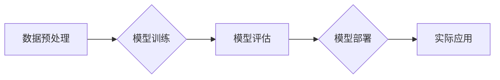

> AI大模型，创业，竞争优势，商业应用，技术趋势，模型训练，部署优化，数据策略

## 1. 背景介绍

人工智能（AI）技术近年来取得了飞速发展，特别是大模型的涌现，为各行各业带来了前所未有的机遇。大模型，是指参数规模庞大、训练数据海量的人工智能模型，具备强大的泛化能力和学习能力，能够在自然语言处理、计算机视觉、语音识别等领域取得突破性进展。

对于创业者来说，大模型技术蕴藏着巨大的商业价值。它可以帮助企业构建更智能、更便捷、更个性化的产品和服务，提升运营效率，创造新的商业模式。然而，大模型创业也面临着诸多挑战，例如高昂的训练成本、数据安全和隐私问题、模型部署和维护的复杂性等。

## 2. 核心概念与联系

### 2.1 大模型的定义与特点

大模型是指参数规模庞大、训练数据海量的人工智能模型。其特点包括：

* **参数规模巨大:** 大模型通常拥有数十亿甚至数千亿个参数，这使得它们能够学习更复杂的模式和关系。
* **训练数据海量:** 大模型的训练需要大量的文本、图像、音频等数据，这些数据通常来自互联网、数据库、传感器等各种来源。
* **泛化能力强:** 由于参数规模庞大、训练数据丰富，大模型能够在未见过的任务和数据上表现出较强的泛化能力。
* **学习能力强:** 大模型能够学习复杂的非线性关系，并进行推理、预测、生成等多种任务。

### 2.2 大模型的架构与训练

大模型的架构通常基于深度学习，例如 Transformer、BERT、GPT 等。训练过程主要包括以下步骤：

1. **数据预处理:** 将原始数据清洗、格式化、编码等。
2. **模型训练:** 使用训练数据训练模型参数，并通过反向传播算法不断优化模型性能。
3. **模型评估:** 使用测试数据评估模型性能，并根据评估结果进行模型调优。
4. **模型部署:** 将训练好的模型部署到生产环境中，用于实际应用。

### 2.3 大模型的商业应用

大模型在各个行业都有广泛的应用，例如：

* **自然语言处理:** 文本生成、机器翻译、问答系统、情感分析等。
* **计算机视觉:** 图像识别、物体检测、图像分割、视频分析等。
* **语音识别:** 语音转文本、语音合成、语音助手等。
* **推荐系统:** 商品推荐、内容推荐、用户画像等。
* **医疗健康:** 疾病诊断、药物研发、医疗影像分析等。

**Mermaid 流程图**



## 3. 核心算法原理 & 具体操作步骤

### 3.1 算法原理概述

大模型的训练主要基于深度学习算法，其中 Transformer 架构是目前最流行的模型架构之一。Transformer 架构的核心思想是利用注意力机制来捕捉文本序列中的长距离依赖关系，从而提高模型的理解和生成能力。

### 3.2 算法步骤详解

1. **词嵌入:** 将文本中的每个词转换为向量表示，以便模型能够理解词语的语义。
2. **多头注意力机制:** 利用多个注意力头来捕捉文本序列中的不同层次的依赖关系。
3. **前馈神经网络:** 对每个词的注意力输出进行进一步处理，提取更深层的语义信息。
4. **位置编码:** 为每个词添加位置信息，以便模型能够理解词语在句子中的顺序关系。
5. **解码器:** 利用编码器输出的语义信息，生成目标文本序列。

### 3.3 算法优缺点

**优点:**

* 能够捕捉长距离依赖关系，提高文本理解和生成能力。
* 训练效率高，能够在大型数据集上进行高效训练。
* 泛化能力强，能够在不同任务和数据上表现出良好的性能。

**缺点:**

* 参数规模庞大，训练成本高昂。
* 对训练数据质量要求高，训练数据不足会导致模型性能下降。
* 模型解释性较差，难以理解模型的决策过程。

### 3.4 算法应用领域

Transformer 架构及其变体在自然语言处理领域得到了广泛应用，例如：

* **机器翻译:** Google Translate、DeepL 等翻译工具。
* **文本摘要:** 自动生成文本摘要，例如新闻摘要、会议纪要等。
* **问答系统:** 能够回答用户提出的问题，例如搜索引擎、聊天机器人等。
* **文本生成:** 自动生成各种文本内容，例如小说、诗歌、新闻报道等。

## 4. 数学模型和公式 & 详细讲解 & 举例说明

### 4.1 数学模型构建

Transformer 架构的核心是注意力机制，其数学模型可以表示为：

$$
Attention(Q, K, V) = softmax(\frac{QK^T}{\sqrt{d_k}})V
$$

其中：

* $Q$：查询矩阵
* $K$：键矩阵
* $V$：值矩阵
* $d_k$：键向量的维度
* $softmax$：softmax 函数

### 4.2 公式推导过程

注意力机制的目的是计算每个词与其他词之间的相关性，并根据相关性权重来聚合信息。

1. 计算查询矩阵 $Q$ 与键矩阵 $K$ 的点积，并进行归一化处理，得到注意力权重矩阵。
2. 将注意力权重矩阵与值矩阵 $V$ 进行加权求和，得到最终的注意力输出。

### 4.3 案例分析与讲解

假设我们有一个句子 "The cat sat on the mat"，我们想要计算每个词与其他词之间的注意力权重。

1. 将每个词转换为向量表示，得到词嵌入矩阵。
2. 将词嵌入矩阵分别作为查询矩阵 $Q$、键矩阵 $K$ 和值矩阵 $V$。
3. 计算 $Q$ 与 $K$ 的点积，并进行归一化处理，得到注意力权重矩阵。
4. 将注意力权重矩阵与 $V$ 进行加权求和，得到每个词的注意力输出。

通过分析注意力权重矩阵，我们可以看到每个词与哪些其他词相关性较高，从而更好地理解句子中的语义关系。

## 5. 项目实践：代码实例和详细解释说明

### 5.1 开发环境搭建

* Python 3.7+
* PyTorch 1.7+
* CUDA 10.2+
* GPU

### 5.2 源代码详细实现

```python
import torch
import torch.nn as nn

class Transformer(nn.Module):
    def __init__(self, vocab_size, embedding_dim, num_heads, num_layers):
        super(Transformer, self).__init__()
        self.embedding = nn.Embedding(vocab_size, embedding_dim)
        self.transformer_layers = nn.ModuleList([
            nn.TransformerEncoderLayer(embedding_dim, num_heads)
            for _ in range(num_layers)
        ])
        self.linear = nn.Linear(embedding_dim, vocab_size)

    def forward(self, x):
        x = self.embedding(x)
        for layer in self.transformer_layers:
            x = layer(x)
        x = self.linear(x)
        return x
```

### 5.3 代码解读与分析

* `__init__` 方法：初始化模型参数，包括词嵌入层、Transformer encoder 层和线性输出层。
* `forward` 方法：定义模型的正向传播过程，包括词嵌入、Transformer encoder 层的堆叠和线性输出。

### 5.4 运行结果展示

训练好的模型可以用于各种自然语言处理任务，例如机器翻译、文本摘要、问答系统等。

## 6. 实际应用场景

### 6.1 商业应用案例

* **电商推荐:** 利用大模型分析用户行为数据，推荐个性化商品。
* **内容创作:** 利用大模型生成高质量的新闻报道、广告文案、社交媒体内容等。
* **客服机器人:** 利用大模型构建智能客服机器人，自动回复用户问题。

### 6.2 行业应用场景

* **医疗健康:** 利用大模型辅助医生诊断疾病、分析医疗影像、研发新药。
* **金融科技:** 利用大模型进行风险评估、欺诈检测、投资决策等。
* **教育科技:** 利用大模型个性化学习辅导、自动批改作业、生成学习资源等。

### 6.4 未来应用展望

大模型技术将继续推动人工智能的快速发展，并应用于更多领域，例如：

* **科学研究:** 利用大模型加速科学发现、模拟复杂系统。
* **艺术创作:** 利用大模型生成音乐、绘画、文学作品等。
* **人机交互:** 利用大模型构建更自然、更智能的人机交互方式。

## 7. 工具和资源推荐

### 7.1 学习资源推荐

* **书籍:**
    * 《深度学习》
    * 《自然语言处理》
    * 《Transformer 详解》
* **在线课程:**
    * Coursera: 深度学习
    * Udacity: 自然语言处理
    * fast.ai: 深度学习

### 7.2 开发工具推荐

* **框架:**
    * PyTorch
    * TensorFlow
* **库:**
    * HuggingFace Transformers
    * OpenAI API

### 7.3 相关论文推荐

* 《Attention Is All You Need》
* 《BERT: Pre-training of Deep Bidirectional Transformers for Language Understanding》
* 《GPT-3: Language Models are Few-Shot Learners》

## 8. 总结：未来发展趋势与挑战

### 8.1 研究成果总结

大模型技术取得了显著进展，在自然语言处理、计算机视觉等领域取得了突破性成果。

### 8.2 未来发展趋势

* **模型规模进一步扩大:** 参数规模将继续增长，模型能力将进一步提升。
* **多模态学习:** 将文本、图像、音频等多种模态数据融合在一起，构建更全面的模型。
* **可解释性增强:** 研究更有效的模型解释方法，提高模型的透明度和可信度。

### 8.3 面临的挑战

* **训练成本高昂:** 大模型的训练需要大量的计算资源和时间，成本很高。
* **数据安全和隐私问题:** 大模型的训练需要大量数据，如何保证数据安全和隐私是一个重要问题。
* **模型部署和维护的复杂性:** 大模型的部署和维护需要专业的技术人员和基础设施。

### 8.4 研究展望

未来，大模型技术将继续发展，并应用于更多领域，为人类社会带来更多福祉。

## 9. 附录：常见问题与解答

* **Q: 如何选择合适的模型架构？**
* **A:** 选择模型架构需要根据具体任务和数据特点进行考虑。

* **Q: 如何解决大模型训练的成本问题？**
* **A:** 可以采用模型压缩、知识蒸馏等技术来降低训练成本。

* **Q: 如何保证大模型的安全性？**
* **A:** 可以采用数据加密、模型审计等技术来保证大模型的安全性。


作者：禅与计算机程序设计艺术 / Zen and the Art of Computer Programming 
<end_of_turn>