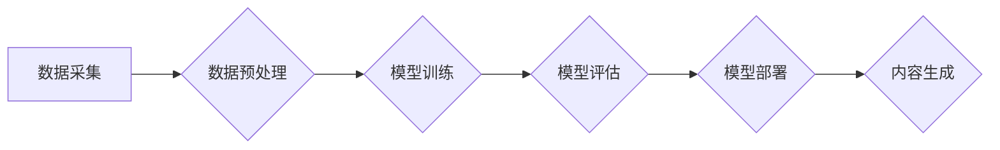

> AIGC, 文本生成, 图像生成, 代码生成, 深度学习, Transformer, 

## 1. 背景介绍

近年来，人工智能（AI）技术取得了飞速发展，特别是深度学习的突破，使得人工智能在各个领域展现出强大的应用潜力。其中，AIGC（人工智能生成内容）作为人工智能发展的重要方向之一，引起了广泛关注。AIGC是指利用人工智能技术自动生成各种类型的内容，例如文本、图像、音频、视频等。

AIGC技术能够帮助人们更高效地创作内容，解放人力资源，并为人们提供全新的内容体验。例如，AIGC可以帮助作家创作小说，帮助设计师生成创意设计，帮助程序员编写代码，甚至可以帮助艺术家创作艺术作品。

## 2. 核心概念与联系

AIGC的核心概念是利用深度学习模型学习大量数据，并根据学习到的知识和模式生成新的内容。

**AIGC 的核心技术主要包括：**

* **自然语言处理（NLP）：** 用于处理和理解人类语言，例如文本生成、机器翻译、问答系统等。
* **计算机视觉（CV）：** 用于理解和处理图像和视频，例如图像识别、物体检测、图像生成等。
* **语音识别和合成（ASR/TTS）：** 用于将语音转换为文本和文本转换为语音。

**AIGC 的工作流程：**



**AIGC 的应用场景：**

* **内容创作：** 自动生成新闻报道、小说、诗歌、剧本等。
* **营销推广：** 生成广告文案、社交媒体内容、产品描述等。
* **教育培训：** 生成个性化学习内容、自动批改作业等。
* **娱乐休闲：** 生成游戏场景、虚拟人物、音乐作品等。

## 3. 核心算法原理 & 具体操作步骤

### 3.1  算法原理概述

AIGC 的核心算法主要基于深度学习模型，其中 Transformer 架构在自然语言处理领域取得了显著的成果，并被广泛应用于 AIGC 中。

Transformer 模型的核心特点是利用注意力机制，能够捕捉文本序列中长距离依赖关系，从而更好地理解和生成文本内容。

### 3.2  算法步骤详解

1. **数据预处理：** 将原始数据进行清洗、格式化、编码等操作，使其能够被模型理解。
2. **模型训练：** 使用训练数据训练 Transformer 模型，通过反向传播算法不断调整模型参数，使其能够生成高质量的内容。
3. **模型评估：** 使用测试数据评估模型的性能，例如准确率、流畅度、多样性等。
4. **模型部署：** 将训练好的模型部署到生产环境中，用于生成实际内容。

### 3.3  算法优缺点

**优点：**

* **生成高质量内容：** Transformer 模型能够生成流畅、语法正确的文本内容，并能够捕捉文本的语义和情感。
* **处理长距离依赖关系：** 注意力机制能够有效地捕捉文本序列中长距离依赖关系，从而生成更连贯、更有逻辑的文本内容。
* **可扩展性强：** Transformer 模型可以很容易地扩展到处理更大的数据集和更长的文本序列。

**缺点：**

* **训练成本高：** Transformer 模型参数量大，训练需要大量的计算资源和时间。
* **数据依赖性强：** 模型的性能取决于训练数据的质量和数量。
* **缺乏可解释性：** Transformer 模型的内部工作机制比较复杂，难以解释模型的决策过程。

### 3.4  算法应用领域

* **文本生成：** 自动生成新闻报道、小说、诗歌、剧本等。
* **机器翻译：** 将文本从一种语言翻译成另一种语言。
* **问答系统：** 回答用户提出的问题。
* **聊天机器人：** 与用户进行自然语言对话。

## 4. 数学模型和公式 & 详细讲解 & 举例说明

### 4.1  数学模型构建

Transformer 模型的核心是注意力机制，它通过计算词语之间的相关性来理解文本的语义关系。

**注意力机制的数学公式：**

$$
Attention(Q, K, V) = softmax(\frac{QK^T}{\sqrt{d_k}})V
$$

其中：

* $Q$：查询矩阵
* $K$：键矩阵
* $V$：值矩阵
* $d_k$：键向量的维度
* $softmax$：softmax 函数

**注意力机制的解释：**

* 查询矩阵 $Q$ 表示当前词语的信息。
* 键矩阵 $K$ 表示所有词语的信息。
* 值矩阵 $V$ 表示所有词语的含义。
* $QK^T$ 计算查询矩阵和键矩阵的点积，表示词语之间的相关性。
* $softmax$ 函数将点积结果归一化，得到每个词语的注意力权重。
* 最后，将注意力权重与值矩阵相乘，得到每个词语的加权平均值，作为当前词语的上下文信息。

### 4.2  公式推导过程

注意力机制的公式推导过程比较复杂，涉及到线性代数、概率论等数学知识。

**简要的推导过程：**

1. 计算查询矩阵 $Q$ 和键矩阵 $K$ 的点积。
2. 对点积结果进行归一化，得到注意力权重。
3. 将注意力权重与值矩阵 $V$ 相乘，得到每个词语的加权平均值。

### 4.3  案例分析与讲解

**举例说明：**

假设我们有一个句子 "The cat sat on the mat"，我们想要计算 "sat" 这个词语的上下文信息。

* 查询矩阵 $Q$ 将包含 "sat" 这个词语的信息。
* 键矩阵 $K$ 将包含所有词语的信息，例如 "The", "cat", "sat", "on", "the", "mat"。
* 值矩阵 $V$ 将包含所有词语的含义。

通过计算注意力权重，我们可以发现 "sat" 这个词语与 "cat" 和 "on" 两个词语的相关性最高，因此 "sat" 的上下文信息主要来自这两个词语。

## 5. 项目实践：代码实例和详细解释说明

### 5.1  开发环境搭建

* Python 3.7+
* TensorFlow 或 PyTorch 深度学习框架
* CUDA 和 cuDNN (可选，用于 GPU 加速)

### 5.2  源代码详细实现

```python
import tensorflow as tf

# 定义 Transformer 模型
class Transformer(tf.keras.Model):
    def __init__(self, vocab_size, embedding_dim, num_heads, num_layers):
        super(Transformer, self).__init__()
        self.embedding = tf.keras.layers.Embedding(vocab_size, embedding_dim)
        self.transformer_layers = tf.keras.layers.StackedRNNCells([
            tf.keras.layers.Attention(num_heads=num_heads)
            for _ in range(num_layers)
        ])

    def call(self, inputs):
        embeddings = self.embedding(inputs)
        outputs = self.transformer_layers(embeddings)
        return outputs

# 实例化 Transformer 模型
model = Transformer(vocab_size=10000, embedding_dim=128, num_heads=8, num_layers=6)

# 训练模型
model.compile(optimizer='adam', loss='sparse_categorical_crossentropy', metrics=['accuracy'])
model.fit(train_data, train_labels, epochs=10)

# 生成文本
generated_text = model.predict(test_data)
```

### 5.3  代码解读与分析

* **模型定义：** 代码定义了一个 Transformer 模型，包含嵌入层、多头注意力层和循环神经网络层。
* **数据处理：** 代码需要将文本数据转换为数字表示，例如使用词嵌入技术。
* **模型训练：** 代码使用 Adam 优化器和交叉熵损失函数训练模型。
* **文本生成：** 代码使用训练好的模型生成新的文本内容。

### 5.4  运行结果展示

运行结果展示需要根据具体的项目和数据集进行分析。

## 6. 实际应用场景

### 6.1  新闻生成

AIGC 可以自动生成新闻报道，例如从数据源中提取信息，并将其组织成新闻文章。

### 6.2  小说创作

AIGC 可以帮助作家创作小说，例如生成情节、人物、对话等。

### 6.3  代码生成

AIGC 可以帮助程序员编写代码，例如根据需求生成代码片段或整个程序。

### 6.4  未来应用展望

AIGC 的应用场景还在不断扩展，未来可能会应用于更多领域，例如：

* **个性化教育：** 生成个性化的学习内容和练习题。
* **医疗诊断：** 辅助医生进行疾病诊断。
* **艺术创作：** 生成音乐、绘画、雕塑等艺术作品。

## 7. 工具和资源推荐

### 7.1  学习资源推荐

* **书籍：**
    * 《深度学习》
    * 《自然语言处理》
* **在线课程：**
    * Coursera
    * edX
    * fast.ai

### 7.2  开发工具推荐

* **TensorFlow：** 开源深度学习框架。
* **PyTorch：** 开源深度学习框架。
* **Hugging Face Transformers：** 提供预训练 Transformer 模型和工具。

### 7.3  相关论文推荐

* **Attention Is All You Need：** Transformer 模型的原始论文。
* **BERT：** 基于 Transformer 的预训练语言模型。
* **GPT-3：** 基于 Transformer 的文本生成模型。

## 8. 总结：未来发展趋势与挑战

### 8.1  研究成果总结

AIGC 技术取得了显著的进展，能够生成高质量的文本、图像、音频等内容。

### 8.2  未来发展趋势

* **模型规模和能力的提升：** 未来 AIGC 模型将会更加强大，能够处理更复杂的任务。
* **多模态生成：** AIGC 将会能够生成多种类型的媒体内容，例如文本、图像、音频、视频等。
* **个性化定制：** AIGC 将会更加个性化，能够根据用户的需求生成定制化的内容。

### 8.3  面临的挑战

* **数据安全和隐私：** AIGC 模型需要大量数据进行训练，如何保证数据安全和隐私是一个重要挑战。
* **模型可解释性和信任度：** AIGC 模型的决策过程比较复杂，难以解释，如何提高模型的可解释性和信任度是一个重要问题。
* **伦理和社会影响：** AIGC 技术可能会带来一些伦理和社会问题，例如内容虚假、版权侵权等，需要进行深入的探讨和研究。

### 8.4  研究展望

未来 AIGC 研究将继续朝着更强大、更安全、更可解释的方向发展，并为人类社会带来更多价值。

## 9. 附录：常见问题与解答

**常见问题：**

* **AIGC 会取代人类吗？**

**解答：** AIGC 是一种工具，可以帮助人类提高效率，但不会取代人类。人类的创造力和想象力是 AIGC 所无法替代的。

* **AIGC 的内容是否真实可靠？**

**解答：** AIGC 生成的内容需要经过人工审核，才能保证其真实性和可靠性。

* **如何使用 AIGC 技术？**

**解答：** 可以使用现有的 AIGC 平台或工具，也可以自己开发 AIGC 应用。

**作者：禅与计算机程序设计艺术 / Zen and the Art of Computer Programming**


<end_of_turn>