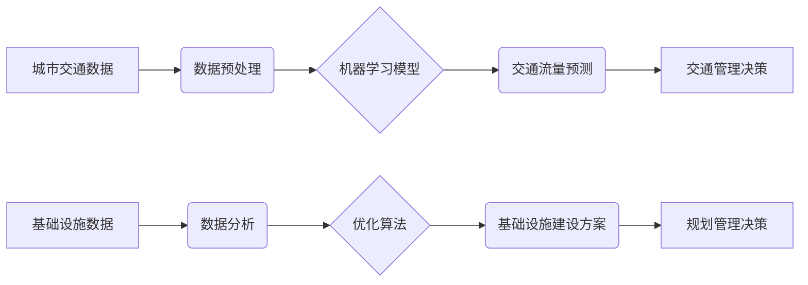

> 人工智能，城市交通，基础设施建设，规划管理，可持续发展，机器学习，深度学习，优化算法

## 1. 背景介绍

随着全球人口的持续增长和城市化的加速推进，城市交通拥堵、基础设施老化、资源消耗过快等问题日益突出，严重影响着城市的可持续发展。传统的人工规划和管理方式难以有效应对这些挑战，亟需引入先进的智能技术进行革新。

人工智能（AI）作为一门新兴的科技领域，凭借其强大的数据处理能力、学习能力和决策能力，为解决城市交通和基础设施建设与规划管理难题提供了新的思路和解决方案。

## 2. 核心概念与联系

**2.1 城市交通与基础设施建设规划管理**

城市交通与基础设施建设规划管理是一个复杂的系统工程，涉及到交通网络规划、基础设施建设、资源分配、环境保护等多个方面。传统的规划管理方式主要依赖于人工经验和数据分析，效率低下，难以适应快速变化的城市环境。

**2.2 人工智能技术应用**

人工智能技术可以应用于城市交通与基础设施建设规划管理的各个环节，例如：

* **交通流量预测:** 利用机器学习算法分析历史交通数据，预测未来交通流量，为交通管理提供决策依据。
* **交通拥堵缓解:** 通过智能交通信号灯控制、车辆路径规划等技术，优化交通流量，缓解交通拥堵。
* **基础设施建设优化:** 利用AI算法分析基础设施需求和资源配置，优化基础设施建设方案，提高资源利用效率。
* **环境保护:** 利用AI技术监测环境污染，优化交通运输路线，减少碳排放，促进城市可持续发展。

**2.3 AI与人类计算的协同**

AI技术与人类计算的协同是实现城市交通与基础设施建设规划管理智能化升级的关键。人类专家提供专业知识和决策判断，AI技术提供数据分析、模型预测和优化建议，两者相互补充，共同推动城市发展。

**2.4 架构图**



## 3. 核心算法原理 & 具体操作步骤

**3.1 算法原理概述**

本节将介绍用于城市交通与基础设施建设规划管理的典型AI算法原理，包括机器学习算法和优化算法。

* **机器学习算法:**

    * **回归算法:** 用于预测连续数值，例如交通流量预测。
    * **分类算法:** 用于分类数据，例如交通拥堵程度分类。
    * **聚类算法:** 用于将数据分组，例如用户出行模式聚类。

* **优化算法:**

    * **遗传算法:** 启发式算法，模拟自然选择机制，用于寻找最优解。
    * **模拟退火算法:** 启发式算法，通过随机搜索和温度机制，用于寻找局部最优解。
    * **粒子群算法:** 启发式算法，模拟鸟群觅食行为，用于寻找全局最优解。

**3.2 算法步骤详解**

以交通流量预测为例，详细介绍机器学习算法的具体操作步骤：

1. **数据收集:** 收集历史交通数据，包括时间、地点、交通流量等信息。
2. **数据预处理:** 对数据进行清洗、转换、特征提取等操作，使其适合模型训练。
3. **模型选择:** 选择合适的机器学习模型，例如线性回归、支持向量机等。
4. **模型训练:** 利用训练数据训练模型，调整模型参数，使其能够准确预测交通流量。
5. **模型评估:** 利用测试数据评估模型性能，例如准确率、均方误差等。
6. **模型部署:** 将训练好的模型部署到实际应用环境中，用于实时预测交通流量。

**3.3 算法优缺点**

* **机器学习算法:**

    * **优点:** 能够自动学习数据模式，预测未来趋势，适应动态变化的城市环境。
    * **缺点:** 需要大量数据进行训练，对数据质量要求高，解释性较差。

* **优化算法:**

    * **优点:** 可以找到最优或近似最优解，提高资源利用效率。
    * **缺点:** 计算复杂度高，易陷入局部最优解。

**3.4 算法应用领域**

* **交通流量预测:** 预测交通流量，优化交通信号灯控制，缓解交通拥堵。
* **车辆路径规划:** 为车辆规划最优路径，提高出行效率。
* **基础设施建设优化:** 优化基础设施建设方案，提高资源利用效率。
* **城市规划:** 预测城市发展趋势，优化城市布局。

## 4. 数学模型和公式 & 详细讲解 & 举例说明

**4.1 数学模型构建**

城市交通与基础设施建设规划管理涉及到多个复杂因素，可以使用数学模型进行建模和分析。例如，可以构建交通流量模型、基础设施需求模型、资源分配模型等。

**4.2 公式推导过程**

以交通流量预测为例，可以构建以下线性回归模型：

$$
y = \beta_0 + \beta_1 x_1 + \beta_2 x_2 + ... + \beta_n x_n + \epsilon
$$

其中：

* $y$：预测的交通流量
* $x_1, x_2, ..., x_n$：影响交通流量的特征变量，例如时间、地点、天气等
* $\beta_0, \beta_1, ..., \beta_n$：模型参数
* $\epsilon$：随机误差

通过最小二乘法，可以求解模型参数，得到最优的交通流量预测模型。

**4.3 案例分析与讲解**

假设我们想要预测某条道路的交通流量，收集了以下数据：

* 时间：早上7点、8点、9点、10点
* 地点：某条道路
* 交通流量：1000辆、1500辆、2000辆、1800辆

我们可以使用线性回归模型进行预测，例如：

$$
y = 500 + 500x
$$

其中：

* $y$：预测的交通流量
* $x$：时间（以小时为单位）

根据模型，我们可以预测：

* 上午9点（x=9）的交通流量为：500 + 500 * 9 = 5000辆

## 5. 项目实践：代码实例和详细解释说明

**5.1 开发环境搭建**

本项目使用Python语言进行开发，需要安装以下软件：

* Python 3.x
* Jupyter Notebook
* scikit-learn

**5.2 源代码详细实现**

```python
import pandas as pd
from sklearn.linear_model import LinearRegression

# 数据加载
data = pd.read_csv('traffic_data.csv')

# 数据预处理
X = data[['time']]
y = data['traffic']

# 模型训练
model = LinearRegression()
model.fit(X, y)

# 模型预测
new_time = 9
new_traffic = model.predict([[new_time]])
print(f'预测的交通流量为：{new_traffic[0]}辆')
```

**5.3 代码解读与分析**

* 数据加载：使用pandas库读取交通数据文件。
* 数据预处理：将时间作为特征变量，交通流量作为目标变量。
* 模型训练：使用scikit-learn库的线性回归模型进行训练。
* 模型预测：使用训练好的模型预测新的时间点的交通流量。

**5.4 运行结果展示**

运行代码后，会输出预测的交通流量值。

## 6. 实际应用场景

**6.1 交通流量预测与管理**

* 智能交通信号灯控制：根据实时交通流量预测，动态调整信号灯时间，优化交通流量。
* 高速公路拥堵预警：预测高速公路拥堵情况，及时发布预警信息，引导车辆避开拥堵路段。
* 公共交通优化：根据乘客出行需求预测，优化公交线路和班次，提高公共交通效率。

**6.2 基础设施建设优化**

* 道路建设规划：预测未来道路需求，优化道路建设方案，提高道路利用率。
* 桥梁维护管理：利用传感器数据和机器学习算法，预测桥梁老化程度，及时进行维护保养。
* 水利设施管理：预测水资源需求，优化水利设施建设和运营，提高水资源利用效率。

**6.3 城市规划与管理**

* 城市发展趋势预测：利用AI技术分析城市发展数据，预测未来城市发展趋势，为城市规划提供决策依据。
* 城市环境监测：利用传感器网络和机器学习算法，监测城市空气质量、水质等环境指标，及时采取措施改善环境。
* 城市资源管理：优化城市资源配置，提高资源利用效率，促进城市可持续发展。

**6.4 未来应用展望**

随着人工智能技术的不断发展，其在城市交通与基础设施建设规划管理领域的应用将更加广泛和深入。例如：

* **无人驾驶技术:** 利用无人驾驶技术，优化交通流量，提高道路利用率。
* **智能城市平台:** 建立智能城市平台，整合城市数据，实现城市管理的智能化。
* **个性化服务:** 利用AI技术，提供个性化的交通出行服务和基础设施服务。

## 7. 工具和资源推荐

**7.1 学习资源推荐**

* **在线课程:** Coursera、edX、Udacity等平台提供人工智能、机器学习、深度学习等方面的在线课程。
* **书籍:** 《深度学习》、《机器学习实战》、《Python机器学习》等书籍。
* **开源项目:** TensorFlow、PyTorch、scikit-learn等开源项目。

**7.2 开发工具推荐**

* **Python:** 作为人工智能开发的主要语言，Python拥有丰富的库和工具。
* **Jupyter Notebook:** 用于编写和运行Python代码，可视化数据分析结果。
* **IDE:** PyCharm、VS Code等IDE可以提高开发效率。

**7.3 相关论文推荐**

* **交通流量预测:** "Deep Learning for Traffic Flow Prediction"
* **基础设施建设优化:** "Optimization Algorithms for Infrastructure Planning and Design"
* **城市规划:** "Artificial Intelligence for Urban Planning and Management"

## 8. 总结：未来发展趋势与挑战

**8.1 研究成果总结**

人工智能技术在城市交通与基础设施建设规划管理领域取得了显著成果，例如交通流量预测、基础设施优化、城市规划等方面。

**8.2 未来发展趋势**

* **模型复杂度提升:** 利用更复杂的深度学习模型，提高预测精度和分析能力。
* **数据融合:** 将来自不同来源的数据融合，构建更全面的城市模型。
* **边缘计算:** 将AI模型部署到边缘设备，实现实时数据处理和决策。
* **可解释性增强:** 研究更可解释的AI模型，提高模型决策的透明度和可信度。

**8.3 面临的挑战**

* **数据质量:** AI模型依赖于高质量的数据，数据不完整、不准确会影响模型性能。
* **计算资源:** 训练复杂的AI模型需要大量的计算资源，成本较高。
* **伦理问题:** AI技术应用需要考虑伦理问题，例如数据隐私、算法偏见等。

**8.4 研究展望**

未来，需要继续加强人工智能技术在城市交通与基础设施建设规划管理领域的应用研究，解决上述挑战，推动城市智能化发展。

## 9. 附录：常见问题与解答

**9.1 如何选择合适的AI算法？**

选择合适的AI算法需要根据具体应用场景和数据特点进行分析。例如，对于预测连续数值，可以使用回归算法；对于分类数据，可以使用分类算法。

**9.2 如何评估AI